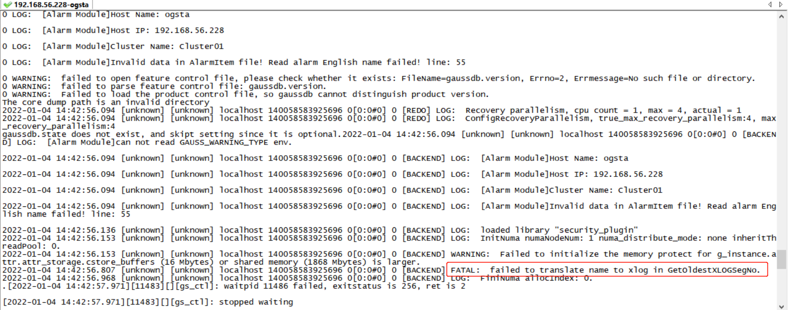

# opengauss 数据库-PITR 恢复<a name="ZH-CN_TOPIC_0000001187055084"></a>

当数据库崩溃或希望回退到数据库之前的某一状态时，openGauss 的即时恢复功能（Point-In-Time Recovery，简称 PITR）可以支持恢复到备份归档数据之后的任意时间点

## 前提条件<a name="section43687252011"></a>

全库备份文件：base.tar.gz; 归档的 wal 日志文件，归档备份目录/ogarchive

## 备份数据文件<a name="section134971137011"></a>

根据环境变量找到当前的数据文件目录，并重命名数据文件目录

请注意案例中的 /opt/huawei/install/data/ 为本示例中的数据文件目录，请根据实际情况修改此输入值

```
[omm@ogsta ~]$ echo $DATADIR
/opt/huawei/install/data/dn
[omm@ogsta ~]$ cd /opt/huawei/install/data/
[omm@ogsta data]$ mv dn/ dn_bak
[omm@ogsta data]$ ll
total 4
drwx------ 23 omm dbgrp 4096 Jan  4 13:10 dn_bak
[omm@ogsta data]$ mkdir dn
```

- 全量备份解压

  base.tar.gz 压缩文件是通过 gs_basebackup 压缩，因此需要采用两次解压，gunzip 和 gs_tar

  ```
  [omm@ogsta ogarchive]$ gunzip base.tar.gz
  [omm@ogsta ogarchive]$ gs_tar -D /opt/huawei/install/data/dn  -F base.tar
  [omm@ogsta ogarchive]$ cd /opt/huawei/install/data/dn
  [omm@ogsta dn]$ ls
  asp_data              cacert.pem          mot.conf      pg_hba.conf       pg_multixact  pg_snapshots  pg_xlog               server.crt         term_file
  backup_label          full_backup_label   pg_clog       pg_hba.conf.bak   pg_notify     pg_stat_tmp   postgresql.conf       server.key         undo
  backup_label.old      global              pg_csnlog     pg_hba.conf.lock  pg_perf       pg_tblspc     postgresql.conf.bak   server.key.cipher
  base                  gs_profile          pg_ctl.lock   pg_ident.conf     pg_replslot   pg_twophase   postgresql.conf.lock  server.key.rand
  build_completed.done  gswlm_userinfo.cfg  pg_errorinfo  pg_llog           pg_serial     PG_VERSION    rewind_lable          sql_monitor
  [omm@ogsta dn]$
  ```

## 清空 pg_xlog<a name="section569053817217"></a>

该目录在数据文件目录中

```
[omm@ogsta pg_xlog]$ pwd
/opt/huawei/install/data/dn/pg_xlog
[omm@ogsta pg_xlog]$ ll
total 32768
-rw------- 1 omm dbgrp 16777216 Jan  4 13:38 000000010000000000000013
-rw------- 1 omm dbgrp 16777216 Jan  4 13:38 000000010000000000000014
drwx------ 2 omm dbgrp       80 Jan  4 13:38 archive_status
[omm@ogsta pg_xlog]$ rm -rf *
[omm@ogsta pg_xlog]$ ll
total 0
```

## 配置 recovery.conf 文件<a name="section5673188313"></a>

该配置文件请在数据文件目录中修改

```
[omm@ogsta dn]$ pwd
/opt/huawei/install/data/dn
[omm@ogsta dn]$ cat recovery.conf
restore_command = 'cp /ogarchive/%f %p'
```

## 数据库启动<a name="section952318461313"></a>

```
gs_ctl -D /opt/huawei/install/data/dn start
```

这时可能遇到 failed to translate name to xlog in GetOldestXLOGSegNo 报错，需要如下的解决方法



## 复制归档日志文件<a name="section24918359419"></a>

以上的报错，是由于日志文件问题，根据 recovery.conf 文件内容，只是把归档目录中的文件自动复制到 pg_xlog 目录中，不如直接手动把归档日志文件复制到 pg_xlog 目录中

```
cd /ogarchive/
cp * /opt/huawei/install/data/dn/pg_xlog/
```

## 重启<a name="section126431352341"></a>

```
gs_ctl -D /opt/huawei/install/data/dn start
```
