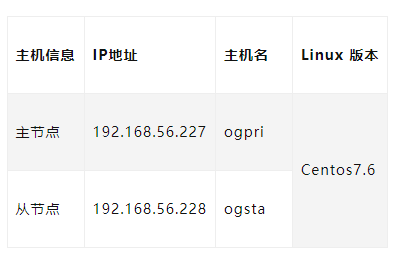

# opengauss 数据库-主从搭建<a name="ZH-CN_TOPIC_0000001186895102"></a>

## 环境说明<a name="section126441641194310"></a>



## 软件下载<a name="section1543871374410"></a>

opengauss 下载地址：https://opengauss.org/zh/download/

## 环境准备<a name="section141911336174418"></a>

- 关闭 SELINUX

修改 /etc/selinux/config 文件中的“SELINUX”值为“disabled

```
[root@ogpri openGauss]# more /etc/selinux/config
# This file controls the state of SELinux on the system.
# SELINUX= can take one of these three values:
#     enforcing - SELinux security policy is enforced.
#     permissive - SELinux prints warnings instead of enforcing.
#     disabled - No SELinux policy is loaded.
SELINUX=disabled
# SELINUXTYPE= can take one of three values:
#     targeted - Targeted processes are protected,
#     minimum - Modification of targeted policy. Only selected processes are protected.
#     mls - Multi Level Security protection.
SELINUXTYPE=targeted
```

- 关闭防火墙并禁止开机重启

  ```
  systemctl disable firewalld.service
  systemctl stop firewalld.service
  ```

- 设置 root 用户远程登陆

  将 PermitRootLogin 改为 yes。

  ```
  vim /etc/ssh/sshd_config
  PermitRootLogin yes
  ```

  修改后生效

  ```
  systemctl restart sshd.service
  ```

- 关闭透明大页

  ```
  echo never > /sys/kernel/mm/transparent_hugepage/enabled
  ```

## 数据库安装包依赖<a name="section17368620164612"></a>

root 用户下执行，所有的节点都要安装，建议配置本地 yum 源

```
yum -y install libaio-devel flex bison ncurses-devel glibc-devel patch redhat-lsb-core readline-devel
```

- Python3 依赖包

  ```
  yum install bzip2-devel db4-devel gdbm-devel libpcap-devel  openssl openssl-devel sqlite-devel tk-devel xz-devel zlib* gcc*
  ```

- 安装 python3

  ```
  tar -xvf Python-3.6.8.tar.xz
  cd Python-3.6.8/
  ./configure --prefix=/usr/local/python3 --enable-shared CFLAGS=-fPIC
  make && make install
  ```

- 设置 python3 软连接

  ```
  ln -s /usr/local/Python3/bin/python3 /usr/bin/python3
  ln -s /usr/local/python3/bin/pip3 /usr/bin/pip3
  ```

- 设置 python3 环境变量

  ```
  vi /etc/profile
  ```

- 安装 python3

  ```
  export PYTHON_HOME=/usr/local/python3.6.8
  export PATH=$PATH:$PYTHON_HOME/bin
  :wq
  Source /etc/profile
  ```

- 验证安装结果

  ```
  [root@ogpri ~]# python3
  Python 3.6.8 (default, Dec 27 2021, 21:52:53)
  [GCC 4.8.5 20150623 (Red Hat 4.8.5-36)] on linux
  Type "help", "copyright", "credits" or "license" for more information.
  >>>
  ```

## 安装 opengaussdb 数据库软件<a name="section13545115204914"></a>

数据库软件安装，如没有特殊说明，均在主节点执行，执行用户为 root

- 创建数据库软件目录

  ```
  mkdir -p /opt/software/openGauss
  chmod 755 -R /opt/software
  ```

- 创建 XML 配置文件

  如果是验证安装测试使用，建议修改其中的 ip 地址和 hostname，

  ```
  vi /opt/software/openGauss/cluster_config.xml
  ```

  ```
  <?xml version="1.0" encoding="UTF-8"?>

  <ROOT>
      <!-- openGauss整体信息 -->
      <CLUSTER>
          <!-- 数据库名称 -->
          <PARAM name="clusterName" value="Cluster01" />
          <!-- 数据库节点名称(hostname) -->
          <PARAM name="nodeNames" value="ogpri,ogsta" />
          <!-- 数据库安装目录-->
          <PARAM name="gaussdbAppPath" value="/opt/huawei/install/app" />
          <!-- 日志目录-->
          <PARAM name="gaussdbLogPath" value="/var/log/omm" />
          <!-- 临时文件目录-->
          <PARAM name="tmpMppdbPath" value="/opt/huawei/tmp"/>
          <!-- 数据库工具目录-->
          <PARAM name="gaussdbToolPath" value="/opt/huawei/install/om" />
          <!-- 数据库core文件目录-->
          <PARAM name="corePath" value="/opt/huawei/corefile"/>
          <!-- 节点IP，与数据库节点名称列表一一对应 -->
          <PARAM name="backIp1s" value="192.168.56.227,192.168.56.228"/>

      </CLUSTER>
      <!-- 每台服务器上的节点部署信息 -->
      <DEVICELIST>
          <!-- 节点1上的部署信息 -->
          <DEVICE sn="ogpri">
              <!-- 节点1的主机名称 -->
              <PARAM name="name" value="ogpri"/>
              <!-- 节点1所在的AZ及AZ优先级 -->
             <PARAM name="azName" value="AZ1"/>
              <PARAM name="azPriority" value="1"/>
              <!-- 节点1的IP，如果服务器只有一个网卡可用，将backIP1和sshIP1配置成同一个IP -->
              <PARAM name="backIp1" value="192.168.56.227"/>
              <PARAM name="sshIp1" value="192.168.56.227"/>

              <!--dn-->
              <PARAM name="dataNum" value="1"/>
              <PARAM name="dataPortBase" value="26000"/>
              <PARAM name="dataNode1" value="/opt/huawei/install/data/dn,ogsta,/opt/huawei/install/data/dn"/>
              <PARAM name="dataNode1_syncNum" value="0"/>
          </DEVICE>


          <!-- 节点2上的部署信息 -->
          <DEVICE sn="ogsta">
              <!-- 节点2的主机名称 -->
              <PARAM name="name" value="ogsta"/>
              <!-- 节点2所在的AZ及AZ优先级 -->
              <PARAM name="azName" value="AZ1"/>
              <PARAM name="azPriority" value="1"/>
              <!-- 节点2的IP，如果服务器只有一个网卡可用，将backIP1和sshIP1配置成同一个IP -->
              <PARAM name="backIp1" value="192.168.56.228"/>
              <PARAM name="sshIp1" value="192.168.56.228"/>
         </DEVICE>
      </DEVICELIST>
  </ROOT>
  ```

- 预安装

  在安装过程中请输入 root,omm 两个用户的密码

  ```
  /opt/software/openGauss/script/gs_preinstall -U omm -G dbgrp -X /opt/software/openGauss/cluster_config.xml
  ```

  安装日志如下：

  ```
  [root@ogpri script]# /opt/software/openGauss/script/gs_preinstall -U omm -G dbgrp -X /opt/software/openGauss/cluster_config.xml
  Parsing the configuration file.
  Successfully parsed the configuration file.
  Installing the tools on the local node.
  Successfully installed the tools on the local node.
  Are you sure you want to create trust for root (yes/no)? yes
  Please enter password for root.
  Password:

  Creating SSH trust for the root permission user.
  Checking network information.
  All nodes in the network are Normal.
  Successfully checked network information.
  Creating SSH trust.
  Creating the local key file.
  Successfully created the local key files.
  Appending local ID to authorized_keys.
  Successfully appended local ID to authorized_keys.
  Updating the known_hosts file.
  Successfully updated the known_hosts file.
  Appending authorized_key on the remote node.
  Successfully appended authorized_key on all remote node.
  Checking common authentication file content.
  Successfully checked common authentication content.
  Distributing SSH trust file to all node.
  Successfully distributed SSH trust file to all node.
  Verifying SSH trust on all hosts.
  Successfully verified SSH trust on all hosts.
  Successfully created SSH trust.
  Successfully created SSH trust for the root permission user.
  Setting pssh path
  Successfully set core path.
  Distributing package.
  Begin to distribute package to tool path.
  Successfully distribute package to tool path.
  Begin to distribute package to package path.
  Successfully distribute package to package path.
  Successfully distributed package.
  Are you sure you want to create the user[omm] and create trust for it (yes/no)? yes
  Preparing SSH service.
  Successfully prepared SSH service.
  Installing the tools in the cluster.
  Successfully installed the tools in the cluster.
  Checking hostname mapping.
  Successfully checked hostname mapping.
  reating SSH trust for [omm] user.
  Please enter password for current user[omm].
  Password:

  Checking network information.
  All nodes in the network are Normal.
  Successfully checked network information.
  Creating SSH trust.
  Creating the local key file.
  Successfully created the local key files.
  Appending local ID to authorized_keys.
  Successfully appended local ID to authorized_keys.
  Updating the known_hosts file.
  Successfully updated the known_hosts file.
  Appending authorized_key on the remote node.
  Successfully appended authorized_key on all remote node.
  Checking common authentication file content.
  Successfully checked common authentication content.
  Distributing SSH trust file to all node.
  Successfully distributed SSH trust file to all node.
  Verifying SSH trust on all hosts.
  Successfully verified SSH trust on all hosts.
  Successfully created SSH trust.
  Successfully created SSH trust for [omm] user.
  Checking OS software.
  Successfully check os software.
  Checking OS version.
  Successfully checked OS version.
  Creating cluster's path.
  Successfully created cluster's path.
  Set and check OS parameter.
  Setting OS parameters.
  Successfully set OS parameters.
  Warning: Installation environment contains some warning messages.
  Please get more details by "/opt/software/openGauss/script/gs_checkos -i A -h ogpri,ogsta --detail".
  Set and check OS parameter completed.
  Preparing CRON service.
  Successfully prepared CRON service.
  Setting user environmental variables.
  Successfully set user environmental variables.
  Setting the dynamic link library.
  Successfully set the dynamic link library.
  Setting Core file
  Successfully set core path.
  Setting pssh path
  Successfully set pssh path.
  Setting Cgroup.
  Successfully set Cgroup.
  Set ARM Optimization.
  No need to set ARM Optimization.
  Fixing server package owner.
  Setting finish flag.
  Successfully set finish flag.
  Preinstallation succeeded.
  ```

- 切换用户执行安装

  ```
  su - ommgs_install -X /opt/software/openGauss/cluster_config.xml
  ```

  安装日志如下：

  ```
  Parsing the configuration file.
  Check preinstall on every node.
  Successfully checked preinstall on every node.
  Creating the backup directory.
  Successfully created the backup directory.
  begin deploy..
  Installing the cluster.
  begin prepare Install Cluster..
  Checking the installation environment on all nodes.
  begin install Cluster..
  Installing applications on all nodes.
  Successfully installed APP.
  begin init Instance..
  encrypt cipher and rand files for database.
  Please enter password for database:
  Please repeat for database:
  begin to create CA cert files
  The sslcert will be generated in /opt/huawei/install/app/share/sslcert/om
  Cluster installation is completed.
  Configuring.
  Deleting instances from all nodes.
  Successfully deleted instances from all nodes.
  Checking node configuration on all nodes.
  Initializing instances on all nodes.
  Updating instance configuration on all nodes.
  Check consistence of memCheck and coresCheck on database nodes.
  Successful check consistence of memCheck and coresCheck on all nodes.
  Configuring pg_hba on all nodes.
  Configuration is completed.
  Successfully started cluster.
  Successfully installed application.
  end deploy..
  ```

- 登陆验证

  ```
  [omm@ogpri dn]$ gsql -d postgres -p 26000
  gsql ((openGauss 2.1.0 build 590b0f8e) compiled at 2021-09-30 14:29:04 commit 0 last mr  )
  Non-SSL connection (SSL connection is recommended when requiring high-security)
  Type "help" for help.
  openGauss=#
  ```

- 查看主从状态

  ```
  gs_ctl -D  /opt/huawei/install/data/dn/ query
  ```

  信息如下：

  ```
  [2021-12-29 14:41:33.751][21110][][gs_ctl]: gs_ctl query ,datadir is /opt/huawei/install/data/dn
   HA state:
          local_role                     : Primary
          static_connections             : 1
          db_state                       : Normal
          detail_information             : Normal

   Senders info:
          sender_pid                     : 9716
          local_role                     : Primary
          peer_role                      : Standby
          peer_state                     : Normal
          state                          : Streaming
          sender_sent_location           : 0/401A080
          sender_write_location          : 0/401A080
          sender_flush_location          : 0/401A080
          sender_replay_location         : 0/401A080
          receiver_received_location     : 0/401A080
          receiver_write_location        : 0/401A080
          receiver_flush_location        : 0/401A080
          receiver_replay_location       : 0/401A080
          sync_percent                   : 100%
          sync_state                     : Quorum
          sync_priority                  : 1
          sync_most_available            : Off
          channel                        : 192.168.56.227:26001-->192.168.56.228:35144
   Receiver info:
  No information
  ```
