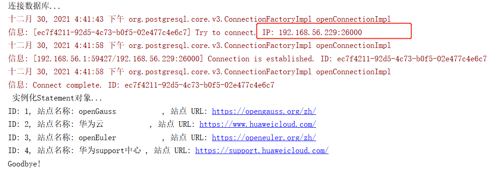
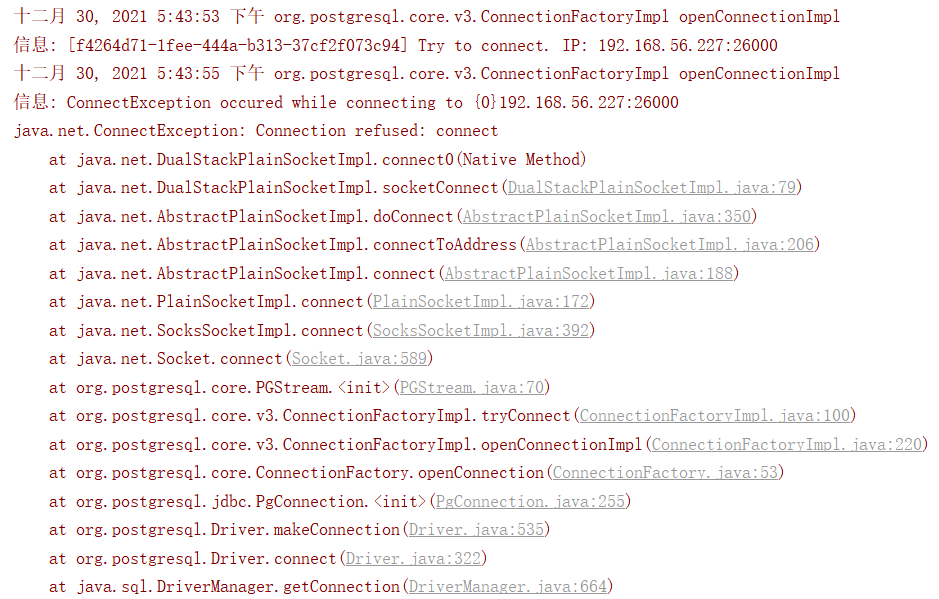
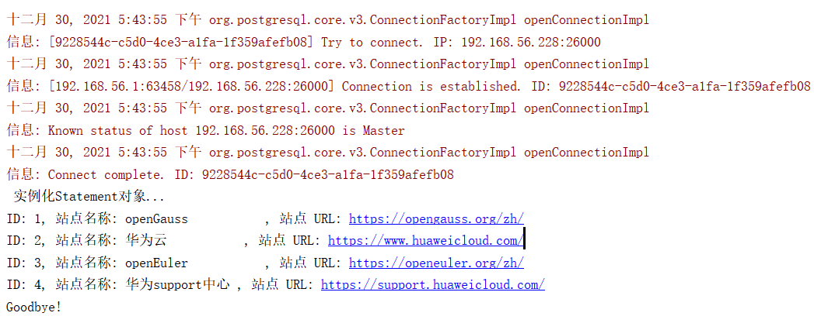

# opengauss 数据库-高可用 jdbc 使用方法<a name="ZH-CN_TOPIC_0000001187373550"></a>

## 驱动下载<a name="section1792013517253"></a>

下载 jdbc 驱动 openGauss-2.1.0-JDBC.tar.gz

下载地址：https://opengauss.org/zh/download/

## 表 demo 案例<a name="section17791161919252"></a>

```
create database test;
create schema demo;
CREATE TABLE demo.websites (
  id int NOT NULL,
  name char(20) NOT NULL DEFAULT '',
  url varchar(255) NOT NULL DEFAULT '',
  PRIMARY KEY (id)
);
COMMENT ON COLUMN demo.websites.name IS '站点名称';
INSERT INTO demo.websites VALUES

('1', 'openGauss', 'https://opengauss.org/zh/'),
('2', '华为云', 'https://www.huaweicloud.com/'),
('3', 'openEuler', 'https://openeuler.org/zh/'),
('4', '华为support中心', 'https://support.huaweicloud.com/');
```

## vip 使用方法<a name="section14562484258"></a>

请注意 192.168.56.229 为 mogha 组件中的 vip 地址

```
package com.company;
import java.sql.*;

public class openGaussSelect {
    static final String JDBC_DRIVER = "org.postgresql.Driver";
    static final String DB_URL = "jdbc:postgresql://192.168.56.229:26000/test";
    // 数据库的用户名与密码，需要根据自己的设置
    static final String USER = "test";
    static final String PASS = "zhou0815FANG";
    public static void main(String[] args) {
        Connection conn = null;
        Statement stmt = null;
        try{
            // 注册 JDBC 驱动
            Class.forName(JDBC_DRIVER);
            // 打开链接
            System.out.println("连接数据库...");
            conn = DriverManager.getConnection(DB_URL,USER,PASS);

            // 执行查询
            System.out.println(" 实例化Statement对象...");
            stmt = conn.createStatement();
            String sql;
            sql = "SELECT id, name, url FROM demo.websites";
            ResultSet rs = stmt.executeQuery(sql);
            // 展开结果集数据库
            while(rs.next()){
                // 通过字段检索
                int id  = rs.getInt("id");
                String name = rs.getString("name");
                String url = rs.getString("url");
                // 输出数据
                System.out.print("ID: " + id);
                System.out.print(", 站点名称: " + name);
                System.out.print(", 站点 URL: " + url);
                System.out.print("\n");
            }
            // 完成后关闭
            rs.close();
            stmt.close();
            conn.close();
        }catch(SQLException se){

            // 处理 JDBC 错误
            se.printStackTrace();
        }catch(Exception e){
            // 处理 Class.forName 错误
            e.printStackTrace();
        }finally{
            // 关闭资源
            try{
                if(stmt!=null) stmt.close();
            }catch(SQLException se2){
            }// 什么都不做
            try{
                if(conn!=null) conn.close();
            }catch(SQLException se){
                se.printStackTrace();
            }
        }
        System.out.println("Goodbye!");
    }
}
```

## 测试验证<a name="section81194212277"></a>



## JDBC 轮询<a name="section831183613287"></a>

使用 jdbc 中 targetServerType=master 属性

```
package com.company;

import java.sql.*;
public class openGaussSelect {
    static final String JDBC_DRIVER = "org.postgresql.Driver";
    static final String DB_URL = "jdbc:postgresql://192.168.56.227:26000,192.168.56.228:26000/test?targetServerType=master";
    // 数据库的用户名与密码，需要根据自己的设置
    static final String USER = "test";
    static final String PASS = "zhou0815FANG";
    public static void main(String[] args) {
        Connection conn = null;
        Statement stmt = null;
        try{
            // 注册 JDBC 驱动
            Class.forName(JDBC_DRIVER);

            // 打开链接
            System.out.println("连接数据库...");
            conn = DriverManager.getConnection(DB_URL,USER,PASS);

            // 执行查询
            System.out.println(" 实例化Statement对象...");
            stmt = conn.createStatement();
            String sql;
            sql = "SELECT id, name, url FROM demo.websites";
            ResultSet rs = stmt.executeQuery(sql);

            // 展开结果集数据库
            while(rs.next()){
                // 通过字段检索
                int id  = rs.getInt("id");
                String name = rs.getString("name");
                String url = rs.getString("url")

                // 输出数据
                System.out.print("ID: " + id);
                System.out.print(", 站点名称: " + name);

                System.out.print(", 站点 URL: " + url);
                System.out.print("\n");
            }
            // 完成后关闭
            rs.close();
            stmt.close();
            conn.close();
        }catch(SQLException se){
            // 处理 JDBC 错误
            se.printStackTrace();
        }catch(Exception e){
            // 处理 Class.forName 错误
            e.printStackTrace();
        }finally{
            // 关闭资源
            try{
                if(stmt!=null) stmt.close();
            }catch(SQLException se2){
            }// 什么都不做
            try{
                if(conn!=null) conn.close();
            }catch(SQLException se){
                se.printStackTrace();
            }
        }
        System.out.println("Goodbye!");
    }
}
```

## 测试验证<a name="section948019917295"></a>




