# 基于 openGauss 学习 Docker<a name="ZH-CN_TOPIC_0000001187055080"></a>

学习了一些开源产品，在潜移默化的发现，是时候该学习下 Docker 了，很多产品都制作了 Docker 镜像，想测试这些产品的时候，使用 Docker 安装就会显得特别方便。

## 简单介绍<a name="section12418356192515"></a>

openGauss 是一款高性能、高安全、高可靠的企业级开源关系型数据库。

opengauss 在开源后，云和恩墨第一时间制造了 docker 版本。

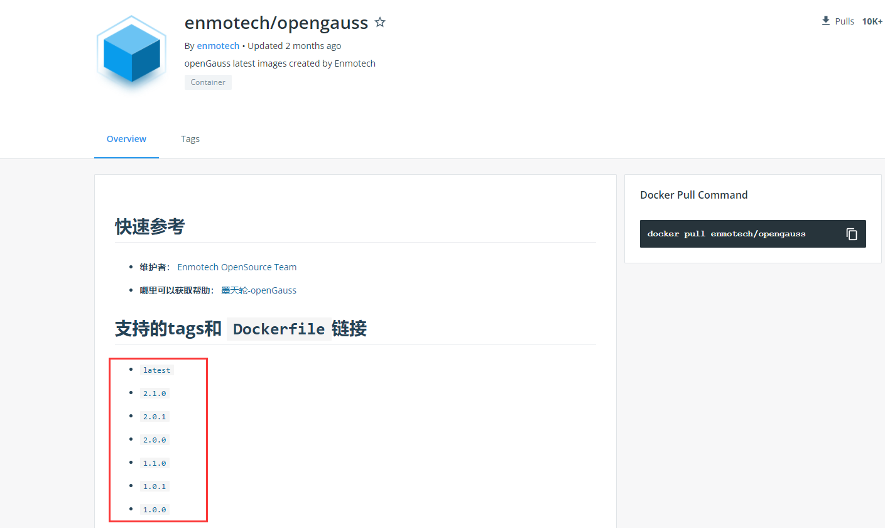

Docker 是基于 Go 语言开发的，开源项目

- 官网： [https://www.docker.com/](https://www.docker.com/)
- 文档： [https://docs.docker.com/](https://docs.docker.com/)
- 仓库： [https://hub.docker.com/](https://hub.docker.com/)

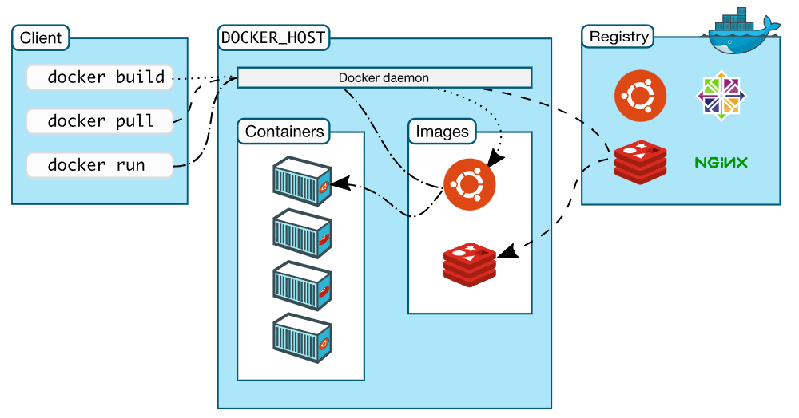

## 安装 Docker<a name="section364218916267"></a>

需要注意 Docker 支持的平台：[https://docs.docker.com/engine/install/](https://docs.docker.com/engine/install/)

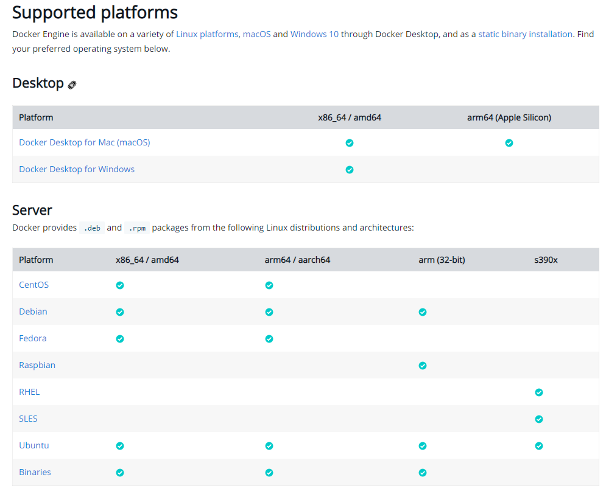


我的测试环境是 CentOS 7.6

```
# 1. Uninstall old versions 卸载旧版本
yum remove docker \
           docker-client \
           docker-client-latest \
           docker-common \
           docker-latest \
           docker-latest-logrotate \
           docker-logrotate \
           docker-engine

# 2. 需要的安装包，默认是国外的地址，很慢，这里使用阿里云的
yum install -y yum-utils

# 3. 设置镜像的仓库
yum-config-manager \
    --add-repo \
    https://mirrors.tuna.tsinghua.edu.cn/docker-ce/linux/centos/docker-ce.repo

# 4. 更新软件包的索引
yum makecache fast

# 5. 安装 dokcer   docker-ce是指社区版
yum install -y docker-ce docker-ce-cli containerd.io
```

安装的时候遇到一个小插曲，安装了 python3 没有修改 yum-config-manager 文件

```
[root@mogdb ~]# yum-config-manager \
>     --add-repo \
>     https://mirrors.tuna.tsinghua.edu.cn/docker-ce/linux/centos/docker-ce.repo
  File "/usr/bin/yum-config-manager", line 135
    except yum.Errors.RepoError, e:
                               ^
SyntaxError: invalid syntax

[root@mogdb ~]# which yum-config-manager
/usr/bin/yum-config-manager
[root@mogdb ~]# vi /usr/bin/yum-config-manager   # 换成 python2
#!/usr/bin/python2 -tt

[root@mogdb ~]# yum-config-manager \
    --add-repo \
    https://mirrors.tuna.tsinghua.edu.cn/docker-ce/linux/centos/docker-ce.repo

Loaded plugins: fastestmirror
adding repo from: https://mirrors.tuna.tsinghua.edu.cn/docker-ce/linux/centos/docker-ce.repo
grabbing file https://mirrors.tuna.tsinghua.edu.cn/docker-ce/linux/centos/docker-ce.repo to /etc/yum.repos.d/docker-ce.repo
repo saved to /etc/yum.repos.d/docker-ce.repo
```

启动并测试 Docker

```
# 启动dokcer
[root@mogdb ~]# systemctl start docker
[root@mogdb ~]# docker version
Client: Docker Engine - Community
 Version:           20.10.11
 API version:       1.41
 Go version:        go1.16.9
 Git commit:        dea9396
 Built:             Thu Nov 18 00:38:53 2021
 OS/Arch:           linux/amd64
 Context:           default
 Experimental:      true

Server: Docker Engine - Community
 Engine:
  Version:          20.10.11
  API version:      1.41 (minimum version 1.12)
  Go version:       go1.16.9
  Git commit:       847da18
  Built:            Thu Nov 18 00:37:17 2021
  OS/Arch:          linux/amd64
  Experimental:     false
 containerd:
  Version:          1.4.12
  GitCommit:        7b11cfaabd73bb80907dd23182b9347b4245eb5d
 runc:
  Version:          1.0.2
  GitCommit:        v1.0.2-0-g52b36a2
 docker-init:
  Version:          0.19.0
  GitCommit:        de40ad0

# 测试 hello-world
[root@mogdb ~]# docker run hello-world

# 查看下载的 hello-world 镜像
[root@mogdb ~]# docker images
REPOSITORY    TAG       IMAGE ID       CREATED        SIZE
hello-world   latest    feb5d9fea6a5   2 months ago   13.3kB
```

## 卸载 Docker<a name="section12362193272617"></a>

```
# 1. 卸载
yum remove docker-ce docker-ce-cli containerd.io
# 2. 删除
rm -rf /var/lib/docker
rm -rf /var/lib/containerd
```

## 配置阿里云镜像加速<a name="section99931412266"></a>

```
mkdir -p /etc/docker
tee /etc/docker/daemon.json <<-'EOF'
{
  "registry-mirrors": ["https://xe6vk78x.mirror.aliyuncs.com"]
}
EOF
systemctl daemon-reload
systemctl restart docker
```

## Docker 为什么比 VM 快<a name="section28512559264"></a>

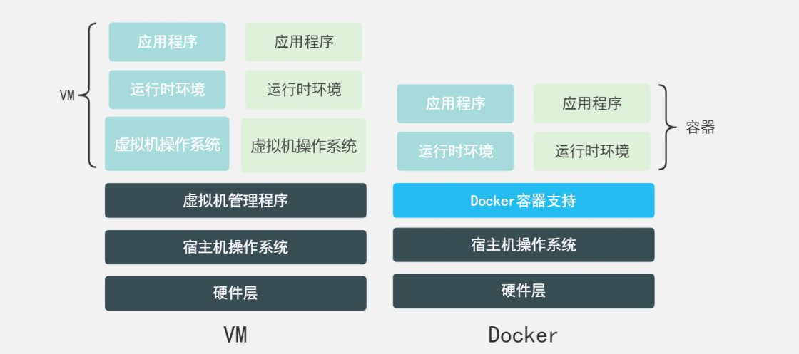

Docker 有着比虚拟机更少的抽象层

Docker 利用的是宿主机的内核，vm 需要虚拟机操作系统

## Docker 的常用命令<a name="section813218362718"></a>

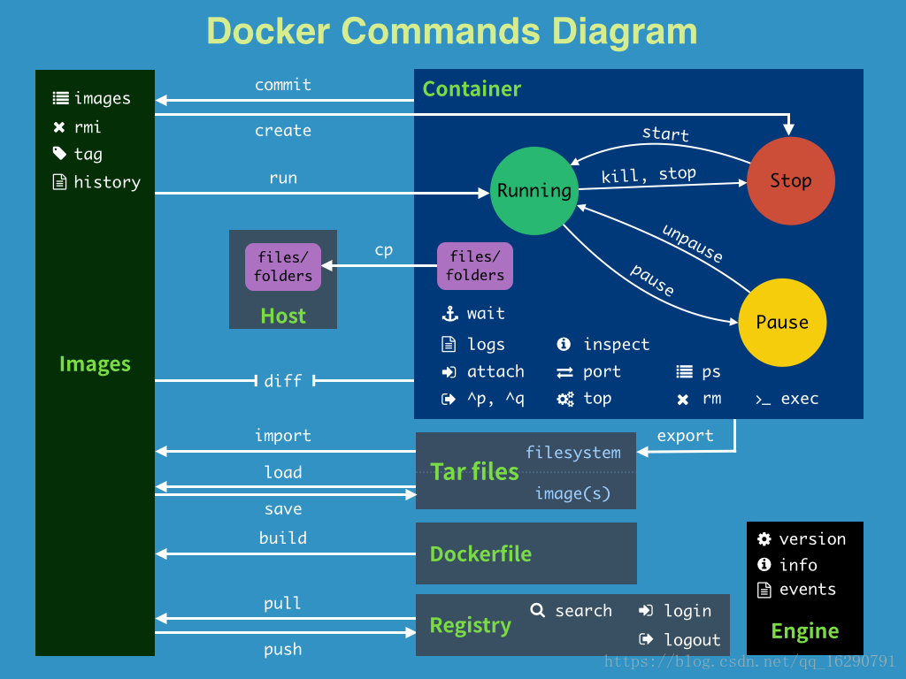

## 基于 openGauss 学习这些命令<a name="section15899212142710"></a>

- 基础命令

  ```
  docker version          # 显示 docker 的版本信息
  docker info             # 显示 docker 的系统信息，包括镜像和容器的数量
  docker command --help   # 帮助
  ```

- 镜像命令

  - 搜索镜像，搜索 opengauss 的镜像

    ```
    [root@mogdb ~]# docker search opengauss
    NAME                             DESCRIPTION                                     STARS     OFFICIAL   AUTOMATED
    enmotech/opengauss               openGauss latest images created by Enmotech     12
    ... ...
    # 可选项
    --filter=STARS=3000    # 搜索出来的镜像就是STARS（收藏数）大于3000的
    ```

  - 下载镜像， 下载 opengauss 的镜像

    ```
    # Usage:  docker pull [OPTIONS] NAME[:TAG|@DIGEST]
    [root@mogdb ~]# docker pull enmotech/opengauss
    Using default tag: latest         # 如果不写tag, 默认就是latest
    latest: Pulling from enmotech/opengauss
    284055322776: Pull complete       # 分成下载，docker images的核心，联合文件系统
    a7ca82b898d7: Pull complete
    2f93c23d8eb5: Pull complete
    3842013b7685: Pull complete
    6bc7e92855e3: Pull complete
    39c9c4e5b487: Pull complete
    1f9d76df94b5: Pull complete
    44db1c59ef84: Pull complete
    63ab02376fd3: Pull complete
    cf751b0b3be9: Pull complete
    9dc428e2c8b4: Pull complete
    Digest: sha256:d5a3e38fa2553a44e7fa1cd5cad0b4f0845a679858764067d7b0052a228578a0  # 签名
    Status: Downloaded newer image for enmotech/opengauss:latest
    docker.io/enmotech/opengauss:latest   # 真实地址

    # 指定版本下载
    [root@mogdb ~]# docker pull enmotech/opengauss:2.0.1
    ```

  - 查看镜像

    ```
    [root@mogdb ~]# docker images
    REPOSITORY           TAG       IMAGE ID       CREATED        SIZE
    enmotech/opengauss   latest    b4dd24d09223   2 months ago   383MB
    enmotech/opengauss   2.0.1     c3860afd8014   3 months ago   404MB

    # 可选项
      -a, --all             Show all images (default hides intermediate images)
      -q, --quiet           Only show image IDs
    ```

  - 删除镜像

    ```
    [root@mogdb ~]# docker rmi -f c3860afd8014
    Untagged: enmotech/opengauss:2.0.1
    Untagged: enmotech/opengauss@sha256:d156596b2900f7eda102aadfd951daad97412b610b96d3dd97d2cdd9d5b70024
    Deleted: sha256:c3860afd80148a6cfbb50269ef47f87257f2ed3fbf143f52b861303b98834833
    Deleted: sha256:193b45dffb62df01fa6c74bef9cf21774fdd550c5995f02bef28f30070db6859
    Deleted: sha256:32ba36efbf27ac2f485d1915fea35ec2a17c9d1b19d373d1edf49fd0f4b6a8de
    Deleted: sha256:ca0fd6097e9cf0aae5a1d5047f9b6bda30305a13396313b5cd021530be69bc9d
    Deleted: sha256:5d7f04d4882448ed954afc8d797069f3aede8ccc65a650086b9436f75fa11700
    Deleted: sha256:40a09fca023bf0d0353606c2684ba47d73979ffc6cae2dd4a4953d5796c8cb0d
    Deleted: sha256:8828e1e7978fba035a5305d8684b94ed322842ed095eb46bffcdef17ad2e091a
    Deleted: sha256:e7c2553c8389d79197d6c3ba7c731292cd772588d252683cf706cb660c6e46f0
    Deleted: sha256:d2292dd078208e84e70124123ffc4ebac5c304816a753db61da04f1e7d8a3663
    Deleted: sha256:8d78df12722212e140ae7ba4441c7f9a36365074779b6ca880f097c6e237f9e3
    Deleted: sha256:4f785c07c19d588e80313fc0ee644a19ac6e17a550a9e694c22babc355152367
    Deleted: sha256:21639b09744fc39b4e1fe31c79cdf54470afe4d7239a517c4060bd181f8e3039

    # 通过ID删除全部容器
    [root@mogdb ~]# docker rmi -f $(docker images -aq)
    ```

- 容器命令

  - 新建容器并启动

    ```
    # Usage:  docker run [OPTIONS] IMAGE [COMMAND] [ARG...]
    # 参数说明
    --name         # 容器名字，区分容器
    --privileged=true # 使用该参数，容器内的 root 拥有真正的 root 权限。
    -d             # 后台方式运行
    -e             # 设置环境变量
    -it            # 使用交互方式运行，进入容器查看内容
    -p（小）        # 容器和宿主机的端口映射
    	-p ip:主机端口:容器端口
    	-p 主机端口:容器端口 （常用）
    	-p 容器端口
    -P（大）        # 随机指定端口

    # 新建 opengauss 的容器并后台启动，配置密码 Enmo@123，端口映射
    # docker run --name opengauss --privileged=true -d -e GS_PASSWORD=Enmo@123 -p 5432:5432 enmotech/opengauss:latest
    ad8892ff8b45fc3329ed76afd634de136ec7b67fb2ba02221a0ee8886ee932b8
    ```

  - 列出所有运行的容器

    ```
    # docker ps
    -a    # 列出当前正在运行的容器 + 历史运行过的容器
    -n=?  # 显示最近创建的容器
    -q    # 只显示容器的编号

    [root@mogdb ~]# docker ps
    CONTAINER ID   IMAGE                       COMMAND                  CREATED         STATUS         PORTS                                       NAMES
    ad8892ff8b45   enmotech/opengauss:latest   "entrypoint.sh gauss…"   5 minutes ago   Up 5 minutes   0.0.0.0:5432->5432/tcp, :::5432->5432/tcp   opengauss
    ```

  - 启停容器

    ```
    docker start 容器id
    docker restart 容器id
    docker stop 容器id
    docker kill 容器id
    ```

  - 进入当前正在运行的容器

    ```
    docker exec -it 容器id /bin/bash    # 进入容器后开启一个新的终端，可以在里面操作（常用）
    docker attach 容器id                # 进入容器正在执行的终端，不会启动新的进程

    # 进入 opengauss 的容器内，在数据库中创建普通用户，测试外部连接
    [root@mogdb ~]# docker exec -it ad8892ff8b45 /bin/bash
    root@ad8892ff8b45:/# su - omm
    omm@ad8892ff8b45:~$ gsql
    gsql ((openGauss 2.1.0 build 590b0f8e) compiled at 2021-09-30 14:29:04 commit 0 last mr  )
    Non-SSL connection (SSL connection is recommended when requiring high-security)
    Type "help" for help.

    omm=# CREATE USER tpcc_usr WITH PASSWORD "tpcc@1234";
    NOTICE:  The encrypted password contains MD5 ciphertext, which is not secure.
    CREATE ROLE
    omm=# alter user tpcc_usr sysadmin;
    ALTER ROLE
    omm=# GRANT ALL ON schema public TO tpcc_usr;
    GRANT
    ```

    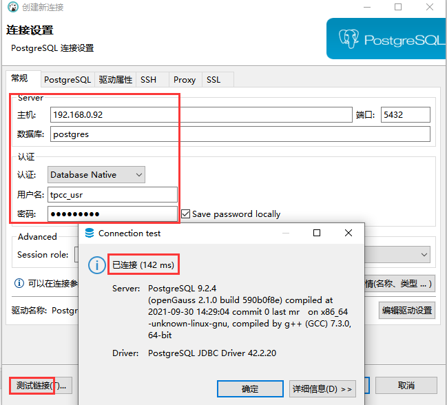

  - 退出容器

    ```
    exit          # 退出并停止容器，后台运行的容器不会停止
    Ctrl + P + Q  # 容器不停止的退出
    ```

  - 删除容器

    ```
    docker rm 容器ID               # 删除指定的容器，不能删除正在运行的容器，如果强制删除 rm -f
    docker rm -f $(docker ps -aq) # 删除所有容器
    docker ps -aq|xargs docker rm # 删除所有容器
    ```

- 其他命令

  - 查看日志

    ```
    [root@mogdb ~]# docker logs -f -t --tail 10 ad8892ff8b45
    2021-12-04T12:24:31.809995352Z 2021-12-04 12:24:31.809 [unknown] [unknown] localhost 140460925998016 0[0:0#0]  0 [BACKEND] LOG:  the configure file /usr/local/opengauss/etc/gscgroup_omm.cfg doesn't exist or the size of configure file has changed. Please create it by root user!
    2021-12-04T12:24:31.810007421Z 2021-12-04 12:24:31.809 [unknown] [unknown] localhost 140460925998016 0[0:0#0]  0 [BACKEND] LOG:  Failed to parse cgroup config file.
    2021-12-04T12:24:31.831906329Z 2021-12-04 12:24:31.831 [unknown] [unknown] localhost 140460925998016 0[0:0#0]  0 [EXECUTOR] WARNING:  Failed to obtain environment value $GAUSSLOG!
    2021-12-04T12:24:31.831931488Z 2021-12-04 12:24:31.831 [unknown] [unknown] localhost 140460925998016 0[0:0#0]  0 [EXECUTOR] DETAIL:  N/A
    2021-12-04T12:24:31.831934584Z 2021-12-04 12:24:31.831 [unknown] [unknown] localhost 140460925998016 0[0:0#0]  0 [EXECUTOR] CAUSE:  Incorrect environment value.
    2021-12-04T12:24:31.831936999Z 2021-12-04 12:24:31.831 [unknown] [unknown] localhost 140460925998016 0[0:0#0]  0 [EXECUTOR] ACTION:  Please refer to backend log for more details.
    2021-12-04T12:24:31.833046968Z 2021-12-04 12:24:31.832 [unknown] [unknown] localhost 140460925998016 0[0:0#0]  0 [EXECUTOR] WARNING:  Failed to obtain environment value $GAUSSLOG!
    2021-12-04T12:24:31.833057677Z 2021-12-04 12:24:31.832 [unknown] [unknown] localhost 140460925998016 0[0:0#0]  0 [EXECUTOR] DETAIL:  N/A
    2021-12-04T12:24:31.833060758Z 2021-12-04 12:24:31.832 [unknown] [unknown] localhost 140460925998016 0[0:0#0]  0 [EXECUTOR] CAUSE:  Incorrect environment value.
    2021-12-04T12:24:31.833063164Z 2021-12-04 12:24:31.832 [unknown] [unknown] localhost 140460925998016 0[0:0#0]  0 [EXECUTOR] ACTION:  Please refer to backend log for more details.
    ```

  - 查看容器内的进程信息

    ```
    [root@mogdb ~]# docker top ad8892ff8b45
    UID                 PID                 PPID                C                   STIME               TTY                 TIME                CMD
    70                  26782               26762               2                   20:24               ?                   00:00:21            gaussdb
    ```

  - 查询所有容器的资源使用信息

    ```
    [root@mogdb ~]# docker stats
    CONTAINER ID   NAME        CPU %     MEM USAGE / LIMIT    MEM %     NET I/O           BLOCK I/O         PIDS
    ad8892ff8b45   opengauss   2.65%     374.9MiB / 7.62GiB   4.80%     10.2kB / 58.2kB   6.77MB / 38.1MB   34
    ```

  - 查看容器的元数据

    ```
    [root@mogdb ~]# docker inspect ad8892ff8b45
    ```

  - 从容器内复制文件到宿主机上

    ```
    docker cp 容器id:PWD/file /home
    ```

## Docker 镜像加载原理<a name="section1027710339325"></a>

[https://blog.csdn.net/pjsdsg/article/details/90445128](https://blog.csdn.net/pjsdsg/article/details/90445128)

- 容器的快照 commit

  ```
  docker commit   # 保存容器成为一个新的副本
  docker commit -m="提交的描述信息" -a="作者” 容器id 目标镜像名:[TAG]
  ```

  测试 commit，前面为了测试外部连接数据库，在数据库中创建了一个普通用户 tpcc_usr ，下面保存这个容器成为一个新的副本

  ```
  [root@mogdb ~]# docker commit -a="create database user tpcc" ad8892ff8b45 opengauss:1.0
  sha256:1e760f8f2f3ddf707cb661bdd8549728bdb0ecd83d1166c6f9f350880464c654
  [root@mogdb ~]# docker images
  REPOSITORY           TAG       IMAGE ID       CREATED          SIZE
  opengauss            1.0       1e760f8f2f3d   15 seconds ago   1.21GB  #<<<<<<<
  enmotech/opengauss   latest    b4dd24d09223   2 months ago     383MB
  ```

  使用新创建的副本来新建一个容器，查看用户是否存在

  ```
  # 容器名opengauss2，端口映射为5433，使用镜像ID是1e760f8f2f3d
  [root@mogdb ~]# docker run --name opengauss2 --privileged=true -d -e GS_PASSWORD=Enmo@123 -p 5433:5432 1e760f8f2f3d
  0a1c49aaa9114f19e33fef20753be092f923ffe558aa1d4251c55d3948dff486
  [root@mogdb ~]# docker ps
  CONTAINER ID   IMAGE                       COMMAND                  CREATED          STATUS          PORTS                                       NAMES
  0a1c49aaa911   1e760f8f2f3d                "entrypoint.sh gauss…"   8 seconds ago    Up 8 seconds    0.0.0.0:5433->5432/tcp, :::5433->5432/tcp   opengauss2  #<<<<<<<
  ad8892ff8b45   enmotech/opengauss:latest   "entrypoint.sh gauss…"   46 minutes ago   Up 37 minutes   0.0.0.0:5432->5432/tcp, :::5432->5432/tcp   opengauss

  [root@mogdb ~]# docker exec -it 0a1c49aaa911 /bin/bash
  root@0a1c49aaa911:/# su - omm
  omm@0a1c49aaa911:~$ gsql
  gsql ((openGauss 2.1.0 build 590b0f8e) compiled at 2021-09-30 14:29:04 commit 0 last mr  )
  Non-SSL connection (SSL connection is recommended when requiring high-security)
  Type "help" for help.

  omm=# \du
                                                                List of roles
   Role name |                                                    Attributes                                                    | Member of
  -----------+------------------------------------------------------------------------------------------------------------------+-----------
   gaussdb   | Sysadmin                                                                                                         | {}
   omm       | Sysadmin, Create role, Create DB, Replication, Administer audit, Monitoradmin, Operatoradmin, Policyadmin, UseFT | {}
   tpcc_usr  | Sysadmin                                                                                                         | {}

  omm=#
  ```

  tpcc_usr 用户存在，使用外部工具测试连接

  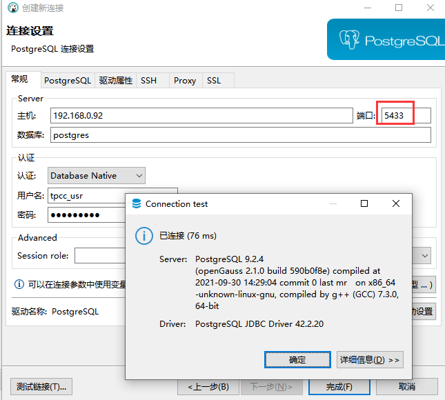

- 容器数据卷，持久化数据

  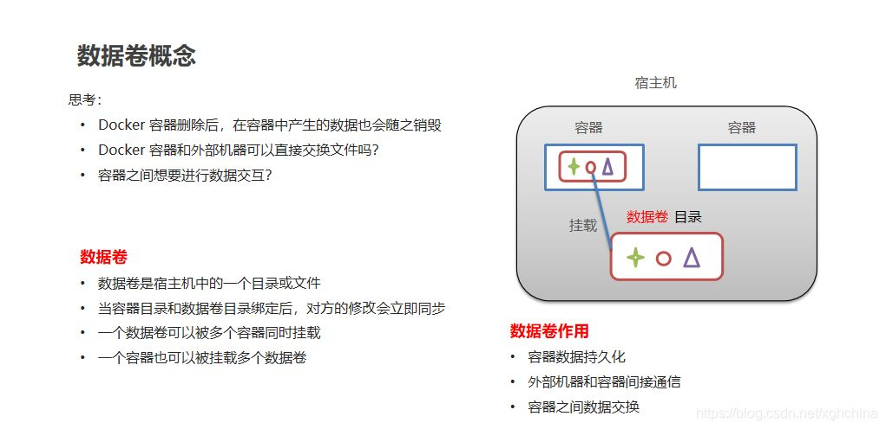

  查看 openGauss 的数据文件路径

  ```
  omm@0a1c49aaa911:~$ gsql
  gsql ((openGauss 2.1.0 build 590b0f8e) compiled at 2021-09-30 14:29:04 commit 0 last mr  )
  Non-SSL connection (SSL connection is recommended when requiring high-security)
  Type "help" for help.

  omm=# show data_directory;
       data_directory
  -------------------------
   /var/lib/opengauss/data
  (1 row)
  ```

  指定路径挂载

  ```
  # 指定路径挂载，ro只读，rw读写，设置 ro ，只能在宿主机上执行写操作，容器内部是只读的
  docker run -it -v 主机目录：容器内目录：ro/rw

  # 测试
  # mkdir /root/data
  docker run --name opengauss03 --privileged=true -d \
  -e GS_PASSWORD=Enmo@123 -p 5434:5432 \
  -v /root/data:/var/lib/opengauss/data \
  1e760f8f2f3d

  ee6e88d47dd90c7efbae1d85e33cedee3d649e33518a64f3ae99d6b8575bffb8

  [root@mogdb ~]# docker inspect ee6e88d47dd9

  "Mounts": [
      {
          "Type": "bind",
          "Source": "/root/data",
          "Destination": "/var/lib/opengauss/data",
          "Mode": "",
          "RW": true,
          "Propagation": "rprivate"
      }
  ],

  [root@mogdb ~]# cd /root/data/
  [root@mogdb data]# ll
  total 4900
  drwx------ 3 70 70      21 Dec  4 11:51 asp_data
  drwx------ 7 70 70      71 Dec  4 11:51 base
  -rw------- 1 70 70      72 Dec  4 21:16 gaussdb.state
  drwx------ 2 70 70    4096 Dec  4 21:17 global
  -rw------- 1 70 70     354 Dec  4 11:50 gs_gazelle.conf
  drwx------ 3 70 70      21 Dec  4 11:51 gs_profile
  -rw------- 1 70 70 4915200 Dec  4 11:51 gswlm_userinfo.cfg
  -rw------- 1 70 70   20238 Dec  4 11:51 mot.conf
  drwx------ 3 70 70      50 Dec  4 11:51 pg_audit
  drwx------ 2 70 70      26 Dec  4 11:50 pg_clog
  drwx------ 2 70 70      26 Dec  4 11:50 pg_csnlog
  -rw------- 1 70 70       0 Dec  4 11:51 pg_ctl.lock
  drwx------ 2 70 70       6 Dec  4 11:50 pg_errorinfo
  -rw------- 1 70 70    4553 Dec  4 11:51 pg_hba.conf
  -rw------- 1 70 70    1636 Dec  4 11:50 pg_ident.conf
  drwx------ 4 70 70      39 Dec  4 11:50 pg_llog
  drwx------ 2 70 70       6 Dec  4 11:50 pg_location
  drwx------ 2 70 70     126 Dec  4 21:16 pg_log
  drwx------ 4 70 70      36 Dec  4 11:50 pg_multixact
  drwx------ 2 70 70      26 Dec  4 21:16 pg_notify
  drwx------ 3 70 70      21 Dec  4 11:51 pg_perf
  drwx------ 2 70 70       6 Dec  4 11:50 pg_replslot
  drwx------ 2 70 70       6 Dec  4 11:50 pg_serial
  drwx------ 2 70 70       6 Dec  4 11:50 pg_snapshots
  drwx------ 2 70 70      25 Dec  4 22:10 pg_stat_tmp
  drwx------ 2 70 70       6 Dec  4 11:50 pg_tblspc
  drwx------ 2 70 70       6 Dec  4 11:50 pg_twophase
  -rw------- 1 70 70       4 Dec  4 11:50 PG_VERSION
  drwx------ 3 70 70    4096 Dec  4 11:51 pg_xlog
  -rw------- 1 70 70   31669 Dec  4 11:51 postgresql.conf
  -rw------- 1 70 70    1024 Dec  4 11:50 postgresql.conf.lock
  -rw------- 1 70 70      33 Dec  4 21:16 postmaster.opts
  -rw------- 1 70 70      68 Dec  4 21:16 postmaster.pid
  drwx------ 3 70 70      21 Dec  4 11:51 sql_monitor
  drwx------ 5 70 70      67 Dec  4 21:16 undo
  ```

  具名和匿名挂载

  ```
  # 匿名挂载  -v 容器内的路径
  docker run --name opengauss04 --privileged=true -d \
  -e GS_PASSWORD=Enmo@123 -p 5435:5432 \
  -v /var/lib/opengauss/data \
  1e760f8f2f3d

  "Mounts": [
      {
          "Type": "volume",
          "Name": "e1f39b76c16ef76392b3a3a8312edc0f8c3e033c8c59d6ab60a6429c20236f62",
          "Source": "/var/lib/docker/volumes/e1f39b76c16ef76392b3a3a8312edc0f8c3e033c8c59d6ab60a6429c20236f62/_data",
          "Destination": "/var/lib/opengauss/data",
          "Driver": "local",
          "Mode": "",
          "RW": true,
          "Propagation": ""
      }
  ],

  # 查看所有 volume 的情况
  [root@mogdb ~]# docker volume ls
  DRIVER    VOLUME NAME
  local     6cede63c42f882b1044b13c0aa20dd788eda6764940b9b8054db9e15087569a3
  local     20df1e593053e108028cd2ada3084042b2f0d96827f236ea809f1b6663d90ef4
  local     a1601a649c6828db873110887ade959f86fdf18ccfd6e25c972a4edde661fd35
  local     a20478a2a42c64f4ac332f7067acdd5dd72e67ab7b3d8a85e609aaa4cc35d4bf
  local     df1f97eda08c32d45f11a0faff8522e564ed2442274e6e0609fed30c3947b06b
  local     e1f39b76c16ef76392b3a3a8312edc0f8c3e033c8c59d6ab60a6429c20236f62

  # 具名挂载
  docker run --name opengauss05 --privileged=true -d \
  -e GS_PASSWORD=Enmo@123 -p 5436:5432 \
  -v juming:/var/lib/opengauss/data \
  1e760f8f2f3d

  "Mounts": [
      {
          "Type": "volume",
          "Name": "juming",
          "Source": "/var/lib/docker/volumes/juming/_data",
          "Destination": "/var/lib/opengauss/data",
          "Driver": "local",
          "Mode": "z",
          "RW": true,
          "Propagation": ""
      }
  ],

  # 查看挂载的具体位置
  [root@mogdb ~]# docker volume inspect juming
  [
      {
          "CreatedAt": "2021-12-04T22:17:29+08:00",
          "Driver": "local",
          "Labels": null,
          "Mountpoint": "/var/lib/docker/volumes/juming/_data",
          "Name": "juming",
          "Options": null,
          "Scope": "local"
      }
  ]

  [root@mogdb ~]# docker volume ls
  DRIVER    VOLUME NAME
  local     6cede63c42f882b1044b13c0aa20dd788eda6764940b9b8054db9e15087569a3
  local     20df1e593053e108028cd2ada3084042b2f0d96827f236ea809f1b6663d90ef4
  local     a1601a649c6828db873110887ade959f86fdf18ccfd6e25c972a4edde661fd35
  local     a20478a2a42c64f4ac332f7067acdd5dd72e67ab7b3d8a85e609aaa4cc35d4bf
  local     df1f97eda08c32d45f11a0faff8522e564ed2442274e6e0609fed30c3947b06b
  local     e1f39b76c16ef76392b3a3a8312edc0f8c3e033c8c59d6ab60a6429c20236f62
  local     juming
  ```

## DockerFile 制作 openGauss 镜像，源码中已经提供制作脚本，可以直接用<a name="section7470116165312"></a>

- 下载安装包： [https://opengauss.org/zh/download.html](https://opengauss.org/zh/download.html)

  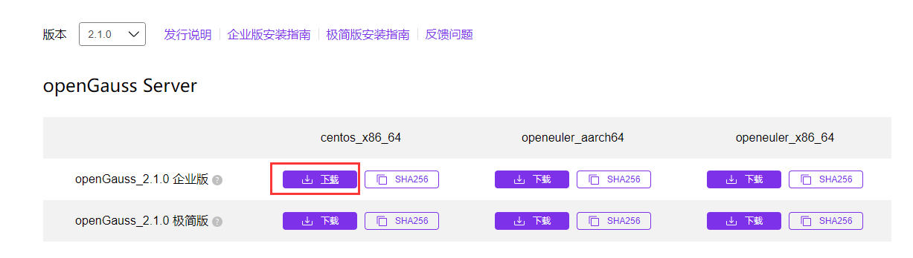

- 下载源码包： [https://gitee.com/opengauss/openGauss-server?\_from=gitee_search](https://gitee.com/opengauss/openGauss-server?_from=gitee_search)

  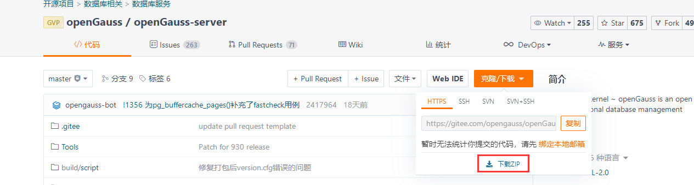

- 将安装包和源码包上传 Docker 服务器

  ```
  [root@mogdb ~]# ll openGauss*
  -rw-r--r-- 1 root root 100623501 Dec  4 22:35 openGauss-2.1.0-CentOS-64bit-all.tar.gz
  -rw-r--r-- 1 root root 193144438 Dec  4 22:40 openGauss-server-master.zip
  ```

  ````
  # 解压源码包和安装包
  [root@mogdb ~]# unzip openGauss-server-master.zip
  [root@mogdb ~]# tar -zxvf openGauss-2.1.0-CentOS-64bit-all.tar.gz

  # 准备目录和文件
  [root@mogdb ~]# cd /root/openGauss-server-master/docker/dockerfiles
  [root@mogdb dockerfiles]# mkdir 2.1.0
  [root@mogdb dockerfiles]# cp 1.1.0/* 2.1.0/
  [root@mogdb dockerfiles]# cp /root/openGauss-2.1.0-CentOS-64bit.tar.bz2 2.1.0/

  # 修改 dockerfile_amd 文件
  [root@mogdb dockerfiles]# sed -i "s/openGauss-1.1.0-CentOS-64bit.tar.bz2/openGauss-2.1.0-CentOS-64bit.tar.bz2/g" 2.1.0/dockerfile_amd

  # 创建 opengauss 镜像
  [root@mogdb dockerfiles]# sh buildDockerImage.sh -v 2.1.0 -i

  Successfully built e336672f2857
  Successfully tagged opengauss:2.1.0


    openGauss Docker Image  2.1.0 is ready to be extended:

      --> opengauss:2.1.0

    Build completed in 42 seconds.

  # 生成opengauss容器
  [root@mogdb ~]# docker images
  REPOSITORY           TAG        IMAGE ID       CREATED          SIZE
  opengauss            2.1.0      e336672f2857   46 seconds ago   616MB
  opengauss            1.0        1e760f8f2f3d   3 hours ago      1.21GB
  enmotech/opengauss   latest     b4dd24d09223   2 months ago     383MB
  centos               7.6.1810   f1cb7c7d58b7   2 years ago      202MB

  [root@mogdb ~]# docker run --name opengauss10 --privileged=true -d -e GS_PASSWORD=Enmo@123 -p 5866:5432 -v /var/lib/opengauss opengauss:2.1.0
  30124a1b285a6fe92b4ea55bc340603148e5ba52db481aacf23354e242cfaa9c
  [root@mogdb ~]# docker ps
  CONTAINER ID   IMAGE                       COMMAND                  CREATED          STATUS          PORTS                                       NAMES
  30124a1b285a   opengauss:2.1.0             "entrypoint.sh gauss…"   11 seconds ago   Up 10 seconds   0.0.0.0:5866->5432/tcp, :::5866->5432/tcp   opengauss10

  # 登录opengauss容器，创建用户
  ​```
  [root@mogdb ~]# docker exec -it 30124a1b285a /bin/bash
  [root@72094285e528 /]# su - omm
  [omm@72094285e528 ~]$ gsql
  gsql ((openGauss 2.1.0 build 590b0f8e) compiled at 2021-09-30 14:29:04 commit 0 last mr  )
  Non-SSL connection (SSL connection is recommended when requiring high-security)
  Type "help" for help.

  omm=# CREATE USER tpcc_usr WITH PASSWORD "tpcc@1234";
  NOTICE:  The encrypted password contains MD5 ciphertext, which is not secure.
  CREATE ROLE
  omm=# alter user tpcc_usr sysadmin;
  ALTER ROLE
  omm=# GRANT ALL ON schema public TO tpcc_usr;
  GRANT
  ````

  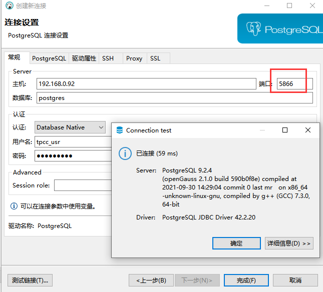

先写到这吧，其实还有好多内容，后面有时间再写续篇
