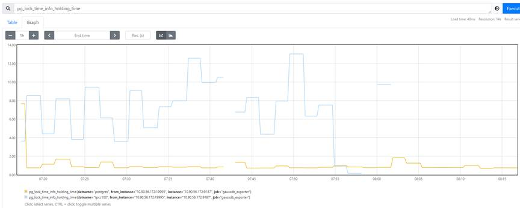

# 建议收藏 | 在 openGauss 上遇到慢 SQL 该怎么办？<a name="ZH-CN_TOPIC_0000001245375435"></a>

---

在数据库的日常使用中，难免会遇到慢 SQL。 遇到慢 SQL 本身并不可怕，困难之处在于如何识别慢 SQL 并对其优化，使它不至于拖慢整个系统的性能，避免危害到日常业务的正常进行。

对不同的数据库来说，由于其系统架构的差异、代码实现的不同，很多慢 SQL 解决“套路”往往是无法直接复用的。而由于历史原因，很多国内互联网公司的关系型数据库系统都是 MySQL, 这也导致网络上关于 MySQL 数据库的慢 SQL 分析文章很多，而其他数据库就少得可怜了。为此，我们梳理了在 openGauss 上进行慢 SQL 分析的经验，并总结了下来，希望能给 openGauss 的用户一些启发。openGauss 的数据库自治运维系统 DBMind 也已经初步具备了慢 SQL 根因分析的能力，感兴趣的读者也可以尝试一下。

首先，我们可以通过设置 GUC 参数 log_min_duration_statement 来指定 openGauss 系统监控的慢 SQL 阈值。同时，我们也应调大 instr_unique_sql_count 的数值，以免出现“missing SQL statement, GUC instr_unique_sql_count is too small.”的提示。这里以设置慢 SQL 检测阈值为 5 秒（默认数值单位是毫秒）为例：

```
gs_guc reload -D $PGDATA -c 'log_min_duration_statement = 5000' -c 'instr_unique_sql_count = 2000'
```

然后执行一个慢 SQL，可以在 dbe_perf.statement_history 视图中查看到结果：

```
select pg_sleep(6); -- 构造的慢SQL
select * from dbe_perf.statement_history order by start_time desc;
```

有了上述方法，我们就可以轻易在 openGauss 数据库中监控到慢 SQL 了，接下来可以通过下文的方法来分析慢 SQL 的产生原因。

## 索引原因导致的慢 SQL<a name="section2537184445"></a>

由索引原因引起的慢 SQL 在绝大多数数据库系统中都是十分常见的，甚至可以列为第一大慢 SQL 问题来源。简单来说，大致存在以下几种情况：

1.  缺乏有效索引
2.  执行计划没有选择索引扫描，即索引失效
3.  冗余索引

## 缺乏有效索引<a name="section47397533444"></a>

对于缺乏有效索引的场景，在解决问题时，可以先从 SQL 语句本身入手，绝大多数此类 SQL 语句都是 SELECT 语句，且该类 SQL 语句涉及到的表数据量较多，且谓词上没有创建索引，导致数据库系统需要通过全盘扫描来获取数据。对于该情况，一般的做法往往比较“暴力”，即直接在 WHERE 子句、JOIN 子句等涉及到的字段上创建索引。一般存在于 WHERE 子句中的简单比较都是可以使用索引扫描的，因此在该涉及到的字段上创建索引可能是有效的。但是，索引也并非是创建得越多越好（后面我们会提到冗余索引的情况），在创建索引时需要在选择度较高、数据量不是特别少的字段上创建索引，否则该索引收益不大。

对于单语句的索引推荐，openGauss 数据库已经内置了该功能，用户可以通过调用系统函数 gs_index_advise\(\) 进行推荐，例如：

```
select * from gs_index_advise('select * from t1 where a > 1');
```

单语句索引推荐的核心逻辑可以表示为：

1.  提取 JOIN 类算子中的连接条件，保存为连接关系；
2.  提取 Filter 类算子中的过滤条件，保存为过滤关系；
3.  分析过滤关系中涉及字段的选择度和数据量，将评估适合创建索引的字段加入到候选索引列表中；
4.  分析连接关系，根据表的结果集大小确定驱动表，根据连接关系，将被驱动表中涉及的字段加入到候选索引列表中；
5.  提取 Aggregate 类算子涉及的字段，将该字段加入到候选索引列表中；
6.  提取 Sort 算子涉及的字段，将该字段加入到候选索引列表中；
7.  评估候选索引列表中的全部字段，过滤重复索引，合并相关索引；
8.  输出最终索引推荐的结果。

    对于推荐出来的候选索引，用户可以自行决策是否创建，也可以通过 openGauss 的虚拟索引功能来评估索引收益，进行辅助决策。

    对于单语句的索引推荐，业内也有不少开源的工具。不过，该类工具多数基于 MySQL 数据库实现（如美团开源的 SQL Advisor）。同时，在索引推荐的层次上，该类工具使用的是对 SQL 语句进行语法解析后的结果，即根据 SQL 语句的抽象语法树（Abstract Syntax Tree, AST）进行索引推荐。然而，openGauss 的索引推荐功能还可以建立在查询解析之后的查询树（Query Tree）的基础上进行索引推荐，也就是说，openGauss 的索引推荐是建立在算子粒度上的。这样，某些被优化器改写的 SQL 语句（如 exists, in 子查询），也可以被轻易地捕获并进行索引推荐，而前文提到的基于 AST 进行索引推荐的工具是很难实现的。

## 索引失效<a name="section737857184520"></a>

就索引失效而言，一般存在以下六种情况：

1.  联合索引（又叫复合索引、多列索引）的最左匹配原则失效：同 MySQL 类似，openGauss 的联合索引也满足最左匹配原则，如果查询不满足最左匹配原则，数据库优化器会倾向于放弃选择该索引扫描；
2.  使用了 SELECT \*: 除了老生常谈的可能扫描到不需要的字段之外，使用该写法还有可能导致 openGauss 的 IndexOnlyScan 失效（在 MySQL 中称为 CoveringIndex），也可能导致索引扫描后进行不必要的回表；
3.  谓词中的索引列参与了运算：这个问题一般不会出现在 openGauss 数据库中，这是因为 openGauss 的 rewrite 过程可以将该写法进行改写。但是 openGauss 的 rewrite 过程是基于规则进行的，某些情况下会存在改写匹配不上的情况，例如把 WHERE 子句的中谓词变得复杂一点就可能出现改写失效，进而导致索引失效，例如 select a from t1 where b - 0 \> 1 and c < 100; 语句中的减 0 与否会产生两种截然不同的执行计划；
4.  索引列涉及函数计算：对于 openGauss 来说，函数计算结果往往是“不可预测”的，故该索引有可能是失效的；不过 openGauss 支持函数索引（Functional Index），对于必须在字段上执行函数的情况可以选择使用该索引，只不过该索引的维护代价会比较大；同时，如果定义的函数可以被 rewrite 过程改写，该索引仍然可能是有效的，这点可能与某些数据库的行为不同；
5.  谓词中使用 like: 对于字符串类型（如 varchar, text）的字段，在使用 like 进行模糊查询时，在 openGauss 中默认是不走索引的，这点与 MySQL 在默认情况下不太一致；openGauss 对字符串类型的字段，一般在进行等值查询时会选择使用索引，如果对于该字段更多地进行模糊查询（如 like 或正则），则需要在创建索引时显式地添加 text_pattern_ops 参数，如 create index on movies \(title text_pattern_ops\); 同时，同 MySQL 等数据库一样，该 B+ Tree 索引也只仅支持前缀匹配查询，如果希望利用 B+ Tree 进行后缀匹配，可以使用字符串翻转小技巧；对于全文检索，可以使用 openGauss 支持的 tsquery 特性，并通过创建 GIN 或 GiST 索引加速查询；
6.  SQL 语义上不应走索引：这种情况的类型有很多，比较典型的是谓词中对同一张表的两列进行比较、不等值比较（如!=, not in, not exists, is not null）、全量排序、类型转换（如字段的类型是 varchar, 在谓词中与 bigint 进行比较时发生了隐式转换）等。

## 冗余索引<a name="section237515199466"></a>

上面我们提到了创建索引的一般情况，对于绝大多数慢 SQL 场景，创建一个合适的索引就可以使得性能突飞猛进。但是，索引是不是就可以越多越好呢？显然不是。我们日常创建的索引中，使用最多的是 B+ Tree 索引，因此我们以 B+ Tree 为例，简单解释一下缘由。

众所周知，B+ Tree 是一个多叉树，它的每一个子节点都是父节点的一个子“范围”。记录（或记录的位置）最终存储在 B+ Tree 的叶子节点中。因此，在进行数据检索时，只需要扫描匹配的子节点中的指定“范围”即可。但是，对于数据的删除，也需要付出相同的时间开销，进行 B+ Tree 节点的调整；如果被索引的数据修改了，还需要调整 B+ Tree 中原有的节点结构。由于 B+ Tree 的插入、删除、检索的算法时间复杂度都是相同的，因此当业务系统中的插入和删除操作更多时，索引维护的代价就会更大，甚至超过索引检索时带来的收益。与此同时，索引页也需要占用额外的磁盘空间，被索引数据量越大，索引页占据的空间就越大。而且，当前 openGauss 中的 B+ Tree 的实现仍然是有锁的，更多的索引页面有可能涉及更多的锁维护操作。

在 openGauss 数据库中，可以通过下述语句简单识别没有被使用过的索引：

```
SELECT s.schemaname,
       s.relname AS tablename,
       s.indexrelname AS indexname,
       pg_relation_size(s.indexrelid) AS index_size
FROM pg_catalog.pg_stat_user_indexes s
   JOIN pg_catalog.pg_index i ON s.indexrelid = i.indexrelid
WHERE s.idx_scan = 0      -- has never been scanned
  AND 0 <>ALL (i.indkey)
  AND NOT i.indisunique
  AND NOT EXISTS
         (SELECT 1 FROM pg_catalog.pg_constraint c
          WHERE c.conindid = s.indexrelid)
ORDER BY pg_relation_size(s.indexrelid) DESC;
```

可以修改上述 SQL 语句中的 idx_scan 条件中的阈值，来调整返回结果。

对于 workload 中全量 SQL 语句进行索引创建其实是非常困难的，因为需要权衡全量 SQL 中增删查改语句的占比情况，同时需要估计索引的检索收益和维护代价，这个权衡过程十分复杂，一般的人工操作其实是很难的。因此，在日常数据库使用中，当需要创建索引时，最好进行全局业务的评估，衡量是否会干扰到其他业务，以及创建的总体收益是否为正，以免后期难以维护。

不过，对于 openGauss 数据库来说，可以使用系统级别的索引推荐功能来解决上述痛点问题，可以通过下述命令查看使用说明：

```
gs_dbmind component index_advisor --help
```

## 系统配置原因导致的慢 SQL<a name="section15331489470"></a>

在系统配置中，最常见的配置项就是对资源的配置。这包括允许使用的最大资源（主要是内存）、以及资源的使用方式等。除了调整资源配置，有些情况下还需要配置数据库优化器 Cost Model 的代价值。下面我们重点看几个会影响 SQL 语句成为慢 SQL 的系统参数：

**max_process_memory**: 该参数与 enable_memory_limit 配合使用，用于限制一个 openGauss 实例可用的最大内存。需要将该参数值与宿主机系统的内存总量进行匹配，将宿主机用于操作系统正常运行所需的内存刨除后，剩下的内存空间就可以尽可能多地划分给 openGauss 实例使用了。否则，openGauss 为了避免造成 OOM 问题，会通过该参数限制数据库允许使用的最大内存。因此，如果在客户端或者日志中出现类似“memory usage reach the max_dynamic_memory”的报错时，一般是由于该参数值太小导致的。

**shared_buffers**: 数据库系统使用的缓存池大小。一般来说，综合来看对数据库影响最大的参数就是它了，因为如果该参数设置得过小，会导致缓存不足，从而产生大量的磁盘 I/O. 该参数在 openGauss 上的默认值很小，只有 32MB，对于绝大多数的生产场景是不够的。一般的经验值是设置为系统内存的 25%, 甚至在某些场景中还可以再大一点。不过 openGauss 的 buffer 没有通过 DirectIO 实现，仍然使用了系统缓存（cache），所以一般认为超过系统内存的 40%也起不到再好的效果了。与此同时，checkpoint_segments 参数也需要随着 shared_buffers 的调大跟着变大一些。

**work_mem**: 显式指定内排序和哈希表能使用的内存空间大小，如果该值设得比较小，会向磁盘写入更多的临时文件。因此，我们可以适当地增加该值的大小。但是需要注意的是，业务系统可能存在并行执行的复杂语句，如果这些语句都占用非常多的 work_mem 大小的资源，则可能会导致内存使用占满（如前文所述，openGauss 存在内存管控机制，一般不至于由于 OOM 导致系统重启）。故而，该值设置得很大的时候要关注系统的并发问题。该参数对 ORDER BY, DISTINCT, JOIN \(merge join, hash join\), HASH Agg, 基于 hash 的 IN 子查询都有影响。

**enable_nestloop**: 开启该参数可以让优化器使用 Nest Loop Join\(NLJ\), 但是关闭该参数也不会完全压制优化器选择 NLJ. 对于某些复杂查询（如在 TPC-H benchmark 中的语句）来说，不应该选择 NLJ, 但是优化器往往会出现规划错误。那么，在此场景下，可以通过禁用该参数来鼓励优化器选择使用其他 JOIN 方法。

**random_page_cost**: 一般与 seq_page_cost 配合调整。该参数调整数据库的 CBO 优化器中随机扫描的代价。该值设置得越大，数据库越认为随机扫描不可取，也就越不倾向于使用索引。该参数的默认值是 4，对于机械硬盘来说，是合适的。但是，如果业务系统的磁盘是固态硬盘的话，就应该适当调小一下该参数值，一般的经验是调整为 1.

**default_statistics_target**: 当前 openGauss 的默认优化器是 CBO, 它高度依赖数据的统计信息。因此，对于复杂查询来说，更优质的统计信息往往可以获得更好的执行计划。通过增大该参数的值，可以获得更准确的统计信息，但是也会增加 ANALYZE 的时间。因此，对于复杂语句较多的场景，可以适当增加该参数值。

除了上述列出来的可能会影响 SQL 语句执行表现的系统参数外，还有很多参数可能会产生影响。不过，影响概率会小很多。如果用户希望检查一下数据库的参数配置是否合理，可以通过 DBMind 的参数推荐功能测试一下（该功能依赖当前正在运行的业务量，故不同时刻执行的效果可能会不同，建议在业务高峰时使用），相关使用帮助是：

```
gs_dbmind component xtuner recommend –help
```

如果用户希望针对自己的业务试探出最合适的参数，也可以使用离线模式（tune 或 train 模式）。不过该场景一般是对未上线的业务系统进行初始调参，因为执行该功能可能会影响业务运行，故称之为离线模式。

## 资源竞争导致的慢 SQL<a name="section143691537154711"></a>

当系统同时执行某些 SQL 语句的时候，它们可能会互相影响，进而导致某些 SQL 语句变为慢 SQL, 这就是典型的资源竞争导致的慢 SQL. 同时，不仅数据库中的语句们可能会进行资源竞争。在混合部署的环境中，操作系统上的其他任务也可能会影响数据库系统的表现。

对于一般的等待事件（wait event）来说，openGauss 具备等待事件的记录视图，用户可以通过下列方法从宏观上查看 Top 级别的等待事件：

```
select * from dbe_perf.wait_events order by total_wait_time desc;
```

一般来说，对于数据库外部原因导致的资源竞争包括 CPU、内存、IO 的竞争，最典型的情况是 IO 风暴（Freeze IO）、CPU 的计算资源的占用等。对于这种情况，一般不要将数据库与其他业务系统混合部署即可避免。

比较困难的是，数据库自己的某些任务之间互相影响，例如锁竞争、IO 竞争等。

数据库中的不同 SQL 语句对锁资源进行占用，阻塞了其他语句的正常执行，导致 SQL 语句变慢了，甚至还会触发死锁检测。比较简单的排查当前锁占用情况的 SQL 语句是：

```
    SELECT c.relkind,
       d.datname,
       c.relname,
       l.mode,
       s.query,
       extract(epoch
               FROM pg_catalog.now() - s.xact_start) AS holding_time
    FROM pg_locks AS l
    INNER JOIN pg_database AS d ON l.database = d.oid
    INNER JOIN pg_class AS c ON l.relation = c.oid
    INNER JOIN pg_stat_activity AS s ON l.pid = s.pid
    WHERE s.pid != pg_catalog.pg_backend_pid();
```

值得一提的是，openGauss 并不支持 pg_blocking_pids 函数。所以，通过该函数是无法查看到锁等待情况的。

下图展示了通过 DBMind 提供的 openGauss-exporter 监控到的数据库持锁情况：

还有一种情况是 IO 使用受到影响，例如系统正在进行 IO 操作时，执行某条 SQL 语句，该 SQL 语句对磁盘的访问被阻塞了。典型的数据库系统 IO 操作包括 Analyze, Vacuum 以及 checkpoint 等。这些问题在 PostgreSQL 类数据库上是非常令人头疼的问题，这会导致系统运行时出现比较大的性能波动。不过，对于 openGauss 来说，相比 PostgreSQL 做了很多优化，例如增量 checkpoint, 使用更大的版本号等（可以避免大量的 autovacuum for prevent wrap）。

当然，除了上面列出的情况外，还存在并发量接近或超过系统负荷导致的性能下降和拒绝服务。例如，大量复杂查询语句对 CPU 资源的竞争、大并发情况下引起数据库的响应时间变慢等。

就资源竞争引起的慢 SQL 来说，基本都可以通过系统指标来发现。例如监控慢 SQL 发生时刻的 CPU、内存、IO、锁、网络等的使用情况，根据该慢 SQL 发生的背景信息即可推断出该慢 SQL 是否由资源竞争导致的，以及是何资源短缺导致的。对于 openGauss 来说，DBMind 提供了非常强大的数据库指标采集功能，即 DBMind 与 Prometheus 平台适配的 exporter. 用户可以直接通过下述命令查看 exporter 的启动参数：

openGauss-exporter: 用于采集数据库指标，除常规指标外，还能监控慢 SQL、系统配置等。

```
gs_dbmind component opengauss_exporter --help
```

reprocessing-exporter: 可以对 Prometheus 中已经采集到的指标进行聚合，例如计算 QPS、内存使用率等。

```
gs_dbmind component reprocessing_exporter --help
```

**\_注意：openGauss**对于采集指标也进行了权限隔离，必须要求 openGauss-expoter**连接的用户具有 sysadmin, monadmin **权限才可以获取某些监控表的指标。\_

## 表本身包含大量数据<a name="section8978750134815"></a>

尽管 openGauss 对于大的行存表处理性能非常优秀，但表本身的数据情况依然是导致慢 SQL 的重要原因。一般来说，具有以下几种情况：

1.  表的数据量很大，且很少被缓存，导致语句需要扫描的元组很多；
2.  表的数据量很大，在修改、删除数据时需要修改较多的元组；
3.  向表中插入的数据量很大；
4.  业务上需要检索出的数据量很多；
5.  频繁的数据修改，导致表中存在很多死元组（dead tuple），影响扫描性能；

    表的数据量较大导致的慢 SQL 问题，一般需要从业务上进行入手，直接通过修改数据库来达到优化慢 SQL 的目的是很难实现的。因此，需要用户分析具体的业务，对业务数据进行冷热分离、分库分表、使用分布式中间件等。如果希望在数据库层进行优化，则可以通过增加宿主机的内存，进而增加 max_process_memory、shared_buffers、work_mem 等的大小；使用性能更佳的磁盘；适当创建索引；使用表空间调整磁盘布局等。

## SQL 语句写得很差<a name="section220771215019"></a>

由 SQL 语句写法问题导致的慢 SQL 也相对多见，这类写得比较差的慢 SQL 也被俗称为“烂 SQL”。多数情况都下，由“烂 SQL”导致的索引失效的问题较多，对于这种情况，可参考前面的描述对 SQL 语句进行改写，使其能够使用到索引。

除了修改慢 SQL 使其能够使用索引，下面还列出了几种比较常见的、可能优化 openGauss 数据库性能的 SQL 改写规则：

<a name="table10948455154112"></a>

<table><thead ><tr id="row256065624111"><th class="cellrowborder"  width="18.8%" id="mcps1.1.6.1.1"><p id="p8560105615417"><a name="p8560105615417"></a><a name="p8560105615417"></a>改写规则</p>
</th>
<th class="cellrowborder"  width="21.13%" id="mcps1.1.6.1.2"><p id="p856015634116"><a name="p856015634116"></a><a name="p856015634116"></a>改写条件</p>
</th>
<th class="cellrowborder"  width="15.809999999999999%" id="mcps1.1.6.1.3"><p id="p155601568411"><a name="p155601568411"></a><a name="p155601568411"></a>改写说明</p>
</th>
<th class="cellrowborder"  width="22.13%" id="mcps1.1.6.1.4"><p id="p11560115664118"><a name="p11560115664118"></a><a name="p11560115664118"></a>原始查询语句示例</p>
</th>
<th class="cellrowborder"  width="22.13%" id="mcps1.1.6.1.5"><p id="p1756075616416"><a name="p1756075616416"></a><a name="p1756075616416"></a>改写后语句示例</p>
</th>
</tr>
</thead>
<tbody><tr id="row175601156104113"><td class="cellrowborder"  width="18.8%" headers="mcps1.1.6.1.1 "><p id="p17560125684118"><a name="p17560125684118"></a><a name="p17560125684118"></a>将'select distinct *'改写为'select *'</p>
</td>
<td class="cellrowborder"  width="21.13%" headers="mcps1.1.6.1.2 "><p id="p75603569410"><a name="p75603569410"></a><a name="p75603569410"></a>所查询表格含唯一列或主键</p>
</td>
<td class="cellrowborder"  width="15.809999999999999%" headers="mcps1.1.6.1.3 "><p id="p13560195654115"><a name="p13560195654115"></a><a name="p13560195654115"></a>通过确定tuple无重复,去掉distinct，从而省去去重步骤，提升效率</p>
</td>
<td class="cellrowborder"  width="22.13%" headers="mcps1.1.6.1.4 "><p id="p155614562418"><a name="p155614562418"></a><a name="p155614562418"></a>select distinct * from bmsql_customer limit 10;</p>
</td>
<td class="cellrowborder"  width="22.13%" headers="mcps1.1.6.1.5 "><p id="p115611256124117"><a name="p115611256124117"></a><a name="p115611256124117"></a>select * from bmsql_customer limit 10;</p>
</td>
</tr>
<tr id="row4561256174120"><td class="cellrowborder"  width="18.8%" headers="mcps1.1.6.1.1 "><p id="p9561115634115"><a name="p9561115634115"></a><a name="p9561115634115"></a>将having子句中条件放到where子句中</p>
</td>
<td class="cellrowborder"  width="21.13%" headers="mcps1.1.6.1.2 "><p id="p1056117568418"><a name="p1056117568418"></a><a name="p1056117568418"></a>-</p>
</td>
<td class="cellrowborder"  width="15.809999999999999%" headers="mcps1.1.6.1.3 "><p id="p115611356134118"><a name="p115611356134118"></a><a name="p115611356134118"></a>将谓词表达式提前，可有效缩减group时的数据集</p>
</td>
<td class="cellrowborder"  width="22.13%" headers="mcps1.1.6.1.4 "><p id="p1456111565410"><a name="p1456111565410"></a><a name="p1456111565410"></a>select cfg_name from bmsql_config group by cfg_name having cfg_name='1'</p>
</td>
<td class="cellrowborder"  width="22.13%" headers="mcps1.1.6.1.5 "><p id="p11561456124115"><a name="p11561456124115"></a><a name="p11561456124115"></a>select cfg_name from bmsql_config where cfg_name = '1' group by cfg_name</p>
</td>
</tr>
<tr id="row6561856184116"><td class="cellrowborder"  width="18.8%" headers="mcps1.1.6.1.1 "><p id="p1056116569413"><a name="p1056116569413"></a><a name="p1056116569413"></a>简化where子句中谓词表达式</p>
</td>
<td class="cellrowborder"  width="21.13%" headers="mcps1.1.6.1.2 "><p id="p125615567414"><a name="p125615567414"></a><a name="p125615567414"></a>-</p>
</td>
<td class="cellrowborder"  width="15.809999999999999%" headers="mcps1.1.6.1.3 "><p id="p195611556124118"><a name="p195611556124118"></a><a name="p195611556124118"></a>某些复杂谓词无法有效触发openGauss内的rewrite逻辑，无法使用索引扫描</p>
</td>
<td class="cellrowborder"  width="22.13%" headers="mcps1.1.6.1.4 "><p id="p19562115615416"><a name="p19562115615416"></a><a name="p19562115615416"></a>select o_w_id, o_d_id, o_id, o_c_id from bmsql_oorder where o_w_id + 1&gt; 3</p>
</td>
<td class="cellrowborder"  width="22.13%" headers="mcps1.1.6.1.5 "><p id="p10562195611412"><a name="p10562195611412"></a><a name="p10562195611412"></a>select o_w_id, o_d_id, o_id, o_c_id from bmsql_oorder where o_w_id &gt; 2</p>
</td>
</tr>
<tr id="row16562175694110"><td class="cellrowborder"  width="18.8%" headers="mcps1.1.6.1.1 "><p id="p13562115614415"><a name="p13562115614415"></a><a name="p13562115614415"></a>将order by或group by中的无用列去掉</p>
</td>
<td class="cellrowborder"  width="21.13%" headers="mcps1.1.6.1.2 "><p id="p05621556154115"><a name="p05621556154115"></a><a name="p05621556154115"></a>group by或order by涉及的列包含在where子句中的等值表达式中</p>
</td>
<td class="cellrowborder"  width="15.809999999999999%" headers="mcps1.1.6.1.3 "><p id="p156245634113"><a name="p156245634113"></a><a name="p156245634113"></a>去掉无用字段，SQL更为简洁</p>
</td>
<td class="cellrowborder"  width="22.13%" headers="mcps1.1.6.1.4 "><p id="p11562145604118"><a name="p11562145604118"></a><a name="p11562145604118"></a>select cfg_name from bmsql_config where cfg_name='2' group by cfg_name order by cfg_name, cfg_value</p>
</td>
<td class="cellrowborder"  width="22.13%" headers="mcps1.1.6.1.5 "><p id="p5562145615412"><a name="p5562145615412"></a><a name="p5562145615412"></a>select cfg_name from bmsql_config where cfg_name = '2' order by cfg_value</p>
</td>
</tr>
<tr id="row1556205634111"><td class="cellrowborder"  width="18.8%" headers="mcps1.1.6.1.1 "><p id="p1456255644116"><a name="p1456255644116"></a><a name="p1456255644116"></a>去掉where子句中永为真的表达式</p>
</td>
<td class="cellrowborder"  width="21.13%" headers="mcps1.1.6.1.2 "><p id="p4562195619413"><a name="p4562195619413"></a><a name="p4562195619413"></a>-</p>
</td>
<td class="cellrowborder"  width="15.809999999999999%" headers="mcps1.1.6.1.3 "><p id="p95622562412"><a name="p95622562412"></a><a name="p95622562412"></a>去掉无用字段，SQL更为简洁</p>
</td>
<td class="cellrowborder"  width="22.13%" headers="mcps1.1.6.1.4 "><p id="p145621456124112"><a name="p145621456124112"></a><a name="p145621456124112"></a>select * from bmsql_config where 1=1 and 2=2 limit 10</p>
</td>
<td class="cellrowborder"  width="22.13%" headers="mcps1.1.6.1.5 "><p id="p15627560412"><a name="p15627560412"></a><a name="p15627560412"></a>select * from bmsql_config limit 10</p>
</td>
</tr>
<tr id="row4562256134115"><td class="cellrowborder"  width="18.8%" headers="mcps1.1.6.1.1 "><p id="p13563135614115"><a name="p13563135614115"></a><a name="p13563135614115"></a>将union转换为union all</p>
</td>
<td class="cellrowborder"  width="21.13%" headers="mcps1.1.6.1.2 "><p id="p14563135694112"><a name="p14563135694112"></a><a name="p14563135694112"></a>-</p>
</td>
<td class="cellrowborder"  width="15.809999999999999%" headers="mcps1.1.6.1.3 "><p id="p11563185694113"><a name="p11563185694113"></a><a name="p11563185694113"></a>避免了去重带来的执行代价</p>
</td>
<td class="cellrowborder"  width="22.13%" headers="mcps1.1.6.1.4 "><p id="p1756305614415"><a name="p1756305614415"></a><a name="p1756305614415"></a>select * from bmsql_config union select * from bmsql_config</p>
</td>
<td class="cellrowborder"  width="22.13%" headers="mcps1.1.6.1.5 "><p id="p18563135610418"><a name="p18563135610418"></a><a name="p18563135610418"></a>select * from bmsql_config union all select * from bmsql_config</p>
</td>
</tr>
<tr id="row16563135615412"><td class="cellrowborder"  width="18.8%" headers="mcps1.1.6.1.1 "><p id="p3563556184116"><a name="p3563556184116"></a><a name="p3563556184116"></a>将delete语句转换为truncate语句</p>
</td>
<td class="cellrowborder"  width="21.13%" headers="mcps1.1.6.1.2 "><p id="p056313565413"><a name="p056313565413"></a><a name="p056313565413"></a>无where子句</p>
</td>
<td class="cellrowborder"  width="15.809999999999999%" headers="mcps1.1.6.1.3 "><p id="p14564356184115"><a name="p14564356184115"></a><a name="p14564356184115"></a>将DML语句转换为DDL语句，一次性回收表空间，执行速度更快</p>
</td>
<td class="cellrowborder"  width="22.13%" headers="mcps1.1.6.1.4 "><p id="p16564155694115"><a name="p16564155694115"></a><a name="p16564155694115"></a>delete from bmsql_config</p>
</td>
<td class="cellrowborder"  width="22.13%" headers="mcps1.1.6.1.5 "><p id="p16564165617418"><a name="p16564165617418"></a><a name="p16564165617418"></a>truncate table bmsql_config</p>
</td>
</tr>
<tr id="row956410564417"><td class="cellrowborder"  width="18.8%" headers="mcps1.1.6.1.1 "><p id="p115641056124116"><a name="p115641056124116"></a><a name="p115641056124116"></a>将where子句中'or'连接的等式转换为'in'结构</p>
</td>
<td class="cellrowborder"  width="21.13%" headers="mcps1.1.6.1.2 "><p id="p956825684117"><a name="p956825684117"></a><a name="p956825684117"></a>-</p>
</td>
<td class="cellrowborder"  width="15.809999999999999%" headers="mcps1.1.6.1.3 "><p id="p5569165614412"><a name="p5569165614412"></a><a name="p5569165614412"></a>'in'结构可加快过滤速度</p>
</td>
<td class="cellrowborder"  width="22.13%" headers="mcps1.1.6.1.4 "><p id="p45691956164111"><a name="p45691956164111"></a><a name="p45691956164111"></a>select * from bmsql_stock where  s_w_id=10 or  s_w_id=1 or s_w_id=100 or  s_i_id=1 or s_i_id=10</p>
</td>
<td class="cellrowborder"  width="22.13%" headers="mcps1.1.6.1.5 "><p id="p165691756144112"><a name="p165691756144112"></a><a name="p165691756144112"></a>select * from bmsql_stock where  s_w_id in (1,10,100) or  s_i_id in(1,10)</p>
</td>
</tr>
<tr id="row175693566416"><td class="cellrowborder"  width="18.8%" headers="mcps1.1.6.1.1 "><p id="p10569856114118"><a name="p10569856114118"></a><a name="p10569856114118"></a>将self join查询拆分为效率更高两个子查询</p>
</td>
<td class="cellrowborder"  width="21.13%" headers="mcps1.1.6.1.2 "><a name="ol8569105616417"></a><a name="ol8569105616417"></a><ol id="ol8569105616417"><li>self join查询。</li><li>where子句包含相同列差值的范围查询。<p id="p15701056134118"><a name="p15701056134118"></a><a name="p15701056134118"></a>例如1&lt;a.id-b.id&lt;10，其中a,b为同一个表的两个alias。</p>
</li></ol>
</td>
<td class="cellrowborder"  width="15.809999999999999%" headers="mcps1.1.6.1.3 "><p id="p105701456174112"><a name="p105701456174112"></a><a name="p105701456174112"></a>通过等值谓词加快查询速度</p>
</td>
<td class="cellrowborder"  width="22.13%" headers="mcps1.1.6.1.4 "><p id="p757025654112"><a name="p757025654112"></a><a name="p757025654112"></a>select a.c_id from bmsql_customer a, bmsql_customer b where a.c_id - b.c_id &lt;= 20 and a.c_id &gt; b.c_id</p>
</td>
<td class="cellrowborder"  width="22.13%" headers="mcps1.1.6.1.5 "><p id="p757019566418"><a name="p757019566418"></a><a name="p757019566418"></a>select * from (select a.c_id from bmsql_customer as a, bmsql_customer as b where trunc((a.c_id) / 20) = trunc(b.c_id / 20) and a.c_id &gt; b.c_id</p>
<p id="p1257035644117"><a name="p1257035644117"></a><a name="p1257035644117"></a>union all select a.c_id from bmsql_customer as a, bmsql_customer as b where trunc((a.c_id) / 20) = trunc(b.c_id / 20 + 1) and a.c_id - b.c_id &lt;= 20)</p>
</td>
</tr>
</tbody>
</table>

对于业务系统，SQL 语句上线之前的审计工作基本都可以覆盖上述的场景，业内也具备很多对 SQL 语句进行改写的工具，不过这些工具的一些改写规则并不是绝对意义上的等值改写。而且，很多改写条件对于 openGauss 来说不见得有效，因为 openGauss 在数据库内部也存在 rewrite 逻辑。

DBMind 平台会进一步演进 SQL 语句的智能改写功能，提供给用户在线的交互式智能查询改写能力，预计在未来的版本中与用户见面。

## 总结<a name="section149873785017"></a>

我们在上面已经列出了能够导致慢 SQL 的原因，基本覆盖了在 openGauss 上造成慢 SQL 的所有原因。不过，one-by-one 手动地进行慢 SQL 检查对于用户来说工作量确实太大。故而，openGauss 的 DBMind 功能本身已经集成了对慢 SQL 进行智能根因识别的能力，用户可以通过运行下述命令在后台启动慢 SQL 根因分析功能（需要首先部署 Prometheus 以及 expoter，以便能够采集到监控指标）：

```
gs_dbmind service start -c confpath --only-run slow_query_diagnosis
```

_注：显式指定--only-run **参数可以仅启动被选择的 DBMind**服务项_

被诊断后的慢 SQL 会存储在元数据库（存放诊断结果的数据库）中，用户可以通过下述命令查看：

```
gs_dbmind component slow_query_diagnosis show -c confpath --query SQL --start-time timestamps0 --end-time timestamps1
```

也可以通过与 Grafana 联合来展示慢 SQL 的分析结果，DBMind 也提供了简单的 Grafana 配置模板，可供用户参考：

```
https://github.com/opengauss-mirror/openGauss-server/blob/master/src/gausskernel/dbmind/tools/misc/grafana-template-slow-query-analysis.json
```

由于 openGauss 官方网站的发行包中的 DBMind 可能滞后于代码托管平台（gitee 或 github）上的最新代码，直接编译 openGauss 又需要花费很多的时间。故而，如果用户只是想单纯提取最新的 DBMind 功能，可以通过下面的 Linux 命令来实现：

```
git clone -b master --depth 1 [https://gitee.com/opengauss/openGauss-server.git](https://gitee.com/opengauss/openGauss-server.git)
cd openGauss-server/src/gausskernel/dbmind/
mv tools dbmind
tar zcf dbmind.tar.gz gs_dbmind dbmind
```

将生成的 dbmind.tar.gz 压缩包在合适的部署位置解压即可。

当然，如果用户希望手动检查一下慢 SQL 的原因，也可以根据附表的检查项来检查慢 SQL 的产生原因。

**附表：慢 SQL 检查列表**

<a name="table181115614113"></a>

<table><thead ><tr id="row115711256134118"><th class="cellrowborder"  width="18.88188818881888%" id="mcps1.1.4.1.1"><p id="p557135624111"><a name="p557135624111"></a><a name="p557135624111"></a>检查项</p>
</th>
<th class="cellrowborder"  width="45.14451445144515%" id="mcps1.1.4.1.2"><p id="p85711056174119"><a name="p85711056174119"></a><a name="p85711056174119"></a>检查方式（系统表或系统视图）</p>
</th>
<th class="cellrowborder"  width="35.973597359735976%" id="mcps1.1.4.1.3"><p id="p1357175617412"><a name="p1357175617412"></a><a name="p1357175617412"></a>检查方法</p>
</th>
</tr>
</thead>
<tbody><tr id="row957195664120"><td class="cellrowborder"  width="18.88188818881888%" headers="mcps1.1.4.1.1 "><p id="p8571256174120"><a name="p8571256174120"></a><a name="p8571256174120"></a>语句执行时存在锁竞争</p>
</td>
<td class="cellrowborder"  width="45.14451445144515%" headers="mcps1.1.4.1.2 "><p id="p1657165634111"><a name="p1657165634111"></a><a name="p1657165634111"></a>dbe_perf.statement_history(start_time,finish_time, query)、pg_locks(pid, mode, locktype, grant)、pg_stat_activity(xact_start, query_start, query, pid)</p>
</td>
<td class="cellrowborder"  width="35.973597359735976%" headers="mcps1.1.4.1.3 "><p id="p25711956134120"><a name="p25711956134120"></a><a name="p25711956134120"></a>查询在语句执行期间是否被阻塞。</p>
</td>
</tr>
<tr id="row16571105620411"><td class="cellrowborder"  width="18.88188818881888%" headers="mcps1.1.4.1.1 "><p id="p157255610412"><a name="p157255610412"></a><a name="p157255610412"></a>表中死元组占比超过设定阈值</p>
</td>
<td class="cellrowborder"  width="45.14451445144515%" headers="mcps1.1.4.1.2 "><p id="p1957245674116"><a name="p1957245674116"></a><a name="p1957245674116"></a>dbe_perf.statement_history(query, dbname, schemaname)</p>
<p id="p1457205620417"><a name="p1457205620417"></a><a name="p1457205620417"></a>pg_stat_users_tables(relname, schemaname,n_live_tup, n_dead_tup)</p>
</td>
<td class="cellrowborder"  width="35.973597359735976%" headers="mcps1.1.4.1.3 "><p id="p2572115644115"><a name="p2572115644115"></a><a name="p2572115644115"></a>n_dead_tup / n_live_tup，占比超过阈值则认为表过度膨胀 (默认阈值：0.2)。</p>
</td>
</tr>
<tr id="row1257285616411"><td class="cellrowborder"  width="18.88188818881888%" headers="mcps1.1.4.1.1 "><p id="p75722056184115"><a name="p75722056184115"></a><a name="p75722056184115"></a>语句扫描行数较多</p>
</td>
<td class="cellrowborder"  width="45.14451445144515%" headers="mcps1.1.4.1.2 "><p id="p12572115614114"><a name="p12572115614114"></a><a name="p12572115614114"></a>dbe_perf.statement_history(n_tuples_fetched, n_tuples_returned, n_live_tup, n_dead_tup)</p>
</td>
<td class="cellrowborder"  width="35.973597359735976%" headers="mcps1.1.4.1.3 "><p id="p1857220567414"><a name="p1857220567414"></a><a name="p1857220567414"></a>n_tuples_fetched+n_tuples_returned，超过阈值则认为过大（默认阈值：10000）。</p>
</td>
</tr>
<tr id="row17572156144113"><td class="cellrowborder"  width="18.88188818881888%" headers="mcps1.1.4.1.1 "><p id="p12572125674112"><a name="p12572125674112"></a><a name="p12572125674112"></a>语句缓存命中率较低</p>
</td>
<td class="cellrowborder"  width="45.14451445144515%" headers="mcps1.1.4.1.2 "><p id="p1457395694115"><a name="p1457395694115"></a><a name="p1457395694115"></a>dbe_perf.statement_history(n_blocks_fetched, n_blocks_hit)</p>
</td>
<td class="cellrowborder"  width="35.973597359735976%" headers="mcps1.1.4.1.3 "><p id="p75731856144118"><a name="p75731856144118"></a><a name="p75731856144118"></a>n_block_hit / n_block_fetched，小于阈值则认为较低（默认阈值：0.95）</p>
</td>
</tr>
<tr id="row16573195620416"><td class="cellrowborder"  width="18.88188818881888%" headers="mcps1.1.4.1.1 "><p id="p45734564410"><a name="p45734564410"></a><a name="p45734564410"></a>慢SQL(delete、insert、update)相关表存在冗余索引</p>
</td>
<td class="cellrowborder"  width="45.14451445144515%" headers="mcps1.1.4.1.2 "><p id="p35731356204118"><a name="p35731356204118"></a><a name="p35731356204118"></a>dbe_perf.statement_history(dbname, schemaname, query), pg_stat_user_indexes(schemaname, relname, indexrelname, idx_scan, idx_tup_read, idx_tup_fetch)</p>
<p id="p957325614117"><a name="p957325614117"></a><a name="p957325614117"></a>pg_indexes(schemaname, tablename, indexname, indexdef)</p>
</td>
<td class="cellrowborder"  width="35.973597359735976%" headers="mcps1.1.4.1.3 "><p id="p95731056144117"><a name="p95731056144117"></a><a name="p95731056144117"></a>SQL相关表满足：① 不是唯一索引；② (idx_scan, idx_tup_read,idx_tup_fetch)=(0,0,0)；③ 索引不在数据库的（'pg_catalog', 'information_schema','snapshot', 'dbe_pldeveloper'）schema下。如果满足则认为次索引为冗余索引，否则为有效索引。</p>
</td>
</tr>
<tr id="row1574256194113"><td class="cellrowborder"  width="18.88188818881888%" headers="mcps1.1.4.1.1 "><p id="p75741756204117"><a name="p75741756204117"></a><a name="p75741756204117"></a>更新数据量较多</p>
</td>
<td class="cellrowborder"  width="45.14451445144515%" headers="mcps1.1.4.1.2 "><p id="p257455613417"><a name="p257455613417"></a><a name="p257455613417"></a>dbe_perf.statement_history(query, n_tuples_updated)</p>
<p id="p6574125614415"><a name="p6574125614415"></a><a name="p6574125614415"></a>pg_stat_user_tables(n_live_tup, n_dead_tup)</p>
</td>
<td class="cellrowborder"  width="35.973597359735976%" headers="mcps1.1.4.1.3 "><p id="p2574155664116"><a name="p2574155664116"></a><a name="p2574155664116"></a>n_tuples_updated超过阈值则认为更新数据量较多（默认阈值：1000）。</p>
</td>
</tr>
<tr id="row15574125616417"><td class="cellrowborder"  width="18.88188818881888%" headers="mcps1.1.4.1.1 "><p id="p10574185615416"><a name="p10574185615416"></a><a name="p10574185615416"></a>插入数据量较多</p>
</td>
<td class="cellrowborder"  width="45.14451445144515%" headers="mcps1.1.4.1.2 "><p id="p20574165694110"><a name="p20574165694110"></a><a name="p20574165694110"></a>dbe_perf.statement_history(query, n_tuples_inserted)</p>
<p id="p10574185674114"><a name="p10574185674114"></a><a name="p10574185674114"></a>pg_stat_user_tables(n_live_tup, n_dead_tup)</p>
</td>
<td class="cellrowborder"  width="35.973597359735976%" headers="mcps1.1.4.1.3 "><p id="p1657445615412"><a name="p1657445615412"></a><a name="p1657445615412"></a>n_tuples_inserted超过阈值则认为插入数据量较多（默认阈值：1000）。</p>
</td>
</tr>
<tr id="row1557495615418"><td class="cellrowborder"  width="18.88188818881888%" headers="mcps1.1.4.1.1 "><p id="p357405644118"><a name="p357405644118"></a><a name="p357405644118"></a>删除数据量较多</p>
</td>
<td class="cellrowborder"  width="45.14451445144515%" headers="mcps1.1.4.1.2 "><p id="p2574145684110"><a name="p2574145684110"></a><a name="p2574145684110"></a>dbe_perf.statement_history(query, n_tuples_deleted)</p>
<p id="p1757445617418"><a name="p1757445617418"></a><a name="p1757445617418"></a>pg_stat_user_tables(n_live_tup, n_dead_tup)</p>
</td>
<td class="cellrowborder"  width="35.973597359735976%" headers="mcps1.1.4.1.3 "><p id="p957535614115"><a name="p957535614115"></a><a name="p957535614115"></a>n_tuples_deleted超过阈值则认为删除数据量较多（默认阈值：1000）。</p>
</td>
</tr>
<tr id="row1257525619412"><td class="cellrowborder"  width="18.88188818881888%" headers="mcps1.1.4.1.1 "><p id="p857585644117"><a name="p857585644117"></a><a name="p857585644117"></a>相关表索引个数较多</p>
</td>
<td class="cellrowborder"  width="45.14451445144515%" headers="mcps1.1.4.1.2 "><p id="p4575185614419"><a name="p4575185614419"></a><a name="p4575185614419"></a>pg_stat_user_indexes(relname,schemaname, indexrelname)</p>
</td>
<td class="cellrowborder"  width="35.973597359735976%" headers="mcps1.1.4.1.3 "><p id="p13575256154110"><a name="p13575256154110"></a><a name="p13575256154110"></a>如果表中索引数大于阈值并且索引与字段数比率超过设定阈值，则认为索引数较多（索引个数阈值：3，比率默认阈值：0.6）。</p>
</td>
</tr>
<tr id="row105751156144114"><td class="cellrowborder"  width="18.88188818881888%" headers="mcps1.1.4.1.1 "><p id="p105756563414"><a name="p105756563414"></a><a name="p105756563414"></a>执行语句发生落盘（外排序）行为</p>
</td>
<td class="cellrowborder"  width="45.14451445144515%" headers="mcps1.1.4.1.2 "><p id="p8575195634119"><a name="p8575195634119"></a><a name="p8575195634119"></a>dbe_perf.statement(sort_count, sort_spilled_count, sort_mem_used, hash_count, hash_spilled_count, hash_ued_mem, n_calls)</p>
</td>
<td class="cellrowborder"  width="35.973597359735976%" headers="mcps1.1.4.1.3 "><p id="p5575856134113"><a name="p5575856134113"></a><a name="p5575856134113"></a>分析指标判断是否有hash或者order导致的落盘行为，主要逻辑为：</p>
<p id="p1657512569417"><a name="p1657512569417"></a><a name="p1657512569417"></a>1 如果sort_count或者hash_count不为0，sort_mem_used或者hash_mem_used为0，则此SQL一定发生了落盘行为；</p>
<p id="p957535612410"><a name="p957535612410"></a><a name="p957535612410"></a>2 如果sort_spilled_count或者hash_spilled_count不为0，则执行可能发生落盘行为；</p>
</td>
</tr>
<tr id="row4575155613415"><td class="cellrowborder"  width="18.88188818881888%" headers="mcps1.1.4.1.1 "><p id="p7575165618411"><a name="p7575165618411"></a><a name="p7575165618411"></a>语句执行期间相关表正在执行AUTOVACUUM或AUTOANALYZE操作</p>
</td>
<td class="cellrowborder"  width="45.14451445144515%" headers="mcps1.1.4.1.2 "><p id="p11576125619410"><a name="p11576125619410"></a><a name="p11576125619410"></a>dbe_perf.statement_history(start_time, finish_time, query)</p>
<p id="p5576156124112"><a name="p5576156124112"></a><a name="p5576156124112"></a>pg_stat_user_tables(last_autovacuum, last_autoanalyze)</p>
</td>
<td class="cellrowborder"  width="35.973597359735976%" headers="mcps1.1.4.1.3 "><p id="p155791556164112"><a name="p155791556164112"></a><a name="p155791556164112"></a>执行SQL期间，正在发生vacuum或者analyze行为。</p>
</td>
</tr>
<tr id="row165799565415"><td class="cellrowborder"  width="18.88188818881888%" headers="mcps1.1.4.1.1 "><p id="p1657965614410"><a name="p1657965614410"></a><a name="p1657965614410"></a>数据库TPS较大</p>
</td>
<td class="cellrowborder"  width="45.14451445144515%" headers="mcps1.1.4.1.2 "><p id="p157911569411"><a name="p157911569411"></a><a name="p157911569411"></a>dbe_perf.statement_history(start_time, finish_time)</p>
<p id="p3579556104110"><a name="p3579556104110"></a><a name="p3579556104110"></a>pg_stat_database(datname, xact_commit, xact_rolback)</p>
</td>
<td class="cellrowborder"  width="35.973597359735976%" headers="mcps1.1.4.1.3 "><p id="p1358025611418"><a name="p1358025611418"></a><a name="p1358025611418"></a>相对于正常业务时的TPS，当前TPS增长较大，则认为数据库TPS较大；TPS短期内增长异常则认为是业务风暴。</p>
</td>
</tr>
<tr id="row1158010567413"><td class="cellrowborder"  width="18.88188818881888%" headers="mcps1.1.4.1.1 "><p id="p1758065634119"><a name="p1758065634119"></a><a name="p1758065634119"></a>IOWait指标大于设定阈值</p>
</td>
<td class="cellrowborder"  width="45.14451445144515%" headers="mcps1.1.4.1.2 "><p id="p105801756204111"><a name="p105801756204111"></a><a name="p105801756204111"></a>系统IOWait指标异常升高</p>
</td>
<td class="cellrowborder"  width="35.973597359735976%" headers="mcps1.1.4.1.3 "><p id="p6580105664118"><a name="p6580105664118"></a><a name="p6580105664118"></a>IOWait大于用户设定阈值（默认阈值：10%）</p>
</td>
</tr>
<tr id="row10580165684112"><td class="cellrowborder"  width="18.88188818881888%" headers="mcps1.1.4.1.1 "><p id="p758175620414"><a name="p758175620414"></a><a name="p758175620414"></a>IOPS指标大于设定阈值</p>
</td>
<td class="cellrowborder"  width="45.14451445144515%" headers="mcps1.1.4.1.2 "><p id="p155813568414"><a name="p155813568414"></a><a name="p155813568414"></a>系统IOPS指标异常</p>
</td>
<td class="cellrowborder"  width="35.973597359735976%" headers="mcps1.1.4.1.3 "><p id="p45811656154117"><a name="p45811656154117"></a><a name="p45811656154117"></a>IOPS指标大于用户设定阈值（默认阈值：1000）。</p>
</td>
</tr>
<tr id="row5581185618417"><td class="cellrowborder"  width="18.88188818881888%" headers="mcps1.1.4.1.1 "><p id="p758125620411"><a name="p758125620411"></a><a name="p758125620411"></a>load average指标大于设定阈值</p>
</td>
<td class="cellrowborder"  width="45.14451445144515%" headers="mcps1.1.4.1.2 "><p id="p12581145619413"><a name="p12581145619413"></a><a name="p12581145619413"></a>系统load average指标异常</p>
</td>
<td class="cellrowborder"  width="35.973597359735976%" headers="mcps1.1.4.1.3 "><p id="p15582756134114"><a name="p15582756134114"></a><a name="p15582756134114"></a>load average与服务器逻辑核数比率大于用户设定阈值（默认阈值：0.6）。</p>
</td>
</tr>
<tr id="row258255614415"><td class="cellrowborder"  width="18.88188818881888%" headers="mcps1.1.4.1.1 "><p id="p558285694111"><a name="p558285694111"></a><a name="p558285694111"></a>CPU USAGE指标大于设定阈值</p>
</td>
<td class="cellrowborder"  width="45.14451445144515%" headers="mcps1.1.4.1.2 "><p id="p55826567416"><a name="p55826567416"></a><a name="p55826567416"></a>系统CPU USAGE指标异常</p>
</td>
<td class="cellrowborder"  width="35.973597359735976%" headers="mcps1.1.4.1.3 "><p id="p058225634113"><a name="p058225634113"></a><a name="p058225634113"></a>CPU USAGE指标大于用户设定阈值（默认阈值：0.6）。</p>
</td>
</tr>
<tr id="row1358219561415"><td class="cellrowborder"  width="18.88188818881888%" headers="mcps1.1.4.1.1 "><p id="p20582205618419"><a name="p20582205618419"></a><a name="p20582205618419"></a>IOUTILS指标大于设定阈值</p>
</td>
<td class="cellrowborder"  width="45.14451445144515%" headers="mcps1.1.4.1.2 "><p id="p13582195684112"><a name="p13582195684112"></a><a name="p13582195684112"></a>系统IOUTILS指标异常</p>
</td>
<td class="cellrowborder"  width="35.973597359735976%" headers="mcps1.1.4.1.3 "><p id="p95829568418"><a name="p95829568418"></a><a name="p95829568418"></a>IOUTILS(磁盘利用率)大于用户设定阈值（默认阈值：0.5）。</p>
</td>
</tr>
<tr id="row185821256134118"><td class="cellrowborder"  width="18.88188818881888%" headers="mcps1.1.4.1.1 "><p id="p125821556104117"><a name="p125821556104117"></a><a name="p125821556104117"></a>IOCAPACITY指标大于设定阈值</p>
</td>
<td class="cellrowborder"  width="45.14451445144515%" headers="mcps1.1.4.1.2 "><p id="p11582195644115"><a name="p11582195644115"></a><a name="p11582195644115"></a>系统IO CAPACITY指标异常</p>
</td>
<td class="cellrowborder"  width="35.973597359735976%" headers="mcps1.1.4.1.3 "><p id="p5582125644116"><a name="p5582125644116"></a><a name="p5582125644116"></a>IOCAPACITY(IO吞吐量)大于用户设定阈值(默认阈值：50MB/s)。</p>
</td>
</tr>
<tr id="row6582156174112"><td class="cellrowborder"  width="18.88188818881888%" headers="mcps1.1.4.1.1 "><p id="p1758205634113"><a name="p1758205634113"></a><a name="p1758205634113"></a>IODELAY指标大于设定阈值</p>
</td>
<td class="cellrowborder"  width="45.14451445144515%" headers="mcps1.1.4.1.2 "><p id="p18582145613412"><a name="p18582145613412"></a><a name="p18582145613412"></a>系统IO DELAY指标异常</p>
</td>
<td class="cellrowborder"  width="35.973597359735976%" headers="mcps1.1.4.1.3 "><p id="p4583135614114"><a name="p4583135614114"></a><a name="p4583135614114"></a>IO DELAY（IO延迟）大于用户设定阈值（默认阈值：50ms）。</p>
</td>
</tr>
<tr id="row17583956124114"><td class="cellrowborder"  width="18.88188818881888%" headers="mcps1.1.4.1.1 "><p id="p14583956204116"><a name="p14583956204116"></a><a name="p14583956204116"></a>网卡丢包率</p>
</td>
<td class="cellrowborder"  width="45.14451445144515%" headers="mcps1.1.4.1.2 "><p id="p18583956174118"><a name="p18583956174118"></a><a name="p18583956174118"></a>系统网卡丢包率异常</p>
</td>
<td class="cellrowborder"  width="35.973597359735976%" headers="mcps1.1.4.1.3 "><p id="p8583155624117"><a name="p8583155624117"></a><a name="p8583155624117"></a>NETWORK DROP RATE大于用户设定阈值（默认阈值：0.01）。</p>
</td>
</tr>
<tr id="row12583656104114"><td class="cellrowborder"  width="18.88188818881888%" headers="mcps1.1.4.1.1 "><p id="p125836563413"><a name="p125836563413"></a><a name="p125836563413"></a>网卡错误率</p>
</td>
<td class="cellrowborder"  width="45.14451445144515%" headers="mcps1.1.4.1.2 "><p id="p145831156154114"><a name="p145831156154114"></a><a name="p145831156154114"></a>系统网卡错误率异常</p>
</td>
<td class="cellrowborder"  width="35.973597359735976%" headers="mcps1.1.4.1.3 "><p id="p165833569410"><a name="p165833569410"></a><a name="p165833569410"></a>NETWORK ERROR RATE大于用户设定阈值（默认阈值：0.01）。</p>
</td>
</tr>
<tr id="row95834563419"><td class="cellrowborder"  width="18.88188818881888%" headers="mcps1.1.4.1.1 "><p id="p7583125617414"><a name="p7583125617414"></a><a name="p7583125617414"></a>线程池占用量异常</p>
</td>
<td class="cellrowborder"  width="45.14451445144515%" headers="mcps1.1.4.1.2 "><p id="p11583195620419"><a name="p11583195620419"></a><a name="p11583195620419"></a>dbe_perf.global_threadpool_status</p>
</td>
<td class="cellrowborder"  width="35.973597359735976%" headers="mcps1.1.4.1.3 "><p id="p258335613419"><a name="p258335613419"></a><a name="p258335613419"></a>数据库线程池使用率大于阈值（默认阈值：0.95）</p>
</td>
</tr>
<tr id="row155841561415"><td class="cellrowborder"  width="18.88188818881888%" headers="mcps1.1.4.1.1 "><p id="p1558414569418"><a name="p1558414569418"></a><a name="p1558414569418"></a>连接池占用量异常</p>
</td>
<td class="cellrowborder"  width="45.14451445144515%" headers="mcps1.1.4.1.2 "><p id="p358475616417"><a name="p358475616417"></a><a name="p358475616417"></a>pg_settings.max_connections，pg_stat_activity</p>
</td>
<td class="cellrowborder"  width="35.973597359735976%" headers="mcps1.1.4.1.3 "><p id="p55843569417"><a name="p55843569417"></a><a name="p55843569417"></a>数据库连接池占用率大于阈值（默认阈值：0.8）</p>
</td>
</tr>
<tr id="row13584956144113"><td class="cellrowborder"  width="18.88188818881888%" headers="mcps1.1.4.1.1 "><p id="p165841656164114"><a name="p165841656164114"></a><a name="p165841656164114"></a>双写延迟较大</p>
</td>
<td class="cellrowborder"  width="45.14451445144515%" headers="mcps1.1.4.1.2 "><p id="p858435619412"><a name="p858435619412"></a><a name="p858435619412"></a>dbe_perf.wait_events</p>
</td>
<td class="cellrowborder"  width="35.973597359735976%" headers="mcps1.1.4.1.3 "><p id="p115842564418"><a name="p115842564418"></a><a name="p115842564418"></a>双写延迟大于阈值（默认阈值：100us）</p>
</td>
</tr>
<tr id="row1958417560418"><td class="cellrowborder"  width="18.88188818881888%" headers="mcps1.1.4.1.1 "><p id="p105841156194115"><a name="p105841156194115"></a><a name="p105841156194115"></a>表长时间未更新</p>
</td>
<td class="cellrowborder"  width="45.14451445144515%" headers="mcps1.1.4.1.2 "><p id="p658485612417"><a name="p658485612417"></a><a name="p658485612417"></a>pg_stat_user_tables</p>
</td>
<td class="cellrowborder"  width="35.973597359735976%" headers="mcps1.1.4.1.3 "><p id="p155847562413"><a name="p155847562413"></a><a name="p155847562413"></a>表未更新时长超过阈值（默认阈值：60s）</p>
</td>
</tr>
<tr id="row14584185617416"><td class="cellrowborder"  width="18.88188818881888%" headers="mcps1.1.4.1.1 "><p id="p11585556144117"><a name="p11585556144117"></a><a name="p11585556144117"></a>checkpoint效率低（本规则仅作为粗略判断）</p>
</td>
<td class="cellrowborder"  width="45.14451445144515%" headers="mcps1.1.4.1.2 "><p id="p195853563412"><a name="p195853563412"></a><a name="p195853563412"></a>pg_stat_bgwriter</p>
</td>
<td class="cellrowborder"  width="35.973597359735976%" headers="mcps1.1.4.1.3 "><p id="p1585165611419"><a name="p1585165611419"></a><a name="p1585165611419"></a>数据库buffers_backend与（buffers_clean+buffers_checkpoint）占比小于阈值（默认阈值：1000）</p>
</td>
</tr>
<tr id="row1858545611415"><td class="cellrowborder"  width="18.88188818881888%" headers="mcps1.1.4.1.1 "><p id="p7585125694112"><a name="p7585125694112"></a><a name="p7585125694112"></a>主备复制效率较低</p>
</td>
<td class="cellrowborder"  width="45.14451445144515%" headers="mcps1.1.4.1.2 "><p id="p12585115644111"><a name="p12585115644111"></a><a name="p12585115644111"></a>pg_stat_replication</p>
</td>
<td class="cellrowborder"  width="35.973597359735976%" headers="mcps1.1.4.1.3 "><p id="p65851561417"><a name="p65851561417"></a><a name="p65851561417"></a>主备write_diff、replay_diff、sent_diff超过阈值（默认阈值：500000）</p>
</td>
</tr>
<tr id="row8585056124110"><td class="cellrowborder"  width="18.88188818881888%" headers="mcps1.1.4.1.1 "><p id="p11585155612418"><a name="p11585155612418"></a><a name="p11585155612418"></a>执行计划存在异常seqscan算子</p>
</td>
<td class="cellrowborder"  width="45.14451445144515%" headers="mcps1.1.4.1.2 "><p id="p1958519569415"><a name="p1958519569415"></a><a name="p1958519569415"></a>执行计划</p>
</td>
<td class="cellrowborder"  width="35.973597359735976%" headers="mcps1.1.4.1.3 "><p id="p105861056124117"><a name="p105861056124117"></a><a name="p105861056124117"></a>seqscan算子代价与总代价比率超过阈值（默认阈值：0.3），<strong id="b758675684119"><a name="b758675684119"></a><a name="b758675684119"></a>此特征也会判断是否缺少相关索引。</strong></p>
</td>
</tr>
<tr id="row35861356134113"><td class="cellrowborder"  width="18.88188818881888%" headers="mcps1.1.4.1.1 "><p id="p10586205664118"><a name="p10586205664118"></a><a name="p10586205664118"></a>执行计划存在异常nestloop算子</p>
</td>
<td class="cellrowborder"  width="45.14451445144515%" headers="mcps1.1.4.1.2 "><p id="p1758635611416"><a name="p1758635611416"></a><a name="p1758635611416"></a>执行计划</p>
</td>
<td class="cellrowborder"  width="35.973597359735976%" headers="mcps1.1.4.1.3 "><p id="p25864567417"><a name="p25864567417"></a><a name="p25864567417"></a>nestloop算子代价与总代价比率超过阈值（默认阈值：0.3）并且进行nestloop的结果集行数超过阈值（默认阈值：10000）。</p>
</td>
</tr>
<tr id="row10586165618411"><td class="cellrowborder"  width="18.88188818881888%" headers="mcps1.1.4.1.1 "><p id="p125861156164119"><a name="p125861156164119"></a><a name="p125861156164119"></a>执行计划存在异常hashjoin算子</p>
</td>
<td class="cellrowborder"  width="45.14451445144515%" headers="mcps1.1.4.1.2 "><p id="p16586175613414"><a name="p16586175613414"></a><a name="p16586175613414"></a>执行计划</p>
</td>
<td class="cellrowborder"  width="35.973597359735976%" headers="mcps1.1.4.1.3 "><p id="p9586125620412"><a name="p9586125620412"></a><a name="p9586125620412"></a>hashjoin算子代价与总代价比率超过阈值（默认阈值：0.3）并且进行hashjoin的结果集小于阈值（默认阈值：10000）。</p>
</td>
</tr>
<tr id="row35861756154115"><td class="cellrowborder"  width="18.88188818881888%" headers="mcps1.1.4.1.1 "><p id="p19586156174112"><a name="p19586156174112"></a><a name="p19586156174112"></a>执行计划存在异常groupagg算子</p>
</td>
<td class="cellrowborder"  width="45.14451445144515%" headers="mcps1.1.4.1.2 "><p id="p9586356184117"><a name="p9586356184117"></a><a name="p9586356184117"></a>执行计划</p>
</td>
<td class="cellrowborder"  width="35.973597359735976%" headers="mcps1.1.4.1.3 "><p id="p14586456144111"><a name="p14586456144111"></a><a name="p14586456144111"></a>groupagg算子代价与总代价比率超过阈值（默认阈值：0.3）并且执行groupagg的行数超过阈值（默认阈值：10000）。</p>
</td>
</tr>
<tr id="row16586195634116"><td class="cellrowborder"  width="18.88188818881888%" headers="mcps1.1.4.1.1 "><p id="p2587156174112"><a name="p2587156174112"></a><a name="p2587156174112"></a>SQL写法不优</p>
</td>
<td class="cellrowborder"  width="45.14451445144515%" headers="mcps1.1.4.1.2 "><p id="p0587115634119"><a name="p0587115634119"></a><a name="p0587115634119"></a>SQL文本、pg_stat_user_tables</p>
</td>
<td class="cellrowborder"  width="35.973597359735976%" headers="mcps1.1.4.1.3 "><p id="p7587175615413"><a name="p7587175615413"></a><a name="p7587175615413"></a>SQL写法不优导致执行性能较差</p>
</td>
</tr>
<tr id="row14587356104117"><td class="cellrowborder"  width="18.88188818881888%" headers="mcps1.1.4.1.1 "><p id="p6587135614118"><a name="p6587135614118"></a><a name="p6587135614118"></a>SQL执行被定时任务影响</p>
</td>
<td class="cellrowborder"  width="45.14451445144515%" headers="mcps1.1.4.1.2 "><p id="p1958765684112"><a name="p1958765684112"></a><a name="p1958765684112"></a>pg_job,</p>
<p id="p35878564410"><a name="p35878564410"></a><a name="p35878564410"></a>dbe_perf.statement_history</p>
</td>
<td class="cellrowborder"  width="35.973597359735976%" headers="mcps1.1.4.1.3 "><p id="p145871756154119"><a name="p145871756154119"></a><a name="p145871756154119"></a>定时任务执行影响了SQL执行性能，考虑调整定时任务时间，避免产生影响。</p>
</td>
</tr>
<tr id="row1458795611412"><td class="cellrowborder"  width="18.88188818881888%" headers="mcps1.1.4.1.1 "><p id="p65873564417"><a name="p65873564417"></a><a name="p65873564417"></a>执行计划生成时间较长</p>
</td>
<td class="cellrowborder"  width="45.14451445144515%" headers="mcps1.1.4.1.2 "><p id="p25871561419"><a name="p25871561419"></a><a name="p25871561419"></a>dbe_perf.statement_history</p>
</td>
<td class="cellrowborder"  width="35.973597359735976%" headers="mcps1.1.4.1.3 "><p id="p175888566411"><a name="p175888566411"></a><a name="p175888566411"></a>SQL执行计划生成时间较长。</p>
</td>
</tr>
</tbody>
</table>

参考资料

\[1\]. [https://www.2ndquadrant.com/en/blog/managing-freezing/](https://www.2ndquadrant.com/en/blog/managing-freezing/)

\[2\]. [http://mysql.taobao.org/monthly/2016/06/03/](http://mysql.taobao.org/monthly/2016/06/03/)

\[3\]. [https://www.2ndquadrant.com/en/blog/basics-of-tuning-checkpoints/](https://www.2ndquadrant.com/en/blog/basics-of-tuning-checkpoints/)

\[4\]. [https://lwn.net/Articles/591723/](https://lwn.net/Articles/591723/)

\[5\]. [https://dev.mysql.com/doc/refman/8.0/en/glossary.html](https://dev.mysql.com/doc/refman/8.0/en/glossary.html)

\[6\].[https://github.com/opengauss-mirror/openGauss-server/tree/master/src/gausskernel/dbmind](https://github.com/opengauss-mirror/openGauss-server/tree/master/src/gausskernel/dbmind)
