## 前言

其实我的数据库启蒙，是在一家甲方公司。
当时一进这家公司，就见到了通过连接数据库自动刷新的 excel 表。当时学会了这招就一发不可收拾，制作出各种自动刷新的报表。
想象一下，有些高管不喜欢打开各种复杂的业务系统或者报表系统，一上班就直接打开桌面上的可刷新表格文件，就能看到昨日的报表数据以及今日的实时数据。
当年智能手机还未普及，没有移动端报表,每晚的值班经理需要查询当日数据编辑短信发送给高管，也是在电脑上用 EXCEL 直接刷出数据，而且提前在 EXCEL 里写好了公式，拼接成了短信文本内容，复制粘贴到飞信就把业绩短信发出去了，多少年来一直都是这么用的，只是后来改成了粘贴到微信发送。

在当时，这也算是极低成本的半自动化了，好不惬意！

当时连接的主要是 Oracle 数据库，现在突然想起，是不是我们的国产数据库也可以这样连接呢？

## 原理

其实原理很简单，就是在 windows 的 odbc 数据源中配置好对应的数据库连接，然后在 excel 或者 wps 表格中选择导入数据/odbc 数据源，选择需要的表及字段，或者直接写个 sql 查询也行，就可以把数据返回到表格中。当数据库中的数据发生变化时，只需要在表格中点击刷新或者或者设置刷新频率即可

## 步骤

### 安装 ODBC 驱动

[windows 端 ODBC 驱动下载（支持 sha256） https://obs.myhuaweicloud.com/dws/download/dws_8.1.x_odbc_driver_for_windows.zip](https://obs.myhuaweicloud.com/dws/download/dws_8.1.x_odbc_driver_for_windows.zip)

下载好后，解压，根据使用的 wps 或 msoffice 是 64 位还是 32 位版本，执行对应的安装程序（目测大多数人安装的都是 32 位版本），一路“next”就行了。
不知道自己安装的是 32 还是 64 位的，可以把程序打开，到任务管理器里找到对应的程序，会有显示


### 添加 ODBC 数据源

1. 依次打开
   控制面板-管理工具-ODBC Data Sources (32-bit)
   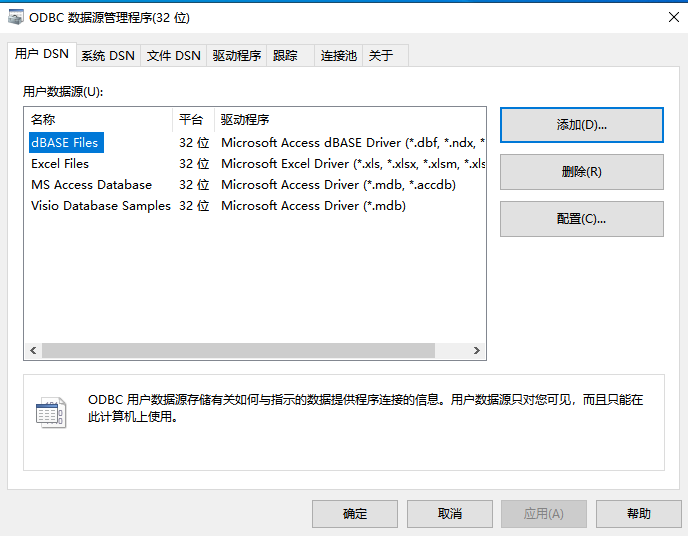
2. 点击右边的添加按钮，找到 PostgreSQL Unicode,双击
   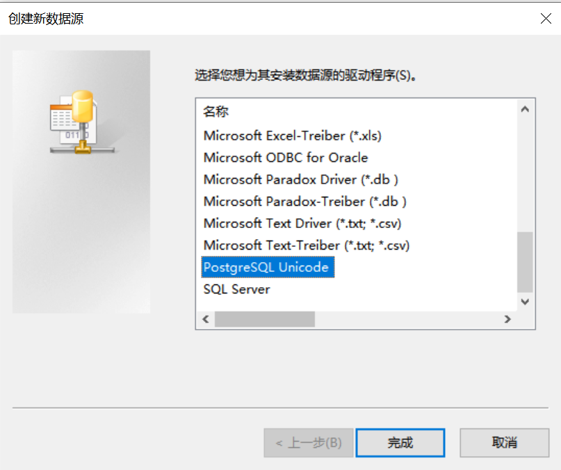
3. 然后填写连接信息，并点击 Test
   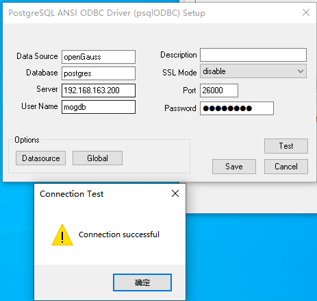
4. 提示连接成功，确定，点击 SAVE 保存，会弹出安全提示，意思就是连接信息会保存在系统注册表里，不安全，问是否继续，点"是"（本篇不讨论安全问题,请自行斟酌）
   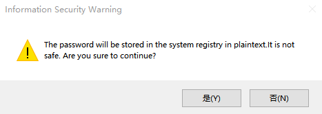
5. 然后就可以看到数据源里多了一个刚刚新建的数据源
   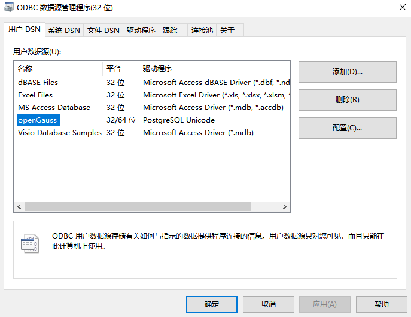

### 在 WPS 中引用数据源

1. 新建一个空白表格
2. 点击 数据 - 导入数据，选择 ODBC DSN
   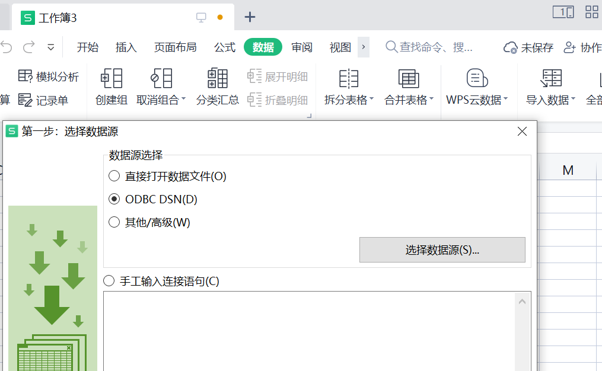
3. 选择刚刚新建的数据源，确定，下一步
   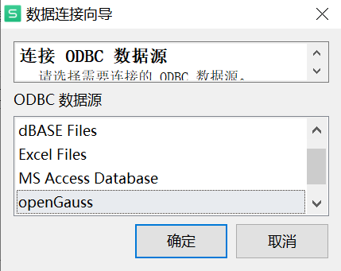
4. 选择需要的表，并将需要的字段移到右边，点击下一步
   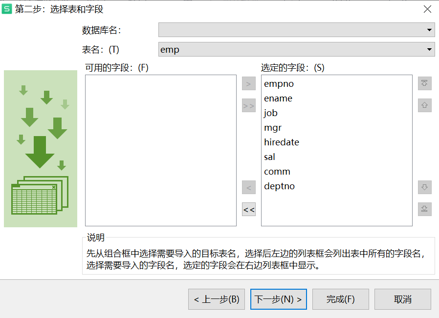
5. 选择手工输入连接语句，点击下一步
   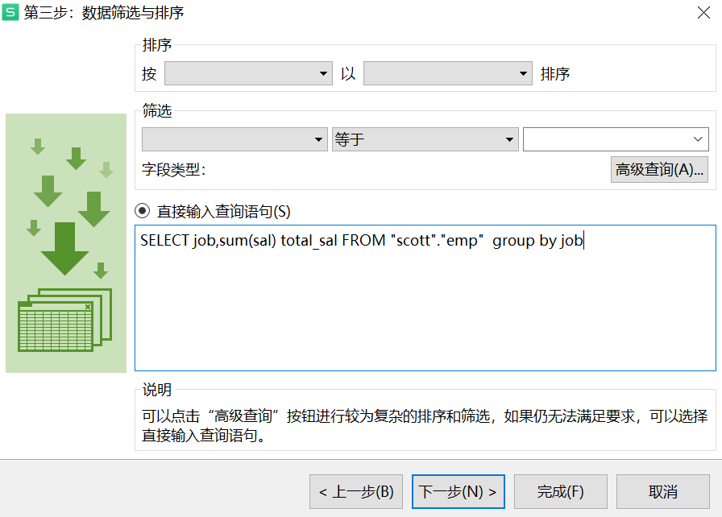
6. 预览没有问题，点击完成
   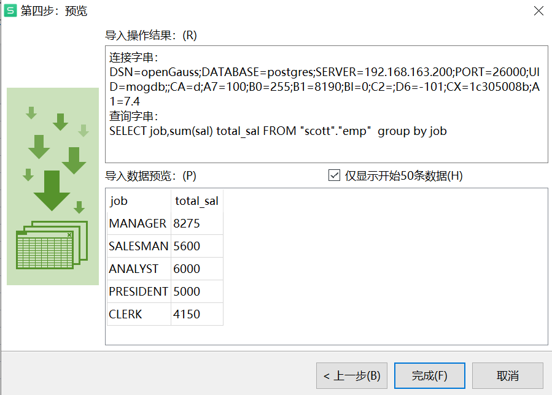
7. 选择数据需要存放的开始单元格，点击确定
   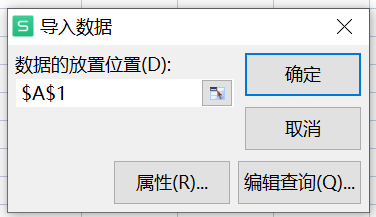
8. 数据就放回到表格中了
   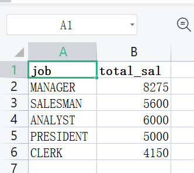

### 验证数据刷新

1. 在数据库中执行 sql 修改数据，比如让所有人的工资翻倍

```
update scott.emp set sal=sal*2 where 1=1;
```

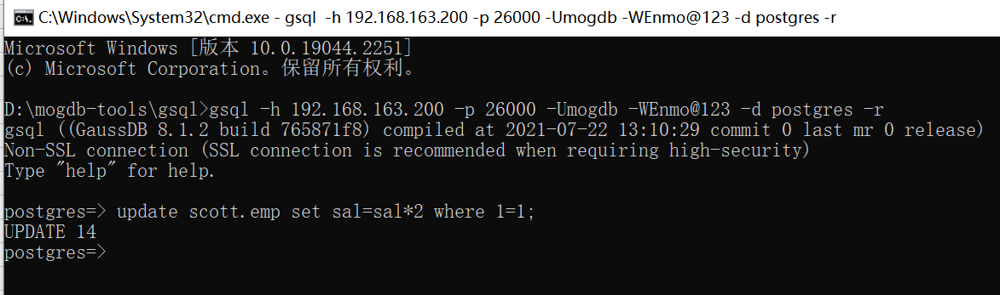
[windows 端 gsql 下载 （支持 sha256）https://obs.myhuaweicloud.com/dws/download/dws_8.1.x_gsql_for_windows.zip](https://obs.myhuaweicloud.com/dws/download/dws_8.1.x_gsql_for_windows.zip)
\2. 在表格数据区域点击鼠标右键，刷新数据
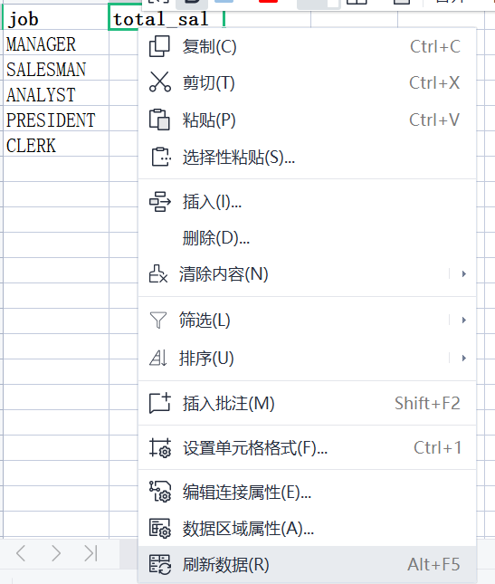
\3. 可以看到数据都变更了
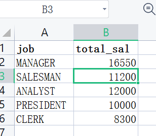

### 配置数据自动刷新

1. 在表格数据区域点击鼠标右键，点击数据区域属性
   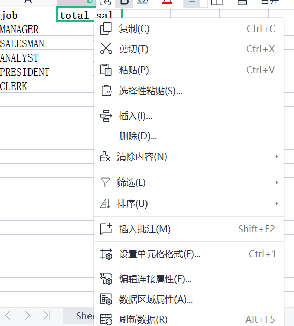
2. 设置刷新频率，并勾选打开文件时刷新数据
   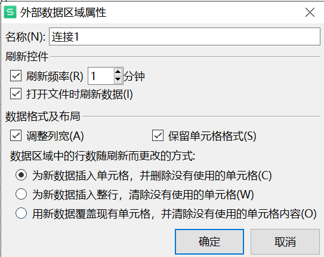

## 总结

本篇只举了个最简单的例子，实际上，新建多个查询，结合表格的公式，并调整表格的样式，是可以制作出相当精美的报表的，而且只用做一次，以后一直都能用，数据都是可以实时从数据库中获取的。
另外，以上操作在 MSOFFICE 中的 EXCEL 也是类似的，只是 EXCEL 还有个 MSQUERY 的程序，可以可视化编辑多表的关联关系，有兴趣的可以自己尝试一下。

> - **本文作者：** [DarkAthena](https://www.darkathena.top/)
> - **本文链接：** [https://www.darkathena.top/archives/opengauss-wps-excel-realtime-report-sha256](https://www.darkathena.top/archives/opengauss-wps-excel-realtime-report-sha256)
> - **版权声明：** 本博客所有文章除特别声明外，均采用[CC BY-NC-SA 3.0](https://creativecommons.org/licenses/by-nc-sa/3.0/) 许可协议。转载请注明出处！
