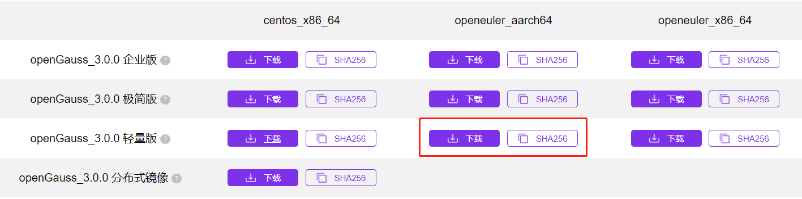
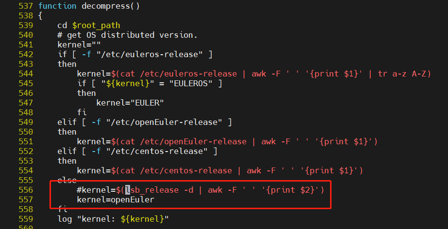

# OpenGauss3.0.0 轻量版部署

# 背景

openGauss 3.0.0 版本是 openGauss 社区继 2.0.0 之后发布的又一个 Release 版本，版本维护生命周期为 3.5 年。3.0.0 版本在高性能、高可用、高安全、高智能、工具链等方面都有持续创新和突破。3.0.0 版本除了包含企业版外同时发布了 openGauss 社区首个轻量版（Lite 版）。

今天是 openGauss 3.0.0 版本发布的第一天，忍不住搞一下试试~~

# 实验环境

```bash
Architecture:                    aarch64
CPU op-mode(s):                  64-bit
Byte Order:                      Little Endian
CPU(s):                          8
On-line CPU(s) list:             0-7
Thread(s) per core:              1
Core(s) per socket:              8
Socket(s):                       1
NUMA node(s):                    1
Vendor ID:                       HiSilicon
Model:                           0
Model name:                      Kunpeng-920
Stepping:                        0x1
CPU max MHz:                     2600.0000
CPU min MHz:                     2600.0000
BogoMIPS:                        200.00
L1d cache:                       512 KiB
L1i cache:                       512 KiB
L2 cache:                        4 MiB
L3 cache:                        32 MiB
NUMA node0 CPU(s):               0-7
Vulnerability Itlb multihit:     Not affected
Vulnerability L1tf:              Not affected
Vulnerability Mds:               Not affected
Vulnerability Meltdown:          Not affected
Vulnerability Spec store bypass: Not affected
Vulnerability Spectre v1:        Mitigation; __user pointer sanitization
Vulnerability Spectre v2:        Not affected
Vulnerability Tsx async abort:   Not affected
Flags:                           fp asimd evtstrm aes pmull sha1 sha2 crc32 atomics fphp asimdhp cpuid asimdrdm jscvt fcma dcpop asimddp asimdfhm
```

```bash
[frank@ecs-fc4a ~]$ cat /etc/os-release
NAME="Kylin Linux Advanced Server"
VERSION="V10 (Tercel)"
ID="kylin"
VERSION_ID="V10"
PRETTY_NAME="Kylin Linux Advanced Server V10 (Tercel)"
ANSI_COLOR="0;31"
```

# 下载



```bash
[frank@ecs-fc4a ~]$ mkdir opengauss
[frank@ecs-fc4a ~]$ wget -c https://opengauss.obs.cn-south-1.myhuaweicloud.com/3.0.0/arm/openGauss-Lite-3.0.0-openEuler-aarch64.tar.gz
--2022-04-02 11:37:41--  https://opengauss.obs.cn-south-1.myhuaweicloud.com/3.0.0/arm/openGauss-Lite-3.0.0-openEuler-aarch64.tar.gz
Resolving opengauss.obs.cn-south-1.myhuaweicloud.com (opengauss.obs.cn-south-1.myhuaweicloud.com)... 139.159.208.230, 121.37.63.38, 139.159.208.67, ...
Connecting to opengauss.obs.cn-south-1.myhuaweicloud.com (opengauss.obs.cn-south-1.myhuaweicloud.com)|139.159.208.230|:443... connected.
HTTP request sent, awaiting response... 200 OK
Length: 21142255 (20M) [application/gzip]
Saving to: ‘openGauss-Lite-3.0.0-openEuler-aarch64.tar.gz’

openGauss-Lite-3.0.0-openEuler-aarch64.ta 100%[==================================================================================>]  20.16M  22.4MB/s    in 0.9s

2022-04-02 11:37:42 (22.4 MB/s) - ‘openGauss-Lite-3.0.0-openEuler-aarch64.tar.gz’ saved [21142255/21142255]
```

# 安装

- 解压

```bash
[frank@ecs-fc4a ~]$ mkdir opengauss
[frank@ecs-fc4a ~]$ cd opengauss/
[frank@ecs-fc4a opengauss]$ tar -zxf openGauss-Lite-3.0.0-openEuler-aarch64.tar.gz
[frank@ecs-fc4a opengauss]$ ll
total 41684
drwx------ 2 frank frank     4096 Apr  1 18:33 dependency
-rw------- 1 frank frank    38398 Apr  1 18:33 install.sh
-rw------- 1 frank frank 21032901 Apr  1 18:33 openGauss-Lite-3.0.0-openEuler-aarch64.bin
-rw------- 1 frank frank       65 Apr  1 18:33 openGauss-Lite-3.0.0-openEuler-aarch64.sha256
-rw------- 1 frank frank 21142255 Apr  1 18:39 openGauss-Lite-3.0.0-openEuler-aarch64.tar.gz
-rw------- 1 frank frank      742 Apr  1 18:33 opengauss_lite.conf
-rw------- 1 frank frank     2852 Apr  1 18:33 uninstall.sh
-rw------- 1 frank frank    38674 Apr  1 18:33 upgrade_common.sh
-rw------- 1 frank frank      634 Apr  1 18:33 upgrade_config.sh
-rw------- 1 frank frank      392 Apr  1 18:33 upgrade_errorcode.sh
-rw------- 1 frank frank     1100 Apr  1 18:33 upgrade_GAUSSV5.sh
-rw------- 1 frank frank       65 Apr  1 18:33 upgrade_sql.sha256
-rw------- 1 frank frank   385518 Apr  1 18:33 upgrade_sql.tar.gz
-rw------- 1 frank frank       37 Apr  1 18:33 version.cfg
```

- 修改 install.sh
  由于目前版本不支持 kylin v10，所以，这里需要进行，修改，伪装成`openEuler`.
  

- 安装

```bash
[frank@ecs-fc4a opengauss]$ echo OpenGauss@123 | sh ./install.sh --mode single -D ~/opengauss/data -R ~/opengauss/install  --start
[frank@ecs-fc4a opengauss]$ source /home/frank/.bashrc
```

# 验证

```bash
[frank@ecs-fc4a opengauss]$ ps ux | grep gaussdb
frank      10446  0.0  1.0 2451136 167808 ?      Ssl  11:56   0:00 /home/frank/opengauss/install/bin/gaussdb -D /home/frank/opengauss/data
frank      10635  0.0  0.0 214016  1536 pts/0    S+   12:36   0:00 grep gaussdb
```

```bash
[frank@ecs-fc4a opengauss]$ gs_ctl query -D /home/frank/opengauss/data
[2022-04-02 12:37:26.767][10661][][gs_ctl]: gs_ctl query ,datadir is /home/frank/opengauss/data
 HA state:
        local_role                     : Normal
        static_connections             : 0
        db_state                       : Normal
        detail_information             : Normal

 Senders info:
No information
 Receiver info:
No information
```

# gsql 链接 openGauss

```
[frank@ecs-fc4a opengauss]$ gsql -d postgres
gsql ((openGauss 3.0.0 build 02c14696) compiled at 2022-04-01 18:28:23 commit 0 last mr  release)
Non-SSL connection (SSL connection is recommended when requiring high-security)
Type "help" for help.

openGauss=# \l
                              List of databases
   Name    | Owner | Encoding |   Collate   |    Ctype    | Access privileges
-----------+-------+----------+-------------+-------------+-------------------
 postgres  | frank | UTF8     | en_US.UTF-8 | en_US.UTF-8 |
 template0 | frank | UTF8     | en_US.UTF-8 | en_US.UTF-8 | =c/frank         +
           |       |          |             |             | frank=CTc/frank
 template1 | frank | UTF8     | en_US.UTF-8 | en_US.UTF-8 | =c/frank         +
           |       |          |             |             | frank=CTc/frank
(3 rows)

openGauss=#

```
