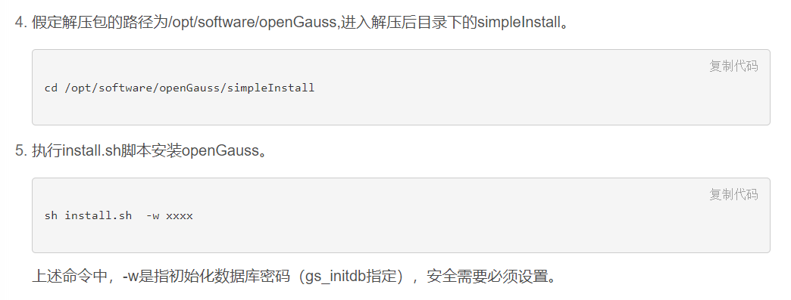
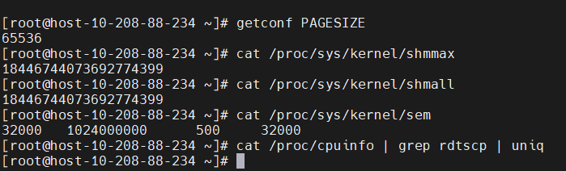

# openGauss 脚本源码浅析（1）—— simpleInstall

# 摘要

> 在编译完成 openGauss 或者已 download 了 openGauss 的 bin 后，想要做简易安装，官方给的使用方法是使用 simpleInstall。本文主要介绍 simpleInstall 的脚本的功能，来了解一下简易安装内部实现原理。

# openGauss 简易安装

## postgres 初始化数据库

了解 openGauss 安装之前简单说一下 postgres 的安装过程，postgres 没有提供安装脚本，但是初始化数据库集簇的命令很简单：

```bash
initdb -D $PGDATA
```

会在指定的 PGDATA 目录下创建数据库，可以参考之前的一篇文章[postgresql 15 源码浅析（1）—— postgres 中的 1 号数据库](https://www.modb.pro/db/405982) 。

## openGauss 脚本安装



openGauss 简易安装是使用 simpleInstall 下面的 install.sh 脚本。

# simpleInstall 源码解析

## step1 获取命令行参数（get_param）

先看一下需要那些参数

```bash
function usage()
{
    echo "
Usage: sh $0 -w password
Arguments:
   -w                   login password
   -p                   datanode port, default 5432
   --multinode          if specify, will install master_slave cluster. default install single node.
   -h, --help           Show this help, then exit
   "
}
```

主要有 3 个参数：

\-w 设置超级用户的源码，这个是必选项，如不设置后续初始化流程无法完成，这也是和 postgres 的一个区别，postgres 不强制要求超级用户密码。且使用-W（大写）设置密码，设置形式是交互的。-w（小写）是 openGauss 引入的新参数；

\-p 设置服务端口，非必选，默认是 5432；

\--multinode 初始化数据库提供两种形式，及单节点和主备两种；

\-w 和 -W 的区别


两个参数的功能是一样的，但是-W 是 postgres 保留的功能，是交互是的，需要手动数据密码；-w 是自动的方式将密码通过命令行传入程序，我猜 openGauss 是为了兼容原有的用法，所以新加了-w 的参数，且出于安全性考虑，是必须设置的。

## step2 检查参数（check_param）

主要检查一下几项：

1. \-w 参数必须填写，且不能为空
2. 密码必须大于 8 个字符
3. 不能使用 root 用户安装
4. 如不设置-p，怎使用默认端口 5432，否则使用-p 的设置
5. 如果设置了--multinode，则备节点的端口为主节点端口+200

## step3 检查安装环境（check_install_env）

1. 检查目录是否存在，如果是单节点模式，检查 data 下是否存在 single_node 目录，是否为空目录，如果是主备检查 master 和 slave 是否存在，是否为空；
2. 检查端口是否被占用；
3. 检查 unix sock 是否有权限，是否被占用

## step4 检查操作系统参数（check_os）

1. 检查系统共享内存和页大小



2. x86 下还要检查 rdtscp，应该是和指令顺序有关

> 这块有留个坑吧，不是很了解，后续有机会在填上。

## step5 修改应用目录的属组和权限（change_gausshome_owner）

1. 修改属组：chown omm:dbgrp \$app
2. 修改权限：chmod 700 \$app

## step6 设置 omm 用户的环境变量

设置的环境变量包括：PATH、GAUSSHOME、LD_LIBRARY_PATH、GS_CLUSTER_NAME、ulimit -n 1000000


上图是 omm 用户的.bashrc 的内容

## step7-1 初始化数据库（single_install）

1. 初始化数据库集簇，参考[postgresql 15 源码浅析（1）—— postgres 中的 1 号数据库](https://www.modb.pro/db/405982) 基本流程没有太大区别；

> 第二个坑，后续会对比一下 initdb 过程 postgres 和 openGauss 的有哪些差别。

```bash
gs_initdb -w $password -D $app/data/single_node --nodename "sgnode" --locale="en_US.UTF-8"
```

2. 修改配置文件 postgres.conf 中的端口

```bash
sed -i "/^#port =/c\port = $port" $app/data/single_node/postgresql.conf
```

3. 启动数据库

```bash
gs_ctl start -D $app/data/single_node -Z single_node
```

## step7-2 初始化数据库（master_standby_install）

### init_db

```bash
function init_db() {
    info "[init primary datanode.]"
    gs_initdb -D $app/data/master --nodename=datanode1 -E UTF-8 --locale=en_US.UTF-8 -U $user  -w $password
    info "[init slave datanode.]"
    gs_initdb -D $app/data/slave --nodename=datanode2 -E UTF-8 --locale=en_US.UTF-8 -U $user  -w $password
}
```

分别对主备两个库进行初始化。

### config_db

```bash
function config_db() {
    info "[config datanode.]"
    local -a ip_arr
    local -i index=0
    for line in $(/sbin/ifconfig -a|grep inet|grep -v 127.0.0.1|grep -v inet6|awk '{print $2}'|tr -d "addr:")
    do
        ip_arr[index]=$line
        let index=$index+1
    done
    sed -i "/^#listen_addresses/c\listen_addresses = 'localhost,${ip_arr[0]}'"  $app/data/master/postgresql.conf
    sed -i "/^#listen_addresses/c\listen_addresses = 'localhost,${ip_arr[0]}'"  $app/data/slave/postgresql.conf
    sed -i "/^#port/c\port = $port"  $app/data/master/postgresql.conf
    sed -i "/^#port/c\port = $slave_port"  $app/data/slave/postgresql.conf
    sed -i "/^#replconninfo1/c\replconninfo1 = 'localhost=${ip_arr[0]} localport=$(($port+1)) localheartbeatport=$(($port+5)) localservice=$(($port+4)) remotehost=${ip_arr[0]} remoteport=$(($slave_port+1)) remoteheartbeatport=$(($slave_port+5)) remoteservice=$(($slave_port+4))'"  $app/data/master/postgresql.conf
    sed -i "/^#replconninfo1/c\replconninfo1 = 'localhost=${ip_arr[0]} localport=$(($slave_port+1)) localheartbeatport=$(($slave_port+5)) localservice=$(($slave_port+4)) remotehost=${ip_arr[0]} remoteport=$(($port+1)) remoteheartbeatport=$(($port+5)) remoteservice=$(($port+4))'"  $app/data/slave/postgresql.conf
    echo "remote_read_mode = non_authentication" | tee -a $app/data/master/postgresql.conf $app/data/slave/postgresql.conf
    echo "host    all             all             ${ip_arr[0]}/32            trust" | tee -a $app/data/master/pg_hba.conf $app/data/slave/pg_hba.conf
}
```

主要修改主备的服务提供端口、主备通信端口 和 客户端登录权限等，涉及配置文件 postgres.conf 和 pg_hba.conf。

### start_db


```bash
-b,  --mode=MODE       the mode of building the datanode or coordinator.MODE can be "full", "incremental", "auto", "standby_full", "copy_secure_files", "copy_upgrade_file", "cross_cluster_full", "cross_cluster_incremental", "cross_cluster_standby_full"
-M                     the database start as the appointed  mode
-D, --pgdata=DATADIR   location of the database storage area
```

## step8 导入范例 SQL（import_sql）

```bash
read -p "Would you like to create a demo database (yes/no)? " input
```

接收输入，是否要建立范例数据库

导入两个 sql 文件中的内容

```bash
function fn_load_demoDB()
{
    cd $shell_path
    gsql -d postgres -p $port -f school.sql
    gsql -d postgres -p $port -f finance.sql
}
```

# 结束

以上步骤执行成功后，即完成了数据库集簇的初始化和启动过程。如果大家在启动本地安装过程中遇到问题，可以对照以上步骤进行排查。

# 启动日志

```bash
[omm@host-10-208-88-234 simpleInstall]$ sh install.sh -w xk.xmx190035
[step 1]: check parameter
[step 2]: check install env and os setting
[step 3]: change_gausshome_owner
[step 4]: set environment variables

/home/omm/.bashrc: line 13: ulimit: open files: cannot modify limit: Operation not permitted
[step 6]: init datanode
The files belonging to this database system will be owned by user "omm".
This user must also own the server process.

The database cluster will be initialized with locale "en_US.UTF-8".
The default database encoding has accordingly been set to "UTF8".
The default text search configuration will be set to "english".

creating directory /home/omm/git/openGauss-server/data/single_node ... ok
creating subdirectories ... ok
selecting default max_connections ... 100
selecting default shared_buffers ... 32MB
creating configuration files ... ok
Begin init undo subsystem meta.
[INIT UNDO] Init undo subsystem meta successfully.
creating template1 database in /home/omm/git/openGauss-server/data/single_node/base/1 ... The core dump path is an invalid directory
2022-05-23 12:30:32.064 [unknown] [unknown] localhost 281459036192784 0[0:0#0]  [BACKEND] WARNING:  macAddr is 64022/1056020634, sysidentifier is 4195761905/2560264540, randomNum is 246122844
ok
initializing pg_authid ... ok
setting password ... ok
initializing dependencies ... ok
loading PL/pgSQL server-side language ... ok
creating system views ... ok
creating performance views ... ok
loading system objects' descriptions ... ok
creating collations ... ok
creating conversions ... ok
creating dictionaries ... ok
setting privileges on built-in objects ... ok
initialize global configure for bucketmap length ... ok
creating information schema ... ok
loading foreign-data wrapper for distfs access ... ok
loading foreign-data wrapper for hdfs access ... ok
loading foreign-data wrapper for log access ... ok
loading hstore extension ... ok
loading foreign-data wrapper for MOT access ... ok
loading security plugin ... ok
update system tables ... ok
creating snapshots catalog ... ok
vacuuming database template1 ... ok
copying template1 to template0 ... ok
copying template1 to postgres ... ok
freezing database template0 ... ok
freezing database template1 ... ok
freezing database postgres ... ok

WARNING: enabling "trust" authentication for local connections
You can change this by editing pg_hba.conf or using the option -A, or
--auth-local and --auth-host, the next time you run gs_initdb.

Success. You can now start the database server of single node using:

    gaussdb -D /home/omm/git/openGauss-server/data/single_node --single_node
or
    gs_ctl start -D /home/omm/git/openGauss-server/data/single_node -Z single_node -l logfile

[step 7]: start datanode
[2022-05-23 12:30:51.410][991625][][gs_ctl]: gs_ctl started,datadir is /home/omm/git/openGauss-server/data/single_node
[2022-05-23 12:30:51.446][991625][][gs_ctl]: waiting for server to start...
.0 LOG:  [Alarm Module]can not read GAUSS_WARNING_TYPE env.

0 LOG:  [Alarm Module]Host Name: host-10-208-88-234

0 LOG:  [Alarm Module]Host IP: 10.208.88.234

0 LOG:  [Alarm Module]Cluster Name: dbCluster

0 LOG:  [Alarm Module]Get real path of alarmItem.conf failed!

0 WARNING:  failed to open feature control file, please check whether it exists: FileName=gaussdb.version, Errno=2, Errmessage=No such file or directory.
0 WARNING:  failed to parse feature control file: gaussdb.version.
0 WARNING:  Failed to load the product control file, so gaussdb cannot distinguish product version.
The core dump path is an invalid directory
2022-05-23 12:30:51.581 [unknown] [unknown] localhost 281460165246992 0[0:0#0]  0 [BACKEND] LOG:  when starting as multi_standby mode, we couldn't support data replicaton.
gaussdb.state does not exist, and skipt setting since it is optional.2022-05-23 12:30:51.587 [unknown] [unknown] localhost 281460165246992 0[0:0#0]  0 [BACKEND] LOG:  [Alarm Module]can not read GAUSS_WARNING_TYPE env.

2022-05-23 12:30:51.587 [unknown] [unknown] localhost 281460165246992 0[0:0#0]  0 [BACKEND] LOG:  [Alarm Module]Host Name: host-10-208-88-234

2022-05-23 12:30:51.636 [unknown] [unknown] localhost 281460165246992 0[0:0#0]  0 [BACKEND] LOG:  [Alarm Module]Host IP: 10.208.88.234

2022-05-23 12:30:51.636 [unknown] [unknown] localhost 281460165246992 0[0:0#0]  0 [BACKEND] LOG:  [Alarm Module]Cluster Name: dbCluster

2022-05-23 12:30:51.636 [unknown] [unknown] localhost 281460165246992 0[0:0#0]  0 [BACKEND] LOG:  [Alarm Module]Get real path of alarmItem.conf failed!

2022-05-23 12:30:51.641 [unknown] [unknown] localhost 281460165246992 0[0:0#0]  0 [BACKEND] LOG:  loaded library "security_plugin"
2022-05-23 12:30:51.642 [unknown] [unknown] localhost 281460165246992 0[0:0#0]  0 [BACKEND] WARNING:  could not create any HA TCP/IP sockets
2022-05-23 12:30:51.642 [unknown] [unknown] localhost 281460165246992 0[0:0#0]  0 [BACKEND] WARNING:  could not create any HA TCP/IP sockets
2022-05-23 12:30:51.645 [unknown] [unknown] localhost 281460165246992 0[0:0#0]  0 [BACKEND] WARNING:  No explicit IP is configured for listen_addresses GUC.
2022-05-23 12:30:51.645 [unknown] [unknown] localhost 281460165246992 0[0:0#0]  0 [BACKEND] LOG:  InitNuma numaNodeNum: 1 numa_distribute_mode: none inheritThreadPool: 0.
2022-05-23 12:30:51.645 [unknown] [unknown] localhost 281460165246992 0[0:0#0]  0 [BACKEND] LOG:  reserved memory for backend threads is: 220 MB
2022-05-23 12:30:51.645 [unknown] [unknown] localhost 281460165246992 0[0:0#0]  0 [BACKEND] LOG:  reserved memory for WAL buffers is: 128 MB
2022-05-23 12:30:51.645 [unknown] [unknown] localhost 281460165246992 0[0:0#0]  0 [BACKEND] LOG:  Set max backend reserve memory is: 348 MB, max dynamic memory is: 11027 MB
2022-05-23 12:30:51.645 [unknown] [unknown] localhost 281460165246992 0[0:0#0]  0 [BACKEND] LOG:  shared memory 400 Mbytes, memory context 11375 Mbytes, max process memory 12288 Mbytes
2022-05-23 12:30:51.681 [unknown] [unknown] localhost 281460165246992 0[0:0#0]  0 [CACHE] LOG:  set data cache  size(402653184)
2022-05-23 12:30:51.726 [unknown] [unknown] localhost 281460165246992 0[0:0#0]  0 [CACHE] LOG:  set metadata cache  size(134217728)
2022-05-23 12:30:51.741 [unknown] [unknown] localhost 281460165246992 0[0:0#0]  0 [SEGMENT_PAGE] LOG:  Segment-page constants: DF_MAP_SIZE: 8156, DF_MAP_BIT_CNT: 65248, DF_MAP_GROUP_EXTENTS: 4175872, IPBLOCK_SIZE: 8168, EXTENTS_PER_IPBLOCK: 1021, IPBLOCK_GROUP_SIZE: 4090, BMT_HEADER_LEVEL0_TOTAL_PAGES: 8323072, BktMapEntryNumberPerBlock: 2038, BktMapBlockNumber: 25, BktBitMaxMapCnt: 512
2022-05-23 12:30:51.755 [unknown] [unknown] localhost 281460165246992 0[0:0#0]  0 [BACKEND] LOG:  gaussdb: fsync file "/home/omm/git/openGauss-server/data/single_node/gaussdb.state.temp" success
2022-05-23 12:30:51.755 [unknown] [unknown] localhost 281460165246992 0[0:0#0]  0 [BACKEND] LOG:  create gaussdb state file success: db state(STARTING_STATE), server mode(Normal), connection index(1)
2022-05-23 12:30:51.834 [unknown] [unknown] localhost 281460165246992 0[0:0#0]  0 [BACKEND] LOG:  max_safe_fds = 976, usable_fds = 1000, already_open = 14
The core dump path is an invalid directory
2022-05-23 12:30:51.839 [unknown] [unknown] localhost 281460165246992 0[0:0#0]  0 [BACKEND] LOG:  user configure file is not found, it will be created.
2022-05-23 12:30:51.842 [unknown] [unknown] localhost 281460165246992 0[0:0#0]  0 [BACKEND] LOG:  the configure file /home/omm/git/openGauss-server/etc/gscgroup_omm.cfg doesn't exist or the size of configure file has changed. Please create it by root user!
2022-05-23 12:30:51.842 [unknown] [unknown] localhost 281460165246992 0[0:0#0]  0 [BACKEND] LOG:  Failed to parse cgroup config file.
2022-05-23 12:30:51.862 [unknown] [unknown] localhost 281460165246992 0[0:0#0]  0 [EXECUTOR] WARNING:  Failed to obtain environment value $GAUSSLOG!
2022-05-23 12:30:51.862 [unknown] [unknown] localhost 281460165246992 0[0:0#0]  0 [EXECUTOR] DETAIL:  N/A
2022-05-23 12:30:51.862 [unknown] [unknown] localhost 281460165246992 0[0:0#0]  0 [EXECUTOR] CAUSE:  Incorrect environment value.
2022-05-23 12:30:51.862 [unknown] [unknown] localhost 281460165246992 0[0:0#0]  0 [EXECUTOR] ACTION:  Please refer to backend log for more details.
2022-05-23 12:30:51.863 [unknown] [unknown] localhost 281460165246992 0[0:0#0]  0 [EXECUTOR] WARNING:  Failed to obtain environment value $GAUSSLOG!
2022-05-23 12:30:51.863 [unknown] [unknown] localhost 281460165246992 0[0:0#0]  0 [EXECUTOR] DETAIL:  N/A
2022-05-23 12:30:51.863 [unknown] [unknown] localhost 281460165246992 0[0:0#0]  0 [EXECUTOR] CAUSE:  Incorrect environment value.
2022-05-23 12:30:51.863 [unknown] [unknown] localhost 281460165246992 0[0:0#0]  0 [EXECUTOR] ACTION:  Please refer to backend log for more details.

[2022-05-23 12:30:52.460][991625][][gs_ctl]:  done
[2022-05-23 12:30:52.460][991625][][gs_ctl]: server started (/home/omm/git/openGauss-server/data/single_node)
import sql file
Would you like to create a demo database (yes/no)? yes
Load demoDB [school,finance] success.
[complete successfully]: You can start or stop the database server using:
    gs_ctl start|stop|restart -D $GAUSSHOME/data/single_node -Z single_node

```

# 备注

上面留下两个坑，待后续填上。

| 没填上的坑                                     | 挖坑的时间 |
| ---------------------------------------------- | ---------- |
| x86 下的 rdtscp                                | 2022-05-23 |
| initdb 过程 postgres 和 openGauss 的有哪些差别 | 2022-05-23 |
