# openGauss 账本数据库，你不知道的那些事儿

# 摘要

> 本文将通过对比官方文档关于**“设置账本数据库”**中的几个章节，结合源码来说说文档中操作步骤背后的原理。

# 账本数据库概述

## 你知道的那些事儿

### [官方文档](https://docs.opengauss.org/zh/docs/3.0.0/docs/Developerguide/%E8%B4%A6%E6%9C%AC%E6%95%B0%E6%8D%AE%E5%BA%93%E6%A6%82%E8%BF%B0.html)

> 账本数据库融合了区块链思想，将用户操作记录至两种历史表中：用户历史表和全局区块表。当用户创建防篡改用户表时，系统将自动为该表添加一个 hash 列来保存每行数据的 hash 摘要信息，同时在 blockchain 模式下会创建一张用户历史表来记录对应用户表中每条数据的变更行为；而用户对防篡改用户表的一次修改行为将记录至全局区块表中。由于历史表具有只可追加不可修改的特点，因此历史表记录串联起来便形成了用户对防篡改用户表的修改历史。

## 你不知道的那些事儿

### 操作步骤

#### 1.创建防篡改模式。

```sql
openGauss=# CREATE SCHEMA ledgernsp WITH BLOCKCHAIN;
```

首先在这个 SQL 中我们可以看到`WITH BLOCKCHAIN` ，这里说明创建出来的 SCHEMA 与普通的 SCHEMA 不同，但就行不同在哪里我们后面会提到。

- 从语法解析看，增加了对 BLOCKCHAIN 的处理，标记了是否为账本模式。

```sql
  CreateSchema ::= CREATE SCHEMA schema_name
      [ AUTHORIZATION user_name ] [WITH BLOCKCHAIN] [ schema_element [ ... ] ];
```

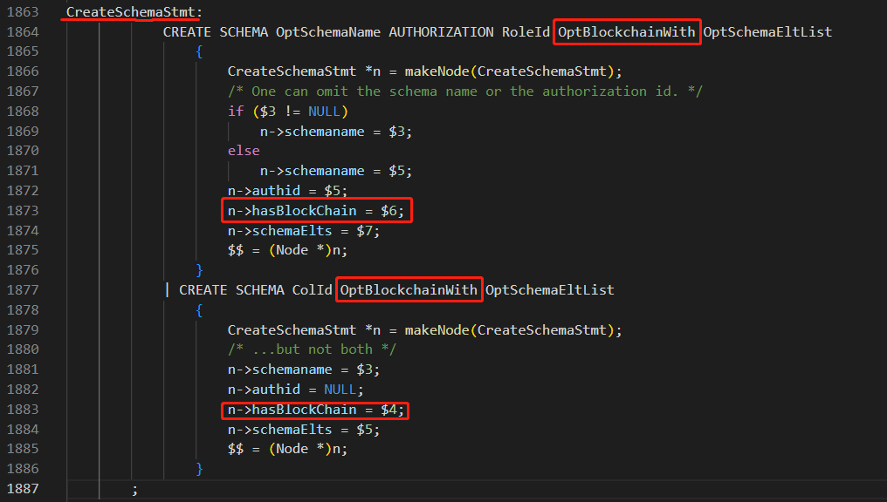

- CreateSchemaStmt 结构中增加了 bool 类型字段 hasBlockChain

```cpp
typedef struct CreateSchemaStmt {
    NodeTag type;
    char *schemaname;  /* the name of the schema to create */
    char *authid;      /* the owner of the created schema */
    bool hasBlockChain;  /* whether this schema has blockchain */
    List *schemaElts;  /* schema components (list of parsenodes) */
    TempType temptype; /* if the schema is temp table's schema */
    List *uuids;       /* the list of uuid(only create sequence or table with serial type need) */
} CreateSchemaStmt;
```

##### 你不知道的限制

账本数据库对于 ALTER SCHEMA 的几个限制

- 1、dbe_perf 和 snapshot 两个模式不能 ALTER 为 blockchain 模式。

```cpp
    if (withBlockchain && ((strncmp(nspName, "dbe_perf", STR_SCHEMA_NAME_LENGTH) == 0) ||
        (strncmp(nspName, "snapshot", STR_SNAPSHOT_LENGTH) == 0))) {
        ereport(ERROR, (errcode(ERRCODE_OPERATE_FAILED),
                        errmsg("The schema '%s' doesn't allow to alter to blockchain schema", nspName)));
    }
```


- 2、系统模式不能 ALTER 为 blockchain 模式。

```cpp
    if (withBlockchain && !g_instance.attr.attr_common.allowSystemTableMods &&
        !u_sess->attr.attr_common.IsInplaceUpgrade && IsReservedName(nspName))
        ereport(ERROR,
            (errcode(ERRCODE_RESERVED_NAME),
                errmsg("The system schema \"%s\" doesn't allow to alter to blockchain schema", nspName)));
```

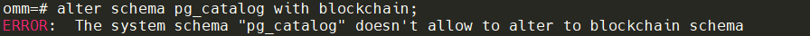

- 3、包含了表的 SCHEMA 不能 ALTER 为 blockchain 模式。

```cpp
    /*
     * If the any table exists in the schema, do not change to ledger schema.
     */
    StringInfo existTbl = TableExistInSchema(HeapTupleGetOid(tup), TABLE_TYPE_ANY);
    if (existTbl->len != 0) {
        if (withBlockchain) {
            ereport(ERROR,
                (errcode(ERRCODE_RESERVED_NAME),
                    errmsg("It is not supported to change \"%s\" to blockchain schema which includes tables.",
                        nspName)));
        } else {
            ereport(ERROR,
                (errcode(ERRCODE_RESERVED_NAME),
                    errmsg("It is not supported to change \"%s\" to normal schema which includes tables.",
                        nspName)));
        }

    }
```

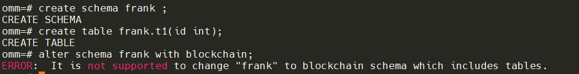

##### 查看模式

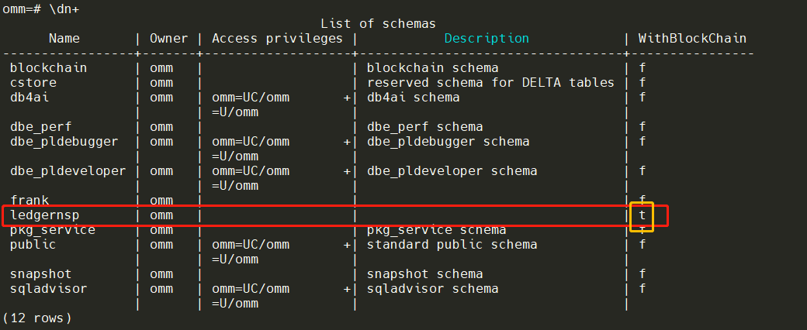

#### 2.在防篡改模式下创建防篡改用户表。

```sql
openGauss=# CREATE TABLE ledgernsp.usertable(id int, name text);
```

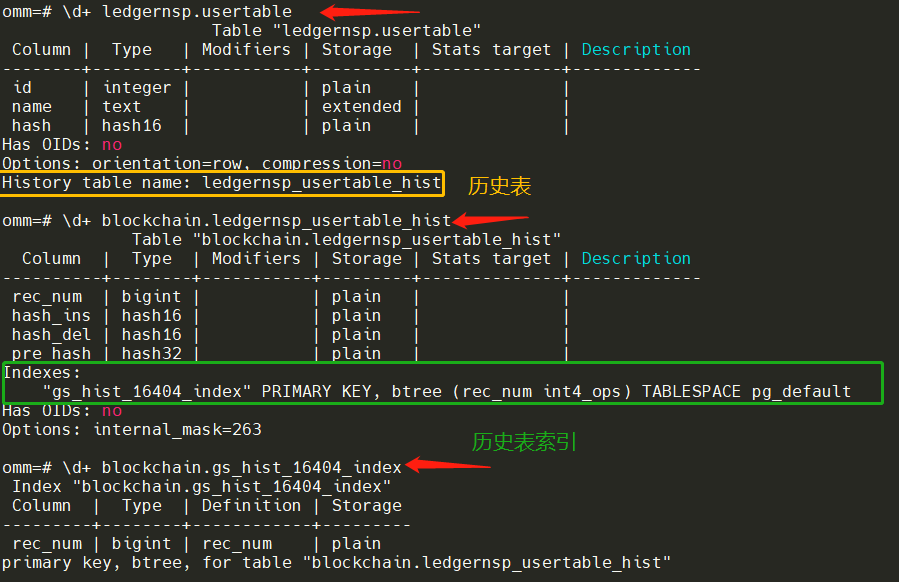

##### 你不知道的限制

- 创建账本表的同时会自动创建一个“历史表”和“历史表的索引”。

在建表时`CreateCommand`会调用`AlterCreateChainTables`，如果是账本表再去调用`create_hist_relation`来创建历史表

`CreateCommand` -> `AlterCreateChainTables` -> `create_hist_relation`

```cpp
/*
 * AlterCreateChainTables
 *    If it is a ledger usertable, that should invoking this function.
 *    then create a history table.
 */
void AlterCreateChainTables(Oid relOid, Datum reloptions, CreateStmt *mainTblStmt)
{
    Relation rel = NULL;

    rel = heap_open(relOid, AccessExclusiveLock);

    /* Ledger user table only support for the regular relation. */
    if (!rel->rd_isblockchain) {
        heap_close(rel, NoLock);
        return;
    }

    create_hist_relation(rel, reloptions, mainTblStmt);
    heap_close(rel, NoLock);
}
```

- 历史表命名规则，参见函数 get_hist_name

```cpp
bool get_hist_name(Oid relid, const char *rel_name, char *hist_name, Oid nsp_oid, const char *nsp_name)
{
    errno_t rc;
    if (!OidIsValid(relid) || rel_name == NULL) {
        return false;
    }
    nsp_oid = OidIsValid(nsp_oid) ? nsp_oid : get_rel_namespace(relid);
    nsp_name = (nsp_name == NULL) ? get_namespace_name(nsp_oid) : nsp_name;
    int part_hist_name_len = strlen(rel_name) + strlen(nsp_name) + 1;
    if (part_hist_name_len + strlen("_hist") >= NAMEDATALEN) {
        rc = snprintf_s(hist_name, NAMEDATALEN, NAMEDATALEN - 1, "%d_%d_hist", nsp_oid, relid);
        securec_check_ss(rc, "", "");
    } else {
        rc = snprintf_s(hist_name, NAMEDATALEN, NAMEDATALEN - 1, "%s_%s_hist", nsp_name, rel_name);
        securec_check_ss(rc, "", "");
    }
    return true;
}
```

- 表名最大长度 `#define NAMEDATALEN 64`
- 如果没有超过长度限制：schema_table_hist
- 如果超过长度限制：schema(oid)\_talbe(oid)\_hist，因为 oid 是 unsigned int 类型最大值为 4294967295 为 10 位，所以这种命名规则的最大长度为 10+1+10+1+4+\\0=27，因此永远不会超过最大长度 64。

```cpp
omm=# create schema aaaaaaaaaaaaaaaaaaaaaaaaaaaaaa with blockchain;
CREATE SCHEMA
omm=# create table aaaaaaaaaaaaaaaaaaaaaaaaaaaaaa.bbbbbbbbbbbbbbbbbbbbbbbbbbbbbb(id int);
CREATE TABLE
```

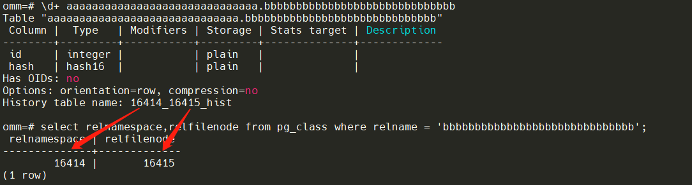

- 历史表索引命名规则，参见函数 get_hist_name

```cpp
    /* now create index for this new history table */
    char hist_index_name[NAMEDATALEN];
    rc = snprintf_s(hist_index_name, NAMEDATALEN, NAMEDATALEN - 1, "gs_hist_%u_index", relid);
```

- 命名规则：gs_hist\_\$(账本表 oid)\_index。

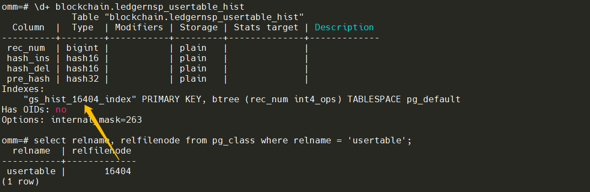

#### 3、修改防篡改用户表数据

对防篡改用户表执行 INSERT/UPDATE/DELETE。

```sql
openGauss=# INSERT INTO ledgernsp.usertable VALUES(1, 'alex'), (2, 'bob'), (3, 'peter');
INSERT 0 3
openGauss=# SELECT *, hash FROM ledgernsp.usertable ORDER BY id;
 id | name  |       hash
----+-------+------------------
  1 | alex  | 1f2e543c580cb8c5
  2 | bob   | 8fcd74a8a6a4b484
  3 | peter | f51b4b1b12d0354b
(3 rows)

openGauss=# UPDATE ledgernsp.usertable SET name = 'bob2' WHERE id = 2;
UPDATE 1
openGauss=# SELECT *, hash FROM ledgernsp.usertable ORDER BY id;
 id | name  |       hash
----+-------+------------------
  1 | alex  | 1f2e543c580cb8c5
  2 | bob2  | 437761affbb7c605
  3 | peter | f51b4b1b12d0354b
(3 rows)


openGauss=# DELETE FROM ledgernsp.usertable WHERE id = 3;
DELETE 1
openGauss=# SELECT *, hash FROM ledgernsp.usertable ORDER BY id;
 id | name |       hash
----+------+------------------
  1 | alex | 1f2e543c580cb8c5
  2 | bob2 | 437761affbb7c605
(2 rows)

```

# 查看账本历史操作记录

## 你知道的那些事儿

### [官方文档](https://opengauss.org/zh/docs/3.0.0/docs/Developerguide/%E6%9F%A5%E7%9C%8B%E8%B4%A6%E6%9C%AC%E5%8E%86%E5%8F%B2%E6%93%8D%E4%BD%9C%E8%AE%B0%E5%BD%95.html)

前提条件

- `系统中需要有审计管理员或者具有审计管理员权限的角色。`
- `数据库正常运行，并且对防篡改数据库执行了一系列增、删、改等操作，保证在查询时段内有账本操作记录结果产生。`

## 你不知道的那些事儿

### 基本操作

#### 1、查询全局区块表记录。

```sql
omm=# SELECT * FROM gs_global_chain;
 blocknum | dbname | username |           starttime           | relid |  relnsp   |  relname  |     relhash      |            globalhash            |
                  txcommand
----------+--------+----------+-------------------------------+-------+-----------+-----------+------------------+----------------------------------+----------------
--------------------------------------------------------------
        1 | omm    | omm      | 2022-09-17 13:59:37.84824+00  | 16404 | ledgernsp | usertable | a41714001181a294 | 83927d11ba1fd678e8f4b0723a9cd5f2 | INSERT INTO led
gernsp.usertable VALUES(1, 'alex'), (2, 'bob'), (3, 'peter');
        2 | omm    | omm      | 2022-09-17 13:59:51.723068+00 | 16404 | ledgernsp | usertable | b3a9ed0755131181 | b5ee73b6c20c817230182f6373c78e20 | UPDATE ledgerns
p.usertable SET name = 'bob2' WHERE id = 2;
        3 | omm    | omm      | 2022-09-17 13:59:58.159596+00 | 16404 | ledgernsp | usertable | 0ae4b4e4ed2fcab5 | 0cc9938cf7f1ed7f7f1a03c29954380a | DELETE FROM led
gernsp.usertable WHERE id = 3;
(3 rows)
```

- 注册钩子，在对账本做修改操作的时候注册的钩子函数`ledger_ExecutorEnd`被回调。

```cpp
/*
 * ledger_hook_init -- install of gchain block record hook.
 */
void ledger_hook_init(void)
{
    t_thrd.security_ledger_cxt.prev_ExecutorEnd = (void *)ExecutorEnd_hook;
    ExecutorEnd_hook = ledger_ExecutorEnd;
}
```

- 生成 globalhash 规则

> 全局区块表记录主要是生成 globalhash.

调用过程：

ledger_ExecutorEnd --> ledger_gchain_append --> set_gchain_comb_string

--> get_next_g_blocknum

--> gen_global_hash

- set_gchain_comb_string，是一组字符串拼接成的：`rel_name + nsp_name + query_string + rel_hash`
- get_next_g_blocknum，用全局变量 g_blocknum 保存
- gen_global_hash，是的 set_gchain_comb_string 拼出来的串+上一条的 hash 值拼串然后再去 hash——区块链的基本原理

```cpp
bool gen_global_hash(hash32_t *hash_buffer, const char *info_string, bool exist, const hash32_t *prev_hash)
{
    errno_t rc = EOK;
    int comb_strlen;
    char *comb_string = NULL;
    /*
     * Previous block not exists means current insertion block is genesis,
     * then we use global systable as origin combine string for globalhash
     * generation. If previous block exists, we will use previous global
     * hash as combine string to calculate globalhash.
     */
    if (!exist) {
        /* generate genesis block globalhash */
        comb_strlen = strlen(GCHAIN_NAME) + strlen(info_string) + 1;
        comb_string = (char *)palloc0(comb_strlen);
        rc = snprintf_s(comb_string, comb_strlen, comb_strlen - 1, "%s%s", GCHAIN_NAME, info_string);
        securec_check_ss(rc, "", "");
    } else {
        /* use previous globalhash and current block info to calculate globalhash. */
        char *pre_hash_str = DatumGetCString(DirectFunctionCall1(hash32out, HASH32GetDatum(prev_hash)));
        comb_strlen = strlen(pre_hash_str) + strlen(info_string) + 1;
        comb_string = (char *)palloc0(comb_strlen);
        rc = snprintf_s(comb_string, comb_strlen, comb_strlen - 1, "%s%s", info_string, pre_hash_str);
        securec_check_ss(rc, "", "");
        pfree_ext(pre_hash_str);
    }

    if (!pg_md5_binary(comb_string, comb_strlen - 1, hash_buffer->data)) {
        pfree(comb_string);
        ereport(ERROR, (errcode(ERRCODE_OUT_OF_MEMORY), errmsg("Failed to generate globalhash, out of memory")));
        return false;
    }
    pfree(comb_string);
    return true;
}
```

- 在`src/gausskernel/runtime/executor/nodeModifyTable.cpp`中更新\_hist 表的 hash 值。

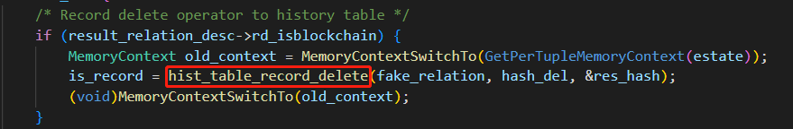

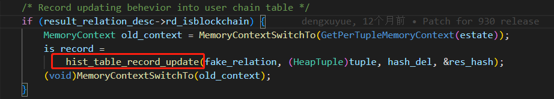

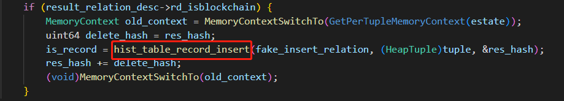

- 通过 set_user_tuple_hash 得到账本表 hash 列的值。

```cpp
/*
 * set_user_tuple_hash -- calculate and fill the hash attribute of user table's tuple.
 *
 * tup: row data of user table
 * rel: user table
 * hash_exists: whether tuple comes with tuplehash.
 *
 * Note: if hash_exists is true, we should recompute
 * tuple hash and compare with tuplehash of itself.
 */
HeapTuple set_user_tuple_hash(HeapTuple tup, Relation rel, bool hash_exists)
{
    uint64 row_hash = gen_user_tuple_hash(rel, tup);
    int hash_attrno = user_hash_attrno(rel->rd_att);
    if (hash_exists) {
        bool is_null;
        Datum hash = heap_getattr(tup, hash_attrno + 1, rel->rd_att, &is_null);
        if (is_null || row_hash != DatumGetUInt64(hash)) {
            ereport(ERROR, (errcode(ERRCODE_OPERATE_INVALID_PARAM), errmsg("Invalid tuple hash.")));
        }
        return tup;
    }
    Datum *values = NULL;
    bool *nulls = NULL;
    bool *replaces = NULL;
    /* Build modified tuple */
    int2 nattrs = RelationGetNumberOfAttributes(rel);
    values = (Datum*)palloc0(nattrs * sizeof(Datum));
    nulls = (bool*)palloc0(nattrs * sizeof(bool));
    replaces = (bool*)palloc0(nattrs * sizeof(bool));
    values[hash_attrno] = UInt64GetDatum(row_hash);
    replaces[hash_attrno] = true;
    HeapTuple newtup = heap_modify_tuple(tup, RelationGetDescr(rel), values, nulls, replaces);

    pfree_ext(values);
    pfree_ext(nulls);
    pfree_ext(replaces);
    return newtup;
}
```

# 校验账本数据一致性

## 你知道的那些事儿

### [官方文档](https://opengauss.org/zh/docs/3.0.0/docs/Developerguide/%E6%A0%A1%E9%AA%8C%E8%B4%A6%E6%9C%AC%E6%95%B0%E6%8D%AE%E4%B8%80%E8%87%B4%E6%80%A7.html)

> 数据库正常运行，并且对防篡改数据库执行了一系列增、删、改等操作，保证在查询时段内有账本操作记录结果产生。

## 你不知道的那些事儿

### 基本操作

#### 1、校验防篡改用户表 ledgernsp.usertable 与其对应的历史表是否一致。

```cpp
omm=# SELECT pg_catalog.ledger_hist_check('ledgernsp', 'usertable');
 ledger_hist_check
-------------------
 t
(1 row)
```

- 校验用户权限 `Only super user or audit admin have access right to blockchain nsp`

```cpp
    /* Only super user or audit admin have access right to blockchain nsp */
    if (nsp_oid == PG_BLOCKCHAIN_NAMESPACE) {
        return gs_blockchain_aclmask(roleid, mask);
    }
```

- 校验历史表 hash 值

is_hist_hash_identity --> get_usertable_hash_sum

--> get_histtable_hash_sum

```cpp
/*
 * is_hist_hash_identity -- check whether user table hash and history table hash are equal
 *
 * relid: user table oid
 * res_hash: hash sum of history table
 */
bool is_hist_hash_identity(Oid relid, uint64 *res_hash)
{
    uint64 user_hash_sum;
    uint64 hist_hash_sum;
    char hist_name[NAMEDATALEN];
    char *rel_name = get_rel_name(relid);
    if (!get_hist_name(relid, rel_name, hist_name)) {
        ereport(ERROR, (errcode(ERRCODE_UNDEFINED_OBJECT), errmsg("get hist table name failed.")));
    }
    Oid histoid = get_relname_relid(hist_name, PG_BLOCKCHAIN_NAMESPACE);
    if (!OidIsValid(histoid)) {
        ereport(ERROR, (errcode(ERRCODE_UNDEFINED_OBJECT), errmsg("could not find hist table of \"%s\".", rel_name)));
    }

    user_hash_sum = get_usertable_hash_sum(relid);
    hist_hash_sum = get_histtable_hash_sum(histoid);

    *res_hash = hist_hash_sum;
    return user_hash_sum == hist_hash_sum;
}
```

#### 2、查询防篡改用户表 ledgernsp.usertable 与其对应的历史表以及全局区块表中关于该表的记录是否一致。

```cpp
omm=# SELECT pg_catalog.ledger_gchain_check('ledgernsp', 'usertable');
 ledger_gchain_check
---------------------
 t
(1 row)
```

- 校验是否为账本表`ledger_usertable_check`
- 校验用户权限`has_ledger_consistent_privilege`
- 校验历史表 hash 值`is_hist_hash_identity`
- 计算/校验全局表 hash `get_gchain_relhash_sum`

```cpp
/*
 * get_gchain_relhash_sum -- calculate relhash from gs_global_chain
 *
 * relid: user table oid
 */
static uint64 get_gchain_relhash_sum(Oid relid)
{
    uint64 relhash = 0;
    HeapTuple tuple = NULL;

    /* scan the gs_global_chain catalog by relid */
    Relation gchain_rel = heap_open(GsGlobalChainRelationId, AccessShareLock);
    Form_gs_global_chain rdata = NULL;
    TableScanDesc scan = heap_beginscan(gchain_rel, SnapshotNow, 0, NULL);
    while ((tuple = heap_getnext(scan, ForwardScanDirection)) != NULL) {
        rdata = (Form_gs_global_chain)GETSTRUCT(tuple);
        if (rdata == NULL || rdata->relid != relid) {
            continue;
        }
        relhash += rdata->relhash;
    }
    heap_endscan(scan);
    heap_close(gchain_rel, AccessShareLock);
    return relhash;
}
```

# 归档账本数据库

## 你知道的那些事儿

### [官方文档](https://opengauss.org/zh/docs/3.0.0/docs/Developerguide/%E5%BD%92%E6%A1%A3%E8%B4%A6%E6%9C%AC%E6%95%B0%E6%8D%AE%E5%BA%93.html)

前提条件：

- 系统中需要有审计管理员或者具有审计管理员权限的角色。
- 数据库正常运行，并且对防篡改数据库执行了一系列增、删、改等操作，保证在查询时段内有账本操作记录结果产生。
- 数据库已经正确配置审计文件的存储路径 audit_directory。

## 你不知道的那些事儿

### 基本操作

#### 1、对指定用户历史表进行归档操作。

```cpp

omm=# SELECT pg_catalog.ledger_hist_archive('ledgernsp', 'usertable');
 ledger_hist_archive
---------------------
 t
(1 row)

omm=# SELECT * FROM blockchain.ledgernsp_usertable_hist;
 rec_num |     hash_ins     |     hash_del     |             pre_hash
---------+------------------+------------------+----------------------------------
       4 | e78e75b00d396899 | 84e8bfc3b974e9cf | 6475a497b7a272a92bab012d7f3d615b
(1 row)

```

主要步骤如下：

1. Copy user history table.
2. Do unify and truncate.
   1. sum all hash_ins and hash_del for unification.
   2. Do real truncate.`heap_truncate_one_rel`
   3. Do insertion for unified `row.simple_heap_insert`
3. Flush history hash table cache.

#### 2、执行全局区块表导出操作

```cpp
omm=# SELECT * FROM gs_global_chain;
 blocknum | dbname | username |           starttime           | relid |  relnsp   |  relname  |     relhash      |            globalhash            |
                  txcommand
----------+--------+----------+-------------------------------+-------+-----------+-----------+------------------+----------------------------------+----------------
--------------------------------------------------------------
        1 | omm    | omm      | 2022-09-17 13:59:37.84824+00  | 16404 | ledgernsp | usertable | a41714001181a294 | 83927d11ba1fd678e8f4b0723a9cd5f2 | INSERT INTO led
gernsp.usertable VALUES(1, 'alex'), (2, 'bob'), (3, 'peter');
        2 | omm    | omm      | 2022-09-17 13:59:51.723068+00 | 16404 | ledgernsp | usertable | b3a9ed0755131181 | b5ee73b6c20c817230182f6373c78e20 | UPDATE ledgerns
p.usertable SET name = 'bob2' WHERE id = 2;
        3 | omm    | omm      | 2022-09-17 13:59:58.159596+00 | 16404 | ledgernsp | usertable | 0ae4b4e4ed2fcab5 | 0cc9938cf7f1ed7f7f1a03c29954380a | DELETE FROM led
gernsp.usertable WHERE id = 3;
(3 rows)

omm=# SELECT pg_catalog.ledger_gchain_archive();
 ledger_gchain_archive
-----------------------
 t
(1 row)

omm=# SELECT * FROM gs_global_chain;
 blocknum | dbname | username |          starttime           | relid |  relnsp   |  relname  |     relhash      |            globalhash            | txcommand
----------+--------+----------+------------------------------+-------+-----------+-----------+------------------+----------------------------------+-----------
        2 | omm    | omm      | 2022-09-17 13:59:37.84824+00 | 16404 | ledgernsp | usertable | 62a5b5ec53c47eca | 7252d09679b0b3836a2e63da17284ad5 | Archived.
(1 row)

```

gs_global_chain 主要处理流程：

1. Init and prepare bak dictionary.
2. Using CopyStmt to copy global chain.
3. Do unify and truncate.
   1. Using hash table to do unify, each hash_entry refers to one relid informations.
   2. Split gs_global_chain by relid, and accumulate rel_hash to a new record for each rel.
   3. Do rel truncate.
   4. Insert newest record to gchain order by relid.
4. Flush global_hash cache.

# 修复账本数据库

## 你知道的那些事儿

### [官方文档](https://www.opengauss.org/zh/docs/latest/docs/Developerguide/%E4%BF%AE%E5%A4%8D%E8%B4%A6%E6%9C%AC%E6%95%B0%E6%8D%AE%E5%BA%93.html)

前提条件：

- 系统中需要有审计管理员或者具有审计管理员权限的角色。
- 数据库正常运行，并且对防篡改数据库执行了一系列增、删、改等操作，保证在查询时段内有账本操作记录结果产生。

## 你不知道的那些事儿

### 基本操作

#### 1、执行历史表修复操作

```sql
omm=# select * from blockchain.ledgernsp_usertable_hist;
 rec_num |     hash_ins     |     hash_del     |             pre_hash
---------+------------------+------------------+----------------------------------
       4 | e78e75b00d396899 | 84e8bfc3b974e9cf | 6475a497b7a272a92bab012d7f3d615b
(1 row)

omm=# SELECT pg_catalog.ledger_hist_repair('ledgernsp', 'usertable');
 ledger_hist_repair
--------------------
 0000000000000000
(1 row)

```

[drawio](rHmeQ8HWKS_RFXgP-oTUZINZguxBYqh2IV64Y0j5TAA.svg)

#### 2、执行全局区块表修复操作

```sql
omm=# select * from gs_global_chain ;
 blocknum | dbname | username |          starttime           | relid |  relnsp   |  relname  |     relhash      |            globalhash            | txcommand
----------+--------+----------+------------------------------+-------+-----------+-----------+------------------+----------------------------------+-----------
        2 | omm    | omm      | 2022-09-17 13:59:37.84824+00 | 16404 | ledgernsp | usertable | 62a5b5ec53c47eca | 7252d09679b0b3836a2e63da17284ad5 | Archived.
(1 row)

omm=# SELECT pg_catalog.ledger_gchain_repair('ledgernsp', 'usertable');
 ledger_gchain_repair
----------------------
 62a5b5ec53c47eca
(1 row)
```

首先判断用户权限，之后通过 get_gchain_relhash_sum 函数计算 relhash 字段

```cpp
/*
 * get_gchain_relhash_sum -- calculate relhash from gs_global_chain
 *
 * relid: user table oid
 */
static uint64 get_gchain_relhash_sum(Oid relid)
{
    uint64 relhash = 0;
    HeapTuple tuple = NULL;

    /* scan the gs_global_chain catalog by relid */
    Relation gchain_rel = heap_open(GsGlobalChainRelationId, AccessShareLock);
    Form_gs_global_chain rdata = NULL;
    TableScanDesc scan = heap_beginscan(gchain_rel, SnapshotNow, 0, NULL);
    while ((tuple = heap_getnext(scan, ForwardScanDirection)) != NULL) {
        rdata = (Form_gs_global_chain)GETSTRUCT(tuple);
        if (rdata == NULL || rdata->relid != relid) {
            continue;
        }
        relhash += rdata->relhash;
    }
    heap_endscan(scan);
    heap_close(gchain_rel, AccessShareLock);
    return relhash;
}
```

主要是计算并修复`gs_global_chain中的relhash`字段。

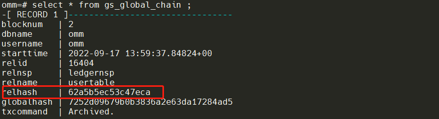

# 总结

账本数据库其实并不像我们想象的那么复制，实际上就是利用了区块链的最基本的原理，即当前记录的特征值 + 上一条记录特征值的 hash 值，再进行 hash。下一条与上一条记录具有数据关联性，形成“链”的结构，如果篡改了其中的数据，则会导致“链”断开，导致不能与后面数据记录形成 hash 关联。\_hist 表记录了用户表每一步数据变化的过程，gs_global_chain 表记录了所有防篡改模式下对用户表的操作记录。用户表结合\_hist 和 global 表就能完整记录和校验。
