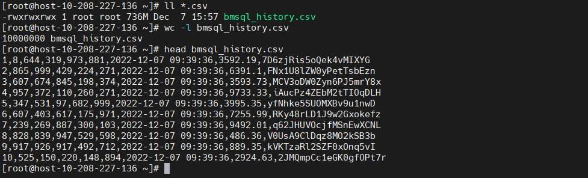
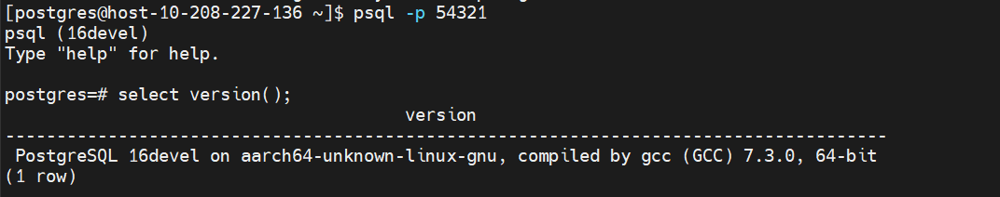
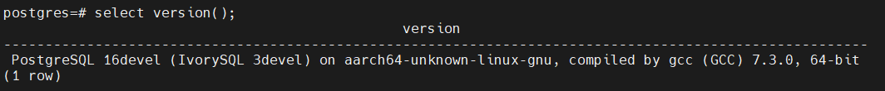
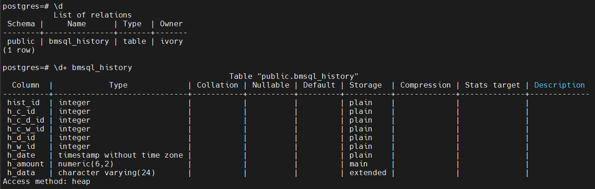
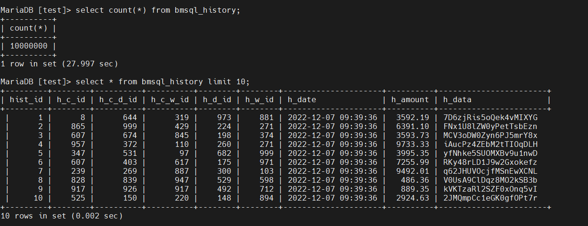
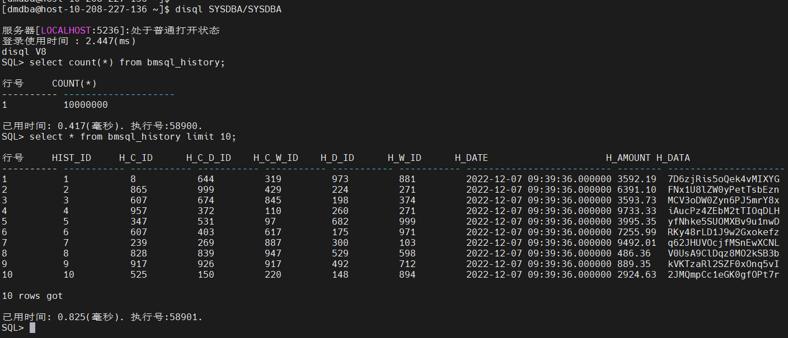
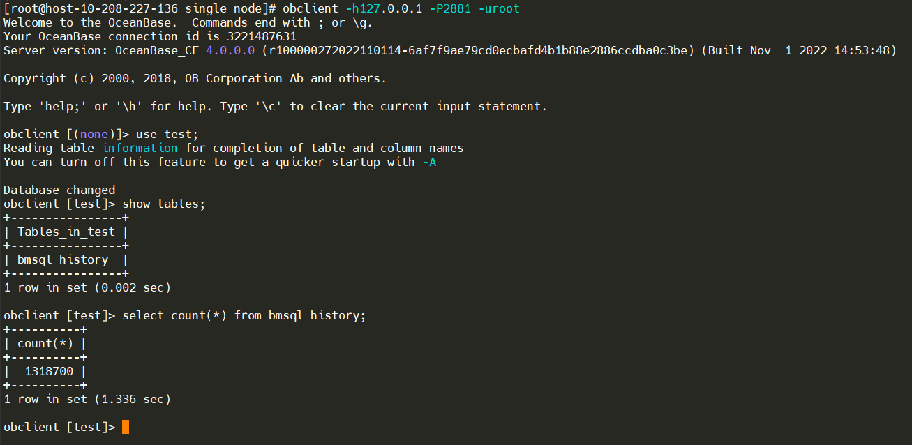
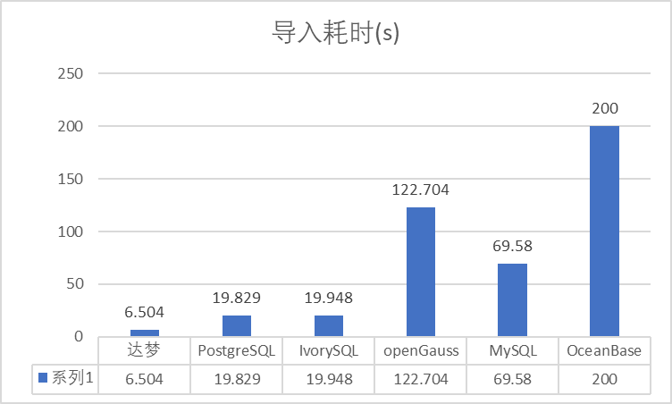

# 文件导入哪家强？


# 引子

> 最近业务上遇到一个场景，需要将一个/多个文本文件导入到与其结构对应的表中。功能需求比较简单，大部分的关系数据库基本都支持这个功能。基于上面的场景把手头上的几款开源数据库和国产数据库的文件导入功能进行了性能对比。

# 摘要

本文将针对文件导入功能，在 MySQL、PostgreSQL、达梦 8、LvorySQL、openGauss、OceanBase 六款数据库进行了对比测试。测试过程中使用相同的硬件环境和操作系统，且各数据库使用安装时的默认参数。

> **_注意：_**

> 1. **_由于 Oracle 没有提供 ARM 相关的安装介质，所以本次测试并未对比 Oracle 的 sqlldr；_**
> 2. **_所有被测数据库都未经过优化，全部使用默认参数；_**

# 测试环境

## 服务器

| CPU                 | Kunpeng-920 |
| ------------------- | ----------- |
| Architecture        | aarch64     |
| On-line CPU(s) list | 0-7         |
| CPU 主频            | 2600MHz     |

## 操作系统

```bash
NAME="openEuler"
VERSION="20.03 (LTS-SP2)"
ID="openEuler"
VERSION_ID="20.03"
PRETTY_NAME="openEuler 20.03 (LTS-SP2)"
ANSI_COLOR="0;31"
```

## 系统性能

- 以下是 unixbench 跑分，供对比参考

```bash
------------------------------------------------------------------------
Benchmark Run: Wed Dec 07 2022 15:48:16 - 15:57:14
8 CPUs in system; running 1 parallel copy of tests

Dhrystone 2 using register variables       40999324.8 lps   (10.0 s, 2 samples)
Double-Precision Whetstone                     4314.8 MWIPS (9.3 s, 2 samples)
Execl Throughput                               3762.5 lps   (29.8 s, 1 samples)
File Copy 1024 bufsize 2000 maxblocks        685100.0 KBps  (30.0 s, 1 samples)
File Copy 256 bufsize 500 maxblocks          189282.0 KBps  (30.0 s, 1 samples)
File Copy 4096 bufsize 8000 maxblocks       1992147.0 KBps  (30.0 s, 1 samples)
Pipe Throughput                             1231178.1 lps   (10.0 s, 2 samples)
Pipe-based Context Switching                 105636.0 lps   (10.0 s, 2 samples)
Process Creation                               8963.6 lps   (30.0 s, 1 samples)
Shell Scripts (1 concurrent)                   7087.6 lpm   (60.0 s, 1 samples)
Shell Scripts (8 concurrent)                   3055.4 lpm   (60.0 s, 1 samples)
System Call Overhead                         907956.1 lps   (10.0 s, 2 samples)

System Benchmarks Index Values               BASELINE       RESULT    INDEX
Dhrystone 2 using register variables         116700.0   40999324.8   3513.2
Double-Precision Whetstone                       55.0       4314.8    784.5
Execl Throughput                                 43.0       3762.5    875.0
File Copy 1024 bufsize 2000 maxblocks          3960.0     685100.0   1730.1
File Copy 256 bufsize 500 maxblocks            1655.0     189282.0   1143.7
File Copy 4096 bufsize 8000 maxblocks          5800.0    1992147.0   3434.7
Pipe Throughput                               12440.0    1231178.1    989.7
Pipe-based Context Switching                   4000.0     105636.0    264.1
Process Creation                                126.0       8963.6    711.4
Shell Scripts (1 concurrent)                     42.4       7087.6   1671.6
Shell Scripts (8 concurrent)                      6.0       3055.4   5092.4
System Call Overhead                          15000.0     907956.1    605.3
                                                                   ========
System Benchmarks Index Score                                        1258.0

------------------------------------------------------------------------
Benchmark Run: Wed Dec 07 2022 15:57:14 - 16:06:18
8 CPUs in system; running 16 parallel copies of tests

Dhrystone 2 using register variables      326630138.1 lps   (10.0 s, 2 samples)
Double-Precision Whetstone                    35757.3 MWIPS (8.7 s, 2 samples)
Execl Throughput                              23047.5 lps   (29.7 s, 1 samples)
File Copy 1024 bufsize 2000 maxblocks        525702.0 KBps  (30.0 s, 1 samples)
File Copy 256 bufsize 500 maxblocks          139688.0 KBps  (30.0 s, 1 samples)
File Copy 4096 bufsize 8000 maxblocks       1834232.0 KBps  (30.0 s, 1 samples)
Pipe Throughput                             9754452.8 lps   (10.0 s, 2 samples)
Pipe-based Context Switching                1181849.8 lps   (10.0 s, 2 samples)
Process Creation                              42295.7 lps   (30.0 s, 1 samples)
Shell Scripts (1 concurrent)                  32399.6 lpm   (60.0 s, 1 samples)
Shell Scripts (8 concurrent)                   4529.9 lpm   (60.1 s, 1 samples)
System Call Overhead                        3386402.8 lps   (10.0 s, 2 samples)

System Benchmarks Index Values               BASELINE       RESULT    INDEX
Dhrystone 2 using register variables         116700.0  326630138.1  27988.9
Double-Precision Whetstone                       55.0      35757.3   6501.3
Execl Throughput                                 43.0      23047.5   5359.9
File Copy 1024 bufsize 2000 maxblocks          3960.0     525702.0   1327.5
File Copy 256 bufsize 500 maxblocks            1655.0     139688.0    844.0
File Copy 4096 bufsize 8000 maxblocks          5800.0    1834232.0   3162.5
Pipe Throughput                               12440.0    9754452.8   7841.2
Pipe-based Context Switching                   4000.0    1181849.8   2954.6
Process Creation                                126.0      42295.7   3356.8
Shell Scripts (1 concurrent)                     42.4      32399.6   7641.4
Shell Scripts (8 concurrent)                      6.0       4529.9   7549.8
System Call Overhead                          15000.0    3386402.8   2257.6
                                                                   ========
System Benchmarks Index Score                                        4252.8

```

# 数据准备

使用 benchmarksql-5.0 中的历史表作为被测表，建表脚本如下：

```sql
create table bmsql_history (
  hist_id  integer,
  h_c_id   integer,
  h_c_d_id integer,
  h_c_w_id integer,
  h_d_id   integer,
  h_w_id   integer,
  h_date   timestamp,
  h_amount decimal(6,2),
  h_data   varchar(24)
);
```

## 测试数据生成脚本

根据字段类型写了一个生成测试数据的脚本，代码如下：

```python
# -*- coding=utf-8 -*-

import csv
import random
import time
import string

# 创建列表，保存header内容
header_list = ["hist_id", "h_c_id", "h_c_d_id", "h_c_w_id", "h_d_id", "h_w_id", "h_date", "h_amount", "h_data"]

g_count = 0

def random_list(n):
    data_list = []
    global g_count
    for i in range(n):
        g_count = g_count + 1
        l = [g_count,
        random.randint(0,1000),
        random.randint(0,1000),
        random.randint(0,1000),
        random.randint(0,1000),
        random.randint(0,1000),
        time.strftime("%Y-%m-%d %H:%M:%S", time.localtime()),
        #random.randint(0,1000),
        round(random.uniform(0, 9999.0), 2),
        ''.join(random.sample(string.ascii_letters + string.digits, 20))
        ]
        data_list.append(l)

    return data_list

# 以写方式打开文件。注意添加 newline=""，否则会在两行数据之间都插入一行空白。
with open("bmsql_history.csv", mode="w", encoding="utf-8", newline="") as f:

    # 基于打开的文件，创建 csv.writer 实例
    writer = csv.writer(f)

    # 写入 header。
    # writerow() 一次只能写入一行。
    writer.writerow(header_list)

    # 写入数据。
    # writerows() 一次写入多行。
    for i in range(10000):
        writer.writerows(random_list(1000))

```

## 测试数据

执行脚本后会生成 10000000 行测试数据，具体如下图：



# 性能测试

## PostgreSQL COPY

### 简介

`COPY` moves data between PostgreSQL tables and standard file-system files. `COPY TO` copies the contents of a table _to_ a file, while `COPY FROM` copies data _from_ a file to a table (appending the data to whatever is in the table already). `COPY TO` can also copy the results of a `SELECT` query.

If a column list is specified, `COPY TO` copies only the data in the specified columns to the file. For `COPY FROM`, each field in the file is inserted, in order, into the specified column. Table columns not specified in the `COPY FROM` column list will receive their default values.

`COPY` with a file name instructs the PostgreSQL server to directly read from or write to a file. The file must be accessible by the PostgreSQL user (the user ID the server runs as) and the name must be specified from the viewpoint of the server. When `PROGRAM` is specified, the server executes the given command and reads from the standard output of the program, or writes to the standard input of the program. The command must be specified from the viewpoint of the server, and be executable by the PostgreSQL user. When `STDIN` or `STDOUT` is specified, data is transmitted via the connection between the client and the server.

### 语法

```sql
  Copy ::= COPY table_name [ ( column_name [, ...] ) ]
        FROM { 'filename' | STDIN }
            [ [ USING ] DELIMITERS 'delimiters' ]
            [ WITHOUT ESCAPING ]
            [ LOG ERRORS ]
            [ REJECT LIMIT 'limit' ]
            [ WITH ( option [, ...] ) ]
            | copy_option
            | TRANSFORM  ( { column_name [ data_type ] [ AS transform_expr ] } [, ...] )
            | FIXED FORMATTER ( { column_name( offset, length ) } [, ...] ) [ ( option [, ...] ) | copy_option [  ...] ] ;
```

### 测试

- PostgreSQL 版本（编译安装）



```sql
postgres=# copy bmsql_history from '/home/postgres/bmsql_history.csv' delimiter ','
postgres-# ;
COPY 10000000
Time: 19829.354 ms (00:19.829)
```

耗时：约 20s

## IvorySQL COPY

### 简介

参考 PostgreSQL 简介。

### 语法

参考 PostgreSQL 简介。

### 测试

- IvorySQL 版本（通过编译安装）





```sql
postgres=# copy bmsql_history from '/home/ivory/bmsql_history.csv' delimiter ',';
COPY 10000000
Time: 21108.218 ms (00:21.108)
```


耗时：约 20s

## openGauss COPY

### 简介

参考 PostgreSQL 简介。

### 语法

参考 PostgreSQL 简介。

### 测试

> 分别用编译安装和安装包安装了 openGauss，测试结果基本一致。

#### 编译安装 openGauss

```sql
openGauss=# vacuum;
VACUUM
openGauss=# analyze;
ANALYZE
openGauss=# \timing
Timing is on.
openGauss=# copy bmsql_history from '/home/omm/bmsql_history.csv' delimiter ',';
COPY 10000000
Time: 112710.938 ms
openGauss=# select version();
                                                                          version
------------------------------------------------------------------------------------------------------------------------------------------------------------
 (openGauss 3.1.0 build 2586b083) compiled at 2022-11-28 15:46:36 commit 0 last mr  debug on aarch64-unknown-linux-gnu, compiled by g++ (GCC) 7.3.0, 64-bit
(1 row)

```

#### 安装包安装极简版

```sql
openGauss=# truncate bmsql_history;
TRUNCATE TABLE
openGauss=# \timing
Timing is on.
openGauss=# copy bmsql_history from '/home/omm/bmsql_history.csv' delimiter ',';
COPY 10000000
Time: 122703.615 ms
openGauss=# select version();
                                                                        version
-------------------------------------------------------------------------------------------------------------------------------------------------------
 (openGauss 3.1.0 build 4e931f9a) compiled at 2022-09-29 14:19:54 commit 0 last mr   on aarch64-unknown-linux-gnu, compiled by g++ (GCC) 7.3.0, 64-bit
(1 row)

Time: 0.568 ms

```

耗时：约 120s

## MySQL LOAD

### 简介

1. MySQL load data 语句能快速将一个文本文件的内容导入到对应的数据库表中（一般文本的一行对应表的一条记录）；
2. 数据库应用程序开发中，涉及大批量数据需要插入时，使用 load data 语句的效率比一般的 insert 语句的高很多；
3. 可以看成 select … into outfile 语句的反操作，select … into outfile 将数据库表中的数据导出保存到一个文件中。参考 MySQL 5.7 官方手册 ；

### 语法

```sql
LOAD DATA
    [LOW_PRIORITY | CONCURRENT] [LOCAL]
    INFILE 'file_name'
    [REPLACE | IGNORE]
    INTO TABLE tbl_name
    [PARTITION (partition_name [, partition_name] ...)]
    [CHARACTER SET charset_name]
    [{FIELDS | COLUMNS}
        [TERMINATED BY 'string']
        [[OPTIONALLY] ENCLOSED BY 'char']
        [ESCAPED BY 'char']
    ]
    [LINES
        [STARTING BY 'string']
        [TERMINATED BY 'string']
    ]
    [IGNORE number {LINES | ROWS}]
    [(col_name_or_user_var
        [, col_name_or_user_var] ...)]
    [SET col_name={expr | DEFAULT},
        [, col_name={expr | DEFAULT}] ...]
```

### 测试

```sql
-- LOAD DATA LOCAL INFILE '文件路径'  INTO TABLE tableName FIELDS TERMINATED BY ',';

LOAD DATA LOCAL INFILE '/root/bmsql_history.csv' INTO TABLE bmsql_history FIELDS TERMINATED BY ',';
```


耗时：69.58s



## DM8 dmfldr

### 简介

dmfldr（DM Fast Loader）是 DM 提供的快速数据装载命令行工具。用户通过使用 dmfldr 工具能够把按照一定格式排序的文本数据以简单、快速、高效的方式载入到 DM 数据库中，或把 DM 数据库中的数据按照一定格式写入文本文件。


### 语法/参数说明

```bash
[dmdba@host-10-208-227-136 ~]$ dmfldr help
version: 03134283938-20221019-172201-20018
格式: ./dmfldr   KEYWORD=value

例程: ./dmfldr   SYSDBA/SYSDBA CONTROL='/opt/data/fldr.ctl'

USERID 必须是命令行中的第一个参数
字符串类型参数必须以引号封闭

关键字              说明（默认值）
--------------------------------------------------------------------------------
USERID              用户名/口令， 格式:{<username>[/<password>] | /}[@<connect_identifier>][<option>] [<os_auth>]
                    <connect_identifier> : [<svc_name> | host[:port] | <unixsocket_file>]
                    <option> : #{<exetend_option>=<value>[,<extend_option>=<value>]...}
                               --此行外层{}是为了封装参数之用，书写时需要保留
                    <os_auth> : AS {SYSDBA|SYSSSO|SYSAUDITOR|USERS|AUTO}
CONTROL             控制文件，字符串类型
LOG                 日志文件，字符串类型 (fldr.log)
BADFILE             错误数据记录文件，字符串类型 (fldr.bad)
SKIP                初始忽略逻辑行数 (0)
LOAD                需要装载的行数 (ALL)
ROWS                提交频次 (50000), DIRECT为FALSE有效
DIRECT              是否使用快速方式装载 (TRUE)
SET_IDENTITY        是否插入自增列 (FALSE)
SORTED              数据是否已按照聚集索引排序 (FALSE)
INDEX_OPTION        索引选项 (1)
                    1 不刷新二级索引，数据按照索引先排序，装载完后再
                    将排序的数据插入索引
                    2 不刷新二级索引，数据装载完成后重建所有二级索引
                    3 刷新二级索引, 数据装载的同时将数据插入二级索引
ERRORS              允许的最大数据错误数 (100)
CHARACTER_CODE      字符编码，字符串类型 (GBK, UTF-8, SINGLE_BYTE, EUC-KR)
MODE                装载方式，字符串类型 IN表示载入，OUT表示载出，
                    OUTORA表示载出ORACLE (IN)
CLIENT_LOB          大字段目录是否在本地 (FALSE)
LOB_DIRECTORY       大字段数据文件存放目录
LOB_FILE_NAME       大字段数据文件名称，仅导出有效 (dmfldr.lob)
BUFFER_NODE_SIZE    读入文件缓冲区的大小 (10),有效值范围1~2048
LOG_SIZE            日志信息缓冲区的大小 (1),有效值范围1~100
READ_ROWS           工作线程一次最大处理的行数 (100000)，最大支持2^26-10000
NULL_MODE           载入时NULL字符串是否处理为NULL
                    载出时空值是否处理为NULL字符串 (FALSE)
NULL_STR            载入时视为NULL值处理的字符串
SEND_NODE_NUMBER    运行时发送节点的个数 (20)，有效值范围16~65535
TASK_THREAD_NUMBER  处理用户数据的线程数目，默认与处理器核数量相同，有效值范围1~128
BLDR_NUM            服务器BLDR数目 (64),有效值范围1~1024
BDTA_SIZE           bdta的大小 (5000)，有效值范围100~10000
COMPRESS_FLAG       是否压缩bdta (FALSE)
MPP_CLIENT          MPP环境，是否本地分发 (TRUE)
SINGLE_FILE         MPP/DPC环境，是否只生成单个数据文件(FALSE)
LAN_MODE            MPP/DPC环境，是否以内网模式装载数据(FALSE)
UNREP_CHAR_MODE     非法字符处理选项(0),为0时表示跳过该数据行，为1时表示使用(*)替换错误字节
SILENT              是否静默方式装载数据(FALSE)
BLOB_TYPE           BLOB类型字段数据值的实际类型，字符串类型 (HEX_CHAR)
                    HEX表示值为十六进制，HEX_CHAR表示值为十六进制字符类型
                    仅在direct=FALSE有效
OCI_DIRECTORY       OCI动态库所在的目录
DATA                指定数据文件路径
ENABLE_CLASS_TYPE   允许用户导入CLASS类型数据 (FALSE)
FLUSH_FLAG          提交时是否立即刷盘 (FALSE)
IGNORE_BATCH_ERRORS 是否忽略错误数据继续导入 (FALSE)
SINGLE_HLDR_HP      是否使用单个HLDR装载HUGE水平分区表 (TRUE)
EP                  指定需要发送数据的站点序号列表，仅向MPP/DPC环境导入数据时有效
PARALLEL            是否开启并行装载(FALSE)
SQL                 使用自定义查询语句，仅导出模式有效
SQLFILE             自定义查询语句所在文件，仅导出模式有效
TABLE               导入/出表
ROW_SEPERATOR       行分隔符
FIELD_SEPERATOR     列分隔符
COMMIT_OPTION       提交选项(0), 0:每发送一批数据后提交, 1:发送完所有数据后提交
APPEND_OPTION       追加选项(0), 0: 追加方式, 1: 替代方式, 2: 插入方式
COLNAME_HEADING     是否在导出文件头中打印列名(FALSE)
IGNORE_AIMLESS_DATA 是否忽略无目标数据(FALSE)
LOB_AS_VARCHAR      是否将CLOB作为VARCHAR进行导入导出(FALSE)
LOB_AS_VARCHAR_SIZE 将CLOB作为VARCHAR进行导入导出时, lob数据最大大小(10)MB
LOG_LEVEL           记录错误数据信息级别(3), 0: 不记录 1: 只记录到log文件 2: 只记录到bad文件 3: 记录到log和bad文件
FLDR_INI            配置文件路径，字符串类型
RECONN              自动重连次数(0)
RECONN_TIME         自动重连等待时间(5), 单位(s), 有效值范围(1~10000)
WIDTH               设置列数据宽度
SEDF                被替换的字符列表
SEDT                用于替换的字符列表
ESCAPE              转义符
HELP                打印帮助信息

```

### 测试

- 控制文件 test.ctrl

```vim
LOAD DATA
INFILE '/home/dmdba/bmsql_history.csv'
INTO TABLE bmsql_history
FIELDS ','
```

- 执行测试

```sql
[dmdba@host-10-208-227-136 ~]$ dmfldr userid=SYSDBA/SYSDBA@localhost:5236 control=\'/home/dmdba/test.ctrl\'
dmfldr V8
控制文件：

加载行数:全部

每次提交服务器行数:50000

跳过行数:0

允许错误数:100

是否直接加载:Yes

是否插入自增列:No

数据是否已按照聚集索引排序:No

字符集:UTF-8


数据文件共1个:
/home/dmdba/bmsql_history.csv

错误文件:fldr.bad

目标表:BMSQL_HISTORY

列名        包装数据类型     终止
HIST_ID     CHARACTER            ,
H_C_ID      CHARACTER            ,
H_C_D_ID    CHARACTER            ,
H_C_W_ID    CHARACTER            ,
H_D_ID      CHARACTER            ,
H_W_ID      CHARACTER            ,
H_DATE      CHARACTER            ,
H_AMOUNT    CHARACTER            ,
H_DATA      CHARACTER            ,

行缓冲区数量: 8
任务线程数量: 8

100000行记录已提交
200000行记录已提交
……
……
10000000行记录已提交

目标表:BMSQL_HISTORY
load success.
10000000 行加载成功。
0 行由于数据格式错误被丢弃。
0 行由于数据错误没有加载。

跳过的逻辑记录总数:0
读取的逻辑记录总数:10000000
拒绝的逻辑记录总数:0

6503.826(ms)已使用

```

耗时：6.504s



## OceanBase LOAD

OceanBase 使用的是 4.0 版本，单机部署。

### 简介

该语句用于从外部导入数据。

目前，OceanBase 数据库不支持 `LOCAL INFILE` 的语法加载数据文件。这是由于 OceanBase 是分布式数据库，读写数据由 Leader 节点进行，而 CSV 文件需要上传到 Leader 节点所在服务器才能加载，因此需要提供 NAS 文件系统进行文件存放。OceanBase 数据库中的 `LOAD DATA` 语句仅支持加载 OBServer 本地的输入文件。因此，用户需要在导入之前将文件拷贝到某台 OBServer 上。

`LOAD DATA` 目前可以对 CSV 格式的文本文件进行导入，整个导入的过程可以分为以下的流程：

1. 解析文件：OceanBase 数据库会根据用户输入的文件名，读取文件中的数据，并且根据指定的并行度来决定并行或者串行解析输入文件中的数据。
2. 分发数据：由于 OceanBase 是分布式数据库，各个分区的数据可能分布在各个不同的 OBServer，`LOAD DATA` 会对解析出来的数据进行计算，决定数据需要被发送到哪个 OBServer。
3. 插入数据：当目标 OBServer 收到数据后，在本地执行 `INSERT` 操作将数据插入到对应的分区当中。

要从外部文件导入数据，您需要具有 `FILE` 权限。

> **注意**

> 使用 `REPLACE` 或者 `IGNORE` 子句的情况下，如果并行度大于 `1`，发生冲突的行最后插入的记录可能与串行执行的结果不同。如果需要严格保证冲突记录的插入结果，请不要指定该语句的并行度（或将并行度设置为 `1`）。

### 语法

```
LOAD DATA
     [/*+ parallel(N) load_batch_size(M)*/]
    INFILE 'file_name'
    [REPLACE | IGNORE]
    INTO TABLE table_name
    [{FIELDS | COLUMNS}
        [TERMINATED BY 'string']
        [[OPTIONALLY] ENCLOSED BY 'char']
        [ESCAPED BY 'char']
    ]
    [LINES
        [STARTING BY 'string']
        [TERMINATED BY 'string']
    ]
    [IGNORE number {LINES | ROWS}]
    [(column_name_var
        [, column_name_var] ...)]

```

### 测试

```sql
obclient> SET GLOBAL secure_file_priv = ""
Query OK, 0 rows affected (0.03 sec)
obclinet> \q
Bye
```

> 注意：需要设置全局安全路径。如果不设置会报如下错误。

```sql
ERROR 1227 (42501): Access denied
```

为了避免执行超时需要设置超时时间；


在 1000s 的超时时间内，未完成测试，写入数据：1318700 行。



# 性能对比

## 分类

以上六种数据库从原理上可以分为三类：

| MySQL 体系      | MySQL      | 10.3.9-MariaDB              |
| :-------------- | ---------- | --------------------------- |
|                 | OceanBase  | 4.0.0                       |
| PostgreSQL 体系 | PostgreSQL | 16devel                     |
|                 | IvorySQL   | 16devel （IvorySQL 3devel） |
|                 | openGauss  | 3.1.0                       |
| 商用            | 达梦       | 20221019                    |
|                 | Oracle     |                             |

## 对比分析



> 注意：

> 由于 OceanBase 未能在规定可容忍的时间内完成测试

### 结论分析

| 达梦       | 从结果看达梦性能表现最佳，dmfldr 使用多线程并行导入，大大提升了数据导入的并行度。dmfldr 与 Oracle 的 sqlldr 类似，功能很全面。                                                                                                                                                                                                                                                                          |
| ---------- | ------------------------------------------------------------------------------------------------------------------------------------------------------------------------------------------------------------------------------------------------------------------------------------------------------------------------------------------------------------------------------------------------------- |
| PostgreSQL | 使用单线导入数据，CPU 和 IO 资源消耗相对合理，与 dmfldr 单线程导入性的相当。                                                                                                                                                                                                                                                                                                                            |
| IvorySQL   | 基本和 PostgreSQL 性能一致。                                                                                                                                                                                                                                                                                                                                                                            |
| openGauss  | 虽然 openGauss 对 PostgreSQL 的代码做了调整，但我理解大部分都是形式上的调整（C 到 C++），所以原以为应该也与 PostgreSQL 性能相当，但实际效果比较差。因为本次测试都是以默认参数进行测试，所以对于 openGauss 不太公平，主要原因是 PostgreSQL 默认 shared_buffers 是 128M，而 openGauss 默认 shared_buffers 是 64M，这个是主要影响 openGauss 性能的原因。后续会出一篇文章调优 openGauss 的 copy from 性能。 |
| MySQL      | 使用的是开源 Mariadb，可能性能上和 MySQL 会有写差异。值得注意的是在命令行返回“导入成果”结果后，MySQL 进程的 CPU 和 IO 仍然会持续较长时间（约 1 分钟）没有回落。                                                                                                                                                                                                                                         |
| OceanBase  | 使用 4.0.0 版本进行测试，单机安装。在 1000s 超时时间内未返回结果。写入数据 1318700 行。                                                                                                                                                                                                                                                                                                                 |

# 总结

以上针对某一特定功能（文件导入），对比了几种开源和国产数据库的性能。并不能说明数据库本身的性能和优劣。主要目的视为业务上有文件导入需求的场景提供一些数据上的参考。
