# 前言

本文主要内容

- python 开发语言在 linux 和 windows 下的安装配置。
- 使用 psycopg2 包在 linux 下 python 连接 openGauss。
- Psycopg 是一种用于执行 SQL 语句的 PythonAPI，可以为 PostgreSQL、openGauss 数据库提供统一访问接口，应用程序可基于它进行数据操作。Psycopg2 是对 libpq 的封装，主要使用 C 语言实现，既高效又安全。它具有客户端游标和服务器端游标、异步通信和通知、支持“COPY TO/COPY FROM”功能。支持多种类型 Python 开箱即用，适配 PostgreSQL 数据类型；通过灵活的对象适配系统，可以扩展和定制适配。Psycopg2 兼容 Unicode 和 Python 3。

- openGauss 数据库提供了对 Psycopg2 特性的支持，并且支持 Psycopg2 通过 SSL 模式链接。
- 开发工具 PyCharm 和 Visual Studio Code 使用 psycopg2 包连接 openGauss。

# 一、python 环境

版本使用 python3.6

## 1.1 linux 下的 python 环境

centos7.6 环境下使用 yum 安装 python3

### 1.1.1 系统如果可以上网。使用华为的源进行配置

```
wget -O /etc/yum.repos.d/CentOS-Base.repo https://repo.huaweicloud.com/repository/conf/CentOS-7-reg.repo
```

### 1.1.2 如果不能上网，使用安装系统时的 CentOS-7-x86_64-DVD-1810.iso 进行配置 yum

```
cd /etc/yum.repos.d/
mkdir bak
mv *.repo bak
mount /dev/cdrom /media/
vi centos.repo
	[c7-media]
	name=CentOS-$releasever – Media
	baseurl=file:///media/
        file:///media/cdrom/
        file:///media/cdrecorder/
	gpgcheck=0
	enabled=1
```

### 1.1.3 配置好后，进行安装

```
yum -y install python3
```

这样 python3 就安装成功

```
[root@master01 ~]# python3
Python 3.6.8 (default, Nov 16 2020, 16:55:22)
[GCC 4.8.5 20150623 (Red Hat 4.8.5-44)] on linux
Type "help", "copyright", "credits" or "license" for more information.
>>>
```

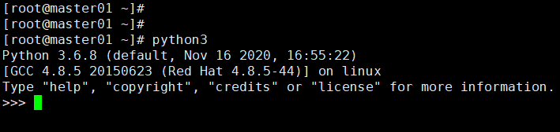

## 1.2 window 下的 python 环境

### 1.2.1 下载软件

下载 Anaconda3-5.2.0-Windows-x86_64 对应的 python3.6.5

[Anaconda3-5.2.0-Windows-x86_6 下载地址](https://mirrors.bfsu.edu.cn/anaconda/archive/Anaconda3-5.2.0-Windows-x86_64.exe)

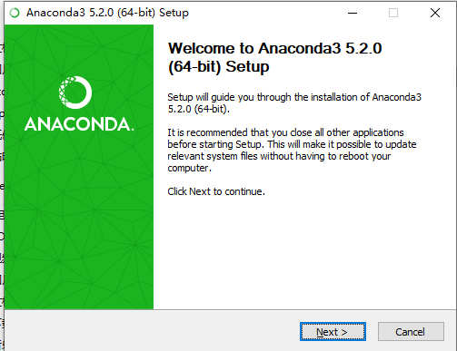

### 1.2.2 开始安装配置

点击一步一步安装完成即可。
安装完成
win+r 或开始点右键 出来运行，输入 cmd 回车

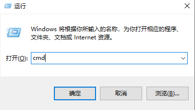

出来这个界面

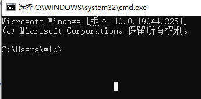

### 1.2.3 使用 pip 安装 psycopg2 包

然后开始安装 psycopg2,使用清华的源

```
pip install psycopg2 -i https://pypi.tuna.tsinghua.edu.cn/simple
```

安装完成

# 二、openGauss 的配置

> 安装请看上一篇文章
> [《手把手教你安装 openGauss 3.1.0》](https://www.modb.pro/db/545504)

| 环境       | 版本                   |
| ---------- | ---------------------- |
| 数据库版本 | openGauss 3.1.0        |
| 操作系统   | centos 7.6             |
| 虚拟环境   | VMware® Workstation 16 |

# 三、linux 使用 python3 进行连接 openGauss 数据库

## 3.1 配置 Python-psycopg2_3.1.0

### 3.1.1 下载

下载地址：https://www.opengauss.org/zh/download/
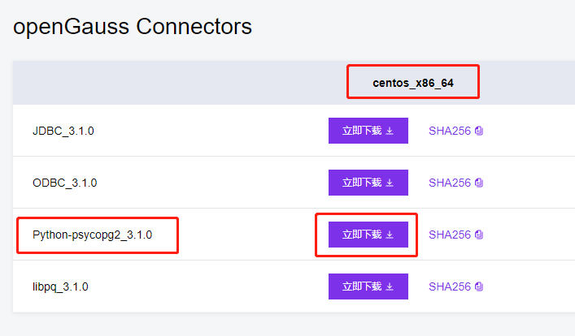
上传到服务器

### 3.1.2 解压并配置

- 解压

```
tar -xzvf openGauss-3.1.0-CentOS-x86_64-Python.tar.gz
```

解压后的文件如下
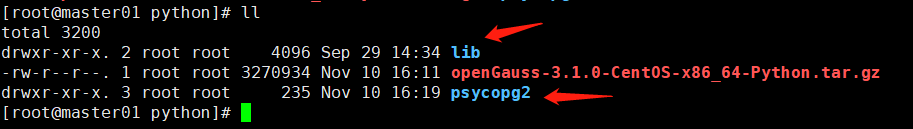

- 配置
  把 psycopg2 报拷贝到/usr/lib/python3.6/site-packages 目录下

```
cp -r psycopg2 /usr/lib/python3.6/site-packages
```

确保 psycopg2 目录权限至少为 755，以免调用时提示文件由于权限问题无法访问
对于非数据库用户，需要将解压后的 lib 目录，配置在 LD_LIBRARY_PATH 环境变量中。
增加如下内容

```
vi ~/.bashrc

export LD_LIBRARY_PATH=/root/python/lib:$LD_LIBRARY_PATH
```

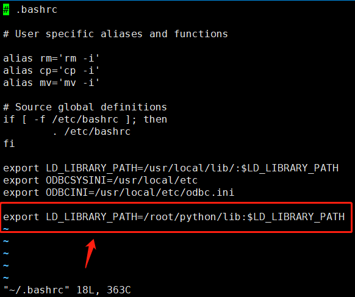

- 配置完成。

## 3.2 使用 python 连接 openGauss 数据库

```
[root@master01 python]# python3
Python 3.6.8 (default, Nov 16 2020, 16:55:22)
[GCC 4.8.5 20150623 (Red Hat 4.8.5-44)] on linux
Type "help", "copyright", "credits" or "license" for more information.
>>> import psycopg2
>>> conn = psycopg2.connect(database="postgres", user="gsname", password="gsname@123", host="192.168.204.16", port="15400")
>>> cur = conn.cursor()
>>> cur.execute("select * from  COMPANY3 ");
>>> rows = cur.fetchall()
>>> for row in rows:
...    print("ID = ", row[0])
...    print("NAME = ", row[1])
...    print("ADDRESS = ", row[2])
...    print("SALARY = ", row[3])
...
输出内容
ID =  1
NAME =  Paul
ADDRESS =  32
SALARY =  California
ID =  2
NAME =  Allen
ADDRESS =  25
SALARY =  Texas
ID =  3
NAME =  Teddy
ADDRESS =  23
SALARY =  Norway
ID =  4
NAME =  Mark
ADDRESS =  25
SALARY =  Rich-Mond
>>>

```

- 说明 python 连接 openGauss 成功，能够读取出数据。

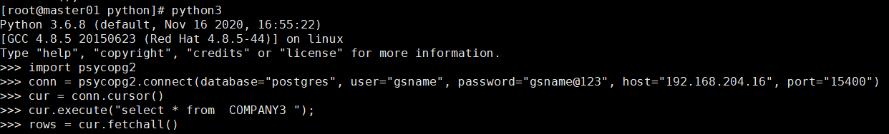

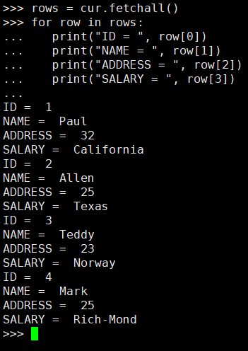

# 四、PyCharm 开发工具的使用

## 4.1 下载安装

https://www.jetbrains.com/pycharm/download/#section=windows

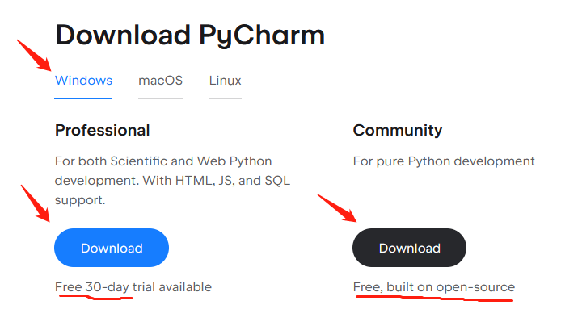

- 有 2 个版本
  一个 Professional 版本，免费使用 30 天，然后收费，功能多。
  一个 Community 版本，免费的。相对来说功能少。
  > 说明：
  > 我选择了 Community 版本。所以 Tools->Deployment->Browse Remote Host 这个功能不能用。

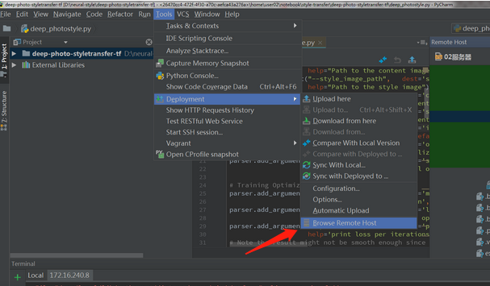

然后安装。
点击一步一步安装即可。
安装完成

## 4.2 开始连接 openGauss

### 4.2.1 配置

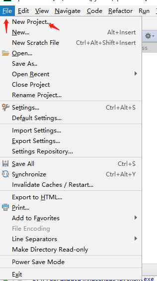

- 新建 projects

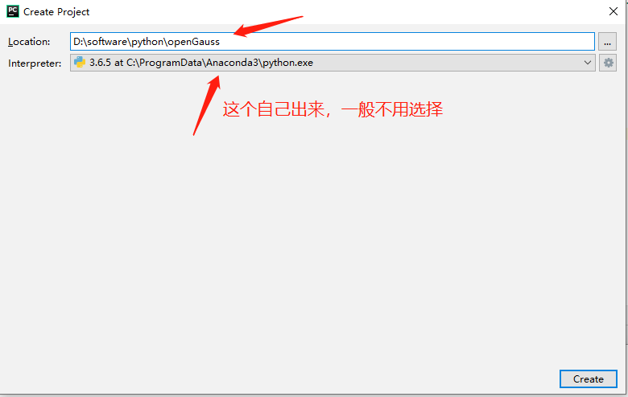

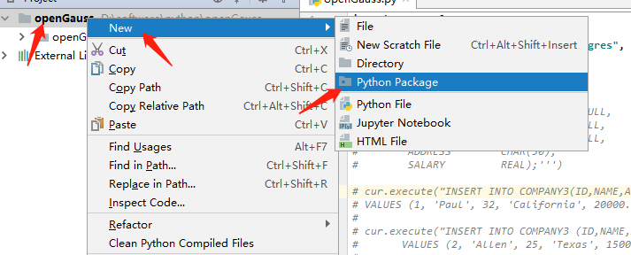

- 创建包


- 创建 python 文件

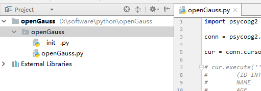

创建完成后是这样的。

### 4.2.2 开始写代码

```
import psycopg2

conn = psycopg2.connect(database="postgres", user="pyuser", password="pyuser@123", host="192.168.204.16", port="15400")

cur = conn.cursor()


cur.execute("select * from  COMPANY3 ");
rows = cur.fetchall()
for row in rows:
   print("ID = ", row[0])
   print("NAME = ", row[1])
   print("ADDRESS = ", row[2])
   print("SALARY = ", row[3])
conn.commit()
conn.close()
```

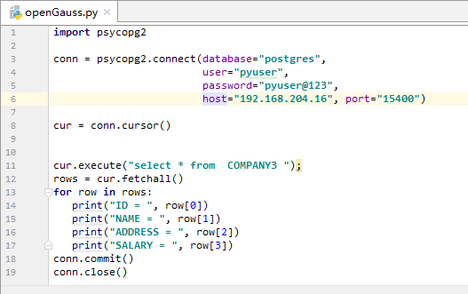

- 执行

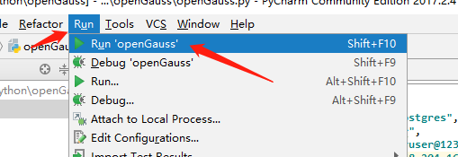

- 结果

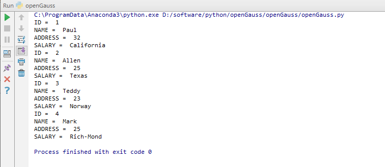

- 完成。

# 五、Visual Studio Code 开发工具的使用

## 5.1 下载

下载地址：https://code.visualstudio.com/Download
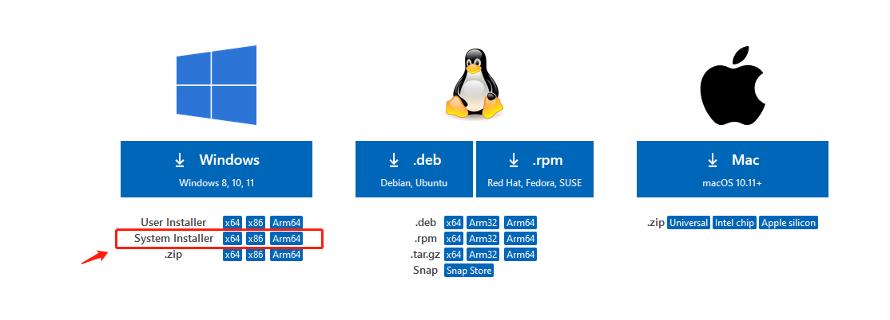
选择自己合适的操作系统
这个软件是免费的。一些功能需要下载对应的插件

```
VSCodeSetup-x64-1.73.0.exe
```

## 5.2 安装

点击软件一步一步安装即可。
安装完后，打开是这样的。

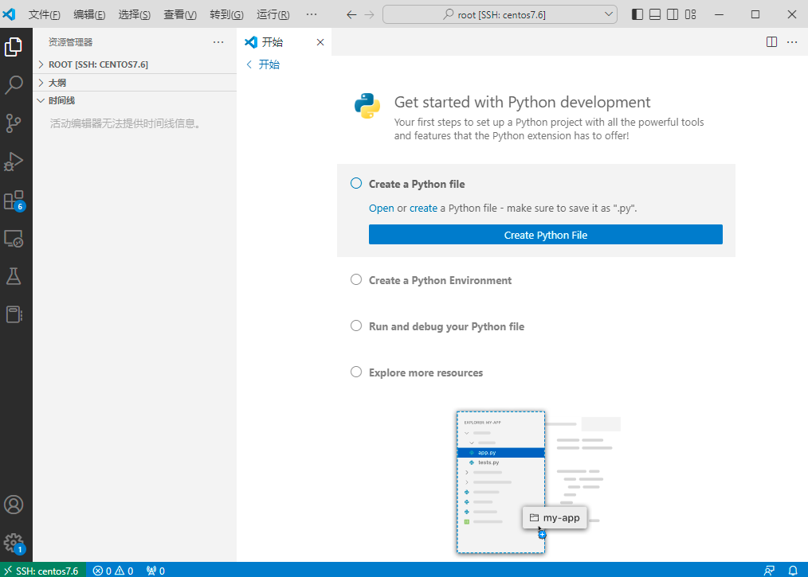

## 5.3 远程连接到 Linux 的 python 开发环境。

### 5.3.1 下载远程插件和 python 插件

- 下载 Remote Development 插件

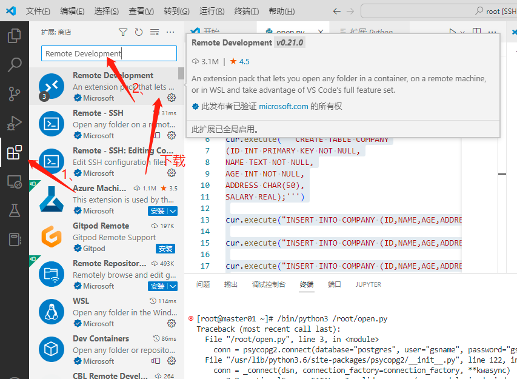

下载安装成功后，出现这个图标

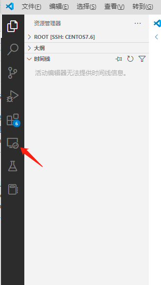

- 下载 python 插件

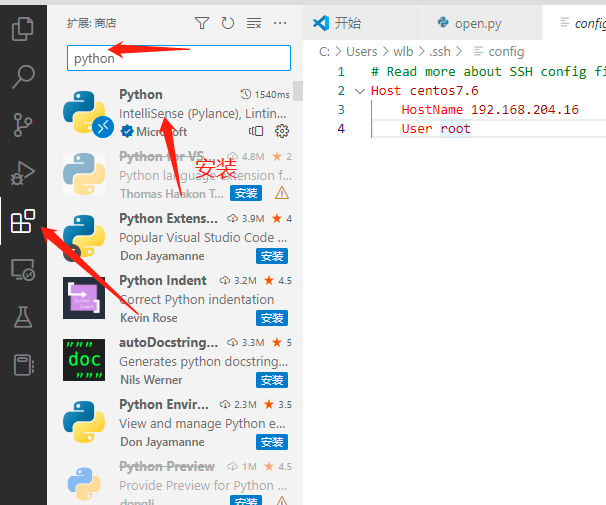

### 5.3.2 配置远程服务器

在 SSH TARGETS 配置远程服务器，具体步骤如下：

- 点击远程资源管理器
- 点击齿轮图标
- 打开弹出的 config 文件，分别配置 Host、Hostname、User

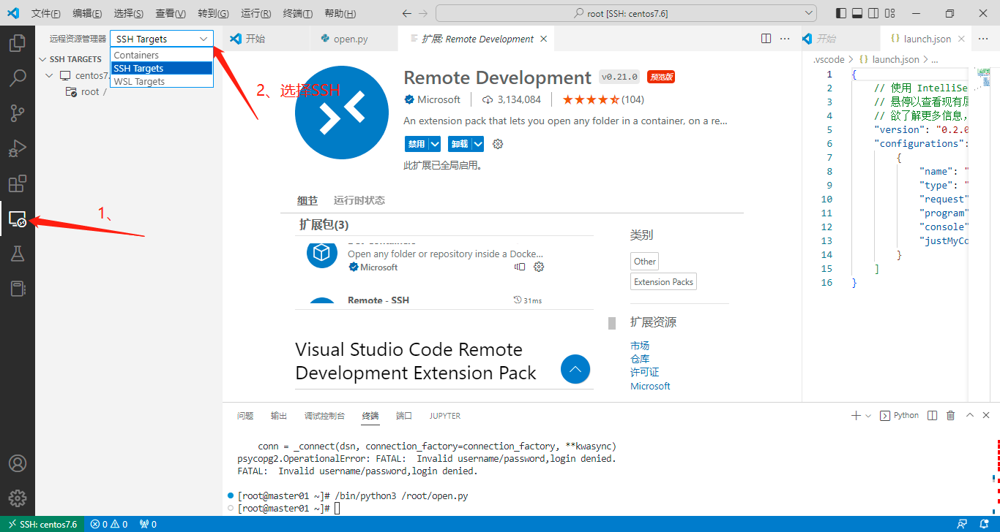

- 选择 SSH Targets

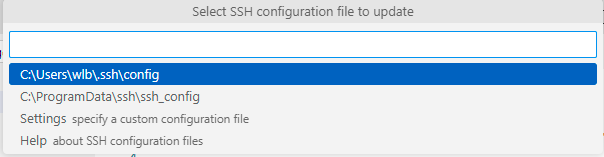

- 可以配置多个远程

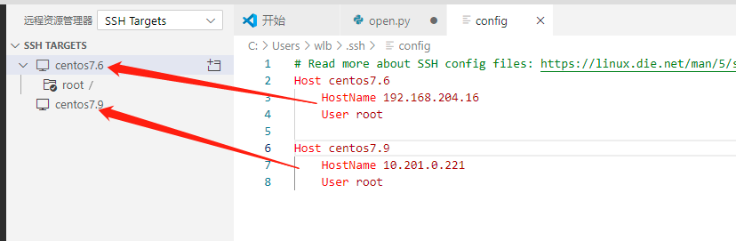

- 配置文件
  host 随便写，把 hostname 后面写上 ip 地址，user 写操作系统的用户名

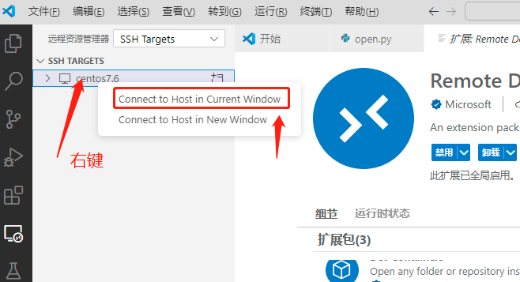

- 设置
  打开 VS Code 设置，搜索 Show Login Terminal，勾选下方"Always reveal the SSH login terminal"，记得一定要操作这一步，不然会一直提示报错。

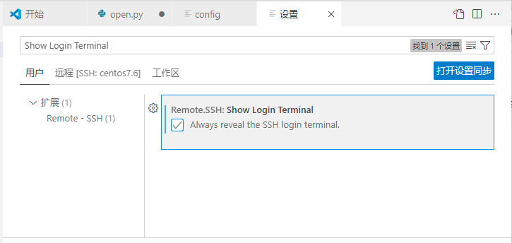

- 打开远程窗口

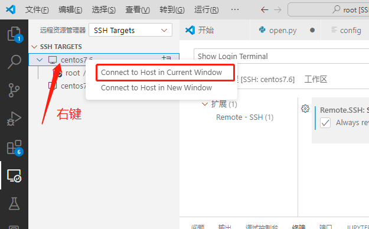

过程中需要输入 root 的密码。

- 左下角可以看到远程连接

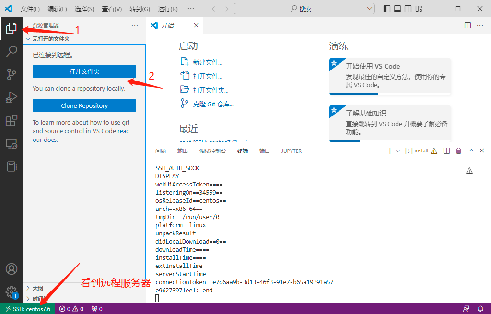

- 打开远程文件夹

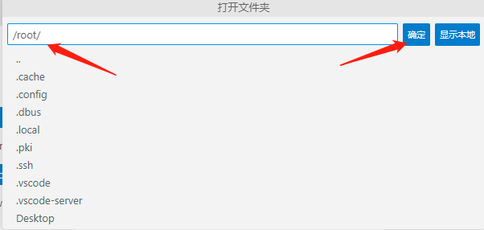

- 要求输入密码

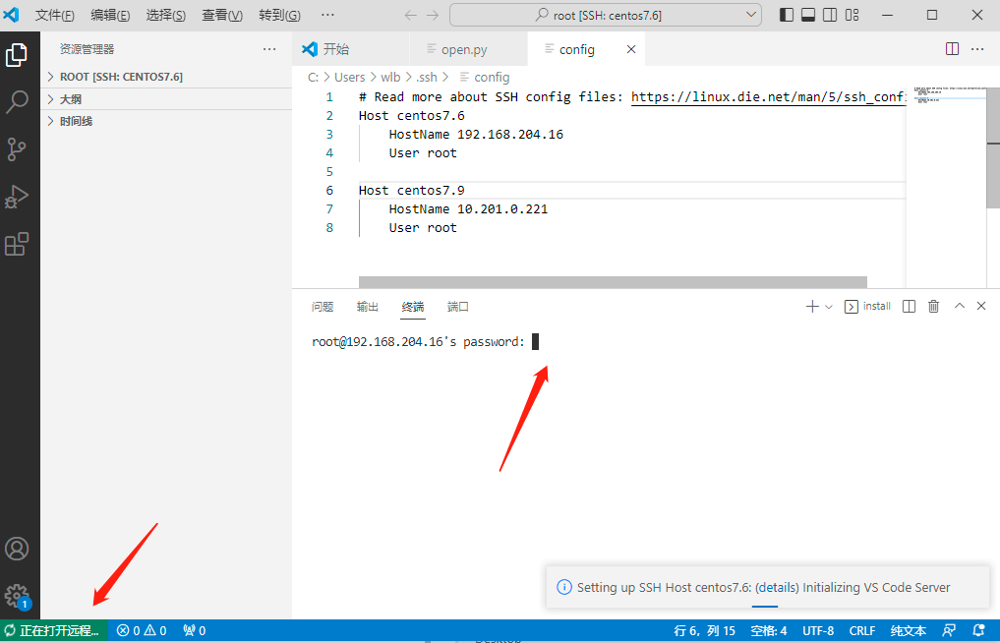

输入密码后，远程成功

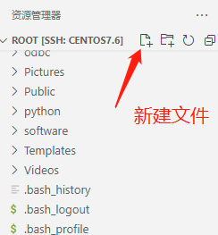

### 5.3.3 开始使用远程环境进行开发

- 新建 python 开发文件 open11.py

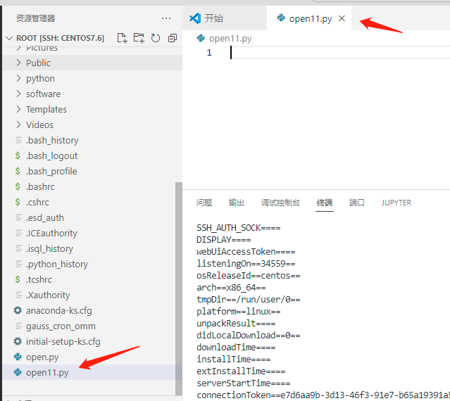

- 这样就可以开始开发了。

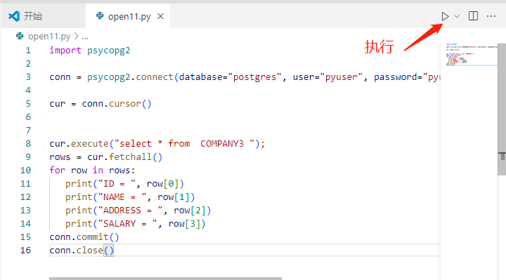

- 点击执行

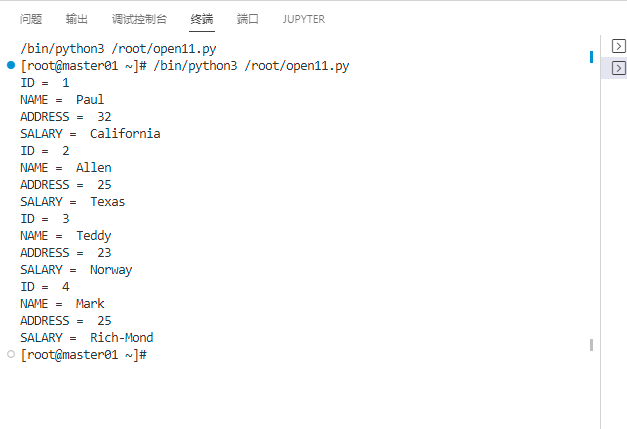

结果输出正确。

- 配置完成。

# 总结

- 如果使用 pip 安装 psycopg2，密码加密方式只能使用 MD5 方式。不然 PyCharm 连接不上 openGauss。
- Visual Studio Cod 免费使用，需要自己安装对应的插件，在做远程连接 centos 时，可以做成免密登录，网友自行百度操作。
- PyCharm 想用远程连接 centos，需要收费版本。
- 使用 pip 安装 psycopg2 的包也是可以连接到 openGauss 的。
