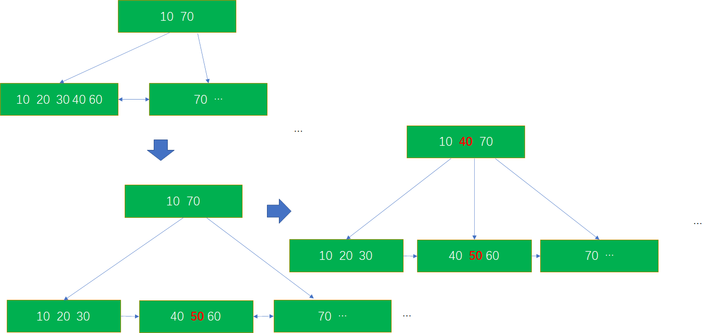
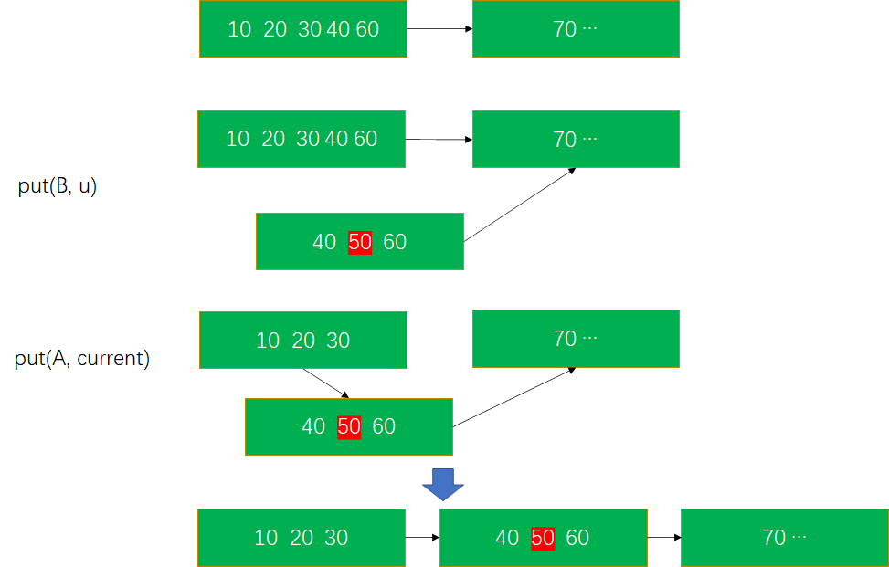
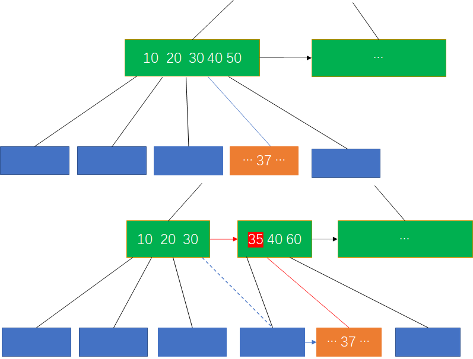

# openGauss B-tree 索引读写并发原理<a name="ZH-CN_TOPIC_0000001133172718"></a>

本文主要依据 LEHMAN & YAO 的 Efficient Locking for Concurrent Operations on B-tree，以及 openGauss 的代码，探索 openGauss 的 B-tree 索引的读写并发原理。

openGauss 索引详解讲 B-tree 索引结构时讲到，B-tree 索引的每个节点都有指针指向其右侧的节点（link pointer），link pointer 提供了额外的方法访问右侧的节点。当一个节点分裂成左右两个节点，分裂后左侧的节点与原来的节点在磁盘上占据相同的物理页，左侧节点通过 link pointer 和右侧节点相连。因此，左右两个节点逻辑上可以视为一个节点，直到父节点更新子节点的信息。

**图 1** B-tree 节点分裂<a name="fig155371551133115"></a>  


在节点发生分裂的同时，link pointer 同时建立。在 B-tree 索引的查找流程执行时，如果发现当前查找的 Key 超过了当前查找的 page 的 HK，表明在搜索过程中索引结构发生了变化，此时应该通过 link pointer 访问右侧节点。这样的实现，有时效率并不高，因为可能需要额外的磁盘操作，但正确性上没有问题，而且实际使用过程中通常分裂不会那么频繁。

## 搜索算法<a name="section1146713136327"></a>

在 B-tree 索引中查找 v，如果 v 在 B-tree 中存在，搜索流程在找到包含 v 的节点 A,以及包含指向 v 的指针的 t 时结束。否则，我们在一个数据范围包含 v 在内的页面 A 中进行查找，最终确认 v 不存在。

整个查找流程的伪代码如下：

```
x <- scannode(v, A) 表示在内存页A中查找v，返回一个数据指针给x。

procedure search(v)
current <- root; // 获取根节点，current 表示当前查找的page
A <- get(current); // 把对应的page加载到内存
while current is not a leaf do // 向下查找到叶子节点
begin
    current <- scannode(v, A);  // 找到对应的子节点
    A <- current;
end;

while t <- scannode(v, A) = link ptr of A do // 如果有必要，继续向右查找
begin
    current <- t;
    A <- get(current)
end;

if v is in A
then
    done "success"
else
    done "failure"
```

整个查找流程执行过程像单线程执行一样，和传统的一些搜索算法不同的是，整个过程中几乎没有加锁。

## 插入算法<a name="section69261235163218"></a>

和搜索算法类似，首先需要找到插入的位置。从树的根节点开始向下查找，找到数据要插入的叶子节点。在搜索位置的过程中，记录每一层搜索到的位置最靠右的节点，形成一条 B-tree 上的搜索路径。

在找到的叶子节点插入 v，可能导致节点的分裂（这种情况下，插入是 unsafe 的），在这种情况下，对应的叶子节点 a 分裂为 a’ 和 b’，其中 a’ 与 a 是相同的物理页。由于叶子节点发生改变，需要相应地更新其父节点，通过回溯之前查找路径的方式来进行更新。进而，其父节点也可能发生分裂，因此需要逐级向上回溯更新，直到某个节点的插入不会发生分裂（插入是 safe 的）。在需要修改某个节点时，先要对其加锁。

整个流程中，通过优化锁顺序避免死锁发生。另外需要注意一点，在回溯过程中，由于节点的分裂，我们回溯到的节点，可能不是最终执行插入的节点。在这种情况下，需要通过 link pointer 找到正确的插入位置。

以下是插入算法的伪代码，其中一些流程被当作原语描述，因为它们实现比较简单，而且这些操作不是本文描述的重点。例如：

A <- node.insert\(A, w, v\)表示将指针 w，以及值 v 插入节点 A。

u <- allocate\(1 new page for B\) 表示在磁盘上申请一个新页。B 表示的页面将会通过指针 u 写入这个页。

“A,B <- rearrange old A, adding …” 表示将 A 分裂为两个新的节点 A 和 B。

以下算法描述在 B-tree 中插入值 v 的过程。

```
procedure   insert(v)
initialize stack; // 初始化栈，记录查找路径，用于回溯
current <- root;  // 从根节点开始查找
A <- get(current); // 加载页面到内存
while  current is not a leaf do
begin
    t <- current;
    current <- scannode(v, A);
    if new current was not link pointer in A then
        push(t); // 记录查找路径
    A <- get(current);
end;

lock(current); // 找到一个要插入的叶子节点，对节点加锁
A <- get(current);
move.right;    // 如果在加锁之前，叶子节点发生了分裂，则需要通过link pointer找到正确的插入位置；否则，什么也不做
if v is in A then stop "v is already exists in tree"; // 如果已经插入
w <- pointer to pages allocated for record associated with v;
Doinsertion:
if A is safe then  // 当前页面是写入safe的
begin
    A <- node.insert(A, w, v); // 插入值 v ，指针 w 到 A
    put(A, current);           // 写page
    unlock(current);           // 解锁
end
else               // 页面是写入unsafe，需要分裂
begin
    u <- allocate（1 new page for B） // 申请新页面
    A,B <- rearrange old A, adding v and w, to make 2 nodes,
      where (link ptr of A, link ptrof B) <- (u, link ptr of old A)
    // 分裂 原来的 A 为 A, B 插入数据 v 和 指针 w，新 A 的 link ptr指向 B，B的link ptr 指向原来 A 的link ptr
    y <- max value stored in new A
    put(B, u) // 写分裂后右侧页
    put(A, current) // 写分裂后左侧页
    oldnode <- current;
    v <- y;
    w <- u;
    current <- pop(stack);  // 开始回溯
    lock(current); // 对父节点加锁
    A <- get(current);
    move.right; // 如果父节点发生分裂，通过link ptr向右查找
    unlock(oldnode); // 子节点解锁
    goto Doinsertion // 如果有必要，继续向上更新父节点
end

move.right的伪代码
procedure move.right
while t <- scannode(v, A) is a link pointer of A do
begin
    lock(t); // 对右侧节点加锁
    unlock(current); // 解锁左侧节点
    current <- t;
A <- get(current);
end
```

整个流程中，最多同时有 3 个节点同时被锁住，分别是\[1\]发生分裂的子节点（分裂后的左侧节点），\[2\]父节点（发生分裂后的左侧节点），\[3\]父节点分裂后的右侧节点。

## 正确性证明<a name="section12905195713519"></a>

LEHMAN & YAO 在 Efficient Locking for Concurrent Operations on B-tree 中给出了算法正确性的证明。

正确性证明主要证明了两个大的问题：

- 整个流程不会出现死锁
- 最终流程结束的时候，结果是正确的。细化一点就是要证明
  - 最终树的结构是正确的
  - 除了正在修改树结构的这个进程外，其他进程看到的是一棵一致的 B-tree

## 不会出现死锁的证明<a name="section85819387361"></a>

首先定义 B-tree 中节点间的一个顺序关系 \(<\) ：

- 任意时间，如果两个节点 a 和 b，如果 a 到 根节点的距离 大于 b 到根节点的距离，则 a < b。
- a 和 b 到根节点的距离相同，如果跟随 a 的 link ptr 能够到达 b，则 a < b， 即 a 在 b 的左侧。

根据插入算法可知，在时间点 t0，如果 a < b，则在任意时间点 t \> t0，a < b。因为插入流程只是简单地将一个节点 x 分裂成 x’ 和 x’’，而且

- 任意 y < x ，则 y < x'
- 任意 y，如果 x < y， 则 x'' < y

根据插入流程的加锁顺序可知，当对一个节点加锁时，不会再对 其下 或 其左 的节点加锁，因此加锁遵循了一个好的加锁顺序。由于插入是唯一会对节点加锁的流程，因此我们可以得到结论，不会出现死锁。

这里可以回顾一下死锁的几个要素：

- 互斥。资源同时只能被一个进程持有。
- 请求与保持。请求其他资源时，不释放当前持有的资源。
- 不剥夺。不能再对方未释放资源时，抢占其占有的资源。
- 循环等待。多个进程形成一种相互等待对方释放资源的关系。
- 由于插入过程，上下两层都是先对子加锁，再对父加锁；同一层，是先加左侧，再加右侧，因此在加锁顺序上避免了循环等待的情况，可以避免死锁。

## B-tree 结构正确性证明<a name="section2209726388"></a>

为确保树结构正确，需要关注会修改树结构的操作。只有写操作会修改树结构，在插入算法的伪代码中有 3 个地方会执行 put 操作。

- put\(A, current\) 用于向一个写 safe 的节点写入数据。
- put\(B, u\) 用于向一个写 unsafe 的节点写入数据。在这个操作中，向分裂后的右侧节点写入数据。
- put\(A, current\) 用于向一个写 unsafe 的节点写入数据。在这个操作中，向分裂后的左侧节点写入数据，同时修改节点的 link ptr 指向分裂后的右侧节点。

  **图 2** 三种类型的插入<a name="fig1926311509384"></a>  
  

算法中，在 put\(B, u\) 之后紧接着执行 put\(A, current\)，这种执行顺序将两个 put 减少为一次操作。下面证明 “put\(B, u\); put\(A, current\)” 对 B-tree 结构来说是一次修改。

## 证明：<a name="section126151621163916"></a>

假设两次 put 操作 分别修改节点 b 和 a。执行 put\(B, u\)时，其他节点都没有指向节点 b 的指针，因此 put 操作不会对 B-tree 结构有影响。

执行 put\(A, current\)时，会修改节点 a 的结构，同时还会修改节点 a 的 link ptr 指向节点 b。此时节点 b 已经存在，且 b 的 link ptr 指向 a 节点分裂前 link ptr 指向的节点。这样同时实现了 修改节点 a，将节点 b 加入 B-tree 两个效果。

由于 put\(B, u\)不修改 B-tree 结构，put\(A, current\)只修改 a 节点（内容 和 link ptr），对 B-tree 来说是一次修改。

**图 3** 两次 put 操作对 B-tree 结构的修改<a name="fig123891445143913"></a>  


下面给出所有操作正确修改 B-tree 结构的证明：

- Case 1: put\(A, current\) 修改一个写 safe 的节点，操作加锁修改 B-tree 节点，且不改变 B-tree 结构，正确性可以保证。
- Case 2: put\(B, u\) 操作不修改 B-tree 结构，不会出错。
- Case 3: put\(A, current\)修改写 unsafe 的节点。操作既修改当前节点 a 的内容，同时把节点 b 加入到 B-tree 结构中。和 Case 1 类似，节点 a 在执行 put\(A, current\)时已经加锁，根据之前的证明可以知道，这次操作可以保证树结构的正确性（加锁修改 B-tree 中的一个节点）。

## 交互正确性证明<a name="section750221315403"></a>

上面证明了写操作能保证 B-tree 结构的正确性。剩下还需要证明，在读写并发执行时如果有插入操作导致 B-tree 结构发生变化，其他读写进程仍可以正确执行。因为读操作不会改变 B-tree 结构，因此只需要证明写操作不会影响其他进程操作结果的正确性。细分一下，需要证明\[1\]写操作不会影响其他读操作的正确性，\[2\]写操作不会影响其他写操作的正确性。

以下过程中我们提到的操作都是原子的。

假设 t0 时刻，一个写进程对节点 a 执行一次 put 操作，在 t’ 时刻其他进程从磁盘读取节点 a。

如果 t’ \> t0，则写操作不会影响读操作的正确性。

**证明：**

假设节点 a 是查找路径上的一个节点，则在到达 a 节点之前的查找路径不会受节点 a 插入的影响；同时，之前已经证明插入操作可以保证 B-tree 结构的正确性，所以任意时刻 t’ \> t0，从节点 a 向下的查找路径也不会受插入的影响。综上，任意时刻 t’ \> t0，查找不会受插入的影响。

将写操作对节点的修改分为以下 3 种：

- Type 1: 节点是写 safe 的，简单地将插入的数据及对应的指针插入节点。
- Type 2: 节点是写 unsafe 的，插入数据导致节点分裂，插入的数据在分裂后左侧节点。
- Type 3: 节点是写 unsafe 的，插入数据导致节点分裂，插入的数据在分裂后右侧节点。

上面证明了任意时刻 t’ \> t0，查找不会受插入的影响。下面考虑 t’ < t0 的情况。

Type 1: 节点 n 是写 safe 的。如果节点 n 是叶子节点，则插入操作不会修改任何已存在的指针，则查询的结果等价于插入进程执行之前串行执行查询。如果节点 n 是非叶子节点，则节点 n 的插入是由其子节点分裂导致。假设其子节点 I 分裂为 I’ 和 m’，其中唯一可能出现的交叉执行是查询进程获得了 n 指向 I 的指针，然后插入导致 I 分裂为 I’ 和 m’，原来指向 I 的指针，现在指向 I’。这种情况下，查询进程通过 I’ 的 link ptr 可以查询到 m’，因此查询结果是正确的。

Type 2、3: 插入导致节点 n 分裂为 n1’ 和 n2’。如果 n 是叶子节点，则查找 n 和查找 n1’ 及 n2’ 的结果是一致的，除了新插入的数据可能查不到。如果 n 是非叶子节点， 则 n 的分裂是由子节点的分裂导致。节点 n 分裂为 n1’ 和 n2’，分裂后的两个节点拥有和 n 一样的一组指针以及新插入的节点信息。从节点 ｎ 向下查找能到达的节点，与通过节点 n1’ 及其 指向 n2’ 的 link ptr 是一致的。例外的情况是，查询读取节点 n 时，本来如果新指针已经插入，查询应该使用新指针；但由于当前新指针还未插入，查询实际使用的是新指针左侧的指针，如图-4 所示。

如果 n 已经分裂，则查询数据应该跟随图中标红的路径，直接找到对应子节点。由于查询执行时，新指针还未插入，因此实际查找路径为图中标蓝的路径。在这种情况下，还需要通过 link ptr 才能找到正确的节点，最终结果都是正确的。

**图 4** 节点分裂前后查找路径的差异\(a\)<a name="fig166931841164113"></a>  
)

**图 5** 节点分裂前后查找路径的差异（b\)<a name="fig1528133414220"></a>  


上面证明了查询操作和写操作并发时，最终不会影响查询结果的正确性。还需要证明，两个写操作并发时，相互之间不会影响正确性。

假设插入进程 I 和 插入进程 I’ 并发执行，则 I’ 可能处于\[1\]查找插入节点的阶段，可能是\[2\]已经完成插入在向上回溯更新，也可能\[3\]正在节点上执行插入操作。

- \[1\]如果是正在查找插入节点，上面已经证明写操作不会影响查询结果的正确性，所以相互之间不影响正确性。
- \[2\]对于节点 n 而言，回溯到节点 n 是由于其子节点发生分裂，需要在 n 中插入新生成的子节点信息。从 n 加入回溯栈，到回溯到 n 这段时间，节点 n 由于其他并发操作，例如由于 I 的插入发生分裂。由于节点 n 分裂后的节点都在原节点的右侧，通过 link ptr 可以到达，因此插入算法最终能找到正确的位置。
- \[3\] 如果 I’ 打算在节点 n 上插入，需要先对 n 加锁。但此时 I 已经先对 n 加锁，最终 I’ 等到 I 释放锁，完成加锁动作，再加载节点 n。如果节点 n 没有发生分裂，则 I’ 直接在 n 中执行插入； 如果节点 n 发生了分裂，则跟随 link ptr 能找到正确插入位置。

最终的完整算法可能存在 LiveLock 的问题，即一个进程无休止地运行，因为它必须跟随其他进程所创建的 link ptr。在一个多核系统中，如果进程跑在一个相对运行非常慢的核上就可能出现这个问题。

但这个问题在实践中出现的可能性极小，因为：

- 大多数多核系统中，每个核的性能差别不大。
- 实际使用中 B-tree 节点的创建和删除所占的时间并不多，即使有一个核非常慢，需要跟随的 link ptr 也并不多。
- B-tree 每一层能创建的节点数有限制，所以需要跟随的 link ptr 并不是无上限的。

如何完全避免 LiveLock 超出本文的讨论范围，因此不过多展开了。

## 删除<a name="section1742613815405"></a>

通常如果 B-tree 节点中数据少于 k 个 entry 可能触发节点合并，一种简单的处理删除的方式是允许 B-tree 叶子节点少于 k 个 entry。非叶子节点只是用于判断数据范围，因此没有必要执行删除动作。

删除操作的流程和插入非常类似，首先查找到对应的叶子节点，然后对叶子节点加锁，数据加载到内存，执行删除数据的动作，最后回写。

正确性的证明和插入类似，这里不赘述了。

## 锁效率<a name="section169771550174018"></a>

显然，在并发执行过程中，为了保证数据安全，加锁是必要的。之前讲插入流程时说到，一个进程同时最多会锁定三个节点。实际这种情况发生的概率并不大，因为每个节点都容量都很大，除非有非常的并发进程在执行。因此实际使用过程中，锁冲突出现的概率并不大。

以上是关于 OpenGauss 的 B-tree 索引并发的理论部分，下一篇我们结合 OpenGauss 的代码看一下实现。
