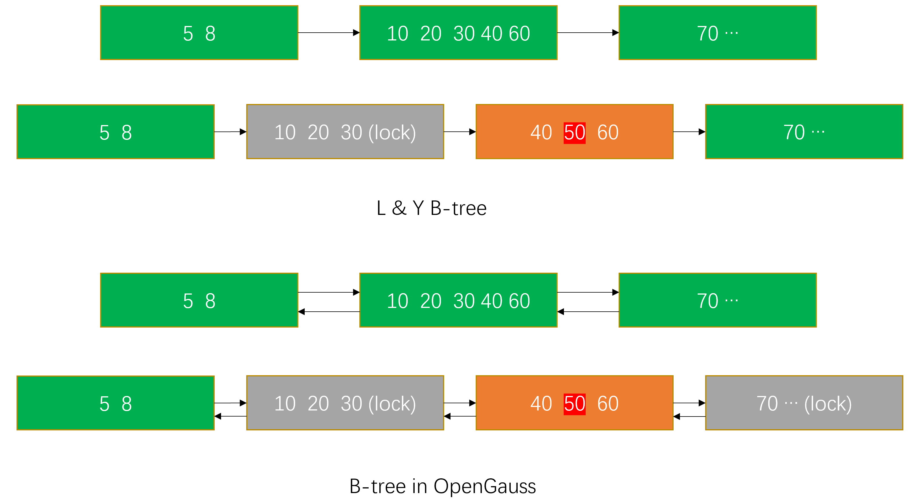
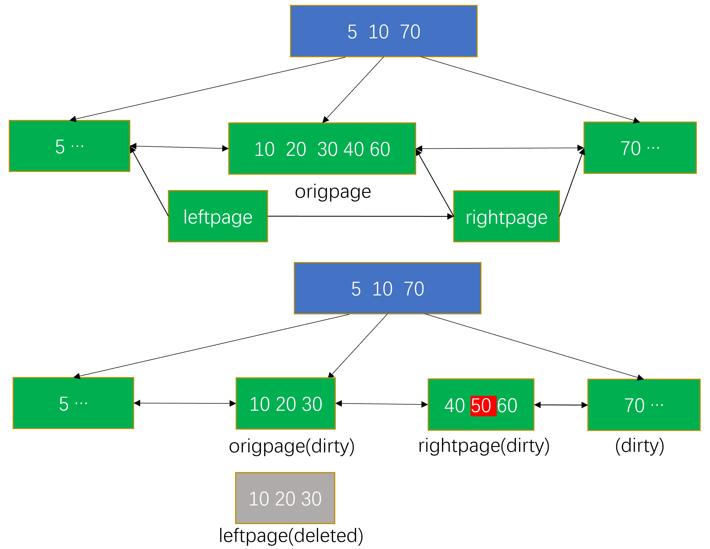

# openGauss B-tree 索引读写并发实现<a name="ZH-CN_TOPIC_0000001127157816"></a>

openGauss B-tree 索引在实现时，没有完全遵循 L & Y 的理论，本文主要关注 openGauss 中 B-tree 索引的实现。

## 实现与理论的差异<a name="section164251199294"></a>

- 读锁

  介绍 B-tree 索引并发读写原理时讲到，L & Y 的理论中读操作完全不加锁，而是假设 B-tree 节点在内存中的拷贝是非共享的。但实际在 PG 和 openGauss 的实现中，内存中的 buffer 是共享的。所以在实现中，实际读操作需要对节点加读锁，来保证读期间没有修改操作。加锁动作降低了并发性，但保证了数据正确性。

- 写锁

  L & Y 的理论总是将加锁和 moveright 耦合，最多同时会对三个节点加锁（分裂的子节点、父节点、父节点的右兄弟节点）。实现中，同一层的节点不需要都加锁。L & Y 的理论中通过记录从根节点开始查找路径上的节点及 key 的信息来记录父子节点关系，理论中假设所有的 key 都是不同的。实现中，父节点通过记录子节点的 Block Number 来实现父节点指向子节点的指针。理论中如果发生分裂需要更新父节点时，父节点所在层的加锁的顺序是：先对父节点加锁，如果父节点发生了分裂，则对父节点的右兄弟节点加锁，然后释放父节点的锁。而实现中，在对父节点的右兄弟节点加锁前，可以释放父节点的锁，因为 link ptr 实现中是记录的右兄弟节点的 block number, 即使右兄弟节点又发生分裂，依然可以通过 block number 找到分裂后的左侧节点，然后继续向右查找。

- link ptr

  L & Y 的理论中每一层节点都有指向右侧节点的 link ptr，当执行 scan 的操作时，通过 link ptr 只能支持自左向右的 scan。为支持逆向 scan，OpenGauss 中每个节点都有指向左右两侧的两个指针，将指向同层右侧节点的称为 right link ptr，指向左侧节点的称为 left link ptr。这个修改，导致 L & Y 的理论中节点分裂需要额外的动作。在锁定分裂节点的同时，还需要锁定该节点分裂前的右兄弟，以修改其 left link ptr，如图-1 所示。实际逆向 scan 比正向 scan 要复杂一些，因为如果逆向 scan 的过程中节点发生分裂，可能还需要通过 right link ptr 向右查找（实际比更复杂，我们会在后面讨论）。

  **图 1** B-tree 索引结构差异<a name="fig104381914163116"></a>  
  

在 scan 过程中，只有在需要读一个节点时才会对其加锁，为减少加锁的时长，读操作会一次把所有满足条件的项全部读出来，在处理这些项时就可以释放锁了。有时，为了防止并发的 delete 操作，需要 pin 住某个叶子节点\(后面会讲到\)。scan 过程中，需要记住当前在扫描节点的 right link ptr，通过 right link ptr 向右 scan 不会遗漏数据；但如果是向左 scan，需要获取最新的 left link ptr。

大多数情况下，在对下一个节点进行 pin 和加锁前，会释放前一个节点的 pin 和锁；但有些情况下会先对下一个节点进行 pin 和加锁，再释放前一个节点的 pin 和锁。之前讲并发原理时证明过，流程中可以避免死锁的出现，但现在由于实现没有完全按照 L & Y 的理论，加了 left link ptr，似乎有死锁的可能。

L & Y 的理论中假设 key 的大小是固定的，实际需要处理变长的 key。因此对每一个 page 而言，key 的个数没有一个固定的最大值，实现中假设一个 page 内至少要有 3 个 item，因此 tuple 的大小不能超过一个 page 最大可用空间的 1/3。节点发生分裂时，按照占用空间来平均分配分裂后的左右节点，而不是按照 item 的个数均分。同时分裂需要将已经在执行中的事务占用的空间考虑在内，否则事务提交时可能出现 page 内没有足够空间的问题。

L & Y 的理论中假设 key 没有重复的，实际是对于非 unique index 可能存在重复 key。

## 插入<a name="section171762116324"></a>

在执行数据插入的流程中，需要更新 heap tuple 和 index tuple，更新 index tuple 执行 ExecInsertIndexTuples 方法，处理的主要流程如下：

```
{
    遍历表上的每一个索引 {
        如果索引的 indisready = false，表示索引不可写，则跳过此索引；
        如果是分区表的 local 索引，且 pg_partiton 中 indisusable = false，跳过此索引；
        调用索引插入函数 index_insert，完成 index tuple 插入
        检查索引插入是否违反约束 unique / exclusion constraint
        返回结果
    }
}
```

在介绍索引相关的代码实现之前，先介绍一下 OpenGauss 中索引实现的目录结构。

索引的实现主要在 src/gausskernel/storage/access 下，其中

- nbtree: 行存表 btree 索引的实现
- cbtree: 列存表 btree 索引的实现
- gist: gist 索引实现
- gin: 倒排索引实现
- psort: 列存表 psort 索引实现
- index: 索引对外接口

行存表支持的索引类型：btree\(缺省值\)、gin 和 gist。

列存表支持的索引类型：psort\(缺省值\)、btree 和 gin。

本文中主要介绍行存表 Btree 索引实现，对应的目录为 nbtree

<a name="table194765063313"></a>

<table><thead ><tr id="row2048115043320"><th class="cellrowborder"  width="50%" id="mcps1.1.3.1.1"><p id="p2481950113310"><a name="p2481950113310"></a><a name="p2481950113310"></a>文件</p>
</th>
<th class="cellrowborder"  width="50%" id="mcps1.1.3.1.2"><p id="p8481850143317"><a name="p8481850143317"></a><a name="p8481850143317"></a>功能</p>
</th>
</tr>
</thead>
<tbody><tr id="row2481750143315"><td class="cellrowborder"  width="50%" headers="mcps1.1.3.1.1 "><p id="p14481450103314"><a name="p14481450103314"></a><a name="p14481450103314"></a>nbtree.cpp</p>
</td>
<td class="cellrowborder"  width="50%" headers="mcps1.1.3.1.2 "><p id="p16484507338"><a name="p16484507338"></a><a name="p16484507338"></a>Btree索引对外接口</p>
</td>
</tr>
<tr id="row148195016337"><td class="cellrowborder"  width="50%" headers="mcps1.1.3.1.1 "><p id="p1348155073313"><a name="p1348155073313"></a><a name="p1348155073313"></a>nbtinsert.cpp</p>
</td>
<td class="cellrowborder"  width="50%" headers="mcps1.1.3.1.2 "><p id="p1348115011333"><a name="p1348115011333"></a><a name="p1348115011333"></a>Btree索引插入、分裂</p>
</td>
</tr>
<tr id="row94835017333"><td class="cellrowborder"  width="50%" headers="mcps1.1.3.1.1 "><p id="p2048250123311"><a name="p2048250123311"></a><a name="p2048250123311"></a>nbtsearch.cpp</p>
</td>
<td class="cellrowborder"  width="50%" headers="mcps1.1.3.1.2 "><p id="p04817509334"><a name="p04817509334"></a><a name="p04817509334"></a>Btree索引查找</p>
</td>
</tr>
<tr id="row3485509337"><td class="cellrowborder"  width="50%" headers="mcps1.1.3.1.1 "><p id="p3481550153316"><a name="p3481550153316"></a><a name="p3481550153316"></a>nbtpage.cpp</p>
</td>
<td class="cellrowborder"  width="50%" headers="mcps1.1.3.1.2 "><p id="p34815503338"><a name="p34815503338"></a><a name="p34815503338"></a>Btree索引page管理</p>
</td>
</tr>
<tr id="row34811501332"><td class="cellrowborder"  width="50%" headers="mcps1.1.3.1.1 "><p id="p04975033316"><a name="p04975033316"></a><a name="p04975033316"></a>nbtsearch.cpp</p>
</td>
<td class="cellrowborder"  width="50%" headers="mcps1.1.3.1.2 "><p id="p8491950143311"><a name="p8491950143311"></a><a name="p8491950143311"></a>Btree索引查找</p>
</td>
</tr>
<tr id="row11494501333"><td class="cellrowborder"  width="50%" headers="mcps1.1.3.1.1 "><p id="p184915011337"><a name="p184915011337"></a><a name="p184915011337"></a>nbtcompare.cpp</p>
</td>
<td class="cellrowborder"  width="50%" headers="mcps1.1.3.1.2 "><p id="p1149105019339"><a name="p1149105019339"></a><a name="p1149105019339"></a>Btree索引数据比较</p>
</td>
</tr>
<tr id="row94945019338"><td class="cellrowborder"  width="50%" headers="mcps1.1.3.1.1 "><p id="p144955015334"><a name="p144955015334"></a><a name="p144955015334"></a>nbtsort.cpp</p>
</td>
<td class="cellrowborder"  width="50%" headers="mcps1.1.3.1.2 "><p id="p94915503338"><a name="p94915503338"></a><a name="p94915503338"></a>Btree索引index tuple排序及btree构建</p>
</td>
</tr>
<tr id="row2775114273413"><td class="cellrowborder"  width="50%" headers="mcps1.1.3.1.1 "><p id="p57761742193416"><a name="p57761742193416"></a><a name="p57761742193416"></a>nbtxlog.cpp</p>
</td>
<td class="cellrowborder"  width="50%" headers="mcps1.1.3.1.2 "><p id="p577684210349"><a name="p577684210349"></a><a name="p577684210349"></a>Btree索引xlog相关操作及回放</p>
</td>
</tr>
<tr id="row287014519344"><td class="cellrowborder"  width="50%" headers="mcps1.1.3.1.1 "><p id="p3870145113413"><a name="p3870145113413"></a><a name="p3870145113413"></a>nbtutils.cpp</p>
</td>
<td class="cellrowborder"  width="50%" headers="mcps1.1.3.1.2 "><p id="p158705452343"><a name="p158705452343"></a><a name="p158705452343"></a>Btree索引其他相关函数</p>
</td>
</tr>
</tbody>
</table>

- index_insert

  ```
  // 实现在 indexam.cpp 所有索引对外接口
  {
      根据索引类型，找到对应的索引插入处理函数（存储在pg_am中），例如btree索引对应的插入函数为btinsert
      调用对应的插入处理函数
      返回结果
  }
  ```

- btinsert

  ```
  // 实现在 nbtree.cpp，行存表btree索引插入实现
  {
      调用 index_form_tuple 生成 index tuple;
      调用 _bt_doinsert 完成索引插入
      返回结果
  }
  ```

- \_bt_doinsert

  // 实现在 nbtinsert.cpp，行存表 btree 索引 index tuple 插入

  ```
  {
      生成scankey用于在B-tree索引中查找插入位置。
      调用 _bt_search 查找插入的叶子节点，返回一个BTStack类型的对象，该对象的实现是一个链表，链表头是叶子节点，后面的每个节点是前一个节点的父节点。由于插入数据可能导致节点分裂，子节点分裂需要更新父节点，可以通过此链表向上查找父节点。
      调用 _bt_moveright，找到最终指向插入的叶子节点。因为流程不是全程加锁（先加读锁，然后释放读锁，再加写锁），因此在找到插入的叶子节点后，该节点可能由于新的插入导致分裂，则新的插入位置可能在原节点的右侧，需要向右查找（多次分裂可能需要多次向右查找）；如果叶子节点没有发生变化，或者插入位置不需要向右查找，则_bt_moveright实际不做任何事情。这一点涉及Btree索引的并发控制，可以参考前一篇。
      检查unique约束，包括进行中的事务，如果有执行中的事务可能导致违反约束，需要等待执行中的事务结束。
      page内查找插入位置_bt_findinsertloc
      执行插入操作 _bt_insertonpg
  }
  ```

在查找插入节点的实现 \_bt_search 中，在每次使用节点时都需要调用一次 \_bt_moveright ，因为查找过程中加锁的顺序是先对父节点加 ReadLock，查找到子节点（父节点指向子节点的指针的实现是记录子节点的页号）后释放父节点的 ReadLock，再对子节点加 ReadLock。由于读写并发，查找到子节点到对子节点加 ReadLock 这段时间内子节点有可能已经发生了分裂，因此在使用子节点查找时需要调用一次\_bt_moveright。这样实现可以减少加锁的粒度，有利于读写并发。

\_bt_search 查找到最终要执行插入的叶子节点后，在使用该节点时也要调用一次\_bt_moveright，原因是查找到叶子节点后，对叶子节点加了 ReadLock。但是由于需要执行插入动作，会先释放叶子节点的 ReadLock 再对叶子节点加 WriteLock，放锁到再加锁的间隙叶子节点可能发生分裂。代码实现如下：

```
    stack = _bt_search(rel, indnkeyatts, itup_scankey, false, &buf, BT_WRITE);

    offset = InvalidOffsetNumber;

    /* trade in our read lock for a write lock */
    LockBuffer(buf, BUFFER_LOCK_UNLOCK);
    LockBuffer(buf, BT_WRITE);
    buf = _bt_moveright(rel, buf, indnkeyatts, itup_scankey, false, true, stack, BT_WRITE);
```

- \_bt_moveright

  // 实现在 nbtserach.cpp 在获取到将要执行插入的叶子节点后，由于并发操作，实际位置可能发生了变化，需要由当前节点向右查找才能找到实际位置

  ```
  {
      如果是写入操作insert/update，则在流程中检查是否有未完成的分裂，插入流程不允许插入一个未完成分裂中的page（通过P_INCOMPLETE_SPLIT判断。未完成的分裂可能是程序crash或者其他failure导致，special区域有标记页面的状态），因此先在流程中完成分裂动作。_bt_finish_split 这里流程的实现需要先了解 _bt_split 流程。
      如果当前节点的flag是（BTP_DELETED | BTP_HALF_DEAD），表明叶子节点被删除，需要向右移动；如果当前的scan key > 节点的HK，则节点在上次获取之后发生了分裂，需要向右移动。循环检查，直到当前节点是最右节点，或者scan key <= HighKey。
  }
  ```

  对要执行插入操作的叶子节点加锁后，需要在叶子节点内找到具体的插入位置，调用方法 \_bt_findinsertloc。

- \_bt_findinsertloc

  // 实现在 nbtinsert.cpp 在 page 内为要插入的 index tuple 查找一个插入位置（page buffer + offset）

  ```
  {
      检查 tuple size 是否小于page内最大可用空间的1/3，一个page内最少要放3个tuple
      如果当前page可用空间不足以放下插入的tuple，可能需要执行节点分裂。在执行分裂之前检查一下是否可以将要插入的tuple放置到右侧的某个节点中(例如 scankey = HK 的场景，可以将tuple插入右侧节点，从而避免执行分裂动作) {
      a. 如果是叶子节点且page内有垃圾可以清理，则调用 _bt_vacuum_one_page 做一次 page 的 vacuum，执行结束后检查 page 内的剩余空间是否足够插入tuple。
      b. 如果 page-vaccum 后仍然不够或是不能执行 vacuum，检查是否满足以下两个条件：
          - 当前节点是最右侧节点 //不能继续向右查找
          - Scan key != HK 或者 有0.99的概率向右移动 // 如果多个page内有相同的key，对查找而言可能需要不断向右查找。此时另一种选择是找一个靠左的节点将其分裂，然后有足够的空间插入要插入的tuple。这里向右继续查找的概率是0.99，有0.01的概率将当前节点分裂后进行插入。
          如果当前节点处于分裂未完成的状态，先完成分裂动作

      不满足 1、2两个条件，则表明 scan key = HK，则向右查找到一个有足够空间可以插入tuple的节点。
      如果查找过程中向右移动了，则预期将tuple插入到节点的第一个位置（非最右节点是偏移是2，因为有HK，最右节点偏移是1）返回 对应的节点 以及 offset(入参传递);
      如果没有向右移动，也没有执行vacuum，且当前的offset != INVALID，则 返回节点和offset;
      其他情况需要在page内重新查找位置， 调用_bt_binsrch，返回
  }
  ```

  上述流程由于涉及节点分裂，所以看上去有点复杂，此流程主要关注读写并发的问题，分裂后面会详述。此流程是对 page 加 WriteLock，在 page 内找到插入的位置（offset）。

  ```
  找到位置后，调用 _bt_insertonpg 执行插入操作
  // 实现在 nbtinsert.cpp 向page内插入一个tuple，执行时需要对buffer pin + write lock，执行完成后释放pin 和 write lock; 如果插入的节点是非叶子节点，cbuf表示插入的tuple的左子节点，插入操作会清除左子节点上的BTP_INCOMPLETE_SPLIT标记（该标记表示page处于分裂为完成的状态，通常是标记在分裂后的左侧节点上，表明分裂后父节点缺少分裂后右侧节点的信息）。
  {
      检查不是 incomplete split page
      检查page内free space 是否足够插入 tuple，如果不够 执行分裂
  调用 _bt_findsplitloc 找到分裂点，执行分裂 _bt_split，在 _bt_split 完成 tuple 的插入，完成分裂后向上更新父节点
      如果空间足够，调用 _bt_pgaddtup 执行插入
      执行插入的 page buffer 标脏
      记Xlog
  }
  ```

- **写流程中加锁顺序：**

  对节点加 ReadLock，获取节点信息

  释放 ReadLock

  加 WriteLock，执行插入操作，（可能继续执行分裂）

  执行完成 Unlock

## 查找<a name="section3501523113917"></a>

- \_bt_search

  ```
  // 实现在 nbtsearch.cpp 中，用于从B-tree的根节点开始向下查找到符合条件的叶子节点
  {
      获取根page _bt_getroot
      调用 _bt_moveright; 如果是write-mode（插入流程查找插入位置），_bt_moveright会完成未完成的split
      如果page是叶子page，则返回
      否则调用 _bt_binsrch，在当前page进行查找，返回对应的item的offset。如果查找的是叶子节点，则返回的是第一个key >= scan key; 非叶子节点返回的是最后一个 key < scanKey
  释放父节点的读锁，获取子节点的读锁，直到找到叶子节点。
      返回一个BTStack对象（数据结构为链表，每个节点中有 block number 和 offset信息，同时还有一个指针指向父节点），如果发生分裂，可以通过此链表回溯父节点。（L&Y paper）
      返回BTStack对象
  }
  ```

- 查找流程的加锁顺序：

  先对父节点加 ReadLock，然后获取子节点信息，

  父节点 Unlock

  子节点加 ReadLock

  代码如下：

  ```
  {
      /* drop the read lock on the parent page, acquire one on the child */
      *bufP = _bt_relandgetbuf(rel, *bufP, blkno, BT_READ);
      ...
  }
  Buffer _bt_relandgetbuf(Relation rel, Buffer obuf, BlockNumber blkno, int access)
  {
      Buffer buf;

      Assert(blkno != P_NEW);
      if (BufferIsValid(obuf))
          LockBuffer(obuf, BUFFER_LOCK_UNLOCK);
      buf = ReleaseAndReadBuffer(obuf, rel, blkno);
      LockBuffer(buf, access);
      _bt_checkpage(rel, buf);
      return buf;
  }
  ```

## 分裂<a name="section8514413134011"></a>

插入和查找流程都涉及节点的分裂问题，因此在这里有必要介绍一下分裂的实现。

分裂的主要实现也在 nbtinsert.cpp 中，主要逻辑在

- \_bt_split

  ```
  // 分裂btree中的一个节点，只实现一个page分裂为两个page，不包括更新父节点信息部分，更新父节点的实现在_bt_insert_parent
  {
      // 分裂过程中有三个 page， 原始未分裂的 page 记为 origpage，新申请的分裂后右侧的 page 记为 rightpage，临时 page 用于记录分裂后左侧节点的数据记为 leftpage，最终需要把 leftpage 拷贝回 origpage。
      _bt_getbuf 申请一个新的 index page（rightpage），并对 page 进行初始化。FSM 返回一个page后，需要对这个page进行检查确保这个page没有被其他人使用。返回之前会对 page buffer 加锁以及引用计数（lock and pin）。
      初始化 leftpage，拷贝 origpage 的 LSN 到 leftpage; 拷贝 origpage 中的 special pointer 中的 flags 到 leftpage ，然后设置 leftpage 中 special pointer 的 flag。将BTP_ROOT、BTP_SPLIT_END、BTP_HAS_GARBAGE三个标记位设置为0。rightpage 此标记位设置为和 leftpage 一致。
      设置是 leftpage 的 special pointer 的 flag 中 BTP_INCOMPLETE_SPLIT 设置为1，表明父节点中缺少指向其右兄弟节点的指针。设置 leftpage 和 rightpage 的 link ptr。
      如果分裂的节点不是最右节点，则rightpage中的第一个位置是 HighKey，否则是 user data。
      确定分裂后左右两侧的数据，将数据插入左右两侧的page
      对 rightpage 加 BT_WRITE 锁，用 leftpage 的内容覆盖 origpage (除了data外，special pointer 也一起更新)，将 origpage 和 rightpage 的 buffer 标脏。更新原 origpage 的右兄弟节点的 left link ptr，指向rightpage，将页面标脏。
      如果分裂的是非叶子节点，节点分裂完成后清除子节点上的BTP_INCOMPLETE_SPLIT标记。非叶子节点分裂是由叶子节点分裂导致，父节点完成分裂是指向表明子节点的downlink插入完成，可以将子节点的BTP_INCOMPLETE_SPLIT标记清除// 叶子节点上BTP_INCOMPLETE_SPLIT标记清除是在父节点中插入分裂后的右侧节点的指针时完成，实现是在_bt_insert_parent ->  _bt_insertonpg
      记XLog
  }
  ```

  **图 2** B-tree 索引分裂过程中结构变化<a name="fig1332961012411"></a>  
  

分裂过程中的加锁顺序：

- origpage 加 WriteLock, 修改数据 和 right link ptr
- rightpage 加 WriteLock, 修改数据 和 link ptr
- origpage 分裂前的右兄弟节点加 WriteLock, 修改 left link ptr
- origpage 分裂前的右兄弟节点 Unlock
- rightpage Unlock
- origpage Unlock

- root 分裂

  L & Y 的理论中没有讨论根节点分裂的问题。OpenGauss 实现时按照普通节点分裂的方式，处理根节点的分裂。根节点分裂时，需要新生成一个根节点，原来的根节点成为新根节点的子节点，根节点分裂需要额外更新 meta-page 中根节点的信息，最终结果也是正确的。

  在节点分裂时，需要通过回溯的方式来更新上层节点。但如果这个上层节点是 meta-page，那么此次回溯无法正确更新，因为 meta-page 中只是元数据不能分裂。这种情况下 B-tree 产生了新的 root，需要重新走一遍查找，直到找到刚分裂的节点的上一层，然后向右查找到正确的插入位置。这通常需要重新获取 meta-page 以及新的 root-page，可以通过保存节点在 B-tree 中所处的层号（通常叶子节点是 0 层，其父节点是 1 层，以此类推），最终找到要更新的节点所处的层。

  这次主要介绍了 B_tree 索引实现与理论中的一些差异点，重点介绍了读写及分裂的流程，及其中加解锁的顺序。索引数据的删除、vacuum、WAL 等内容下次再介绍。
