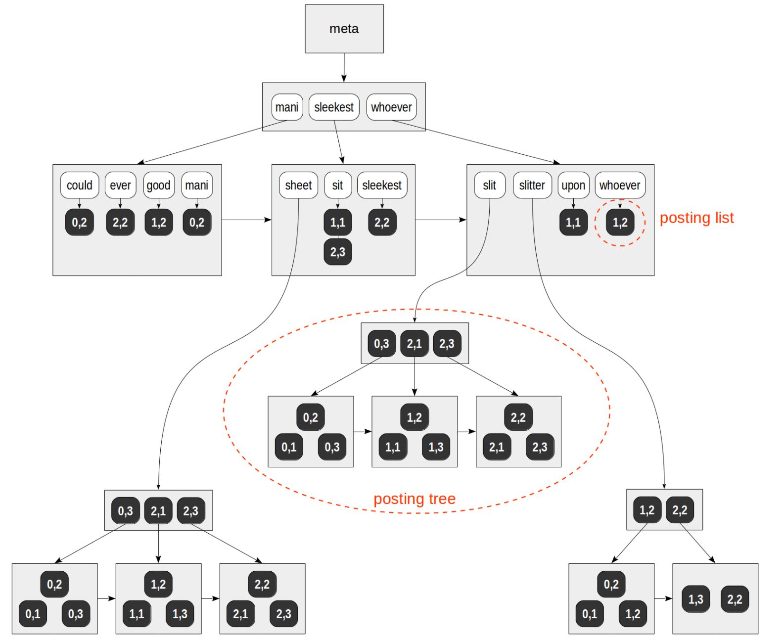
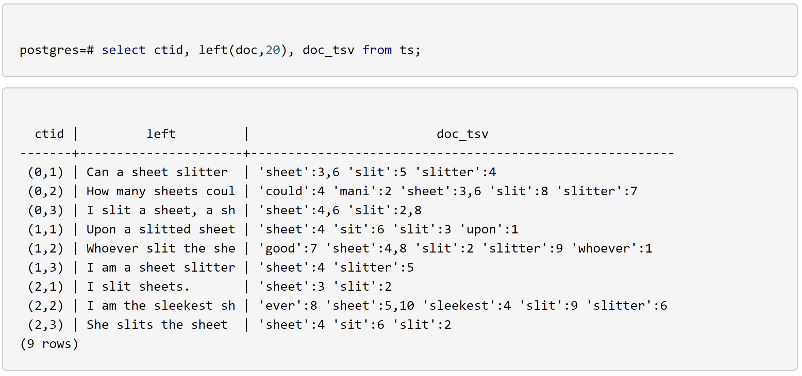
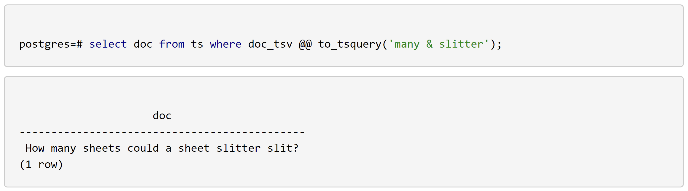

# openGauss Gin 索引<a name="ZH-CN_TOPIC_0000001154714466"></a>

## 概述<a name="section19108191910525"></a>

GIN（Generalized Inverted Index）通用倒排索引，是首选的文本搜索索引类型。倒排索引对应的列上的数据类型通常是一个多值类型，索引中包含每个单词的索引条目，以及所匹配的位置的压缩列表。如果搜索条件是多个单词，可以先使用第一个单词进行匹配，再在找到的结果中使用其他单词删除不匹配的项。Gin 索引的 key 是多值类型中出现的单词，叶子节点中存储了每个单词出现的 TID 的列表。如果这个 TID 列表比较小，它可以和元素放在同一个页面中（称为 posting list）。如果列表比较大，就需要用到更高效的数据结构 B-tree，这样的 B-tree 位于单独的数据页上（称为 posting tree）。

## 索引结构<a name="section1329419292525"></a>

Gin 索引大的组织结构是一棵 B-tree 如图-1 所示

其中也有 meta-page、root-page 等 page，如果一个 key 对应的 tids 比较少可以和 key 放在同一个 page 中作为叶子节点； 如果对应的 tids 比较多\(占用的空间的大小\)，需要将这些 tids 放到单独的数据页上，并且以 B-tree 的形式组织方便快速查找，叶子节点中记录对应的 B-tree 的 root-page 的信息。

**图 1** Gin 索引结构示意图<a name="fig162192235320"></a>  


## 语法<a name="section15920175112539"></a>

```
CREATE INDEX name ON table USING GIN (column);
```

openGauss 中创建 gin 索引时，索引列的类型必须是 tsvector 类型。

```
Example:

postgres=# create table ts(doc text, doc_tsv tsvector);

postgres=# insert into ts(doc) values
  ('Can a sheet slitter slit sheets?'),
  ('How many sheets could a sheet slitter slit?'),
  ('I slit a sheet, a sheet I slit.'),
  ('Upon a slitted sheet I sit.'),
  ('Whoever slit the sheets is a good sheet slitter.'),
  ('I am a sheet slitter.'),
  ('I slit sheets.'),
  ('I am the sleekest sheet slitter that ever slit sheets.'),
  ('She slits the sheet she sits on.');

postgres=# update ts set doc_tsv = to_tsvector(doc);

postgres=# create index on ts using gin(doc_tsv);
```



查询一个既包含 many 又包含 slitter 的 doc 如下：



## 实现<a name="section149311020195510"></a>

Gin 索引的实现主要在 src/gausskernel/storage/access/gin 下，主要文件及功能如下：

**表 1**

<a name="table548815311564"></a>

<table><thead ><tr id="row14893318568"><th class="cellrowborder"  width="50%" id="mcps1.2.3.1.1"><p id="p54891438561"><a name="p54891438561"></a><a name="p54891438561"></a>文件</p>
</th>
<th class="cellrowborder"  width="50%" id="mcps1.2.3.1.2"><p id="p916892005612"><a name="p916892005612"></a><a name="p916892005612"></a>功能</p>
</th>
</tr>
</thead>
<tbody><tr id="row154895318564"><td class="cellrowborder"  width="50%" headers="mcps1.2.3.1.1 "><p id="p748933185612"><a name="p748933185612"></a><a name="p748933185612"></a>ginbtree.cpp</p>
</td>
<td class="cellrowborder"  width="50%" headers="mcps1.2.3.1.2 "><p id="p11489143165615"><a name="p11489143165615"></a><a name="p11489143165615"></a>倒排索引page处理相关函数</p>
</td>
</tr>
<tr id="row6489143175617"><td class="cellrowborder"  width="50%" headers="mcps1.2.3.1.1 "><p id="p15489153195610"><a name="p15489153195610"></a><a name="p15489153195610"></a>ginarrayproc.cpp</p>
</td>
<td class="cellrowborder"  width="50%" headers="mcps1.2.3.1.2 "><p id="p11489632564"><a name="p11489632564"></a><a name="p11489632564"></a>支持倒排索引处理各种数组类型的函数</p>
</td>
</tr>
<tr id="row12489636569"><td class="cellrowborder"  width="50%" headers="mcps1.2.3.1.1 "><p id="p14489636566"><a name="p14489636566"></a><a name="p14489636566"></a>gindatapage.cpp</p>
</td>
<td class="cellrowborder"  width="50%" headers="mcps1.2.3.1.2 "><p id="p1548993165611"><a name="p1548993165611"></a><a name="p1548993165611"></a>倒排索引处理 posting tree page 相关实现</p>
</td>
</tr>
<tr id="row0489638567"><td class="cellrowborder"  width="50%" headers="mcps1.2.3.1.1 "><p id="p1148913325615"><a name="p1148913325615"></a><a name="p1148913325615"></a>gininsert.cpp</p>
</td>
<td class="cellrowborder"  width="50%" headers="mcps1.2.3.1.2 "><p id="p74901034565"><a name="p74901034565"></a><a name="p74901034565"></a>倒排索引插入相关实现</p>
</td>
</tr>
<tr id="row124907319569"><td class="cellrowborder"  width="50%" headers="mcps1.2.3.1.1 "><p id="p1149015355617"><a name="p1149015355617"></a><a name="p1149015355617"></a>ginpostinglist.cpp</p>
</td>
<td class="cellrowborder"  width="50%" headers="mcps1.2.3.1.2 "><p id="p1490183205612"><a name="p1490183205612"></a><a name="p1490183205612"></a>倒排索引处理 posting list 相关实现</p>
</td>
</tr>
<tr id="row349015318567"><td class="cellrowborder"  width="50%" headers="mcps1.2.3.1.1 "><p id="p124901313567"><a name="p124901313567"></a><a name="p124901313567"></a>ginscan.cpp</p>
</td>
<td class="cellrowborder"  width="50%" headers="mcps1.2.3.1.2 "><p id="p1849017395612"><a name="p1849017395612"></a><a name="p1849017395612"></a>倒排索引扫描相关实现</p>
</td>
</tr>
<tr id="row1949018316564"><td class="cellrowborder"  width="50%" headers="mcps1.2.3.1.1 "><p id="p134906325618"><a name="p134906325618"></a><a name="p134906325618"></a>ginget.cpp</p>
</td>
<td class="cellrowborder"  width="50%" headers="mcps1.2.3.1.2 "><p id="p449013355616"><a name="p449013355616"></a><a name="p449013355616"></a>倒排索引scan过程中获取tuple相关实现</p>
</td>
</tr>
<tr id="row1070510713572"><td class="cellrowborder"  width="50%" headers="mcps1.2.3.1.1 "><p id="p97061671572"><a name="p97061671572"></a><a name="p97061671572"></a>ginxlog.cpp</p>
</td>
<td class="cellrowborder"  width="50%" headers="mcps1.2.3.1.2 "><p id="p27061273574"><a name="p27061273574"></a><a name="p27061273574"></a>倒排索引xlog回放相关实现</p>
</td>
</tr>
<tr id="row181491113577"><td class="cellrowborder"  width="50%" headers="mcps1.2.3.1.1 "><p id="p381461116579"><a name="p381461116579"></a><a name="p381461116579"></a>ginvacuum.cpp</p>
</td>
<td class="cellrowborder"  width="50%" headers="mcps1.2.3.1.2 "><p id="p10814151119578"><a name="p10814151119578"></a><a name="p10814151119578"></a>倒排索引delete和vacuum相关实现</p>
</td>
</tr>
</tbody>
</table>

查看 pg_am 中 Gin 索引相关处理函数:

<a name="table02371046115710"></a>

<table><tbody><tr id="row12237104605716"><td class="cellrowborder"  width="50%"><p id="p4237194611573"><a name="p4237194611573"></a><a name="p4237194611573"></a>amname</p>
</td>
<td class="cellrowborder"  width="50%"><p id="p538583185816"><a name="p538583185816"></a><a name="p538583185816"></a>gin</p>
</td>
</tr>
<tr id="row1423715465574"><td class="cellrowborder"  width="50%"><p id="p1223714605715"><a name="p1223714605715"></a><a name="p1223714605715"></a>aminsert</p>
</td>
<td class="cellrowborder"  width="50%"><p id="p1523724635720"><a name="p1523724635720"></a><a name="p1523724635720"></a>gininsert</p>
</td>
</tr>
<tr id="row19237194619579"><td class="cellrowborder"  width="50%"><p id="p1623717461572"><a name="p1623717461572"></a><a name="p1623717461572"></a>ambeginscan</p>
</td>
<td class="cellrowborder"  width="50%"><p id="p9501163811580"><a name="p9501163811580"></a><a name="p9501163811580"></a>ginbeginscan</p>
</td>
</tr>
<tr id="row923794612575"><td class="cellrowborder"  width="50%"><p id="p16237114620577"><a name="p16237114620577"></a><a name="p16237114620577"></a>amendscan</p>
</td>
<td class="cellrowborder"  width="50%"><p id="p10237154612571"><a name="p10237154612571"></a><a name="p10237154612571"></a>ginendscan</p>
</td>
</tr>
<tr id="row102370463572"><td class="cellrowborder"  width="50%"><p id="p1590462916584"><a name="p1590462916584"></a><a name="p1590462916584"></a>amgetbitmap</p>
</td>
<td class="cellrowborder"  width="50%"><p id="p16904182995820"><a name="p16904182995820"></a><a name="p16904182995820"></a>gingetbitmap</p>
</td>
</tr>
<tr id="row623810468579"><td class="cellrowborder"  width="50%"><p id="p290382905818"><a name="p290382905818"></a><a name="p290382905818"></a>ambuild</p>
</td>
<td class="cellrowborder"  width="50%"><p id="p18902112911588"><a name="p18902112911588"></a><a name="p18902112911588"></a>ginbuild</p>
</td>
</tr>
<tr id="row1238134655719"><td class="cellrowborder"  width="50%"><p id="p990120297580"><a name="p990120297580"></a><a name="p990120297580"></a>…</p>
</td>
<td class="cellrowborder"  width="50%"><p id="p039175918583"><a name="p039175918583"></a><a name="p039175918583"></a>…</p>
</td>
</tr>
</tbody>
</table>

## 构建 Gin 索引<a name="section972010215594"></a>

```
ginbuild
{
    ...
    // 初始化工作，如 创建 gin 索引的 meta 和 root，即 XLOG 等
    buildInitialize(index, &buildstate);
    // scan heap tuples 调用 ginBuildCallback 处理每个要加入索引的 tuple
    // ginBuildCallback 会从 heap tuple 中提取 entries，如果有多个值
    // 会对这些值进行去重和排序。得到去重及排完序的 entries 后，调用 ginInsertBAEntries
    // 将这些 entries  及 对应的 tids 插入一棵RB-tree
    reltuples = tableam_index_build_scan(heap, index, indexInfo, false, ginBuildCallback, (void*)&buildstate);
    ...
    // 从RB-tree中把之前插入的 entries 和 tids scan 出来，插入到 gin index 中
    while ((list = ginGetBAEntry(&buildstate.accum, &attnum, &key, &category, &nlist)) != NULL) {
        /* there could be many entries, so be willing to abort here */
        CHECK_FOR_INTERRUPTS();
        // 如果 key 不存在，则新增一个 key entry，如果已经存在则更新对应的 tids
        // 首先在gin索引中查找到对应 key 的叶子节点，如果 key 已经存在，更新对应的 tids
        // 不存在则插入一个新的叶子节点
        ginEntryInsert(&buildstate.ginstate, attnum, key, category, list, nlist, &buildstate.buildStats);
    }

    ...
    // 更新 meta-page 中的信息, 记 XLOG
    ginUpdateStats(index, &buildstate.buildStats);
    ...
    返回结果
}
```

在向 gin 索引中插入数据时，首先和 B-tree 索引一样，首先需要查找对应的 key 是否存在；

如果 key 已经存在，则查看现在叶子节点中 key 对应的 tids 是 posting tree 还是 posting list，更新 tids;

posting list 如果由于更新导致 tids 比较多，可能变为 posting tree

如果 key 不存在，则在叶子节点中插入这个新的 key 以及对应的 tids。

```
void ginEntryInsert(GinState *ginstate, OffsetNumber attnum, Datum key, GinNullCategory category,
                    ItemPointerData *items, uint32 nitem, GinStatsData *buildStats)
{
    GinBtreeData btree;
    GinBtreeEntryInsertData insertdata;
    GinBtreeStack *stack = NULL;
    IndexTuple itup;
    Page page;

    insertdata.isDelete = FALSE;

    /* During index build, count the to-be-inserted entry */
    if (buildStats != NULL)
        buildStats->nEntries++;

    ginPrepareEntryScan(&btree, attnum, key, category, ginstate);

    // 在 B-tree 中找到叶子节点
    stack = ginFindLeafPage(&btree, false);
    page = BufferGetPage(stack->buffer);

    // 如果 key 已经存在
    if (btree.findItem(&btree, stack)) {
        /* found pre-existing entry */
        itup = (IndexTuple)PageGetItem(page, PageGetItemId(page, stack->off));
        // 如果是 posting tree 结构
        if (GinIsPostingTree(itup)) {
            /* add entries to existing posting tree */
            BlockNumber rootPostingTree = GinGetPostingTree(itup);

            /* release all stack */
            LockBuffer(stack->buffer, GIN_UNLOCK);
            freeGinBtreeStack(stack);

            /* insert into posting tree */
            ginInsertItemPointers(ginstate->index, rootPostingTree, items, nitem, buildStats);
            return;
        }
        // 如果是 posting  list
        /* modify an existing leaf entry */
        itup = addItemPointersToLeafTuple(ginstate, itup, items, nitem, buildStats);

        insertdata.isDelete = TRUE;
    } else { // 对应的 key 不存在， 需要新建一个叶子节点里的对象
        /* no match, so construct a new leaf entry */
        itup = buildFreshLeafTuple(ginstate, attnum, key, category, items, nitem, buildStats);
    }

    /* Insert the new or modified leaf tuple */
    insertdata.entry = itup;
    ginInsertValue(&btree, stack, &insertdata, buildStats);
    pfree(itup);
    itup = NULL;
}
```

gin 的 B-tree 也会涉及分裂等问题，和 B-tree 的分裂类似，因此在使用过程中也会有与 B-tree 索引使用过程中 moveright 类似的动作，本文不展开介绍分裂相关内容了。

相关数据结构：

```
// 用于表示一个 key 及 与其关联的 tids 的数据结构
typedef struct GinEntryAccumulator {
    RBNode rbnode;
    Datum key;
    GinNullCategory category;
    OffsetNumber attnum;
    bool shouldSort;
    ItemPointerData *list;
    uint32 maxcount; /* allocated size of list[] */
    uint32 count;    /* current number of list[] entries */
} GinEntryAccumulator;

// Gin 索引整体结构为 B-tree 结构
// B-tree 中的一个节点
typedef struct GinBtreeStack {
    BlockNumber blkno;
    Buffer buffer;
    OffsetNumber off;
    ItemPointerData iptr;
    /* predictNumber contains predicted number of pages on current level */
    uint32 predictNumber;
    struct GinBtreeStack *parent; // 父节点
} GinBtreeStack;

typedef struct GinBtreeData *GinBtree;
```

gin 索引的查找和插入的流程在构建 gin 索引的流程中都有涉及，和 B-tree 有些类似，本文不展开介绍了。

另外需要注意的一点是，gin 索引是行存表和列存表都支持的索引类型，但是在 pg_am 中行存表的 gin 和 列存表的 gin 是两条记录，cgin pg_am 中相关处理函数如下所示：

**表 2**

<a name="table251414613018"></a>

<table><tbody><tr id="row751410461109"><td class="cellrowborder"  width="50%"><p id="p7514846106"><a name="p7514846106"></a><a name="p7514846106"></a>amname</p>
</td>
<td class="cellrowborder"  width="50%"><p id="p5515174614011"><a name="p5515174614011"></a><a name="p5515174614011"></a>cgin</p>
</td>
</tr>
<tr id="row18515246005"><td class="cellrowborder"  width="50%"><p id="p551564615015"><a name="p551564615015"></a><a name="p551564615015"></a>aminsert</p>
</td>
<td class="cellrowborder"  width="50%"><p id="p19515846107"><a name="p19515846107"></a><a name="p19515846107"></a>gininsert</p>
</td>
</tr>
<tr id="row55151461303"><td class="cellrowborder"  width="50%"><p id="p45154460015"><a name="p45154460015"></a><a name="p45154460015"></a>ambeginscan</p>
</td>
<td class="cellrowborder"  width="50%"><p id="p18515114610010"><a name="p18515114610010"></a><a name="p18515114610010"></a>ginbeginscan</p>
</td>
</tr>
<tr id="row145150468018"><td class="cellrowborder"  width="50%"><p id="p125157461307"><a name="p125157461307"></a><a name="p125157461307"></a>amendscan</p>
</td>
<td class="cellrowborder"  width="50%"><p id="p137301658416"><a name="p137301658416"></a><a name="p137301658416"></a>ginendscan</p>
</td>
</tr>
<tr id="row95151467019"><td class="cellrowborder"  width="50%"><p id="p122271342117"><a name="p122271342117"></a><a name="p122271342117"></a>amgetbitmap</p>
</td>
<td class="cellrowborder"  width="50%"><p id="p1451519461805"><a name="p1451519461805"></a><a name="p1451519461805"></a>cgingetbitmap</p>
</td>
</tr>
<tr id="row19515174611018"><td class="cellrowborder"  width="50%"><p id="p75151546005"><a name="p75151546005"></a><a name="p75151546005"></a>ambuild</p>
</td>
<td class="cellrowborder"  width="50%"><p id="p1051513461809"><a name="p1051513461809"></a><a name="p1051513461809"></a>cginbuild</p>
</td>
</tr>
<tr id="row15515194616010"><td class="cellrowborder"  width="50%"><p id="p135154461016"><a name="p135154461016"></a><a name="p135154461016"></a>…</p>
</td>
<td class="cellrowborder"  width="50%"><p id="p2515346403"><a name="p2515346403"></a><a name="p2515346403"></a>…</p>
</td>
</tr>
</tbody>
</table>

可以看出列存表的 gin 索引大部分处理函数和行存表是共用的，但索引构建的实现和行存不同，主要差异点是行存表和列存表底层存储及访问方式的差异，gin 索引本身的实现并没有太大差别。

索引删除和 vacuum 相关的内容不在本文讨论，这块内容后面单独叙述。
