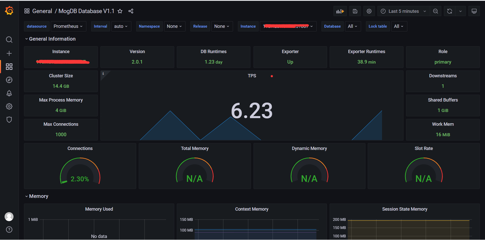

# openGauss/MogDB 数据库完美适配 Grafana 及 Prometheus<a name="ZH-CN_TOPIC_0000001232453169"></a>

Grafana 是一个跨平台、开源的度量分析和可视化工具，可以通过对接各种数据源并作可视化展示。

Prometheus 是著名开源监控项目，其监控任务由具体的 exporter 实现，exporter 到目标端抓取监控数据，然后保存在 TSDB 时序数据库中。Prometheus 也支持 PromQL 查询语言进行自定义的查询组合。

openGauss/MogDB 数据库可以通过 opengauss_exporter 完美适配 Grafana 及 Prometheus。

下面是效果图：



下面在麒麟 arm 测试环境下演示部署过程，x86 环境需要替换相关下载安装包。

## 1.Prometheus 部署<a name="section1485617177481"></a>

1.1. 安装包下载

软件下载地址：https://prometheus.io/download/

下载文件 prometheus-2.31.1.linux-arm64.tar.gz

1.2. 创建 prometheus 用户

```
# useradd prometheus
# password prometheus
```

1.3. 创建 prometheus 相应目录并解压安装包

```
# mkdir /appdata/prometheus
# mkdir /appdata/prometheus/etc
# mkdir /appdata/prometheus/log
# mkdir /appdata/prometheus/data

# tar -zxvf prometheus-2.31.1.linux-arm64.tar.gz -C /appdata/prometheus
# chown -R prometheus: /appdata/prometheus
# chmod -R 755 /appdata/prometheus
```

1.4. 使用 prometheus 用户检查安装版本

```
$ /appdata/prometheus/prometheus-2.31.1.linux-arm64/prometheus --version
```

1.5. 使用 prometheus 用户编辑配置文件

```
$ vi /appdata/prometheus/etc/prometheus.yml
```

内容如下

```
# my global config
global:
  scrape_interval:     15s # Set the scrape interval to every 15 seconds. Default is every 1 minute.
  evaluation_interval: 15s # Evaluate rules every 15 seconds. The default is every 1 minute.
  # scrape_timeout is set to the global default (10s).
# Alertmanager configuration
alerting:
  alertmanagers:
  - static_configs:
    - targets:
# Load rules once and periodically evaluate them according to the global 'evaluation_interval'.
rule_files:
  # - "first_rules.yml"
  # - "second_rules.yml"

# A scrape configuration containing exactly one endpoint to scrape:
# Here it's Prometheus itself.
scrape_configs:
  - job_name: 'prometheus'
    static_configs:
    - targets: ['x.x.x.x:50090']
```

1.6. 使用 root 用户配置 prometheus 开机启动

```
# vi /usr/lib/systemd/system/prometheus.service
```

内容如下

```
[Unit]
Description= Prometheus
After=network.target

[Service]
Type=simple
User=prometheus
ExecStart=/appdata/prometheus/prometheus-2.31.1.linux-arm64/prometheus --web.listen-address="0.0.0.0:50090" --config.file=/appdata/prometheus/etc/prometheus.yml --storage.tsdb.path=/appdata/prometheus/data
ExecReload=/bin/kill -HUP $MAINPID
Restart=on-failure

[Install]
WantedBy=multi-user.target
```

启动服务

```
# systemctl daemon-reload
# systemctl enable prometheus
# systemctl start prometheus
```

1.7. 使用 web 浏览器测试 prometheus 服务

打开 http://x.x.x.x:50090/ 如下如所示，说明 prometheus 服务正常。

## 2. node_exporter 部署<a name="section1490305664916"></a>

2.1. 安装包下载

软件下载地址：https://github.com/prometheus/node\_exporter/releases

下载文件 node_exporter-1.2.2.linux-arm64.tar.gz

2.2. 使用 root 用户解压安装包

root 用户解压安装包到 prometheus 用户,测试环境部署在 prometheus 用户下。

```
# tar -zxvf node_exporter-1.2.2.linux-arm64.tar.gz -C /appdata/prometheus/
# chown -R prometheus: /appdata/prometheus/node_exporter-1.2.2.linux-arm64
```

2.3. 使用 prometheus 用户检查安装版本

```
$ /appdata/prometheus/node_exporter-1.2.2.linux-arm64/node_exporter --version
```

2.4. 使用 root 用户配置 node_exporter 开机启动

```
# vi /usr/lib/systemd/system/node_exporter.service
```

内容如下：

```
[Unit]
Description= node exporter
After=network.target

[Service]
Type=simple
User=prometheus
ExecStart=/appdata/prometheus/node_exporter-1.2.2.linux-arm64/node_exporter --web.listen-address=":9100" --no-collector.softnet
ExecReload=/bin/kill -HUP $MAINPID
Restart=on-failure

[Install]
WantedBy=multi-user.target

# systemctl daemon-reload
# systemctl enable node_exporter
# systemctl start node_exporter
```

2.5. 查看 node_exporter 服务

```
# systemctl status node_exporter
```

2.6. prometheus 配置 exporter

prometheus 配置文件 prometheus.yml 增加下面的内容

```
  - job_name: 'node_exporter'
    static_configs:
    - targets: ['110.128.131.16:9100']
```

2.7. 使用 root 用户重启 prometheus 服务

```
# systemctl restart prometheus
```

## 3. opengauss_exporter 部署<a name="section1675212162517"></a>

3.1. 安装包下载

下载地址：https://github.com/enmotech/opengauss\_exporter

下载文件 node_exporter-1.2.2.linux-arm64.tar.gz

3.2. 使用 root 用户解压安装包

root 用户解压安装包到 prometheus 用户,测试环境部署在 prometheus 用户下。

```
# unzip opengauss_exporter_0.0.9_linux_arm64.zip -d /appdata/prometheus/opengauss_exporter
# chown -R prometheus: /appdata/prometheus/opengauss_exporter
```

3.3. 使用 prometheus 用户检查安装版本

```
$ /appdata/prometheus/opengauss_exporter/opengauss_exporter --version
```

3.4. 上传 yaml 文件

文件存放路径：/appdata/prometheus/opengauss_exporter

修改权限

```
# chown prometheus: queries.yaml
```

3.5. MogDB 数据库端配置

3.5.1. 创建监控用户

密码复杂度要符合数据库的要求，默认要求大小写+特殊字符，不少于 8 位

```
$ gsql -Uomm postgres -r

CREATE USER db_exporter WITH PASSWORD 'XXXXXXXX' MONADMIN;
grant usage on schema dbe_perf to db_exporter;
grant select on pg_stat_replication to db_exporter;
```

3.5.2. 配置 pg_hba.conf

以 md5 的加密方式添加 mogdbmonitor 监控机白名单

```
$ gs_guc set -I all -N all -h "host postgres db_exporter 110.128.131.16/32 md5"
```

3.6. 使用 root 用户配置服务开机启动

```
# vi /usr/lib/systemd/system/mogdb_exporter.service
```

内容如下：

```
[Unit]
Description=Prometheus MogDB Exporter Server

[Service]
User=prometheus
Environment="DATA_SOURCE_NAME=postgresql://db_exporter:password@ip:port/postgres?sslmode=disable"
ExecStart=/appdata/prometheus/opengauss_exporter/opengauss_exporter --web.listen-address=":51007" --config="/appdata/prometheus/opengauss_exporter/queries.yaml"

[Install]
WantedBy=multi-user.target
```

启动服务

```
# systemctl daemon-reload
# systemctl enable mogdb_exporter
# systemctl start mogdb_exporter
```

3.7. 查看 exporter 服务

```
# systemctl status mogdb_exporter
```

3.8. prometheus 配置 exporter

prometheus 配置文件 prometheus.yml 增加下面的内容

```
  - job_name: ' mogdb_exporter '
    static_configs:
        - targets: ['110.128.131.16: 51007']
```

3.9. 使用 root 用户重启 prometheus 服务

```
# systemctl restart prometheus
```

## 4. Grafana 部署<a name="section857061510532"></a>

4.1. 安装包下载

下载地址：https://grafana.com/grafana/download

下载文件 grafana-enterprise-8.2.4.linux-arm64.tar.gz

4.2. 使用 root 用户解压安装包

root 用户解压安装包到 prometheus 用户,测试环境部署在 prometheus 用户下。

```
# tar -zxvf grafana-enterprise-8.2.4.linux-arm64.tar.gz -C /appdata/prometheus/
# chown -R prometheus: /appdata/prometheus/grafana-8.2.4
```

4.3. 使用 prometheus 用户检查安装版本

```
$ /appdata/prometheus/grafana-8.2.4/bin/grafana-server -v
```

4.4. 使用 prometheus 用户配置 grafana

```
$ vi /appdata/prometheus/grafana-8.2.4/conf/defaults.ini
```

例如修改 http_port = 51009

修改内置数据库 3306 端口等

4.5. 使用 root 用户配置服务开机启动

```
# vi /usr/lib/systemd/system/grafana.service
```

内容如下

```
[Unit]
Description=Grafana Server

[Service]
User=prometheusExecStart=/appdata/prometheus/grafana-8.2.4/bin/grafana-server -homepath /appdata/prometheus/grafana-8.2.4/ -config /appdata/prometheus/grafana-8.2.4/conf/defaults.ini

[Install]
WantedBy=multi-user.target
```

启动服务

```
# systemctl daemon-reload
# systemctl enable grafana.service
# systemctl start grafana.service
```

4.6. 查看 grafana 服务状态

```
# systemctl status grafana.service
```

4.7. 使用 web 浏览器测试 grafana

打开 http://x.x.x.x:51009/ ，默认账号：admin 默认密码：admin

然后配置 prometheus，加载 dashboard 即可。
