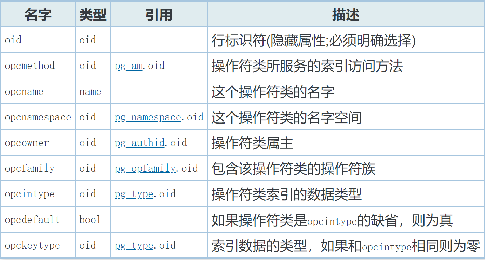
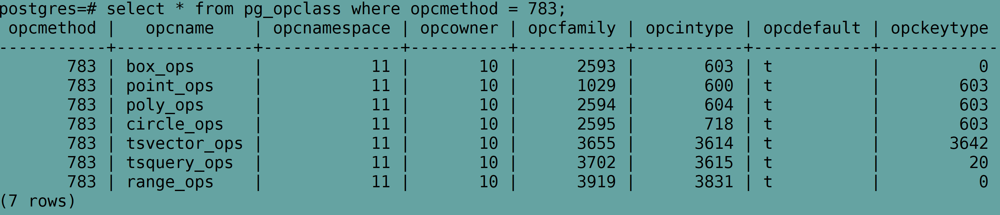
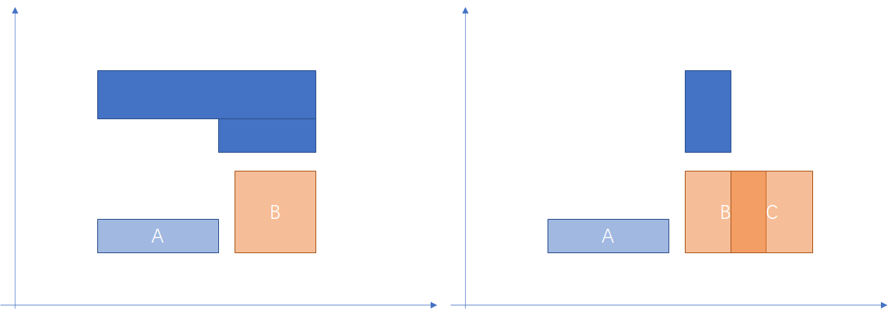
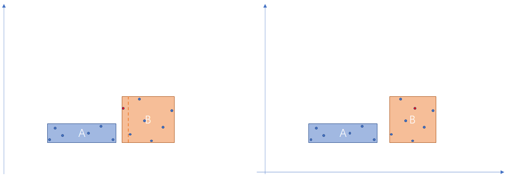

# openGauss gist 索引<a name="ZH-CN_TOPIC_0000001174494862"></a>

## 概述<a name="section1791219408288"></a>

自 B-tree 提出以来，衍生出很多不同类型的搜索树，GiST\(Generalized Search Tree\)广义搜索树是一种新型的索引结构，它可以在一种实现中提供很多不同树形结构的功能。GiST 是一种可扩展的数据结构，允许用户针对不同的数据类型开发索引，支持对支持的数据类型的各种方式的查找。GiST 可以统一许多流程的搜索树（如 R-tree、B±tree、hB-tree、TV-tree、CH-tree 等等），而无需构建多个搜索树。准确地说 Gist 并不是一种具体的索引类型，而是 tree 结构的索引模板，PG 和 OpenGauss 中有基于 Gist 实现的 R-tree 索引。

除了统一这些搜索树外，GiST 还具有以前的树所没有的特性：数据和查询可扩展性。

## 查询扩展性<a name="section276373814296"></a>

以前的搜索树在处理数据方面是可扩展的。例如，PG 支持可扩展的 B±tree 和 R-tree，这意味着你可以在不同的数据类型上建立 B±tree 或 R-tree ，例如 int 类型，float 类型等。但是 B±tree 只支持\(\>=,<=,\>,<,=\)这几个谓词，而 R-tree 只支持\(contains, contained, equals\)。因此，PG 中如果你想用 B±tree 索引支持如查找“所有带炫酷爆炸的电影” 这样的查询可能很难实现。

而 GiST 可以被编程以支持任何查询谓词。运行 GiST 所需要的只是实现 4 个由用户定义的接口，这些接口中定义了树中 key 的行为。当然，要支持一些看起来很花哨的查询，这些接口必须实现得非常漂亮，但对于标准的一些查询（如 B-tree、R-tree 等），实现起来非常简单。

## GiST 的关键<a name="section1511183307"></a>

GiST 本身的结构是一种类似与 B-tree 的平衡树结构，包含 <key， pointer\> 对。但 GisT 中的 key 和 B-tree 中的可能不一样，GiST 中的 key 可以是用户自定义的类型，用于表示通过关联的 pointer 可以访问到的一些属性。例如， B±tree 的 Gist 中 key 是数字范围（所有的指针指向的内容的范围都在 4\~6 之间）；T-tree 的 GiST 中 key 是边界框（指针指向的内容都在 California）；RD-tree 的 key 是集合（指针指向的内容都是 key 中表示的集合的子集）…

要让 Gist 正确工作，需要弄清楚 key 表示的是什么，然后编写 4 个接口来实现对树的插入、删除和搜索。

## 4 种接口<a name="section172683339302"></a>

以下是 GiST 工作需要实现的 4 个接口。

- Consistent: 让树可以正确执行搜索。给定树种 page 上的 key p，以及用户查询 q，Consistent 方法应该返回 NO，如果对于一个给定的数据项 p 和 q 都不为真，否则应该返回 MAYBE。

  举例： 下图 B-tree 内部节点中的 10，表示的含义是其最终指向的数据范围是 \[10, 70\)

  即

  p : \[10, 70\)

  假设 q : select xx from table where key < 80

  那么对于

  item\(key = 90，…\)，Consistent 方法返回 NO

  item\(key = 60，…\)，Consistent 方法返回 MAYBE


- Union: 用于合并树中的信息。给定一组条目 S，该方法返回一个新的键 p，它 对于 S 下的所有数据项都为真。实现 Union 的一个简单的方法是返回一个等价于 S 中 keys 的析取的谓词，即 如果 S \{P1,P2,…Pn\} 返回 P1 or P2 or … Pn
- Penalty: 如果在以 <p, ptr\> 为根的子树中插入新的数据项，则返回一个数字，表示这样做的代价有多大。插入的项，将沿着代价最小的路径插入。

- PickSplit: 和 B-tree 一样，GiST 中的页面有时也需要在插入新数据时进行分裂，PickSplit 决定哪些数据属于新页面，哪些数据留在老页面。

更多关于 Gist 的细节，可以参考原始论文：Generalized Search Trees for Database Systems

## Gist 索引实现<a name="section1967119463329"></a>

- 构建 gist 索引

  ```
  gistbuild
  {
      ...
      // 构建 GISTBuildState 对象
      GISTBuildState buildstate;
      ...
  buildstate.giststate = initGISTstate(index);
      ...
      // 初始化 gist 根节点
       /* initialize the root page */
      buffer = gistNewBuffer(index);
      Assert(BufferGetBlockNumber(buffer) == GIST_ROOT_BLKNO);
      page = BufferGetPage(buffer);

      START_CRIT_SECTION();

      GISTInitBuffer(buffer, F_LEAF);

      MarkBufferDirty(buffer);

      if (RelationNeedsWAL(index)) {
          XLogRecPtr recptr;

          XLogBeginInsert();
          XLogRegisterBuffer(0, buffer, REGBUF_WILL_INIT);

          recptr = XLogInsert(RM_GIST_ID, XLOG_GIST_CREATE_INDEX);
          PageSetLSN(page, recptr);
      } else
          PageSetLSN(page, GetXLogRecPtrForTemp());

      UnlockReleaseBuffer(buffer);

      END_CRIT_SECTION();
      ...
      // 表扫描，构造 index tuple，将 index tuple 插入 gist 索引中
      reltuples = tableam_index_build_scan(heap, index, indexInfo, true, gistBuildCallback, (void *)&buildstate);
      ...
  }
  ```

  重点关注 gist 索引中 index tuple 结构 和 索引构造实现

  这部分的主要实现在 gistBuildCallback 中，对于每个需要被索引的 heap tuple，都需要调用 gistBuildCallback 进行处理。

  ```
  gistBuildCallback
  {
      // 组装 gist index tuple
      itup = gistFormTuple(buildstate->giststate, index, values, isnull, true);
      // 调用 gistdoinsert，将 index tuple 插入 gist 索引
      gistdoinsert(index, itup, buildstate->freespace, buildstate->giststate);
      ...
  }

  gistdoinsert
  {
      // 从树的 root 节点开始以最小 penalty 向下查找，用插入的 key 更新父节点向下的指针；
      for( ; ; ) {
          // 如果在中间 crash 了，树仍然是一致的，更新父节点有时候可能不是很必要
          // 对当前访问的节点加锁时，首先加 ShareLock，如果需要更新节点，先放锁
          // 再将节点的锁换成 ExclusiveLock

          // 如果有未完成的分裂，或者并发执行的分裂任务需要处理

          // 如果不是叶子节点
          if (!GistPageIsLeaf(stack->page)) {
               // 找到插入代价（penalty）最小的子节点
               downlinkoffnum = gistchoose(state.r, stack->page, itup, giststate);
               // 和 B-tree 索引不同的是，B-tree 索引是先找到叶子节点，在叶子节点执行插入，再向上回溯更新父节点
               // 而 gist 索引是在向下查找的过程中先更新父节点，然后再向下查找子节点直到叶子节点；
               // 因此，最后更新完子节点不需要再向上回溯更新，因为父节点全部已经再查找过程中更新完毕
               // 更新非叶子节点
               newtup = gistgetadjusted(state.r, idxtuple, itup, giststate);
               if (newtup) {
                   ...
               }
          }
          else { // 如果是叶子节点
              // 插入新 key
              ...
              (void)gistinserttuple(&state, stack, giststate, itup, InvalidOffsetNumber);
          }
      }
  }
  ```

  ```
  // 查找对插入 index tuple 中包含的 key 代价最小的子节点，返回指向子节点的指针 item 在当前节点的 offsetnumber
  gistchoose
  {
      // index tuple 中包含压缩的属性，先解压缩
      gistDeCompressAtt(giststate, r, it, NULL, (OffsetNumber)0, identry, isnull);
      // 索引可能包含多个列，每个列都有一个代价值
      // 索引定义中先出现的列的代价比后出现的列的代价权重更大
      // best_penalty[j] 是目前我们看到的对列 j 的最小代价，或者是 -1 如果还没有检查到列 j ； 第一个 -1 右侧的代价值都是未定义的
      best_penalty[0] = -1;
      // 当前 page 上所有 tuple
      for(i = FirstOffsetNumber; i <= maxoff; i = OffsetNumberNext(i)) {
          // 获取一个 index tuple
          IndexTuple itup = (IndexTuple)PageGetItem(p, PageGetItemId(p, i));
          // 对 index tuple 的每个属性
          for (j = 0; j < r->rd_att->natts; j++) {
              // 计算每个列的代价
              datum = index_getattr(itup, j + 1, giststate->tupdesc, &IsNull);
              gistdentryinit(giststate, j, &entry, datum, r, p, i, FALSE, IsNull);
              usize = gistpenalty(giststate, j, &entry, IsNull, &identry[j], isnull[j]);
              // 由于前面的列的权重更大，因此如果计算出来的前面的列的代价值比之前最小的代价值更大，则没有必要继续检查后面的列，可以直接检查下一个 tuple 了
              // 如果前面列比之前最小的更小，或者相等则继续检查后面的列
              if (best_penalty[j] < 0 || usize < best_penalty[j]) {
                  result = i;
                  best_penalty[j] = usize;

                  if (j < r->rd_att->natts - 1)
                      best_penalty[j + 1] = -1;
              ...
          }
          // 如果当前 tuple 所有列的代价都是 0 ，则没有必要检查后面的 tuple 了，跳出循环
      }

      // 返回指向代价值最小的 index tuple line-pointer 在 page 中的 offsetnumber
      return result;
  }
  ```

  // 每一个 gist 索引支持的类型，都实现了索引相关的 proc

  ```
  gistpenalty
  {
      float penalty = 0.0;
      // 找到对应的 penalty 函数，计算 penelty 值
      if (giststate->penaltyFn[attno].fn_strict == FALSE || (isNullOrig == FALSE && isNullAdd == FALSE)) {
          FunctionCall3Coll(&giststate->penaltyFn[attno], giststate->supportCollation[attno], PointerGetDatum(orig),
                            PointerGetDatum(add), PointerGetDatum(&penalty));
          /* disallow negative or NaN penalty */
          if (isnan(penalty) || penalty < 0.0) {
              penalty = 0.0;
          }
      } else if (isNullOrig && isNullAdd) {
          penalty = 0.0;
      } else {
          /* try to prevent mixing null and non-null values */
          penalty = get_float4_infinity();
      }

      return penalty;
  }
  ```

  例如：R-tree 中新插入一条数据的逻辑如下

  插入节点时，算法从树的根节点开始递归地向下遍历。检查当前节点的所有外接矩形，并启发式地选择在哪个子节点中插入（例如选择插入后外接矩形扩张最小的那个子节点），然后进入选择的那个子节点继续检查，直到到达叶子节点。满的叶子节点应该在插入之前分裂，所以插入时到达的叶子节点一定有空位来写数据。

  查找对应的处理函数：

  pg_opclass 定义索引的 operator class。 每个 operator class 为一种特定的 数据类型 和 特定索引 访问方法定义字段的语义。 一个操作符类本质上指定一个特定的 operator class 适用于一个特定的可索引的字段数据类型。

  

  通过查询 pg_opclass 可以查到 gist 索引支持的操作符类，以及索引的类型、索引数据的类型等

  

  可以看到 gist 支持的操作符类 包括

  box_ops、point_ops、poly_ops、circle_ops、tsvector_ops、tsquery_ops 及 range_ops

  以 box_ops 为例，查询到关联的 am_proc 有

  gist_box_consistent、gist_box_union、gist_box_compress、gist_box_decompress、gist_box_penalty、gist_box_picksplit、gist_box_same

  其中包含了 consistent、union、penalty 和 picksplit 这四个要实现的接口

  查询 pg_amproc 获取索引关联的 opfamily 的支持的 proc

  ```
  postgres=# select * from pg_amproc where amprocfamily = 2593;
   amprocfamily | amproclefttype | amprocrighttype | amprocnum |       amproc
  --------------+----------------+-----------------+-----------+---------------------
           2593 |            603 |             603 |         1 | gist_box_consistent
           2593 |            603 |             603 |         2 | gist_box_union
           2593 |            603 |             603 |         3 | gist_box_compress
           2593 |            603 |             603 |         4 | gist_box_decompress
           2593 |            603 |             603 |         5 | gist_box_penalty
           2593 |            603 |             603 |         6 | gist_box_picksplit
           2593 |            603 |             603 |         7 | gist_box_same
  (7 rows)
  ```

  查找到 box 类型的 penalty 函数为 gist_box_penalty

  查看实现

  ```
  Datum gist_box_penalty(PG_FUNCTION_ARGS)
  {
      GISTENTRY *origentry = (GISTENTRY *)PG_GETARG_POINTER(0);
      GISTENTRY *newentry = (GISTENTRY *)PG_GETARG_POINTER(1);
      float *result = (float *)PG_GETARG_POINTER(2);
      BOX *origbox = DatumGetBoxP(origentry->key);
      BOX *newbox = DatumGetBoxP(newentry->key);
      BOX unionbox;

      rt_box_union(&unionbox, origbox, newbox);
      *result = (float)(size_box(&unionbox) - size_box(origbox));
      PG_RETURN_POINTER(result);
  }
  ```

  可以看出计算出来的代价值（penalty）是两个 box 做 union 操作后的矩阵面积减去原始矩阵的面积。

  如下图所示，根据代价函数计算规则，假设原来有 A 和 C 两个 box，在两个不同的 page page1 和 page2 中, 则根据代价计算要插入的 box B 插入 page2 的代价更小，所以 box 应该插入 page2 中。

  

  以上是 Gist 索引中插入流程的实现，可以看到 penalty 接口在插入流程用于选择插入的 page 。

  对于 Gist 索引而言，其叶子节点每一条数据包含一个谓词（bool 类型的表达式）和一个指向基表的 TID，索引的 key 必须满足这个谓词。非叶子节点也包含一个谓词和指向子节点的指针，非叶子节点的所有子节点都必须满足这个谓词。

  以在二维空间插入一个 Point 为例，父节点的谓词可能是“所有子节点包含的矩形和点都在某个大的矩形内”，如果新插入的点完全落在父节点所表示的矩形内，则父节点不需要更新；相反，如果不在父节点所在的矩形内，则需要更新父节点所表示的矩形空间；更新完成后，继续向下完成插入动作。如下图所示，左边是插入需要更新父节点的矩形范围的情况（节点 B 表示父节点）；右边是插入不需要更新父节点矩形范围的情况。如果父节点范围更新完后，最终插入失败，不影响 Gist 索引的使用。

  

- Gist 索引查找

  搜索 gist 需要用到 consistent 接口，在此之前需要了解 gist 索引中支持的数据类型都支持哪些操作符（operator）。

  ```
  postgres=# select * from pg_amop where amopfamily = 2593;
   amopfamily | amoplefttype | amoprighttype | amopstrategy | amoppurpose | amopopr | amopmethod | amopsortfa
  mily
  ------------+--------------+---------------+--------------+-------------+---------+------------+-----------
  -----
         2593 |          603 |           603 |            1 | s           |     493 |        783 |
     0
         2593 |          603 |           603 |            2 | s           |     494 |        783 |
     0
         2593 |          603 |           603 |            3 | s           |     500 |        783 |
     0
         2593 |          603 |           603 |            4 | s           |     495 |        783 |
     0
         2593 |          603 |           603 |            5 | s           |     496 |        783 |
     0
         2593 |          603 |           603 |            6 | s           |     499 |        783 |
     0
         2593 |          603 |           603 |            7 | s           |     498 |        783 |
     0
         2593 |          603 |           603 |            8 | s           |     497 |        783 |
     0
         2593 |          603 |           603 |            9 | s           |    2571 |        783 |
     0
         2593 |          603 |           603 |           10 | s           |    2570 |        783 |
     0
         2593 |          603 |           603 |           11 | s           |    2573 |        783 |
     0
         2593 |          603 |           603 |           12 | s           |    2572 |        783 |
     0
         2593 |          603 |           603 |           13 | s           |    2863 |        783 |
     0
         2593 |          603 |           603 |           14 | s           |    2862 |        783 |
     0
  (14 rows)
  ```

  例如 box_ops 共对应 14 个 strategy，查询 pg_operator 获得这 14 个策略对应的 operator 分别为

  ```
  postgres=# select oid,oprname,oprleft,oprright,oprresult from pg_operator where oid >= 493 and oid <= 500 or oid >= 2570 and oid <= 2573 or oid = 2862 or oid = 2863;
   oid  | oprname | oprleft | oprright | oprresult
  ------+---------+---------+----------+-----------
    493 | <<      |     603 |      603 |        16
    494 | &<      |     603 |      603 |        16
    495 | &>      |     603 |      603 |        16
    496 | >>      |     603 |      603 |        16
    497 | <@      |     603 |      603 |        16
    498 | @>      |     603 |      603 |        16
    499 | ~=      |     603 |      603 |        16
    500 | &&      |     603 |      603 |        16
   2570 | <<|     |     603 |      603 |        16
   2571 | &<|     |     603 |      603 |        16
   2572 | |&>     |     603 |      603 |        16
   2573 | |>>     |     603 |      603 |        16
   2862 | @       |     603 |      603 |        16
   2863 | ~       |     603 |      603 |        16
  (14 rows)
  ```

  对于 index entry 下的所有数据项 x，谓词 \(x op query\) 必须是 FALSE，则应该返回 false, 其中 op 是与 pg_amop 表中策略对应的 operator。参考上面 consistent 的定义。

  ```
  gist_box_consistent
  {
      ...
      // 获取 strategy number
      StrategyNumber strategy = (StrategyNumber)PG_GETARG_UINT16(2);
      ...
      if (GIST_LEAF(entry)) {
          // 叶子节点，调用 gist_box_leaf_consistent
          PG_RETURN_BOOL(gist_box_leaf_consistent(DatumGetBoxP(entry->key), query, strategy));
      } else {
          // 非叶子节点，调用 rtree_internal_consistent
          PG_RETURN_BOOL(rtree_internal_consistent(DatumGetBoxP(entry->key), query, strategy));
      }
  }
  ```

  看一个具体的例子，对于 box 类型，查询条件为 x << y \(语义是 x 在 y 的左侧\)，其中 x 是表中的索引列， y 是一个具体的 box，例如 （Point\(5,5\), Point\(7,6\)）

  查看实现代码：

  ```
  // 对于 internal 节点，返回的是 !box_overright，即 x 的左边界不在 y 的左边界的右侧
  // 或者 与 y 的左边界相等，即 x 的 左边界 严格小于 y 的左边界
  // 对于非叶子节点不能进行准确判断，排除一定不符合条件的情况，其他情况都可能出现满足条件的结果
  static bool rtree_internal_consistent(BOX *key, BOX *query, StrategyNumber strategy)
  {
      bool retval = false;

      switch (strategy) {
          case RTLeftStrategyNumber:
              retval = !DatumGetBool(DirectFunctionCall2(box_overright, PointerGetDatum(key), PointerGetDatum(query)));
              break;
      ...

      return retval;
  }

  // 对于 叶子节点，由于叶子节点精确地指向 box，可以进行精确判断
  static bool gist_box_leaf_consistent(BOX *key, BOX *query, StrategyNumber strategy)
  {
      bool retval = false;

      switch (strategy) {
          case RTLeftStrategyNumber:
              retval = DatumGetBool(DirectFunctionCall2(box_left, PointerGetDatum(key), PointerGetDatum(query)));
              break;
      ...
      return retval;
  }
  ```

  如下图所示，查找出现在 box D 左侧的 box，可以看出其中 box A 和 B 符合条件；

  蓝色区域为 A B C 的父节点，父节点判断时只需要排除一定不符合条件的情况（父节点的左边界在 D 的右侧，右侧灰色矩形）；而到叶子节点判断时，需要用 box 的右边界去和 D 的左边界比较。

  

  整体的查询流程和其他 Tree 结构的索引比较类似，这里不细述了。

## 总结<a name="section356416241466"></a>

本文主要介绍了 Gist 索引的原理和其中 插入 、查询的实现，其他相关内容在下一篇介绍。

参考文档：https://postgrespro.com/blog/pgsql/4175817
