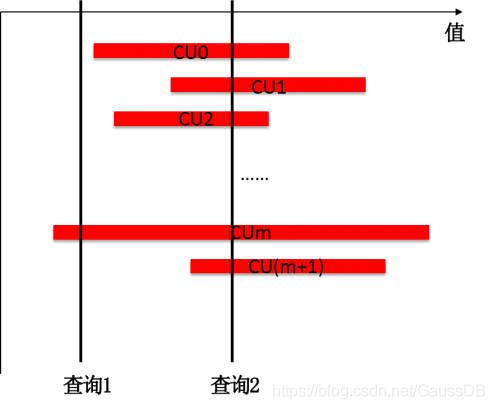
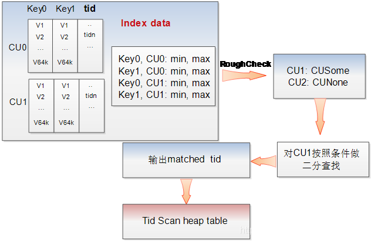

# openGauss 列存表 PSort 索引<a name="ZH-CN_TOPIC_0000001200594231"></a>

## 概述<a name="section18542321413"></a>

PSort\(Partial sort\) Index 是在列存表的列上建的聚簇索引。CUDesc 上有每个 CU 的 min 和 max 值，但如果业务的数据模型较为离散，查询时通过 min 和 max 值去过滤 CU 会出现大量的 CU 误读取，例如每个 CU 的 min 和 max 跨度都比较大时，其查询效率接近全表扫描。例如下图中的场景，查询 2 基本命中所有的 CU， 此时查找近似全表扫描。



PSort 索引可以对部分区间（一般会包含多个 CU 覆盖的行）内的数据按照索引键进行排序，使得 CU 之间的交集尽量减少，提升查询的效率。

## PSort 索引使用<a name="section1973771311510"></a>

在批量插入列存表的过程中，如果发现有 PSort 索引，会先对这批数据进行排序。PSort 索引表的组织形式也是 cstore 表（CUDesc 是 astore 表），表的字段包含了索引键的各个字段，加上对应的行号\(TID\)字段。插入数据的过程中如果发现有 PSort 索引，会将一定数量的数据按照 PSort 索引的索引键进行排序，与 TID 字段共同拼装成向量数组，再插入到 PSort 索引的 cstore 表中。 所以 PSort 索引数据中列数比实际的索引键要多一列，多出的这一列用于存储这条记录在数据 cstore 存储中的位置。

```
// 构建  PSort 索引过程中构造索引数据
inline void ProjectToIndexVector(VectorBatch *scanBatch, VectorBatch *outBatch, IndexInfo *indexInfo)
{
    Assert(scanBatch && outBatch && indexInfo);
    int numAttrs = indexInfo->ii_NumIndexAttrs;
    AttrNumber *attrNumbers = indexInfo->ii_KeyAttrNumbers;
    Assert(outBatch->m_cols == (numAttrs + 1));

    // index column
    for (int i = 0; i < numAttrs; i++) {
        AttrNumber attno = attrNumbers[i];
        Assert(attno > 0 && attno <= scanBatch->m_cols);

        // shallow copy
        outBatch->m_arr[i].copy(&scanBatch->m_arr[attno - 1]);
    }

    // ctid column
    // 最后一列是 tid
    outBatch->m_arr[numAttrs].copy(scanBatch->GetSysVector(-1));

    outBatch->m_rows = scanBatch->m_rows;
}
```

cstore 表执行插入流程，如果有 Psort 索引，会先将数据插入排序队列

```
void CStoreInsert::BatchInsert(_in_ VectorBatch* pBatch, _in_ int options)
{
    Assert(pBatch || IsEnd());

    /* keep memory space from leaking during bulk-insert */
    MemoryContext oldCnxt = MemoryContextSwitchTo(m_tmpMemCnxt);

    // Step 1: relation has partial cluster key
    // We need put data into sorter contatiner, and then do
    // batchinsert data
    if (NeedPartialSort()) {
        Assert(m_tmpBatchRows);

        if (pBatch) {
            Assert(pBatch->m_cols == m_relation->rd_att->natts);
            m_sorter->PutVecBatch(m_relation, pBatch); // 插入局部排序队列
        }

        if (m_sorter->IsFull() || IsEnd()) { // 排序队列满了或者插入数据输入结束
            m_sorter->RunSort(); // 按照索引键排序

            /* reset and fetch next batch of values */
            DoBatchInsert(options);
            m_sorter->Reset(IsEnd());

            /* reset and free all memory blocks */
            m_tmpBatchRows->reset(false);
        }
    }

    // Step 2: relation doesn't have partial cluster key
    // We need cache data until batchrows is full
    else {
        Assert(m_bufferedBatchRows);

        // If batch row is full, we can do batchinsert now
        if (IsEnd()) {
            if (ENABLE_DELTA(m_bufferedBatchRows)) {
                InsertDeltaTable(m_bufferedBatchRows, options);
            } else {
                BatchInsertCommon(m_bufferedBatchRows, options);
            }
            m_bufferedBatchRows->reset(true);
        }

        // we need cache data until batchrows is full
        if (pBatch) {
            Assert(pBatch->m_rows <= BatchMaxSize);
            Assert(pBatch->m_cols && m_relation->rd_att->natts);
            Assert(m_bufferedBatchRows->m_rows_maxnum > 0);
            Assert(m_bufferedBatchRows->m_rows_maxnum % BatchMaxSize == 0);

            int startIdx = 0;
            while (m_bufferedBatchRows->append_one_vector(
                       RelationGetDescr(m_relation), pBatch, &startIdx, m_cstorInsertMem)) {
                BatchInsertCommon(m_bufferedBatchRows, options);
                m_bufferedBatchRows->reset(true);
            }
            Assert(startIdx == pBatch->m_rows);
        }
    }

    // Step 3: We must update index data for this batch data
    // if end of batchInsert
    FlushIndexDataIfNeed();

    MemoryContextReset(m_tmpMemCnxt);
    (void)MemoryContextSwitchTo(oldCnxt);
}
```


图 cstore 表插入流程示意图

插入流程中更新索引数据的代码

```
void CStoreInsert::InsertIdxTableIfNeed(bulkload_rows* batchRowPtr, uint32 cuId)
{
    Assert(batchRowPtr);

    if (relation_has_indexes(m_resultRelInfo)) {
        /* form all tids */
        bulkload_indexbatch_set_tids(m_idxBatchRow, cuId, batchRowPtr->m_rows_curnum);

        for (int indice = 0; indice < m_resultRelInfo->ri_NumIndices; ++indice) {
            /* form index-keys data for index relation */
            for (int key = 0; key < m_idxKeyNum[indice]; ++key) {
                bulkload_indexbatch_copy(m_idxBatchRow, key, batchRowPtr, m_idxKeyAttr[indice][key]);
            }

            /* form tid-keys data for index relation */
            bulkload_indexbatch_copy_tids(m_idxBatchRow, m_idxKeyNum[indice]);

            /* update the actual number of used attributes */
            m_idxBatchRow->m_attr_num = m_idxKeyNum[indice] + 1;

            if (m_idxInsert[indice] != NULL) {
                /* 插入PSort 索引 */
                m_idxInsert[indice]->BatchInsert(m_idxBatchRow, 0);
            } else {
                /* 插入 cbtree/cgin 索引 */
                CStoreInsert::InsertNotPsortIdx(indice);
            }
        }
    }
}
```

索引插入流程和普通 cstore 数据插入相同。

使用 PSort 索引查询时，由于 PSort 索引 CU 内部已经有序，因此可以使用二分查找快速找到对应数据在 psort 索引中的行号，这一行数据的 tid 字段就是这条数据在数据 cstore 中的行号。



图-2 PSort 索引查询示意图
