# openGauss 锁机制实现浅析<a name="ZH-CN_TOPIC_0000001179292093"></a>

数据库锁是一块比较大的内容，为了便于理解，我们准备先讲一些浅显易懂的内容，然后准备一个最简单 SQL 在执行过程中的加锁情况来进行演示，希望大家对 opengauss/PG 数据库内部锁机制有简单地认识。

在没有看 PostgreSQL/opengauss 的源码之前，如果你是一个程序员，你会设计该怎么实现这个锁机制。100 个程序员写实现同样功能的程序，可能会有 100 个版本。就像全世界最流行的几个关系型数据库，关于锁部分的内部实现机制应该都不一样。因此，唯有剖析其内部源码，才能知道其内涵。

因为并发访问所带来的一致性问题,所以引用锁机制来解决。最容易被我们感知的锁对象有行/表等，我们来看一下在 PostgreSQL/opengauss 里面哪些锁对象（LockTag）.

锁对象的种类有如下图这些，例如表，行，page, 事务号锁等等。

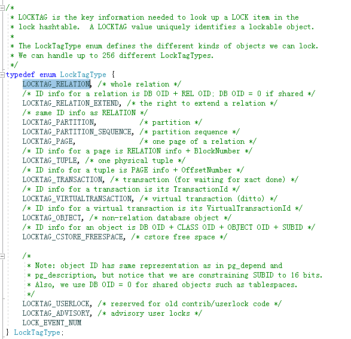

每一种锁对象有不同的属性，但是它们却用同一个结构体来表示， 通过不同的属性来表示不同的锁对象。 锁对象的结构体如下：

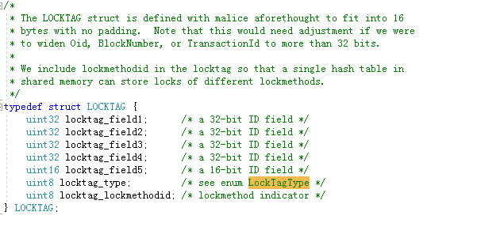

在 LOCKTAG 结构体中，表示锁对象的类型的字段为 locktag_type,其他属性用来具体化这个对象，例如表的锁对象的宏定义如下：

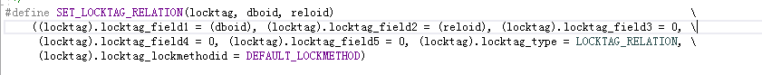

从上面的定义可以看出，对于表的锁对象，实际上只使用 locktag 结构体中 locktag_field1 ,locktag_field2,以及 locktag_type 这三个属性变量，其他属性变量被其他类型的锁对象使用。 其中 locktag_field1 表示库的 oid, locktag_field2 表示表的 oid. 通过这两个属性组合，可以定位到唯一的表。 构建一个行锁，则需要更多信息来定位唯一的行，信息如下：

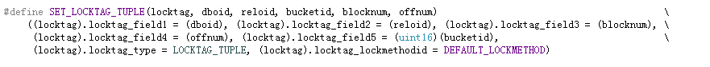

还有更多的其他锁对象的定义，在这里不再扩展。

锁对象（locktag），是被锁保护的对象，现在我们来看看锁的结构，其中必含有锁对象属性的变量，这样才可以关联到锁保护的对象。锁，我们可以简单类比为某个锁对象的管理员， 他需要记录当前有哪些类型的操作已作用在这个对象上，以及哪些类型的操作还在等待中，等待被允许。下图是锁的结构体：

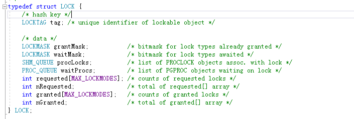

刚才提到了哪些类型的操作，也就是操作的类型，通常理解为锁的类型。总共有如下 8 种类型，分别用数字 1-8 表示。

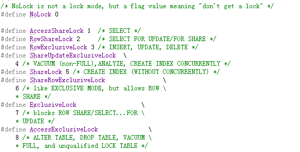

我们在同时操作同一对象的时候（例如操作同一个表），操作跟操作之间是否有冲突，则需要看锁类型之间是否有冲突，这个是由冲突数组决定的。冲突数组的定义跟赋值如下：

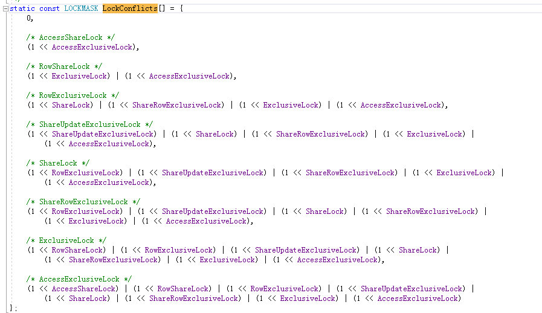

前面讲到，锁的类型用 1-8 数字表示（0 表示无锁），冲突数组中的元组序号跟锁类型的编号一一对应：因为 0 代表无锁，所以冲突数组中的第 0 个元组的值为 0，表示其不跟任何锁冲突；1 代表的是 AccessShareLock 锁,冲突数组中的第 1 个元组的值为 \(1 << AccessExclusiveLock\),AccessExclusiveLock 对应数值为 8， 则表示 AccessShareLock 只跟 AccessExclusiveLock 冲突。 其他类型的锁的冲突关系请见冲突数组各元组对应的值，这里不再一一说明。

上面是关于 opengauss/pg 里面关于锁的内容的最简单的说明，下面我们举一个最简单的 SQL 的例子，来说明一下，这个 SQL 在操作过程中，会对哪些对象加锁，以及加什么类型的锁。

示列表中包含一个主键，一个普通索引。表,主键，普通索引的 oid 等信息如下图所示：

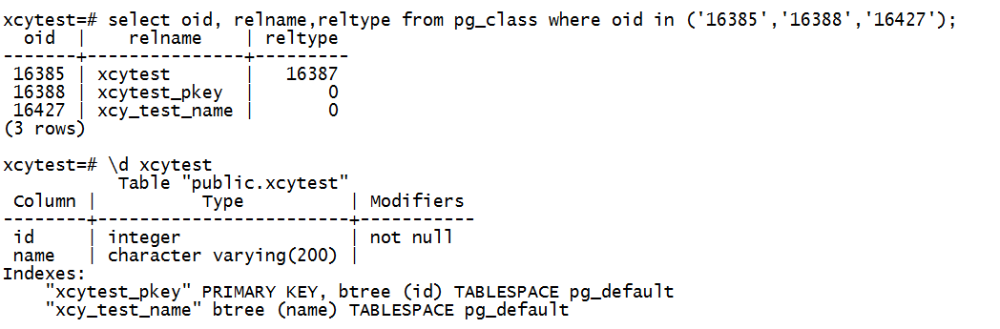

测试 SQL 为：

```
update xcytest  set name ='xcytesttest' where  name='asdfa23'
```

我们通过设置断点在 LockAcquire 函数上，来跟踪加锁过程。另外，由于在执行过程中，会对一些系统表进行查询，以获取表的结构等信息，因此会对很多系统表加类型为 1 的锁（也就是 AccessShareLock 类型），为了简单起见，这些加锁信息不再提及。

加锁的先后顺序如下：

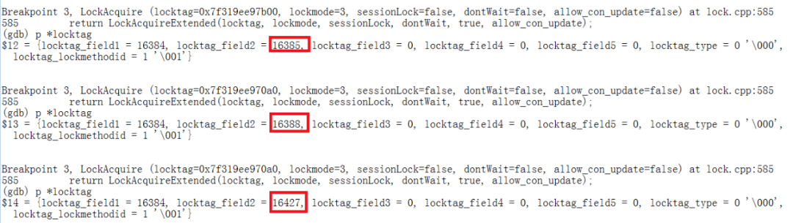

加锁对象的 oid 先后为 16385-\>16388-\>16427, 对应的对象为表 xcytest,主键 xcytest_pkey,普通索引 xcy_test_name\(对应关系请见前面展示的表结构图），锁的类型为 3. 即 RowExclusiveLock， 这个名字容易混淆，名字上虽然带着 row 关键字，但实际上是针对表的加锁类型，跟该类型冲突的类型为：

\(ShareLock\) | \(ShareRowExclusiveLock\) | \(ExclusiveLock\) | \(AccessExclusiveLock\)。需要提一点的是，锁跟锁之间是否冲突，是建立在同一对象上的，表锁跟行锁之间，不存在是否冲突的关系，因为它们不是同一对象。

接下来，还会再次对表，主键，普通索引加锁，加锁顺序跟类型，跟第一次一模一样。 为什么会再次加锁？这是因为 SQL 执行是一个步骤较多的过程，执行期间需要多次（至少两次）访问表，所以会多次加锁。

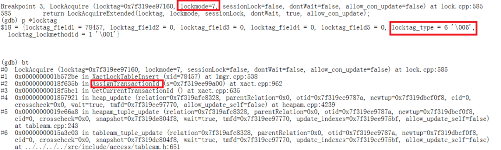

再接下来，捕获到下面的加锁信息

加锁的 lockmode 等于 7, 也就是 ExclusiveLock， 但 locktag_type 为 6, 参考前面提到的锁对象种类的信息，6 对应为 LOCKTAG_TRANSACTION. 并非是行锁，查看调用栈，了解到是在执行 assigntransactionid 函数的时候加的锁，从字面意义来看，是分配事务 id 的时候加的锁。

再然后，SQL 执行完成了，但并没有对被修改的元组（行）进行加锁。 为什么没有对被修改的行加锁？

通过进一个挖代码， 发现如下逻辑：

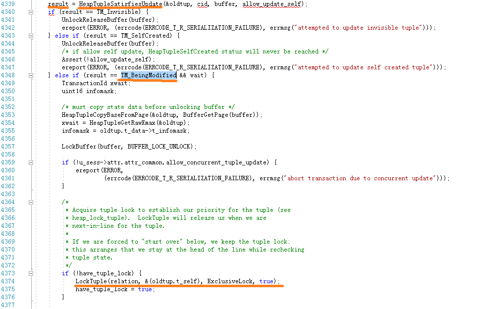

只有发现行正在被修改的时候，才会调用 lockTuple 函数，对行进行加锁，否则不会对被修改的行加锁。为了验证这个结论，我们启动两个会话，对同一行进行修改，先修改的会话先不提交事务，然后第二个会话再次修改该行，就会看到第二个会话的线程会执行 lockTuple 函数。

以上是最简单的 update SQL 的加锁过程，后续将继续演示其他 SQL 的加锁过程。
