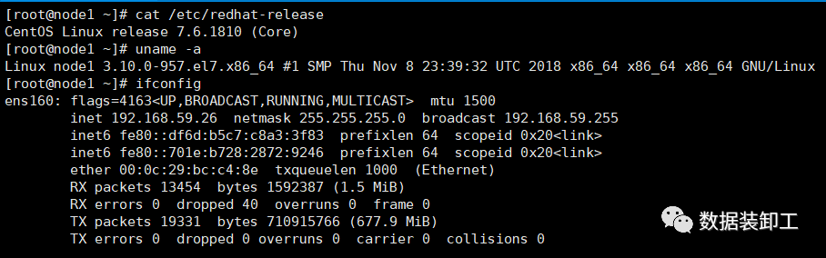
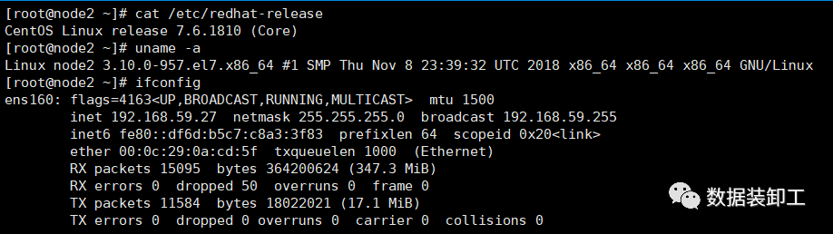
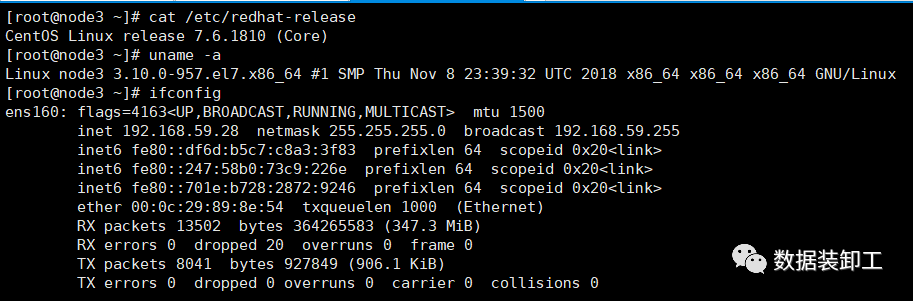
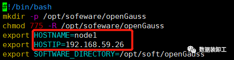
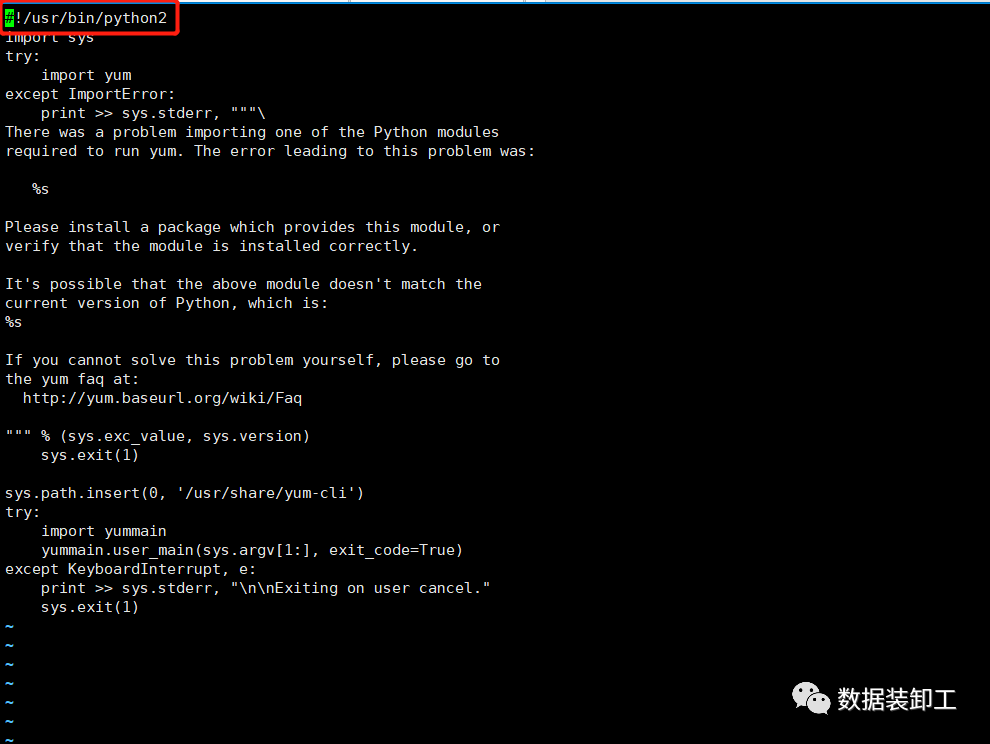

# openGauss 一主一备一级安装<a name="ZH-CN_TOPIC_0000001133332488"></a>

## 1. 准备三台 CentOS7.6<a name="section98502381052"></a>







## 2. 上传操作系统配置修改脚本<a name="section047834716610"></a>

脚本 OSprepare_node1.sh 内容如下：此脚本参考贾军峰老师的《一键部署 openGauss2.0.0》https://www.modb.pro/db/52552

```
#!/bin/bash
mkdir -p opt/sofeware/openGauss
chmod 775 -R opt/sofeware/openGauss
export HOSTNAME=node1
export HOSTIP=192.168.59.26
export SOFTWARE_DIRECTORY=/opt/soft/openGauss
## 1. 设置主机名并配置hosts文件
hostnamectl set-hostname $HOSTNAME
sed -i '/$HOSTIP/d' etc/hosts
echo "$HOSTIP  $HOSTNAME   #Gauss OM IP Hosts Mapping" >> etc/hosts
cat etc/hosts
echo "1.Configure etc/hosts completed."
echo -e "\n"
## 2. 关闭防火墙
systemctl disable firewalld.service
systemctl stop firewalld.service
echo "Firewalld " `systemctl status firewalld|grep Active`
echo "2.Disable firewalld service completed."
echo -e "\n"
## 3. 关闭SELinux
sed -i '/^SELINUX=/d' etc/selinux/config
echo "SELINUX=disabled" >> etc/selinux/config
cat etc/selinux/config|grep "SELINUX=disabled"
echo "3.Disable SELINUX completed."
echo -e "\n"
## 4. 设置操作系统字符集编码
echo "LANG=en_US.UTF-8" >> etc/profile
source etc/profile
echo $LANG
echo "4.Configure encoding completed."
echo -e "\n"
## 5. 设置操作系统时区
rm -fr etc/localtime
ln -s usr/share/zoneinfo/Asia/Shanghai  etc/localtime
date -R
hwclock
echo "5.Configure Timezone completed."
echo -e "\n"
## 6. 关闭SWAP分区 [对于2G内存的设备，建议待安装完毕后再打开SWAP以间接 “扩容内存容量”]
sed -i '/swap/s/^/#/' etc/fstab
swapoff -a
free -m
echo "6.Close swap partition completed."
echo -e "\n"
## 7. 配置SSH服务，关闭Banner，允许root远程登录
sed -i '/Banner/s/^/#/'  etc/ssh/sshd_config
sed -i '/PermitRootLogin/s/^/#/'  etc/ssh/sshd_config
echo -e "\n" >> etc/ssh/sshd_config
echo "Banner none " >> etc/ssh/sshd_config
echo "PermitRootLogin yes" >> etc/ssh/sshd_config
cat etc/ssh/sshd_config |grep -v ^#|grep -E 'PermitRoot|Banner'
echo "7.Configure SSH Service completed."
echo -e "\n"
## 8. 配置YUM源、安装依赖包、修改默认Python3版本
yum install -y bzip2 python3
yum install -y libaio-devel libnsl flex bison ncurses-devel glibc-devel patch readline-devel net-tools tar
mv usr/bin/python  usr/bin/python2_bak
ln -s usr/bin/python3 usr/bin/python
python -V
echo "8.Configure Install Packages and change default Python version completed."
echo -e "\n"
## 9. 配置 sysctl.conf 和 performance.sh
cat >> etc/sysctl.conf << EOF
net.ipv4.tcp_retries1 = 5
net.ipv4.tcp_syn_retries = 5
net.sctp.path_max_retrans = 10
net.sctp.max_init_retransmits = 10
EOF
sysctl -p
## 10. 配置资源限制
echo "* soft stack 3072" >> etc/security/limits.conf
echo "* hard stack 3072" >> etc/security/limits.conf
echo "* soft nofile 1000000" >> etc/security/limits.conf
echo "* hard nofile 1000000" >> etc/security/limits.conf
echo "* soft nproc unlimited" >> etc/security/limits.d/90-nproc.conf
tail -n 4 etc/security/limits.conf
tail -n 1 etc/security/limits.d/90-nproc.conf
echo "10.Configure resource limits completed."
echo -e "\n"
## 11. 关闭透明大页[Only for CentOS]
cat >>/etc/rc.d/rc.local<<EOF
if test -f sys/kernel/mm/transparent_hugepage/enabled; then
   echo never > sys/kernel/mm/transparent_hugepage/enabled
fi
if test -f sys/kernel/mm/transparent_hugepage/defrag; then
   echo never > sys/kernel/mm/transparent_hugepage/defrag
fi
EOF
chmod +x etc/rc.d/rc.local usr/bin/sh etc/rc.d/rc.local
cat sys/kernel/mm/transparent_hugepage/enabled
cat sys/kernel/mm/transparent_hugepage/defrag
echo "11.Close transparent_hugepage completed."
echo -e "\n"
```

## 3. 脚本执行过程：<a name="section2583315810"></a>

```
[root@node1 ~]# ls
anaconda-ks.cfg  OSprepare_node1.sh
[root@node1 ~]# ll
total 8
-rw-------. 1 root root 1683 Jul 19 12:39 anaconda-ks.cfg
-rw-r--r--. 1 root root 3419 Jul 19 14:40 OSprepare_node1.sh
[root@node1 ~]# chmod +x OSprepare_node1.sh
[root@node1 ~]# ll
total 8
-rw-------. 1 root root 1683 Jul 19 12:39 anaconda-ks.cfg
-rwxr-xr-x. 1 root root 3419 Jul 19 14:40 OSprepare_node1.sh
[root@node1 ~]# sh OSprepare_node1.sh
127.0.0.1   localhost localhost.localdomain localhost4 localhost4.localdomain4
::1         localhost localhost.localdomain localhost6 localhost6.localdomain6
192.168.59.26  node1   #Gauss OM IP Hosts Mapping
1.Configure etc/hosts completed.
Removed symlink etc/systemd/system/multi-user.target.wants/firewalld.service.
Removed symlink etc/systemd/system/dbus-org.fedoraproject.FirewallD1.service.
Firewalld  Active: inactive (dead)
2.Disable firewalld service completed.
SELINUX=disabled
3.Disable SELINUX completed.
en_US.UTF-8
4.Configure encoding completed.
Mon, 19 Jul 2021 14:41:00 +0800
Mon 19 Jul 2021 01:48:58 PM CST  -0.241247 seconds
5.Configure Timezone completed.
              total        used        free      shared  buff/cache   available
Mem:           4411         110        4042           8         259        4053
Swap:             0           0           0
6.Close swap partition completed.
Banner none
PermitRootLogin yes
7.Configure SSH Service completed.
Loaded plugins: fastestmirror
Loading mirror speeds from cached hostfile
 * base: mirrors.aliyun.com
 * extras: mirrors.aliyun.com
 * updates: mirrors.aliyun.com
Resolving Dependencies
--> Running transaction check
---> Package bzip2.x86_64 0:1.0.6-13.el7 will be installed
---> Package python3.x86_64 0:3.6.8-18.el7 will be installed
--> Processing Dependency: python3-libs(x86-64) = 3.6.8-18.el7 for package: python3-3.6.8-18.el7.x86_64
--> Processing Dependency: python3-setuptools for package: python3-3.6.8-18.el7.x86_64
--> Processing Dependency: python3-pip for package: python3-3.6.8-18.el7.x86_64
--> Processing Dependency: libpython3.6m.so.1.0()(64bit) for package: python3-3.6.8-18.el7.x86_64
--> Running transaction check
---> Package python3-libs.x86_64 0:3.6.8-18.el7 will be installed
--> Processing Dependency: libtirpc.so.1()(64bit) for package: python3-libs-3.6.8-18.el7.x86_64
---> Package python3-pip.noarch 0:9.0.3-8.el7 will be installed
---> Package python3-setuptools.noarch 0:39.2.0-10.el7 will be installed
--> Running transaction check
---> Package libtirpc.x86_64 0:0.2.4-0.16.el7 will be installed
--> Finished Dependency Resolution
Dependencies Resolved
=========================================================================================================
 Package                                         Arch                                Version                                       Repository                            Size
=========================================================================================================
Installing:
 bzip2                                           x86_64                              1.0.6-13.el7                                  base                                  52 k
 python3                                         x86_64                              3.6.8-18.el7                                  updates                               70 k
Installing for dependencies:
 libtirpc                                        x86_64                              0.2.4-0.16.el7                                base                                  89 k
 python3-libs                                    x86_64                              3.6.8-18.el7                                  updates                              6.9 M
 python3-pip                                     noarch                              9.0.3-8.el7                                   base                                 1.6 M
 python3-setuptools                              noarch                              39.2.0-10.el7                                 base                                 629 k

Transaction Summary
==========================================================================================================
Install  2 Packages (+4 Dependent packages)

Total download size: 9.4 M
Installed size: 48 M
Downloading packages:
(1/6): bzip2-1.0.6-13.el7.x86_64.rpm                                                                                                                   |  52 kB  00:00:00
(2/6): python3-3.6.8-18.el7.x86_64.rpm                                                                                                                 |  70 kB  00:00:00
(3/6): libtirpc-0.2.4-0.16.el7.x86_64.rpm                                                                                                              |  89 kB  00:00:00
(4/6): python3-pip-9.0.3-8.el7.noarch.rpm                                                                                                              | 1.6 MB  00:00:00
(5/6): python3-setuptools-39.2.0-10.el7.noarch.rpm                                                                                                     | 629 kB  00:00:00
(6/6): python3-libs-3.6.8-18.el7.x86_64.rpm                                                                                                            | 6.9 MB  00:00:01
----------------------------------------------------------------------------------------------------------------------------------------------------------------------------
Total                                                                                                                                         7.3 MB/s | 9.4 MB  00:00:01
Running transaction check
Running transaction test
Transaction test succeeded
Running transaction
  Installing : libtirpc-0.2.4-0.16.el7.x86_64                                                                                                                             1/6
  Installing : python3-setuptools-39.2.0-10.el7.noarch                                                                                                                    2/6
  Installing : python3-pip-9.0.3-8.el7.noarch                                                                                                                             3/6
  Installing : python3-3.6.8-18.el7.x86_64                                                                                                                                4/6
  Installing : python3-libs-3.6.8-18.el7.x86_64                                                                                                                           5/6
  Installing : bzip2-1.0.6-13.el7.x86_64                                                                                                                                  6/6
  Verifying  : libtirpc-0.2.4-0.16.el7.x86_64                                                                                                                             1/6
  Verifying  : python3-3.6.8-18.el7.x86_64                                                                                                                                2/6
  Verifying  : python3-libs-3.6.8-18.el7.x86_64                                                                                                                           3/6
  Verifying  : bzip2-1.0.6-13.el7.x86_64                                                                                                                                  4/6
  Verifying  : python3-setuptools-39.2.0-10.el7.noarch                                                                                                                    5/6
  Verifying  : python3-pip-9.0.3-8.el7.noarch                                                                                                                             6/6
Installed:
  bzip2.x86_64 0:1.0.6-13.el7                                                          python3.x86_64 0:3.6.8-18.el7
Dependency Installed:
  libtirpc.x86_64 0:0.2.4-0.16.el7        python3-libs.x86_64 0:3.6.8-18.el7        python3-pip.noarch 0:9.0.3-8.el7        python3-setuptools.noarch 0:39.2.0-10.el7

Complete!
Loaded plugins: fastestmirror
Loading mirror speeds from cached hostfile
 * base: mirrors.aliyun.com
 * extras: mirrors.aliyun.com
 * updates: mirrors.aliyun.com
No package libnsl available.
Package net-tools-2.0-0.25.20131004git.el7.x86_64 already installed and latest version
Package 2:tar-1.26-35.el7.x86_64 already installed and latest version
Resolving Dependencies
--> Running transaction check
---> Package bison.x86_64 0:3.0.4-2.el7 will be installed
--> Processing Dependency: m4 >= 1.4 for package: bison-3.0.4-2.el7.x86_64
---> Package flex.x86_64 0:2.5.37-6.el7 will be installed
---> Package glibc-devel.x86_64 0:2.17-324.el7_9 will be installed
--> Processing Dependency: glibc-headers = 2.17-324.el7_9 for package: glibc-devel-2.17-324.el7_9.x86_64
--> Processing Dependency: glibc = 2.17-324.el7_9 for package: glibc-devel-2.17-324.el7_9.x86_64
--> Processing Dependency: glibc-headers for package: glibc-devel-2.17-324.el7_9.x86_64
---> Package libaio-devel.x86_64 0:0.3.109-13.el7 will be installed
---> Package ncurses-devel.x86_64 0:5.9-14.20130511.el7_4 will be installed
---> Package patch.x86_64 0:2.7.1-12.el7_7 will be installed
---> Package readline-devel.x86_64 0:6.2-11.el7 will be installed
--> Processing Dependency: readline = 6.2-11.el7 for package: readline-devel-6.2-11.el7.x86_64
--> Running transaction check
---> Package glibc.x86_64 0:2.17-260.el7 will be updated
--> Processing Dependency: glibc = 2.17-260.el7 for package: glibc-common-2.17-260.el7.x86_64
---> Package glibc.x86_64 0:2.17-324.el7_9 will be an update
---> Package glibc-headers.x86_64 0:2.17-324.el7_9 will be installed
--> Processing Dependency: kernel-headers >= 2.2.1 for package: glibc-headers-2.17-324.el7_9.x86_64
--> Processing Dependency: kernel-headers for package: glibc-headers-2.17-324.el7_9.x86_64
---> Package m4.x86_64 0:1.4.16-10.el7 will be installed
---> Package readline.x86_64 0:6.2-10.el7 will be updated
---> Package readline.x86_64 0:6.2-11.el7 will be an update
--> Running transaction check
---> Package glibc-common.x86_64 0:2.17-260.el7 will be updated
---> Package glibc-common.x86_64 0:2.17-324.el7_9 will be an update
---> Package kernel-headers.x86_64 0:3.10.0-1160.31.1.el7 will be installed
--> Finished Dependency Resolution

Dependencies Resolved

========================================================================================================== Package                                    Arch                               Version                                              Repository                           Size
=========================================================================================================
Installing:
 bison                                      x86_64                             3.0.4-2.el7                                          base                                674 k
 flex                                       x86_64                             2.5.37-6.el7                                         base                                293 k
 glibc-devel                                x86_64                             2.17-324.el7_9                                       updates                             1.1 M
 libaio-devel                               x86_64                             0.3.109-13.el7                                       base                                 13 k
 ncurses-devel                              x86_64                             5.9-14.20130511.el7_4                                base                                712 k
 patch                                      x86_64                             2.7.1-12.el7_7                                       base                                111 k
 readline-devel                             x86_64                             6.2-11.el7                                           base                                139 k
Installing for dependencies:
 glibc-headers                              x86_64                             2.17-324.el7_9                                       updates                             691 k
 kernel-headers                             x86_64                             3.10.0-1160.31.1.el7                                 updates                             9.0 M
 m4                                         x86_64                             1.4.16-10.el7                                        base                                256 k
Updating for dependencies:
 glibc                                      x86_64                             2.17-324.el7_9                                       updates                             3.6 M
 glibc-common                               x86_64                             2.17-324.el7_9                                       updates                              12 M
 readline                                   x86_64                             6.2-11.el7                                           base                                193 k

Transaction Summary
=========================================================================================================
Install  7 Packages (+3 Dependent packages)
Upgrade             ( 3 Dependent packages)

Total download size: 28 M
Downloading packages:
Delta RPMs disabled because /usr/bin/applydeltarpm not installed.
(1/13): flex-2.5.37-6.el7.x86_64.rpm                                                                                                                   | 293 kB  00:00:00
(2/13): bison-3.0.4-2.el7.x86_64.rpm                                                                                                                   | 674 kB  00:00:00
(3/13): glibc-2.17-324.el7_9.x86_64.rpm                                                                                                                | 3.6 MB  00:00:01
(4/13): glibc-devel-2.17-324.el7_9.x86_64.rpm                                                                                                          | 1.1 MB  00:00:00
(5/13): glibc-headers-2.17-324.el7_9.x86_64.rpm                                                                                                        | 691 kB  00:00:00
(6/13): libaio-devel-0.3.109-13.el7.x86_64.rpm                                                                                                         |  13 kB  00:00:00
(7/13): m4-1.4.16-10.el7.x86_64.rpm                                                                                                                    | 256 kB  00:00:00
(8/13): patch-2.7.1-12.el7_7.x86_64.rpm                                                                                                                | 111 kB  00:00:00
(9/13): glibc-common-2.17-324.el7_9.x86_64.rpm                                                                                                         |  12 MB  00:00:02
(10/13): ncurses-devel-5.9-14.20130511.el7_4.x86_64.rpm                                                                                                | 712 kB  00:00:00
(11/13): readline-6.2-11.el7.x86_64.rpm                                                                                                                | 193 kB  00:00:00
(12/13): readline-devel-6.2-11.el7.x86_64.rpm                                                                                                          | 139 kB  00:00:00
(13/13): kernel-headers-3.10.0-1160.31.1.el7.x86_64.rpm                                                                                                | 9.0 MB  00:00:01
----------------------------------------------------------------------------------------------------------------------------------------------------------------------------
Total                                                                                                                                         9.7 MB/s |  28 MB  00:00:02
Running transaction check
Running transaction test
Transaction test succeeded
Running transaction
  Updating   : glibc-common-2.17-324.el7_9.x86_64                                                                                                                        1/16
  Updating   : glibc-2.17-324.el7_9.x86_64                                                                                                                               2/16
warning: /etc/nsswitch.conf created as /etc/nsswitch.conf.rpmnew
  Installing : m4-1.4.16-10.el7.x86_64                                                                                                                                   3/16
  Updating   : readline-6.2-11.el7.x86_64                                                                                                                                4/16
  Installing : kernel-headers-3.10.0-1160.31.1.el7.x86_64                                                                                                                5/16
  Installing : glibc-headers-2.17-324.el7_9.x86_64                                                                                                                       6/16
  Installing : ncurses-devel-5.9-14.20130511.el7_4.x86_64                                                                                                                7/16
  Installing : readline-devel-6.2-11.el7.x86_64                                                                                                                          8/16
  Installing : glibc-devel-2.17-324.el7_9.x86_64                                                                                                                         9/16
  Installing : bison-3.0.4-2.el7.x86_64                                                                                                                                 10/16
  Installing : flex-2.5.37-6.el7.x86_64                                                                                                                                 11/16
  Installing : patch-2.7.1-12.el7_7.x86_64                                                                                                                              12/16
  Installing : libaio-devel-0.3.109-13.el7.x86_64                                                                                                                       13/16
  Cleanup    : readline-6.2-10.el7.x86_64                                                                                                                               14/16
  Cleanup    : glibc-common-2.17-260.el7.x86_64                                                                                                                         15/16
  Cleanup    : glibc-2.17-260.el7.x86_64                                                                                                                                16/16
  Verifying  : patch-2.7.1-12.el7_7.x86_64                                                                                                                               1/16
  Verifying  : bison-3.0.4-2.el7.x86_64                                                                                                                                  2/16
  Verifying  : readline-6.2-11.el7.x86_64                                                                                                                                3/16
  Verifying  : glibc-2.17-324.el7_9.x86_64                                                                                                                               4/16
  Verifying  : glibc-common-2.17-324.el7_9.x86_64                                                                                                                        5/16
  Verifying  : ncurses-devel-5.9-14.20130511.el7_4.x86_64                                                                                                                6/16
  Verifying  : glibc-headers-2.17-324.el7_9.x86_64                                                                                                                       7/16
  Verifying  : kernel-headers-3.10.0-1160.31.1.el7.x86_64                                                                                                                8/16
  Verifying  : glibc-devel-2.17-324.el7_9.x86_64                                                                                                                         9/16
  Verifying  : flex-2.5.37-6.el7.x86_64                                                                                                                                 10/16
  Verifying  : libaio-devel-0.3.109-13.el7.x86_64                                                                                                                       11/16
  Verifying  : m4-1.4.16-10.el7.x86_64                                                                                                                                  12/16
  Verifying  : readline-devel-6.2-11.el7.x86_64                                                                                                                         13/16
  Verifying  : glibc-common-2.17-260.el7.x86_64                                                                                                                         14/16
  Verifying  : readline-6.2-10.el7.x86_64                                                                                                                               15/16
  Verifying  : glibc-2.17-260.el7.x86_64                                                                                                                                16/16

Installed:
  bison.x86_64 0:3.0.4-2.el7                         flex.x86_64 0:2.5.37-6.el7          glibc-devel.x86_64 0:2.17-324.el7_9       libaio-devel.x86_64 0:0.3.109-13.el7
  ncurses-devel.x86_64 0:5.9-14.20130511.el7_4       patch.x86_64 0:2.7.1-12.el7_7       readline-devel.x86_64 0:6.2-11.el7

Dependency Installed:
  glibc-headers.x86_64 0:2.17-324.el7_9                      kernel-headers.x86_64 0:3.10.0-1160.31.1.el7                      m4.x86_64 0:1.4.16-10.el7

Dependency Updated:
  glibc.x86_64 0:2.17-324.el7_9                          glibc-common.x86_64 0:2.17-324.el7_9                          readline.x86_64 0:6.2-11.el7

Complete!
Python 3.6.8
8.Configure Install Packages and change default Python version completed.

net.ipv4.tcp_retries1 = 5
net.ipv4.tcp_syn_retries = 5
sysctl: cannot stat /proc/sys/net/sctp/path_max_retrans: No such file or directory
sysctl: cannot stat /proc/sys/net/sctp/max_init_retransmits: No such file or directory
* soft stack 3072
* hard stack 3072
* soft nofile 1000000
* hard nofile 1000000
* soft nproc unlimited
10.Configure resource limits completed.
[always] madvise never
[always] madvise never
11.Close transparent_hugepage completed.
[root@node1 ~]#
```

## 4. 在其他节点上修改脚本并执行<a name="section13530163161210"></a>

根据实际情况修改 OSprepare_node1.sh 脚本中 HOSTNAME 和 HOSTIP 两个参数，分别在其他节点操作系统上使用 root 用户执行。



## 5. 在主节点上创建 XML 配置文件<a name="section837018232137"></a>

使用 root 用户创建.

实际使用过程中可以根据自己需求参考官方配置模板，模板地址：https://opengauss.org/zh/docs/2.0.1/docs/installation/%E5%88%9B%E5%BB%BAXML%E9%85%8D%E7%BD%AE%E6%96%87%E4%BB%B6.html

```
[root@node1 ~]# cd /opt/sofeware/openGauss/
[root@node1 openGauss]# ls
openGauss-2.0.1-CentOS-64bit-all.tar.gz
[root@node1 openGauss]# vi cluster_config.xml
<?xml version="1.0" encoding="UTF-8"?>
<ROOT>
    <!-- openGauss整体信息 -->
    <CLUSTER>
        <PARAM name="clusterName" value="Cluster_openGauss" />
        <PARAM name="nodeNames" value="node1,node2,node3" />

        <PARAM name="gaussdbAppPath" value="/opt/huawei/install/app" />
        <PARAM name="gaussdbLogPath" value="/var/log/omm" />
        <PARAM name="tmpMppdbPath" value="/opt/huawei/tmp"/>
        <PARAM name="gaussdbToolPath" value="/opt/huawei/install/om" />
        <PARAM name="corePath" value="/opt/huawei/corefile"/>
        <PARAM name="backIp1s" value="192.168.59.26,192.168.59.27,192.168.59.28"/>

    </CLUSTER>
    <!-- 每台服务器上的节点部署信息 -->
    <DEVICELIST>
        <!-- node1上的节点部署信息 -->
        <DEVICE sn="node1">
            <PARAM name="name" value="node1"/>
            <PARAM name="azName" value="AZ1"/>
            <PARAM name="azPriority" value="1"/>
            <!-- 如果服务器只有一个网卡可用，将backIP1和sshIP1配置成同一个IP -->
            <PARAM name="backIp1" value="192.168.59.26"/>
            <PARAM name="sshIp1" value="192.168.59.26"/>

      <!--dn-->
            <PARAM name="dataNum" value="1"/>
      <PARAM name="dataPortBase" value="15400"/>
      <PARAM name="dataNode1" value="/opt/huawei/install/data/d1,node2,/opt/huawei/install/data/d2,node3,/opt/huawei/install/data/d3"/>
            <PARAM name="dataNode1_syncNum" value="0"/>
        </DEVICE>

        <!-- node2上的节点部署信息，其中“name”的值配置为主机名称 -->
        <DEVICE sn="node2">
            <PARAM name="name" value="node2"/>
            <PARAM name="azName" value="AZ1"/>
            <PARAM name="azPriority" value="1"/>
            <!-- 如果服务器只有一个网卡可用，将backIP1和sshIP1配置成同一个IP -->
            <PARAM name="backIp1" value="192.168.59.27"/>
            <PARAM name="sshIp1" value="192.168.59.27"/>
  </DEVICE>

        <!-- node3上的节点部署信息，其中“name”的值配置为主机名称 -->
        <DEVICE sn="node3">
            <PARAM name="name" value="node3"/>
            <PARAM name="azName" value="AZ1"/>
            <PARAM name="azPriority" value="1"/>
            <!-- 如果服务器只有一个网卡可用，将backIP1和sshIP1配置成同一个IP -->
            <PARAM name="backIp1" value="192.168.59.28"/>
            <PARAM name="sshIp1" value="192.168.59.28"/>
            <PARAM name="cascadeRole" value="on"/>
  </DEVICE>
    </DEVICELIST>
</ROOT>
```

## 6. 上传并解压 openGauss 安装包<a name="section151003178147"></a>

```
[root@node1 openGauss]# ll
total 99152
-rw-r--r--. 1 root root      2556 Jul 19 14:57 cluster_config.xml
-rw-r--r--. 1 root root 101525905 Jul 19 14:52 openGauss-2.0.1-CentOS-64bit-all.tar.gz
[root@node1 openGauss]# tar -zxvf openGauss-2.0.1-CentOS-64bit-all.tar.gz
openGauss-2.0.1-CentOS-64bit-om.tar.gz
openGauss-2.0.1-CentOS-64bit.tar.bz2
openGauss-2.0.1-CentOS-64bit-om.sha256
openGauss-2.0.1-CentOS-64bit.sha256
upgrade_sql.tar.gz
upgrade_sql.sha256
[root@node1 openGauss]# ll
total 199252
-rw-r--r--. 1 root root      2556 Jul 19 14:57 cluster_config.xml
-rw-r--r--. 1 root root 101525905 Jul 19 14:52 openGauss-2.0.1-CentOS-64bit-all.tar.gz
-rw-r--r--. 1 root root        65 Jun  2 19:48 openGauss-2.0.1-CentOS-64bit-om.sha256
-rw-r--r--. 1 root root  12647027 Jun  2 19:48 openGauss-2.0.1-CentOS-64bit-om.tar.gz
-rw-r--r--. 1 root root        65 Jun  2 19:48 openGauss-2.0.1-CentOS-64bit.sha256
-rw-r--r--. 1 root root  89705672 Jun  2 19:48 openGauss-2.0.1-CentOS-64bit.tar.bz2
-rw-------. 1 root root        65 Jun  2 19:47 upgrade_sql.sha256
-rw-------. 1 root root    133700 Jun  2 19:47 upgrade_sql.tar.gz
[root@node1 openGauss]# tar -zxvf openGauss-2.0.1-CentOS-64bit-om.tar.gz
./lib/
./lib/pyasn1/
./lib/pyasn1/codec/
./lib/pyasn1/codec/cer/
./lib/pyasn1/codec/cer/__init__.py
./lib/pyasn1/codec/cer/decoder.py
./lib/pyasn1/codec/cer/encoder.py
./lib/pyasn1/codec/native/
./lib/pyasn1/codec/native/__init__.py
./lib/pyasn1/codec/native/decoder.py
./lib/pyasn1/codec/native/encoder.py
./lib/pyasn1/codec/__init__.py
./lib/pyasn1/codec/der/
./lib/pyasn1/codec/der/__init__.py
./lib/pyasn1/codec/der/decoder.py
./lib/pyasn1/codec/der/encoder.py
./lib/pyasn1/codec/ber/
./lib/pyasn1/codec/ber/eoo.py
./lib/pyasn1/codec/ber/__init__.py
./lib/pyasn1/codec/ber/decoder.py
./lib/pyasn1/codec/ber/encoder.py
......
......
......
......
./simpleInstall/requirements_centos_x86_64
./simpleInstall/one_master_one_slave.sh
./simpleInstall/requirements_openEuler_aarch64
./simpleInstall/template.xml
./simpleInstall/school.sql
./simpleInstall/one_master_one_slave_template.xml
./simpleInstall/install.sh
./simpleInstall/requirements_openEuler_x86_64
./simpleInstall/README.md
./simpleInstall/common.sh
./version.cfg
```

## 7. 执行下面命令准备安装环境<a name="section11446240151416"></a>

交互式过程需要输入三台 root 密码，安装前保证各个节点 root 密码相同。

```
[root@node1 openGauss]# cd script/
[root@node1 script]# ./gs_preinstall -U omm -G dbgrp -X /opt/sofeware/openGauss/cluster_config.xml
Parsing the configuration file.
Successfully parsed the configuration file.
Installing the tools on the local node.
Successfully installed the tools on the local node.
Are you sure you want to create trust for root (yes/no)? yes
Please enter password for root.
Password:
Creating SSH trust for the root permission user.
Checking network information.
All nodes in the network are Normal.
Successfully checked network information.
Creating SSH trust.
Creating the local key file.
Successfully created the local key files.
Appending local ID to authorized_keys.
Successfully appended local ID to authorized_keys.
Updating the known_hosts file.
Successfully updated the known_hosts file.
Appending authorized_key on the remote node.
Successfully appended authorized_key on all remote node.
Checking common authentication file content.
Successfully checked common authentication content.
Distributing SSH trust file to all node.
Successfully distributed SSH trust file to all node.
Verifying SSH trust on all hosts.
Successfully verified SSH trust on all hosts.
Successfully created SSH trust.
Successfully created SSH trust for the root permission user.
Setting pssh path
Successfully set core path.
Distributing package.
Begin to distribute package to tool path.
Successfully distribute package to tool path.
Begin to distribute package to package path.
Successfully distribute package to package path.
Successfully distributed package.
Are you sure you want to create the user[omm] and create trust for it (yes/no)? yes
Please enter password for cluster user.
Password:
Please enter password for cluster user again.
Password:
Successfully created [omm] user on all nodes.
Preparing SSH service.
Successfully prepared SSH service.
Installing the tools in the cluster.
Successfully installed the tools in the cluster.
Checking hostname mapping.
Successfully checked hostname mapping.
Creating SSH trust for [omm] user.
Checking network information.
All nodes in the network are Normal.
Successfully checked network information.
Creating SSH trust.
Creating the local key file.
Successfully created the local key files.
Appending local ID to authorized_keys.
Successfully appended local ID to authorized_keys.
Updating the known_hosts file.
Successfully updated the known_hosts file.
Appending authorized_key on the remote node.
Successfully appended authorized_key on all remote node.
Checking common authentication file content.
Successfully checked common authentication content.
Distributing SSH trust file to all node.
Successfully distributed SSH trust file to all node.
Verifying SSH trust on all hosts.
Successfully verified SSH trust on all hosts.
Successfully created SSH trust.
Successfully created SSH trust for [omm] user.
Checking OS software.
Successfully check os software.
Checking OS version.
Successfully checked OS version.
Creating cluster's path.
Successfully created cluster's path.
Setting SCTP service.
Successfully set SCTP service.
Set and check OS parameter.
Setting OS parameters.
Successfully set OS parameters.
Warning: Installation environment contains some warning messages.
Please get more details by "/opt/sofeware/openGauss/script/gs_checkos -i A -h node1,node2,node3 --detail".
Set and check OS parameter completed.
Preparing CRON service.
Successfully prepared CRON service.
Setting user environmental variables.
Successfully set user environmental variables.
Setting the dynamic link library.
Successfully set the dynamic link library.
Setting Core file
Successfully set core path.
Setting pssh path
Successfully set pssh path.
Set ARM Optimization.
No need to set ARM Optimization.
Fixing server package owner.
Setting finish flag.
Successfully set finish flag.
Preinstallation succeeded.
```

## 8. 执行安装命令<a name="section592021416157"></a>

安装命令需要在 omm 用户下执行。

```
[root@node1 script]# su - omm
Last login: Mon Jul 19 15:05:04 CST 2021
```

```
[omm@node1 ~]$ gs_install -X  /opt/sofeware/openGauss/cluster_config.xml --gsinit-parameter="--encoding=UTF8"  --dn-guc="max_process_memory=2GB" --dn-guc="shared_buffers=128MB" --dn-guc="cstore_buffers=16MB"
Parsing the configuration file.
Check preinstall on every node.
Successfully checked preinstall on every node.
Creating the backup directory.
Successfully created the backup directory.
begin deploy..
Installing the cluster.
begin prepare Install Cluster..
Checking the installation environment on all nodes.
begin install Cluster..
Installing applications on all nodes.
Successfully installed APP.
begin init Instance..
encrypt cipher and rand files for database.
Please enter password for database:
Please repeat for database:
begin to create CA cert files
The sslcert will be generated in /opt/huawei/install/app/share/sslcert/om
Cluster installation is completed.
Configuring.
Deleting instances from all nodes.
Successfully deleted instances from all nodes.
Checking node configuration on all nodes.
Initializing instances on all nodes.
Updating instance configuration on all nodes.
Check consistence of memCheck and coresCheck on database nodes.
Successful check consistence of memCheck and coresCheck on all nodes.
Configuring pg_hba on all nodes.
Configuration is completed.
Successfully started cluster.
Successfully installed application.
end deploy..
```

## 9. 查看数据库状态建立测试库<a name="section34341256171513"></a>

```
[omm@node1 ~]$ gs_om -t status
-----------------------------------------------------------------------

cluster_name    : Cluster_openGauss
cluster_state   : Normal
redistributing  : No

-----------------------------------------------------------------------
[omm@node1 ~]$ gs_om -t status --detail
[   Cluster State   ]

cluster_state   : Normal
redistributing  : No
current_az      : AZ_ALL

[  Datanode State   ]

node     node_ip         instance                            state            | node     node_ip         instance                            state            | node     node_ip         instance                            state
---------------------------------------------------------------------------------------------------------------------------------------------------------------------------------------------------------------------------------------------------
1  node1 192.168.59.26   6001 /opt/huawei/install/data/d1 P Primary Normal | 2  node2 192.168.59.27   6002 /opt/huawei/install/data/d2 S Standby Normal | 3  node3 192.168.59.28   6003 /opt/huawei/install/data/d3 C Cascade Normal
[omm@node1 ~]$ gsql -d postgres -p 15400 -r
gsql ((openGauss 2.0.1 build d97c0e8a) compiled at 2021-06-02 19:37:17 commit 0 last mr  )
Non-SSL connection (SSL connection is recommended when requiring high-security)
Type "help" for help.

postgres=# \l
                         List of databases
   Name    | Owner | Encoding | Collate | Ctype | Access privileges
-----------+-------+----------+---------+-------+-------------------
 postgres  | omm   | UTF8     | C       | C     |
 template0 | omm   | UTF8     | C       | C     | =c/omm           +
           |       |          |         |       | omm=CTc/omm
 template1 | omm   | UTF8     | C       | C     | =c/omm           +
           |       |          |         |       | omm=CTc/omm
(3 rows)
                               ^
postgres=# create database mydb with encoding 'GBK' template = template0;
CREATE DATABASE
postgres=# \l
                         List of databases
   Name    | Owner | Encoding | Collate | Ctype | Access privileges
-----------+-------+----------+---------+-------+-------------------
 mydb      | omm   | GBK      | C       | C     |
 postgres  | omm   | UTF8     | C       | C     |
 template0 | omm   | UTF8     | C       | C     | =c/omm           +
           |       |          |         |       | omm=CTc/omm
 template1 | omm   | UTF8     | C       | C     | =c/omm           +
           |       |          |         |       | omm=CTc/omm
(4 rows)

postgres=# \q
[omm@node1 ~]$
```

以上为一主一备一级安装部署过程。

## 遇到的报错及解决方法<a name="section2100165261619"></a>

在执行完 OSprepare_node1.sh 脚本后，会把系统 python 命令替换为 python3 版本，所以再次使用 yum 会报如下错误：

所以需要修改/usr/bin/yum、/usr/libexec/urlgrabber-ext-down 两个文件的引用头文件由原来的 python 改为 python2。



```
[root@node1 ~]# yum install mlocate
  File "/usr/bin/yum", line 30
    except KeyboardInterrupt, e:
                            ^
SyntaxError: invalid syntax
[root@node1 ~]# vi vi /usr/bin/yum
2 files to edit
[root@node1 ~]# yum install mlocate
Loaded plugins: fastestmirror
Loading mirror speeds from cached hostfile
 * base: mirrors.aliyun.com
 * extras: mirrors.aliyun.com
 * updates: mirrors.aliyun.com
Resolving Dependencies
--> Running transaction check
---> Package mlocate.x86_64 0:0.26-8.el7 will be installed
--> Finished Dependency Resolution

Dependencies Resolved

============================================================================================================================================================================
 Package                               Arch                                     Version                                      Repository                              Size
============================================================================================================================================================================
Installing:
 mlocate                              x86_64                                   0.26-8.el7                                   base                                   113 k

Transaction Summary
============================================================================================================================================================================
Install  1 Package

Total download size: 113 k
Installed size: 379 k
Is this ok [y/d/N]: y
Downloading packages:
  File "/usr/libexec/urlgrabber-ext-down", line 28
    except OSError, e:
                  ^
SyntaxError: invalid syntax

Exiting on user cancel
[root@node1 ~]# vi /usr/libexec/urlgrabber-ext-down
[root@node1 ~]# yum install mlocate
Loaded plugins: fastestmirror
Loading mirror speeds from cached hostfile
 * base: mirrors.aliyun.com
 * extras: mirrors.aliyun.com
 * updates: mirrors.aliyun.com
Resolving Dependencies
--> Running transaction check
---> Package mlocate.x86_64 0:0.26-8.el7 will be installed
--> Finished Dependency Resolution

Dependencies Resolved
============================================================================================================================================================================
 Package                                 Arch                                     Version                                      Repository                              Size
============================================================================================================================================================================
Installing:
 mlocate                                x86_64                                   0.26-8.el7                                   base                                   113 k

Transaction Summary
============================================================================================================================================================================
Install  1 Package

Total download size: 113 k
Installed size: 379 k
Is this ok [y/d/N]: y
Downloading packages:
mlocate-0.26-8.el7.x86_64.rpm                                                                                                                          | 113 kB  00:00:00
Running transaction check
Running transaction test
Transaction test succeeded
Running transaction
  Installing : mlocate-0.26-8.el7.x86_64                                                                                                                                  1/1
  Verifying  : mlocate-0.26-8.el7.x86_64                                                                                                                                  1/1
Installed:
  mlocate.x86_64 0:0.26-8.el7
Complete!
```
