# openGauss 安装与 JDBC 连接（企业版）<a name="ZH-CN_TOPIC_0000001187407244"></a>

## 一、 openGauss 安装（企业版）<a name="section1471711422815"></a>

**1. 获取安装包**

- **1.1. 从 openGauss 开源社区下载对应平台的安装包。**

  通过[https://opengauss.org/zh/download.html](https://opengauss.org/zh/download.html) 登录 openGauss 开源社区，选择 2.0.0 版本对应平台企业版安装包（openGauss-2.0.0-CentOS-64bit-all.tar.gz）。 单击“下载”。

- **1.2. 检查安装包。**

  解压安装包，检查安装目录及文件是否齐全。在安装包所在目录执行以下命令：

  ```
  tar -zxvf openGauss-2.0.0-CentOS-64bit-all.tar.gz ls -1b
  ```

  执行 ls 命令，显示类似如下信息：

  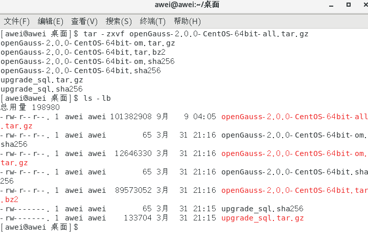

  ----结束

**2. 修改操作系统配置**

- **2.1. 修改文件**

  如果安装的不是 Centos7.6，则要修改/etc/rehat-release 文件，将 CentOS Linux release 7.9.2003 \(Core\)修改为 CentOS Linux release 7.6 \(Core\)

  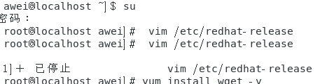

- **2.2. 关闭操作系统防火墙**

  **步骤 1 **修改/etc/selinux/config 文件中的“SELINUX”值为“disabled”。 使用 VIM 打开 config 文件。 vim /etc/selinux/config 修改“SELINUX”的值“disabled”，执行:wq 保存并退出修改。 SELINUX=disabled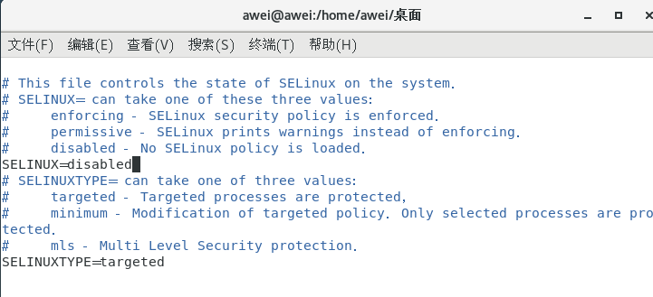

  **步骤 2** 重新启动操作系统。

  ```
  reboot
  ```

  **步骤 3** 检查防火墙是否关闭。

  ```
  systemctl status firewalld
  ```

  若防火墙状态显示为 active \(running\)，则表示防火墙未关闭，请执行步骤 4； 若防火墙状态显示为 inactive \(dead\)，则无需再关闭防火墙。

  **步骤 4 **关闭防火墙。

  systemctl disable firewalld.service systemctl stop firewalld.service

  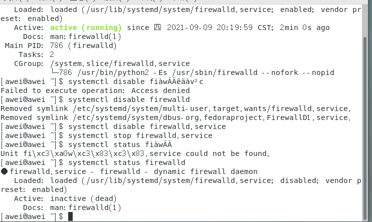

  **步骤 5** 在其他主机上重复步骤 1 到步骤 4。

  ----结束

- **2.3. 设置字符集参数**

  将各数据库节点的字符集设置为相同的字符集，可以在/etc/profile 文件中添加"export LANG=XXX"（XXX 为 Unicode 编码）。 vim /etc/profile

- **2.4. 设置时区和时间**

  在各数据库节点上，确保时区和时间一致。

  **步骤 1** 执行如下命令检查各数据库节点时间和时区是否一致。如果不一致，请执行步骤 2\~步骤 3。

  date

  **步骤 2** 使用如下命令将各数据库节点/usr/share/zoneinfo/目录下的时区文件拷贝为/etc/localtime 文件。

  cp /usr/share/zoneinfo/$地区/$时区/etc/localtime 说明: $地区/$时区为需要设置时区的信息，例如：Asia/Shanghai。

  **步骤 3** 使用 date -s 命令将各数据库节点的时间设置为统一时间，举例如下。

  ```
  date -s "Sat Sep 27 16:00:07 CST 2020"
  ```

  ----结束

- **2.5. 设置网卡 MTU 值**

  将各数据库节点的网卡 MTU 值设置为相同大小。

  **步骤 1** 执行如下命令查询服务器的网卡名称

  ifconfig 如下图所示：

  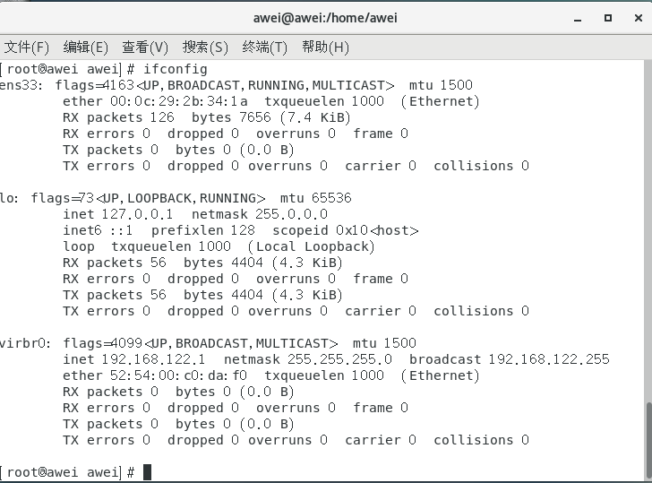

  **步骤 2 **使用如下命令将各数据库节点的网卡 MTU 值设置为相同大小。 对于 X86，MTU 值推荐 1500；对于 ARM，MTU 值推荐 8192。

  ifconfig 网卡名称 mtu mtu 值

  ----结束

**3. 安装 openGauss**

- **3.1. 创建 XML 配置文件**

  安装 openGauss 前需要创建 cluster_config.xml 文件。cluster_config.xml 文件包含部署 openGauss 的服务器信息、安装路径、IP 地址以及端口号等。用于告知 openGauss 如何 部署。用户需根据不同场景配置对应的 XML 文件。

  配置数据库节点名称时，请通过 hostname 命令获取数据库节点的主机名称。

  

  单节点配置文件如下：

  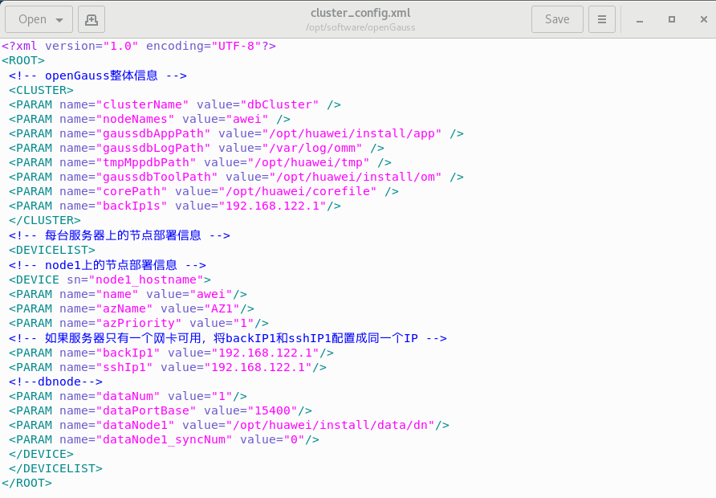

- **3.2.初始化安装环境**
- **3.2.1. 准备安装用户及环境**

  **步骤 1** 以 root 用户登录待安装 openGauss 的任意主机，并按规划创建存放安装包的目录。

  

  **步骤 2** 将安装包“openGauss-2.0.0-CentOS-64bit-all.tar.gz”和配置文件“cluster_config.xml”都上传至上一步所创建的目录中。

  **步骤 3** 在安装包所在的目录下，解压安装包 openGauss-2.0.0-CentOS-64bit-all.tar.gz。安装包解压后，会有 OM 安装包和 Server 安装包。继续解压 OM 安装包，会在/opt/software/openGauss 路径下自动生成 script 子目录，并且在 script 目录下生成 gs_preinstall 等各种 OM 工具脚本。

  **步骤 4** 进入到工具脚本存放目录下。 cd /opt/software/openGauss/script

  **步骤 5** 为确保成功安装，执行命令检查 hostname 与 /etc/hostname 是否一致。 hostname cat /etc/hostname

  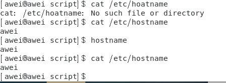

  **步骤 6** 使用 gs_preinstall 需要 python3.6 的环境，一般自带的是 python2.7。

  安装 CentOS 开发工具 【用于允许您从源代码构建和编译软件】 sudo yum -y “groupinstall development”

  下载 epel

  sudo yum install epel-release

  安装 python3

  sudo yum install python36

  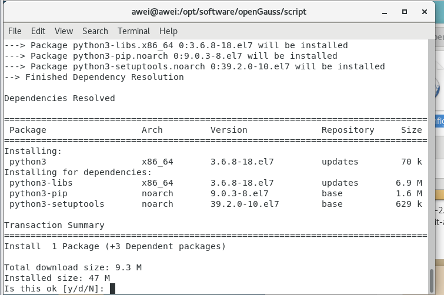

  更改默认 python

  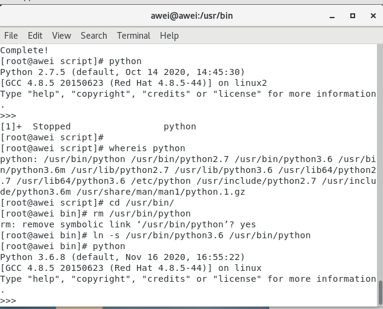

  **步骤 7** 使用 gs_preinstall 准备好安装环境

  采用交互模式执行前置，并在执行过程中自动创建 root 用户互信和 openGauss 用 户互信： ./gs_preinstall -U omm -G dbgrp -X /opt/software/openGauss/cluster_config.xml

  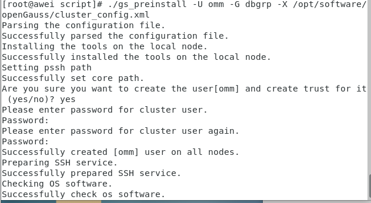

  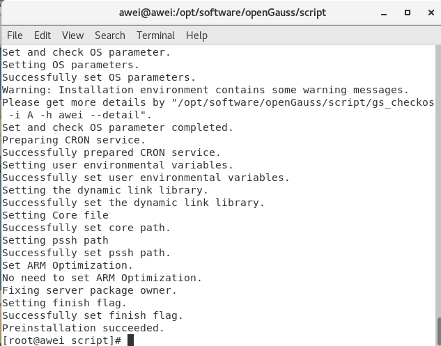

- **3.2.2. 建立互信（使用脚本建立互信）**

  **步骤 1** 创建一个执行互信脚本所需要的输入文本，并在此文件中添加 openGauss 中所有主机 IP。 vim hostfile

  **步骤 2** 以需要创建互信的用户执行下面脚本建立互信。 ./gs_sshexkey -f /opt/software/hostfile -W wangjingwei1

  运行成功截图如下

  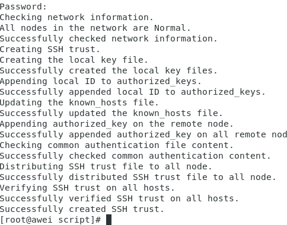

- **3.3.执行安装**

  **步骤 1 **登录到 openGauss 的主机，并切换到 omm 用户。

  ```
  su - omm
  ```

  **步骤 2** 使用 gs_install 安装 openGauss。

  gs_install -X /opt/software/openGauss/cluster_config.xml 在执行过程中，用户需根据提示输入数据库用户的密码，密码应具有一定的复杂度.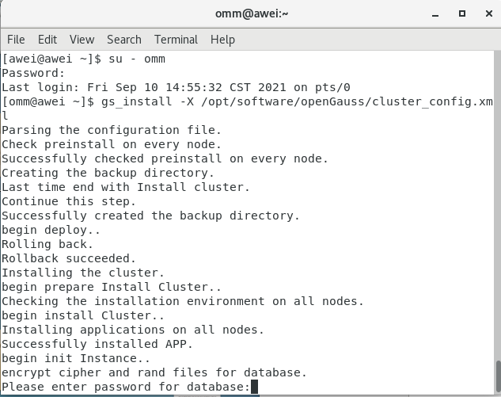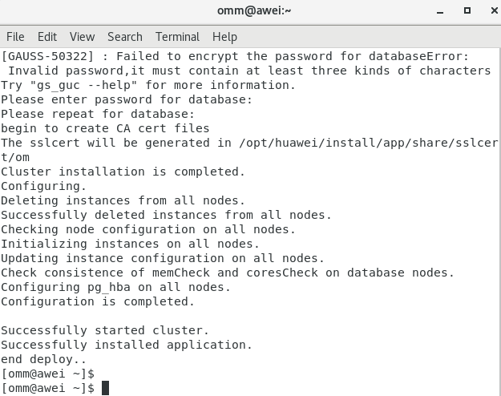

  **步骤 3** 安装执行成功之后，需要手动删除主机 root 用户的互信，即删除 openGauss 数据库各 节点上的互信文件。 rm -rf \~/.ssh

  安装完成

- 4. 安装验证

  **步骤 1** 以 omm 用户身份登录服务器。

  **步骤 2** 执行如下命令检查数据库状态是否正常，“cluster_state ”显示“Normal”表示数据 库可正常使用。 gs_om -t status

  **步骤 3** 数据库安装完成后，默认生成名称为 postgres 的数据库。第一次连接数据库时可以连接到此数据库。其中 postgres 为需要连接的数据库名称，26000 为数据库主节点的端口号，即 XML 配置.文件中的 dataPortBase 的值。请根据实际情况替换。

  gsql -d postgres -p 26000 连接成功后，系统显示类似如下信息表示数据库连接成功。 gsql \(\(openGauss x.x.x build 290d125f\) compiled at 2021-03-08 02:59:43 commit 2143 last mr 131 Non-SSL connection \(SSL connection is recommended when requiring high-security\) Type "help" for help.

  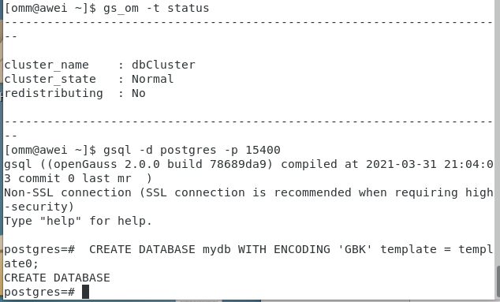

  **步骤 4** 建立表，并插入内容进行查询

  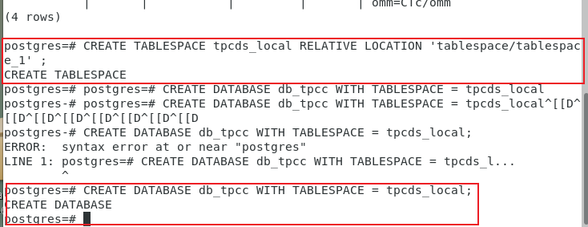

  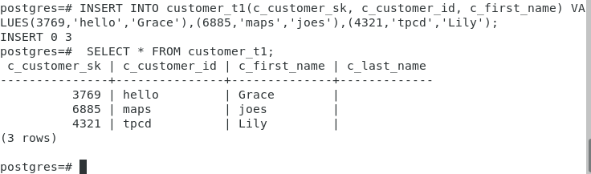

## 二、使用 jdbc 连接数据库<a name="section1480597163516"></a>

- **1. 确认连接信息**

  **步骤 1** 以操作系统用户 omm 登录数据库主节点。

  **步骤 2** 使用“gs_om -t status --detail”命令查询 openGauss 各实例情况。

  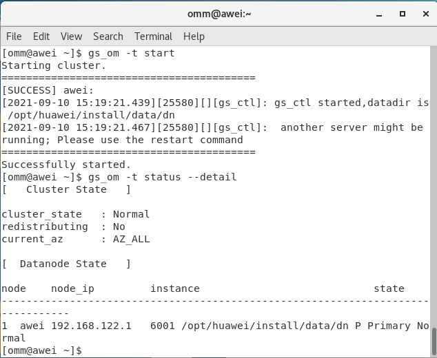

- **2. 配置服务端远程连接**

  **步骤 1** 以操作系统用户 omm 登录数据库主节点。

  **步骤 2** 配置客户端认证方式

  需先本地连接数据库，并在数据库中使用如下语句建立“jack”用户：

  ```
  postgres=# CREATE USER jack PASSWORD 'Test@123';
  ```

  允许客户端以“jack”用户连接到本机，此处远程连接禁止使用

  “omm”用户（即数据库初始化用户）。下面示例中配置允许 IP 地址为 10.27.1.209 的客户端访问本机。

  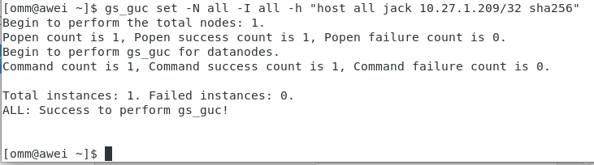

  **步骤 3** 配置 listen_addresses，listen_addresses 即远程客户端连接使用的数据库主节点 ip 或者主机名。

  使用如下命令查看数据库主节点目前的 listen_addresses 配置。

  ```
  gs_guc check -I all -c "listen_addresses"
  ```

  使用如下命令把要添加的 IP 追加到 listen_addresses 后面，多个配置项之间用英文逗号分隔。例如，追加 IP 地址 10.11.12.13。

  ```
  gs_guc set -I all -c"listen_addresses='localhost,192.168.0.100,10.11.12.13'"
  ```

  **步骤 4** 执行如下命令重启 openGauss。

  ```
  gs_om -t stop && gs_om -t start
  ```

  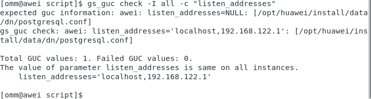

  **3. JDBC 包、驱动类和环境类**

  在 openGauss 官网下载 JDBC 包，openGauss-2.0.0-JDBC.tar.gz，解压获得驱动 jar 包 postgresql.jar。

  在创建数据库连接之前，需要加载数据库驱动类“org.postgresql.Driver”。

  终端输入“java -version”，查看 JDK 版本，确认为 JDK1.8 版本。

  

  **4. 驱动加载**

  在代码中创建连接之前任意位置隐含装载：Class.forName\("org.postgresql.Driver"\);

  在 windows 下运行代码进行连接时，使用 eclipse 装载驱动即可。

  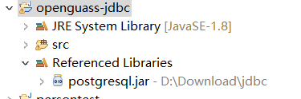

  在 centos 系统下连接数据库时，要将 postgresql.jar 驱动包设置到 java 的 classpath 环境变量中。

  将 postgresql.jar 类库文件拷贝到...\\Java\\jdk1.7.0\\jre\\lib\\ext 目录下。（这个路径根据 JDK 的版本和安装路径确定，下同）

  将 postgresql.jar 类库文件拷贝到...\\Java\\jre7\\lib\\ext 目录下（ 最好是，只要是 jre 文件夹，都复制一个 postgresql.jar 到 jre7\\lib\\ext 里去）

  **5. 连接数据库**

  JDBC 提供了三个方法，用于创建数据库连接。

  DriverManager.getConnection\(String url\)

  DriverManager.getConnection\(String url, Properties info\);

  DriverManager.getConnection\(String url, String user, String password\);

  连接数据库代码如下：

  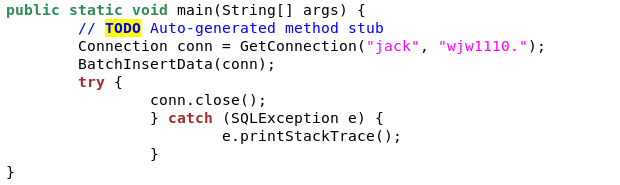

  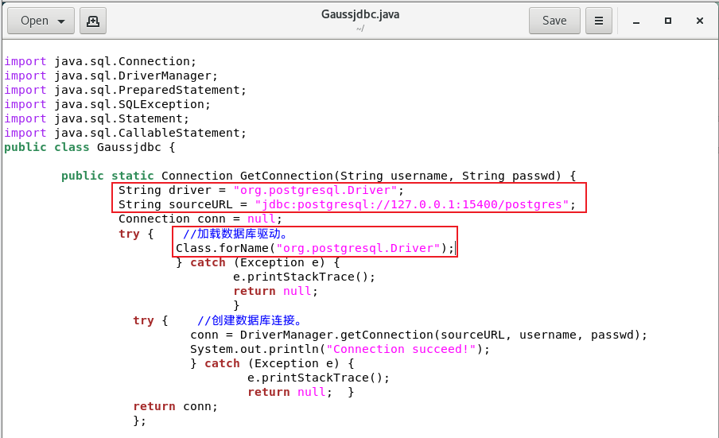

  运行截图

  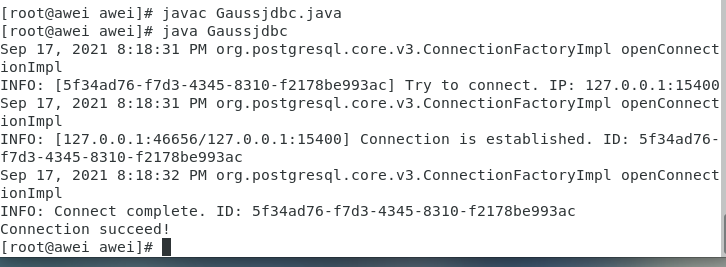

  连接数据库并在表中插入数据

  连接时会以某一用户访问某一表，要先在数据库中对该用户进行授权。

  

  代码如下：

  

  运行截图：

  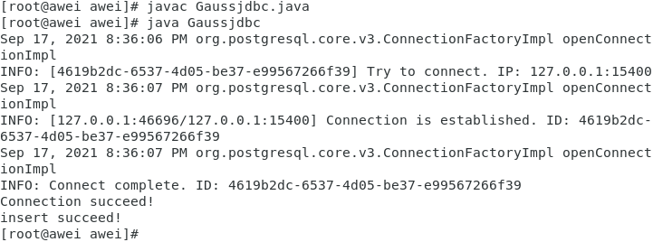

  查询此表进行验证：

  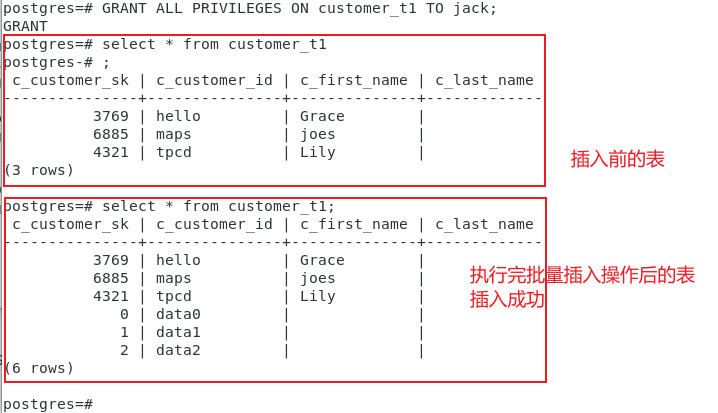

## 三、 遇到的问题<a name="section785613287388"></a>

刚开始安装的极简版，发现有一个命令使用不了，后来改安装企业版就没遇到这个问题。

centos 版本问题：在网上没有找到 centos7.6，只找到 7.9，运行时会报错，要修改/etc/rehat-release 文件，将 CentOS Linux release 7.9.2003 \(Core\)修改为 CentOS Linux release 7.6 \(Core\)。

安装 python3

安装 CentOS 开发工具 【用于允许您从源代码构建和编译软件】 sudo yum -y “groupinstall development”

下载 epel sudo yum install epel-release

安装 python3 sudo yum install python36

更改默认 python


连接问题

连接 windows 主机时，远程连接也配置了，互信也建立了，总是报连接错误问题。后来选择连接虚拟机，连接虚拟机要先配 jdk，直接使用 yum 安装比较方便：

搜索 jdk 安装包

\# yum search java|grep jdk

下载 jdk1.8，下载后默认目录为：/uer/lib/jvm/

\# yum install java-1.8.0-openjdk

验证安装

后面要进行驱动加载，不加载的话使用不了下载的文件。要将 postgresql.jar 驱动包设置到 java 的 classpath 环境变量中。

将 postgresql.jar 类库文件拷贝到...\\Java\\jdk1.7.0\\jre\\lib\\ext 目录下。（这个路径根据 JDK 的版本和安装路径确定，下同）

将 postgresql.jar 类库文件拷贝到...\\Java\\jre7\\lib\\ext 目录下（ 最好是，只要是 jre 文件夹，都复制一个 postgresql.jar 到 jre7\\lib\\
