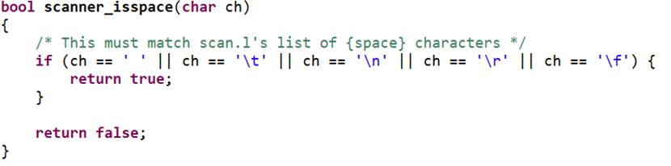
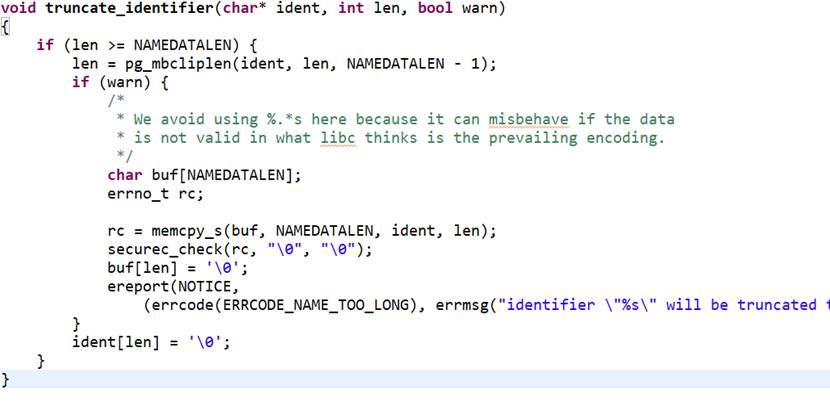
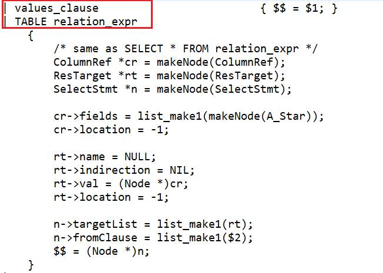
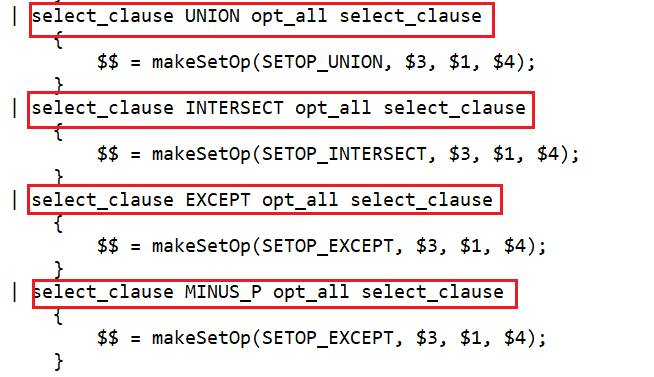
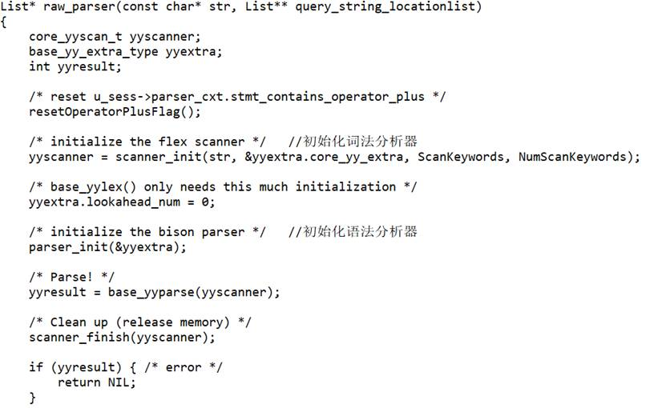
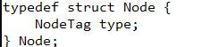
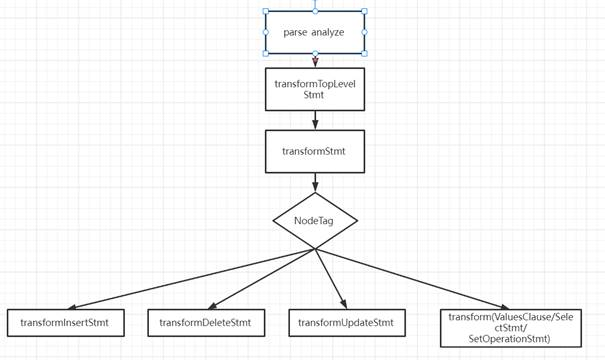
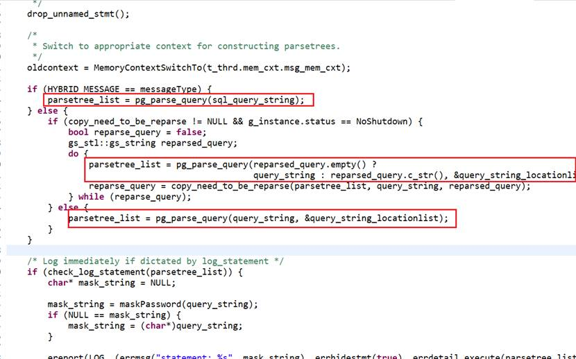

# openGauss 数据库 SQL 模块源码分析

## 一、词法分析：

文件位置：

src/common/backend/parser/scan.l 定义词法结构，采用 Lex 编译后生成 scan.cpp 文件

原理：根据 SQL 语言标准对 SQL 语言中的关键字、标识符、操作符、常量、终结符进行了定义和识别。并且能够进行更精确的检查和操作。词法分析将一个 SQL 划分成多个不同的 token，每个 token 会有自己的词性

代码如下：

- **1. 定义的形式如下：**

  

- **2. 检查的形式如下：**

  

  可以看到 当遇到 identifier 类型的时候，会进行更进一步的检查和操作。首先调用函数确定它是否是从关键字表中查找关键字，如果是则返回关键字的类型。否则调用函数将大写转换成小写。

  用到的函数有：

  1、char\* downcase_truncate_identifier\(const char\* ident, int len, bool warn\)

  将字符都转化成小写，利用大写字母和小写字母之间的差值

  

  2、bool scanner_isspace\(char ch\)

  如果找到的是空格，则返回 true

  

  3、void truncate_identifier\(char\* ident, int len, bool warn\)

  截断标识符

  

## 二 、语法分析

- 文件位置：

  src/common/backend/parser/scan.l 定义语法结构，采用 Yacc 编译后生成 gram.cpp 文件

  原理：根据 SQL 语言的不同定义了一系列表达 Statement 的结构体（这些结构体通常以 Stmt 作为命名后缀），用来保存语法分析结果。

- 结构体如下：

  

  结构体中的每一项都对应一个子结构，程序根据不同的情况对其赋值：

  情况有：

  

  

  这些形式会进一步的递归处理，最终转换为基本的 simple_select 形式。代码如下：simple_select 语法分析结构可以看出，一条简单的查询语句由以下子句组成：去除行重复的 distinctClause、目标属性 targetList、SELECT INTO 子句 intoClause、FROM 子句 fromClause、WHERE 子句 whereClause、GROUP BY 子句 groupClause、HAVING 子句 havingClause、窗口子句 windowClause 和 plan_hint 子句。在成功匹配 simple_select 语法结构后，将会创建一个 Statement 结构体，将各个子句进行相应的赋值。

  simple_select 的其他子句，如 distinctClause、groupClause、havingClause 等，语法分析方式类似。而其他 SQL 命令，如 CREATE、INSERT、UPDATE、DELETE 等，处理方式与 SELECT 命令类似

- 使用的函数：

  

逻辑：创建 SelectStmt 结构体后，向结构体中填充参数。语法分析树

它产生的函数在在文件 src/common/backend/parser/parser.cpp 文件中的 row_parser 中被调用：

最后返回，用于后面的语义分析、查询重写等步骤，该 List 中的每个 ListCell 包含一个语法树。

## 三、语义分析

- 文件位置

主入口文件 src/common/backend/parser/analyze.cpp，入口函数是 parse_analyze

- 原理：语义分析模块在词法分析和语法分析之后执行，用于检查 SQL 命令是否符合语义规定，能否正确执行。负责语义分析的是 parse_analyze 函数，位于 analyze.cpp 下。parse_analyze 会根据词法分析和语法分析得到的语法树，生成一个 ParseState 结构体用于记录语义分析的状态，再调用 transformStmt 函数，根据不同的命令类型进行相应的处理，最后生成查询树。
- ParseState 保存了许多语义分析的中间信息，如原始 SQL 命令、范围表、连接表达式、原始 WINDOW 子句、FOR UPDATE/FOR SHARE 子句等。该结构体在语义分析入口函数 parse_analyze 下被初始化，在 transformStmt 函数下根据不同的 Stmt 存储不同的中间信息，完成语义分析后再被释放。ParseState 结构如下。

在语义分析过程中，语法树 parseTree 使用 Node 节点进行包装。Node 结构只有一个类型为 NodeTag 枚举变量的字段，用于识别不同的处理情况。比如 SelectStmt 对应的 NodeTag 值为 T_SelectStmt。Node 结构如下。

transformStmt 函数会根据 NodeTag 的值，将语法树转化为不同的 Stmt 结构体，调用对应的语义分析函数进行处理。

openGauss 在语义分析阶段处理的 NodeTag 情况有九种

<table><tbody><tr id="zh-cn_topic_0000001232802815_row158mcpsimp"><td class="cellrowborder"  width="43%">
T_InsertStmt

</td>
<td class="cellrowborder"  width="56.99999999999999%">
transformInsertStmt

</td>
</tr>
<tr id="zh-cn_topic_0000001232802815_row163mcpsimp"><td class="cellrowborder"  width="43%">
T_DeleteStmt

</td>
<td class="cellrowborder"  width="56.99999999999999%">
transformDeleteStmt

</td>
</tr>
<tr id="zh-cn_topic_0000001232802815_row168mcpsimp"><td class="cellrowborder"  width="43%">
T_UpdateStmt

</td>
<td class="cellrowborder"  width="56.99999999999999%">
transformUpdateStmt

</td>
</tr>
<tr id="zh-cn_topic_0000001232802815_row173mcpsimp"><td class="cellrowborder"  width="43%">
T_MergeStmt

</td>
<td class="cellrowborder"  width="56.99999999999999%">
transformMergeStmt

</td>
</tr>
<tr id="zh-cn_topic_0000001232802815_row178mcpsimp"><td class="cellrowborder"  width="43%">
T_SelectStmt

</td>
<td class="cellrowborder"  width="56.99999999999999%">
transformSelectStmt

</td>
</tr>
<tr id="zh-cn_topic_0000001232802815_row183mcpsimp"><td class="cellrowborder"  width="43%">
T_DeclareCursorStmt

</td>
<td class="cellrowborder"  width="56.99999999999999%">
transformDeclareCursorStmt

</td>
</tr>
<tr id="zh-cn_topic_0000001232802815_row188mcpsimp"><td class="cellrowborder"  width="43%">
T_ExplainStmt

</td>
<td class="cellrowborder"  width="56.99999999999999%">
transformExplainStmt

</td>
</tr>
<tr id="zh-cn_topic_0000001232802815_row193mcpsimp"><td class="cellrowborder"  width="43%">
T_CreateTableAsStmt

</td>
<td class="cellrowborder"  width="56.99999999999999%">
transformCreateTableAsStmt

</td>
</tr>
<tr id="zh-cn_topic_0000001232802815_row198mcpsimp"><td class="cellrowborder"  width="43%">
T_CreateModelStmt

</td>
<td class="cellrowborder"  width="56.99999999999999%">
transformCreateModelStmt

</td>
</tr>
</tbody>
</table>

transformSelectStmt：

调用关系

处理对应句子的流程。

以处理基本 SELECT 命令的 transformSelectStmt 函数为例，其处理流程如下。

（1） 创建一个新的 Query 节点，设置 commandType 为 CMD_SELECT。

（2） 检查 SelectStmt 是否存在 WITH 子句，存在则调用 transformWithClause 处理。

（3） 调用 transformFromClause 函数处理 FROM 子句。

（4） 调用 transformTargetList 函数处理目标属性。

（5） 若存在操作符“+”则调用 transformOperatorPlus 转为外连接。

（6） 调用 transformWhereClause 函数处理 WHERE 子句和 HAVING 子句。

（7） 调用 transformSortClause 函数处理 ORDER BY 子句。

（8） 调用 transformGroupClause 函数处理 GROUP BY 子句。

（9） 调用 transformDistinctClause 函数或者 transformDistinctOnClause 函数处理 DISTINCT 子句。

（10）调用 transformLimitClause 函数处理 LIMIT 和 OFFSET 子句。

（11）调用 transformWindowDefinitions 函数处理 WINDOWS 子句。

（12）调用 resolveTargetListUnknowns 函数将其他未知类型作为 text 处理。

（13）调用 transformLockingClause 函数处理 FOR UPDATE 子句。

（14）处理其他情况，如 insert 语句、foreign table 等。

（15）返回查询树。

## 四、总体的入口函数：

l 位置：\\src\\gausskernel\\process\\tcop\\postgres.cpp

1、调用 pg_parse_query 函数，参数 用户输入的命令，生成 parsetree_list

2、再调用 pg_analyze_and_rewrite 函数，参数 语法树链表，返回 查询树链表。进行语义分析。

3、pg_analyze_and_rewrite 函数调用 parse_analyze 函数进行语义分析。

调用流程图

