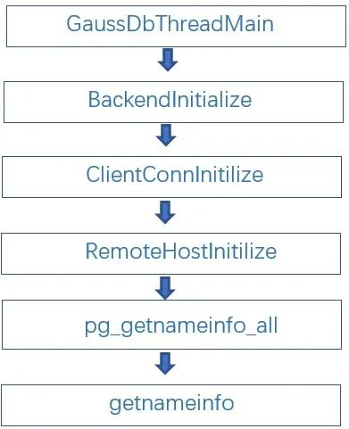
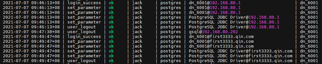
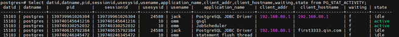
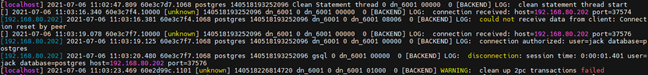
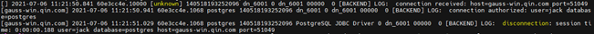
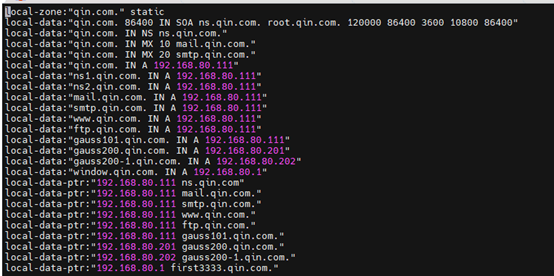
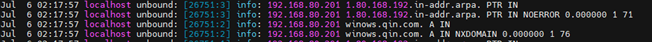

# openGauss 数据库 log_hostname 参数分析<a name="ZH-CN_TOPIC_0000001133332490"></a>

本文主要借助技术文档、源代码、实验三个方面的内容，分析 openGauss 数据库 log_hostname 参数的作用及影响范围。

## 技术文档<a name="section195213819454"></a>

以下是官方文档关于 log_hostname 参数的几处描述：

1.  开发者指南-\>GUC 参数说明-\>错误报告和日志-\>记录日志的内容：

    参数说明：选项关闭状态下，连接消息日志只显示正在连接主机的 IP 地址。打开此选项同时可以记录主机名。由于解析主机名可能需要一定的时间，可能影响数据库的性能。

    该参数属于 SIGHUP 类型参数

    取值范围：布尔型

    默认值：off

2.  工具参考-\>客户端工具-\>gsql-\>常见问题处理-\>连接性能问题

    开启了 log_hostname，但是配置了错误的 DNS 导致的连接性能问题。

    连接上数据库，通过“show log_hostname”语句，检查数据库中是否开启了 log_hostname 参数。

    如果开启了相关参数，那么数据库内核会通过 DNS 反查客户端所在机器的主机名。这时如果数据库主节点配置了不正确的/不可达的 DNS 服务器，那么会导致数据库建立连接过程较慢。

3.  开发者指南-\>应用程序开发教程-\>调试

    log_hostname 配置是否记录主机名 缺省时，连接日志只记录所连接主机的 IP 地址。打开这个选项会同时记录主机名。该参数同时影响 查看审计结果、GS_WLM_SESSION_HISTORY、PG_STAT_ACTIVITY 和 log_line_prefix 参数。

    log_connections/log_disconnections 配置是否在每次会话连接或结束时向服务器日志里打印一条信息。

4.  log_line_prefix 参数

    参数说明：控制每条日志信息的前缀格式。日志前缀类似于 printf 风格的字符串，在日志的每行开头输出。用以%为开头的“转义字符”代替表 1 中的状态信息。

    默认值：%m %c %d %p %a %x %n %e 表示在日志开头附加会话开始时间戳，会话 ID，数据库名，线程 ID，应用程序名，事务 ID，报错节点，SQLSTATE 错误码。

## 源代码<a name="section1090317592467"></a>

梳理源码之后认为，负责与用户交互的 postmaster 程序在数据库连接建立的时候进行用户认证、创建工作线程等工作，相关信息保存为当前会话/线程的全局变量（knl_session_context\* u_sess;），包括按照 log_hostname 设置根据 IP 反向解析主机名。在连接/会话持续期间，应该不会重新获取连接信息。统计信息、WLM 等模块应该也是从这里获取相应信息。

涉及 log_hostname 参数的主要函数调用关系如下（另外还有一个线程池模式下的函数调用链条，并没有更多有用信息）：



分别看一下各个函数：

1.  intGaussDbThreadMain\(knl_thread_arg\* arg\) （位于 postmaster.cpp）

    用户响应主程序

2.  static void BackendInitialize\(Port\* port\)

    函数注释：

    ```
    /*
    *BackendInitialize -- initialize an interactive (postmaster-child)

     *                         backendprocess, and collect the client's startup packet.
    ……
     */
    ```

    先调用 PreClientAuthorize 函数进行用户认证，再调用 ClientConnInitilize 函数。

    后边实验中 openGauss 的日志也确实打印了用户认证信息：

    \[winchanged.qin.com\] 2021-07-06 15:23:49.91160e40505.1068 postgres 140518193252096 dn_6001 0 dn_6001 00000 0 \[BACKEND\] LOG: connection authorized:user=jack database=postgres

3.  intClientConnInitilize\(Port\* port\)

    函数中提到了 DNS 交互：DNS interactions。

    代码片段：

    ```
    /* Save session start time. */
        port->SessionStartTime =GetCurrentTimestamp();
        RemoteHostInitilize(port);
        /*
         * Ready to begin client interaction.  We will give up and exit(1) after a
         * time delay, so that a broken clientcan't hog a connection
         * indefinitely.  PreAuthDelayand any DNS interactions above don't count
         * against thetime limit.
         */
    ```

4.  static void RemoteHostInitilize\(Port\* port\)

    函数作用：根据 IP 地址获取主机名，保存在当前会话中。

    代码片段：

    ```
    /*
         * Getthe remote host name and port for logging and status display.
         */
        remote_host[0] = '\0';
        remote_port[0] = '\0';
    if(pg_getnameinfo_all(&port->raddr.addr,
        if(u_sess->attr.attr_storage.Log_connections) {
            if (remote_port[0])
                ereport(LOG,(errmsg("connection received: host=%s port=%s", remote_host,remote_port)));
            else
                ereport(LOG,(errmsg("connection received: host=%s", remote_host)));
    ```

5.  int pg_getnameinfo_all\(\)
6.  int getnameinfo\(\)

    函数注释明确说明了反向解析 IP 地址的功能：Convert anipv4 address to a hostname。

    函数注释：

    ```
    /*
     * Convert an ipv4 address to a hostname.
     *
     * Bugs:  - Only supports NI_NUMERICHOST andNI_NUMERICSERV
     *            It will never resolv a hostname.
     *           - No IPv6 support.
     */
    ```

    代码片段：

    ```
     if (inet_net_ntop(AF_INET,
                       &((struct sockaddr_in*)sa)->sin_addr,
                       sa->sa_family == AF_INET ? 32 : 128,
                       node,
                       nodelen) == NULL) {
                    return EAI_MEMORY;
                }
    ```

    下边的参数初始化函数也提示：开启 log_hostname 可能会对性能产生不可忽视的影响。

    ```
    src\common\backend\utils\misc\guc.cpp：
    static void InitConfigureNamesBool()
           {{"log_hostname",
                PGC_SIGHUP,
                LOGGING_WHAT,
                gettext_noop("Logs the host name in the connection logs."),
                gettext_noop("By default, connection logs only show the IP address"
                             "of the connecting host. If you want them to show the host name you"
                             "can turn this on, but depending on your host nameresolution "
                              "setup it might impose anon-negligible performance penalty.")},
               &u_sess->attr.attr_common.log_hostname,
    ```

## 实验<a name="section11739738175111"></a>

在不同场景下通过 JDBC 客户端程序连接数据库，结合数据库连接耗时（单位为毫秒）、openGauss 日志、DNS 日志进行分析。

“不同场景”主要指 openGauss 的 log_hostname 参数、openGauss 服务器的 DNS 设置、DNS 服务设置的不同情况。

openGauss 服务器的 DNS 设置：

- 不配置 DNS
- 配置为正确的 DNS
- 配置为错误的 DNS：DNS 服务器不存在、未开机

DNS 服务器设置：

- unbound 服务正常
- unboun 服务停止
- 关机

实验环境：

<a name="table207661259175210"></a>

<table><thead ><tr id="row8768159135210"><th class="cellrowborder"  width="25%" id="mcps1.1.5.1.1"><p id="p8174151785319"><a name="p8174151785319"></a><a name="p8174151785319"></a><strong id="b51741417185318"><a name="b51741417185318"></a><a name="b51741417185318"></a>类别</strong></p>
</th>
<th class="cellrowborder"  width="25%" id="mcps1.1.5.1.2"><p id="p1317481719532"><a name="p1317481719532"></a><a name="p1317481719532"></a><strong id="b1174131795315"><a name="b1174131795315"></a><a name="b1174131795315"></a>系统环境</strong></p>
</th>
<th class="cellrowborder"  width="25%" id="mcps1.1.5.1.3"><p id="p0174191705319"><a name="p0174191705319"></a><a name="p0174191705319"></a><strong id="b517411175533"><a name="b517411175533"></a><a name="b517411175533"></a>地址</strong></p>
</th>
<th class="cellrowborder"  width="25%" id="mcps1.1.5.1.4"><p id="p11174181713530"><a name="p11174181713530"></a><a name="p11174181713530"></a><strong id="b817512172539"><a name="b817512172539"></a><a name="b817512172539"></a>说明</strong></p>
</th>
</tr>
</thead>
<tbody><tr id="row876975914521"><td class="cellrowborder"  width="25%" headers="mcps1.1.5.1.1 "><p id="p85620242530"><a name="p85620242530"></a><a name="p85620242530"></a>openGauss服务器</p>
</td>
<td class="cellrowborder"  width="25%" headers="mcps1.1.5.1.2 "><p id="p175672418531"><a name="p175672418531"></a><a name="p175672418531"></a>CentOS7.6虚拟机</p>
</td>
<td class="cellrowborder"  width="25%" headers="mcps1.1.5.1.3 "><p id="p165742413533"><a name="p165742413533"></a><a name="p165742413533"></a>192.168.80.201</p>
</td>
<td class="cellrowborder"  width="25%" headers="mcps1.1.5.1.4 ">&nbsp;&nbsp;</td>
</tr>
<tr id="row676914595524"><td class="cellrowborder"  width="25%" headers="mcps1.1.5.1.1 "><p id="p203031229125316"><a name="p203031229125316"></a><a name="p203031229125316"></a>DNS服务器</p>
</td>
<td class="cellrowborder"  width="25%" headers="mcps1.1.5.1.2 "><p id="p103035291532"><a name="p103035291532"></a><a name="p103035291532"></a>CentOS7.6虚拟机</p>
<p id="p16303152905310"><a name="p16303152905310"></a><a name="p16303152905310"></a>Unbound1.6.6（DNS）</p>
</td>
<td class="cellrowborder"  width="25%" headers="mcps1.1.5.1.3 "><p id="p33039290539"><a name="p33039290539"></a><a name="p33039290539"></a>192.168.80.111</p>
</td>
<td class="cellrowborder"  width="25%" headers="mcps1.1.5.1.4 "><p id="p16303429105314"><a name="p16303429105314"></a><a name="p16303429105314"></a>DNS服务器与openGauss位于同一网段；只有一级DNS；</p>
</td>
</tr>
<tr id="row5885114218530"><td class="cellrowborder"  width="25%" headers="mcps1.1.5.1.1 "><p id="p10960634165418"><a name="p10960634165418"></a><a name="p10960634165418"></a>客户端测试程序</p>
</td>
<td class="cellrowborder"  width="25%" headers="mcps1.1.5.1.2 "><p id="p1396014348547"><a name="p1396014348547"></a><a name="p1396014348547"></a>Windows+eclipse</p>
<p id="p396017341547"><a name="p396017341547"></a><a name="p396017341547"></a>openGauss JDBC2.0.0</p>
</td>
<td class="cellrowborder"  width="25%" headers="mcps1.1.5.1.3 "><p id="p169601134125417"><a name="p169601134125417"></a><a name="p169601134125417"></a>192.168.80.1</p>
</td>
<td class="cellrowborder"  width="25%" headers="mcps1.1.5.1.4 ">&nbsp;&nbsp;</td>
</tr>
</tbody>
</table>

客户端程序代码（官方示例代码）：

```
public static void main(String[] args) {
    long startTime=System.currentTimeMillis();
    //创建数据库连接，连接地址："jdbc:postgresql://192.168.80.201:26000/postgres"。
      Connection conn = GetConnection("jack", "gauss@123");
        long endTime=System.currentTimeMillis();
        long time=endTime-startTime;
        System.out.println("连接耗时："+ time);
      //批插数据。
      BatchInsertData(conn);
      BatchInsertData(conn);
      //关闭数据库连接。
      try {
        conn.close();
      } catch (SQLException e) {
        e.printStackTrace();
      }
  }
```

为方便查看日志，设置 openGauss 数据库的 GUC 参数：

- log_line_prefix：\[%h\] %m %c %d %p %a %x %n %e

  日志行首信息，\[%h\]表示开启 log_hostname 的情况下，如果获取到了主机名则显示为主机名，否则显示为 IP

- log_connections：on

  客户端连接时打印连接信息

- log_disconnections：on

  客户端断开连接时打印会话持续时间

测试结果如下表：

<a name="table116061849165717"></a>

<table><thead ><tr id="row4607449135715"><th class="cellrowborder"  width="16.666666666666664%" id="mcps1.1.7.1.1"><p id="p767096115816"><a name="p767096115816"></a><a name="p767096115816"></a><strong id="b667019620581"><a name="b667019620581"></a><a name="b667019620581"></a>序号</strong></p>
</th>
<th class="cellrowborder"  width="16.666666666666664%" id="mcps1.1.7.1.2"><p id="p13670764589"><a name="p13670764589"></a><a name="p13670764589"></a><strong id="b17670969583"><a name="b17670969583"></a><a name="b17670969583"></a>log_hostname</strong></p>
</th>
<th class="cellrowborder"  width="16.666666666666664%" id="mcps1.1.7.1.3"><p id="p66707615813"><a name="p66707615813"></a><a name="p66707615813"></a><strong id="b1367018615818"><a name="b1367018615818"></a><a name="b1367018615818"></a>openGauss服务器</strong></p>
</th>
<th class="cellrowborder"  width="16.666666666666664%" id="mcps1.1.7.1.4"><p id="p167017612584"><a name="p167017612584"></a><a name="p167017612584"></a><strong id="b96711661580"><a name="b96711661580"></a><a name="b96711661580"></a>DNS服务器</strong></p>
</th>
<th class="cellrowborder"  width="16.666666666666664%" id="mcps1.1.7.1.5"><p id="p3671196115815"><a name="p3671196115815"></a><a name="p3671196115815"></a><strong id="b56719615814"><a name="b56719615814"></a><a name="b56719615814"></a>10次连接耗时：</strong></p>
<p id="p15671864581"><a name="p15671864581"></a><a name="p15671864581"></a><strong id="b267166185816"><a name="b267166185816"></a><a name="b267166185816"></a>最短、最长（毫秒）</strong></p>
</th>
<th class="cellrowborder"  width="16.666666666666664%" id="mcps1.1.7.1.6"><p id="p13671362582"><a name="p13671362582"></a><a name="p13671362582"></a><strong id="b1671176135810"><a name="b1671176135810"></a><a name="b1671176135810"></a>说明</strong></p>
</th>
</tr>
</thead>
<tbody><tr id="row10607849175718"><td class="cellrowborder"  width="16.666666666666664%" headers="mcps1.1.7.1.1 "><p id="p19170915135819"><a name="p19170915135819"></a><a name="p19170915135819"></a>1</p>
</td>
<td class="cellrowborder"  width="16.666666666666664%" headers="mcps1.1.7.1.2 "><p id="p1717016157589"><a name="p1717016157589"></a><a name="p1717016157589"></a>off</p>
</td>
<td class="cellrowborder"  width="16.666666666666664%" headers="mcps1.1.7.1.3 "><p id="p111706154587"><a name="p111706154587"></a><a name="p111706154587"></a>不配置DNS</p>
</td>
<td class="cellrowborder"  width="16.666666666666664%" headers="mcps1.1.7.1.4 "><p id="p91701615175817"><a name="p91701615175817"></a><a name="p91701615175817"></a>——</p>
</td>
<td class="cellrowborder"  width="16.666666666666664%" headers="mcps1.1.7.1.5 "><p id="p1317001575817"><a name="p1317001575817"></a><a name="p1317001575817"></a>483-559</p>
</td>
<td class="cellrowborder"  width="16.666666666666664%" headers="mcps1.1.7.1.6 "><p id="p617011159585"><a name="p617011159585"></a><a name="p617011159585"></a>日志打印IP</p>
</td>
</tr>
<tr id="row66071849115719"><td class="cellrowborder"  width="16.666666666666664%" headers="mcps1.1.7.1.1 "><p id="p18170191517580"><a name="p18170191517580"></a><a name="p18170191517580"></a>2</p>
</td>
<td class="cellrowborder"  width="16.666666666666664%" headers="mcps1.1.7.1.2 "><p id="p3170101518588"><a name="p3170101518588"></a><a name="p3170101518588"></a>on</p>
</td>
<td class="cellrowborder"  width="16.666666666666664%" headers="mcps1.1.7.1.3 "><p id="p13170121585820"><a name="p13170121585820"></a><a name="p13170121585820"></a>配置DNS</p>
</td>
<td class="cellrowborder"  width="16.666666666666664%" headers="mcps1.1.7.1.4 "><p id="p1917071511582"><a name="p1917071511582"></a><a name="p1917071511582"></a>服务正常</p>
</td>
<td class="cellrowborder"  width="16.666666666666664%" headers="mcps1.1.7.1.5 "><p id="p7170141519587"><a name="p7170141519587"></a><a name="p7170141519587"></a>475-555</p>
</td>
<td class="cellrowborder"  width="16.666666666666664%" headers="mcps1.1.7.1.6 ">&nbsp;&nbsp;</td>
</tr>
<tr id="row14607114913573"><td class="cellrowborder"  width="16.666666666666664%" headers="mcps1.1.7.1.1 "><p id="p181719157586"><a name="p181719157586"></a><a name="p181719157586"></a>3</p>
</td>
<td class="cellrowborder"  width="16.666666666666664%" headers="mcps1.1.7.1.2 "><p id="p71711215155810"><a name="p71711215155810"></a><a name="p71711215155810"></a>on</p>
</td>
<td class="cellrowborder"  width="16.666666666666664%" headers="mcps1.1.7.1.3 "><p id="p15171101555817"><a name="p15171101555817"></a><a name="p15171101555817"></a>不配置DNS</p>
</td>
<td class="cellrowborder"  width="16.666666666666664%" headers="mcps1.1.7.1.4 "><p id="p14171215125819"><a name="p14171215125819"></a><a name="p14171215125819"></a>——</p>
</td>
<td class="cellrowborder"  width="16.666666666666664%" headers="mcps1.1.7.1.5 "><p id="p4171191535811"><a name="p4171191535811"></a><a name="p4171191535811"></a>500左右</p>
</td>
<td class="cellrowborder"  width="16.666666666666664%" headers="mcps1.1.7.1.6 ">&nbsp;&nbsp;</td>
</tr>
<tr id="row1760814995717"><td class="cellrowborder"  width="16.666666666666664%" headers="mcps1.1.7.1.1 "><p id="p45931821205819"><a name="p45931821205819"></a><a name="p45931821205819"></a>4</p>
</td>
<td class="cellrowborder"  width="16.666666666666664%" headers="mcps1.1.7.1.2 "><p id="p11593132105816"><a name="p11593132105816"></a><a name="p11593132105816"></a>on</p>
</td>
<td class="cellrowborder"  width="16.666666666666664%" headers="mcps1.1.7.1.3 "><p id="p165936214587"><a name="p165936214587"></a><a name="p165936214587"></a>配置DNS</p>
</td>
<td class="cellrowborder"  width="16.666666666666664%" headers="mcps1.1.7.1.4 "><p id="p16593152175811"><a name="p16593152175811"></a><a name="p16593152175811"></a>服务正常，但是不包含客户端IP与主机的映射关系</p>
</td>
<td class="cellrowborder"  width="16.666666666666664%" headers="mcps1.1.7.1.5 "><p id="p559362119589"><a name="p559362119589"></a><a name="p559362119589"></a>500左右</p>
</td>
<td class="cellrowborder"  width="16.666666666666664%" headers="mcps1.1.7.1.6 "><p id="p4593142113583"><a name="p4593142113583"></a><a name="p4593142113583"></a>日志打印IP，而不是主机名</p>
</td>
</tr>
<tr id="row2060817490575"><td class="cellrowborder"  width="16.666666666666664%" headers="mcps1.1.7.1.1 "><p id="p195932213584"><a name="p195932213584"></a><a name="p195932213584"></a>5</p>
</td>
<td class="cellrowborder"  width="16.666666666666664%" headers="mcps1.1.7.1.2 "><p id="p1593122165811"><a name="p1593122165811"></a><a name="p1593122165811"></a>on</p>
</td>
<td class="cellrowborder"  width="16.666666666666664%" headers="mcps1.1.7.1.3 "><p id="p1359412110587"><a name="p1359412110587"></a><a name="p1359412110587"></a>配置DNS</p>
</td>
<td class="cellrowborder"  width="16.666666666666664%" headers="mcps1.1.7.1.4 "><p id="p1359422125812"><a name="p1359422125812"></a><a name="p1359422125812"></a>服务关闭</p>
</td>
<td class="cellrowborder"  width="16.666666666666664%" headers="mcps1.1.7.1.5 "><p id="p759402110581"><a name="p759402110581"></a><a name="p759402110581"></a>476-525</p>
</td>
<td class="cellrowborder"  width="16.666666666666664%" headers="mcps1.1.7.1.6 "><p id="p5594721175815"><a name="p5594721175815"></a><a name="p5594721175815"></a>日志打印IP，而不是主机名</p>
</td>
</tr>
<tr id="row1460864911576"><td class="cellrowborder"  width="16.666666666666664%" headers="mcps1.1.7.1.1 "><p id="p359422119587"><a name="p359422119587"></a><a name="p359422119587"></a>6</p>
</td>
<td class="cellrowborder"  width="16.666666666666664%" headers="mcps1.1.7.1.2 "><p id="p135949219589"><a name="p135949219589"></a><a name="p135949219589"></a>on</p>
</td>
<td class="cellrowborder"  width="16.666666666666664%" headers="mcps1.1.7.1.3 "><p id="p1259482145812"><a name="p1259482145812"></a><a name="p1259482145812"></a>错误的DNS服务器：19.19.19.19</p>
</td>
<td class="cellrowborder"  width="16.666666666666664%" headers="mcps1.1.7.1.4 "><p id="p1959414215582"><a name="p1959414215582"></a><a name="p1959414215582"></a>——</p>
</td>
<td class="cellrowborder"  width="16.666666666666664%" headers="mcps1.1.7.1.5 "><p id="p659418212580"><a name="p659418212580"></a><a name="p659418212580"></a>10497-10566</p>
</td>
<td class="cellrowborder"  width="16.666666666666664%" headers="mcps1.1.7.1.6 "><p id="p55946216586"><a name="p55946216586"></a><a name="p55946216586"></a>关闭log_hostname之后新连接恢复正常</p>
</td>
</tr>
<tr id="row2608349135716"><td class="cellrowborder"  width="16.666666666666664%" headers="mcps1.1.7.1.1 "><p id="p1459442118580"><a name="p1459442118580"></a><a name="p1459442118580"></a>7</p>
</td>
<td class="cellrowborder"  width="16.666666666666664%" headers="mcps1.1.7.1.2 "><p id="p359592115817"><a name="p359592115817"></a><a name="p359592115817"></a>on</p>
</td>
<td class="cellrowborder"  width="16.666666666666664%" headers="mcps1.1.7.1.3 "><p id="p459592118583"><a name="p459592118583"></a><a name="p459592118583"></a>错误的DNS服务器：192.168.80.222（不存在，或者未开机）</p>
</td>
<td class="cellrowborder"  width="16.666666666666664%" headers="mcps1.1.7.1.4 "><p id="p959522175815"><a name="p959522175815"></a><a name="p959522175815"></a>——</p>
</td>
<td class="cellrowborder"  width="16.666666666666664%" headers="mcps1.1.7.1.5 "><p id="p4595821195812"><a name="p4595821195812"></a><a name="p4595821195812"></a>首次：10513</p>
<p id="p4595921155818"><a name="p4595921155818"></a><a name="p4595921155818"></a>后续九次：6534-6844</p>
</td>
<td class="cellrowborder"  width="16.666666666666664%" headers="mcps1.1.7.1.6 "><p id="p1759518219584"><a name="p1759518219584"></a><a name="p1759518219584"></a>关闭log_hostname之后新连接恢复正常</p>
</td>
</tr>
<tr id="row13347103005813"><td class="cellrowborder"  width="16.666666666666664%" headers="mcps1.1.7.1.1 "><p id="p193074065820"><a name="p193074065820"></a><a name="p193074065820"></a>8</p>
</td>
<td class="cellrowborder"  width="16.666666666666664%" headers="mcps1.1.7.1.2 "><p id="p1330174018583"><a name="p1330174018583"></a><a name="p1330174018583"></a>on</p>
</td>
<td class="cellrowborder"  width="16.666666666666664%" headers="mcps1.1.7.1.3 "><p id="p4301240185813"><a name="p4301240185813"></a><a name="p4301240185813"></a>配置DNS</p>
</td>
<td class="cellrowborder"  width="16.666666666666664%" headers="mcps1.1.7.1.4 "><p id="p1630114011585"><a name="p1630114011585"></a><a name="p1630114011585"></a>客户端连接期间，停止DNS服务、修改IP和主机名映射、DNS指向不存在的IP</p>
</td>
<td class="cellrowborder"  width="16.666666666666664%" headers="mcps1.1.7.1.5 "><p id="p14304400588"><a name="p14304400588"></a><a name="p14304400588"></a>489-534</p>
</td>
<td class="cellrowborder"  width="16.666666666666664%" headers="mcps1.1.7.1.6 "><p id="p103019400589"><a name="p103019400589"></a><a name="p103019400589"></a>客户端连接期间，更改DNS服务不影响</p>
</td>
</tr>
<tr id="row13266142785820"><td class="cellrowborder"  width="16.666666666666664%" headers="mcps1.1.7.1.1 "><p id="p1130184045812"><a name="p1130184045812"></a><a name="p1130184045812"></a>9</p>
</td>
<td class="cellrowborder"  width="16.666666666666664%" headers="mcps1.1.7.1.2 "><p id="p830144011586"><a name="p830144011586"></a><a name="p830144011586"></a>off-&gt;on</p>
</td>
<td class="cellrowborder"  width="16.666666666666664%" headers="mcps1.1.7.1.3 "><p id="p83064065815"><a name="p83064065815"></a><a name="p83064065815"></a>先关闭log_hostname，客户端连接上之后再开启</p>
</td>
<td class="cellrowborder"  width="16.666666666666664%" headers="mcps1.1.7.1.4 "><p id="p17301640165818"><a name="p17301640165818"></a><a name="p17301640165818"></a>服务正常</p>
</td>
<td class="cellrowborder"  width="16.666666666666664%" headers="mcps1.1.7.1.5 "><p id="p230114019586"><a name="p230114019586"></a><a name="p230114019586"></a>——</p>
</td>
<td class="cellrowborder"  width="16.666666666666664%" headers="mcps1.1.7.1.6 "><p id="p203015409589"><a name="p203015409589"></a><a name="p203015409589"></a>客户端连接期间，更改log_hostname不影响，还是只显示连接时的IP</p>
</td>
</tr>
</tbody>
</table>

根据实验结果得出以下结论：

- 启用 log_hostname 并正常设置 DNS，数据库连接速度基本没有影响，耗时 500 毫秒左右；
- 启用 log_hostname 但是不配置 DNS，数据库连接速度基本没有影响（与不启用 log_hostname 比）
- 启用 log_hostname 并设置 DNS，但是 DNS 不包含客户端 IP 与主机的映射关系，数据库连接速度基本没有影响（与不启用 log_hostname 比）
- 启用 log_hostname 并且 DNS 设置为不存在的 IP 地址，数据库连接速度骤降至 6-10 秒，因为要等 DNS 反向解析超时，关闭 log_hostname 之后新的数据库连接恢复正常；
- 启用 log_hostname 并设置 DNS，DNS 服务器开机但是 unbound 服务未启动，数据库连接速度基本没有影响，此时由于获取不到主机名，日志只会打印 IP；
- 启用 log_hostname，客户端连接持续期间，DNS 设置的变化不影响已建立的连接，包括停止 DNS 服务、修改 IP 和主机名映射、DNS 指向不存在的 IP，说明反向解析行为只会在连接的时候进行一次；
- 启用 log_hostname 并设置 DNS，DNS 服务停止，连接时间不受影响，只是获取不到主机名；但是如果 DNS 服务器关机，连接速度极度恶化，与第四种情况一样了

提示：实验环境 DNS 服务器与 openGauss 服务器位于同一网段，只有一级 DNS，且映射关系很少，这可能是 DNS 反向解析未增加时间消耗的原因。

其他相关内容查询：

以下是查询到的与 log_hostname 相关的部分审计信息、统计信息：

- select \* from pg_query_audit\('2021-07-0708:00:00','2021-07-07 10:00:00'\);
- select time,type,result,username,database,client_conninfo,node_namefrom pg_query_audit\('2021-07-0708:00:00','2021-07-07 10:00:00'\); --倒数第二列显示了主机名

  

- select datid,datname,pid,sessionid,usesysid,usename,application_name,client_addr,client_hostname,waiting,state from PG_STAT_ACTIVITY;--倒数第三列显示了主机名

  

主要证迹：

- openGauss 日志，行首中括号为客户端的 IP 或者 hostname：

  

  

- DNS 服务器 unbound 映射：

  

- DNS 日志：

  

## 总结<a name="section9953196630"></a>

启用 log_hostname，只会影响新的数据库连接，在 DNS 服务正常或 DNS 服务虽然未启动但所在机器正常运行的情况下，基本不影响连接耗时，但是在 DNS 服务器不可用（服务器关机、或者配置为不存在的服务器）的情况下，连接耗时明显增加。
