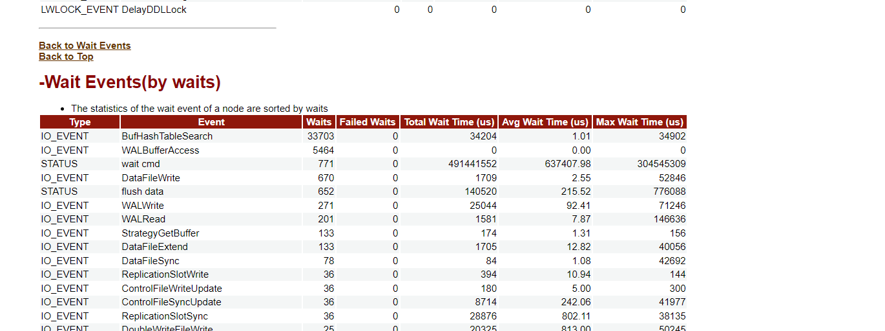
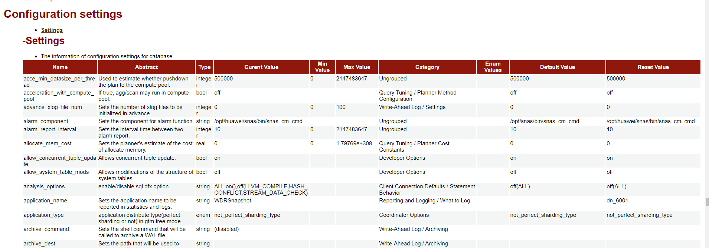

# openGauss 的 WDR 报告（类似于 Oracle 的 awr）<a name="ZH-CN_TOPIC_0000001173197471"></a>

Oracle 的 awr 报告在日常解决问题中起到了很大的便利，在遇到问题时，我们通常会查看有无对应时间段的快照，生成 awr 报告并进一步分析。通过分析数据库的状态，资源消耗以及等待事件等初步定位问题，并在此基础上进行验证。在 opengauss 数据库中，也有着这样的“awr”，它叫做——wdr。

## 前提：<a name="section202831551113317"></a>

1.  打开参数 enable_wdr_snapshot。

    ```
    postgres=# show enable_wdr_snapshot;
    enable_wdr_snapshot
    ---------------------
    on
    (1 row)
    ```

    WDR Snasphot 在启动后,会在用户表空间"pg_default"，数据库"postgres"下新建 schema “snapshot”，用于持久化 WDR 快照数据。

2.  WDR Snasphot 性能快照数量大于等于 2。

## 操作步骤：<a name="section17195115663410"></a>

1.  执行以下命令查询已经生成的快照

    ```
    postgres=# select * from snapshot.snapshot;
    snapshot_id |           start_ts            |            end_ts
    -------------+-------------------------------+-------------------------------
               1 | 2021-07-08 15:02:15.990876+08 | 2021-07-08 15:02:18.555272+08
               2 | 2021-07-08 15:08:12.470218+08 | 2021-07-08 15:08:14.514862+08
               3 | 2021-07-08 16:02:16.709364+08 | 2021-07-08 16:02:17.643546+08
               4 | 2021-07-08 17:02:17.617386+08 | 2021-07-08 17:02:20.626552+08
               ............
              43 | 2021-07-10 07:02:36.418031+08 | 2021-07-10 07:02:37.380217+08
              44 | 2021-08-05 00:21:09.062745+08 | 2021-08-05 00:21:10.33016+08
    (44 rows)
    ```

2.  可以选择手从创建快照，该命令需要用户具有 sysadmin 权限。或者直接选取数据库中已有的快照。

    ```
    postgres=# select create_wdr_snapshot();
               create_wdr_snapshot
    -----------------------------------------
    WDR snapshot request has been submitted
    (1 row)

    postgres=# select * from snapshot.snapshot;
    snapshot_id |           start_ts            |            end_ts
    -------------+-------------------------------+-------------------------------
               1 | 2021-07-08 15:02:15.990876+08 | 2021-07-08 15:02:18.555272+08
               2 | 2021-07-08 15:08:12.470218+08 | 2021-07-08 15:08:14.514862+08
               3 | 2021-07-08 16:02:16.709364+08 | 2021-07-08 16:02:17.643546+08
               4 | 2021-07-08 17:02:17.617386+08 | 2021-07-08 17:02:20.626552+08
               ............
              43 | 2021-07-10 07:02:36.418031+08 | 2021-07-10 07:02:37.380217+08
              44 | 2021-08-05 00:21:09.062745+08 | 2021-08-05 00:21:10.33016+08
              45 | 2021-08-05 00:39:43.777341+08 | 2021-08-05 00:39:44.760498+08       //这一快照为刚才手动执行生成的
    (45 rows)
    ```

3.  执行如下步骤，生成 node 级别 wdr 报告

    - 查询 pgxc_node_name 参数值

      ```
      [omm@node1 ~]$ gsql -p 26000 postgres -c "show pgxc_node_name"
      pgxc_node_name
      ----------------
      dn_6001_6002
      (1 row)
      ```

    - \\a \\t \\o 服务器文件路径生成格式化性能报告

      例如

      ```
      postgres=# \a \t \o /home/omm/wdr_sarah.html
      Output format is unaligned.
      Showing only tuples.
      ```

      上述命令涉及参数说明如下：

      - \\a：切换非对齐模式。
      - \\t：切换输出的字段名的信息和行计数脚注。
      - \\o：把所有的查询结果发送至服务器文件里。

        服务器文件路径：生成性能报告文件存放路径。用户需要拥有此路径的读写权限。

    - 向性能报告 wdr_sarah.html 中写入数据。

      ```
      gsql -p 26000 -d postgres
      select generate_wdr_report(快照id1,快照id2,‘all’,‘node’,‘pgxc_node_name参数值’);
      ```

      例如

      ```
      postgres=# select generate_wdr_report(44,45,'all','node','dn_6001_6002');
      目录下生成对应的wdr报告

      [omm@node1 ~]$ ll
      total 1080
      -rw------- 1 omm dbgrp    1317 Apr  9 15:43 single.xml
      -rw------- 1 omm dbgrp 1101242 Aug  5 00:47 wdr_sarah.html
      ```

    - 拿到浏览器上查看：

      opengauss 的 awr 报告类似于 oracle 的 wdr，拥有资源消耗、等待事件、TOPSQL，以及参数设置等。

      

      

      

## 快照相关参数：<a name="section199531229114011"></a>

- enable_wdr_snapshot

  参数说明：是否开启数据库监控快照功能。

  该参数属于 SIGHUP 类型参数

  取值范围：布尔型

  on：打开数据库监控快照功能。

  off：关闭数据库监控快照功能。

- wdr_snapshot_retention_days

  参数说明：系统中数据库监控快照数据的保留天数。当数据库运行过程期间所生成的快照量数超过保留天数内允许生成的快照数量的最大值时，系统将每隔 wdr_snapshot_interval 时间间隔，清理 snapshot_id 最小的快照数据。

  该参数属于 SIGHUP 类型参数

  取值范围：整型，1 ～ 8。

  默认值：8

- wdr_snapshot_interval

  参数说明：后台线程 Snapshot 自动对数据库监控数据执行快照操作的时间间隔。

  该参数属于 SIGHUP 类型参数

  取值范围：整型，10 ～ 60（分钟）。

  默认值：1h

- wdr_snapshot_query_timeout

  参数说明：系统执行数据库监控快照操作时，设置快照操作相关的 sql 语句的执行超时时间。如果语句超过设置的时间没有执行完并返回结果，则本次快照操作失败。

  该参数属于 SIGHUP 类型参数

  取值范围：整型，100 ～ INT_MAX（秒）。

  默认值：100s
