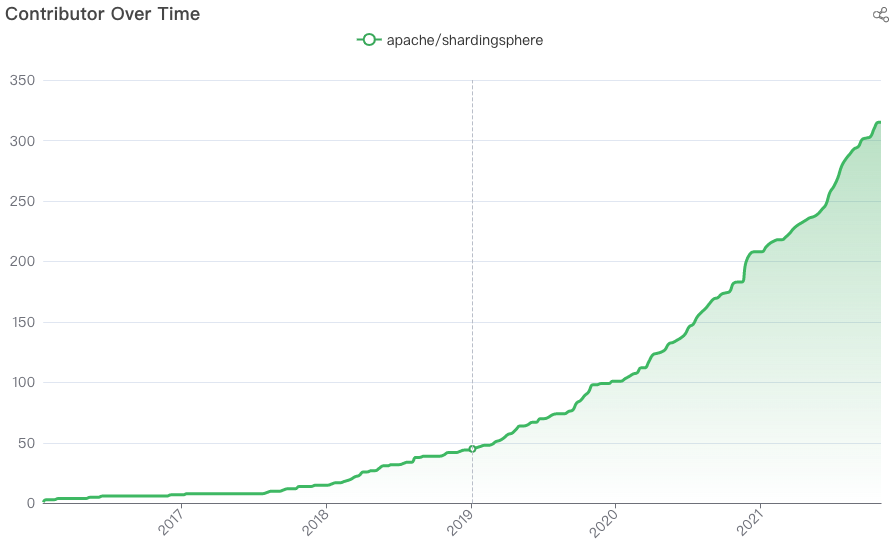
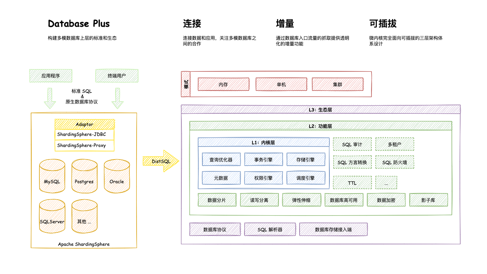
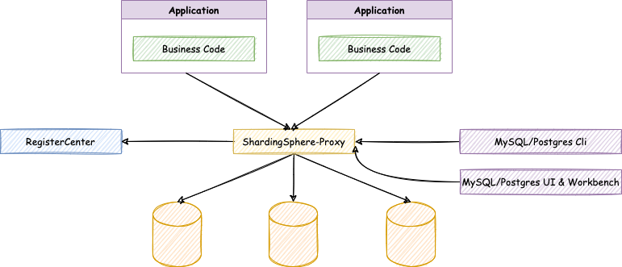
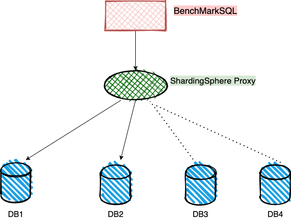

# 梦幻联动-MogDB/openGauss 与 ShardingSphere 在 tpcc 上的表现<a name="ZH-CN_TOPIC_0000001154554660"></a>

## 一、 ShardingSphere<a name="section1590393919523"></a>

1.  什么是 ShardingSphere

    Apache ShardingSphere 是一套开源的分布式数据库解决方案组成的生态圈，它由 JDBC、Proxy 和 Sidecar（规划中）这 3 款既能够独立部署，又支持混合部署配合使用的产品组成。 它们均提供标准化的数据水平扩展、分布式事务和分布式治理等功能，可适用于如 Java 同构、异构语言、云原生等各种多样化的应用场景。

2.  适用场景

    Apache ShardingSphere 旨在充分合理地在分布式的场景下利用关系型数据库的计算和存储能力，而并非实现一个全新的关系型数据库。 关系型数据库当今依然占有巨大市场份额，是企业核心系统的基石，未来也难于撼动，我们更加注重在原有基础上提供增量，而非颠覆。

    Apache ShardingSphere 5.x 版本开始致力于可插拔架构，项目的功能组件能够灵活的以可插拔的方式进行扩展。 目前，数据分片、读写分离、数据加密、影子库压测等功能，以及 MySQL、PostgreSQL、SQLServer、Oracle 等 SQL 与协议的支持，均通过插件的方式织入项目。 开发者能够像使用积木一样定制属于自己的独特系统。Apache ShardingSphere 目前已提供数十个 SPI 作为系统的扩展点，仍在不断增加中。

3.  开源数字

    ShardingSphere 已于 2020 年 4 月 16 日成为 Apache 软件基金会的顶级项目。

    - 星评增长时间

    

    - 贡献者增长时间线
    - 

4.  架构图

    

5.  ShardingSphere Proxy

    - 定位为透明化的数据库代理端，提供封装了数据库二进制协议的服务端版本，用于完成对异构语言的支持。 目前提供 MySQL 和 PostgreSQL（兼容 openGauss 等基于 PostgreSQL 的数据库）版本，它可以使用任何兼容 MySQL/PostgreSQL 协议的访问客户端（如：MySQL Command Client, MySQL Workbench, Navicat 等）操作数据，对 DBA 更加友好。
    - 向应用程序完全透明，可直接当做 MySQL/PostgreSQL 使用。
    - 适用于任何兼容 MySQL/PostgreSQL 协议的的客户端。

    

## 二、 MogDB<a name="section196561258135917"></a>

1. 什么是 MogDB

MogDB 是云和恩墨基于 openGauss 开源数据库的内核进行研发，推出的一款极致易用的企业级关系型数据库。MogDB 具备金融级高可用和全密态计算的极致安全、面向多核处理器的极致性能、AI 自诊断调优的极致智能能力，能够满足从核心交易到复杂计算的企业级业务需求。

云和恩墨致力于发挥全栈产品加服务的企业优势，优先支持鲲鹏算力，在 MogDB 的运行平台、管理工具、SQL 审核和运维服务等方向推出整体解决方案，为用户提供可信赖的企业级产品和服务，为 openGauss 的开源生态持续贡献力量。

2. 适用场景

大并发、大数据量、以联机事务处理为主的交易型应用场景，如电商、金融、O2O、电信 CRM/计费等，应用可按需选择不同的主备部署模式。

在工业监控与远程控制、智慧城市能力延展、智能家居、车联网等物联网应用场景下，传感设备多、采样率高、数据存储为追加模型，满足操作和分析并重的要求。

## 三、如何联动<a name="section0658021805"></a>

1. 概述

通过 ShardingSphere 的 Proxy 功能作为 MogDB 数据库的代理端进行数据的转发分片和流转。

本文通过 TPCC 标准程序 BenchmarkSQL5.0 作为模拟应用的压力发起程序。

通过 ShardingSphere 的功能可以具备分布式数据库的能力。

2. 架构图



## 四、安装数据库<a name="section8545162411110"></a>

1. 安装

安装两个单机数据库，数据库安装参考 https://www.modb.pro/db/70779

## 五、配置 ShardingSphere<a name="section193944521119"></a>

1. 安装 JAVA JDK

```
[root@db1 lee]# yum install java* -y
[root@db1 lee]# tail -3 ~/.bashrc
export JAVA_HOME=/usr/lib/jvm/java-1.8.0-openjdk-1.8.0.242.b08-1.h5.oe1.aarch64
export PATH=$JAVA_HOME/bin:$PATH
export CLASSPATH=.:$JAVA_HOME/lib/dt.jar:$JAVA_HOME
```

2. 编译

```
[root@db1 lee]# git clone https://github.com/apache/shardingsphere.git
[root@db1 lee]# cd shardingsphere-master
[root@db1 shardingsphere-master]# nohup ./mvnw clean install -DskipTests -Prelease -T1C -Djacoco.skip=true -Dcheckstyle.skip=true -DskipITs -Drat.skip=true -Dmaven.javadoc.skip=true -B &
[root@db1 shardingsphere-master]# tail -20 nohup.out
[INFO] shardingsphere-integration-agent-test-plugins ...... SUCCESS [  0.492 s]
[INFO] shardingsphere-integration-agent-test-common ....... SUCCESS [  1.173 s]
[INFO] shardingsphere-integration-agent-test-metrics ...... SUCCESS [  2.401 s]
[INFO] shardingsphere-integration-agent-test-zipkin ....... SUCCESS [  2.285 s]
[INFO] shardingsphere-integration-agent-test-jaeger ....... SUCCESS [  2.285 s]
[INFO] shardingsphere-integration-agent-test-opentelemetry  SUCCESS [  2.425 s]
[INFO] shardingsphere-integration-scaling-test ............ SUCCESS [  1.020 s]
[INFO] shardingsphere-integration-scaling-test-mysql ...... SUCCESS [  2.379 s]
[INFO] shardingsphere-rewrite-test ........................ SUCCESS [  1.112 s]
[INFO] shardingsphere-optimize-test ....................... SUCCESS [  0.927 s]
[INFO] shardingsphere-distribution ........................ SUCCESS [  0.421 s]
[INFO] shardingsphere-src-distribution .................... SUCCESS [  5.154 s]
[INFO] shardingsphere-jdbc-distribution ................... SUCCESS [  1.845 s]
[INFO] shardingsphere-proxy-distribution .................. SUCCESS [  7.516 s]
[INFO] ------------------------------------------------------------------------
[INFO] BUILD SUCCESS
[INFO] ------------------------------------------------------------------------
[INFO] Total time:  01:28 min (Wall Clock)
[INFO] Finished at: 2021-10-29T11:36:59+08:00
[INFO] ------------------------------------------------------------------------
[root@db1 target]# pwd
/lee/shardingsphere-master/shardingsphere-distribution/shardingsphere-proxy-distribution/target
[root@db1 target]# ls
apache-shardingsphere-5.0.0-RC1-SNAPSHOT-shardingsphere-proxy-bin.tar.gz         archive-tmp
apache-shardingsphere-5.0.0-RC1-SNAPSHOT-shardingsphere-proxy-bin.tar.gz.sha512  maven-shared-archive-resources
[root@db1 target]# mv apache-shardingsphere-5.0.0-RC1-SNAPSHOT-shardingsphere-proxy-bin.tar.gz proxy.tar.gz
[root@db1 target]# cp proxy.tar.gz /lee/ss/
```

apache-shardingsphere-5.0.0-RC1-SNAPSHOT-shardingsphere-proxy-bin.tar.gz 为 proxy 程序。

3. 修改配置文件

文件过长注释部分已经省略

- 主配置文件

  ```
  [root@db1 conf]# cat server.yaml
  rules:
    - !AUTHORITY
      users:
        - root@%:root
        - sharding@:sharding
      provider:
        type: ALL_PRIVILEGES_PERMITTED
  props:
    max-connections-size-per-query: 2
    proxy-frontend-flush-threshold: 128  # The default value is 128.
    proxy-backend-query-fetch-size: 1000
  ```

- users 部分为 ShardingSphere 的账号密码，属于 ShardingSphere 的对象和数据库对象无关。
- 分片文件

  ```
  [root@db1 conf]# cat config-sharding.yaml
  schemaName: tpcc
  dataSources:
    ds_0:
      connectionTimeoutMilliseconds: 30000
      idleTimeoutMilliseconds: 60000
      maxLifetimeMilliseconds: 1800000
      maxPoolSize: 3000
      minPoolSize: 1
      password: tpcc@123
      url: jdbc:postgresql://192.168.2.157:26000/tpcc?serverTimezone=UTC&useSSL=false&loggerLevel=OFF
      username: tpcc
    ds_1:
      connectionTimeoutMilliseconds: 30000
      idleTimeoutMilliseconds: 60000
      maxLifetimeMilliseconds: 1800000
      maxPoolSize: 3000
      minPoolSize: 1
      password: tpcc@123
      url: jdbc:postgresql://192.168.2.158:26000/tpcc?serverTimezone=UTC&useSSL=false&loggerLevel=OFF
      username: tpcc

  rules:
    - !SHARDING
      bindingTables:
        - bmsql_warehouse, bmsql_customer
        - bmsql_stock, bmsql_district, bmsql_order_line
      defaultDatabaseStrategy:
        none:
      defaultTableStrategy:
        none:
      keyGenerators:
        snowflake:
          props:
            worker-id: 123
          type: SNOWFLAKE
      tables:
        bmsql_config:
          actualDataNodes: ds_0.bmsql_config

        bmsql_warehouse:
          actualDataNodes: ds_${0..1}.bmsql_warehouse
          databaseStrategy:
            standard:
              shardingColumn: w_id
              shardingAlgorithmName: bmsql_warehouse_database_inline

        bmsql_district:
          actualDataNodes: ds_${0..1}.bmsql_district
          databaseStrategy:
            standard:
              shardingColumn: d_w_id
              shardingAlgorithmName: bmsql_district_database_inline

        bmsql_customer:
          actualDataNodes: ds_${0..1}.bmsql_customer
          databaseStrategy:
            standard:
              shardingColumn: c_w_id
              shardingAlgorithmName: bmsql_customer_database_inline

        bmsql_item:
          actualDataNodes: ds_${0..1}.bmsql_item
          databaseStrategy:
            standard:
              shardingColumn: i_id
              shardingAlgorithmName: bmsql_item_database_inline

        bmsql_history:
          actualDataNodes: ds_${0..1}.bmsql_history
          databaseStrategy:
            standard:
              shardingColumn: h_w_id
              shardingAlgorithmName: bmsql_history_database_inline

        bmsql_oorder:
          actualDataNodes: ds_${0..1}.bmsql_oorder_${0..1}
          databaseStrategy:
            standard:
              shardingColumn: o_w_id
              shardingAlgorithmName: bmsql_oorder_database_inline
          tableStrategy:
            standard:
              shardingColumn: o_c_id
              shardingAlgorithmName: bmsql_oorder_table_inline

        bmsql_stock:
          actualDataNodes: ds_${0..1}.bmsql_stock
          databaseStrategy:
            standard:
              shardingColumn: s_w_id
              shardingAlgorithmName: bmsql_stock_database_inline

        bmsql_new_order:
          actualDataNodes: ds_${0..1}.bmsql_new_order
          databaseStrategy:
            standard:
              shardingColumn: no_w_id
              shardingAlgorithmName: bmsql_new_order_database_inline

        bmsql_order_line:
          actualDataNodes: ds_${0..1}.bmsql_order_line
          databaseStrategy:
            standard:
              shardingColumn: ol_w_id
              shardingAlgorithmName: bmsql_order_line_database_inline

      shardingAlgorithms:
        bmsql_warehouse_database_inline:
          type: INLINE
          props:
            algorithm-expression: ds_${w_id % 2}

        bmsql_district_database_inline:
          type: INLINE
          props:
            algorithm-expression: ds_${d_w_id % 2}

        bmsql_customer_database_inline:
          type: INLINE
          props:
            algorithm-expression: ds_${c_w_id % 2}

        bmsql_item_database_inline:
          type: INLINE
          props:
            algorithm-expression: ds_${i_id % 2}

        bmsql_history_database_inline:
          type: INLINE
          props:
            algorithm-expression: ds_${h_w_id % 2}

        bmsql_oorder_database_inline:
          type: INLINE
          props:
            algorithm-expression: ds_${o_w_id % 2}

        bmsql_oorder_table_inline:
          type: INLINE
          props:
            algorithm-expression: bmsql_oorder_${o_c_id % 2}

        bmsql_stock_database_inline:
          type: INLINE
          props:
            algorithm-expression: ds_${s_w_id % 2}

        bmsql_new_order_database_inline:
          type: INLINE
          props:
            algorithm-expression: ds_${no_w_id % 2}

        bmsql_order_line_database_inline:
          type: INLINE
          props:
            algorithm-expression: ds_${ol_w_id % 2}
  ```

- schemaName 为数据库用户名
- dataSources 为数据源可配置 1 至多个
- rules 为分片规则，%2 为取 id 列分成 2 份到两个数据库。

4. 启动 proxy

```
[root@db1 bin]# pwd
/lee/ss/proxy/bin
[root@db1 bin]# ./start.sh 3307
Starting the ShardingSphere-Proxy ...
The classpath is /lee/ss/proxy/conf:.:/lee/ss/proxy/lib/*:/lee/ss/proxy/ext-lib/*
Please check the STDOUT file: /lee/ss/proxy/logs/stdout.log
[root@db1 bin]# cat /lee/ss/proxy/logs/stdout.log
Thanks for using Atomikos! Evaluate http://www.atomikos.com/Main/ExtremeTransactions for advanced features and professional support
or register at http://www.atomikos.com/Main/RegisterYourDownload to disable this message and receive FREE tips & advice
[INFO ] 2021-11-01 15:53:05.643 [main] o.a.s.p.i.BootstrapInitializer - Database name is `PostgreSQL`, version is `9.2.4`
[INFO ] 2021-11-01 15:53:05.837 [main] o.a.s.p.frontend.ShardingSphereProxy - ShardingSphere-Proxy start success
```

可以在脚本后指定 proxy 的启动端口

5. 测试连接

```
[lee@node157 ~]$ gsql -d tpcc -Usharding -h 192.168.2.136 -p3307 -Wsharding
gsql ((MogDB 2.1.0 build ) compiled at 2021-10-26 19:07:06 commit 0 last mr  )
Non-SSL connection (SSL connection is recommended when requiring high-security)
Type "help" for help.
tpcc=>
```

## 六、 调试 BenchmarkSQL<a name="section14664194919415"></a>

1. 查看配置文件

```
[root@db1 run]# cat props.mogdb.ss
db=postgres
driver=org.postgresql.Driver
conn=jdbc:postgresql://192.168.2.136:3307/tpcc?prepareThreshold=1&batchMode=on&fetchsize=10&loggerLevel=off
user=sharding
password=sharding

warehouses=100
loadWorkers=50

terminals=500
//To run specified transactions per terminal- runMins must equal zero
runTxnsPerTerminal=0
//To run for specified minutes- runTxnsPerTerminal must equal zero
runMins=10
//Number of total transactions per minute
limitTxnsPerMin=0

//Set to true to run in 4.x compatible mode. Set to false to use the
//entire configured database evenly.
terminalWarehouseFixed=true

//The following five values must add up to 100
//The default percentages of 45, 43, 4, 4 & 4 match the TPC-C spec
newOrderWeight=45
paymentWeight=43
orderStatusWeight=4
deliveryWeight=4
stockLevelWeight=4

// Directory name to create for collecting detailed result data.
// Comment this out to suppress.
resultDirectory=ss_result_%tY-%tm-%td_%tH%tM%tS
//osCollectorScript=./misc/os_collector_linux.py
//osCollectorInterval=1
//osCollectorSSHAddr=user@dbhost
//osCollectorDevices=net_eth0 blk_sda
```

2. 生成原始数据

```
[root@db1 run]# ./runDatabaseBuild.sh props.mogdb.ss
部分日志
# ------------------------------------------------------------
# Loading SQL file ./sql.postgres/buildFinish.sql
------------------------------------------------------------
-- ----
-- Extra commands to run after the tables are created, loaded,
-- indexes built and extra's created.
-- PostgreSQL version.
-- ----
```

3. 运行 TPCC 程序

```
[root@db1 data]# numactl -C 0-25,30-55 ./runBenchmark.sh props.mogdb.ss
13:55:30,137 [main] INFO   jTPCC : Term-00,
13:55:30,140 [main] INFO   jTPCC : Term-00, +-------------------------------------------------------------+
13:55:30,140 [main] INFO   jTPCC : Term-00,      BenchmarkSQL v5.0
13:55:30,140 [main] INFO   jTPCC : Term-00, +-------------------------------------------------------------+
13:55:30,140 [main] INFO   jTPCC : Term-00,  (c) 2003, Raul Barbosa
13:55:30,140 [main] INFO   jTPCC : Term-00,  (c) 2004-2016, Denis Lussier
13:55:30,142 [main] INFO   jTPCC : Term-00,  (c) 2016, Jan Wieck
13:55:30,142 [main] INFO   jTPCC : Term-00, +-------------------------------------------------------------+
13:55:30,142 [main] INFO   jTPCC : Term-00,
13:55:30,142 [main] INFO   jTPCC : Term-00, db=postgres
13:55:30,142 [main] INFO   jTPCC : Term-00, driver=org.postgresql.Driver
13:55:30,143 [main] INFO   jTPCC : Term-00, conn=jdbc:postgresql://192.168.2.136:3307/tpcc?prepareThreshold=1&batchMode=on&fetchsize=10&loggerLevel=off
13:55:30,143 [main] INFO   jTPCC : Term-00, user=sharding
13:55:30,143 [main] INFO   jTPCC : Term-00,
13:55:30,143 [main] INFO   jTPCC : Term-00, warehouses=100
13:55:30,143 [main] INFO   jTPCC : Term-00, terminals=500
13:55:30,144 [main] INFO   jTPCC : Term-00, runMins=10
13:55:30,144 [main] INFO   jTPCC : Term-00, limitTxnsPerMin=0
13:55:30,145 [main] INFO   jTPCC : Term-00, terminalWarehouseFixed=true
13:55:30,145 [main] INFO   jTPCC : Term-00,
13:55:30,145 [main] INFO   jTPCC : Term-00, newOrderWeight=45
13:55:30,145 [main] INFO   jTPCC : Term-00, paymentWeight=43
13:55:30,145 [main] INFO   jTPCC : Term-00, orderStatusWeight=4
13:55:30,145 [main] INFO   jTPCC : Term-00, deliveryWeight=4
13:55:30,145 [main] INFO   jTPCC : Term-00, stockLevelWeight=4
13:55:30,145 [main] INFO   jTPCC : Term-00,
13:55:30,145 [main] INFO   jTPCC : Term-00, resultDirectory=ss_result_%tY-%tm-%td_%tH%tM%tS
13:55:30,145 [main] INFO   jTPCC : Term-00, osCollectorScript=null
13:55:30,145 [main] INFO   jTPCC : Term-00,
13:55:30,157 [main] INFO   jTPCC : Term-00, copied props.mogdb.ss to ss_result_2021-11-01_135530/run.properties
13:55:30,157 [main] INFO   jTPCC : Term-00, created ss_result_2021-11-01_135530/data/runInfo.csv for runID 835
13:55:30,157 [main] INFO   jTPCC : Term-00, writing per transaction results to ss_result_2021-11-01_135530/data/result.csv
13:55:30,158 [main] INFO   jTPCC : Term-00,
13:55:30,237 [main] INFO   jTPCC : Term-00, C value for C_LAST during load: 165
13:55:30,237 [main] INFO   jTPCC : Term-00, C value for C_LAST this run:    92
13:55:30,237 [main] INFO   jTPCC : Term-00, Running Average tpmTOTAL: 626491.25    Current tpmTOTAL: 41415216    Memory Usage: 858MB / 1001MB
14:05:31,197 [Thread-158] INFO   jTPCC : Term-00,
14:05:31,197 [Thread-158] INFO   jTPCC : Term-00,
14:05:31,197 [Thread-158] INFO   jTPCC : Term-00, Measured tpmC (NewOrders) = 281818.72
14:05:31,198 [Thread-158] INFO   jTPCC : Term-00, Measured tpmTOTAL = 626481.78
14:05:31,198 [Thread-158] INFO   jTPCC : Term-00, Session Start     = 2021-11-01 13:55:31
14:05:31,198 [Thread-158] INFO   jTPCC : Term-00, Session End       = 2021-11-01 14:05:31
14:05:31,198 [Thread-158] INFO   jTPCC : Term-00, Transaction Count = 6265412
14:05:31,198 [Thread-158] INFO   jTPCC : executeTime[Payment]=87346178
14:05:31,198 [Thread-158] INFO   jTPCC : executeTime[Order-Status]=3979084
14:05:31,198 [Thread-158] INFO   jTPCC : executeTime[Delivery]=24407579
14:05:31,198 [Thread-158] INFO   jTPCC : executeTime[Stock-Level]=3583178
14:05:31,198 [Thread-158] INFO   jTPCC : executeTime[New-Order]=180651188
```
