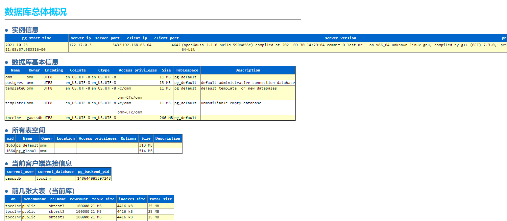
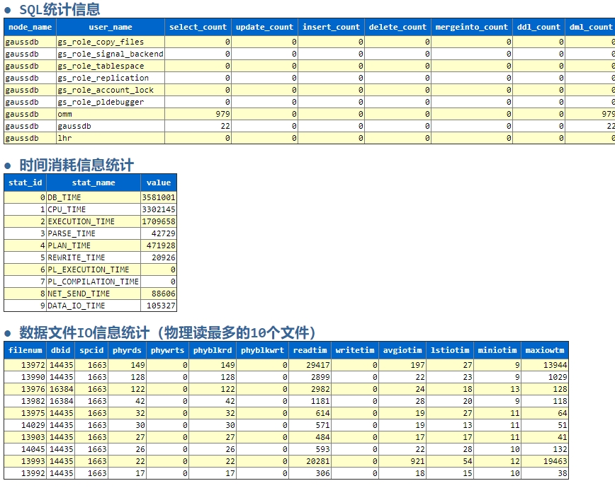

# 纯 SQL 生成 openGauss 数据库的 html 巡检报告<a name="ZH-CN_TOPIC_0000001154714468"></a>

## 1、巡检脚本简介<a name="section2355912161920"></a>

该套巡检脚本为纯 SQL 脚本开发，如下所示：


目前一共包含 13 个脚本，若脚本的扩展名为“.sql”则表示该脚本为 sql 脚本；若脚本的扩展名为“.pl”则表示该脚本为 perl 脚本；若脚本的扩展名为“.sh”则表示该脚本为 shell 脚本。

对于 Oracle 的 SQL 脚本而言，脚本 DB_Oracle_HC_lhr_v7.0.0_10g.sql 适用于 Oracle 10g 数据库，脚本 DB_Oracle_HC_lhr_v7.0.0_11g.sql 适用于 Oracle 11g 的数据库，脚本 DB_Oracle_HC_lhr_v7.0.0_12c.sql 适用于 Oracle 12c 及其以上版本，这 3 个脚本都是只读版本，这 3 个脚本只会对数据库做查询操作，不会做 DML 和 DDL 操作，这也是很多朋友所期待的功能。

脚本 DB_OS_HC_lhr_v7.0.0.pl 是 perl 脚本，执行后会对 OS 的信息进行收集，并且输出到 html 中。脚本 DB_OS_HC_lhr_v7.0.0.sh 是 shell 脚本，执行后会对 OS 的信息进行收集。

脚本 DB_MySQL_HC_lhr_v7.0.0.sql 是 MySQL 脚本，执行后会产生 MySQL 的健康检查 html 报告，该脚本为只读脚本。

脚本 DB_MSSQL_HC_lhr_v7.0.0_2005.sql 和 DB_MSSQL_HC_lhr_v7.0.0_2008R2.sql 是 SQL Server 脚本，存在部分 DDL 和 DML 操作，执行后会产生 SQL Server 的健康检查 html 报告。脚本 DB_MSSQL_HC_lhr_v7.0.0_2005.sql 最低支持 2005 版本，而脚本 DB_MSSQL_HC_lhr_v7.0.0_2008R2.sql 最低支持 2008R2 版本。

脚本 DB_PG_HC_lhr_v7.0.0.sql 是 PG 数据库脚本，执行后会产生 PostgreSQL 数据库的健康检查 html 报告。

脚本 DB_DM_HC_lhr_v7.0.0 是达梦数据库脚本，执行后会产生达梦数据库的健康检查 html 报告。

脚本 DB_TiDB_HC_lhr_v7.0.0.sql 是 TiDB 数据库脚本，执行后会产生 TiDB 数据库的健康检查 html 报告。

脚本 DB_openGauss_HC_lhr_v7.0.0.sql 是 openGauss 数据库脚本，执行后会产生 openGauss 数据库的健康检查 html 报告。

## 2、巡检脚本特点<a name="section194931250182011"></a>

1、可以巡检 Oracle、MySQL、SQL Server、PostgreSQL、TiDB、openGauss 和国产达梦等 7 个数据库，也可以巡检 Linux 操作系统（后续会免费逐步增加 MongoDB、db2、OceanBase、PolarDB、TDSQL、GBase、人大金仓等数据库）

2、脚本为绿色版、免安装、纯 SQL 文本

3、跨平台，只要有 SQL\*Plus（Oracle）、mysql（MySQL、TiDB）、MSSQL 客户端（SSMS、Navicat 皆可）、psql（PG、openGauss）、gisql（国产达梦）、gsql（openGauss）环境即可运行脚本

4、脚本内容可视化，可以看到脚本内容，因此可供学习数据库使用

5、兼容 Oracle 10g、11g、12c、18c、19c、20c、21c 等高版本 Oracle 数据库

6、对 Oracle 10g、11g、12c、18c、19c、20c、21c 等版本分别提供了只读版（只对数据库查询，不做 DDL 和 DML 操作）

7、MySQL 最低支持 5.5 版本

8、SQL Server 最低支持 2005 版本

9、增删监控项非常方便，只需要提供相关 SQL 即可

10、一次购买，所有脚本终身免费升级

11、检查内容非常全面

12、针对每种数据库，只有 1 个 SQL 脚本，不存在嵌套调用脚本等其它问题

13、最终生成 html 文件格式的健康检查结果

14、对结果进行过滤，列出了数据库有问题的内容

15、对 OS 的信息提供了收集（单独脚本）

## 3、openGauss 数据库运行方式<a name="section1443177172119"></a>

需要有华为的 gsql 客户端，或 PostgreSQL 数据库的 psql 客户端都可以，运行方式如下：

若是 openGauss 或华为的 GaussDB 数据库的 gsql 客户端，则执行：

```
gsql -U gaussdb -h 192.168.66.35 -p 15432 -d postgres -W'lhr@123XXT' -H -f D:\DB_openGauss_HC_lhr_v7.0.0.sql > d:\a.html
```

若是 PostgreSQL 数据库的 psql 客户端，则执行：

```
psql -U gaussdb -h 192.168.66.35 -p 54324 -d postgres -W -H -f D:\DB_openGauss_HC_lhr_v7.0.0.sql > d:\a.html
```

## 4、html 巡检结果<a name="section3752341182113"></a>

这里只列出部分结果，其它的详细内容可以参考：https://share.weiyun.com/5lb2U2M





其它不再列举。
