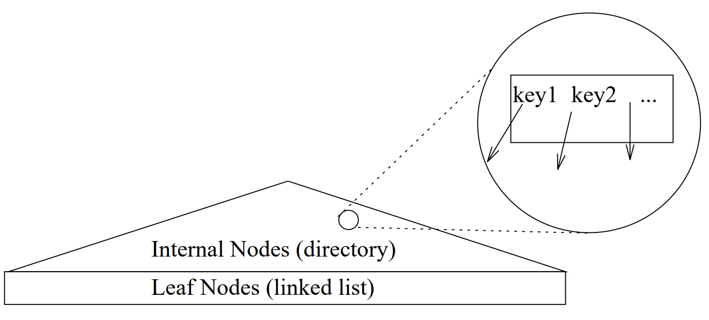
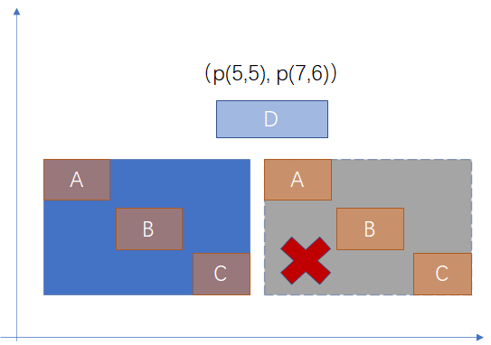
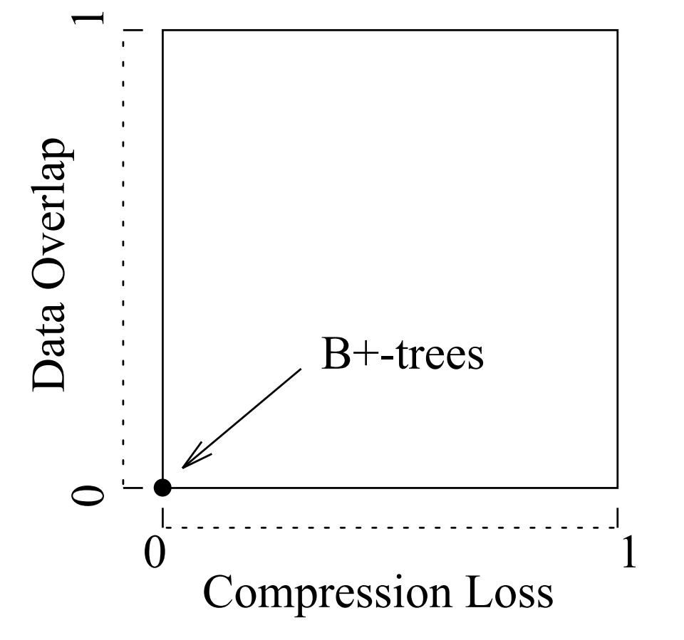

# 通用搜索树<a name="ZH-CN_TOPIC_0000001219494713"></a>

## 概述<a name="section333185185414"></a>

本文翻译了 Generalized Search Trees for Database Systems 这篇论文的内容，并加入了自己的理解，旨在更好地理解 Gist 索引。

## 介绍<a name="section141653187546"></a>

高效的查找树的实现对数据库十分重要。对于传统的数据库系统，B+-Tree 对于数字类型的数据而言可能已经足够了。但是，现在数据库系统需要处理各种新的数据类型，以支持不断涌现的新型应用，如定位系统、多媒体系统、CAD 工具、时序数据库、指纹识别系统、生物数据库等等。为了能够支持这些应用，查找树的实现必须灵活可扩展。

为了实现搜索树的灵活可扩展，主要有两种思路：

- 1. Specialized Search Tree : 为解决特定的问题实现专用的搜索树。目前已经开发了很多各种各样的搜索树，例如大家熟知的 R-tree 是用来解决空间搜索问题。虽然其中很多搜索树在解决特定领域的问题非常重要，但是这种思路存在一些问题。实现和维护一种搜索树工作量巨大。产生新的应用后，需要重新开发一种搜索树，实现树的搜索、并发控制、插入、分裂等相关的逻辑。
- 2. Search Trees For Extensible Data Types ：为避免开发新的搜索树类型，已有的一些搜索树，如 B+-Tree、R-tree 可以扩展它们支持的数据类型。例如， B+-Tree 可用于检索任何具有线性排序的数据，支持对该数据类型的相等或者范围查询。这种方式虽然扩展了支持的数据类型，但是并没有扩展搜索树上可支持的查询的种类，依然只能支持相等或者范围查询。类似的，R-tree 中，唯一可用的谓词类型是相等、重叠和包含这几种。这种不灵活性为支持新的应用带来了非常多的问题，因为传统的一些查询类型，如 线性排序、范围查询等对新的数据类型而言可能并不适合。

  Gist 是解决搜索树可扩展性的第三种思路，它在支持的数据类型和查询种类方面都很容易扩展。尤其是查询类型的可扩展尤其重要，它允许以一种接近自然的查询方式去支持新的数据类型上的索引。除了为新的数据类型提供可扩展性， Gist 还统一了之前用于常见的数据类型的不同的数据结构。例如，B+-tree 和 R-tree 都可以基于 Gist 实现，从而可以实现基于同一个代码库实现不同的索引，支持不同的应用。

  Gist 很容易配置，为了实现不同用途的搜索树，只需要在数据库中注册 6 种方法，这 6 种方法中封装了作为搜索树中 key 的对象的结构和行为。例如 PG 中实现了基于 Gist 的 R-tree，实现了 R-tree 中支持的数据类型对应的 6 个接口（每一种类型都需要实现）。 实现一组新的方法，比完全从头开始实现一棵新的搜索树要简单得多。例如，R-trees 的 POSTGRES 实现大概 3000 行代码，而 GiST 方法实现大约 500 行代码。

  除了提供统一的、可扩展的数据结构外，对搜索树的处理面临一个最基本的问题：Gist 是否可以用于支持任意的数据集的索引，Gist 产生的搜索树是否总是可以支持有效地查询。对于这个问题，可能要回答“NO”了，本文将说明一些可能影响搜索树效率的问题。

  这引发了一个有趣的问题，即何时以何种方式在一些非标准化的问题上构建一棵高效的查询树--Gist 需要进一步通过试验进行探索。

## 1.1 本文的结构<a name="section691335916564"></a>

第 2 节，说明并概括了数据库搜索树的基本特性。

第 3 节，介绍了广义搜索树对象及其结构、属性和行为。

第 4 节，提供了三种不同类型的搜索树的 GiST 实现。

第 5 节，介绍了一些性能数据，探讨了构建有效搜索树所涉及的问题。

第 6 节，检查了在成熟的 DBMS 中实现 GiST 时需要考虑的一些细节。

第 7 节，最后讨论了这项工作的重要性，以及进一步研究的方向。

## 1.2 相关工作<a name="section104051611145719"></a>

Knuth 提供了一个很好的关于搜索树的调查研究，而 Comer 更详细地介绍了 B-tree 及其变体。现在已经有很多多维搜索树，例如 R-tree 及其变体 R\*-tree 和 R+-tree。其他的多维搜索树，如 quad-tree、k-D-B-tree、hB-tree 等等。也可以用空间填充曲线，将多维数据转换成一维数据，转换后，可以用 B+-tree 索引生成的数据。

PG 中引入了可扩展索引，提供了可扩展的 B+-tree 和 R-tree 的实现。这些可扩展的索引允许多多种数据类型进行索引，但是只支持一组固定的查询谓词。例如，PG B+-tree 索引支持常用的排序谓词\(\>, \>=, =, <=, <\)，而 PG 中 R-tree 仅支持谓词 Left、Right、OverLeft、Overlap、OverRight、Right、Contained、Contained 和 Equal。

可扩展的 R-tree 提供了 Gist 功能相当强大的一个子集，本文首次证明了 R-tree 可以索引尚未映射到空间域的数据。然而，除了有限的可扩展性之外，R 树还缺乏 Gist 支持的许多其他功能。R-trees 只提供一种关键谓词（Contains），它们不允许用户指定后面将会提到的 PickSplit 和 Penalty 算法，同时它缺乏对来自线性排序域的数据的优化。尽管有这些限制，可扩展 R-tree 与 Gist 已经十分接近了，我们在第 5 节中描述原始实现和性能验证。

## 2 The Gist of Database Search Trees<a name="section850182835714"></a>

大多数有数据库经验的人对搜索树的工作方式都有直观的认识，所以在这里我们以简化的方式讨论搜索树，很多内容可能是模糊的，目的只是为了说明某个概念而不是细节。

搜索树的粗略示意图如图-1 所示，它是一棵平衡树，有高扇出。内部节点用作目录，叶子节点包含指向实际数据的指针，并且以链表的形式组织，以便索引扫描。



图-1 数据库中搜索树示意图

每个内部节点都包含一系列 key 和 pointer 。要搜索与查询谓词 q 匹配的元组，需要从根节点开始查找。对于节点上的每个指针，如果关联的 key 与 q 一致，即 key 不排除指针下方存储的数据可能匹配 q 的可能性，则遍历指针下方的子树，直到找到所有匹配的数据。

我们回顾了一些熟悉的树型结构中的一致性概念。在 B+ 树中，查询采用范围谓词的形式（例如“找到所有 i 使得 c1 < i < c2”），key 在逻辑上划定了一个范围，其中包含指针下方的数据。如果查找到的节点内的一个 item 的 key 满足这个查询范围，则需要继续查找子节点；否则不需要继续查找。

在上面的描述中，对 key 的唯一限制是它必须在逻辑上匹配存储在它下面的每一个数据，以便一致性检查不会遗漏任何有效数据。在 B+-tree 和 R-tree 中，key 的本质是一个“包含”谓词：它描述了一个连续的区域，其中包含 pointer 下的所有数据。但是，“包含”谓词并不是唯一可能出现的关系。就像在 R-tree 中，节点上的 key 可能出现“重叠”这样的关系，即一个节点上的两个 key 下面可能保存着某些相同的元组。

概括一下搜索关键字的概念：搜索关键字 key 是可以对其下的每一个数据都成立的任意谓词。如果给定这样一个灵活的数据结构，用户可以通过将数据组织成任意嵌套的子类别来自由地形成树，每一个都可以用一些特殊的谓词来标记。反过来，抓住数据库搜索树的本质：它是数据集分区的层次结构，每一个分区都有一个分类，用以保存分区中的所有数据。可以基于分类进行任意谓词的搜索。

为了支持对给定谓词 q 的搜索，用户必须提供一个返回布尔类型的方法来判断 q 是否与给定的 key 一致，搜索通过遍历与 key 关联的指针来进行。当节点数据过多或者占用空间过大时，通过用户提供的分裂算法来控制数据的分组，并且可以使用用户提供的 key 完成对分组的表征。因此，通过向用户公开关键方法和拆分方法，可以构建任意的搜索树，支持可扩展的查询集。这些是 Gist 的基础，后面详细对其进行描述。

## 3 The Generalized Search Tree<a name="section187351627229"></a>

本节描述 Gist 的结构、它的不变属性、可扩展的方法以及内置的算法。按照惯例，将每个索引数据称为“元组”。

## 3.1 Structure<a name="section167393398217"></a>

Gist 是一棵平衡树，它的每个节点的扇出在 kM 和 M 之间，其中 2/M <= k <= 1/2，根节点的扇出可以在 2 和 M 之间。其中常数 k 被称为最小填充因子。叶子节点包含（p, ptr）这样的数据，其中 p 是被用作搜索关键字的谓词，而 ptr 是数据库中某个元组的标识符。

非叶子节点中的（p; ptr）中 p 是用作搜索关键字的谓词，而 ptr 指向是指向另一个树中节点的指针。谓词可以包含任意数量的自由变量，只要树的叶子节点引用的任意单个元组能够装下。为了方便说明，假设树中的项占用的空间大小是一样的，可变大小的项在第 6 节介绍。

假设给定项 E = \(p; ptr\)的实现中，可以访问 E 当前所在的节点。

## 3.2 Properties<a name="section155141258620"></a>

以下属性在 Gist 中是不变的：

1. 除了根节点外每个节点包含 kM 到 M 个项。

2. 每个叶子节点中的索引项（p, ptr）在用指定的元组实例化时，p 为 true \(即 p 对元组成立\)。

3. 每个非叶子节点中的索引项（p, ptr），当使用从 ptr 可达的任意元组对其实例化时， p 为 true。和 R-tree 不同的是，对于某个从 ptr 可达的索引项 （p', ptr'），不要求 p' -\> p，只是 p 和 p' 都适用于从 ptr' 可达的元组。

4. 根节点至少有两个子节点，除非它本身也是叶子节点。

5. 所有叶子节点出现在同一层。

其中属性 3 尤其特别，对于 R-tree 而言要求 p' -\> p ，因为 R-tree 的边界排列在一个包含层次的结构中。然而，R-tree 有一些不必要的限制：节点 N 上方的 key 的谓词必须适用于 N 下的数据，因此不需要 N 上的 key 以更细的粒度重新描述这些谓词。

相反，有时我们需要节点 N 中的 key 基于某些不完全一样的规则对其下的数据进行分类。

## 3.3 Key Methods<a name="section4244122632"></a>

原则上， Gist 中的 key 可以是任意的谓词。实际使用中， key 来自用户定义的对象， 同时提供 Gist 需要的一些方法的实现。 例如， B+-tree 中 key 是数字类型，标识数据的范围；R-tree 中 key 的类型是外接矩阵，标识区域等等。

以下关键的方法，是预定义的需要用户实现的方法：

- Consistent\(E, q\): 给定一个索引项 E = \(p, ptr\) 以及 一个 查询谓词 q，如果 p ^ q 一定不满足，返回 FALSE , 否则返回 true 。需要注意的是，这里不是精确查找， Consistent 有可能产生误报，但不影响算法的正确性，误报可能导致性能的问题，因为会导致不必要的子树的查询。举例，如图-2 所示情况，谓词 q 是矩形是否在矩形 D 的左侧；左下方蓝色矩形是父节点所描述的矩形区域，如果用父节点的矩形区域判断是否在 D 的左侧，可能不满足条件；但这里只需要排除一定不在左侧的情况，即图中右侧灰色矩形区域描述的情况，父节点矩形区域的左边界在 D 的右侧，这种情况一定是不满足条件的，此时 Consistent 应该返回 FALSE；蓝色区域不返回 FALSE，则应该返回 true。 只有返回 true 后，才有可能继续查询 A B C 所描述的区域是否满足谓词在 D 的左侧，这样最终才能返回正确结果。

- Union\(P\): 给定一个索引项的集合 P ，包含索引项 （p1, ptr1） ... \(pn, ptrn\)，返回谓词 r ，能够满足 ptr1 到 ptrn 下所有元组。可以通过（p1 V p2 V pn） 的方式返回一个满足条件的 r 。

  Compress\(E\): 给定索引项 E = \(p, ptr\)，返回索引项 （x, ptr），其中 x 是 p 压缩后的数据形式。

- Decompress\(E\): 给定一个压缩后的索引项 E = \(x, ptr\)，其中 x = Compress\(p\)，返回一个索引项（r, ptr） 满足 p -\> r 。注意这可能是一种有损的压缩，因为不需要满足 p <-\> r 。

- Penalty\(E1, E2\): 给定两个索引项 E1 = \(p1, ptr1\)，E2 = \(p2, ptr2\) ，返回一个将 E2 插入以 E1 为根的子树的代价。该方法用于辅助插入和分裂算法给（在下面描述）。通常，代价值是从 E1.p1 增加到 Union \{E1, E2\} 增加的区域的面积的大小 （对 R-tree 而言）。
- PickSplit\(P\)：给定一个包含 M + 1 个索引项的节点 P ，将 P 分裂为 两个集合 P1 和 P2，每一个至少包含 kM 个索引项。通常希望以一种最优的方式进行拆分，但对最终取决于用户。

  

  图-2 Consistent Example

以上是 Gist 中唯一需要用户实现的方法。需要注意的是，Consistent、Union、Compress 和 Penalty 必须能够处理输入的谓词。这些方法实现起来可能会很困难，尤其是 Consistent。但是通常一棵树中的谓词是有限的，而且在实现中可以对这些谓词做一些限制。

对于 key 的压缩有很多选择，一种简单的实现是让 Compress 和 Decompress 成为恒等函数。复杂一点的实现可以让 Compress\(p, ptr\) 生成有效但更紧凑的谓词 r ，p -\> r，让 Decompress 为恒等函数。

以 SHORE's R-tree 中的技术为例，它在插入时获取一个多边形，将多边形压缩为外接矩形，其外接矩形本身也是一个多边形。当然，对 Compress 和 Decompress 而言可以实现更复杂的算法。

## 3.4 Tree Methods<a name="section112356391654"></a>

上一小节提到的方法需要开发者提供，本小节的方法是由 Gist 提供。需要注意 key 在节点上时压缩的，从节点读取时需要解压缩，这一点后续不在赘述。

- 3.4.1 Search

  所示有两种形式，本节介绍的时第一种，可以用于搜索任何查询谓词的任何数据集，方法是为查找到满足查询条件的数据，不断地遍历树。

  ```
  Algorithm Search(R, q)

  Input: GiST rooted at R, predicate q

  Output: all tuples that satisfy q

  Sketch: Recursively descend all paths in tree whose
  keys are consistent with q.

  S1: [Search subtrees] If R is not a leaf, check
  each entry E on R to determine whether
  Consistent(E, q). For all entries that are Consistent, invoke Search on the subtree whose
  root node is referenced by E.ptr.

  S2: [Search leaf node] If R is a leaf,
  check each entry E on R to determine whether
  Consistent(E, q). If E is Consistent, it is a
  qualifying entry. At this point E.ptr could
  be fetched to check q accurately, or this check
  could be left to the calling process.
  ```

  注意，查询谓词 q 可以是精确匹配（相等）谓词，也可以是同时有多个值满足的谓词。后一类包括”范围“ 或 ”窗口“谓词，如在 B+-tree 或 R-tree 中，还有更一般的不基于连续区域的谓词（例如集合包含谓词，等）

- 3.4.2 Search In Linearly Ordered Domains

  如果被索引的数据线性有序，且查询通常是相等或者范围这样的谓词，那么本小节中定义的 FindMin 和 Next 方法可以实现更高效地搜索。要使此选项可用，用户需要在创建搜索树的时候执行一些额外的步骤：

  - 1. IsOrdered 这个 flag 要设置为 true。IsOrdered 是在创建树的时候设置的一个静态属性，默认值是 false。
  - 2. 需要注册一个额外的方法 Compare\(E1, E2\)。给定两个索引项 E1 = \(p1, ptr1\) 和 E2 = \(p2, ptr2\) ， Compare 方法返回 p1 是否在 p2 之前，或者 p1 在 p2 之后，或者 p1 和 p2 相等。Comapare 用于在每个节点内插入数据。
  - 3. PickSplit 方法必须保证 P 分裂为 P1 和 P2 节点后，对于任意 P1 上的索引项 E1、P2 上的索引项 E2， Compare\(E1， E2\) 返回 E1 在 E2 前。
  - 4. 要保证一个节点内没有两个重叠的 key ，即一个节点内的任意 E1 和 E2， Consistent\(E1， E2.p\) = false。

  如果执行了上面 4 个步骤，则可以通过调用 FindMin 并重复调用 Next 来处理相等和范围查询。而其他类型的谓词仍然可以通过通用的搜索方法来处理，FindMin/Next 比使用 Serach 遍历更高效，因为 FindMin 和 Next 只沿着一个根到叶子的路径访问非叶子节点。

  ```
  Algorithm FindMin(R, q)

  Input: GiST rooted at R, predicate q

  Output: minimum tuple in linear order that satisfies q

  Sketch: descend leftmost branch of tree whose keys
  are Consistent with q. When a leaf node is
  reached, return the first key that is Consistent
  with q.

  FM1: [Search subtrees] If R is not a leaf, find the
  first entry E in order such that
  Consistent(E, q) . If such an E can be found,
  invoke FindMin on the subtree whose root
  node is referenced by E :ptr. If no such entry is found, return NULL.

  FM2: [Search leaf node] If R is a leaf, find the
  first entry E on R such that Consistent(E, q),
  and return E. If no such entry exists, return
  NULL.
  ```

  给定一个满足谓词 q 的索引项 E， Next 方法返回下一个满足 q 的索引项，如果不存在则返回 NULL。如果是为了查找 Next 只会在叶子节点上被调用。

  ```
  Algorithm Next(R, q, E)

  Input: GiST rooted at R, predicate q, current entry E

  Output: next entry in linear order that satisfies q

  Sketch: return next entry on the same level of the tree
  if it satisfies q. Else return NULL.

  N1: [next on node] If E is not the rightmost entry
  on its node, and N is the next entry to the right
  of E in order, and Consistent(N, q), then return N. If :Consistent(N, q), return NULL.

  N2: [next on neighboring node] If E is the righmost entry on its node, let P be the next node
  to the right of R on the same level of the tree
  (this can be found via tree traversal, or via
  sideways pointers in the tree, when available
  [LY81].) If P is non-existent, return NULL.
  Otherwise, let N be the leftmost entry on P .
  If Consistent(N, q), then return N, else return
  NULL.
  ```

- 3.4.3 Insert

  插入流程保证 Gist tree 的平衡，它与 R-tree 的插入非常相似，它是 B+-tree 更简单的插入流程的泛化。插入允许指定插入 level，这允许后续方法使用 Insert 从树的内部节点重新插入数据。假设叶子节点是 0 层，层号从叶子节点向上不断增加，新插入的项目出现在 level = 0 层。

  ```
  Algorithm Insert(R, E, l)

  Input: GiST rooted at R, entry E = (p, ptr), and
  level l, where p is a predicate such that p holds
  for all tuples reachable from ptr.

  Output: new GiST resulting from insert of E at level l.

  Sketch: find where E should go, and add it there, splitting if necessary to make room.

  I1. [invoke ChooseSubtree to find where E
  should go] Let L = ChooseSubtree(R, E, l)

  I2. If there is room for E on L, install E on L
  (in order according to Compare, if IsOrdered.)
  Otherwise invoke Split(R, L, E).

  I3. [propagate changes upward]
  AdjustKeys(R, L).
  ```

  ChooseSubtree 可用于在树的任何 level 找到插入的最佳节点。当 IsOrdered 属性是 true 时，必须仔细编写 Penalty 方法以确保 ChooseSubtree 按顺序到达正确的叶子节点。4.1 节将给出一个例子。

  ```
  Algorithm ChooseSubtree(R, E, l)

  Input: subtree rooted at R, entry E = (p, ptr), level
  l

  Output: node at level l best suited to hold entry with
  characteristic predicate E.p

  Sketch: Recursively descend tree minimizing Penalty

  CS1. If R is at level l, return R;

  CS2. Else among all entries F = (q, ptr') on R
  find the one such that Penalty(F, E) is minimal. Return ChooseSubtree(F.ptr', E, l).
  ```

  split 算法利用用户自定义的 PickSplit 方法来决定如何拆分节点，包括处理正在进行插入的新元组。一旦数据分成两份，Split 就会为其中一份生成新的节点，将其插入树中，并更新树中新节点之上的 key。

  ```
  Algorithm Split(R, N, E)

  Input: GiST R with node N, and a new entry E =
  (p, ptr).

  Output: the GiST with N split in two and E inserted.

  Sketch: split keys of N along with E into two groups
  according to PickSplit. Put one group onto a
  new node, and Insert the new node into the
  parent of N.

  SP1: Invoke PickSplit on the union of the elements
  of N and fEg, put one of the two partitions on
  node N, and put the remaining partition on a
  new node N0
  .

  SP2: [Insert entry for N0
  in parent] Let EN' =
  (q, ptr'), where q is the Union of all entries
  on N', and ptr' is a pointer to N'. If there
  is room for EN' on Parent(N), install EN' on
  Parent(N) (in order if IsOrdered.) Otherwise
  invoke Split(R, Parent(N), EN').

  SP3: Modify the entry F which points to N, so that
  F.p is the Union of all entries on N.
  ```

  步骤 SP3 修改父节点信息，以显示节点 N 的修改。 这些修改通过插入流程中的步骤 I3 向上传播到树中的其他部分，同时传播了由于插入 N' 引起的树结构的变化。

  AdjustKeys 方法确保一组谓词之上的 key 适用于下面的所有元组。

  ```
  Algorithm AdjustKeys(R, N)

  Input: GiST rooted at R, tree node N

  Output: the GiST with ancestors of N containing correct and specific keys

  Sketch: ascend parents from N in the tree, making the
  predicates be accurate characterizations of the
  subtrees. Stop after root, or when a predicate
  is found that is already accurate.

  PR1: If N is the root, or the entry which points to N
  has an already-accurate representation of the
  Union of the entries on N, then return.

  PR2: Otherwise, modify the entry E which points to
  N so that E.p is the Union of all entries on N.
  Then AdjustKeys(R, Parent(N).)
  ```

  注意，当 IsOrdered = true 时，AdjustKeys 通常不执行任何工作，因为这种情况下，节点上的谓词通常将数据分为几个范围，不需因为简单的插入或者删除而进行修改。

  AdjustKeys 会在步骤 PR1 中检测到这种情况，从而避免在树中的更高的 level 调用 AdjustKeys 。这种情况下，如果有需要可以完全绕过 AdjustKeys。

- 3.4.4 Delete

  删除算法保持树的平衡，同时尽可能保持树中 key 的信息。当树中的 key 存在线性顺序时，使用 B+-tree 风格的 ”借用或者合并“技术。否则，使用 R-tree 风格的重新插入技术。篇幅原因，在此省略删除算法。

## 4 The Gist for Three Applications<a name="section1720732412910"></a>

这一章的内容是给出了三个基于 Gist 实现的具体的索引类型，包括 B+-tree、R-tree 和 RD-tree ，其中主要描述了实现这几种索引类型时， Gist 定义的需要用户实现的接口是如何实现的，本文对此不展开介绍了，感兴趣的可以参考原文。

## 5 Gist Performance Issues<a name="section32003388917"></a>

对于没有重叠 key 的平衡树，如 B+-tree ，需要检查的最大节点数（I/O 次数）很容易限制：对于无重叠数据的点查，查询次数是树的高度。例如，对于一个 n 个元组的数据库而言是 O\(log n\)，这个上限不能保证。但是，对于有重叠 key 的树而言，相同的数据可能出现在不同的节点上，这会导致对树中的多条路径进行查询。 Gist 的性能随着节点上出现重叠 key 的情况而变化。

key 重叠的主要原因有 2 个：数据重叠和 key 压缩导致的数据有损。

第一个原因很简单，如果树种的数据出现重叠，那么 key 出现重叠显而易见。例如，如果数据集种的数据完全相同，这种情况下会生成低效的索引，利用顺序扫描可能更合适。

第二个原因，因为 key 压缩造成的数据有损以一种更微妙的方式导致问题：即使两个原始数据可能不重叠，但如果 Compress/Decompress 方法不能产生精确的 key，那么可能导致数据重叠。例如，对于 R-tree 而言，Compress 方法生成外接矩形，如果源数据不是矩形的，那么可能导致数据有损。



上述两个因素对性能的影响如上图所示，初始时没有数据重叠或者压缩导致精度丢失的问题，此时具有最佳的性能。随着数据重叠的增加或压缩导致的精度问题出现，性能开始下降。

最坏情况下任意的查询语句都会命中所有的 key，这种情况下需要遍历整棵树。

## 6 Implementation Issues<a name="section37631427126"></a>

本节讨论实现 Gist 需要考虑的问题，并对此做一个概述。

- In-memory Efficiency: 上面讨论了 Gist 在磁盘访问方面的效率，为简化内存管理方面的开销，将 node 对象的实现开放为可扩展的。例如，可以重载线性排序的 GiST 树的 node 实现，以支持二分查找；可以重载支持 hB-tree 的 node 实现，以支持 hB-tree 所需的专用内部结构。
- Concurrencu-control, Recovery and Consistency: 高并发、可恢复性、一致性是成熟数据库中的关键点。
- Variable-Length Keys: 通常允许变长 key 是一个非常有用的特性，特别是 Gist 中允许使用压缩算法。但是这需要在实现树操作方法时候格外小心，例如 Insert 和 Split。
- Bulk Loading: 在无序的数据上，如何在一个大的已经存在的数据集有效构建索引，当前而言并不十分清晰。应该为 Gist 扩展 BulkLoad 方法，来实现不同类型的数据集的批量加载。
- Optimizer Integration: 要将 Gist 和查询优化器集成，必须让优化器知道哪些查询谓词与哪些 Gist 是匹配的。而估算 Gist 的代价更困难，需要进一步研究。
- Coding Detail: 建议两种实现 Gist 的方式，一种是可扩展的方式，像 PG 或者 Illustra 一样，在运行时可扩展，这样可以非常方便使用；另一种是模板的方式，像 SHORE 一样，在编译时可扩展，这样可以获得更高的效率。以上两种方式基于相同的代码库构建，不需要复制逻辑。

## 7 Summary and Future Work<a name="section1374318565125"></a>

数据库系统需要能够支持新的数据类型，这要求索引能够支持可扩展的查询集合。

为了实现这有点，Gist 对搜索树进行了抽象，提取了它们的一些共同特征，对各种搜索树进行了统一。

Gist 具有非常好的扩展性，允许对任意的数据集进行索引和查询，这引出了何时以何种方式生成搜索树的问题。

由于 Gist 对 B+ tree 以及 R-tree 进行了结构上的统一，对于需要这两种数据结构的系统而言这非常有用。

此外， Gist 的可扩展性也引发了许多有趣的研究问题：

- 可索引性：Gist 虽然提供了一种为任意类型建立索引的方法，但是对于 ”可索引性“还缺乏一些理论来描述：对于一个给定的数据集，针对给定的查询是否能够使用索引。
- 索引非标准数据：作为实际问题，对一些非标准数据，例如集合、图形、序列、图片、音频、视频等，探索这些数据类型，会对理论探索提供一些有趣的反馈。对集合数据的 RD-tree 的研究已经开始：已经在 SHORE 和 Illustra 中实现了 RD-tree，只是用的时 R-tree 而不是 Gist。一旦从 R-tree 转到 Gist 上，也可以通过实现新的 PickSplit 方法和新的谓词实现这一点。
- 查询优化和代价评估：查询优化和代价评估需要能够处理 Gist。当前代价评估对 B+ tree 而言时准确且合理的，对 R-tree 而言可能相对差一些。R-tree 上的代价评估已经有一些工作已经完成，但是对更通用的 Gist 而言还有很多工作要做。另外，需要由用户实现的接口可能是非常耗时的操作，这些方法的 CPU cost 要注册给优化器。然后优化器在做代价评估时，将这些 CPU cost 正确地纳入计算中。
- 有损 key 压缩技术：随着新的数据类型被索引，可能有必要找到新的有损压缩算法，来保留 Gist 的属性。

- 算法提升：Gist 的插入算法基于 R-tree 的插入算法。R\*-tree 使用了某种修改过的算法，对于空间数据似乎有一些性能的提升。特别是，R\*-tree 在分裂期间 ”强制重新插入“能获得很好的收益。如果这些技术证明是有益的，它们会被纳入到 Gist 中，作为可选项或者默认选项。要统一 R\*-tree 和 R-tree 中的并发控制和恢复方面的内容修改还需要一些工作。

未来争对特定领域的搜索树的改进应该将 Gist 提供的通用性问题考虑在内。如果统一的框架有不错的性能，那么没有理由再去从头开发新的、解决特定问题的搜索树。Gist 提供了这样的一个框架，可以在现有的系统中实现它，也可以作为独立的 C++ 的包来实现，以便被其他的系统使用。
