# opengauss 源码解析

## 指标采集、预测与异常检测

代码位置:`/gausskernel/dbmind/tools/anomaly_detection`

各模组在整体结构上的组合在摩天轮论坛上官方解析文章已经叙述的相对完整详尽。该报告对应为具体模块内部的实现。

### Agent 模块

代码位置: `~/agent`
`Agent`模块负责数据库指标数据采集与发送，从代码的结构上看，可以分为 3 个子模块，即`DBSource(/db_source.py)`，`MemoryChannel(/channel.py)`，`HttpSink(/sink.py)`,负责整合组织各个模块进行协作部分的代码位于~/metric_agent.py 的 agent_main()方法中。

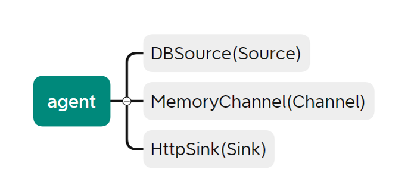

#### DBSource

代码位置:`~/agent/db_source.py`
`DBSource`承担数据采集的功能，其承担的三个 task 可以在 agent_main()部分直观的看到,分别为`database_exporter`,`os_exporter`,`wdr`。该三个 task 的代码位于 anomaly_detection/task 中.


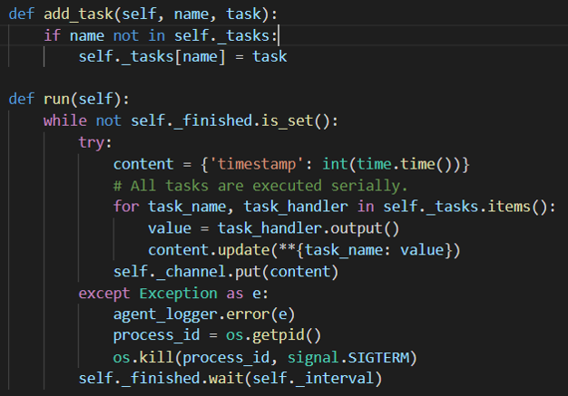

在 metric_agent()中的使用

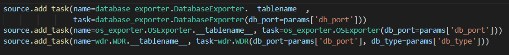

##### os_exporter

负责收集部署 opengauss 的设备上系统的部分性能数据。

|          对象方法          |                 对应实现                  |
| :------------------------: | :---------------------------------------: |
| cpu_usage()/memory_usage() |          linux 命令 ps -ux 获取           |
|    io_read()/io_write()    |          linux 命令 pidstat 获取          |
|         io_wait()          |                iostat 获取                |
|        disk_space()        | 通过 sql 获取路径，再通过命令 du -sh 获取 |

可以看到该 task 收集的数据包括 cpu 使用率，io 读写，io 等待，内存使用以及硬盘空间存储部分。

##### DatabaseExporter

负责收集数据库方面的性能数据。
| 对象方法 | 对应实现 |
|:---:|:---:|
|guc*parameter()|通过 sql 语句查询 pg_setting 中的数据，包括工作内存，共享缓冲区的大小以及最大的连接数量|
|current_connections()|select count(1) from pg_stat_activity|
|gps()每秒事务量|通过 sql 语句从 gs_sql_count 中获取 select/update/insert/delete 计数，间隔 0.1s 采样，乘以 10 作为结果|
|process()|linux 命令 ps -aux 获取进程信息，通过分割筛选等处理获取进程数据，返回 key 为`(pid)*(process)`,value为`(cpu_usage:memory_usage)`的字典| |temp_file()|sql获取路径后检查临时数据文件夹pgsql_tmp是否存在，返回`t`/`f`

##### WDR(`Workload Diagnosis Report`)

WDR 基于两次不同时间点系统的性能快照数据，生成两个时间点之间的性能表现报表，用于诊断数据库内核的性能故障。而该部分的 wdr 相关的仅仅是一小部分，`wdr`中`summary`级和`detail`级别的性能数据比起内置的这部分数据要丰富的多。该 task 模块中主要通过 sql 语句进行计数器的查询

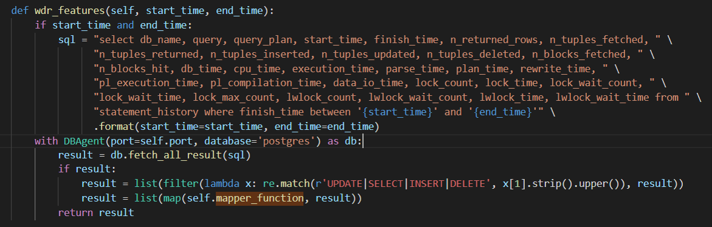

#### MemoryChannel

代码位置:`~/agent/channel.py`
整体为一个存放数据的队列，结构比较简单

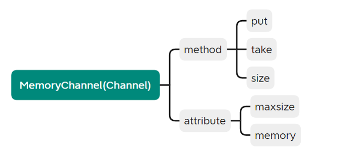

| 对象方法 |                         对应实现                          |
| :------: | :-------------------------------------------------------: |
|  put()   | 尝试向队列中放置数据，超过最大限度时 log 提醒并舍去新数据 |
|  take()  |                    数据出列并返回其值                     |
|  size()  |                      返回队列数据量                       |

#### HttpSink

代码位置:~/agent/sink.py
其从`MemoryChannel`获取数据，并根据 metric_agent.py 中提供的协议`ssl`/`http`进行转发，重试次数为 5 次，间隔 1s

```python
def process(self):
    agent_logger.info('Begin send data to {url}.'.format(url=self._url))
    while self.running:
        contents = self._channel.take()
        if not contents:
            time.sleep(0.5)
            continue

        contents.update(**{'flag': {'host': self.db_host, 'port': self.db_port, 'type': self.db_type}})
        retry_times = 5
        while retry_times:
            try:
                req = request.Request(self._url, headers=_JSON_HEADER,
                    data=json.dumps(contents).encode('utf-8'),
                    method='POST')
                request.urlopen(req, context=self.context)
                break
            except Exception as e:
                agent_logger.error("{error}, retry...".format(error=str(e)))
                retry_times -= 1
                if not retry_times:
                    raise
            time.sleep(1.0)
        time.sleep(self._interval)
```

### Detector

代码位置: `~/detector`

detector 模块负责数据预测与异常检测，从代码的结构上看，可以分为 3 个部分，即`algorithm`，`service`和`tools`,负责整合组织各个模块进行协作部分的代码位于~/metric_detector.py 中。


#### receiver

代码位置:`~/detector/service/resource/receiver.py`

`receiver`为 service 部分中，其功能为接受和存储获取到的性能数据。其中 agent 收集到的三部分 tasks 数据`os_exporter`,`database_exporter`以及`wdr`通过 sqlite 存储在本地。
数据接收:


数据存储：

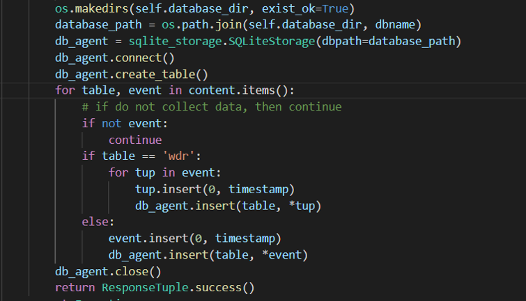

#### SQLiteStorage

代码位置:~/detector/service/storage/sqlite_storage.py
`SQLiteStorage`实现了一种通过 SQLite 进行本地化存储数据的方式，该类主要是加载 sql 配置，并封装了一些需要的各种 sql 操作以使用,如下:
|方法|对应功能|
|:---:|:---:|
|select_timeseries_by_timestamp|按照时间戳获取最近一段时间的数据|
|select_timeseries_by_number|按照编号获取最近一段时间的数据|
|load_sql_operation|加载本地 table.json 的 sql 操作|
|get_latest_timestamp|获取最新的时间戳|

##### table.json

位于`/tools/anomaly_detection` 下，为该部分实现时加载的 sql 配置文件

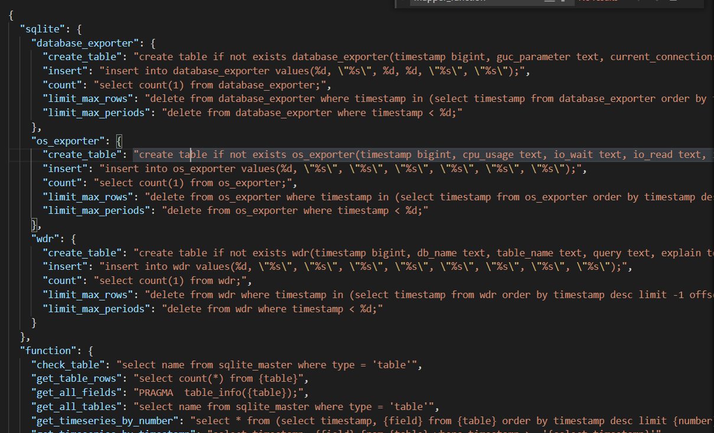

#### algorithm

代码位置:`~/detector/algorithm`
`algorithm`为时序预测算法部分，其包括`arima`和`prophet`两套时间序列预测算法框架，`model`中的`AlgModel`为算法的父类，也提供了使用自定义算法时的模板,使用时若未指定算法会默认使用`auto_arima`.

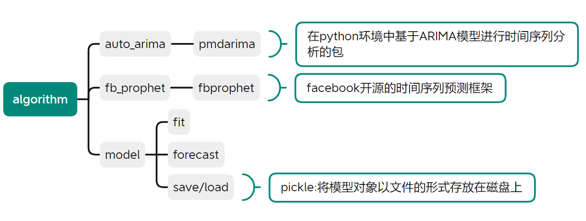

|   对象方法    |                           实现功能                            |
| :-----------: | :-----------------------------------------------------------: |
|     fit()     | 输入时序数据 list\[\[[[timestamp]]],\[[[value]]]]进行模型训练 |
|  forecast()   |   给定时间期间[[period]],[[freq]]进行数据预测，返回时序数据   |
| save()/load() |                通过`pickle`库来加载、存放模型                 |

##### fit():

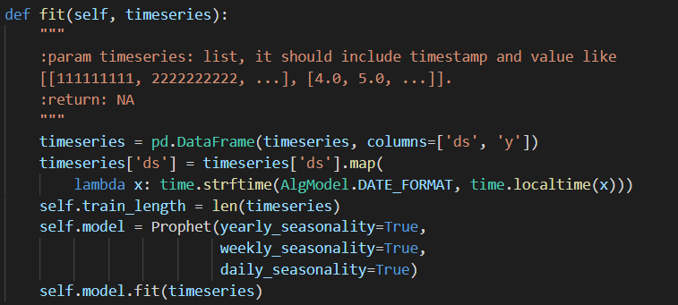

##### forecast():

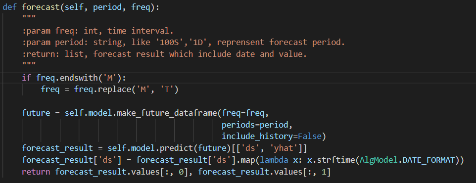

#### trend

包括`forecast`和`detect`模块，提供时序数据预测与基于阈值的异常检测报警功能

##### forecast

代码位置:`~/detector/tools/trend/forecast.py`

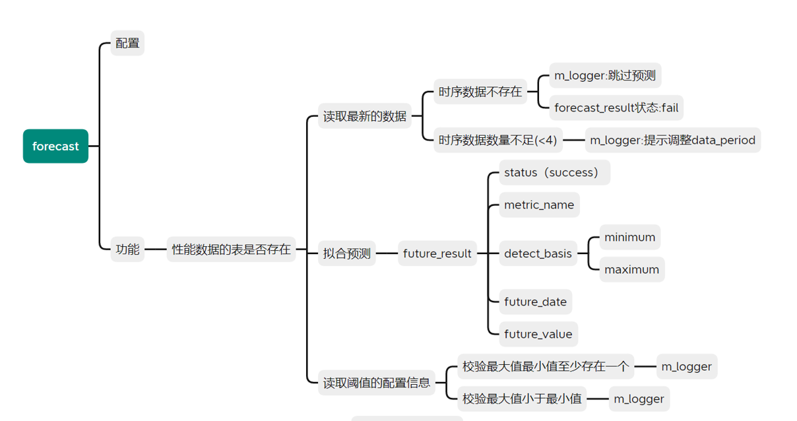

该模块功能为读取时序数据(数量最少不低于设定值[[minimum_timeseries_length]])，并通过选定的预测算法进行拟合预测，生成数据`future_reselt`([[status]],[[metric_name]],[[detect_basis]] ([[minimum]],[[maximum]]),[[future_date]],[[future_value]])提供处理

##### detect

代码位置:`~/detector/tools/trend/detect.py`

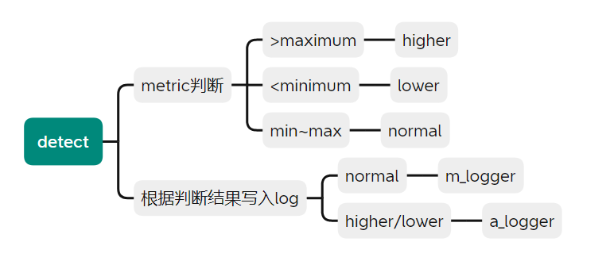

该模块根据`forecast`封装后的数据以及配置中设定的数据阈值进行判断，正常的数据写入[[m_logger]],检测异常的数据，即[[higher]],[[lower]]写入[[a_logger]]警示。
