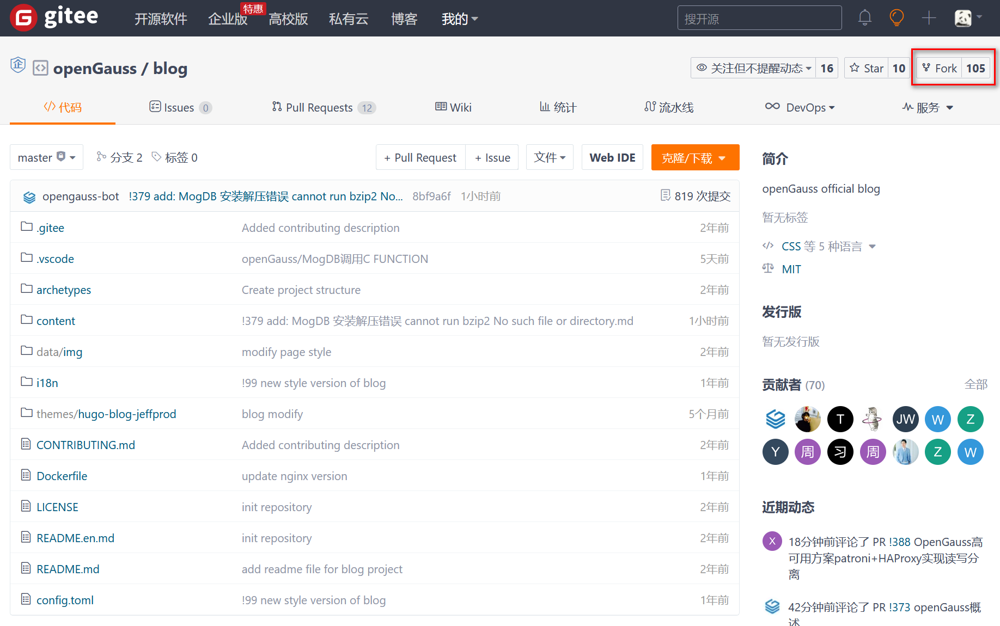
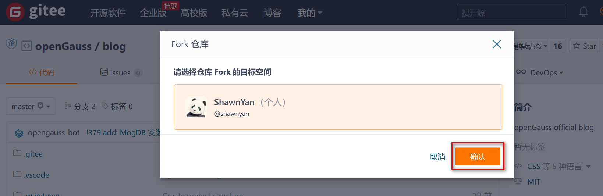
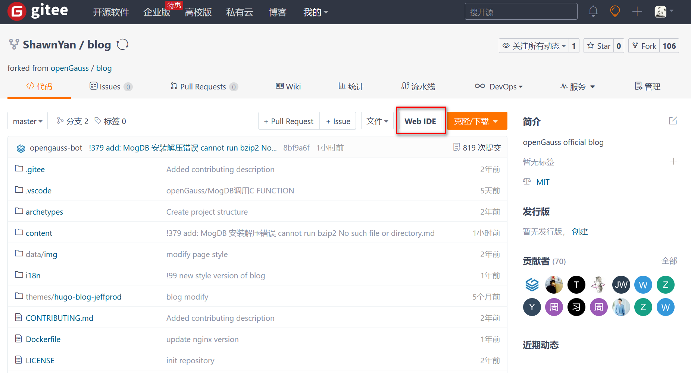
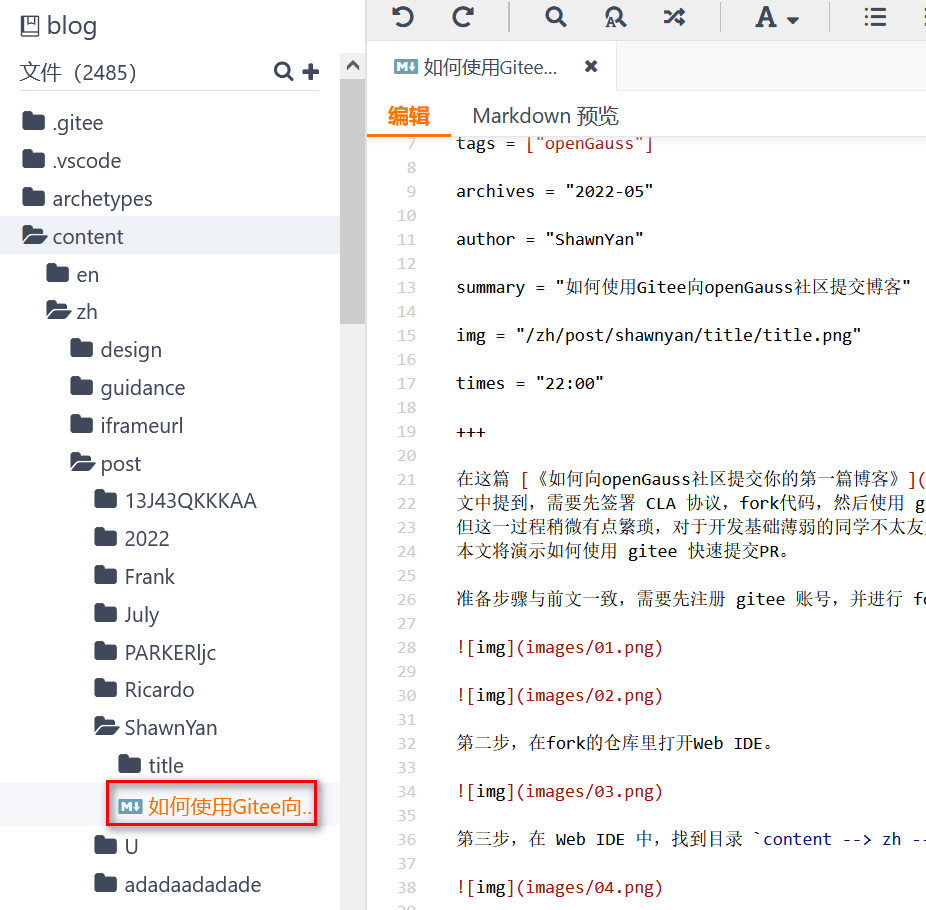
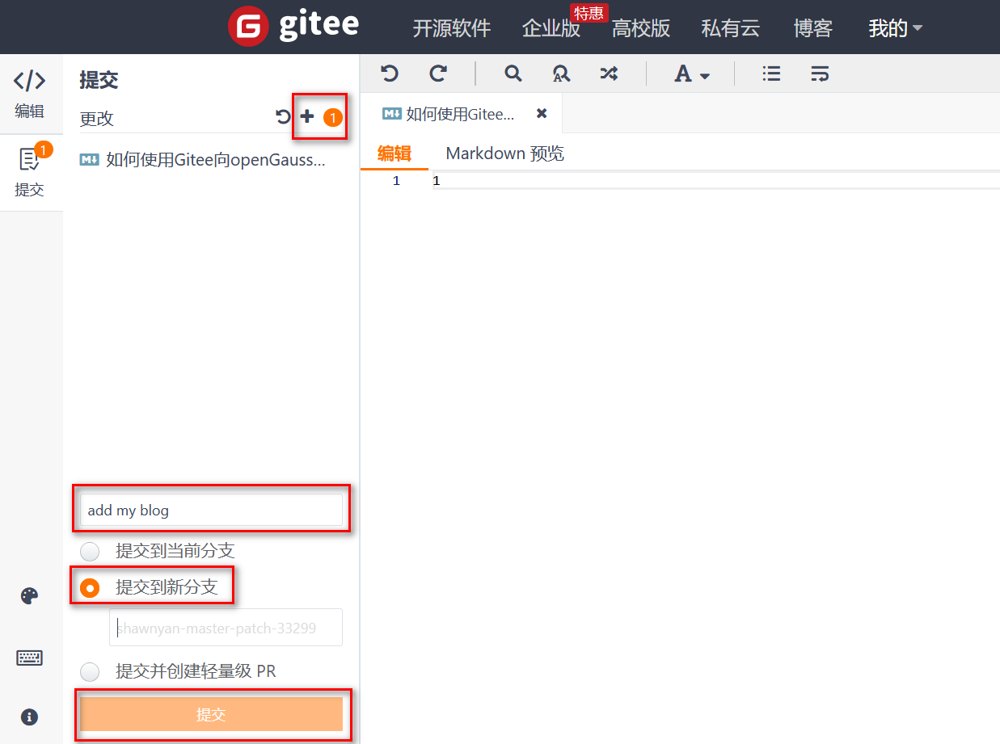
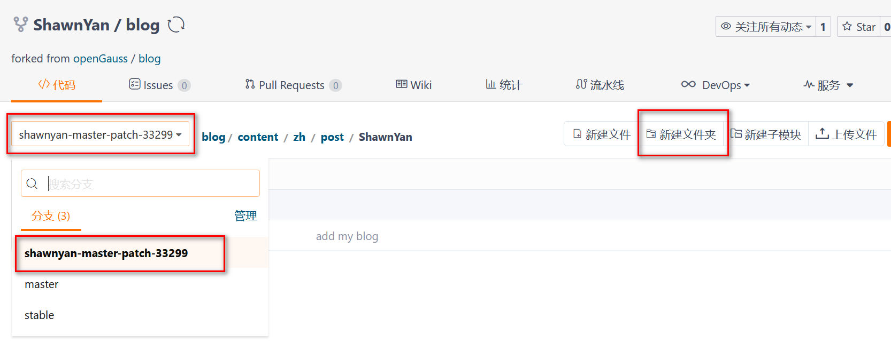
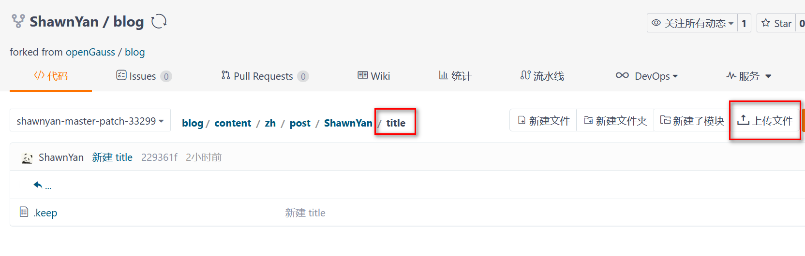
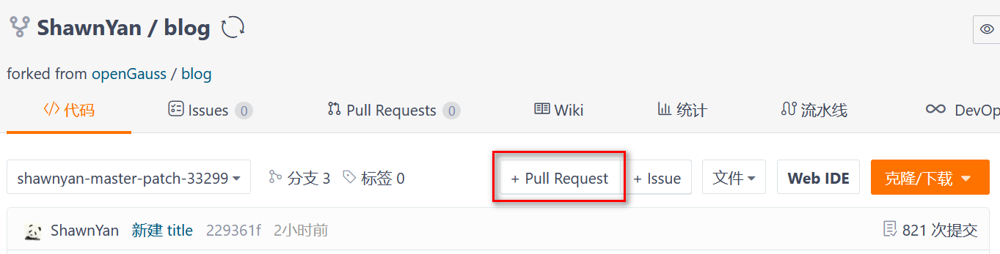
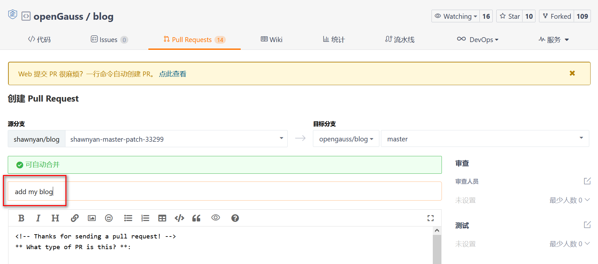

在这篇 [《如何向 openGauss 社区提交你的第一篇博客》](https://mp.weixin.qq.com/s/o-I2NV_perAvI7mOkUqmSg) 文章中，已经介绍了如何向 openGauss 社区提交一篇博客。
文中提到，需要先签署 CLA 协议，fork 代码，然后使用 git 下载代码，编辑后再上传，最后提交 PR，等待合并到 master。
但这一过程稍微有点繁琐，对于开发基础薄弱的同学不太友好。
本文将演示如何使用 gitee 快速提交 PR。

准备步骤与前文一致，需要先注册 gitee 账号，并进行 fork。

第二步，在 fork 的仓库里打开 Web IDE。

第三步，在 Web IDE 中，找到目录 `content --> zh --> post`，创建自己的文件夹。

第四步，鼠标右击刚才新建的文件夹，点击创建文件，然后将已经准备好的 markdown 格式的文章，复制到右侧编辑框。
这里提醒一下，文章复制到编辑框即保存，不需要额外的操作。

第五步，文章编辑完成后，点击提交，点击 “+” 确认保存，下面写简短的提交信息，这里写的是“add my blog”，点击“提交到新分支”，IDE 会自动创建一个分支名，最后点击“提交”即可。

第六步，回到刚才 fork 后的页面，选择刚才新建的分支 `shawnyan-master-patch-33299`，并在文件夹 `blog/content/zh/post/ShawnYan` 下新建文件夹 `title`，用于存放头图。

第七步，在 `title` 文件夹下，点击“上传文件”，将准备好的头图上传。
到此，博客编辑工作完成，下一步提交 PR。

第八步，提交 PR。点击 “+ Pull Request” 按钮。在跳转后的页面，只需要填写 PR 名即可，如本例中填写 `add my blog`，其他使用默认值。

至此，一篇博客就已经提交 PR 了，接下来耐心等待社区的 Reviewer 进行合并，待合并完成且博客站点发版后，即可在[这里](https://opengauss.org/zh/blogs/blogs.html)看到自己提交的文章了。
