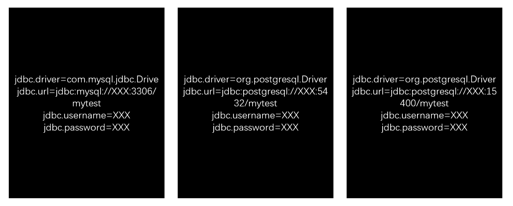
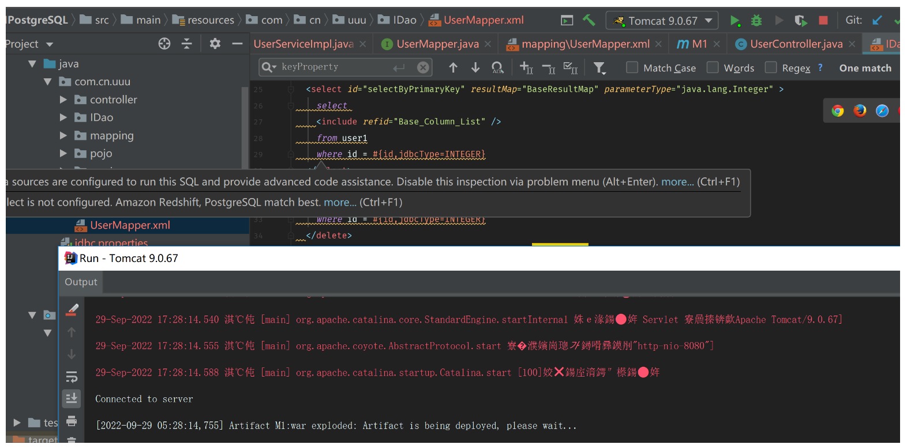
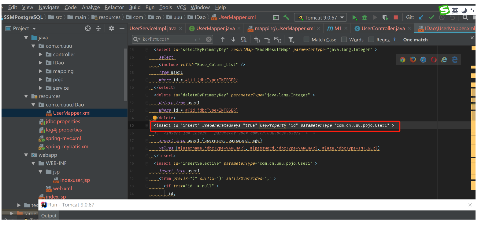

## SSM 介绍

SSM（Spring+SpringMVC+MyBatis）框架集由 Spring、MyBatis 两个开源框架整合而成（SpringMVC 是 Spring 中的部分内容），常作为数据源较简单的 web 项目的框架。

### Spring

Spring 就像是整个项目中装配 bean 的大工厂，在配置文件中可以指定使用特定的参数去调用实体类的构造方法来实例化对象。也可以称之为项目中的粘合剂。
Spring 的核心思想是 IoC（控制反转），即不再需要程序员去显式地`new`一个对象，而是让 Spring 框架帮你来完成这一切。

### SpringMVC

SpringMVC 在项目中拦截用户请求，它的核心 Servlet 即 DispatcherServlet 承担中介或是前台这样的职责，将用户请求通过 HandlerMapping 去匹配 Controller，Controller 就是具体对应请求所执行的操作。SpringMVC 相当于 SSH 框架中 struts。

### mybatis

mybatis 是对 jdbc 的封装，它让数据库底层操作变的透明。mybatis 的操作都是围绕一个 sqlSessionFactory 实例展开的。mybatis 通过配置文件关联到各实体类的 Mapper 文件，Mapper 文件中配置了每个类对数据库所需进行的 sql 语句映射。在每次与数据库交互时，通过 sqlSessionFactory 拿到一个 sqlSession，再执行 sql 命令。
页面发送请求给控制器，控制器调用业务层处理逻辑，逻辑层向持久层发送请求，持久层与数据库交互，后将结果返回给业务层，业务层将处理逻辑发送给控制器，控制器再调用视图展现数据。

## SSM 搭配的数据库

无庸置疑，SSM 经常搭配的数据库是 MySQL 或者是 Postgresql，而国内使用 MySQL 的人比 Postgresql 的人多， 所以本文主要内容关于 SSM DEMO 已经搭配用上 MySQL，系统本身可以注册写入数据入库，可以从库中读取数据进行登录。

## SSM demo 代码

经过测试对比，SSM DEMO 代码基于三个不同的数据库，除了 JDBC 连接串不同，如下。


另外最大的不同就是数据库的 ID 自增机制不同，ID 自增机制是数据库的一项基本功能，我们非常重视这一点，这个不同会不会导致 DEMO 代码要做相关的适配，好听叫做适配，不好听叫做业务侵入。

我们现在开发的 SSM DEMO 代码是在 MySQL 的基础上开发，优先满足了 MySQL。

### Postgresql

如果把 MySQL 改换成 Postgresql ，运行程序的会报错，如下

```bash
org.springframework.web.util.NestedServletException: Request processing failed; nested exception is
org.springframework.jdbc.UncategorizedSQLException:
### Error updating database.  Cause: org.postgresql.util.PSQLException: Returning autogenerated keys is
only supported for 8.2 and later servers.
### SQL: insert into user1 (username, password, age)     values (?, ?, ?)
### Cause: org.postgresql.util.PSQLException: Returning autogenerated keys
 is only supported for 8.2 and later servers.

```

笔者用的是 postgresql12，经过网上查阅 ，mybatis 的定义配置必须要更改。

```
  <insert id="insert" useGeneratedKeys="true" keyProperty="id" parameterType="com.cn.uuu.pojo.User1" >

```

==useGeneratedKeys="true" keyProperty="id"摘掉==改换成

```
  <insert id="insert"  parameterType="com.cn.uuu.pojo.User1" >

```

**重新在 idea 运行 tomcat9**



如下，发现数据能够写入了，但是写入的数据没有 id 列为空值。

```bash
mytest=# select * from user1;
 id | username  | password  | age
----+-----------+-----------+-----
  1 | user1     | password1 |  18
    | hexin.xue | cxc       |  25

```

**这是由于 postgresql 没有自动增加 id 机制的功能，所以数值一直为空**。 如果要实现自增 ID,它是通过 sequence 去实现增加 ID 的。

两个方法是给相关表增加 sequence，一种是已建表的基础上增加 sequence 实现增加 ID

```sql
create sequence public.userid_seq start with 1 increment by 1 no minvalue no maxvalue cache 1;
alter sequence public.userid_seq owner to henley;
alter table user1 alter column id set default nextval('public.userid_seq');
insert into user1 (username, password, age)     values ('username1', 'password1', 100);

```

另外一种重建表，建表就实现

```sql
CREATE SEQUENCE sq_user_id  START 1   INCREMENT 1  CACHE 20;
create table  user1(id int NOT NULL DEFAULT nextval('sq_user_id') ,
username  varchar(50),password  varchar(50),age  int);
```

建表后如果还有问题 ，下面再补刀

```sql
alter sequence public.sq_user_id owner to henley;
alter table user1 alter column id set default nextval('public.sq_user_id');

```

增加 sequence 后，写入数据后 ID 例有值了。

### OpenGauss

依然是同样代码，把 jdbc 的连接串改成 OpenGauss， 我们启动 tomcat，加载服务，我们惊喜的发现没有报错。


```
  <insert id="insert" useGeneratedKeys="true" keyProperty="id" parameterType="com.cn.uuu.pojo.User1" >
```

此处在 postgresql12 需要更改，在 opengauss3 不需要任何更改，spring 指向的应用层没有报错。

但是数据库底层 ID 列的数据仍然空值，OpenGauss 也和 Postgresql 一样，都是用 sequence 去实现 ID 的自增长。

```sql
create sequence public.userid_seq start with 1 increment by 1
 no minvalue no maxvalue cache 1;
alter sequence public.userid_seq owner to henley;
alter table user1 alter column id set default nextval('public.userid_seq');

```

## 最后总结

这是 SSM 开发中比较低端的 DEMO 代码，但是从中可见 openGauss 用心的包容,在接口层适配了 mybatis,遇到自增 ID 提高了容错性，相对于 postgresql 多了一道方便。

## 体验源代码

https://gitee.com/angryart/ssm-opengauss
