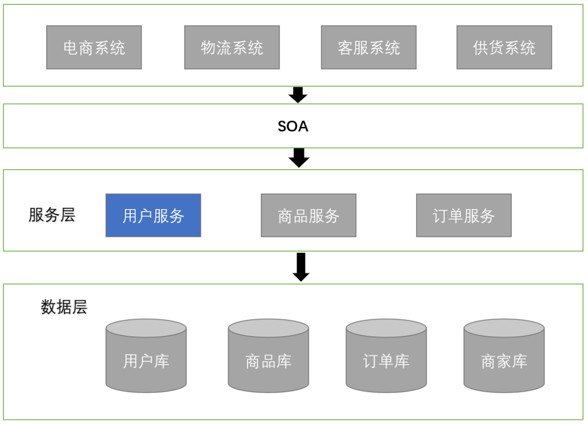
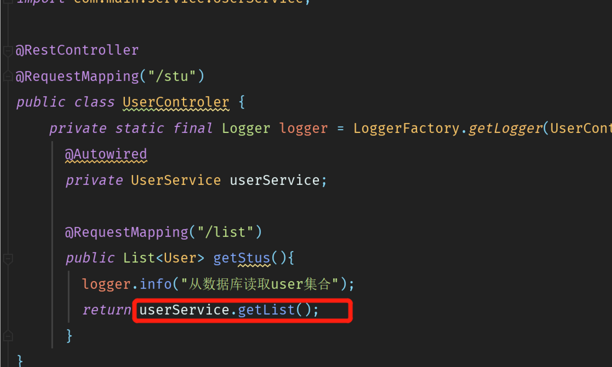
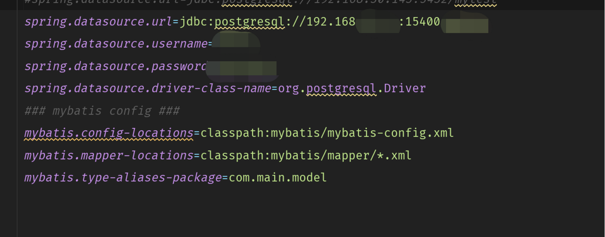
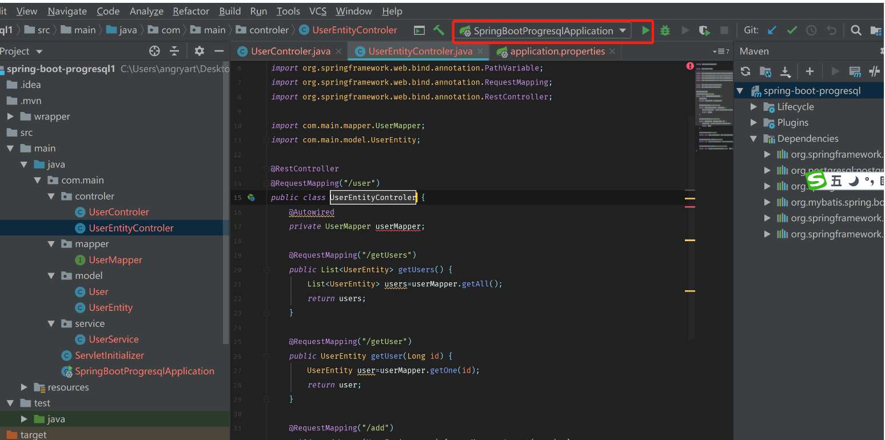
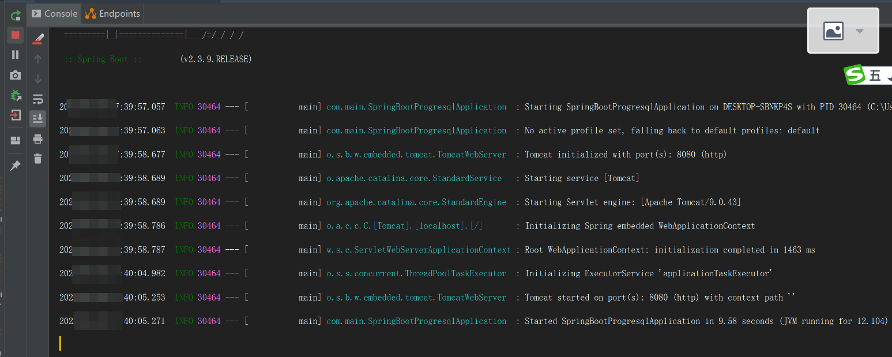
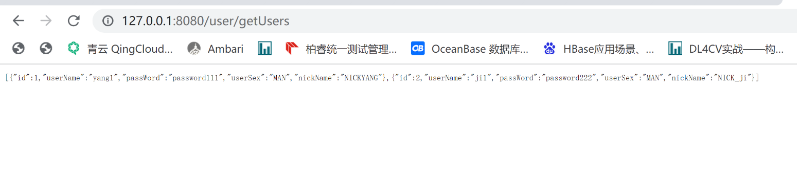
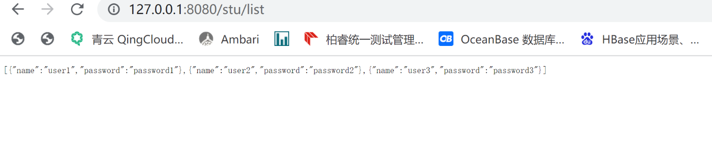

本文介绍如何快速安装 OpenGauss3，OpenGauss3 的安装这是笔者浓缩提炼的，并且在 SpringBoot 中集成使用 OpenGauss3 数据库。

## 单机版 openGauss3 快速环境安装

```shell
groupadd dbgroup
useradd -g dbgroup omm # 可后面安装时创建
passwd omm  #设置密码为Gauss_1234

```

创建安装程序目标目录

```shell
mkdir  /home/omm/opengauss3
chown -R omm:dbgroup /home/omm/opengauss3

```

下载 opengauss3.0.0

```shell
mkdir  /opengauss3
cd   /opengauss3
wget  https://opengauss.obs.cn-south-1.myhuaweicloud.com/3.0.0/x86/openGauss-3.0.0-CentOS-64bit-all.tar.gz
```

解压文件

```bash
tar -zvxf openGauss-3.0.0-CentOS-64bit-all.tar.gz
tar zxvf   openGauss-3.0.0-CentOS-64bit-cm.tar.gz
tar zxvf   openGauss-3.0.0-CentOS-64bit-om.tar.gz
```

设置 opengauss 集群配置文件，这里设单点安装

```xml
[root@enmoedu1 opengauss3]# cat cluster_config.xml
<?xml version="1.0" encoding="UTF-8"?>
<ROOT>
    <!-- openGauss整体信息 -->
    <CLUSTER>
        <!-- 数据库名称 -->
        <PARAM name="clusterName" value="dbCluster" />
        <!-- 数据库节点名称(hostname) -->
        <PARAM name="nodeNames" value="hostname" />
        <!-- 数据库安装目录-->
        <PARAM name="gaussdbAppPath" value="/home/omm/opengauss3/install/app" />
        <!-- 日志目录-->
        <PARAM name="gaussdbLogPath" value="/var/log/omm" />
        <!-- 临时文件目录-->
        <PARAM name="tmpMppdbPath" value="/home/omm/opengauss3/tmp" />
        <!-- 数据库工具目录-->
        <PARAM name="gaussdbToolPath" value="/home/omm/opengauss3/install/om" />
        <!-- 数据库core文件目录-->
        <PARAM name="corePath" value="/home/omm/opengauss3/corefile" />
        <!-- 节点IP，与数据库节点名称列表一一对应 -->
        <PARAM name="backIp1s" value="[root@enmoedu1 opengauss3]# cat cluster_config.xml
<?xml version="1.0" encoding="UTF-8"?>
<ROOT>
    <!-- openGauss整体信息 -->
    <CLUSTER>
        <!-- 数据库名称 -->
        <PARAM name="clusterName" value="dbCluster" />
        <!-- 数据库节点名称(hostname) -->
        <PARAM name="nodeNames" value="hostname" />
        <!-- 数据库安装目录-->
        <PARAM name="gaussdbAppPath" value="/home/omm/opengauss3/install/app" />
        <!-- 日志目录-->
        <PARAM name="gaussdbLogPath" value="/var/log/omm" />
        <!-- 临时文件目录-->
        <PARAM name="tmpMppdbPath" value="/home/omm/opengauss3/tmp" />
        <!-- 数据库工具目录-->
        <PARAM name="gaussdbToolPath" value="/home/omm/opengauss3/install/om" />
        <!-- 数据库core文件目录-->
        <PARAM name="corePath" value="/home/omm/opengauss3/corefile" />
        <!-- 节点IP，与数据库节点名称列表一一对应 -->
        <PARAM name="backIp1s" value="IP"/>
    </CLUSTER>
    <!-- 每台服务器上的节点部署信息 -->
    <DEVICELIST>
        <!-- 节点1上的部署信息 -->
        <DEVICE sn="hostname">
            <!-- 节点1的主机名称 -->
            <PARAM name="name" value="hostname"/>
            <!-- 节点1所在的AZ及AZ优先级 -->
            <PARAM name="azName" value="AZ1"/>
            <PARAM name="azPriority" value="1"/>
            <!-- 节点1的IP，如果服务器只有一个网卡可用，将backIP1和sshIP1配置成同一个IP -->
            <PARAM name="backIp1" value="IP"/>
            <PARAM name="sshIp1" value="IP"/>
            <!--dbnode-->
            <PARAM name="dataNum" value="1"/>
            <PARAM name="dataPortBase" value="15400"/>
            <PARAM name="dataNode1" value="/home/omm/opengauss3/install/data/dn"/>
            <PARAM name="dataNode1_syncNum" value="0"/>
        </DEVICE>
    </DEVICELIST>
</ROOT>"/>
    </CLUSTER>
    <!-- 每台服务器上的节点部署信息 -->
    <DEVICELIST>
        <!-- 节点1上的部署信息 -->
        <DEVICE sn="hostname">
            <!-- 节点1的主机名称 -->
            <PARAM name="name" value="hostname"/>
            <!-- 节点1所在的AZ及AZ优先级 -->
            <PARAM name="azName" value="AZ1"/>
            <PARAM name="azPriority" value="1"/>
            <!-- 节点1的IP，如果服务器只有一个网卡可用，将backIP1和sshIP1配置成同一个IP -->
            <PARAM name="backIp1" value="IP"/>
            <PARAM name="sshIp1" value="IP"/>
            <!--dbnode-->
            <PARAM name="dataNum" value="1"/>
            <PARAM name="dataPortBase" value="15400"/>
            <PARAM name="dataNode1" value="/home/omm/opengauss3/install/data/dn"/>
            <PARAM name="dataNode1_syncNum" value="0"/>
        </DEVICE>
    </DEVICELIST>
</ROOT>
```

前置系统软件包

```bash
yum install -y epel-release
yum install -y bzip2 # 安装bzip2用于后面的解压openGauss安装包
sed  -i 's/源IP/目标IP/g'  cluster_config.xml
sed  -i 's/hdp1/你的主机名/g'  cluster_config.xml

```

初始化系统安装配置参数，以必须管理员 root 的权限运行，进入 opengauss3 运行初始化程序

```bash
[root@hdp1 ~]# cd /opengauss3/
[root@hdp1 opengauss3]# ./script/gs_preinstall   -U omm -G dbgroup -X  ./cluster_config.xml
Parsing the configuration file.
Successfully parsed the configuration file.
Installing the tools on the local node.
Successfully installed the tools on the local node.
Setting host ip env
Successfully set host ip env.
Are you sure you want to create the user[omm] (yes/no)? no
Preparing SSH service.
Successfully prepared SSH service.
Checking OS software.
Successfully check os software.
Checking OS version.
Successfully checked OS version.
Creating cluster's path.
Successfully created cluster's path.
Set and check OS parameter.
Setting OS parameters.
Successfully set OS parameters.
Warning: Installation environment contains some warning messages.
Please get more details by "/opengauss3/script/gs_checkos -i A -h hdp1 --detail".
Set and check OS parameter completed.
Preparing CRON service.
Successfully prepared CRON service.
Setting user environmental variables.
Successfully set user environmental variables.
Setting the dynamic link library.
Successfully set the dynamic link library.
Setting Core file
Successfully set core path.
Setting pssh path
Successfully set pssh path.
Setting Cgroup.
Successfully set Cgroup.
Set ARM Optimization.
No need to set ARM Optimization.
Fixing server package owner.
Setting finish flag.
Successfully set finish flag.
Preinstallation succeeded.
```

下面要以 omm 的用户正式运行安装程序，首先必须把权限赋给 omm

```shell
chown -R omm:dbgroup   /opengauss3

切换到 omm，在/opengauss3目录下运行安装目录
[root@hdp1 opengauss3]# su  omm
[omm@hdp1 opengauss3]$   ./script/gs_install -X  ./cluster_config.xml
Parsing the configuration file.
Check preinstall on every node.
Successfully checked preinstall on every node.
Creating the backup directory.
Successfully created the backup directory.
begin deploy..
Installing the cluster.
begin prepare Install Cluster..
Checking the installation environment on all nodes.
begin install Cluster..
Installing applications on all nodes.
Successfully installed APP.
begin init Instance..
encrypt cipher and rand files for database.
Please enter password for database:
Please repeat for database:
begin to create CA cert files
The sslcert will be generated in /home/omm/opengauss3/install/app/share/sslcert/om
NO cm_server instance, no need to create CA for CM.
Cluster installation is completed.
Configuring.
Deleting instances from all nodes.
Successfully deleted instances from all nodes.
Checking node configuration on all nodes.
Initializing instances on all nodes.
Updating instance configuration on all nodes.
Check consistence of memCheck and coresCheck on database nodes.
Configuring pg_hba on all nodes.
Configuration is completed.
Successfully started cluster.
Successfully installed application.
end deploy..
```

验证服务进程是否激 活

```bash
[root@hdp1 ~]# ps -eaf | grep omm
root     14898 32160  0 15:55 pts/1    00:00:00 su omm
omm      14899 14898  0 15:55 pts/1    00:00:00 bash
omm      19411     1  9 16:08 ?        00:00:02 /home/omm/opengauss3/install/app/bin/gaussdb -D
/home/omm/opengauss3/install/data/dn
root     19784   360  0 16:09 pts/2    00:00:00 grep --color=auto omm

```

命令行登录

```bash
gsql -d postgres -p 15400

```

## 安装 opengauss3 注意事项

之前安装 mogdb，影响了 opengauss3 的环境，/home/omm/.bashrc 里面记录了安装后的变量，如果要卸载 opengauss，必须要把.bashrc 下面所有的东西都去掉。

```bash
# User specific aliases and functions
export GPHOME=/home/omm/opengauss3/install/om
export PATH=$GPHOME/script/gspylib/pssh/bin:$GPHOME/script:$PATH
export LD_LIBRARY_PATH=$GPHOME/lib:$LD_LIBRARY_PATH
export PYTHONPATH=$GPHOME/lib
export GAUSSHOME=/home/omm/opengauss3/install/app
export PATH=$GAUSSHOME/bin:$PATH
export LD_LIBRARY_PATH=$GAUSSHOME/lib:$LD_LIBRARY_PATH
export S3_CLIENT_CRT_FILE=$GAUSSHOME/lib/client.crt
export GAUSS_VERSION=3.0.0
export PGHOST=/home/omm/opengauss3/tmp
export GAUSSLOG=/var/log/omm/omm
umask 077
export GAUSS_ENV=2
export GS_CLUSTER_NAME=dbCluster
```

## springBoot 应用集成 OpenGauss

**SOA 是一种粗粒度、松耦合服务架构**，服务之间通过简单、精确定义接口进行通讯，不涉及底层编程接口和通讯模型。SOA 可以看作是 B/S 模型、XML(标准通用标记语言的子集)/Web Service 技术之后的自然延伸，面向服务架构，它可以根据需求通过网络对松散耦合的粗粒度应用组件进行分布式部署、组合和使用。服务层是 SOA 的基础，可以直接被应用调用，从而有效控制系统中与软件代理交互的人为依赖性。

简而言之**SOA 可以消除信息孤岛并实现共享业务重用**，我们通过 SOA 可以打造下图的复杂系统，其中**蓝色用户服务** ，我们可以通过**springboot + OpenGauss** 技术实现。


我们使用 OpenGauss 作为具体数据存储，使用开发工具创建一个数据库 mysqltest，并在 mysqltest 数据库中创建一张表 userennity 和 user1，创建语句如下：

```sql
create table   userentity(
	id int ,
	username  varchar(50),
	password  varchar(50),
	user_sex  varchar(10),
	nick_name  varchar(50)
);

create table  user1(
	id int ,
	name  varchar(50),
	password  varchar(50));


```

DEMO 代码
+---src
| +---main
| | +---java
| | | \---com
| | | \---main
| | | +---controler 具体业务逻辑
| | | +---mapper 定义实现 DAO 的 CRUD 实体操作
| | | +---model 实体类
| | | \---service 实现服务类

注意 UserControler 是首先调用的 service，继而去调用实体操作。


而 UserEntityControler 是通过 mapper 的封装去调用 DAO 的 CRUD 的操作，如下


无论是 UserControler 还是 UserEntityControler 都需要底层数据库对应用支持友好。
确定 opengauss 的用户、密码、端口及相关 IP



启动服务



服务正在运行中


查看用户实体 1



查看用户实体 2


## springboot 集成 opengauss 的 FAQ

### 用户名/密码不对

**spring 报错**

```java
### The error may involve com.main.mapper.UserMapper.getAll
### The error occurred while executing a query
### Cause: org.springframework.jdbc.CannotGetJdbcConnectionException:
Failed to obtain JDBC Connection; nested exception is org.postgresql.util.PSQLException:
不明的原因导致驱动程序造成失败，请回报这个例外。] with root cause
java.lang.NullPointerException: null

```

而 opengauss 内部执行报错

```bash
[omm@enmoedu1 ~]$ gsql -U  henley -h  192.168.30.65 -p  15400
Password for user henley:
gsql: FATAL:  Invalid username/password,login denied.

```

**根本原因分析**
openGauss 默认是 sha256，而登录则设成只允许 md5 登录，所以一直识用户名和密码错误

**解决方法及步骤**
`vi /home/omm/opengauss3/install/data/dn/postgresql.conf`
修改设置
encryption_type = 1

`vi /home/omm/opengauss3/install/data/dn/pg_hba.conf`

增加设置
host all henley 0.0.0.0/0 md5

### 用户没有对表的操作权限

**spring 报错**

```xml
org.postgresql.util.PSQLException: ERROR: permission denied for relation userentity
  详细：N/A

```

**opengauss 报错**

```sql
mytest=> SELECT                   id, userName, passWord, user_sex, nick_name           FROM userentity;
ERROR:  permission denied for relation userentity
DETAIL:  N/A

```

**解决方法及步骤**

以 postgres 的身份登录 root

```sql
[omm@enmoedu1 ~]$ gsql -d postgres -p 15400
gsql ((openGauss 3.0.0 build 02c14696) compiled at 2022-04-01 18:12:34 commit 0 last mr  )
Non-SSL connection (SSL connection is recommended when requiring high-security)
Type "help" for help.

```

**切换到指定的数据库**

```sql
openGauss=# \c mytest;
Non-SSL connection (SSL connection is recommended when requiring high-security)
You are now connected to database "mytest" as user "omm".

```

**执行授权**

```
mytest=# GRANT ALL PRIVILEGES ON  userentity  TO henley;
GRANT

```

授权后能够正常，但是发现一个问题，现在我们是通过 Postgresql 的 jdbc 驱动去访问 OpenGauss 的，OpenGauss 没有自己的原生 jdbc 驱动吗？答案是有的，而且还支持 maven 方式，见下。

```
        <!-- 加载jdbc连接数据库 -->
		<!--<dependency>-->
			<!--<groupId>org.opengauss</groupId>-->
			<!--<artifactId>opengauss-jdbc</artifactId>-->
		<!--</dependency>-->
		<!--<dependency>-->
			<!--<groupId>org.bouncycastle</groupId>-->
			<!--<artifactId>bcprov-jdk15on</artifactId>-->
			<!--<version>1.70</version>-->
		<!--</dependency>-->
```

但是笔者的运气很差，通过 maven 一直无法下载 openGauss 的 core 包，只能通过手动的方式下载。

```shell
wget  https://opengauss.obs.cn-south-1.myhuaweicloud.com/
3.0.0/x86/openGauss-3.0.0-JDBC.tar.gz

```

再在 idea 把 jar 包引入进来，引入步骤 Project Structure --> Project Settings --> Libraries --> Add(alt +insert) --> apply

application.properties 稍微修改一下
==spring.datasource.url=jdbc:opengauss://192.168.30.65:15400/mytest==
==spring.datasource.driver-class-name=org.opengauss.Driver==

```
#spring.datasource.url=jdbc:postgresql://XXXX:5432/mytest
#spring.datasource.url=jdbc:postgresql://XXXX:15400/mytest
spring.datasource.url=jdbc:opengauss://XXXX:15400/mytest
spring.datasource.username=henley
spring.datasource.password=XXXX
spring.datasource.driver-class-name=org.opengauss.Driver
#spring.datasource.driver-class-name=org.postgresql.Driver
### mybatis config ###
mybatis.config-locations=classpath:mybatis/mybatis-config.xml
mybatis.mapper-locations=classpath:mybatis/mapper/*.xml
mybatis.type-aliases-package=com.main.model

```

## 最后总结

openGauss 对业界知名的 spring 支持还算友好，直接用传统的 postgresql 驱动就可以接入使用，也有自己的 opengauss 驱动。如果使用顺利，还可以支持分布式配置、服务路由、负载均衡、熔断限流、链路监控这些功能，事实上在微服务的技术框架上也是支持的。

## 源代码体验下载:

https://gitee.com/angryart/springboot-opengauss
