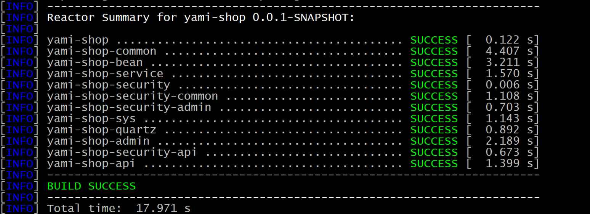
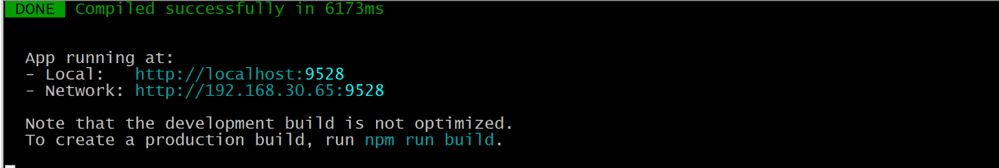
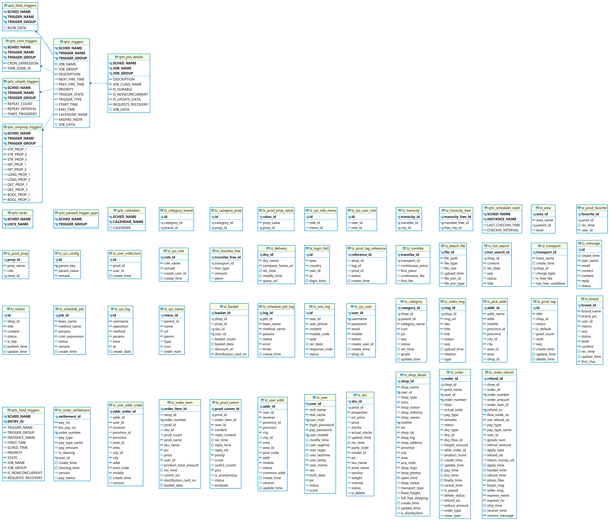
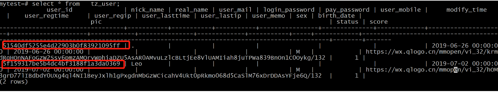
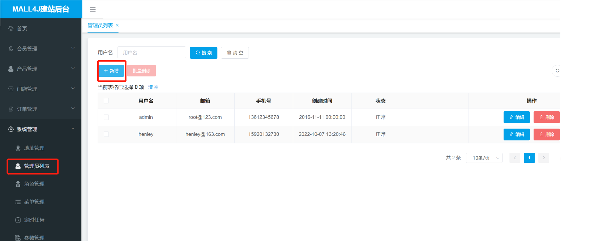
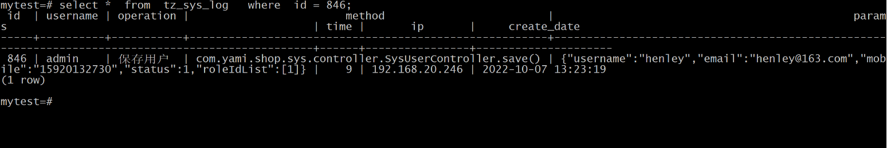
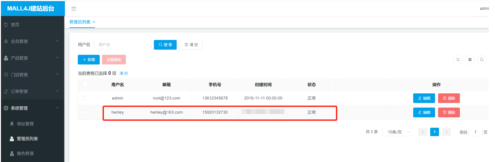
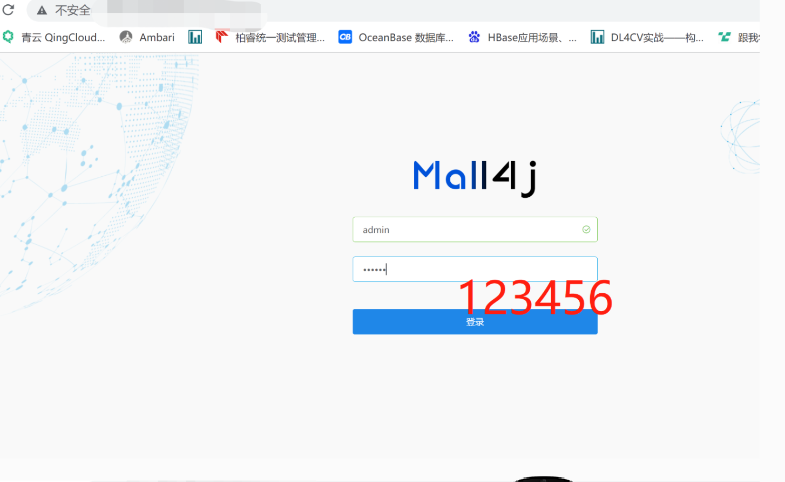
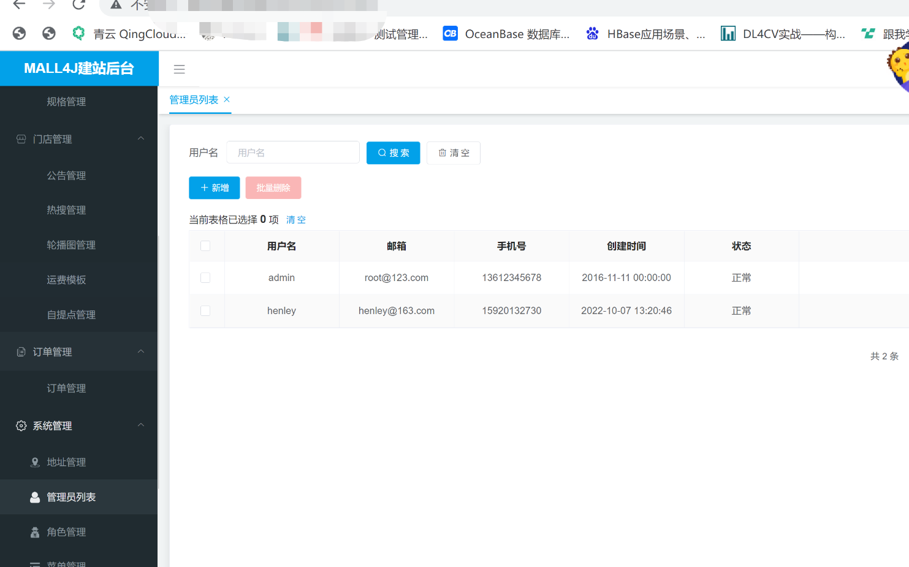

## 系统介绍

Mall4j 是国内领先的电商商城系统源码提供商，是众多知名企业搭建商城的不二选择。Mall4j 商城系统支持企业自营模式，招商模式，O2O 门店模式，满足企业各个发展阶段的商业模式，全面覆盖微信商城、小程序商城、手机触屏版商城、苹果 APP 商城、安卓 APP 商城及 PC 端，统一的数据，能很大程度提高销售利润和提升服务质量，让您一次开店，全通路覆盖。

Mall4j 商城系统可以将企业的资源进行有效的整合，让商家的布局更加广泛、配套更加完善、管理更加成熟。另外，mall4j 商城系统可以帮助企业集合各个渠道的资源，充分利用资源和渠道来提升商城的销量。还有多种营销功能：团购、秒杀、会员积分、优惠券、满减满折等营销玩法，把消费变成了一种“游戏”，有趣，有效果。

## 系统亮点

Mall4j 商城系统功能亮点：
1、系统具备高效的管理功能：商品管理、会员管理、订单管理、统计管理、支付管理、门店管理、库存管理等管理功能；
2、灵活多样的营销赋能模式：满减、团购、秒杀、分销、积分、O2O、优惠券、套餐、赠品等营销方式；
3、多终端适配：支持 PC、H5、小程序、APP（android、IOS）。

Mall4j 商城系统技术亮点：

1. 技术主流，使用最流行框架技术，没有过多的技术债务。
2. 提供全部源码，无封装无加密，没有 license。
3. 更新升级方便，通过 git 私服进行代码合并更新。
4. 代码前后端分离，代码质量高注释清晰，方便二次开发。

## mall4j 商城版本

|  | **开源版**         | **银河版**           | **宇宙版**            | **白洞版**           |          |
| ------------------------------- | ------------------ | -------------------- | --------------------- | -------------------- | -------- |
| **业务模式**                    | B2C                | B2C                  | B2B2C                 | S2B2C                |          |
| **适用群体**                    | 个人、初学者       | 自营店、小规模企业   | 自营+入驻、中小型企业 | 自营+供应商/商家入驻 |          |
| **加密程度**                    | 全开源，无加密     | 提供全部源码，无加密 | 提供全部源码，无加密  | 提供全部源码，无加密 |          |
| **服务内容**                    | 商业授权           | AGPL3.0 协议         | 永久授权              | 永久授权             | 永久授权 |
| 代码更新                        | Gitee、Github 更新 | Git 私服更新         | Git 私服更新          | Git 私服更新         |          |
| 企业售后群                      | ×                  | √                    | √                     | √                    |          |
| 功能列表                        | √                  | √                    | √                     | √                    |          |
| 技术文档                        | √                  | √                    | √                     | √                    |          |
| 操作手册                        | ×                  | √                    | √                     | √                    |          |
| 合同签约                        | ×                  | √                    | √                     | √                    |          |
| **基础功能**                    | 前后端分离         | √                    | √                     | √                    | √        |
| Spring Cloud 脚手架             | √                  | ×                    | ×                     | √                    |          |
| Spring Boot 脚手架              | √                  | √                    | √                     | √                    |          |
| 权限管理                        | √                  | √                    | √                     | √                    |          |
| 完整下单流程                    | √                  | √                    | √                     | √                    |          |
| 小程序端                        | √                  | √                    | √                     | √                    |          |
| H5 端                           | √                  | √                    | √                     | √                    |          |
| PC 端                           | ×                  | √                    | √                     | √                    |          |
| App 端（iOS、Android）          | ×                  | √                    | √                     | √                    |          |
| 后台管理移动端                  | ×                  | ×                    | √                     | ×                    |          |
| 后台管理 PC 端                  | √                  | √                    | √                     | √                    |          |
| 国际化                          | ×                  | √                    | √                     | ×                    |          |
| **高级功能**                    | 多商家入驻         | √                    | ×                     | √                    | √        |
| 供应商端                        | ×                  | ×                    | ×                     | √                    |          |
| 平台抽佣                        | ×                  | ×                    | √                     | √                    |          |
| PC 端装修                       | ×                  | ×                    | √                     | √                    |          |
| 移动端装修                      | ×                  | ×                    | √                     | √                    |          |
| 优惠券                          | ×                  | √                    | √                     | √                    |          |
| 满减满折                        | ×                  | √                    | √                     | √                    |          |
| 拼团活动                        | ×                  | √                    | √                     | √                    |          |
| 秒杀活动                        | ×                  | √                    | √                     | √                    |          |
| 商品预售                        | ×                  | √                    | √                     | √                    |          |
| 优惠套餐                        | ×                  | ×                    | √                     | √                    |          |
| 赠品                            | ×                  | ×                    | √                     | √                    |          |
| 分销模块                        | ×                  | √                    | √                     | √                    |          |
| 会员管理                        | ×                  | √                    | √                     | √                    |          |
| 积分商城                        | ×                  | √                    | √                     | √                    |          |
| 虚拟商品                        | ×                  | ×                    | √                     | √                    |          |
| 用户自提                        | ×                  | √                    | √                     | ×                    |          |
| 同城配送                        | ×                  | √                    | √                     | ×                    |          |
| 小程序直播                      | ×                  | √                    | √                     | √                    |          |
| 客服系统（IM）                  | ×                  | √                    | √                     | √                    |          |
| 进销存管理                      | ×                  | ×                    | √                     | √                    |          |
| 客户标签与营销                  | ×                  | √                    | √                     | √                    |          |
| 数据分析                        | ×                  | √                    | √                     | √                    |          |
| 数据报表                        | ×                  | √                    | √                     | √                    |          |
| 消息推送                        | ×                  | √                    | √                     | √                    |          |

## 技术组件

| 技术                   | 版本          | 说明                                     |
| ---------------------- | ------------- | ---------------------------------------- |
| Spring Boot            | 2.1.6.RELEASE | MVC 核心框架                             |
| Spring Security oauth2 | 2.1.5.RELEASE | 认证和授权框架                           |
| MyBatis                | 3.5.0         | ORM 框架                                 |
| MyBatisPlus            | 3.1.0         | 基于 mybatis，使用 lambda 表达式的       |
| Swagger-UI             | 2.9.2         | 文档生产工具                             |
| Hibernator-Validator   | 6.0.17.Final  | 验证框架                                 |
| redisson               | 3.10.6        | 对 redis 进行封装、集成分布式锁等        |
| hikari                 | 3.2.0         | 数据库连接池                             |
| log4j2                 | 2.11.2        | 更快的 log 日志工具                      |
| fst                    | 2.57          | 更快的序列化和反序列化工具               |
| orika                  | 1.5.4         | 更快的 bean 复制工具                     |
| lombok                 | 1.18.8        | 简化对象封装工具                         |
| hutool                 | 4.5.0         | 更适合国人的 java 工具集                 |
| swagger-bootstrap      | 1.9.3         | 基于 swagger，更便于国人使用的 swagger u |

| 工具  | 版本 |
| ----- | ---- |
| jdk   | 1.8+ |
| mysql | 5.7+ |
| redis | 3.2+ |

## 技术架构

SOA 会通过 ESB 来作为系统和服务之间的通信桥梁，ESB 本身还提供服务地址的管理、不同系统之间的 协议转化和数据格式转化等等。消费者不需要关心目标的服务位置，实现了服务消费者和服务生产者的高度解耦，**SOA 可以消除信息孤岛并实现共享业务重用。**

Mall4j 商城系统则是使用了比起 SOA 还要灵活好用的微服务架构，微服务关注的是解耦，努力降低业务之间的耦合度，实现更多服务的复用，在 DevOps 有更大自由程度的持续交付。Mall4j 商城系统的微服务技术包括 Spring Cloud API 网关、服务注册与发现、配置中心、负载均衡、分布式事务，其它相关技术包括有容器化技术、轻量级虚拟化、容器快速启停、易管理扩展、版本控制、应用安全隔离

## Mall4j 商城系统应用使用范围

### 电商系统

B2C 商城系统 【品牌电商】
单用户商城系统，统一后台管理、多终端覆盖

B2B2C 商城系统【平台电商】
多用户商城系统，自营+多商家入驻电商平台

S2B2C 商城系统【供应链】
融合供应链、为供应商、经销商、零售商赋能

O2O 商城系统【新零售】
线上线下融合，助力传统零食企业转型与发展

### 应用终端

电商平台【PC 端、可视化】
可视化编辑，完善购物体验及商品数据分析

商城小程序【小程序】
轻应用，体验优质，快速抢占移动电商市场

商城 APP【UNIAPP】
IOS、Android 双 APP，聚拢用户购物更便捷

H5 商城【HTML5】
手机浏览器，微信商城、随时随地五单支付。

### 业务场景

社交电商【移动电商】
融合拼团、会员分销等多种前沿社交营销模式

积分商城【留存复购】
结合会员体系 、打造积分运营体系，引老留新

跨境电商【海外】
海外支付，多语言切换，为企业提供跨境方案

直播电商【引流获客】
微信小程序直播+电商模式，低成本变现流量

## Mall4j 商城系统替换因素考虑

Mall4j 商城系统复杂，涉及的技术组件多，我们准备用 OpenGauss 替换 MySQL5.7，改动的的东西涉及项目依赖文件、配置文件、解析文件，尤其数据库的内核能力以及对 应用框架的兼容 程度非常重要，假设开发者要大费周章大面积的改动，或者要动 jar 包的配置，估计 OpenGauss 替换 MySQL5.7 的计划就要搁浅或者放弃了。<mark>**这不仅仅是一个 MySQL5.7 往 openGauss3.0 数据迁移的事，还是业务应用系统往新的数据库适应环境的事，openGauss3.0 必须要输出给力，除了能够替代 MySQL5.7，迁移成本也必须低，运维成本也低**.</mark>

代码结构

```bash
[root@enmoedu1 yami-b2b2c]# tree   -L  1
.
├── CHANGELOG.md
├── compile.sh
├── db
├── doc
├── docker-compose.yml
├── LICENSE
├── log
├── mall4m
├── mall4uni
├── mall4v
├── pom.xml
├── README.md
├── screenshot
├── yami-shop-admin     商城后端接口服务管理系统，数据库操作有关
├── yami-shop-api          商城前端接口调用系统，数据库操作有关
├── yami-shop-bean
├── yami-shop-common      pom.xml含有mysql的调用
├── yami-shop-quartz
├── yami-shop-security
├── yami-shop-service
└── yami-shop-sys      src/main/resources/mapper/SysMenuMapper.xml   数据库操作有关
15 directories, 6 files


```

### pom.xml

/opt/projects/yami-b2b2c/yami-shop-common 目录, pom.xml 内容如下，关于 mysql 的 jdbc 需要注释

```
                <!--<dependency>-->
            <!--<groupId>mysql</groupId>-->
            <!--<artifactId>mysql-connector-java</artifactId>-->
        <!--</dependency>-->

```

改成

```
        <dependency>
            <groupId>org.postgresql</groupId>
            <artifactId>postgresql</artifactId>
            <version>42.2.2</version>
        </dependency>

```

### logback-prod.xml

```
/opt/projects/yami-b2b2c/yami-shop-admin/src/main/resources/logback/logback-prod.xml

/opt/projects/yami-b2b2c/yami-shop-api/src/main/resources/logback/logback-prod.xml
```

里面确定唯一的 PROJECT_PATH

```
<property name="PROJECT_PATH" value="/opt/projects/yami-b2b2c"/>

```

### application-dev.yml 与 application-prod.yml

dev 是开发环境的配置参数
prod 是生产环境的配置参数

```
/opt/projects/yami-b2b2c/yami-shop-admin/src/main/resources/里面有两个文件 application-dev.yml 和 application-prod.yml

/opt/projects/yami-b2b2c/yami-shop-api/src/main/resources 里面有两个文件 application-dev.yml 和 application-prod.yml
```

把原来的注释，新的 JDBC 连接串如下

```
    url: jdbc:postgresql://XXXXXX:15400/mytest
    username: henley
    password: XXXX
    driver-class-name: org.postgresql.Driver

```

### 编译打包

准备对代码进行编译打包，只需要在主代码下运行以下命令，这边主代码路径是/opt/projects/yami-b2b2c，当前目录下执行

```java
mvn clean package -DskipTests

```

成功执行后如下所示



自动在下面两处地方生成 jar 包，一个是商城后台接口，一个是商城前端接口

```
/opt/projects/yami-b2b2c/yami-shop-admin/target/yami-shop-admin-0.0.1-SNAPSHOT
.jar

/opt/projects/yami-b2b2c/yami-shop-api/target/yami-shop-api-0.0.1-SNAPS
HOT.jar
```

开发调试
以开发的模式运行以下两个后端服务，可以获取 DEBUG 日志

```
-Dspring.profiles.active=dev 意味着用开发模式运行
-Dspring.profiles.active=prod 意味着用生产模式运行
```

以下命令启动后台服务,运行成功会发现 8085 端口打开

```
nohup java -jar -Dspring.profiles.active=dev "/opt/projects/yami-b2b2c/yami-shop-admin/target/yami-shop-admin-0.0.1-SNAPSHOT.jar" > "/opt/projects/yami-b2b2c/yami-shop-admin/target/log/yami-shop-admin-console.log" &
```

以下命令启动前端服务,运行成功会发现 8086 端口打开

```
nohup java -jar -Dspring.profiles.active=dev "/opt/projects/yami-b2b2c/yami-shop-api/target/yami-shop-api-0.0.1-SNAPSHOT.jar" > "/opt/projects/yami-b2b2c/yami-shop-api/target/log/yami-shop-api-console.log" &
```

查看控制台日志输出

### 后台服务日志

```
tail -f ${PROJECT_PATH}/log/admin.log
```

### 前端服务日志

```
tail -f ${PROJECT_PATH}/log/api.log
```

启动后端服务管理平台

进入 mall4v-master 管理目录
[root@enmoedu1 mall4v-master]# npm run dev



直接访问http://192.168.30.65:9528，它会直接与后台服务8085以及前端服务8086连线。

### 数据库梳理

#### ER 图

Mall4j 一共有 56 个表



#### 示例 MySQL 表

相关 56 个表都要做不同程度的修改，要修改替换的地方，举例 MySQL 表。

```sql
CREATE TABLE `qrtz_job_details` (
  `SCHED_NAME` varchar(120)  unsigned NOT NULL  AUTO_INCREMENT ,
  `JOB_NAME` varchar(200) NOT NULL,
  `JOB_GROUP` varchar(200) NOT NULL,
  `DESCRIPTION` varchar(250) DEFAULT NULL,
  `JOB_CLASS_NAME` varchar(250) NOT NULL,
  `IS_DURABLE` varchar(1) NOT NULL,
  `IS_NONCONCURRENT` varchar(1) NOT NULL,
  `IS_UPDATE_DATA` varchar(1) NOT NULL,
  `REQUESTS_RECOVERY` varchar(1) NOT NULL,
  `JOB_DATA` blob,
  `JOB_tinyint`    tinyint(2),
  `JOB_smallint`  smallint(10),
  `JOB_int`    int(10),
  `JOB_bigint`    bigint(10),
  file_path varchar(255) DEFAULT NULL COMMENT '文件路径',
  file_type varchar(20) DEFAULT NULL COMMENT '文件类型',
  upload_time datetime DEFAULT NULL COMMENT '上传时间',
  `JOB_DATA_double`   double(12,2),
  PRIMARY KEY (`SCHED_NAME`,`JOB_NAME`,`JOB_GROUP`),
  KEY `IDX_QRTZ_J_REQ_RECOVERY` (`SCHED_NAME`,`REQUESTS_RECOVERY`),
  KEY `IDX_QRTZ_J_GRP` (`SCHED_NAME`,`JOB_GROUP`)
) ENGINE=InnoDB DEFAULT CHARSET=utf8;

```

#### 数据类型

数据类型的改造是一段工作量

blob 改成 bytea
tinyint(2) 改成 smallint
smallint(10) 改成 smallint
int(10) 改成 int
bigint(10) 改成 bigint
double(12,2) 改成 double precision
datetime 改成 date

#### 数据索引

openGauss 的数据索引与 MySQL 的不一样

```sql
  create  index  IDX_QRTZ_J_REQ_RECOVERY   on qrtz_job_details  (SCHED_NAME,REQUESTS_RECOVERY);
  create  index  IDX_QRTZ_J_GRP   on qrtz_job_details(SCHED_NAME,JOB_GROUP);

```

#### 数据注释

openGauss 的数据注释与 MySQL 的不一样

```sql
comment on column qrtz_job_details.file_path is '文件路径';
comment on column qrtz_job_details.file_type is '文件类型';

```

#### 自增 ID 表

openGauss 的自增 ID 与 MySQL 不一样 ，与主流的 Postgresql 的一模一样，它用自己的序列函数。

```sql
GRANT ALL PRIVILEGES ON TABLE tz_sys_log  TO henley;
create sequence public.tz_sys_log_id start with 846 increment by 1 no minvalue no maxvalue cache 1;
alter sequence public.tz_sys_log_id owner to henley;
alter table tz_sys_log alter column id set default nextval('public.tz_sys_log_id');

```

#### UUID 表

tz_user 表有 user_id 使用的是 uuid



openGauss 要支持 uuid，可以通过 FUNCTION，下面定义 sys_guid 的 FUNCTION

```sql
mytest=# \sf   sys_guid
CREATE OR REPLACE FUNCTION pg_catalog.sys_guid()
 RETURNS character varying
 LANGUAGE sql
 NOT FENCED NOT SHIPPABLE
AS $function$ select upper(md5(random()::text || clock_timestamp()::text))  $function$;

 mytest=# select  sys_guid()  ;
             sys_guid
----------------------------------
 72F965C6E7FC0F5D547787E969D5596F
(1 row)

mytest=# select  sys_guid()  ;
             sys_guid
----------------------------------
 3FBC1EC7357AC11BA0B06F4D116E051A
(1 row)


```

#### mybatis 的 SQL 表达 XML

由于 openGauss 语法对符号 `不识别，要把` 的特殊符号都去掉
`/opt/projects/yami-b2b2c/yami-shop-sys/src/main/resources/mapper/SysMenuMapper.xml`

SysMenuMapper.xml 把 `` 的特殊符号都去掉。

## 举例一个增加会员的涉及的数据库相关的修改操作



**现在在后台管理页面，点击管理员列表，再单击新增**， 直接转发请求到后端服务 yami-shop-admin，会触发数据库新增数据

查看后端服务日志

```
tailf /opt/projects/yami-b2b2c/yami-shop-admin/target/log/yami-shop-admin-console.log
```

```txt
### Error updating database.  Cause: org.postgresql.util.PSQLException: ERROR: permission
denied for relation tz_sys_user
  Detail: N/A
### The error may exist in com/yami/shop/sys/dao/SysUserMapper.java (best guess)
### The error may involve com.yami.shop.sys.dao.SysUserMapper.insert-Inline
### The error occurred while setting parameters
### SQL: INSERT INTO tz_sys_user
( username, password, email, mobile, status, shop_id, create_time )
VALUES  ( ?, ?, ?, ?, ?, ?, ? )
### Cause: org.postgresql.util.PSQLException: ERROR: permission denied for relation tz_sys_user
  Detail: N/A
; bad SQL grammar []; nested exception is org.postgresql.util.PSQLException: ERROR:
permission denied for relation tz_sys_user
  Detail: N/A

```

**以上错误主要是由于没有授权，通过超管进入 mytest 数据库**

```bash
openGauss=# \c  mytest;
Non-SSL connection (SSL connection is recommended when requiring high-security)
You are now connected to database "mytest" as user "omm".
mytest=# GRANT ALL PRIVILEGES ON TABLE tz_sys_user  TO henley;

```

继续查看 yami-shop-admin-console.log，报错变成

```txt
ERROR: null value Caused by: org.postgresql.util.PSQLException: ERROR: null value in
 column "id" violates not-null constraint
  Detail: Failing row contains (null, 3, 1).
        at org.postgresql.core.v3.QueryExecutorImpl.receiveErrorResponse(QueryExecutorImpl.java:2553)
        at org.postgresql.core.v3.QueryExecutorImpl.processResults(QueryExecutorImpl.java:2285)
        at org.postgresql.core.v3.QueryExecutorImpl.execute(QueryExecutorImpl.java:323)
        at org.postgresql.jdbc.PgStatement.executeInternal(PgStatement.java:481)
        at org.postgresql.jdbc.PgStatement.execute(PgStatement.java:401)
        at


```

**以上报错 ERROR: null value 原因是自增 ID 的问题，通过以下方法实现自增 ID。**

```sql
create sequence public.tz_sys_user_id start with 2 increment by 1 no minvalue no maxvalue cache 1;
alter sequence public.tz_sys_user_id owner to henley;
alter table tz_sys_user alter column user_id set default nextval('public.tz_sys_user_id');


```

**tz_sys_user 表与 tz_sys_user_role 表、tz_sys_log 表有关联，同样需要以下授权 **

```sql
GRANT ALL PRIVILEGES ON TABLE tz_sys_user_role  TO henley;
create sequence public.tz_sys_user_role_id start with 1 increment by 1 no minvalue no maxvalue cache 1;
alter sequence public.tz_sys_user_role_id owner to henley;
alter table tz_sys_user_role alter column id set default nextval('public.tz_sys_user_role_id');

```

注意 tz_sys_log 表已经有 845 条数据，所以新增的数据从 846 开始算。

```sql
GRANT ALL PRIVILEGES ON TABLE tz_sys_log  TO henley;
create sequence public.tz_sys_log_id start with 846 increment by 1 no minvalue no maxvalue cache 1;
alter sequence public.tz_sys_log_id owner to henley;
alter table tz_sys_log alter column id set default nextval('public.tz_sys_log_id');

```

**创建用户成功后**
mytest=# select \* from tz_sys_log where id = 846;





## 最后总结

开源 Mall4j 商城系统的数据库底座替换，把 MySQL5.7 改成 OpenGauss3，两者都是单机型管理系统，OpenGauss3 在 postgreSQL9.2.4 基础上开发，应用接口延续了 postgreSQL 的语法和词法，数据类型、表操作与 MySQL 的重合度不高，56 个表都需要经过调整。但是对业务逻辑相关的代码【主要是 Mybatis】侵入不大，甚至相对 postgresql 对于 ORM 的配置做了兼容 ，开源 Mall4j 商城系统主要工作量是数据库表结构方面重构，OpenGauss 对微服务的技术架构是支持的。

归纳一下 OpenGauss3 替换 MySQL5.7 涉及 Mall4j 商城系统代码需要修改的地方

| 差异类型 | 差异原因                  | 差异内容                                | 解决之道                                                                                                                                                          |
| -------- | ------------------------- | --------------------------------------- | ----------------------------------------------------------------------------------------------------------------------------------------------------------------- |
| 数据库   | 数据类型不一致            | 整型、浮精度、二进制类型报错            | blob 改成 bytea tinyint(2) 改成 smallint smallint(10) 改成 smallint int(10) 改成 int bigint(10) 改成 bigint double(12,2) 改成 double precision datetime 改成 date |
| 数据库   | 语法问题 ，数据库建表报错 | ENGINE=InnoDB DEFAULT CHARSET=utf8;     | openGauss 建表的全部去掉                                                                                                                                          |
| 数据库   | 建数据索引的方式不同      | 索引建立方式差异                        | create index xxx 索引名称 on XX 表(SCHED_NAME,JOB_GROUP);                                                                                                         |
| 数据库   | 注释不同                  | 注释方式不同                            | comment on column 表名.列名 is '注释名称';                                                                                                                        |
| 数据库   | 自增 ID 不同              | 自增 ID 方式不同                        | 通过定义 sequence，并把它赋矛给指定的表上                                                                                                                         |
| 数据库   | UUID                      | 实现 UUID 的方式不同                    | 通过 CREATE FUNCTION 生成一个 UUID 函数                                                                                                                           |
| 应用     | 应用识别语法不同          | opengauss 不识别映射表里面的`` 特殊字符 | 需要把相关 XML 里面的``去掉，例如/src/main/resources/mapper/SysMenuMapper.xml 里面的 特殊字符去掉                                                                 |
|          |                           |                                         |                                                                                                                                                                   |

最后补几个图




## 源代码体验

[mall4j-with-oepngauss3](https://gitee.com/angryart/mall4j-with-oepngauss3)
