## **_Centos7.9 安装与配置_**

**一、** **_Vmware 虚拟机安装（安装版本为 VMware Workstation 16 Pro）_**

1. 先去官网下载：https://www.vmware.com/cn/products/workstation-pro/workstation-pro-evaluation.html

2. 运行下载完成的 Vmware Workstation 虚拟机软件包。如下图：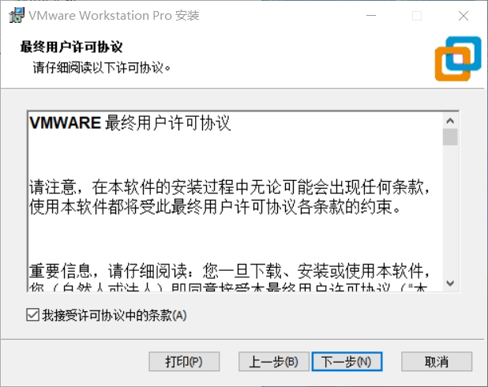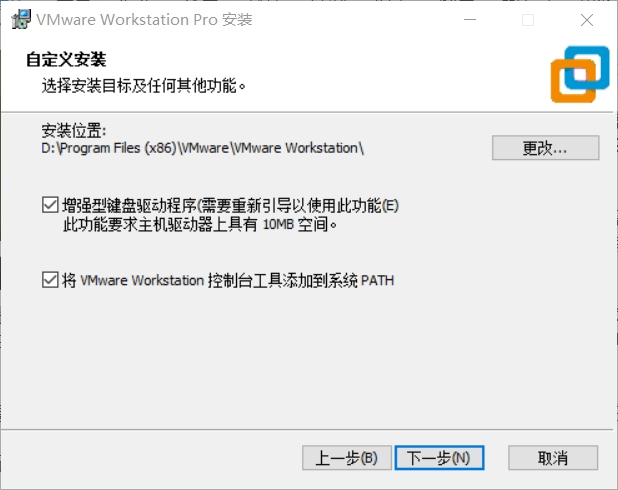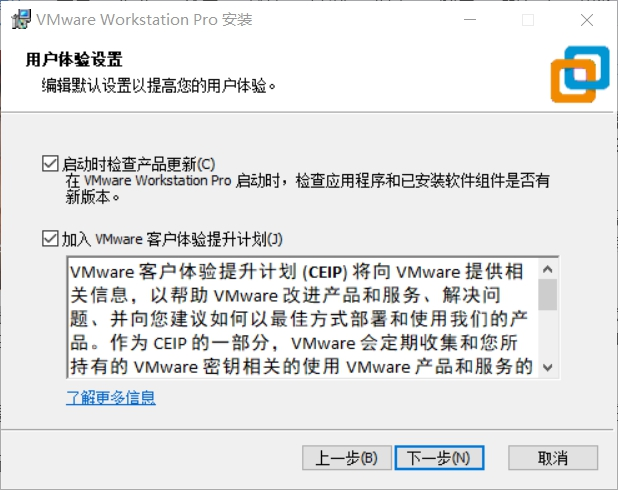 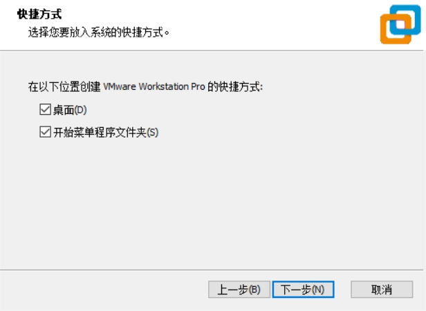

3. 一切准备就绪后，单击“升级”按钮。进行安装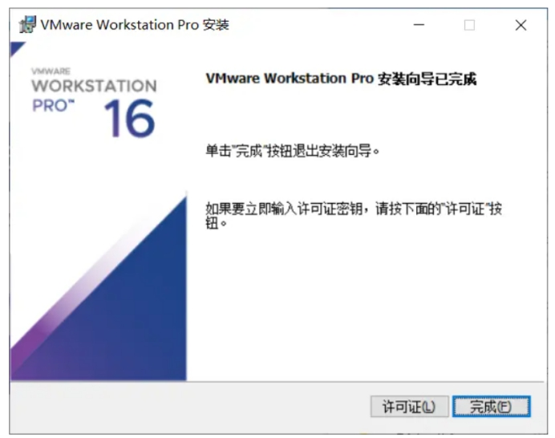

4. 安装完成，重启电脑，输入软件激活序列号即可使用。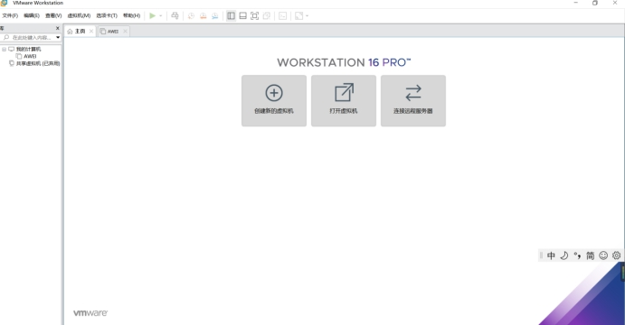

**二、** **_虚拟机上 Centos 操作系统安装（centos7.9）_**

1. 先去官网下载 centos 安装包，指导书上说要安装 centos7.6，没找到，安装的 centos7.9，安装 opengauss 数据库前要改一个文件内容，不然会报错版本不匹配。下载的为 everything 版本（CentOS-7-x86_64-Everything-2009.iso）。

2. 下载完后打开刚安装的 VMware Workstation 点击文件->新建虚拟机，选择自定义，之后下一步。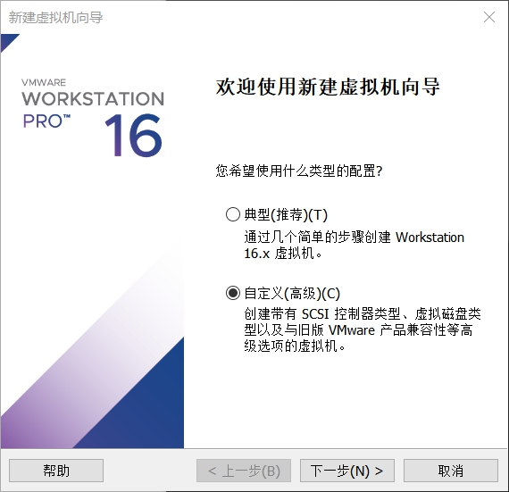 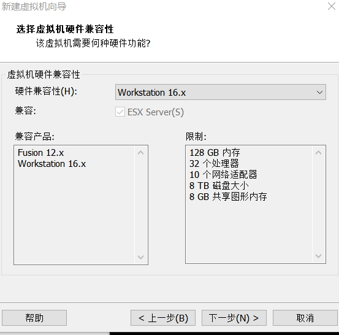

3. 选择稍后安装操作系统，下一步，选择 linux 操作系统，版本 Centos7 64 位。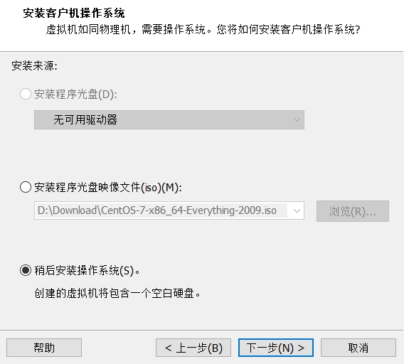 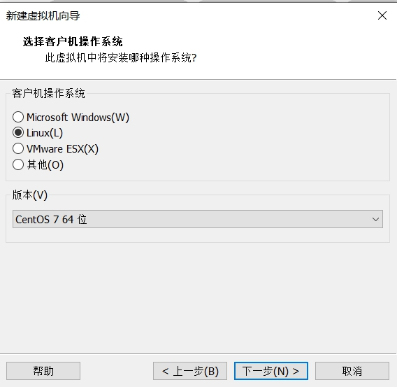

4. 下一步，虚拟机命名并选择位置。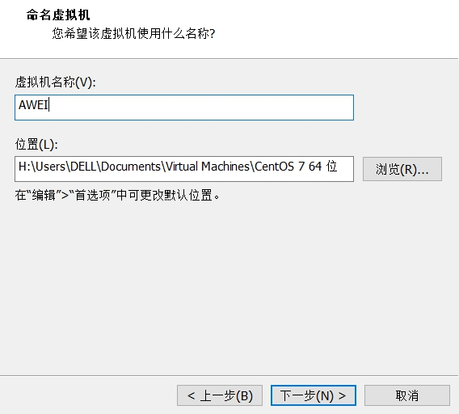

5. 自己进行选择相关配置（内存尽量大一些，以防后面出现问题，网络连接选择 NAT 模式，其它可不变）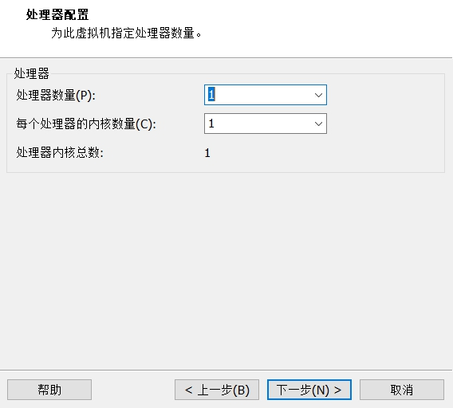 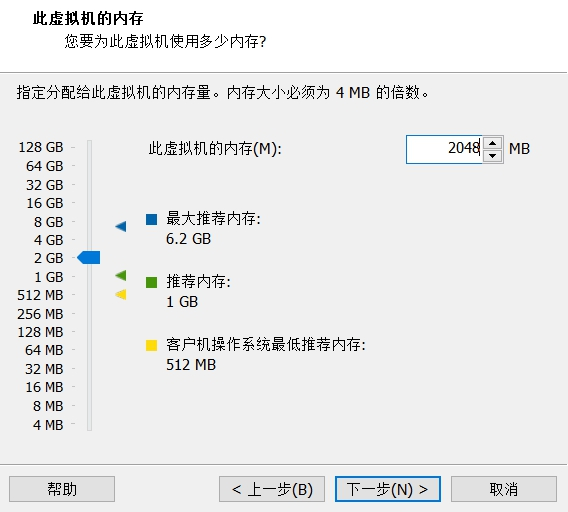 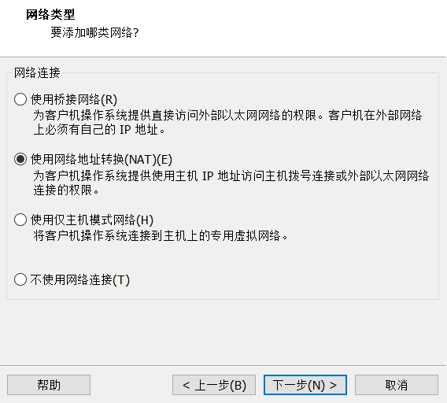

6. 继续相关配置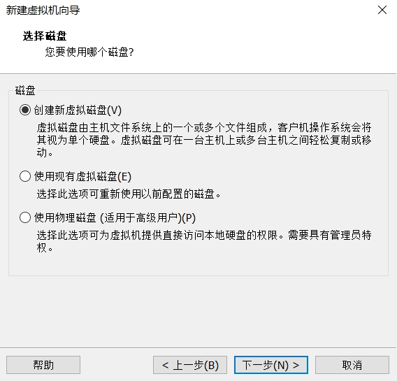 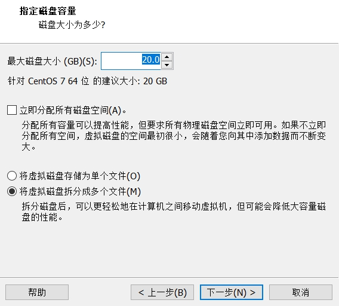

7. 一直下一步，到已准备好创建虚拟机状态，选择自定义硬件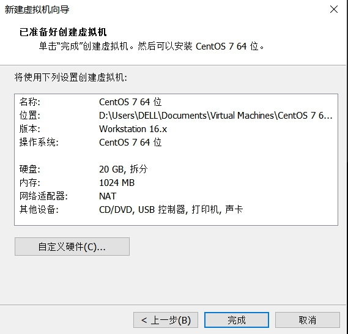 使用已下载好的 ISO 映像文件。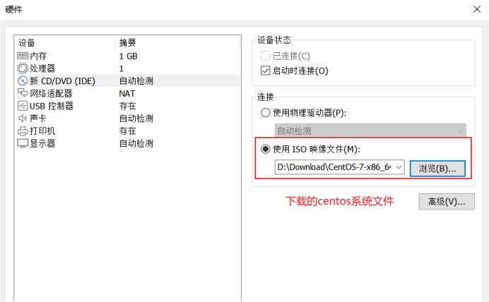

8. 完成后打开此虚拟机，开启虚拟机后会出现以下选择:

   ```
   Install CentOS Linux 7 安装CentOS 7
   Test this media & install CentOS Linux 7 测试安装文件并安装CentOS 7
   Troubleshooting 修复故障
   ```

   选择第一项，直接安装 CentOS 7，回车，进入下面的安装界面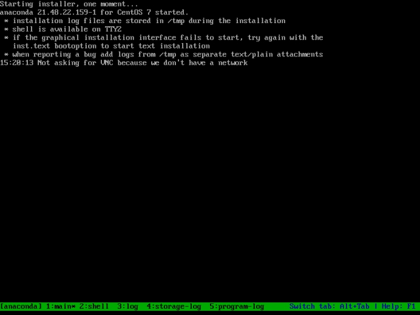

9. 安装完成进入 centos7（选择中文，简体中文，按顺序选择自己需要的配置就可以，软件选择 GNOME 桌面，便于操作；安装目的地进行磁盘划分；网络和主机名进行联网）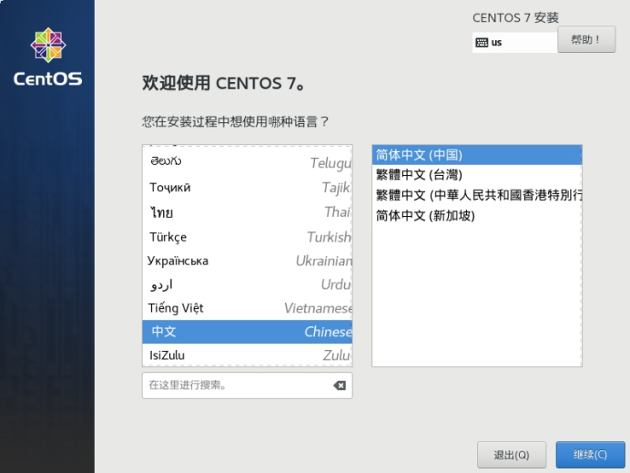 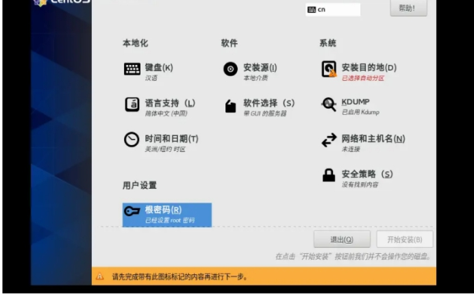 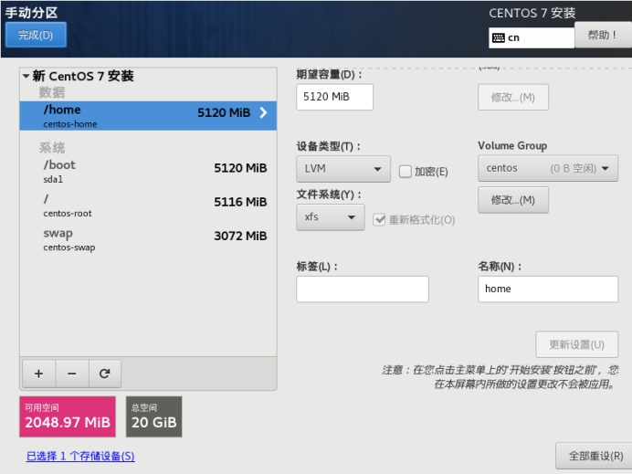 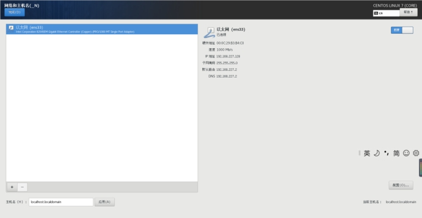 之后可以添加用户，设置名字和密码。最后点击开始安装。

10. 安装成功后重启进入即可。
