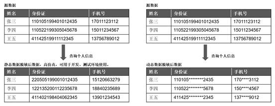
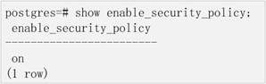
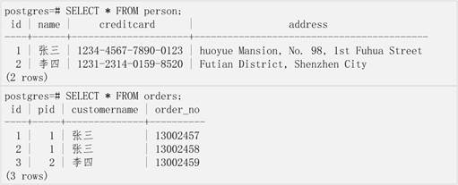
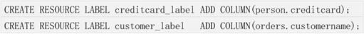
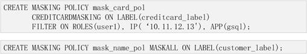
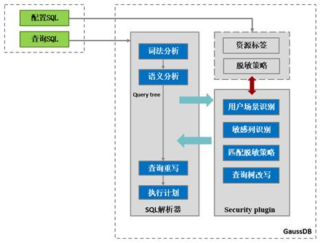
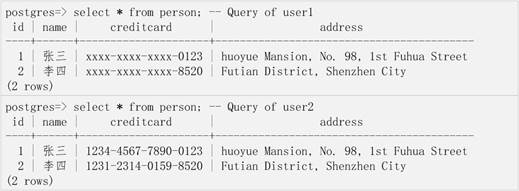
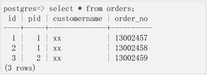
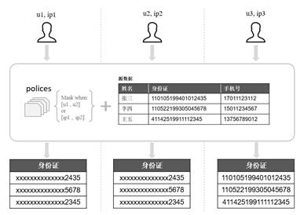
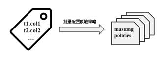

# openGauss 动态数据脱敏

## 数据脱敏背景及介绍

**数据脱敏背景**

伴随着互联网大数据、云服务等新兴技术的飞速发展和普及，业务上云、数据集中存储、数据共享等数据应用方式已成为未来发展的趋势，云数据库和云计算服务具有易部署、低成本、高效率、高可靠的优势，使得越来越多的消费者更倾向于将个人数据存储在云上而非个人移动硬盘中。实际上，由于数据使用场景愈加复杂，个人隐私数据泄露、被窃取的风险越来越高，仅近年来就发生数起重大数据库信息泄露事件，这对数据库安全提出了更高的要求。

数据脱敏，顾名思义就是将敏感数据通过变形、屏蔽等方式处理，其目的是保护隐私数据信息，防止数据泄露和恶意窥探。当企业或者机构收集用户个人身份数据、手机、银行卡号等敏感信息，然后将数据通过导出（非生产环境）或直接查询（结合生产环境）的方式投入使用时，按照隐私保护相关法律法规需将数据进行“脱敏”处理。

**数据脱敏介绍**

数据脱敏主要分为静态脱敏和动态脱敏，静态数据脱敏（Static Data Masking）采用“先脱敏-后分发”的方式，一般是将生产环境数据拷贝到测试或开发库中，导出后的数据已经改变了原始数据的内容，使得脱敏后的数据成为了测试开发源数据。而动态数据脱敏（Dynamic Data Masking）是与生产环境紧密关联的，访问敏感数据时实时地进行脱敏，主要用于直接访问生产数据的场景，在屏蔽敏感信息的同时也保证了源数据的一致性和有效性。

动态数据脱敏和静态数据脱敏适用于不同的场景，两者之间没有优劣之分，主要是以使用场景来选择合适的脱敏模式。openGauss 最新版本已正式对外支持动态数据脱敏特性，下面的章节将围绕 openGauss 动态数据脱敏机制进行阐述。

目前主流的动态数据脱敏技术路线分为“结果集解析”和“语句改写”两条路径：

- 结果集解析：不改写发给数据库的语句，需要提前获悉数据表结构，待数据库返回结果后再根据表结构判断集合内哪些数据需要脱敏，并逐条改写结果数据。
- 语句改写：将包含敏感字段查询的语句改写，对于查询中涉及的敏感字段（表列）通过外层嵌套函数的方式改写，使得数据库运行查询语句时返回不包含敏感数据的结果集。

从性能上来说，结果集解析方法需要在数据库返回结果集后再逐行字段解析、规则匹配、数据脱敏，需要逐个修改结果集中每一行数据，因此脱敏耗时与结果集容量线性相关，整体性能损耗较大；而语句改写通过将较为简短的查询语句进行解析并重写的方式，对语句中的敏感列外嵌了一层脱敏函数，数据库执行命令时将自动执行脱敏函数实现数据脱敏，返回的结果集即为脱敏后的数据。该方式仅仅改写一条查询语句而不涉及结果集的解析，因此能够极大地降低性能损耗，openGauss 便是采用了语句改写的方式，10 万条敏感数据脱敏的性能损耗低于 5%。

另外，对于比较复杂的命令，查询字段一般包含大量同名字段、表别名、嵌套查询等，基于结果集解析首先需要将结果集与真实查询列进行一一对应才可判断出该字段是否需要脱敏，查询越复杂识别难度越高，匹配的准确率就越低，而基于语句的改写可精确的对复杂查询涉及的字段嵌套脱敏函数。

综上分析，基于语句改写方法的数据脱敏无论对于性能还是准确性来说都是较为优秀的脱敏方案，openGauss 基于语句改写思想，在查询解析获取查询树后，根据用户定义的脱敏策略识别查询树目标结点\(Node\)，并对待脱敏结点进行改写构造“脱敏查询树”，再交由数据库内核执行最终返回脱敏后数据。

## openGauss 动态数据脱敏解决方案

动态数据脱敏功能在工业界通常以中间插件或数据脱敏系统\[T7\] \[l\(8\] （Data Masking System）的形态加载，通过在客户端与服务端数据库之间拦截命令或结果集来实现脱敏，而 openGauss 内置动态数据脱敏特性，使数据库无需借助外部插件就可以实现数据脱敏，有效地降低数据中间传输而导致敏感数据泄漏的风险。

openGauss 从 1.1.0 版本定义了一套完整的内置安全策略模型，基于该模型用户可以定义资源标签来标识敏感数据，针对不同的资源标签类别和内容可定义相关的安全策略机制，而动态数据脱敏就是其中一种。

**内置安全策略**

内置安全策略（Security Policy）模型，是指通过配置一系列安全策略来对用户行为进行识别和保护，提供了包括保护用户敏感数据的能力。

资源标签（Resource Label）是 Security Policy 的基础，它的本质是一系列数据库资源集合。为了能够统一管理数据库资源，数据管理者可以将多个数据库资源添加到同一个资源标签下，通过对资源标签配置策略来实现批量地对数据库资源进行管理的能力。

例如，多张数据表中均包含银行卡号“creditcard”这种敏感信息列，那么可以将这些列统一地划分到资源标签“creditcard_label”中，随后管理员便可以通过对“creditcard_label”配置脱敏策略以实现对所有相关敏感列的批量配置。

动态数据脱敏策略（Dynamic Data Masking）是 Security Policy 模型支持的一类安全策略，数据控制者对用户表中的敏感数据识别后\(敏感数据发现和识别不在该特性范围内\)，对包含敏感列的资源标签配置数据脱敏策略，并依据不同的应用场景来限制用户对数据的访问行为和信息提取行为，以达到对敏感信息保护的能力。

总的来说，资源标签是用来归类数据库资源，并将这些资源统一地投入到各种安全策略中去管理。动态数据脱敏特性便是利用资源标签去识别敏感数据，然后匹配脱敏策略，实现对敏感数据的屏蔽。

**动态数据脱敏核心思路**

openGauss 中的动态数据脱敏是以内置安全插件（security plugin）的方式与数据库部署在一起的，业务方面无需额外适配就可使用，SQL 的解析与脱敏策略匹配交由 openGauss 安全策略模块负责，业务在配置脱敏策略后即可生效。

**配置脱敏策略**

脱敏策略的配置主要包括三个方面——脱敏方式（Masking Function）、脱敏对象（Resource Label）、用户过滤器（Masking Filter）。

- 脱敏方式，是指该脱敏策略使用何种方式对目标字段进行脱敏，目前 openGauss 预置了种脱\[z9\] \[l\(10\] 敏方式：creditcardmasking、basicemailmasking、fullemailmasking、alldigitsmasking、shufflemasking、randommasking、maskall。分别适用于不同的脱敏场景。
- 脱敏对象，是指脱敏策略生效时作用的对象集合（LABEL），若查询目标字段存在于 LABEL 中，则该字段将会根据脱敏策略进行敏感数据脱敏，需要注意的是，openGauss 动态数据脱敏特性支持对仅包含数据列的 LABEL 进行脱敏。
- 用户过滤器，指出脱敏策略在何种用户场景下生效，主要涉及 USER（用户名）\[z11\] \[l\(12\] 、APP（用户登录客户端名称）、IP（用户所处的 ip）。当查询用户同时满足 Masking Filter 所指定的阈值时，数据脱敏策略才会生效。

以下案例演示了一个数据动态脱敏策略创建的基本过程。

1.数据准备。

确认内置安全策略总开关是否开启。

准备两张包含敏感字段（creditcard、customername）的表。

2.策略配置**。**

策略管理员（拥有 poladmin 权限）登录数据库，将两张数据表的敏感字段分别添加到资源标签“creditcard_label”、“customer_label”中去管理。

策略管理员创建两个脱敏策略，其作用如下：

- 脱敏策略 mask_card_pol：只有当用户“user1”在‘10.11.12.13’ip 上使用 gsql 访问表时，标签 creditcard_label 中的列将按照‘creditcardmasking’方式脱敏。

- 脱敏策略 mask_name_pol：默认对于所有查询用户，标签 customer_label 中的列将按照‘MASKALL’的方式脱敏。

**触发脱敏策略**

当系统接收到查询命令时，security_plugin 将在解析器中拦截语义分析生成的查询树（Query），首先根据用户登录信息（用户名、客户端、IP）筛选出满足用户场景的脱敏策略。由于脱敏策略是基于（仅包含表列的）资源标签配置的，因此需要判断查询树的目标节点是否属于某个资源标签，然后将识别到的资源标签与脱敏策略相匹配，根据策略内容将查询树目标节点改写，最终将查询树返还给解析器。

security_plugin 模块由于内置查询树脱敏方式，数据访问者不会感知内置安全策略重写查询树的过程，如同执行普通查询一样去访问数据，同时保护数据隐私。

基于配置脱敏策略小节举出的案例，我们可以通过查询数据表来触发脱敏策略。

**触发脱敏策略。**

用户 user1 在满足 mask_card_pol 策略的情况下使用 gsql 登录数据查询敏感数据，系统将返回脱敏后的数据结果。而用户 user2 不满足该条策略，因此该用户查询的数据未做脱敏处理。

而无论对于 user1 还是 user2 用户，他们查询 order 表时都会触发脱敏策略 mask_name_pol，因此 customername 字段将会被脱敏处理。

## openGauss 动态数据脱敏优势

openGauss 动态数据脱敏关注访问用户身份识别问题，用户过滤器\[z13\] \[l\(14\] （Masking Filter）的配置细化到指定用户、客户端工具、登录 IP，策略管理员可以灵活地根据不同业务、不同用户场景来制定不同的脱敏策略，赋予他们不同级别的敏感数据访问能力以适用于各种复杂的生产环境。例如金融、医疗行业中前台服务人员只允许看到身份证、银行卡号部分信息，而运维管理员则可以查询并维护所有用户信息。在保证脱敏场景多样性的前提下，指定用户过滤器时系统会进行严格的互斥校验，避免同一用户同时满足多个用户过滤器而出现策略选择的二义性。

其次，openGauss 动态数据脱敏更加注重数据库资源\[T15\] \[l\(16\] 的批量管理，在安全策略模型中，将需要管控的数据库资源集中归类划分成标签，对标签的操作实际上就是对指定一簇资源的操作，极大的简化管理流程，提高管理效率。在其他数据库上的动态数据脱敏特性一般是基于单个列或单张表的，脱敏策略与数据库资源是一一对应的，即使想要采用相同的脱敏方式，不同的数据库资源也要配置多个对应的脱敏策略，这无疑是提高了策略配置成本，增加了后期运维、批量资源策略管理的难度。因此将需要批量管理的数据库资源划分到资源标签中是 openGauss 动态数据脱敏的基础，也是其优势之一。

动态数据脱敏内置在 openGauss 内核中，能够在一定程度上保证数据传输路径上的安全性，而外部插件存在绕过风险：当外部插件将客户端发送的 SQL 或服务端返回的结果集改写后，攻击者依然可以绕过插件直接向数据库发送 SQL 或截取数据库返回的源数据结果集，导致脱敏插件失效。因此相较于外部插件脱敏的方式，openGauss 动态数据脱敏在一定程度上也能降低传输路径上的敏感数据泄漏风险。

动态数据脱敏其目的是屏蔽结果集中的敏感数据，动态数据脱敏是与生产环境相结合，由业务方提供查询接口，再由接口触发数据脱敏，openGauss 为了尽可能的保证敏感数据的安全性，在绝大多数场景包括带有 RETURNING 的增删改、Merge into、CTE、Subquery 等场景也适配了脱敏策略，这样能够丰富业务方对敏感数据的操作接口而不单单只能提供数据查询接口。

openGauss 为了提高易用性，提供了一套简洁的策略配置语法，涵盖了资源标签以及脱敏策略的增删改，用户使用定义语法可以轻松地配置脱敏策略，简化了管理员操作流程。

## openGauss 动态数据脱敏的展望

openGauss 动态数据脱敏特性提供了相对简洁、灵活的策略配置方案，在一定程度上保用户隐私数据不被泄漏，是 openGauss 多层级安全防御架构中不可或缺的一环。

未来 openGauss 动态数据脱敏特性将开放更加灵活的策略配置手段包括 UDF（User Defined Function）Masking 以及条件脱敏（Conditional Masking）等，以期支持更加灵活、丰富的隐私保护场景。
