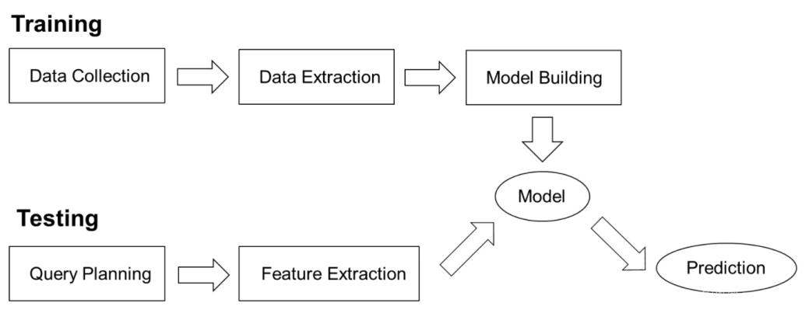
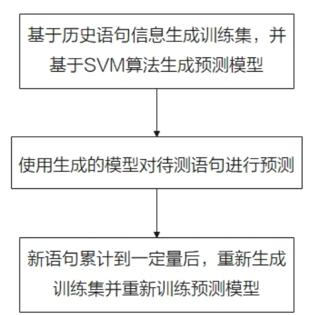
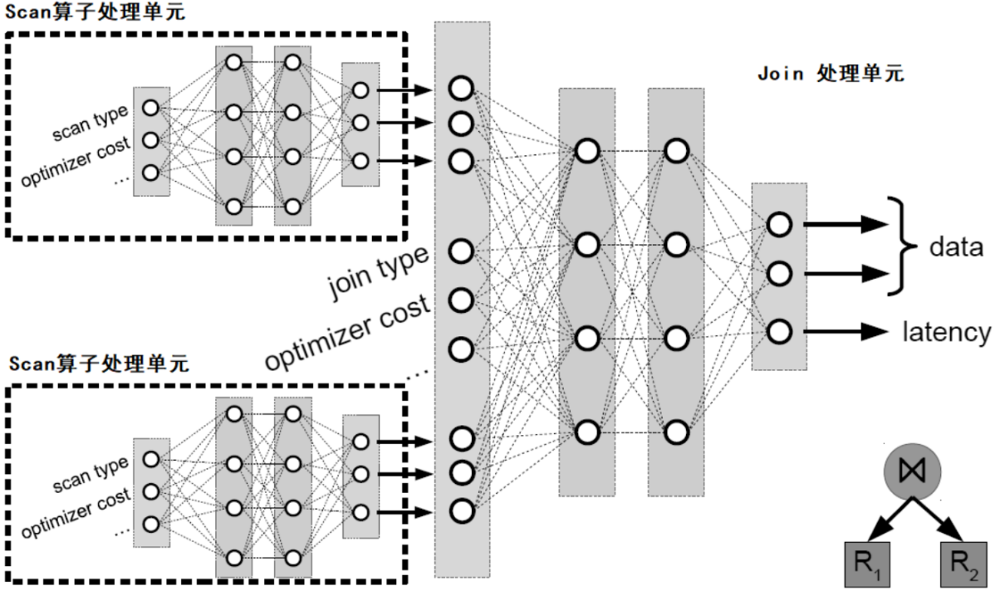
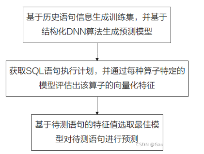
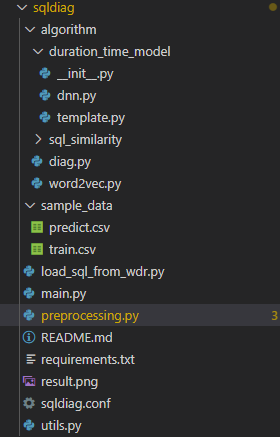
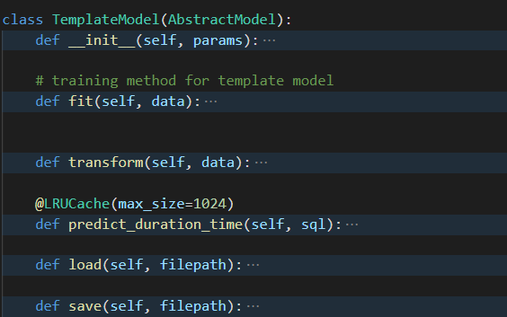
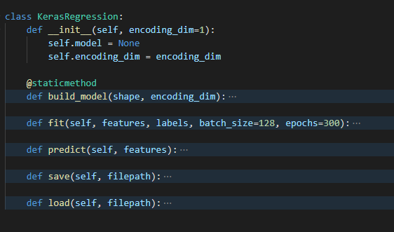
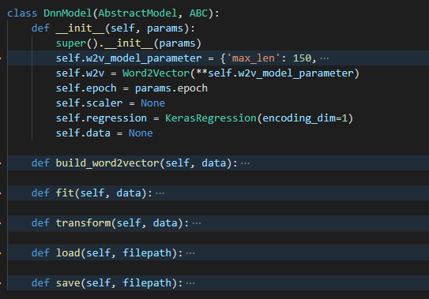

# 一、概念部分

本文主要是介绍 OpenGauss 中 AI 技术——慢 SQL 发现技术的分析。

## （1）慢 SQL 相关概念

    慢SQL：效率慢的SQL语句
    慢SQL发现：基于历史SQL语句信息进行模型训练，并用训练好的模型进行SQL语句的预测，利用预测结果判断该SQL语句是否是潜在的慢SQL。当发现潜在的慢SQL后，开发者便可以进行针对性优化或者风险评估，以防业务上线后发生问题。
    慢SQL的产生原因：SQL编写问题、锁、业务实例相互干绕对 IO/CPU 资源争用、服务器硬件、MYSQL BUG，其中编写问题可以说是占了主要，所以发现慢SQL并提示用户更改或者程序自动优化是有很必要的。

## （2）慢 SQL 的三个阶段

- 阶段 1（发现问题）：
  对用户输入的一批业务 SQL 语句进行分析，推断 SQL 语句执行时间的快慢，进而可以将评估为慢 SQL 的语句识别出来。(目前 OpenGauss 已经具备这方面的能力，比如本次报告介绍的慢 SQL 发现技术)

- 阶段 2（找到原因）：
  对识别出的潜在慢 SQL 进行根因诊断，判断这些 SQL 语句是因为什么慢，例如比较常见的原因可能是数据量过大、SQL 语句自身过于复杂、容易产生并发的锁冲突、没有创建索引导致全表扫描等等。

- 阶段 3（给出处理建议）：
  对于已经识别出来的慢 SQL 语句的可能问题源，给出针对性的解决方案，譬如可以提示用户进行 SQL 语句的改写、创建索引等。(OpenGauss 有部分相关的功能，如索引推荐等)

## （3）慢 SQL 发现的 AI 技术

**① 基于执行的在线 SVM 模型**



第一种技术是利用了 SVM 模型来预测是否为慢 SQL。
这里主要是有两个环节，分别是训练阶段和测试阶段。
**训练阶段**：
Data Collection 模块执行作为训练集的语句，Data Extraction 模块收集执行的语句特征及执行时间，包括执行计划及算子级别的信息。Model Building 模块基于计划级别特征与算子级别信息分别训练 SVM 模型，再将两模型通过误差分布结合，生成最终的预测模型。

**测试阶段：**
Query Planning 模块生成待预测语句的执行计划，Feature Extraction 抽取这些计划中的特征，整合后投入训练阶段生成的模型中产生预测结果。

整体的算法流程图如下：



**② 基于执行计划的 DNN 模型**



此算法与第一种相似，区别就是其中的 Model Building 模块中选择的算法不同。如上图所示，是此技术的算法架构图，算法的概述如下。
该算法依然是将执行计划中的算子信息输入到深度学习网络中，从而对执行时间进行预测的。对于每个算子，收集左右子树的向量化特征、优化器代价及执行时间，输入与之对应的模型中，预测该算子的向量化特征及执行时间等。上图中显示了一个 join 操作的预测流程，其左右子树均为 Scan 算子，将两个 Scan 算子通过对应的模型预测出的向量化特征、执行时间，以及该 join 算子的优化器评估代价作为入参，输出 join 算子模型得到该操作的向量化特征及预测出的执行时间。上述过程是个自底向上的过程。
此技术流程图如下：



当然，此技术也有很多缺点：
需要通过已预测算子不断修正模型，预测过程会较慢。
对环境变化感知差，如数据库参数变化会使得原模型几乎完全失效。
预测过程依赖待测语句的执行计划，加重了数据库的负荷，对于 OLTP 场景格外不适用。

## （4）总体流程

程序开始后，会先去获取 SQL 流水，然后根据我们设置的初始化参数来确定是使用模板法还是深度学习方法，如果是模板化方法，具体流程如下：
1° 检测本地是否存在对应实例的历史模板信息，如果存在，则加载该模板信息，如果不存在，则对该模板进行初始化。
2° 基于 SQL 数据，提取 SQL 的粗粒度模板信息。粗粒度模板表示将 SQL 中表名、列名和其他敏感信息去除之后的 SQL 语句模板，该模板只保留最基本的 SQL 语句骨架。
3° 基于 SQL 数据，提取 SQL 细粒度的模板信息。细粒度模板表示在粗粒度模板信息的基础上保留表名、列名等关键信息的 SQL 语句模板。细粒度模板相对粗粒度模板保留了更多 SQL 语句的信息。
4° 执行训练过程时，首先构造 SQL 语句的基于粗粒度模板和细粒度模板信息，例如粗粒度模板 ID、执行平均时间、细模板执行时间序列、执行平均时间和基于滑动窗口计算出的平均执行时间等。最后将上述模板信息进行储存。
5° 执行预测过程时，首先导入对应实例的模板信息，如果不存在该模板信息，则直接报错退出；否则继续检测是否存在该 SQL 语句的粗粒度模板信息，如果不存在，则基于模板相似度计算方法在所有粗粒度模板里面寻找最相似的 N 条模板，之后基于 KNN（k nearest neighbor，K 近邻）算法预测出执行时间；如果存在粗粒度模板，则接着检测是否存在近似的细粒度模板，如果不存在，则基于模板相似度计算方法在所有细粒度模板里面寻找最相似的 N 条模板，之后基于 KNN 预测出执行时间；如果存在匹配的细粒度模板，则基于当前模板数据，直接返回对应的执行时间。

如果是选择了深度学习，具体流程如下所示：
1° 在训练过程中，首先判断是否存在历史模型，如果存在，则导入模型进行增量训练；如果不存在历史模型，则首先利用 word2vector 算法对 SQL 语句进行向量化，即图 8-11 中的 SQL embeding 过程。而后创建深度学习模型，将该 SQL 语句向量化的结果作为输入特征。基于训练数据进行训练，并将模型保存到本地。值得一提的是，该深度学习模型的最后一个全连接层网络的输出结果作为该 SQL 语句的特征向量。
2° 在预测过程中，首先判断是否存在模型，如果模型不存在，则直接报错退出；如果存在模型，则导入模型，并利用 word2vector 算法将待预测的 SQL 语句进行向量化，并将该向量输入到深度学习网络中，获取该神经网络的最后一个全连接层的输出结果，即为该 SQL 语句的特征向量。最后，利用余弦相似度在样本数据集中进行寻找，找到相似度最高的 SQL 语句，将该结果返回即为该待预测 SQL 语句的预估执行时间。当然，如果是基于最新 SQL 语句执行时间数据集训练出的深度学习模型，则模型的回归预测结果也可以作为预估执行时间。

# 二、具体项目代码分析

## 1、整体项目结构

项目路径：openGauss-server/src/gausskernel/dbmind/tools/sqldiag
首先是，本项目的整体架构如下所示：



其中，重要的文件/文件夹主要有：
preprocessing.py SQL 预处理方法
requirements.txt 依赖第三方库列表等
main.p 入口文件
algorithm 项目核心代码
algorithm/sql_similarity 相似度计算方法

## 2、核心代码分析

### (1)首先是 main 函数

```python
def main(args):
    logging.basicConfig(level=logging.WARNING)//初始化参数
    if not is_valid_conf(args.config_file):
        logging.fatal('The [--config-file] parameter is incorrect')
        sys.exit(1)
     // 下面就是根据我们初始化的参数来生成对应模型
    model = SQLDiag(args.model, get_config(args.config_file))
    if args.mode in ('train', 'finetune')://如果检测到是要训练/微调，就执行这个分支，主要是读取训练数据，然后做训练，再保存模型
        if not args.csv_file:
            logging.fatal('The [--csv-file] parameter is required for train mode')
            sys.exit(1)
        train_data = LoadData(args.csv_file).train_data
        if args.mode == 'train':
            model.fit(train_data)
        else:
            model.fine_tune(args.model_path, train_data)
        model.save(args.model_path)
    else: //不然的话就是执行测试分支，这里就不用读取训练数据，而是直接读取模型，然后用这个模型来预测结果
        model.load(args.model_path)
        if args.csv_file and not args.query:
            predict_data = LoadData(args.csv_file).predict_data
        elif args.query and not args.csv_file:
            predict_data = split_sql(args.query)
        else:
            logging.error('The predict model only supports [--csv-file] or [--query] at the same time.')
            sys.exit(1)
        args.threshold = -100 if not args.threshold else float(args.threshold)//这里是要设置一个阈值来划分
        pred_result = model.transform(predict_data)
        if args.predicted_file:
            if args.model == 'template':
                info_sum = []
                    if _info:
                        _info = list(filter(lambda item: item[1]>=args.threshold, _info))
                        for item in _info:
                            item.insert(1, stats)
                        info_sum.extend(_info)
                ResultSaver().save(info_sum, args.predicted_file)
            else:
                pred_result = list(filter(lambda item: float(item[1])>=args.threshold, pred_result))
                ResultSaver().save(pred_result, args.predicted_file)
        else:
            from prettytable import PrettyTable

            display_table = PrettyTable()
            if args.model == 'template':
                display_table.field_names = ['sql', 'status', 'predicted time', 'most similar template']
                display_table.align = 'l'
                status = ('Suspect illegal SQL', 'No SQL information', 'No SQL template found', 'Fine match')
                for stats in status:
                    if pred_result[stats]:
                        for sql, predicted_time, similariest_sql in pred_result[stats]:
                            if predicted_time >= args.threshold or stats == 'Suspect illegal sql':
                                display_table.add_row([sql, stats, predicted_time, similariest_sql])
            else:
                display_table.field_names = ['sql', 'predicted time']
                display_table.align = 'l'
                for sql, predicted_time in pred_result:
                    if float(predicted_time) >= args.threshold:
                        display_table.add_row([sql, predicted_time])
            print(display_table.get_string())


```

### (2)然后来分析下模板化算法的框架



模板化方法类的结构就如上所示，其中 fit 方法就是训练的，transform 方法是预测的，load 是加载模型，save 是储存模型，predict_duration_time 是计算执行时间，在 transform 中会被调用。

```python
# fit方法：
def fit(self, data):
        # 对每条sql语句按照粗、细粒度进行标准化，生成模板
        for sql, duration_time in data:
            if check_illegal_sql(sql):
                continue
            sql_template = templatize_sql(sql)
            sql_prefix = sql_template.split()[0]
            if sql_prefix not in self.__hash_table:
                sql_prefix = 'OTHER'#如果不存在，说明没有此模板，就标记下来，后续插入

            if sql_template not in self.__hash_table[sql_prefix]:
                self.__hash_table[sql_prefix][sql_template] = dict(time_list=[], count=0, mean_time=0.0, iter_time=0.0)
            self.__hash_table[sql_prefix][sql_template]['count'] += 1
            self.__hash_table[sql_prefix][sql_template]['time_list'].append(duration_time)
        # 更新模板信息，也就相当于是训练的过程了
        for sql_prefix, sql_prefix_info in self.__hash_table.items():
            for sql_template, sql_template_info in sql_prefix_info.items():
                del sql_template_info['time_list'][:-self.time_list_size]
                sql_template_info['mean_time'] = sum(sql_template_info['time_list']) / len(sql_template_info['time_list'])
                sql_template_info['iter_time'] = reduce(lambda x, y: (x+y)/2, sql_template_info['time_list'])

# Predict_duration_time方法，就是去从一堆模板中找到最相似的k个，然后算均值（KNN方法）。
def predict_duration_time(self, sql):
        top_similarity_sql = None
        if check_illegal_sql(sql):
            predict_time = -1
            status = 'Suspect illegal sql'
            return sql, status, predict_time, top_similarity_sql

        sql_template = templatize_sql(sql)
        # get 'sql_template' of SQL
        sql_prefix = sql_template.strip().split()[0]
        if sql_prefix not in self.__hash_table:
            sql_prefix = 'OTHER'
        if not self.__hash_table[sql_prefix]:
            status = 'No SQL information'
            predict_time = -1
        elif sql_template not in self.__hash_table[sql_prefix]:
            similarity_info = []
            """
            if the template does not exist in the hash table,
            then calculate the possible execution time based on template
            similarity and KNN algorithm in all other templates
            """
            status = 'No SQL template found'
            for local_sql_template, local_sql_template_info in self.__hash_table[sql_prefix].items():
                similarity_info.append(
                    (self.similarity_algorithm(sql_template, local_sql_template),
                     local_sql_template_info['mean_time'], local_sql_template))
            topn_similarity_info = heapq.nlargest(self.knn_number, similarity_info) #找相似度最高的模板的信息
            sum_similarity_scores = sum(item[0] for item in topn_similarity_info)
            if not sum_similarity_scores:
                sum_similarity_scores = self.bias
            top_similarity_sql = '\n'.join([item[2] for item in topn_similarity_info])
            similarity_proportions = [item[0] / sum_similarity_scores for item in
                                      topn_similarity_info]
            topn_duration_time = [item[1] for item in topn_similarity_info]
            predict_time = reduce(lambda x, y: x + y,
                                  map(lambda x, y: x * y, similarity_proportions,
                                      topn_duration_time))

        else:
            status = 'Fine match'
            predict_time = self.__hash_table[sql_prefix][sql_template]['iter_time']
            top_similarity_sql = sql_template

        return sql, status, predict_time, top_similarity_sql


```

### (3)模板化算法-相似度计算算法

主要有四个算法：

```python
# 1°余弦距离

 len(sorted_list2) else sorted_list2
    for item in short_list:
        if item in long_list:
            sql_distance += 1.0
    length_similarity = float(min_len / max_len)
    return sql_distance + length_similarity
# 4°解析树距离（这里没看懂，就不叙述了）


```

## 3、DNN 算法




DNN 模型主要有一个 word2vec 模块，然后是接上一个 KerasRegression，KerasRegression 结构如下：

```python
from tensorflow.keras import Input, Model
        from tensorflow.keras.layers import Dense
        inputs = Input(shape=(shape,))
        layer_dense1 = Dense(128, activation='relu',
            kernel_initializer='he_normal')(inputs)
        layer_dense2 = Dense(256, activation='relu',
            kernel_initializer='he_normal')(layer_dense1)
        layer_dense3 = Dense(256, activation='relu',
            kernel_initializer='he_normal')(layer_dense2)
        layer_dense4 = Dense(256, activation='relu',
            kernel_initializer='he_normal', name='vectors')(layer_dense3)
        y_pred = Dense(encoding_dim)(layer_dense4)
        model = Model(inputs=inputs, outputs=y_pred)
        model.compile(optimizer='adam', loss='mse', metrics=['mae'])
        return model


```

就是一个简单的 5 层全连接网络。

预测过程：

```python
feature_list = []
        data_backup = list(data)
        error_list = []
        for idx_error, sql in enumerate(data_backup):
            if check_illegal_sql(sql):
                error_list.append(idx_error)
                continue
            filter_template = templatize_sql(sql)
            vector = self.w2v.str2vec(filter_template)
            feature_list.append(vector)

        features = np.array(feature_list)
        predictions = self.regression.predict(features)
        predictions = np.abs(predictions)
        score = self.scaler.inverse_transform(predictions)
        if error_list:
            for item in error_list:
                score = np.insert(score, item, -1)
        score = np.hstack((np.array(data_backup).reshape(-1, 1), score.reshape(-1, 1))).tolist()
        return score


```

训练过程就相当于预测过程多一个反向传播。
