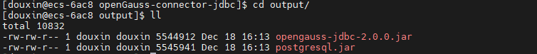
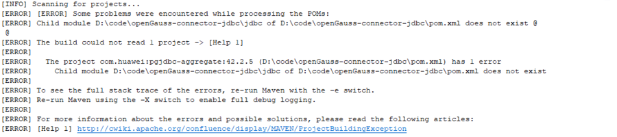
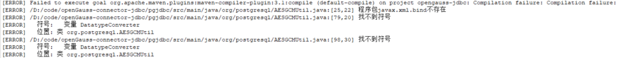
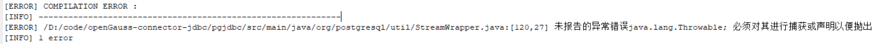
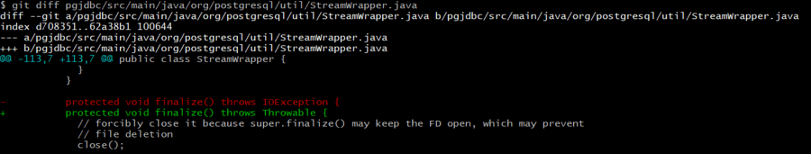
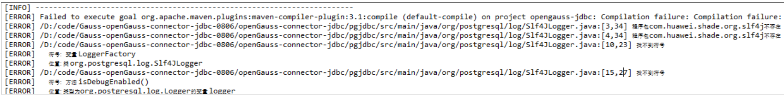
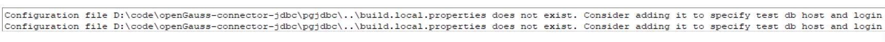

# JDBC 使用及源码编译

## 1. JDBC 简介

- JDBC 是 Java DataBase Connectivity 的缩写，它是 Java 程序访问数据库的标准接口。

- JDBC 接口是 Java 标准库自带的，具体的 JDBC 驱动是由数据库厂商提供的，JDBC 驱动也是由 Java 语言编写的，为一个 jar 包，真正实现 JDBC 接口中的类。

- openGauss 数据库源自 postgres，openGauss JDBC 以 PostgreSQL JDBC Driver 42.2.5 为基准，适配 openGauss 数据库，增加新特性。

- openGauss JDBC 下载地址：

  - Jar 包下载路径：

    （1）[官网下载](https://opengauss.org/zh/download.html)

    （2）[华为鲲鹏 maven 仓库](https://repo.huaweicloud.com/kunpeng/maven/org/opengauss/opengauss-jdbc/)

    （3）[maven 中央仓库](https://mvnrepository.com/artifact/org.opengauss/opengauss-jdbc)

  - 源码下载路径：

    [源码下载](https://gitee.com/opengauss/openGauss-connector-jdbc)

## 2. JDBC 使用

- 参考链接

  openGauss JDBC 源码中的 API 可以参考：[API 链接](https://jdbc.postgresql.org/documentation/publicapi/)

  用户指导手册可参考：[用户手册](https://impossibl.github.io/pgjdbc-ng/docs/current/user-guide/)

- 执行流程

  通过 JDBC 对数据库进行操作，执行流程大体如下：
  （1）连接数据源
  （2）为数据库传递查询和更新指令
  （3）处理数据库相应并返回结果

- 完整示例

  ```
  import java.sql.Connection;
  import java.sql.DriverManager;
  import java.sql.PreparedStatement;
  import java.sql.ResultSet;
  import java.sql.Statement;

  public class Main {

      public static void main(String[] args) {
          String driver = "org.postgresql.Driver";
          String sourceURL = "jdbc:postgresql://127.0.0.1:5432/postgres";
          String userName = "tpcc";
          String password = "password";

          try {
              // 1. 加载驱动程序
              Class.forName(driver);

              // 2. 获得数据库连接
              Connection conn = DriverManager.getConnection(sourceURL, userName, password);

              // 3. 创建表
              String sql = "create table test(id int, name varchar);";
              Statement statement = conn.createStatement();
              statement.execute(sql);

              // 4. 插入数据，预编译SQL,减少SQL执行，
              String insertSql = "insert into test values (?, ?)";
              PreparedStatement ps = conn.prepareStatement(insertSql);
              ps.setInt(1, 10);
              ps.setString(2, "test10");
              ps.execute();

              // 5. 查询结果集
              String selectSql = "select * from test";
              PreparedStatement psSelect = conn.prepareStatement(selectSql);
              ResultSet rs = psSelect.executeQuery();
              while (rs.next()) {
                  System.out.println("id = " + rs.getInt(1));
                  System.out.println("name = " + rs.getString(2));
              }
          } catch (SQLException e) {
              e.printStackTrace();
          }
      }
  }
  ```

- 引入 JDBC 驱动

  （1）通过 java 工程引入依赖库 Referenced Libaries
  将 openGauss JDBC jar 包放置于工程路径下，并通过 `Build Path -> Add to Build Path` 引入至依赖库中
  （2）通过 maven 工程引入依赖 dependency

  openGauss JDBC 驱动已经上传至华为鲲鹏仓库和 maven 中央仓库，包含 1.1.0，2.0.0，2.0.1-compatibility 三个版本，依赖配置如下：

  ```
  <dependencies>
  	<dependency>
  		<groupId>org.opengauss</groupId>
  		<artifactId>opengauss-jdbc</artifactId>
  		<version>version_num</version>
  	</dependency>
  </dependencies>
  ```

  若添加华为鲲鹏 maven 镜像，可将仓库配置在`<Maven安装目录>/conf/setting.xml`文件或者 Maven 工程的 pom.xml 文件中

  [华为鲲鹏-Maven 镜像](https://mirrors.huaweicloud.com/home)

  仓库配置如下：

  ```
  <repositories>
      <repository>
          <id>kunpengmaven</id>
          <name>kunpeng maven</name>
          <url>https://repo.huaweicloud.com/kunpeng/maven</url>
      </repository>
  </repositories>
  ```

## 3. JDBC 源码编译

- linux 下编译 Jar 包

  从码云上下载 openGauss JDBC 源码，linux 下可一键式编译，生成 jar 包

  编译命令为

  ```
  sh build.sh -3rd $openGauss-connector-jdbc/open-source
  ```

  其中`$openGauss-connector-jdbc`为 JDBC 源码路径，生成的 Jar 包位于`$openGauss-connector-jdbc/output`路径下

  

  上面的两个 jar 包虽名称不同，但本质上是两个相同的 Jar 包。

- windows 下编译 Jar 包

  通过 maven 对源码进行打包，打包命令为：

  ```
  mvn clean package -Dmaven.test.skip=true
  ```

  直接执行上面的命令会报如下的错误，下面给出常见问题及解决方案：

  - 问题 1：Child module does not exist

    

    解决方案：修改根目录下的 pom.xml 文件中 jdbc 为 pgjdbc

    ```
    <module>jdbc</module>
    修改为
    <module>pgjdbc</module>
    ```

  - 问题 2：缺少` com.huawei:demo-0.0.1-SNAPSHOT.pom`

    解决方案：在仓库中增加 demo-0.0.1-SNAPSHOT 包

    方法 1：将 linux 编译成功生成的 demo-0.0.1-SNAPSHOT-0.0.1.jar 包拷贝至用户本地 maven 仓库中即可

    方法 2：执行下面的脚本可生成 demo-0.0.1-SNAPSHOT-0.0.1.jar 包

    ```
    sh prepare_maven.sh
    sh prepare_demo.sh
    ```

  - 问题 3：编码 GBK 的不可映射字符

    

    解决方案：

    maven-compiler-plugin 插件增加` <encoding>UTF-8</encoding>`，共两个文件
    (1) pgjdbc/pom.xml
    (2) pom.xml

    ```
    <plugin>
    	<artifactId>maven-compiler-plugin</artifactId>
    	<version>3.1</version>
    	<configuration>
            <source>1.8</source>
            <target>1.8</target>
            <encoding>UTF-8</encoding>
            <showWarnings>true</showWarnings>
            <compilerArgs>
            	<arg>-Xlint:all</arg>
            </compilerArgs>
    	</configuration>
    </plugin>
    ```

  - 问题 4：程序包 javax.xml.bind 不存在

    

    解决方案：pgjdbc/pom.xml 中增加如下依赖

    ```
    <dependency>
        <groupId>javax.xml.bind</groupId>
        <artifactId>jaxb-api</artifactId>
        <version>2.3.0</version>
    </dependency>
    <dependency>
        <groupId>com.sun.xml.bind</groupId>
        <artifactId>jaxb-core</artifactId>
        <version>2.3.0</version>
    </dependency>
    <dependency>
        <groupId>com.sun.xml.bind</groupId>
        <artifactId>jaxb-impl</artifactId>
        <version>2.3.0</version>
    </dependency>
    ```

  - 问题 5：StreamWrapper.java 未报告的异常错误 java.lang.Throwable

    

    解决方案：修改 StreamWrapper.java 文件，抛出 Throwable 异常

    

  - 问题 6：隐藏的包找不到

    程序包 com.huawei.shade.org.slf4j 不存在

    

    解决方案：删掉本地 com.huawei.demo-0.0.1-SNAPSHOT.jar 包，重新进行打包

    打包方法：

    ```
    sh prepare_maven.sh
    sh prepare_demo.sh
    ```

  - 问题 7：zip 工具找不到

    通过问题 6 中的两个 sh 脚本编译生成 com.huawei.demo-0.0.1-SNAPSHOT.jar 包时，zip 工具必需处于环境变量中，可下载 zip、unzip 工具[zip/unzip 下载链接](http://www.stahlworks.com/dev/index.php?tool=zipunzip)并添加至环境变量中即可。

- 执行测试用例

  - pgjdbc/pom.xml 增加 junit 依赖

    ```
    <dependency>
        <groupId>junit</groupId>
        <artifactId>junit</artifactId>
        <version>4.12</version>
        <scope>test</scope>
    </dependency>
    ```

  - 增加配置文件 build.local.properties

    

    在根目录下增加配置文件 build.local.properties，并配置数据库相关的信息（ip，port，user，password），即可在本地执行测试用例
