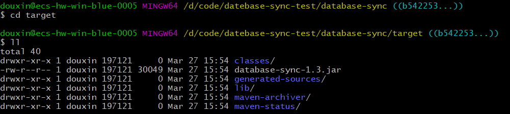
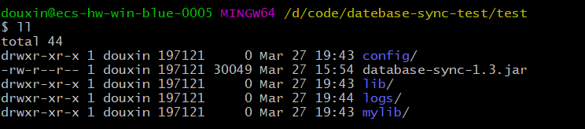
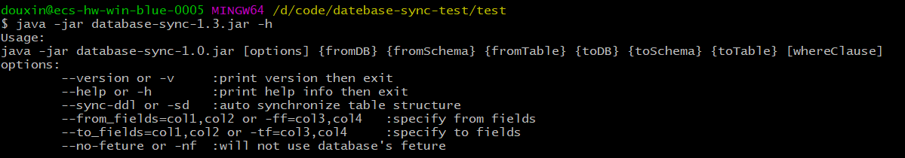
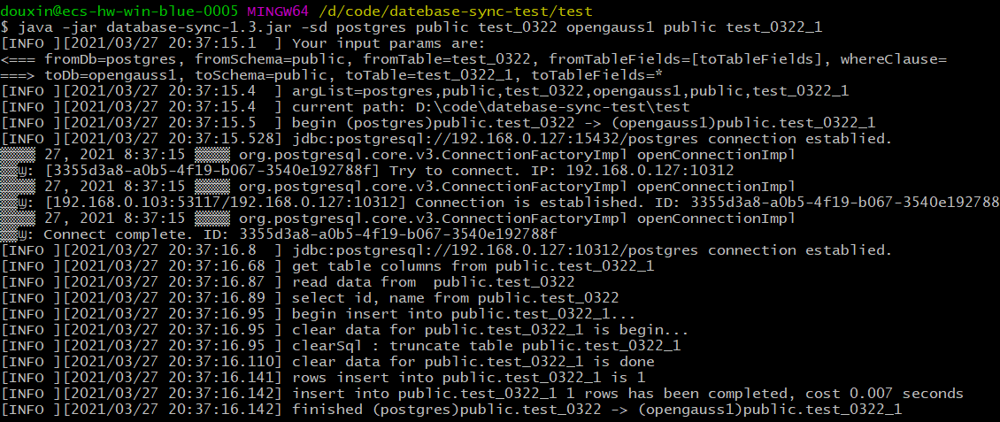
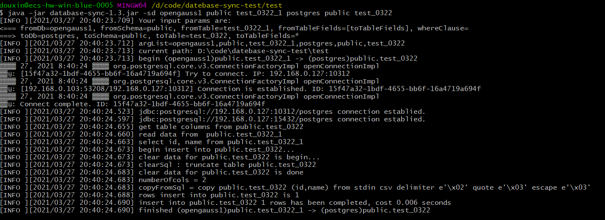

## 一、database-sync 简介

database-sync 作为一种开源辅助工具，用于数据库之间的表同步，更确切的说法是复制，可以从一个数据库复制表到另一个数据库

- 该工具支持的功能如下：
  （1）自动同步表字段，如：源表扩字段，目标表自动扩字段

  （2）支持增量或全量同步数据

  （3）支持指定字段同步，只同步关心的字段

- 支持的关系型数据库：

  mysql、db2、postgresql、oracle、sqlserver

- 源代码下载：

  database-sync 代码托管在 github 上

  源代码下载：[下载](https://gitee.com/somenzz/database-sync)

## 二、database-sync 适配 openGauss

目标：database-sync 适配 openGauss 数据库，可支持 openGauss 与其他数据库之间实现数据同步

源代码下载：适配 openGauss 的源代码已上传到个人仓库下的“douxin_master”分支

下载链接：[下载](https://gitee.com/ywzq1161327784/database-sync)

## 三、程序使用说明

前提：已安装 Java JDK 1.8 或更高版本，安装 maven

### Step 1：下载代码并打包

git clone 下载 douxin_master 分支的代码，并进行打包

```
git clone https://gitee.com/ywzq1161327784/database-sync.git
cd database-sync/
git checkout origin/douxin_master
mvn clean package -Dmaven.test.skip=true
```

打包后，target 目录内容如下：



### Step 2：构建可执行工程目录

将 mylib 目录、target 下的 lib 目录和 database-sync-1.3.jar 包复制到同一目录下，并创建一个 config 目录，在其下创建 config.json 文件写入配置信息，目录结构如下所示：



### Step 3：编写配置文件

数据库连接信息以 json 格式配置在 config/config.json 文件中，每个节点包含 type、driver、url、user、password、tbspace_ddl、encoding 信息，

其中 type 指定数据库类型，取值为 db2、postgres、mysql、oracle、sqlserver、openGauss，特别地，对于 openGauss 数据库需指定“type”:“openGauss”；

tbspace_ddl 指定表空间语句，encoding 指定编码方式。

配置文件示例：

```
{
    "database1":{
        "type":"openGauss",
        "driver":"org.postgresql.Driver",
        "url":"jdbc:postgresql://ip:port/postgres",
        "user": "****",
        "password":"******",
        "tbspace_ddl": "",
        "encoding":"utf-8"
    },

    "database2":{
        "type":"postgres",
        "driver":"org.postgresql.Driver",
        "url":"jdbc:postgresql://ip:5432/postgres",
        "user": "****",
        "password":"******",
        "tbspace_ddl":"WITH (compression=no, orientation=orc, version=0.12)\ntablespace hdfs\n",
        "encoding":"utf-8"
    },

    "database3":{
        "type":"oracle",
        "driver":"oracle.jdbc.driver.OracleDriver",
        "url":"jdbc:oracle:thin:@localhost:1521:orcl",
        "user": "****",
        "password":"****",
        "tbspace_ddl": "",
        "encoding":"utf-8"
    },

    "database4":{
        "type":"db2",
        "driver":"com.ibm.db2.jcc.DB2Driver",
        "url":"jdbc:db2://ip:port/wbsj",
        "user": "****",
        "password":"****",
        "tbspace_ddl": "",
        "encoding":"utf-8"
    },

    "database5":{
        "type":"mysql",
        "driver":"com.mysql.cj.jdbc.Driver",
        "url":"jdbc:mysql://localhost:3306/aarondb",
        "user": "****",
        "password":"****",
        "encoding":"utf-8"
    },

    "buffer-rows": 100000
}
```

### Step 4：查看程序帮助信息

在步骤 2 中的目录下，执行`java -jar database-sync-1.3.jar -h`命令可查看程序运行的帮助信息



其中[]表示可选参数，包括如下几种：

--version 或者-v 表示打印版本信息并退出；

--help 或者-h 表示打印帮助信息并退出；

--sync-ddl 或者-sd 表示自动同步表结果，默认情况下不会自动同步表结构，因此不指定该参数时，同步表时下述的目标表{toDB}需存在；

--from_fields=col1,col2 或者-ff=col3,col4 表示指定原表的字段序列；

--to_fields=col1,col2 或者-tf=col3,col4 表示指定目标表的字段序列；

--no-feture 或者-nf 表示不使用特定数据库的特性；

[whereClause]表示 where 条件，用于增量更新。

**{}表示必选参数**，共有 6 个，分别说明如下：

{fromDB}表示原表所在的数据库信息，在 Step3 所示的配置文件中，可以取值为 database1，database2 等；

{fromSchema}表示原表的模式名；

{fromTable}表示原表的表名；

{toDB}表示目标表所在的数据库信息；

{toSchema}表示目标表的模式名；

{toTable}表示目标表的表名。

### Step 5：跨数据库间实现表数据同步

eg 1：从 postgres 到 openGauss 实现表同步

`java -jar database-sync-1.3.jar -sd postgres public test_0322 opengauss1 public test_0322_1`



eg 2：从 openGauss 到 postgres 实现表同步

`java -jar database-sync-1.3.jar -sd opengauss1 public test_0322_1 postgres public test_0322`



至此，可实现 openGauss 数据库与其他数据库间的表数据同步
