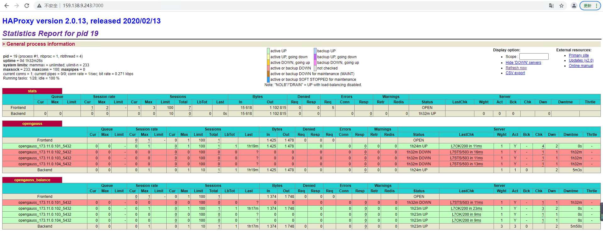

## 一、HAProxy 简介

- HAProxy 是一个开源的项目，其代码托管在 Github 上，代码链接如下：[HAProxy 代码链接](https://github.com/haproxy/haproxy)。
- HAProxy 提供高可用性、负载均衡以及基于 TCP 和 HTTP 应用的代理，支持虚拟主机，它是免费、快速并且可靠的一种解决方案。
- HAProxy 实现了一种事件驱动, 单一进程模型，此模型支持非常大的并发连接数。

## 二、HAProxy 实现 openGauss 集群的读写分离和负载均衡

- HAProxy 实现 openGauss 集群的读写分离和负载均衡，前提条件需由 Patroni 管理 openGauss 数据库集群，关键点在于配置文件的配置。

- HAProxy 配置中分成五部分内容，分别如下：

  ```
  - global：设置全局配置参数，属于进程的配置，通常是和操作系统相关。

  - defaults：配置默认参数，这些参数可以被用到frontend，backend，listen组件；

  - frontend：接收请求的前端虚拟节点，frontend可以更加规则直接指定具体使用后端的backend；

  - backend：后端服务集群的配置，是真实服务器，一个backend对应一个或者多个实体服务器；

  - listen ：frontend和backend的组合体。
  ```

- 在 HAProxy 配置文件中，[HAProxy 完整配置文件链接](../image/haproxy/haproxy.cfg)，我们定义了两个 listen 模块，名称分别为 opengauss 和 opengauss_balance,对应集群主机的写操作和备机的读操作及负载均衡。在 listen 模块中，使用 server 关键字设置后端服务器，即设置 Patroni 管理的 openGauss 集群中各个数据库节点的 ip 和端口号，即可将数据库节点的信息加入到 HAProxy 的管理中。

### 2.1 主机的写操作配置

```
listen opengauss  # 用于主机
    bind *:5000   #开放的端口之一，用于连接主机
    option httpchk
     # 开启对后端服务器的健康检测，接受健康监测[check]
    http-check expect status 200
    default-server inter 3s fall 3 rise 2 on-marked-down shutdown-sessions
    # 监测的间隔时间[inter 3s], 监测失败多少次后被认为后端服务器是不可用的[fall 3]，监测正常多少次后被认为后端服务器是可用的[rise 2]，当标记为down时，关闭HAProxy到后台服务器的连接[on-marked-down shutdown-sessions]
    server opengauss_ip1_port1 ip1:port1 maxconn 100 check port 8008
    server opengauss_ip2_port2 ip2:port2 maxconn 100 check port 8008
    server opengauss_ip3_port3 ip3:port3 maxconn 100 check port 8008
    server opengauss_ip4_port4 ip4:port4 maxconn 100 check port 8008
    # 使用server关键字设置后端服务器，为后端服务器所设置的内部名称[opengauss_ip1_port1], 该名称将会呈现在日志或警报中，后端服务器的IP地址，支持端口映射[ip1:port1]
```

**原理分析：**

HAProxy 配置中调用了健康监测 REST API 端点，通过 Patroni 获取集群中的主机备机信息。

Patroni 有一个丰富的 REST API(Representational State Transfer，表现层状态转化)，所谓 REST API，其是前后端分离的最佳实践，是开发的一套标准或者是一套规范，其特点总结如下：

```
(1) 每一个URI代表一种资源；

(2) 客户端和服务器之间，传递这种资源的表现层；

(3) 客户端通过四个HTTP动词，对服务器端资源进行操作，实现“表现层状态转化”。
```

在 HTTP 协议中，四个表示操作方式的动词为：GET、POST、PUT、DELETE，它们分别对应四种基本的操作：GET 用来获取资源，POST 用来新建资源（也可以用于更新资源），PUT 用来更新资源，DELETE 用来删除资源。

Patroni 中的 REST API，有以下几种使用场景：参考链接：[Patroni REST API](https://patroni.readthedocs.io/en/latest/rest_api.html)

```
(1) 由Patroni自身使用用以leader竞选；

(2) 由patronictl工具使用用以执行 failovers、switchovers、reinitialize、restarts、reloads操作；

(3) 由HAProxy或者其他负载均衡器进行HTTP健康监测，或者监控。
```

本文中 HAProxy 即利用 Patroni 中的 REST API 进行健康监测，进而识别集群中的主机，备机，以及各个节点的健康状态。

对于健康监测中的 GET 请求，Patroni 返回一个包含节点状态、HTTP 状态码的 JSON 文档。如果不需要复杂的 JSON 文档，只保留一些关键信息，可以用 OPTIONS 代替 GET。

对于下列的请求：当 Patroni 节点拥有 leader 锁，且作为 primary 节点 running 时，Patroni REST API 将返回 HTTP 状态码 200：

```
(1) GET /

(2) GET /master

(3) GET /primary

(4) GET /read-write
```

上述配置中，`option httpchk `相当于调用了`GET / `请求，`http-check expect status 200`相当于过滤出健康监测返回的状态码应为 200，对于所配置的数据库，当为主机时，其状态码为 200，于是上面的配置即选出了数据库集群中的主机，用 HAProxy 的 ip 和 5000 端口号即可代理集群中的主机。在 openGauss 集群中，通过 gsql 命令即可连接到集群的主机

```
gsql -d postgres -h HAProxy_ip -p 5000 -U user -W password
```

### 2.2 备机的读操作及负载均衡配置

```
listen opengauss_balance  #用于备机
    bind *:5001           #开放的端口之一，用于连接备机
        mode tcp
        option tcplog
        balance roundrobin  #balance定义负载均衡算法，roundrobin表示基于权重进行轮询，在服务器的处理时间保持均匀分布时，这是最平衡、最公平的算法。此算法是动态的，这表示某权重可以在运行时进行调整
    option httpchk OPTIONS /replica
    http-check expect status 200
    default-server inter 3s fall 3 rise 2 on-marked-down shutdown-sessions
    server opengauss_ip1_port1 ip1:port1 maxconn 100 check port 8008 inter 5000 rise 2 fall 2
    server opengauss_ip2_port2 ip2:port2 maxconn 100 check port 8008 inter 5000 rise 2 fall 2
    server opengauss_ip3_port3 ip3:port3 maxconn 100 check port 8008 inter 5000 rise 2 fall 2
    server opengauss_ip4_port4 ip4:port4 maxconn 100 check port 8008 inter 5000 rise 2 fall 2
```

**原理分析：**

对于`GET /replica`请求，当 Patroni 节点为 running 状态，角色为 replica，未设置 noloadbalance 标签时，http 返回状态码为 200。

上述配置中，`option httpchk OPTIONS /replica`即调用了`OPTIONS /replica`请求，并以 OPTIONS 代替 GET 简化返回的信息，`http-check expect status 200`相当于过滤出健康监测返回的状态码应为 200，因此当所配置的数据库为集群中的备机时，其状态码为 200，于是上面的配置即选出了数据库集群中的备机，同时配置`balance roundrobin`，即定义负载均衡算法，对于读请求，将轮询发送于各个运行中的备机，因此，上述的配置可以用 HAProxy 的 ip 和 5001 端口号代理集群中的备机，且实现负载均衡。

在 openGauss 集群中，通过 gsql 命令即可连接到集群的备机

```
gsql -d postgres -h HAProxy_ip -p 5001 -U user -W password
```

### 2.3 监控界面描述

除此之外，我们还配置了一个 HAProxy 的监控界面，通过访问该界面可以查看集群中各个节点的状态。

```
listen stats  #定义一个名为stats的部分
    mode http
    # 定义为HTTP模式
    bind *:7000  #开放的端口之一，用于监控
    # 定义监听的套接字
    stats enable
    # stats是HAProxy的一个统计页面的套接字
    stats uri /
    # 设置统计页面的uri为/
```

上述配置中，访问 http://ip:7000/即可查看监控界面，其中 ip 为部署 HAProxy 机器的 ip，页面信息如下图所示：



上图中，对应一主三备集群，第一个模块 openGauss 对应写操作，绿色的一栏表示集群中的主机，第二个模块 opengauss_balance 对应读操作，绿色的栏表示集群中的备机。

至此，可通过 HAProxy 实现 Patroni 管理的 openGauss 集群的读写分离和负载均衡。
