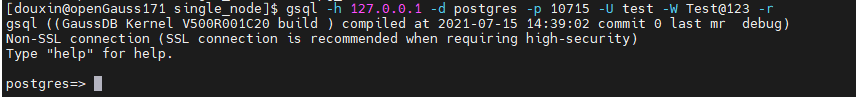
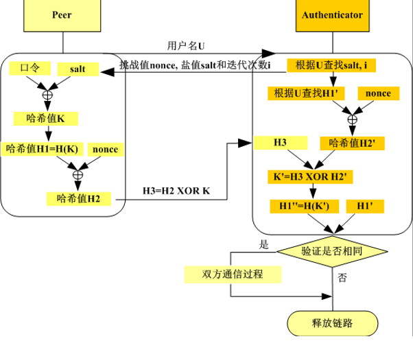
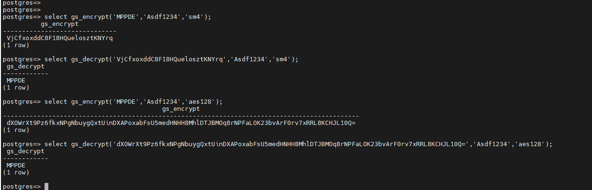

## 1. 国密算法介绍

国密即国家密码局认定的国产密码算法，主要有 SM1，SM2，SM3，SM4。密钥长度和分组长度均为 128 位。针对银行客户对数据库安全能力的诉求以及提高产品安全竞争力的要求，进行数据库企业级安全能力增强，openGauss 自 2.0.0 版本支持了国密算法，主要包括用户认证支持国密 SM3 算法[sm3 算法](http://www.gmbz.org.cn/main/viewfile/20180108023812835219.html)，支持 SM4 国密算法加解密函数[sm4 算法](http://www.gmbz.org.cn/main/viewfile/20180108015408199368.html)。

## 2. 国密 SM3 算法——用户认证

## 2.1 使用方法

openGauss 现支持四种用户认证方式，其通过 postgresql.conf 文件中的参数 password_encryption_type 确定，认证方式与该参数的对应关系如下表所示：

| 认证方式   | 参数                       |
| ---------- | -------------------------- |
| md5        | password_encryption_type=0 |
| sha256+md5 | password_encryption_type=1 |
| sha256     | password_encryption_type=2 |
| sm3        | password_encryption_type=3 |

其中 SM3 认证算法目前只支持 gsql、 JDBC、 ODBC 三种连接方式。

创建 SM3 认证方式的用户的步骤：

（1）在 postgresql.conf 文件中配置 password_encryption_type=3，并重启数据库使该参数生效


（2）创建用户

如下示例中，创建了 test 用户，通过系统表 pg_authid 的 rolpassword 字段可以查看用户创建时对应的加密方式，图示即对应 sm3 加密


（3）在 pg_hba.conf 文件中配置认证方式为 sm3


此时 test 用户远程登录方可认证通过



对于创建其他认证方式的用户，过程与 SM3 类似，此处不再赘述，需注意加密方式与认证方式对应即可。

## 2.2 实现原理

openGauss 使用 RFC5802 口令认证方案

- 用户秘钥生成

  RFC5802 秘钥衍生过程如下图所示：

  

  ```
  SaltedPassword := PBKDF2 (password, salt, i)
  ClientKey := HMAC(SaltedPassword, "Client Key")
  StoredKey := Hash(ClientKey)
  ```

  服务器端存的是 StoredKey 和 ServerKey:

  1）StoredKey 是用来验证 Client 客户身份的

  服务端认证客户端通过计算 ClientSignature 与客户端发来的 ClientProof 进行异或运算，从而恢复得到 ClientKey，然后将其进行 hash 运算，将得到的值与 StoredKey 进行对比。如果相等，证明客户端验证通过。

  2）ServerKey 是用来向客户端表明自己身份的

  类似的，客户端认证服务端，通过计算 ServerSignature 与服务端发来的值进行比较，如果相等，则完成对服务端的认证。

  3）在认证过程中，服务端可以计算出来 ClientKey，验证完后直接丢弃不必存储。

  要做到合法的登录，必须知道 Password、SaltedPassword 或者 ClientKey。如果 StoryKey 和 ServerKey 泄露，无法做到合法登录。

- 认证流程

  标准 RFC5802 口令认证流程如下图所示：

  

  1、客户端发送 username 给服务端。

  2、服务端返回给客户端 AuthMessage 和计算出来的 ServerSignature。

  3、客户端收到信息后，首先利用认证信息 AuthMessage 中的 salt 和 iteration-count(迭代次数)，从 password 计算得到 SaltedPassword，然后计算得到下层所有的 key。计算 HMAC(ServerKey, AuthMessage) == ServerSignature 是否相等，如果相等，则 client 完成对服务端的认证。

  4、客户端将计算得到的 ClientProof 发送给服务端。

  5、服务端使用其保存的 StoredKey 和 AuthMessage 计算 HMAC，在和接收的 client 发送的 ClientProof 进行异或，得到 ClientKey，在对 ClientKey 进行哈希，和其保存的 StoredKey 进行比较是否一致。如果一致，则客户端的认证通过。

  服务器端收到客户端请求后，根据 pg_hba.conf 配置的认证方式，与客户端进行相应的认证交互。

## 3. 国密 SM4 算法——数据加解密

SM4 国密算法可用于对表中的某一列数据进行加解密。参考 gs_encrypt_aes128 加密函数、gs_decrypt_aes128 解密函数，新增的加密函数 gs_encrypt，解密函数 gs_decrypt 支持 aes128、sm4 的加解密，可以兼容 aes128。其中 SM4 算法调用 openssl 中的 EVP_sm4_cbc()接口。

gs_encrypt_aes128 和 gs_decrypt_aes128 函数示意：


gs_encrypt 和 gs_decrypt 函数示意：



利用 SM4 算法对表中数据进行加解密示意图：


至此，openGauss 支持使用国密 SM3 算法进行用户认证，SM4 算法进行数据加解密。
