# Copy 进阶用法

本文出处：[https://www.modb.pro/db/239809](https://www.modb.pro/db/239809)

copy 是最基础的导入导出命令，那么它有什么其他用法可以帮助我们更好地进行导入导出的工作呢？

# 关于导入方式

导入数据的方式有很多种，下面列举的是最常见的三种方式

| 方式                   | 特点                                                                                                                                                               |
| ---------------------- | ------------------------------------------------------------------------------------------------------------------------------------------------------------------ |
| INSERT                 | 通过 INSERT 语句插入一行或多行数据，及从指定表插入数据。                                                                                                           |
| COPY                   | 通过 COPY FROM STDIN 语句直接向 openGauss 写入数据。通过 JDBC 驱动的 CopyManager 接口从其他数据库向 openGauss 数据库写入数据时，具有业务数据无需落地成文件的优势。 |
| gsql 工具的元命令\copy | 与直接使用 SQL 语句 COPY 不同，该命令读取/写入的文件只能是 gsql 客户端所在机器上的本地文件。                                                                       |

**我们可以理解为使用 copy 的时候文件是保存在服务器端（101）的，使用\copy 是备份到客户端（198）上。**

测试：

1. 在 198 上登陆 101 数据库执行 copy
   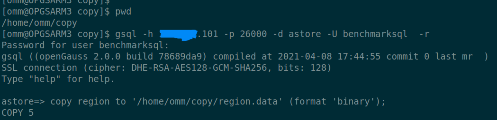
   查看 198 的/home/omm/copy 文件夹
   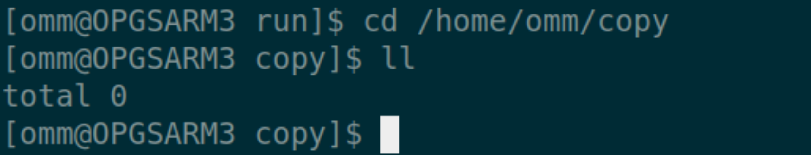
   查看 101 的/home/omm/copy 文件夹
   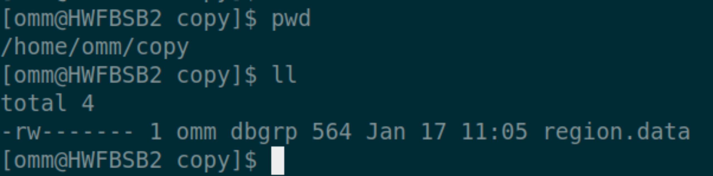
2. 在 198 上登陆 101 数据库执行\copy
   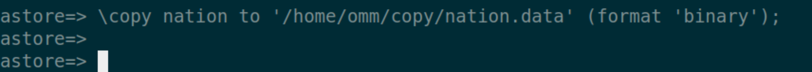
   查看 198 的/home/omm/copy 文件夹
   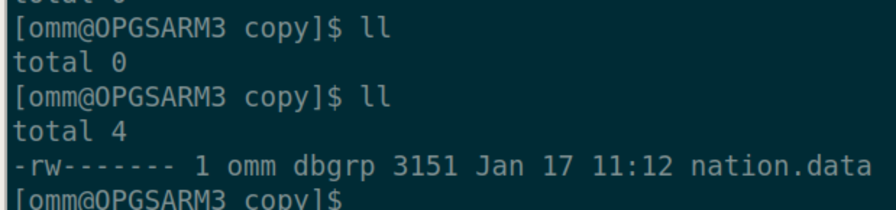
   查看 101 的/home/omm/copy 文件夹
   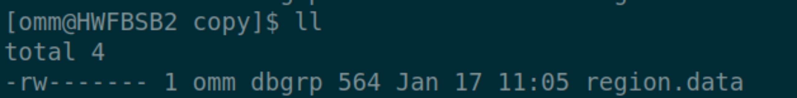

**导入的时候也是一样，使用 copy 是从服务端寻找文件，使用\copy 是从客户端上寻找文件。**

# 关于数据流向

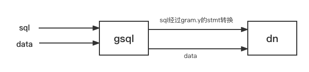

1. dn 进行合法性检测后进行转码
2. 进行解析，分离字段
3. 检测格式错误，格式错误的将要进入错误表
4. 没有格式错误的，构造成 tuple 进行插入

**Stdin 方式 data 由 gsql 读起，然后 gsql 发送给 dn
Copy From 文本方式 data 由 dn 读
\Copy From 文本方式 data 由 gsql 发送给 dn**

# 关于权限

由于 copy 命令始终是到数据库服务端找文件，当以文件形式导入导出数据时需以超级用户执行，权限要求很高，适合数据库管理员操作;而 \copy 命令可在客户端执行导入客户端的数据文件，权限要求没那么高，适合开发人员，测试人员使用。

1. 使用普通用户 copy

```
$ gsql -p 26000 -d astore -U benchmarksql -W 'passwd' -c "copy copy_test to '/home/omm/test.csv' (format 'csv',header 'true')" ERROR:  COPY to or from a file is prohibited for security concerns HINT:  Anyone can COPY to stdout or from stdin. gsql's \copy command also works for anyone.
```

> 官方文档解释：
> 当参数 enable_copy_server_files 关闭时，只允许初始用户执行 COPY FROM FILENAME 或 COPY TO FILENAME 命令，当参数 enable_copy_server_files 打开，允许具有 SYSADMIN 权限的用户或继承了内置角色 gs_role_copy_files 权限的用户执行，但默认禁止对数据库配置文件，密钥文件，证书文件和审计日志执行 COPY FROM FILENAME 或 COPY TO FILENAME，以防止用户越权查看或修改敏感文件。

更改参数

```
astore=# show enable_copy_server_files ; enable_copy_server_files  -------------------------- off (1 row) astore=# alter system set enable_copy_server_files=on; ALTER SYSTEM SET astore=# show enable_copy_server_files ;               enable_copy_server_files  -------------------------- on (1 row)
```

再次执行 copy

```
$ gsql -p 26000 -d astore -U benchmarksql -W 'passwd' -c "copy copy_test to '/home/omm/test.csv' (format 'csv',header 'true')" ERROR:  must be system admin or a member of the gs_role_copy_files role to COPY to or from a file HINT:  Anyone can COPY to stdout or from stdin. gsql's \copy command also works for anyone.
```

授权 SYSADMIN

```
openGauss=# grant all privileges to benchmarksql; ALTER ROLE
```

再次执行 copy
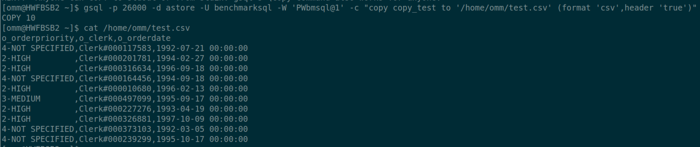

1. 使用普通用户\copy

```
hr=# \c - sysadmin Password for user sysadmin:  Non-SSL connection (SSL connection is recommended when requiring high-security) You are now connected to database "hr" as user "sysadmin". hr=> \du           List of roles Role name | Attributes | Member of  -----------+------------+----------- sysadmin  |            | {} hr=> \copy emp to '/home/omm/emp.csv' (format 'csv',header 'true')
```

# 导入导出最佳实践

> **使用 COPY 命令导入数据**
>
> COPY 命令从本地或其它数据库的多个数据源并行导入数据。COPY 导入大量数据的效率要比 INSERT 语句高很多，而且存储数据也更有效率。

> **使用 gsql 元命令导入数据**
> \copy 命令在任何 gsql 客户端登录数据库成功后可以执行导入数据。与 COPY 命令相比较，\copy 命令不是读取或写入指定文件的服务器，而是直接读取或写入文件.这个操作不如 COPY 命令有效，因为所有的数据必须通过客户端/服务器的连接来传递。对于大量的数据来说 COPY 命令可能会更好。

接下来通过几个测试用例，来更好地了解 copy 相关用法

测试环境：
128G SSD 40CPU
OPENGAUSS 2.1.0 单机

表结构
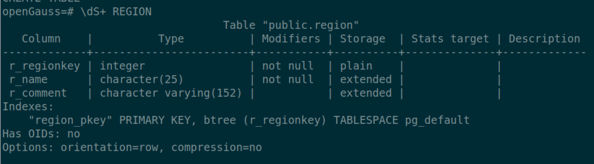
数据文件
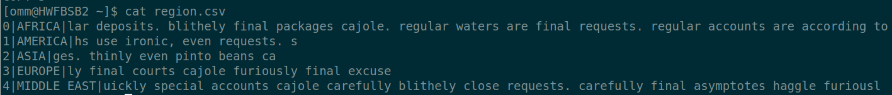

1. 指定格式，分隔符导入数据

```
openGauss=# \copy region from 'region.csv' WITH (FORMAT csv,DELIMITER '|');
```

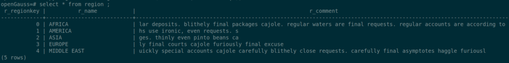

```
openGauss=# \copy region from 'region.csv' delimiter '|' ;
```

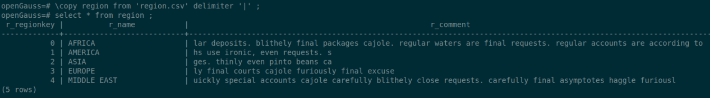

1. 指定导入的字段

```
$ gsql -p 26000 -d postgres -c "copy region(r_regionkey,r_name,r_comment) from '/home/omm/region.csv' delimiter '|';"
```

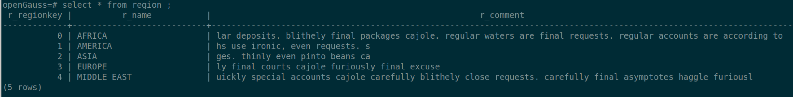
指定导入前两列（表有三列）

```
$ gsql -p 26000 -d postgres -c "copy region(r_regionkey,r_name) from '/home/omm/region.csv' delimiter '|' IGNORE_EXTRA_DATA;"
```

若不加 IGNORE_EXTRA_DATA 会报错


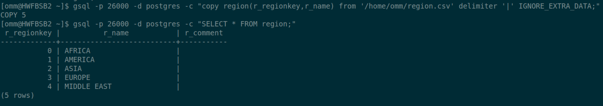
\3. 指定格式导出（全列）

```
$ gsql -p 26000 -d postgres -c "copy region to '/home/omm/region.data' (format 'binary')"
```

指定格式导入（全列）

```
$ gsql -p 26000 -d postgres -c "copy region from '/home/omm/region.data' with(format 'binary')"
```

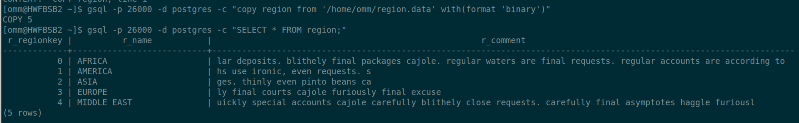

指定格式导出（指定列）

`$ gsql -p 26000 -d astore -U benchmarksql -W 'passwd' -c "copy copy_test(o_orderpriority,o_clerk) to '/home/omm/test1.csv' (format 'csv',header 'true')" `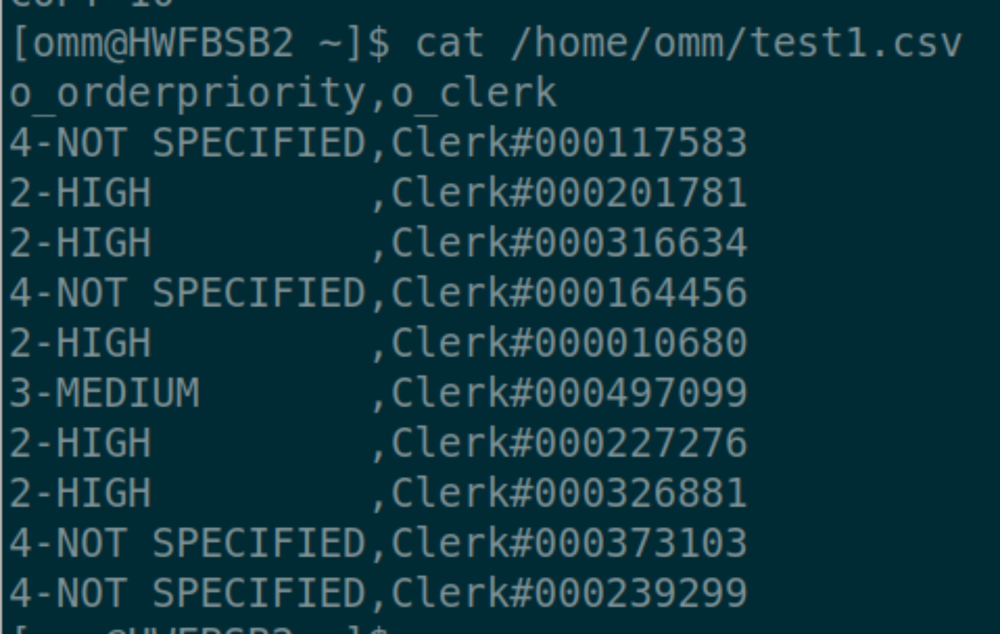

指定格式导入（指定列）

```
$ gsql -p 26000 -d astore -U benchmarksql -W 'passwd' -c "copy copy_test(o_orderpriority,o_clerk) from '/home/omm/test1.csv' (format 'csv',header 'true',IGNORE_EXTRA_DATA )"
```

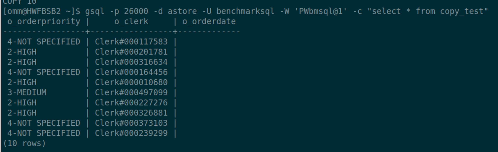

1. 指定表中各个列的转换表达式

```
$ gsql -p 26000 -d postgres -c "copy copy_test(a,b,c) FROM '/home/omm/test_noheader.csv' DELIMITERS ',' transform(a AS a||b,b AS b+1,c AS date_trunc('year',c))"
```

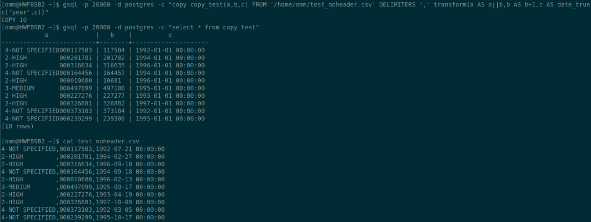
\5. 在固定长度模式中，定义每一个字段在数据文件中的位置。
按照 column(offset,length)格式定义每一列在数据文件中的位置。

```
$ gsql -p 26000 -d hr -c "copy test (a,b,c) FROM '/home/omm/emp.csv' fixed FORMATTER(a(0,2),b(5,2),c(11,3)) header"
```

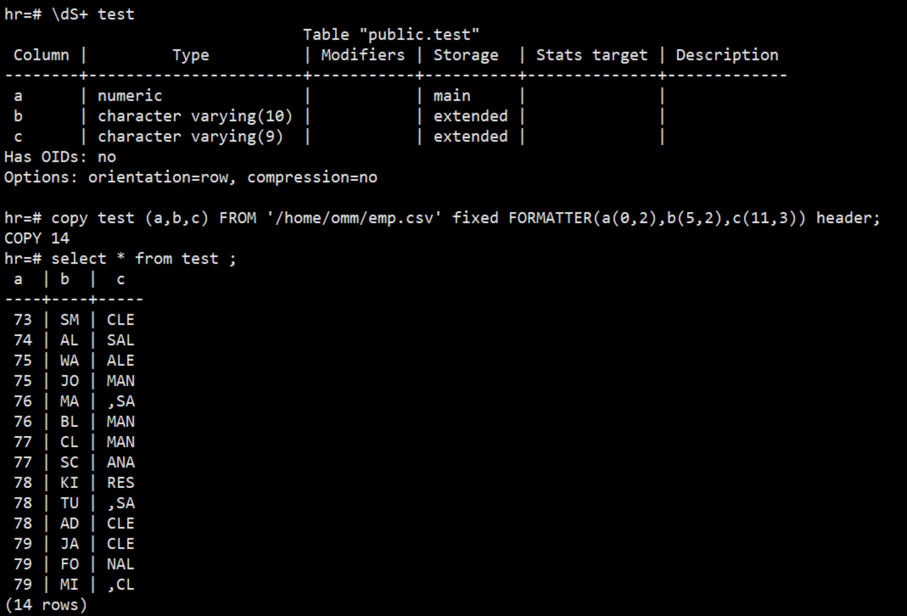
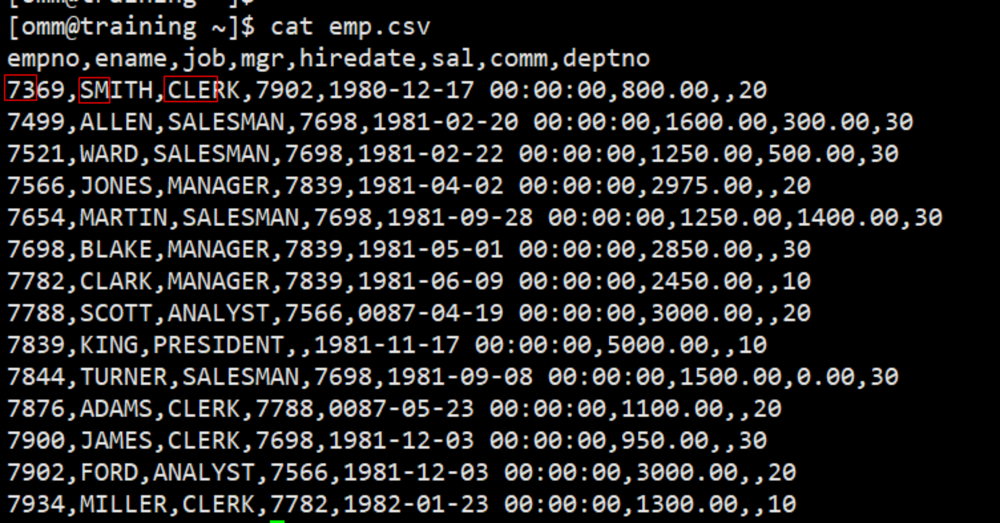
\6. 并行导入
\copy 支持并行导入，最大并行数为 8（指定超过 10，按照 8 并行）
customer 表 14G
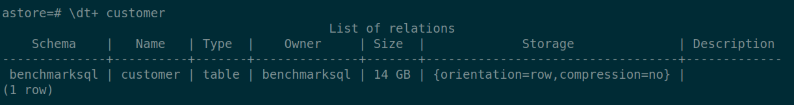
（1）不开启并行导入–csv

```
start_time=$(date +%s) gsql -p 26000 -d postgres -c "\copy customer from '/gaussdata/copy/customer.csv' (format 'csv');" end_time=$(date +%s) echo 'The sum7 time is '$[$end_time-$start_time]  'seconds'
```

453s 执行完毕


（2）开启并行导入–csv

```
start_time=$(date +%s) gsql -p 26000 -d postgres -c "\copy customer from '/gaussdata/copy/customer_par.csv' (format 'csv') parallel 10;" end_time=$(date +%s) echo 'The sum8 time is '$[$end_time-$start_time]  'seconds'
```

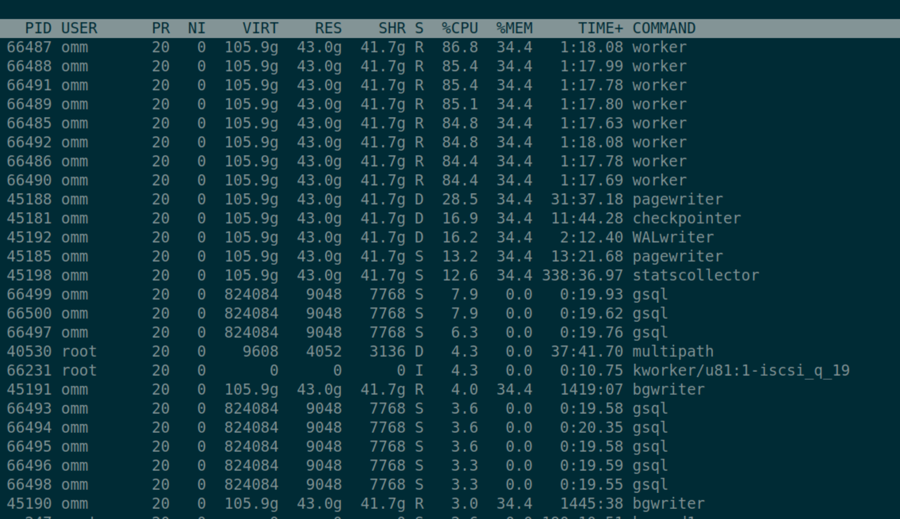
103s 执行完毕
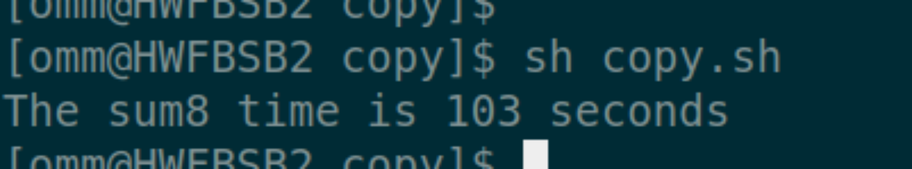
（3） 开启并行导入–text

```
start_time=$(date +%s) gsql -p 26000 -d postgres -c "\copy customer from '/gaussdata/copy/customer_par.txt' (format 'text') parallel 10;" end_time=$(date +%s) echo 'The sum time is '$[$end_time-$start_time]  'seconds'
```

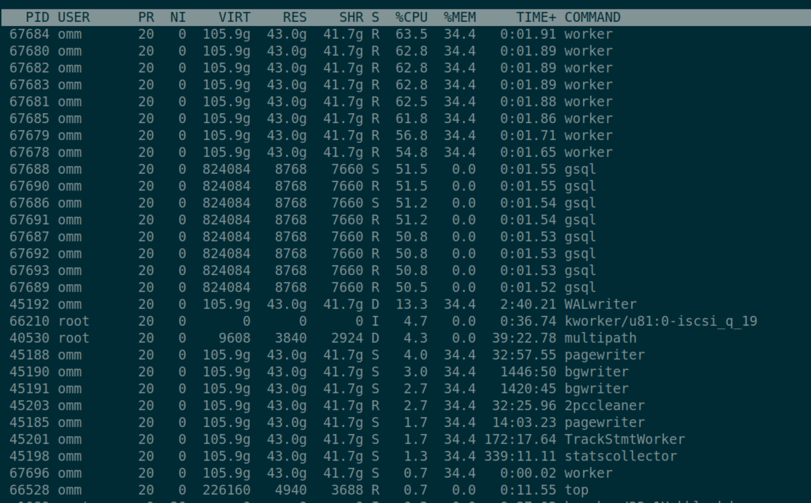
107s 执行完毕
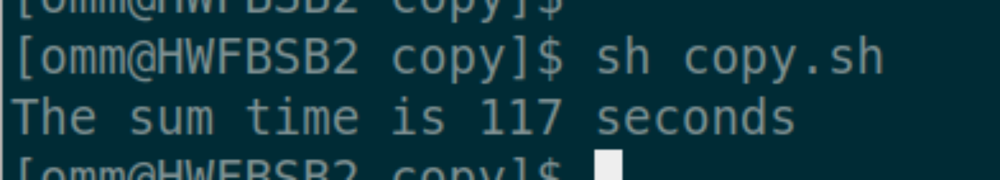
（4）开启并行导入–binary

```
start_time=$(date +%s)
gsql -p 26000 -d postgres -c "\copy customer from '/gaussdata/copy/customer.data' (format 'binary') parallel 10;"
end_time=$(date +%s)
echo 'The sum6 time is '$[$end_time-$start_time]  'seconds'
不支持binary格式并行导入总结copy to文件保留在服务器上，\copy to 文件保留在客户端上，copy from从服务器上读取文件，\copy from从客户端读取文件copy必须初始用户使用，\copy 普通用户即可执行\copy 只适合小批量、格式良好的数据导入，不会对非法字符做预处理，也无容错能力，无法适用于含有异常数据的场景。copy不支持并行parallel语法，\copy to parallel 虽然不会报错，但并行不生效，\copy from parallel 支持csv和text格式并行导入
```
