# DBEAVER 连接 MogDB

本文出处：[https://www.modb.pro/db/77704](https://www.modb.pro/db/77704)

驱动下载地址
[https://opengauss.org/zh/download.html](https://opengauss.org/zh/download.html)
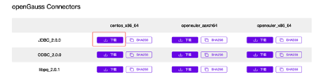
DBEAVER 下载地址
[https://dbeaver.io/download/](https://dbeaver.io/download/)
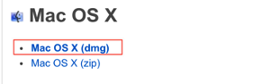

配置连接
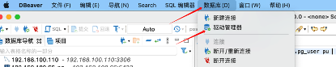
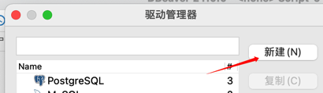
将驱动解压到指定的目录，然后在库里添加文件夹
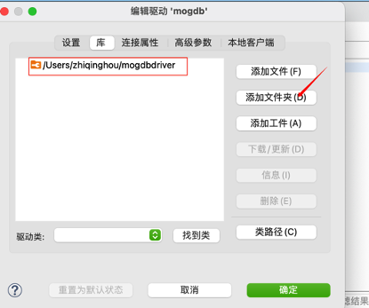
单击找到类，会自动找到类名
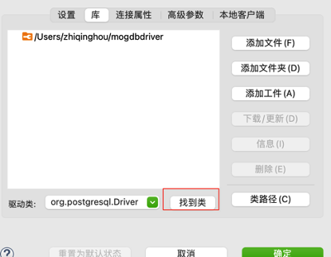
回到设置，注意类名就是上图的驱动类的名称，URL 模板安装 PG 填写即可
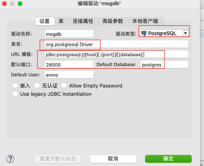
新建连接
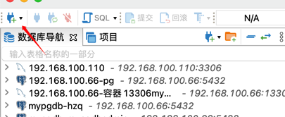
搜索 mogdb
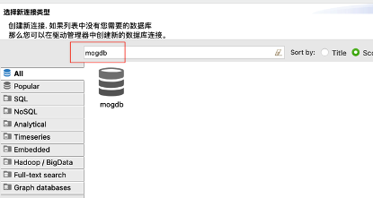
填写连接信息即可
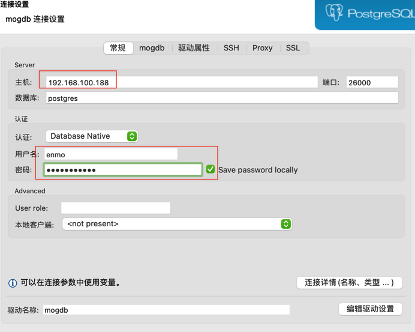
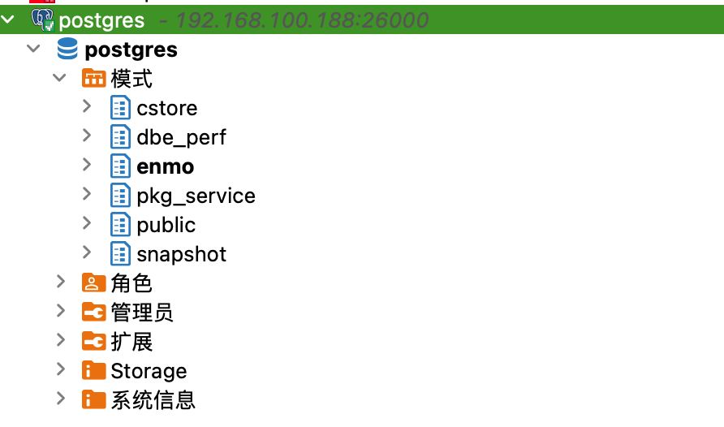
