# Jmeter 压测 Mogdb 使用指南

本文出处：[https://www.modb.pro/db/388141](https://www.modb.pro/db/388141)

## 1.Jmeter 介绍

```
Apache JMeter是Apache组织开发的基于Java的压力测试工具。用于对软件做压力测试，它最初被设计用于Web应用测试，但后来扩展到其他测试领 域。JMeter 可以用于对服务器、网络或对象模拟巨大的负载，来自不同压力类别下测试它们的强度和分析整体性能。另外，JMeter能够对应用程序做 功能/回归测试，通过创建带有断言的脚本来验证你的程序返回了你期望的结果。
```

## 2.安装 Jmeter

### (1)配置 java 环境

```
根据自己的系统下载对应的jdk,下载地址https://www.oracle.com/java/technologies/downloads/#java8，这里不做赘述
mac@xiaofandemac bin % java -version
openjdk version "17.0.1" 2021-10-19
OpenJDK Runtime Environment (build 17.0.1+12-39)
OpenJDK 64-Bit Server VM (build 17.0.1+12-39, mixed mode, sharing)
```

### (2)下载 jmeter

```
下载地址:https://jmeter.apache.org/download_jmeter.cgi，下载二进制版本即可，可以直接使用不用编译
```

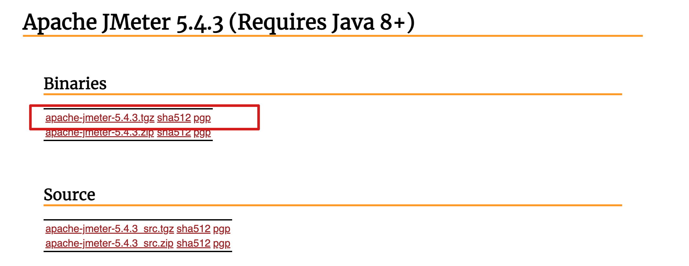

### (3)解压 jmeter 并使用

```
zhangfan@xiaofandemac Downloads % cd apache-jmeter-5.4.3
zhangfan@xiaofandemac apache-jmeter-5.4.3 % ls
LICENSE		README.md	bin		extras		licenses
NOTICE		backups		docs		lib		printable_docs
zhangfan@xiaofandemac apache-jmeter-5.4.3 % cd bin
zhangfan@xiaofandemac bin % ./jmeter -v
WARNING: package sun.awt.X11 not in java.desktop
    _    ____   _    ____ _   _ _____       _ __  __ _____ _____ _____ ____
   / \  |  _ \ / \  / ___| | | | ____|     | |  \/  | ____|_   _| ____|  _ \
  / _ \ | |_) / _ \| |   | |_| |  _|    _  | | |\/| |  _|   | | |  _| | |_) |
 / ___ \|  __/ ___ \ |___|  _  | |___  | |_| | |  | | |___  | | | |___|  _ <
/_/   \_\_| /_/   \_\____|_| |_|_____|  \___/|_|  |_|_____| |_| |_____|_| \_\ 5.4.3

Copyright (c) 1999-2021 The Apache Software Foundation
注意:这里没有配置jmeter的环境变量，使用时需要绝对路径执行.也可配置环境变量，看个人喜好，这里也有配置方法
export JMETER_HOME=/Users/zhangfan/Downloads/apache-jmeter-5.4.3(jmter所在路径)
export PATH=${PATH}:${JMETER_HOME}/bin
```

## 3.图形化使用 jmeter

### (1)调出图形化

```
执行./jmeter.sh，即可调出图形化界面 zhangfan@xiaofandemac bin % ./jmeter.sh
```

### (2)使用 jmeter 对 Mogdb 进行压测

测试场景如下:用 Jmeter 压测 Mogdb,100 并发，持续 5 分钟，对一条 sql 进行压测，看数据库的性能情况

#### 1.创建执行计划

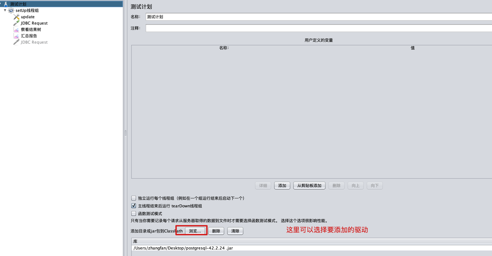

#### 2.创建线程组


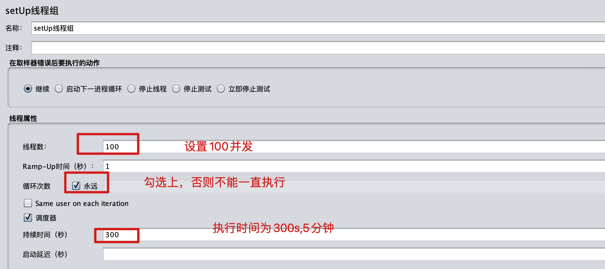

```
setUp线程组和tearDown线程组，它们与普通线程组区别在于，setUp线程在普通线程执行前自动触发执行；而tearDown线程组在主线程结束后执行。 setUP线程组在测试任务ThreadGroup 运行前先被运行。通常用在运行测试任务前，做初始化工作。例如建立数据库连接初始分化工作 tearDown线程组在测试任务线程组运行结束后被运行。通常用来做清理测试脏数据、登出、关闭资源等工作。例如关闭数据库连接。
```

#### 3.编辑 JDBC 连接信息

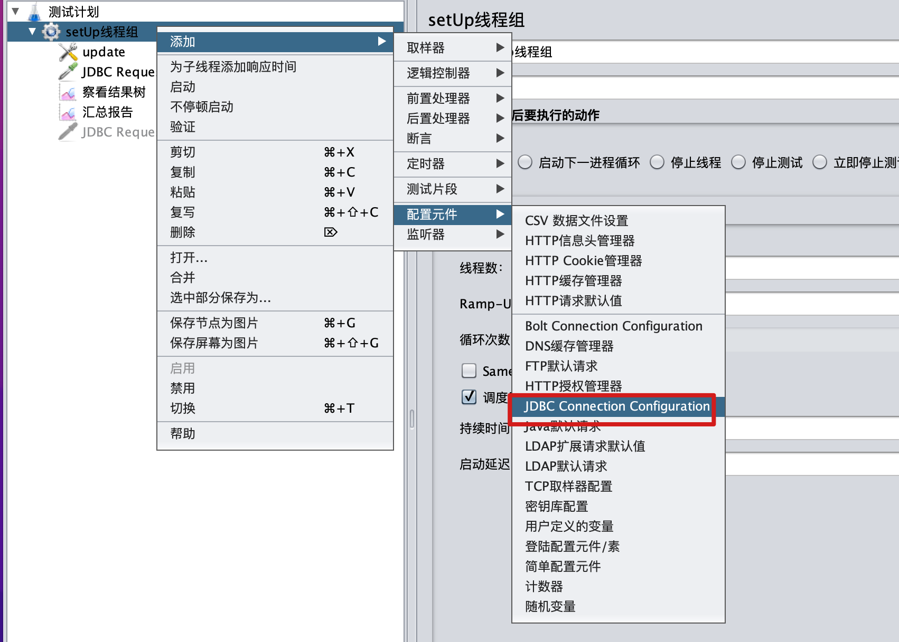

根据具体信息填写，数据的连接信息

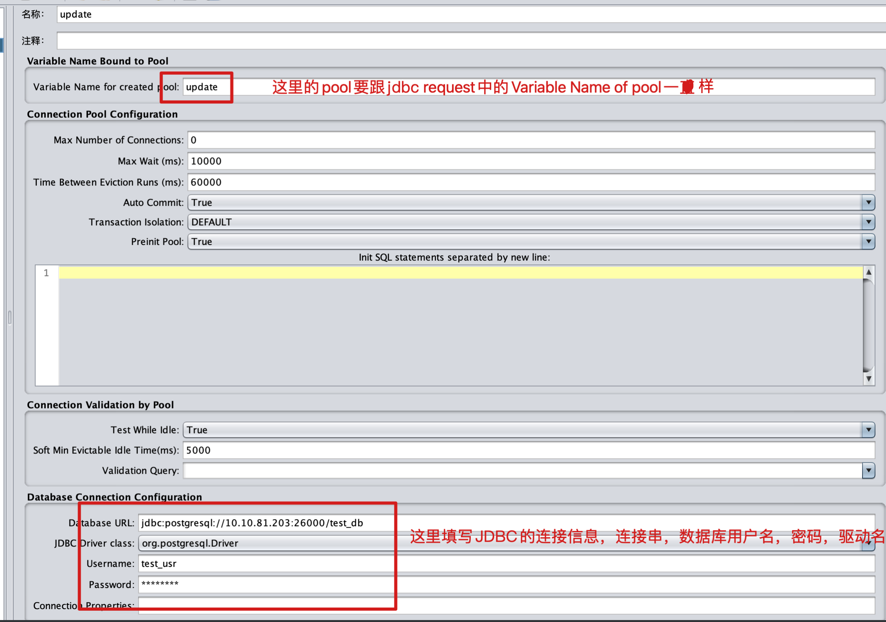

#### 4.创建 JDBC request

```
这个sampler可以向数据库发送一个jdbc请求(sql语句)，它经常需要和JDBC Connection Configuration 配置元件一起配合使用。
```

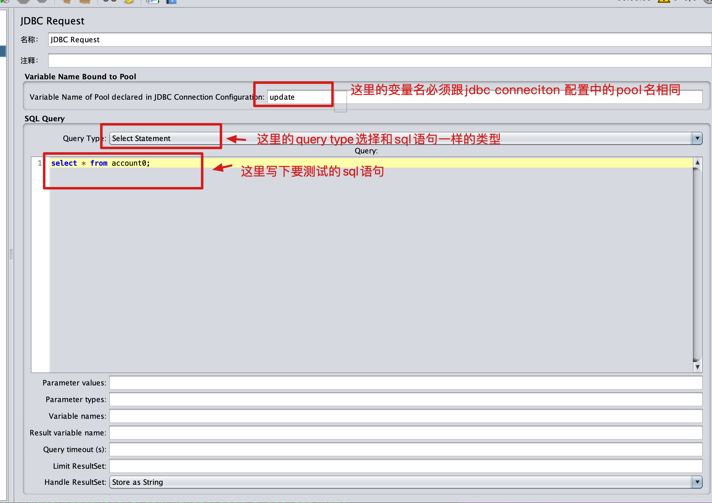

#### 5.创建汇总报告

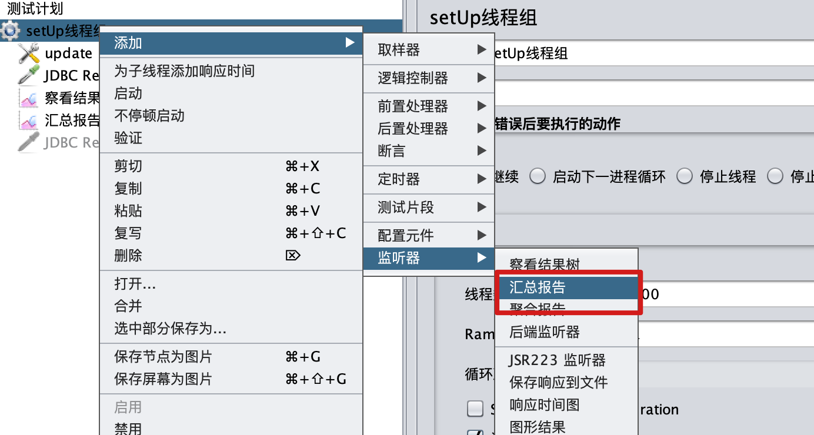

汇总报告可以对测试结果有总体的概览

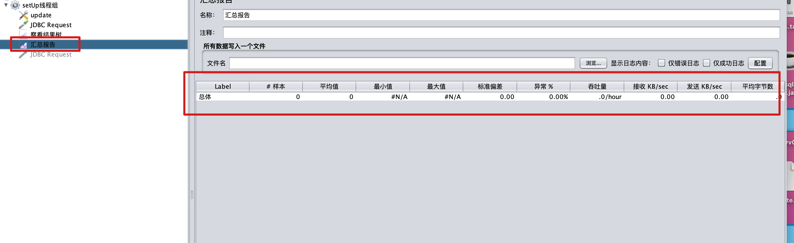

#### 6.创建察看结果树

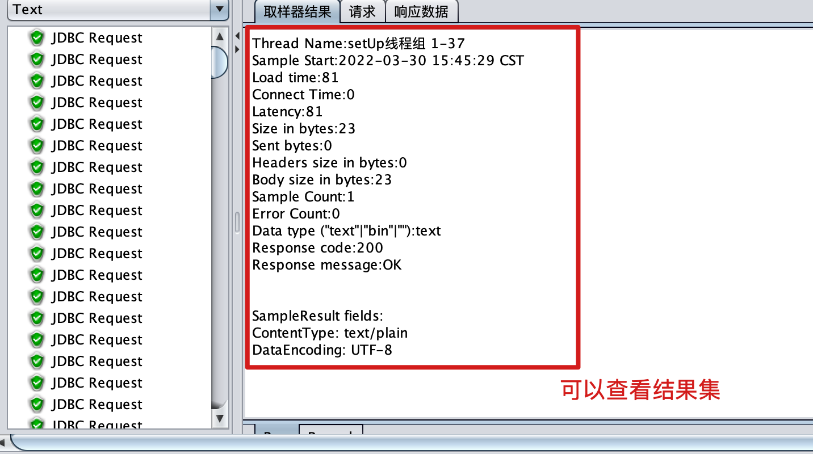

## 4.命令行使用 jmeter

将图形化创建的执行计划保存，将 jmx 文件，放入要压测服务器上，压测服务上已经安装好了 jmeter

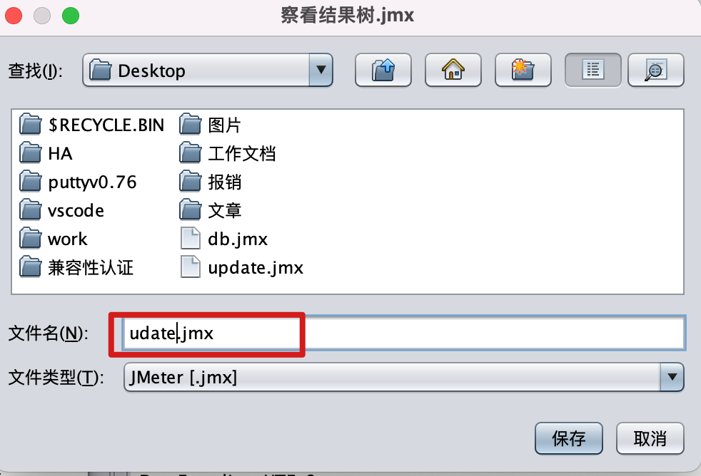

#### (1)Jmeter 命令行参数介绍

命令：jmeter -n -t testplan filename -l listener filename

```
 -n：说明jmeter非GUI运行
 -t：运行的测试计划名称，xxx.jmx路径+文件
 -l：JTL文件去保存结果，路径+xxx.jtl
 -r: 使用远程执行
 -j：保存执行log
 -H：代理机主机名或者ip地址
 -P：代理机端口
 -e:设置测试完成后生成报表
```

#### (2)命令行执行

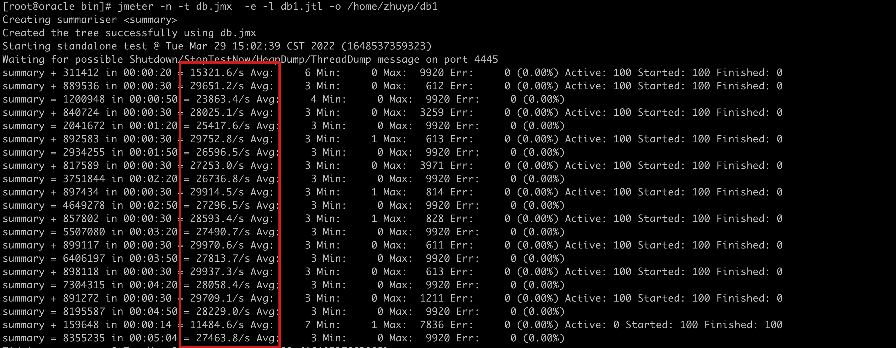

#### (3)结果解析

```
summary + 311412 in 00:00:20 =    15321.6/s Avg:    6 Min:    0 Max:    9920 Err:     0 (0.00%) Active: 100 Started: 100Finished: 0
summary +是这5分钟数据，summary =是累计到当前时刻所有的数据
311412是发出的请求数，00:00:20是发出的时间,15321是每秒发出的请求，即吞吐量，Avg，Min,Max平均响应时间，最小响应时间，最大响应时间，单位都是ms，Err后面跟的数据是错误数和错误比例
```

#### (2)报表概览

```
测试结果后在指定文件夹中生成报告文件，将打包，下载到自己的电脑，用浏览器打开即可
[root@oracle zhuyp]# cd db1/
[root@oracle db1]# ls
content  index.html  sbadmin2-1.0.7  statistics.json
[root@oracle db1]#
```

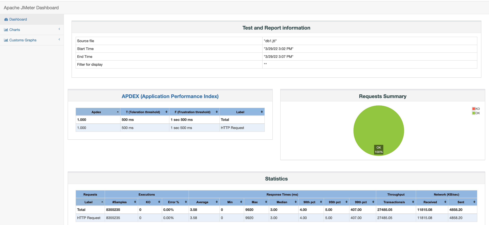
