# MogDB - WDR 报告导致的基库容量过大问题处理

本文出处：[https://www.modb.pro/db/404052](https://www.modb.pro/db/404052)

MogDB 版本 V 2.0.1
MogDB 版本 V 2.1.1

## 问题描述

Mogdb 数据库如果开启了 WDR 快照功能，运行一段时间后，会发现 postgres 数据库中的 snapshot 相关表会膨胀到一个非常恐怖的程度，甚至于会产生快照表占用空间远远大于业务表的现象。本文旨在对 WDR 相关表清理进行测试，并提出该问题的解决方案供各位参考。
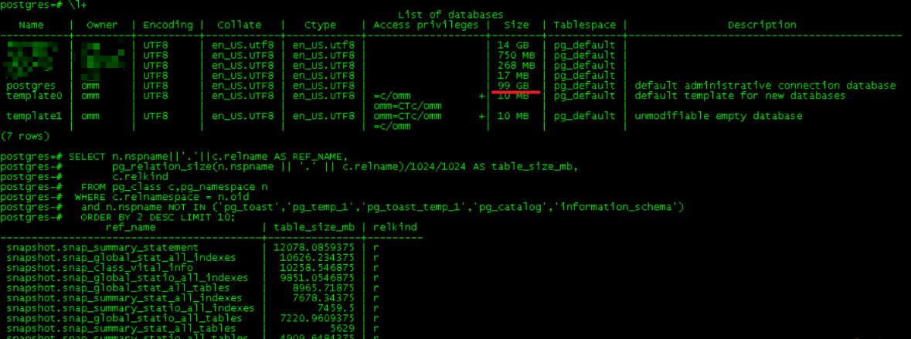

## 测试方案

- 方案一：修改快照留存参数，触发 snapshot，查看空间使用量是否减少
- 方案二：对大表进行 auvacuum full，查看空间使用量是否减少
- 方案三：设置表级参数，触发 autovacuum，查看空间使用量是否减少
- 方案四：关闭 wdr，查看空间使用量是否减少

### 方案一

```
--查看修改前数据库信息 \l+ select relname as table_name,       pg_size_pretty(pg_relation_size(schemaname||'.'||relname)) as table_size    from pg_stat_user_tables where table_name='snap_summary_statement';     select count(distinct snapshot_id) from snapshot.snap_summary_statement;
```

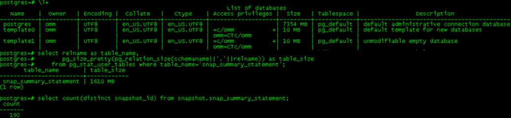

```
--修改留存天数 alter system set wdr_snapshot_retention_days=7; show wdr_snapshot_retention_days;
```

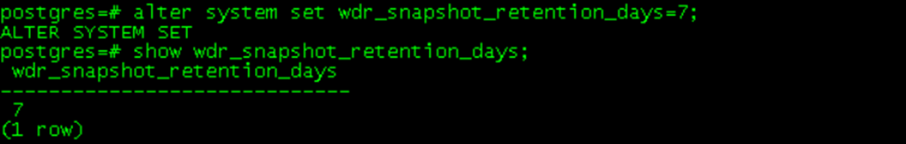

```
--快照执行后，触发清理流程 select create_wdr_snapshot(); \l+ select relname as table_name,       pg_size_pretty(pg_relation_size(schemaname||'.'||relname)) as table_size    from pg_stat_user_tables where table_name='snap_summary_statement';     select count(distinct snapshot_id) from snapshot.snap_summary_statement;
```

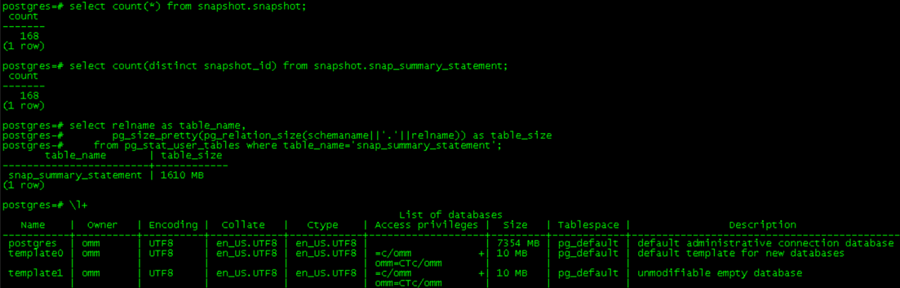

### 结论

只是留存时间，虽然条目数更改了，但是空间没有释放

### 方案二

```
--查看表操作前大小 select relname as table_name,       pg_size_pretty(pg_relation_size(schemaname||'.'||relname)) as table_size    from pg_stat_user_tables where table_name='snap_summary_statement';
```

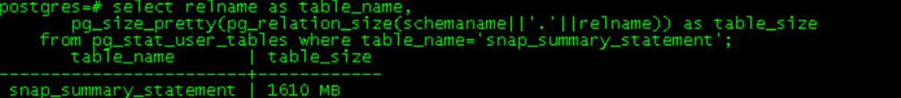

```
--执行命令，表数据量1.6G，大概2-5s完成 vacuum full snapshot.snap_summary_statement; select relname as table_name,       pg_size_pretty(pg_relation_size(schemaname||'.'||relname)) as table_size    from pg_stat_user_tables where table_name='snap_summary_statement';
```

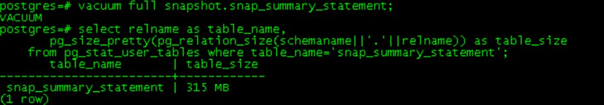

### 结论

使用 vacuum full 命令可以强制进行表清理，释放空间

### 方案三

```
--查看全局默认承诺书 show autovacuum_mode; show autovacuum_vacuum_scale_factor; show autovacuum_analyze_scale_factor; show autovacuum_vacuum_threshold; show autovacuum_analyze_threshold;
```

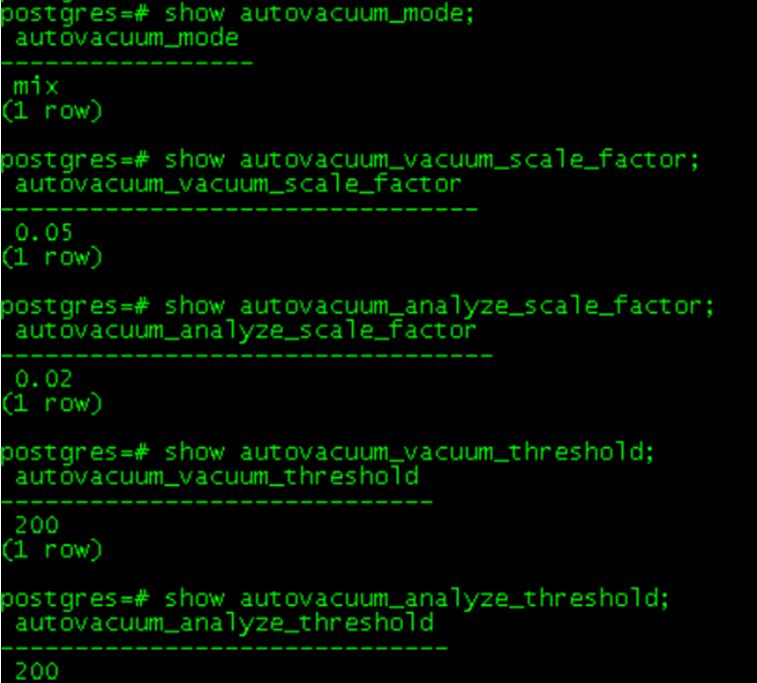

```
--查看表信息 select relname as table_name,       pg_size_pretty(pg_relation_size(schemaname||'.'||relname)) as table_size    from pg_stat_user_tables where table_name='snap_global_stat_all_indexes';     select schemaname||'.'||relname as table_name,       last_vacuum,       last_autovacuum,       last_analyze,       last_autoanalyze,       last_data_changed     from pg_stat_user_tables where relname='snap_global_stat_all_indexes'; --查看数据库启动时间与last_*_time的对比 select pg_postmaster_start_time();
```

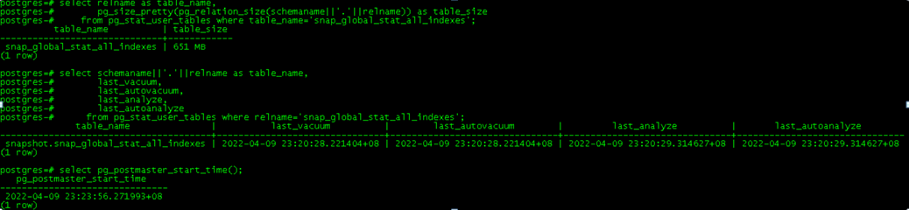

```
--修改表级参数 select relname,reltuples,reloptions from pg_class where relname='snap_global_stat_all_indexes'; alter table snapshot.snap_global_stat_all_indexes set  (autovacuum_vacuum_scale_factor=0.01); select relname,reltuples,reloptions from pg_class where relname='snap_global_stat_all_indexes';
```

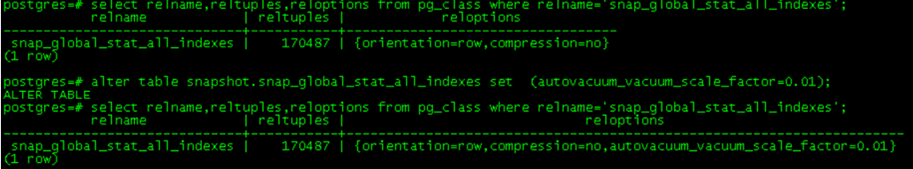

```
--最小收缩启动为148848*0.01+50 最小为1538rows，每个snapshot为886，即执行至多三次snaoshot即可 select create_wdr_snapshot(); select create_wdr_snapshot(); select create_wdr_snapshot();
```

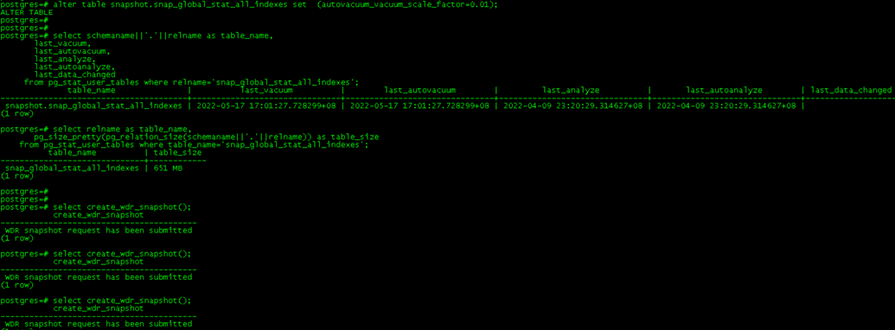

```
--查看表是否被自动vacuum，空间是否释放 select schemaname||'.'||relname as table_name,       last_vacuum,       last_autovacuum,       last_analyze,       last_autoanalyze,       last_data_changed     from pg_stat_user_tables where relname='snap_global_stat_all_indexes'; select relname as table_name,       pg_size_pretty(pg_relation_size(schemaname||'.'||relname)) as table_size    from pg_stat_user_tables where table_name='snap_global_stat_all_indexes';
```

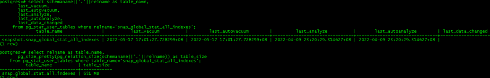

### 结论

表虽然触发了 autovacuum，但是空间还是没有被回收

### 方案四

```
--查看数据库总大小 \l+
```

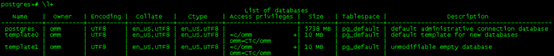

```
--操作 show enable_wdr_snapshot; alter system set enable_wdr_snapshot=off; show enable_wdr_snapshot; --查看结果 \l+
```

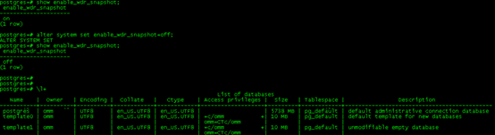

### 结论

空间没有任何变化

## 总结论

目前看除了 vacuum full 外，没有其他办法可以释放 WDR 空间。

## 补充

根据 WDR 特性拼接了一个脚本，对表进行批量的 vacuum full。

> 注意：生产上请务必在运行此脚本前，三思

```
--查看snapshot运行时间
select * from snapshot.snapshot order by 1 desc limit 10;

--拼接SQL
select 'vacuum full '||schemaname||'.'||relname||';',
       pg_size_pretty(pg_relation_size(schemaname||'.'||relname))
  from pg_stat_user_tables
   where schemaname='snapshot'
   order by pg_relation_size(schemaname||'.'||relname) desc;
```
