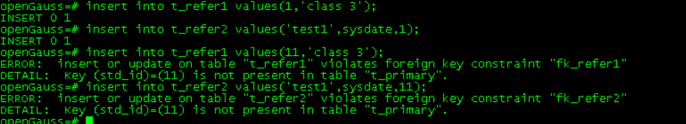
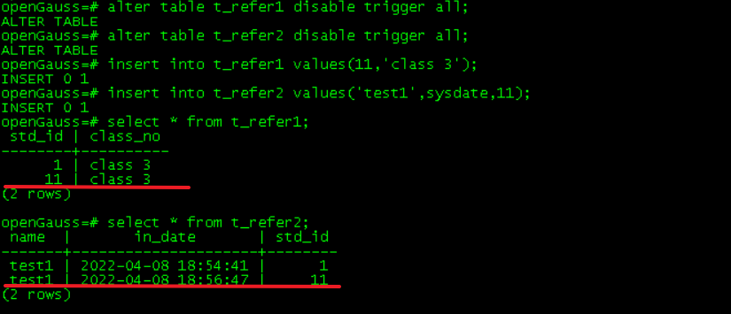
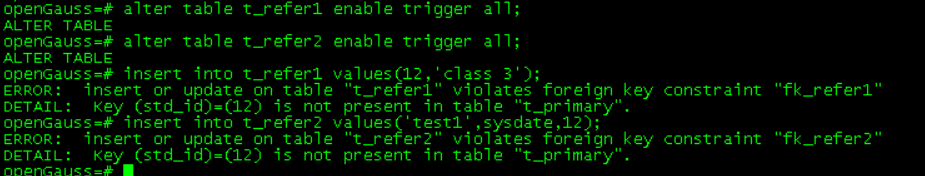
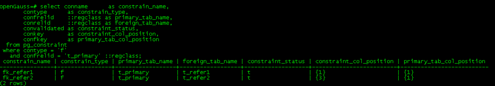
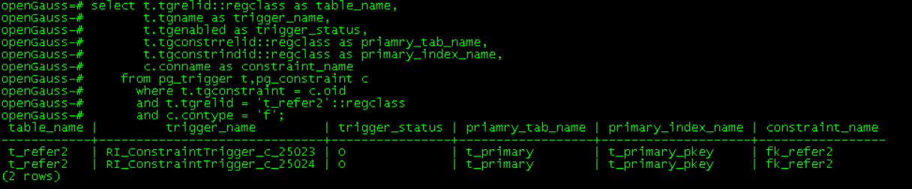

# MogDB - 外键约束管理/删除外键关联的主表数据步骤

本文出处：https://www.modb.pro/db/391471

## 记录 MogDB 数据库的外键常用操作：

### 版本

本文适用于 MogDB V2.0.1 及以上环境

### 创建外键

```
--创建主表
create table t_primary (std_id int primary key,name varchar);

--创建外表
create table t_refer1 (std_id int,class_no varchar);
create table t_refer2 (name varchar,in_date timestamp default sysdate,std_id int);

--创建外键约束
alter table t_refer1 add constraint fk_refer1 foreign key(std_id) references t_primary(std_id);

alter table t_refer2 add constraint fk_refer2 foreign key(std_id) references t_primary(std_id);

--主表插入数据(std_id=1 .. 10)
insert into t_primary select generate_series(1,10),'test';

--外键测试正确数据
insert into t_refer1 values(1,'class 3');
insert into t_refer2 values('test1',sysdate,1);

--外键测试错误数据
insert into t_refer1 values(11,'class 3');
insert into t_refer2 values('test1',sysdate,11);
```



### 失能外键

```
--disable外键
--只能注释掉表所有的触发器
alter table t_refer1 disable trigger all;
alter table t_refer2 disable trigger all;

--测试:再次插入错误数据
insert into t_refer1 values(11,'class 3');
insert into t_refer2 values('test1',sysdate,11);
```



### 使能外键

```
--enable外键
alter table t_refer1 enable trigger all;
alter table t_refer2 enable trigger all;

--测试:再次插入错误数据
insert into t_refer1 values(12,'class 3');
insert into t_refer2 values('test1',sysdate,12);
```



### 查询外键

```
--根据主表表名查询所有关联的外键约束
select conname      as constrain_name,
       contype      as constrain_type,
       confrelid    ::regclass as primary_tab_name,
       conrelid     ::regclass as foreign_tab_name,
       convalidated as constraint_status,
       conkey       as constraint_col_position,
       confkey      as primary_tab_col_position
  from pg_constraint
 where contype = 'f'
   and confrelid = 't_primary' ::regclass;

--查询表的触发器
select t.tgrelid::regclass as table_name,
       t.tgname as trigger_name,
       t.tgenabled as trigger_status,
       t.tgconstrrelid::regclass as priamry_tab_name,
       t.tgconstrindid::regclass as primary_index_name,
       c.conname as constraint_name
    from pg_trigger t,pg_constraint c
      where t.tgconstraint = c.oid
      and t.tgrelid = 't_refer2'::regclass
      and c.contype = 'f';

```





## 操作外键的常见场景操作步骤：

### 1、删除外键关联的主表数据，规避级联删除的方法

```
--停业务

--备份备表数据
create table b0_t_primary (like t_primary including all);
insert into b0_t_primary select * from t_primary;

--重置参数
set session_replication_role to replica;

--删除主表
delete from t_primary;

--置回参数
set session_replication_role to origin;

--启动业务
```
