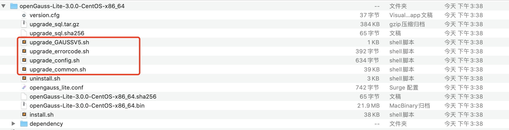

# MogDB 2.1.1 手工升级 3.0.0 实战分享

本文出处：[https://www.modb.pro/db/427627](https://www.modb.pro/db/427627)

## 1. 文件介绍

MogDB 3.0.0 版本于 2022 年 6 月 30 日发布。3.0.0 版本基于 2.1 版本进一步增强，并合入了 openGauss 3.0.0 版本的新增特性。upgrade 脚本是 openGauss_3.0.0 轻量版中才会有的手动升级脚本。我们将 4 个 shell 脚本打包放入 upgrade 目录中。



- **下载地址：**[https://www.opengauss.org/zh/download/](https://www.opengauss.org/zh/download/)

  

```
[omm@node1 upgrade]$ ls -lrt
total 876
-rwxrwxr-x  1 omm dbgrp   1100 Apr  1 18:34 upgrade_GAUSSV5.sh
-rwxrwxr-x  1 omm dbgrp    392 Apr  1 18:34 upgrade_errorcode.sh
drwxrwxr-x  2 omm dbgrp      6 Jun 22 15:54 pkg_2.1.0
drwxrwxr-x  2 omm dbgrp      6 Jun 22 15:54 pkg_2.0.1
-rwxrwxr-x  1 omm dbgrp    732 Jul  1 09:03 upgrade_config.sh
-rwxrwxr-x  1 omm dbgrp  38643 Jul  1 10:27 upgrade_common.sh
drwx------  2 omm dbgrp     90 Jul  1 11:24 bak
drwx------  4 omm dbgrp    125 Jul  1 11:27 tmp
-rw-------  1 omm dbgrp 837185 Jul  1 11:27 upgrade.log
drwxrwxr-x 10 omm dbgrp   4096 Jul  1 11:32 pkg_3.0.0
```

- upgrade_GAUSSV5.sh :主控文件，调用 upgrade_common.sh。
- upgrade_errorcode.sh:错误代码
- upgrade_config.sh:配置信息
- upgrade_common.sh:实际升级文件
- upgrade.log:升级日志
- pkg_2.1.1,pkg_3.0.0_beta1,pkg_3.0.0_beta2:数据库升级根位置
- bak:数据库低版本备份位置
- tmp:数据库临时目录

## 2. 添加环境变量 GAUSSDATA

添加 mogdb 2.1.1 的环境变量

```
[omm@node1 upgrade]cat ~/.bashrc
export GAUSSDATA=/mogdb/data/db1
export GAUSSHOME=/opt/mogdb/app
export PATH=$GAUSSHOME/bin:$PATH
export LD_LIBRARY_PATH=$GAUSSHOME/lib:$LD_LIBRARY_PATH
```

## 3. 配置文件解释

配置升级相关参数

```
[omm@node1 upgrade]vi upgrade_config.sh
#!/bin/bash
# Copyright (c) Huawei Technologies Co., Ltd. 2010-2022. All rights reserved.
# date: 2021-12-22
# version: 1.0

# 数据库监听端口
GAUSS_LISTEN_PORT="26000"

# 数据库管理员用户名
GAUSS_ADMIN_USER="omm"

#数据库升级回退日志路径
GAUSS_LOG_PATH="/home/omm/upgrade"

#数据库Mogdb 3.0.0升级根位置
GAUSS_UPGRADE_BASE_PATH="/home/omm/upgrade/pkg_3.0.0"

#数据库SQL包位置
GAUSS_SQL_TAR_PATH="/home/omm/upgrade/pkg_3.0.0"

#数据库低版本备份位置
GAUSS_BACKUP_BASE_PATH="/home/omm/upgrade/bak"

#数据库临时目录
GAUSS_TMP_PATH="/home/omm/upgrade/tmp"

#是否使用存在的bin解压包
GAUSS_UPGRADE_BIN_PATH=""

#需要同步的cluster config 列表
GAUSS_UPGRADE_SYNC_CONFIG_LIST=""
```

## 4. 实战流程

- ### 4.1 upgrade_pre

执行 upgrade_pre 命令，检查升级环境。

```
[mogdb@ecs-lee upgrade]$ sh upgrade_GAUSSV5.sh -t upgrade_pre
Current env value: GAUSSHOME is /home/mogdb/2.0.0, PGDATA is /home/mogdb/2.0.0_data/data.
Parse cmd line successfully.
Check available disk space successfully.
Big upgrade is needed!
Old version commitId is f892ccb7, version info is 92299
New version commitId is 03211457, version info is 92421
decompress upgrade_sql.tar.gz successfully.
kernel: CentOS
Bak gausshome successfully.
Bak postgresql.conf successfully.
Bak pg_hba.conf successfully.
begin decompress pkg in /home/mogdb/upgrade/tmp/install_bin_03211457
Decompress MogDB-2.1.1-CentOS-64bit.tar.bz2 successfully.
cp version.cfg successfully
input sql password:
input sql password:
The upgrade_pre step is executed successfully.
```

- ### 4.2 upgrade_bin

执行 upgrade_bin，升级版本。

```
[mogdb@ecs-lee upgrade]$ sh upgrade_GAUSSV5.sh -t upgrade_bin
Current env value: GAUSSHOME is /home/mogdb/2.0.0, PGDATA is /home/mogdb/2.0.0_data/data.
Parse cmd line successfully.
Binfile upgrade to new version successfully.
Delete guc successfully
start gaussdb by cmd: gs_ctl start  -D /home/mogdb/2.0.0_data/data  -o '-u 92299' --single_node
The upgrade_bin step is executed successfully.
```

- ### 4.3 upgrade_post

执行相关 upgrade sql 的语句，相当于 oracle 升级数字字典。

```
[mogdb@ecs-lee upgrade]$ sh upgrade_GAUSSV5.sh -t upgrade_post
Current env value: GAUSSHOME is /home/mogdb/2.0.0, PGDATA is /home/mogdb/2.0.0_data/data.
Parse cmd line successfully.
input sql password:
input sql password:
The upgrade_post step is executed successfully.
```

- ### 4.4 upgrade_commit

执行 upgrade_commit，最终提交。

```
[mogdb@ecs-lee upgrade]$ sh upgrade_GAUSSV5.sh -t upgrade_commit
Current env value: GAUSSHOME is /home/mogdb/2.0.0, PGDATA is /home/mogdb/2.0.0_data/data.
Parse cmd line successfully.
The upgrade_commit step is executed successfully.
```

- help

```
[mogdb@ecs-lee upgrade]$ sh upgrade_GAUSSV5.sh --help
Current env value: GAUSSHOME is /home/mogdb/2.0.0, PGDATA is /home/mogdb/2.0.0_data/data.

Usage: upgrade_GAUSSV5.sh [OPTION]
Arguments:
   -h|--help                   show this help, then exit
   -t                          upgrade_pre,upgrade_bin,upgrade_post,rollback_pre,rollback_bin,rollback_post,upgrade_commit
                               query_start_mode,switch_over
   --min_disk                  reserved upgrade disk space in MB, default 2048
   -m|--mode                   normal、primary、standby and cascade_standby
```

- upgrade_mode

```
upgrade_mode 参数说明: 标示升级模式。该参数不建议用户自己修改。 **取值范围:**整数，0~INT_MAX 0表示不在升级过程中。 1表示在就地升级过程中。 2表示在灰度升级过程中。 默认值: 0
```

## 5. 代码追溯

```
- upgrade_pre

  - current_step < 0 die "Step file may be changed invalid"
  - current_step < 1
    - upgrade_pre_step1 (check_disk check_version prepare_sql_all check_pkg bak_gauss decompress_pkg record_step 1)
    - upgrade_pre_step2 (check_db_process 'reload_upgrade_config upgrade_mode 2' exec_sql record_step 2)
  - current_step = 1
    - rollback_pre,upgrade_pre_step2
  - other "no need do upgrade_pre step"


- upgrade_bin

  - current_step < 0 die "Step file may be changed invalid"
  - current_step < 2 die "exec upgrade pre first"
  - current_step < 3
    - upgrade_bin_step4 (record_step 3 query_dn_role stop_dbnode cp_gauss_home_config_to_temp cp_pkg cp_temp_config_to_gauss_home guc_delete start_dbnode record_step 4)

- upgrade_post

  - current_step < 0 die "Step file may be changed invalid"
  - current_step < 4 die "You should exec upgrade_bin first"
  - current_step = 4
    - upgrade_post_step56 (check_db_process record_step 5 exec_sql record_step 6)
  - current_step = 5
    - rollback_post,upgrade_post_step56
  - other "no need do upgrade_post step"

- upgrade_commit

  - current_step = 0 die "No need commit,upgrade directly"
  - current_step -ne 6  die "Now you can't commit because the steps are wrong"
  - other
    - 'reload_upgrade_config upgrade_mode 0' record_step 0

- rollback_pre

  - current_step < 1 "no need do rollback_pre step"
  - current_step > 2 die "You should rollback_bin first"
  - other
    - check_db_process 'reload_upgrade_config upgrade_mode 2' record_step 1 exec_sql 'reload_upgrade_config upgrade_mode 0' record_step 0

- rollback_bin

  - current_step < 3 "no need do rollback_pre step"
  - current_step > 4 die "You should rollback_post first"
  - other
    - record_step 3  query_dn_role stop_dbnode cp_gauss_home_config_to_temp cp_temp_config_to_gauss_home 'set_upgrade_config upgrade_mode 2' start_dbnode record_step 2

- rollback_post
  - current_step < 5 "Cannot do rollback_post step"
  - other
    - check_db_process 'reload_upgrade_config upgrade_mode 2' record_step 5 exec_sql record_step 4

- prepare_sql_all
  - prepare_sql
    - upgrade_sql_file="upgrade_sql/upgrade_catalog_${dbname}/${action}_catalog_${dbname}_${temp_old:0:2}_${temp_old:2}.sql"
    - upgrade_sql_file="upgrade_sql/rollback_catalog_${dbname}/${action}_catalog_${dbname}_${temp_new:0:2}_${temp_new:2}.sql"
    - temp_old 92299 temp_new 92421

- exec_sql
  - rollback_pre
    - postgres temp_rollback_maindb.sql
    - others   temp_rollback_otherdb.sql
  - rollback_post
    - postgres temp_rollback-post_maindb.sql
    - others   temp_rollback-post_otherdb.sql
  - upgrade_pre
    - postgres temp_upgrade_maindb.sql
    - others   temp_upgrade_otherdb.sql
  - upgrade_post
    - postgres temp_upgrade-post_maindb.sql
    - others   temp_upgrade-post_otherdb.sql
```
