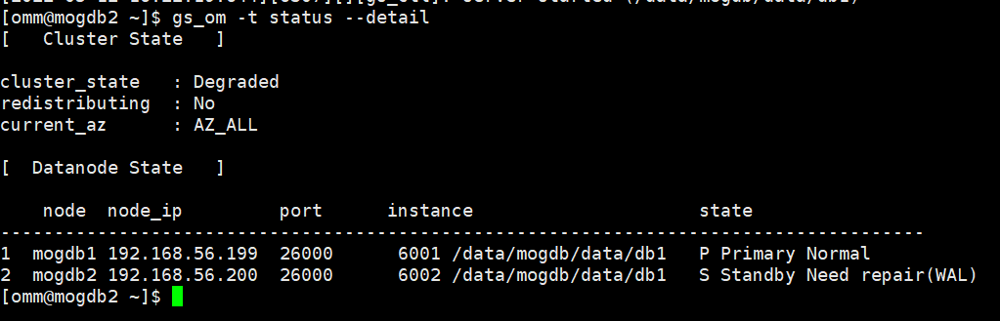
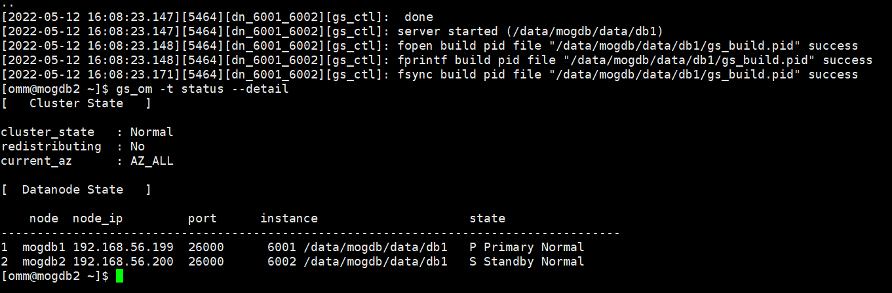

# MogDB 备机处于 standby need-repair(WAL)状态

本文出处：[https://www.modb.pro/db/402820](https://www.modb.pro/db/402820)

## 问题现象

Mogdb 主备环境，备机检查发现 Standby Need repair(WAL)故障。

## 原因分析

因网络故障、磁盘满等原因造成主备实例连接断开，主备日志不同步，导致数据库集群在启动时异常。

## 处理分析

通过 gs_ctl build -D 命令对故障节点进行重建，具体的操作方法请参见 Mogdb 工具参考中的 build 参数。

## 主备状态检查

## 修复后结果展示

