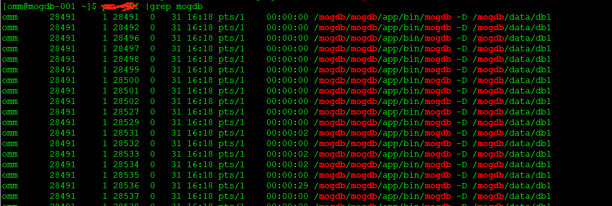

# MogDB 实例的删除

本文出处：[https://www.modb.pro/db/245460](https://www.modb.pro/db/245460)

1 查询 mogdb 的实例进程


2 根据 clusterconfig.xml 文件可以看出 gaussdbAppPath，gaussdbLogPath，gaussdbToolPath，corePath，clusterType 以及 dataNode1 的位置。

- gaussdbAppPath：app 的的安装路径
- gaussdbLogPath：mogdb 的数据库的日志目录
- gaussdbToolPath：mogdb 的 tool 的所在目录
- corePath：coredump 的目录
- clusterType：集群类型，但实例和 HA
- dataNode1：数据目录的路径
- clusterName：集群的名称
- nodeNames：节点的名称，其实就是主机名称
- backIp1s：后端主机的 ip 地址
- sn：device 的设备号
- dataPortBase：mogdb 的对外提供服务的端口

3 卸载 mogdb

- 现正常关闭 mogdb 数据库

  ```
  [omm@mogdb-001 mogdb]$ ps -ef |grep mogdb
  omm 833 25700 0 17:45 pts/1 00:00:00 grep --color=auto mogdb
  omm 28491 1 2 16:18 pts/1 00:01:46 /mogdb/mogdb/app/bin/mogdb -D /mogdb/data/db1

  [omm@mogdb-001 mogdb]$ gs_om -t stop

  Stopping cluster.
  =========================================

  Successfully stopped cluster.
  =========================================

  End stop cluster.
  [omm@mogdb-001 mogdb]$ ps -ef |grep mogdb
  omm 1408 25700 0 17:45 pts/1 00:00:00 grep --color=auto mogdb
  ```

- 先删除 gaussdbAppPath，gaussdbLogPath，gaussdbToolPath，corePath 路径里面的文件

  ```
  [omm@mogdb-001 mogdb]$ cd /mogdb/
  [omm@mogdb-001 mogdb]$ ls
  data mogdb
  [omm@mogdb-001 mogdb]$ cd mogdb/
  [omm@mogdb-001 mogdb]$ ls
  app app_01071903 corefile tools
  [omm@mogdb-001 mogdb]$ rm -rf tools app_01071903 corefile app
  [omm@mogdb-001 mogdb]$ ls
  ```

  删除 gaussdbLogPath 的日志文件

  ```
  [omm@mogdb-001 mogdb]$ ls -ld /var/log/mogdb/omm/*
  drwx------ 3 omm dbgrp 4096 Feb 6 16:18 /var/log/mogdb/omm/asp_data
  drwx------ 7 omm dbgrp 4096 Feb 6 16:18 /var/log/mogdb/omm/bin
  drwx------ 3 omm dbgrp 4096 Feb 6 16:18 /var/log/mogdb/omm/gs_profile
  drwx------ 2 omm dbgrp 4096 Feb 6 17:45 /var/log/mogdb/omm/om
  drwx------ 3 omm dbgrp 4096 Feb 6 16:18 /var/log/mogdb/omm/pg_audit
  drwx------ 3 omm dbgrp 4096 Feb 6 16:18 /var/log/mogdb/omm/pg_log
  drwx------ 3 omm dbgrp 4096 Feb 6 16:18 /var/log/mogdb/omm/pg_perf
  drwx------ 3 omm dbgrp 4096 Feb 6 16:18 /var/log/mogdb/omm/sql_monitor
  [omm@mogdb-001 mogdb]$ rm -rf /var/log/mogdb/omm/*
  [omm@mogdb-001 mogdb]$ ls -ld /var/log/mogdb/omm/*
  ls: cannot access /var/log/mogdb/omm/*: No such file or directory
  [omm@mogdb-001 mogdb]$ ls -ld /var/log/mogdb/omm/
  drwx------ 2 omm dbgrp 4096 Feb 6 17:49 /var/log/mogdb/omm/
  ```

> 注意：如果此时觉得卸载成功，那就高兴的太早了。因为在此安装的时候有一个步骤(set_finish_flag)会去检查环境变量，如果存在以前的会停止预安装，这样就导致安装失败，所以此时还需要清理一个文件，叫 omm 用户家目录下面的.bashrc 文件，正常的文件为

```
[omm@mogdb-001 ~]$ cat .bashrc

# .bashrc

# Source global definitions

if [ -f /etc/bashrc ]; then
. /etc/bashrc
fi
```

```
# Uncomment the following line if you don't like systemctl's auto-paging feature:
# export SYSTEMD_PAGER=

# User specific aliases and functions
export GPHOME=/mogdb/mogdb/tools
export PATH=$ GPHOME/script/gspylib/pssh/bin:$ GPHOME/script:$ PATH
export LD_LIBRARY_PATH=$ GPHOME/lib:$ LD_LIBRARY_PATH
export PYTHONPATH=$ GPHOME/lib
export GAUSSHOME=/mogdb/mogdb/app
export PATH=$ GAUSSHOME/bin:$ PATH
export LD_LIBRARY_PATH=$ GAUSSHOME/lib:$ LD_LIBRARY_PATH
export S3_CLIENT_CRT_FILE=$GAUSSHOME/lib/client.crt
export GAUSS_VERSION=2.1.0
export PGHOST=/mogdb/mogdb/tools/omm_mppdb
export GAUSSLOG=/var/log/mogdb/omm
umask 077
export GAUSS_ENV=2
export GS_CLUSTER_NAME=dbCluster
```

所以在下载最后异步需要去检查这个文件，记得去讲这些 export 开头的环境变量清除了，这样在重新安装就没有任何的问题了。
