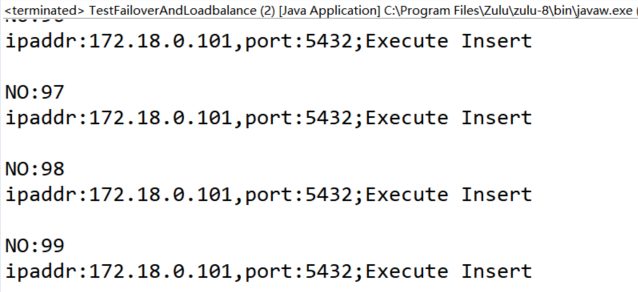
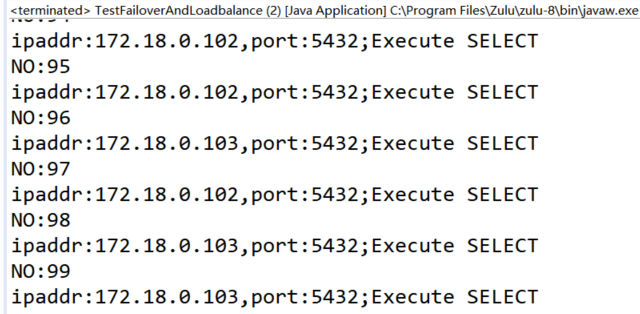
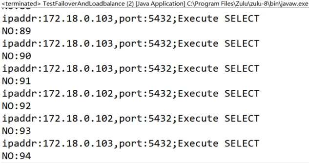

# MogDB 数据库 JDBC 读写分离测试

本文出处：[https://www.modb.pro/db/411365](https://www.modb.pro/db/411365)

### 一、MogDB 一主两备环境搭建

采用 docker 方式搭建，主要步骤如下：

先提前 pull 镜像：

```
docker pull swr.cn-north-4.myhuaweicloud.com/mogdb/mogdb:2.1.1
```

搭建主库

```
docker network create --subnet=172.18.0.0/16 myNetwork

docker run --name mogdb1 \
--publish 8001:5432 \
--network myNetwork --ip 172.18.0.101 --privileged=true \
--hostname mogdb1 --detach \
--env GS_PORT=5432 \
--env OG_SUBNET=172.18.0.0/16 \
--env GS_PASSWORD=Admin@1234 \
--env NODE_NAME=mogdb1 \
--env REPL_CONN_INFO="replconninfo1 = 'localhost=172.18.0.101 localport=5434 localservice=5432 remotehost=172.18.0.102 remoteport=5434 remoteservice=5432 '\n" \
swr.cn-north-4.myhuaweicloud.com/mogdb/mogdb:2.1.1 -M primary

```

搭建 standby1

```
docker run --name mogdb2 \
--publish 8002:5432 \
--network myNetwork --ip 172.18.0.102 --privileged=true \
--hostname mogdb2 --detach \
--env GS_PORT=5432 \
--env OG_SUBNET=172.18.0.0/16 \
--env GS_PASSWORD=Admin@1234 \
--env NODE_NAME=mogdb2 \
--env REPL_CONN_INFO="replconninfo1 = 'localhost=172.18.0.102 localport=5434 localservice=5432 remotehost=172.18.0.101 remoteport=5434 remoteservice=5432 '\n" \
swr.cn-north-4.myhuaweicloud.com/mogdb/mogdb:2.1.1 -M standby

```

搭建 standby2

```
docker run --name mogdb3 \
--publish 8003:5432 \
--network myNetwork --ip 172.18.0.103 --privileged=true \
--hostname mogdb3 --detach \
--env GS_PORT=5432 \
--env OG_SUBNET=172.18.0.0/16 \
--env GS_PASSWORD=Admin@1234 \
--env NODE_NAME=mogdb3 \
--env REPL_CONN_INFO="replconninfo2 = 'localhost=172.18.0.103 localport=5434 localservice=5432 remotehost=172.18.0.101 remoteport=5434 remoteservice=5432 '\n" \
swr.cn-north-4.myhuaweicloud.com/mogdb/mogdb:2.1.1 -M standby

```

修改 mogdb1 主库 replconninfo2 参数

```
alter system set replconninfo2 = 'localhost=172.18.0.101 localport=5434 localservice=5432 remotehost=172.18.0.103 remoteport=5434 remoteservice=5432 ';

```

确认一主两备流复制关系正常，从 mogdb1 主库进行如下查询

```
omm@mogdb1:~$ gs_ctl query -D /var/lib/mogdb/data/
[2022-06-03 06:24:43.397][104][][gs_ctl]: gs_ctl query ,datadir is /var/lib/mogdb/data
 HA state:
	local_role                     : Primary
	static_connections             : 2
	db_state                       : Normal
	detail_information             : Normal

 Senders info:
	sender_pid                     : 80
	local_role                     : Primary
	peer_role                      : Standby
	peer_state                     : Normal
	state                          : Streaming
	sender_sent_location           : 0/6001BC0
	sender_write_location          : 0/6001BC0
	sender_flush_location          : 0/6001BC0
	sender_replay_location         : 0/6001BC0
	receiver_received_location     : 0/6001BC0
	receiver_write_location        : 0/6001BC0
	receiver_flush_location        : 0/6001BC0
	receiver_replay_location       : 0/6001BC0
	sync_percent                   : 100%
	sync_state                     : Sync
	sync_priority                  : 1
	sync_most_available            : On
	channel                        : 172.18.0.101:5434-->172.18.0.103:41886

	sender_pid                     : 81
	local_role                     : Primary
	peer_role                      : Standby
	peer_state                     : Normal
	state                          : Streaming
	sender_sent_location           : 0/6001BC0
	sender_write_location          : 0/6001BC0
	sender_flush_location          : 0/6001BC0
	sender_replay_location         : 0/6001BC0
	receiver_received_location     : 0/6001BC0
	receiver_write_location        : 0/6001BC0
	receiver_flush_location        : 0/6001BC0
	receiver_replay_location       : 0/6001BC0
	sync_percent                   : 100%
	sync_state                     : Potential
	sync_priority                  : 1
	sync_most_available            : On
	channel                        : 172.18.0.101:5434-->172.18.0.102:42836

 Receiver info:
No information

```

如上可以从 mogdb1 看到 101 主库到两个备库 102 和 103 的流复制正常。

创建远程连接用户及测试表

```
create user admin password 'Admin@1234'; \c - admin create table test(id int,info varchar);
```

### 二、JDBC 连接测试

#### JDBC 主要连接参数介绍

> loadBalanceHosts 控制负载均衡，默认为 false，开启后依序选择一个 ip1:port 进行连接。

> targetServerType 指定 Connection 连接特定状态的数据库实例，可选状态值包括 any, primary, master, slave, secondary, preferSlave and preferSecondary

targetServerType 常见使用 master、slave、preferSlave 这三个值。master 连接可读可写节点，slave 连接可读节点。preferSlave 优先选择可读节点：如果没有可用的读节点，则连接主节点(比如所有备节点宕机)，才会去连接可写节点。

#### 常见写场景配置

```
targetServerType=master
```

此时应用层可以进行写操作。

参考代码如下

```
import java.sql.Connection;
import java.sql.DriverManager;
import java.sql.PreparedStatement;
import java.sql.ResultSet;
import java.sql.SQLException;

public class TestFailoverAndLoadbalance {
    public static void main(String[] args) {
        testLoadBalance();
    }
    public static void testLoadBalance() {
        for (int i = 0; i < 100; i++) {
            try (Connection conn = DriverManager.getConnection(
                    "jdbc:postgresql://192.168.137.227:8001,192.168.137.227:8002,192.168.137.227:8003/postgres?targetServerType=master&loadBalanceHosts=true&loggerLevel=off",
                    "admin", "Admin@1234")) {
                System.out.println("NO:" + i);
                //execSelect(conn);
                execInsert(conn);
                conn.close();
            } catch (SQLException se) {
                System.out.println(se.getMessage());
            } catch (Exception e) {
                e.printStackTrace();
            } finally {
            } // end try
        }
    }

    public static void execSelect(Connection conn) {
        try (PreparedStatement pstmt = conn.prepareStatement("SELECT inet_server_addr() as ipaddr,inet_server_port() as port");
                ResultSet rs = pstmt.executeQuery();) {
            while (rs.next()) {
                String ipaddr = rs.getString("ipaddr");
                String port = rs.getString("port");
                System.out.println("ipaddr:" + ipaddr +",port:" + port + ";Execute SELECT");
            }
        } catch (SQLException se) {
            System.out.println(se.getMessage());
        } catch (Exception e) {
            e.printStackTrace();
        } finally {
        } // end try
    } // end
    public static void execInsert(Connection conn) {
        try (PreparedStatement pstmtSelect = conn.prepareStatement("SELECT inet_server_addr() as ipaddr,inet_server_port() as port");
                ResultSet rs = pstmtSelect.executeQuery();
                PreparedStatement pstmtInsert = conn.prepareStatement("insert into test(id,info) values(?,?)");) {
            while (rs.next()) {
                String ipaddr = rs.getString("ipaddr");
                String port = rs.getString("port");
                System.out.println("ipaddr:" + ipaddr +",port:" + port + ";Execute Insert");
                System.out.println();
                pstmtInsert.setInt(1, 2);
                pstmtInsert.setString(2, "2");
                pstmtInsert.executeUpdate();
            }
        } catch (SQLException se) {
            System.out.println(se.getMessage());
        } catch (Exception e) {
            e.printStackTrace();
        } finally {
        } // end try
    } // end
}

```


可以看到写操作会连接主节点，即使我们把 loadBalanceHosts 设置为 true。

节点角色如果发生切换，应用层也是可以自动连接到写节点，这个可以再最后再测试，否则需要修复 docker 容器里的流复制关系。

#### 常见读场景配置

```
loadBalanceHosts=true&targetServerType=preferSlave jdbc代码调整这两行 execSelect(conn); //execInsert(conn);
```

下面对比测试下 targetServerType=slave 与 targetServerType=preferSlave 的区别
至少有一个备节点存活的场景下，两者没什么差别

- targetServerType=slave
  
- targetServerType=preferSlave
  

没有可用备节点的场景下，preferSlave 会尝试连接主库，而 slave 会报错。
停止两个备节点 mogdb2 和 mogdb3

```
# docker stop mogdb2 mogdb3
targetServerType=slave
targetServerType=preferSlave
```
