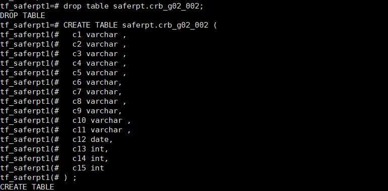
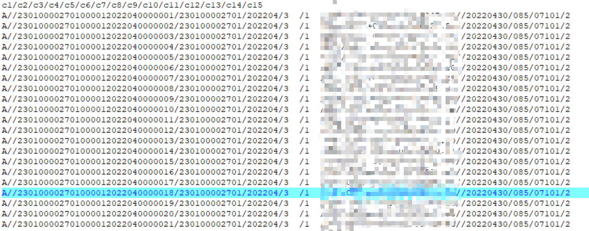
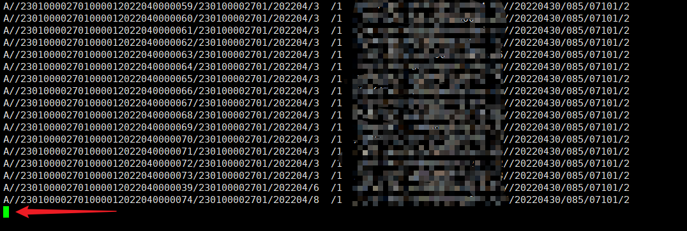

# Mogdb - copy 报错 ERROR: missing data for column

本文出处：[https://www.modb.pro/db/419967](https://www.modb.pro/db/419967)

### 故障现象

使用 copy 命令在进行数据导入时，出现报错：ERROR: missing data for column “c2”


### 故障原因

在测试库上模拟重建故障环境

```
drop table if exists saferpt.crb_g02_002; CREATE TABLE saferpt.crb_g02_002 (  c1 varchar ,  c2 varchar ,  c3 varchar ,  c4 varchar ,  c5 varchar ,  c6 varchar,  c7 varchar,  c8 varchar ,  c9 varchar,  c10 varchar ,  c11 varchar ,  c12 date,  c13 int,  c14 int,  c15 int ) ;
```



建立测试 dat 文件

```
vi /tmp/test.dat
```



模拟故障

```
copy crb_g02_002 from '/tmp/test.dat' encoding 'GBK' delimiter '/';
```


### 故障处理

感觉故障提示，有两个推断：

- 推断一：表的列数和 dat 文件中的列数对不上，再仔细对比了表和 dat 文件后，发现列数一致。
- 推断二：dat 文件问题

根据推断二进行排查，偶然发现 dat 文本最底下的部分有一个空行，如下图：

将该空行删除掉，在运行 copy 命令后，发现故障消失。

```
copy crb_g02_002 from '/tmp/test.dat' encoding 'GBK' delimiter '/';
COPY 74
```
