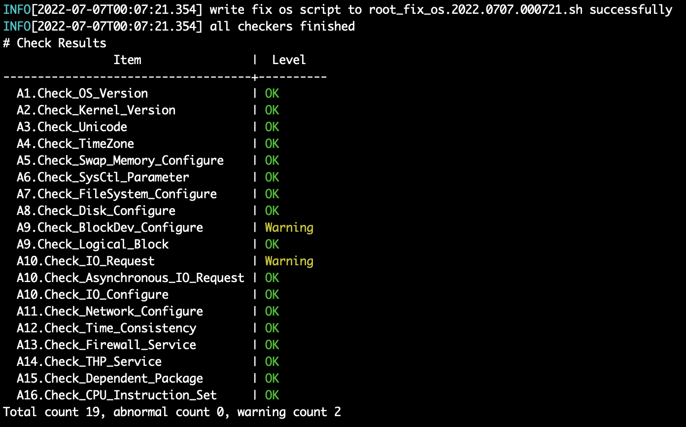

# PTK 一键安装 MogDB

本文出处：[https://www.modb.pro/db/429683](https://www.modb.pro/db/429683)

### PTK 介绍

PTK (Provisioning Toolkit)是一款针对 MogDB 数据库开发的软件安装和运维工具，仅需要执行一行命令即可帮助用户便捷地完成 MogDB 数据库的安装部署。

建议将 PTK 部署在运维管理平台，方便统一管理多套数据库集群。

官方文档地址：[https://docs.mogdb.io/zh/ptk/v0.2/overview](https://docs.mogdb.io/zh/ptk/v0.2/overview)

### 与 OM 对比

|            | PTK                                     | OM                                 |
| ---------- | :-------------------------------------- | ---------------------------------- |
| 支持系统   | Windows、Linux、MacOS                   | Linux                              |
| 支持版本   | MogDB 所有版本                          | MogDB 3.0 及以下所有版本           |
| 软件下载   | 在线/离线                               | 离线                               |
| 部署方式   | 与数据库解偶，可管理多套数据库集群      | 与数据库部署在一起，一对一管理     |
| 软件升级   | 与数据库解偶，自升级                    | 需要与数据库同步升级               |
| 数据库安装 | 即支持根据系统自动选择， 也支持离线指定 | 仅支持离线指定                     |
| 内核参数   | 自动生成修复文本，可一键修复            | 有些参数值有待优化                 |
| 配置文件   | 通俗易懂                                | 目录地址设置不当会 preinstall 失败 |
| 网络检测   | 多 IP 自动探活                          | -                                  |
| 兼容性     | 兼容 gs_om，会创建 gs_om 需要的静态文件 | -                                  |

### 安装部署

#### 下载 PTK

```
--在线下载
[root@node1 software]# curl --proto '=https' --tlsv1.2 -sSf https://cdn-mogdb.enmotech.com/ptk/install.sh | sh
info: downloading ptk package
Warning: Not enforcing strong cipher suites for TLS, this is potentially less secure
Detected shell: bash
Shell profile:  /root/.bash_profile
ptk has been added to PATH in /root/.bash_profile
open a new terminal or source /root/.bash_profile to active it
Installed path: /root/.ptk/bin/ptk

[root@node1 software]# source ~/.bash_profile
[root@node1 software]# ptk --version
PTK Version: v0.2.3
Go Version: go1.17.1
Build Date: 2022-07-04T13:06:48Z
Git Hash: d064a36

--离线下载
参考： https://docs.mogdb.io/zh/ptk/v0.2/install
```

#### 配置文件

[配置文件](https://docs.mogdb.io/zh/ptk/v0.2/config)可以自己根据官方文档自己写，也可以使用命令生成配置文件模版

**生成配置文件**

```
[root@node1 ~]# cd ~/.ptk/ [root@node1 .ptk]# ptk template > config.yaml
```

**编辑配置文件**

```
--密码加密
[root@node1 .ptk]# ptk encrypt omm
omm: pTk6YjM5YWY4MmM8QzxCPEU/Qm5UWFZGXzB4bldmcHI3T1lKMEVXeXltZzVBemU3V3EwcWpvbXJrM2dlSzg=
[root@node1 .ptk]# ptk encrypt MogDB@0701
MogDB@0701: pTk6MDQ2Y2U0ZDE8QzxCPEU/RE8ycy1UZFpEZ0xSMU9PQzRZMkpoY2JuT0x2Z05FbG9pZDlBMm5hZlFEVzQ=

--编辑后配置文件展示
[root@node1 .ptk]# cat config.yaml |grep -v '#'
global:
  cluster_name: "MogDB3.0"
  user: "omm"
  group: "dbgrp"
  db_password: "pTk6MDQ2Y2U0ZDE8QzxCPEU/RE8ycy1UZFpEZ0xSMU9PQzRZMkpoY2JuT0x2Z05FbG9pZDlBMm5hZlFEVzQ="
  db_port: 26000
  cm_server_port: 15300
  base_dir: "/opt/mogdb"
  app_dir: "/opt/mogdb/app"
  log_dir: "/opt/mogdb/log"
  data_dir: "/data/mogdb"
  tool_dir: "/opt/mogdb/tool"
  cm_dir: "/opt/mogdb/cm"
  ssh_option:
     port: 22
     user: root
     password: "pTk6MDQ2Y2U0ZDE8QzxCPEU/RE8ycy1UZFpEZ0xSMU9PQzRZMkpoY2JuT0x2Z05FbG9pZDlBMm5hZlFEVzQ="


db_servers:
  - host: "192.168.122.221"
    db_port: 26000
    ha_port: 26001
    role: "primary"
  - host: "192.168.122.157"
    db_port: 26000
    ha_port: 26001
    role: "standby"
  - host: "192.168.122.68"
    db_port: 26000
    ha_port: 26001
    role: "standby"
```

#### 检查操作系统

**检查命令**

```
ptk checkos -i A1,A2,A3   # 要检查多个状态，请按以下格式输入项目：“-i A1,A2,A3”。
ptk checkos -i A          # 检查全部检查项
ptk checkos -i A --detail # 加上--detail 会显示详细信息
详细信息请查看帮助文档 ptk checkos --help
```

**检查等级**

- OK：符合预期值，满足安装需求
- Warning: 不符合预期值，但可以满足安装需求
- Abnormal: 不满足安装要求，可能会导致安装过程失败，需根据 PTK 给出的修改建议脚本，人工执行修改
- ExecuteError: 执行错误，该等级表示 PTK 在检查时执行命令失败，可能为用户环境工具缺失或内部 BUG，需根据实际错误提示进行修正

**在安装数据库之前，需确保所有的检查项都在 OK 或 Warning 级别，如果存在 Abnormal 的检查结果，在安装时会报错退出。**

```
--检查所有节点
[root@node1 .ptk]# ptk checkos -i A -f config.yaml
INFO[2022-07-06T09:48:23.777] local ip: 192.168.122.221
[host 192.168.122.221]: not found tool: bzip2
[host 192.168.122.221]: not found tool: lsof
[host 192.168.122.221]: not found tool: ifconfig
[host 192.168.122.221]: not found package: numactl
[host 192.168.122.68]: not found tool: bzip2
[host 192.168.122.68]: not found tool: lsof
[host 192.168.122.68]: not found package: numactl
[host 192.168.122.157]: not found tool: bzip2
[host 192.168.122.157]: not found tool: lsof
[host 192.168.122.157]: not found package: numactl
Please installed the above missing packages first before do other operations
[PTK-4010] the system does not meet installation requirements

--安装依赖包
[root@node1 .ptk]# yum -y install bzip2.x86_64 bzip2-devel.x86_64 lsof.x86_64 numactl.x86_64 numactl-devel.x86_64 net-tools.x86_64

--再次检查
[root@node1 .ptk]# ptk checkos -i A -f config.yaml
--执行系统检查，不但会将不符合安装需求的检查项列出来，还会生成一个修复脚本，脚本的格式为root_fix_os.%Y.%m%d.%H%M%S.sh
```


```
--执行修复脚本 在集群内所有节点执行，脚本内容略 [root@node1 .ptk]# bash root_fix_os.2022.0707.000721.sh
```



#### 集群安装验证

```
[root@node1 .ptk]# ptk install -y -f config.yaml --install-cm
.
.
.
[root@node1 .ptk]# ptk ls
  cluster_name |       instances       | user |  data_dir   | db_version
---------------+-----------------------+------+-------------+--------------
  MogDB3.0     | 192.168.122.221:26000 | omm  | /data/mogdb | MogDB-3.0.0
               | 192.168.122.157:26000 |      |             |
               | 192.168.122.68:26000  |      |             |
[root@node1 .ptk]# ptk cluster status -n MogDB3.0

[   Cluster State   ]

database_version			: MogDB-3.0.0
cluster_name				: MogDB3.0
cluster_state   			: Normal
current_az      			: AZ_ALL

[  Datanode State   ]

   id  |       ip        | port  | user | instance | db_role | state
-------+-----------------+-------+------+----------+---------+---------
  6003 | 192.168.122.68  | 26000 | omm  | dn_6003  | primary | Normal
  6001 | 192.168.122.221 | 26000 | omm  | dn_6001  | standby | Normal
  6002 | 192.168.122.157 | 26000 | omm  | dn_6002  | standby | Normal
```

#### 集群卸载

```
[root@node1 .ptk]# ptk uninstall -n MogDB3.0
=============================
global:
  cluster_name: MogDB3.0
  user: omm
  group: dbgrp
  app_dir: /opt/mogdb/app
  data_dir: /data/mogdb
  log_dir: /opt/mogdb/log
  tool_dir: /opt/mogdb/tool
  tmp_dir: /opt/mogdb/tmp
  cm_server_port: 15300
db_servers:
- host: 192.168.122.68
  db_port: 26000
  role: primary
  az_name: AZ1
  az_priority: 1
- host: 192.168.122.221
  db_port: 26000
  role: standby
  az_name: AZ1
  az_priority: 1
- host: 192.168.122.157
  db_port: 26000
  role: standby
  az_name: AZ1
  az_priority: 1

=============================
Do you really want to uninstall this cluster? Please confirm carefully[Y|Yes](default=N) Y
Do you want to delete db data '/data/mogdb'?[Y|Yes](default=N) Y
Do you want to delete user 'omm'?[Y|Yes](default=N) Y
.
.
.
PTK 命令参考ptk candidate - 打印 PTK 支持的软件版本列表
ptk checkos - 检查集群服务器系统依赖是否满足安装数据库需求
ptk encrypt - 提供一个便捷的方式来加密您的文本或密码
ptk env - 打印 PTK 环境变量信息
ptk install - 基于给定的拓扑配置部署MogDB数据库集群
ptk ls - 列出所有MogDB集群列表
ptk self - 操作 PTK 自身安装包
ptk cluster -数据库集群操作
ptk template - 打印配置模板
ptk uninstall - 卸载 MogDB 数据库集群
ptk gen-om-xml - 生成 gs_om 的 XML 配置文件
ptk version - 打印 PTK 版本
ptk completion - 为指定的 shell 生成自动补全脚本
```
