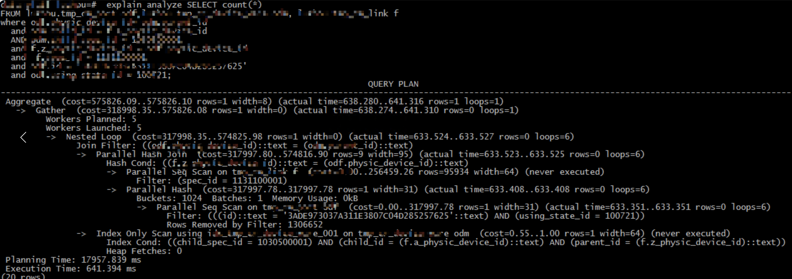
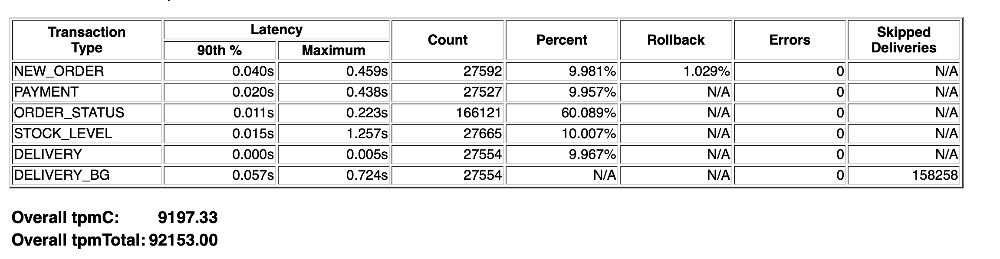
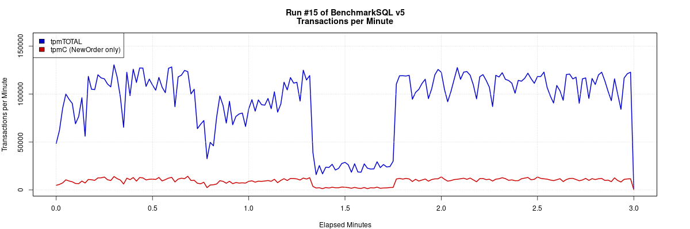
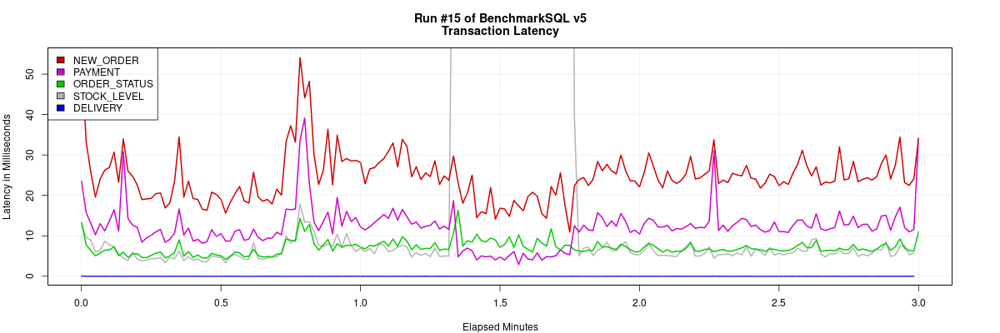
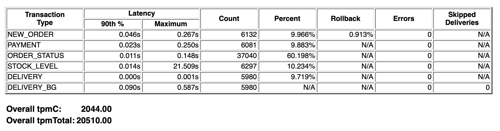
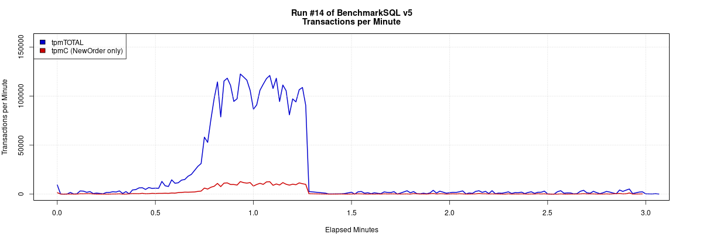
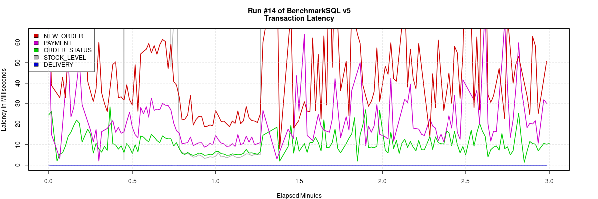
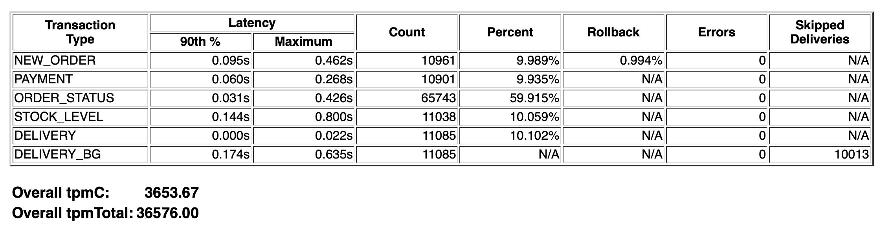
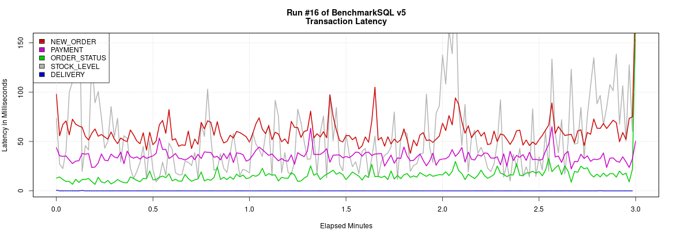

# default_statistics_target 参数对 PG 和 MogDB 性能影响测试和分析

本文出处：[https://www.modb.pro/db/230160](https://www.modb.pro/db/230160)

前段时间在某客户生产环境优化 PG 查询性能时发现一个很有意思的现象，一个统计信息相关参数可以很大程度上影响 SQL 的性能。近期在学习 MogDB，就对比 PG 和 MogDB 做了个小测试 。



上图是对有性能问题的 SQL 做分析的截图，可以看到一个很奇怪的现象 Planning Time 占比较大，甚至远远大于具体执行的时间 Execution Time。

参考官方文档对 Planning Time 的解释’The `Planning time` shown by `EXPLAIN ANALYZE` is the time it took to generate the query plan from the parsed query and optimize it. It does not include parsing or rewriting.’。这说明生成查询计划和优化花费了较多的时间。

经过排查我们发现 Planning Time 耗时较长是由于系统参数 default_statistics_target 被设置成 10000 导致的。default_statistics_target 是用来控制默认统计信息目标的参数，默认值 100、最大值 10000，也可以建表时使用`SET STATISTICS`为每一列指定不同的值。 参考官方文档的描述`Larger values increase the time needed to do ANALYZE, but might improve the quality of the planner's estimates` , 增加这个参数会这增加 analyze 的时间，但能提升执行计划的质量。但在现实的场景中事实上上对 analyze 和 查询性能都会造成较大的影响。

简单分析下原因。

参数 default_statistics_target 会直接影响 Analyze 时采样的默认样本数。在 Analyze 时默认取 300\*default_statistics_target 个随机块，再使用 Vitter 算法创建随机样本。

```
postgres=# select name,setting from pg_settings where name ='default_statistics_target';
           name            | setting
---------------------------+---------
 default_statistics_target | 100
(1 row)

[omm@mogdb ~]$ gs_guc set -I all -N all -c "default_statistics_target=10000"
Begin to perform the total nodes: 3.
Popen count is 3, Popen success count is 3, Popen failure count is 0.
Begin to perform gs_guc for datanodes.
Command count is 3, Command success count is 3, Command failure count is 0.

Total instances: 3. Failed instances: 0.
ALL: Success to perform gs_guc!

[omm@mogdb ~]$ gs_om -t restart

postgres=# select name,setting from pg_settings where name ='default_statistics_target';
           name            | setting
---------------------------+---------
 default_statistics_target | 10000
(1 row)

```

并且 default_statistics_target 也会影响统计信息中直方图的桶数。如果 numhist 的值大于 default_statistics_target，则按 default_statistics_target 统计。 直方图的桶数越多，就会影响优化器的执行效率。（具体原因待深入分析）

```
num_mcv = stats->attr->attstattarget;
num_bins = stats->attr->attstattarget;


num_hist = ndistinct - num_mcv;
		if (num_hist > num_bins)
			num_hist = num_bins + 1;

if (num_hist > num_bins)
			num_hist = num_bins + 1;


```

另外为什么要乘以 300，注释中也给出了相关的解释 因为使用了 log 函数，所以表的大小对结果的影响较少，300\*直方图的数量能覆盖大多数的需求。

```
/*-------------------- 	 * The following choice of minrows is based on the paper 	 * "Random sampling for histogram construction: how much is enough?" 	 * by Surajit Chaudhuri, Rajeev Motwani and Vivek Narasayya, in 	 * Proceedings of ACM SIGMOD International Conference on Management 	 * of Data, 1998, Pages 436-447.  Their Corollary 1 to Theorem 5 	 * says that for table size n, histogram size k, maximum relative 	 * error in bin size f, and error probability gamma, the minimum 	 * random sample size is 	 *		r = 4 * k * ln(2*n/gamma) / f^2 	 * Taking f = 0.5, gamma = 0.01, n = 10^6 rows, we obtain 	 *		r = 305.82 * k 	 * Note that because of the log function, the dependence on n is 	 * quite weak; even at n = 10^12, a 300*k sample gives <= 0.66 	 * bin size error with probability 0.99.  So there's no real need to 	 * scale for n, which is a good thing because we don't necessarily 	 * know it at this point. 	 *-------------------- */
```

在 PG 测试环境设置 default_statistics_target 参数分别为默认的 100 和最大值 10000，使用 BenchmarkSQL 在相同的测试参数下做 TPCC 测试，观察该参数对 tpmC 的影响。

### Postgresql

PG 版本为 12.7

```
tpcc_db=# select version();                                                 version                                                  --------------------------------------------------------------------------------------------------------- PostgreSQL 12.7 on x86_64-pc-linux-gnu, compiled by gcc (GCC) 4.8.5 20150623 (Red Hat 4.8.5-44), 64-bit (1 row)
```

加载数据并测试

```
[root@mogdb run]# sh runDatabaseBuild.sh props.postgres

[root@mogdb run]# sh runBenchmark.sh props.postgres
16:11:48,303 [main] INFO   jTPCC : Term-00,
16:11:48,305 [main] INFO   jTPCC : Term-00, +-------------------------------------------------------------+
16:11:48,305 [main] INFO   jTPCC : Term-00,      BenchmarkSQL v5.0
16:11:48,305 [main] INFO   jTPCC : Term-00, +-------------------------------------------------------------+
16:11:48,305 [main] INFO   jTPCC : Term-00,  (c) 2003, Raul Barbosa
16:11:48,305 [main] INFO   jTPCC : Term-00,  (c) 2004-2016, Denis Lussier
16:11:48,307 [main] INFO   jTPCC : Term-00,  (c) 2016, Jan Wieck
16:11:48,307 [main] INFO   jTPCC : Term-00, +-------------------------------------------------------------+
16:11:48,307 [main] INFO   jTPCC : Term-00,
16:11:48,307 [main] INFO   jTPCC : Term-00, db=postgres
16:11:48,307 [main] INFO   jTPCC : Term-00, driver=org.postgresql.Driver
16:11:48,307 [main] INFO   jTPCC : Term-00, conn=jdbc:postgresql://172.16.71.29:5432/tpcc_db?prepareThreshold=1&batchMode=on&fetchsize=10&loggerLevel=off&autoReconnect=true
16:11:48,308 [main] INFO   jTPCC : Term-00, user=tpcc
16:11:48,308 [main] INFO   jTPCC : Term-00,
16:11:48,308 [main] INFO   jTPCC : Term-00, warehouses=10
16:11:48,308 [main] INFO   jTPCC : Term-00, terminals=20
16:11:48,309 [main] INFO   jTPCC : Term-00, runMins=3
16:11:48,309 [main] INFO   jTPCC : Term-00, limitTxnsPerMin=0
16:11:48,309 [main] INFO   jTPCC : Term-00, terminalWarehouseFixed=false
16:11:48,309 [main] INFO   jTPCC : Term-00,
16:11:48,309 [main] INFO   jTPCC : Term-00, newOrderWeight=10
16:11:48,309 [main] INFO   jTPCC : Term-00, paymentWeight=10
16:11:48,309 [main] INFO   jTPCC : Term-00, orderStatusWeight=60
16:11:48,309 [main] INFO   jTPCC : Term-00, deliveryWeight=10
16:11:48,309 [main] INFO   jTPCC : Term-00, stockLevelWeight=10
16:11:48,310 [main] INFO   jTPCC : Term-00,
16:11:48,310 [main] INFO   jTPCC : Term-00, resultDirectory=mogdb_result_%tY-%tm-%td_%tH%tM%tS
16:11:48,310 [main] INFO   jTPCC : Term-00, osCollectorScript=null
16:11:48,310 [main] INFO   jTPCC : Term-00,
16:11:48,321 [main] INFO   jTPCC : Term-00, copied props.postgres to mogdb_result_2021-12-31_161148/run.properties
16:11:48,322 [main] INFO   jTPCC : Term-00, created mogdb_result_2021-12-31_161148/data/runInfo.csv for runID 15
16:11:48,322 [main] INFO   jTPCC : Term-00, writing per transaction results to mogdb_result_2021-12-31_161148/data/result.csv
16:11:48,322 [main] INFO   jTPCC : Term-00,
16:11:48,404 [main] INFO   jTPCC : Term-00, C value for C_LAST during load: 204
16:11:48,404 [main] INFO   jTPCC : Term-00, C value for C_LAST this run:    126
16:11:48,405 [main] INFO   jTPCC : Term-00,
Term-00, Running Average tpmTOTAL: 92146.82    Current tpmTOTAL: 2988612    Memory Usage: 59MB / 105MB
16:14:48,587 [Thread-5] INFO   jTPCC : Term-00,
16:14:48,588 [Thread-5] INFO   jTPCC : Term-00,
16:14:48,588 [Thread-5] INFO   jTPCC : Term-00, Measured tpmC (NewOrders) = 9195.03
16:14:48,588 [Thread-5] INFO   jTPCC : Term-00, Measured tpmTOTAL = 92130.3
16:14:48,588 [Thread-5] INFO   jTPCC : Term-00, Session Start     = 2021-12-31 16:11:48
16:14:48,588 [Thread-5] INFO   jTPCC : Term-00, Session End       = 2021-12-31 16:14:48
16:14:48,588 [Thread-5] INFO   jTPCC : Term-00, Transaction Count = 276459
16:14:48,588 [Thread-5] INFO   jTPCC : executeTime[Payment]=339035
16:14:48,588 [Thread-5] INFO   jTPCC : executeTime[Order-Status]=1111348
16:14:48,588 [Thread-5] INFO   jTPCC : executeTime[Delivery]=883458
16:14:48,589 [Thread-5] INFO   jTPCC : executeTime[Stock-Level]=588809
16:14:48,589 [Thread-5] INFO   jTPCC : executeTime[New-Order]=676662

```





清理测试数据

```
[root@mogdb run]# sh runDatabaseDestroy.sh props.postgres
# ------------------------------------------------------------
# Loading SQL file ./sql.common/tableDrops.sql
# ------------------------------------------------------------
drop table bmsql_config;
drop table bmsql_new_order;
drop table bmsql_order_line;
drop table bmsql_oorder;
drop table bmsql_history;
drop table bmsql_customer;
drop table bmsql_stock;
drop table bmsql_item;
drop table bmsql_district;
drop table bmsql_warehouse;
drop sequence bmsql_hist_id_seq;

```

修改 PG 的配置，将 default_statistics_target 从默认的 100 改成 10000；

```
tpcc_db=# select name,setting from pg_settings where name ='default_statistics_target';
           name            | setting
---------------------------+---------
 default_statistics_target | 100
(1 row)

tpcc_db=# alter system set default_statistics_target=10000;
ALTER SYSTEM
tpcc_db=# select pg_reload_conf();
 pg_reload_conf
----------------
 t
(1 row)

tpcc_db=# select name,setting from pg_settings where name ='default_statistics_target';
           name            | setting
---------------------------+---------
 default_statistics_target | 10000
(1 row)

```

再次测试

```
[root@mogdb run]# sh runDatabaseBuild.sh props.postgres

[root@mogdb run]# sh runBenchmark.sh props.postgres
16:03:00,023 [main] INFO   jTPCC : Term-00,
16:03:00,025 [main] INFO   jTPCC : Term-00, +-------------------------------------------------------------+
16:03:00,026 [main] INFO   jTPCC : Term-00,      BenchmarkSQL v5.0
16:03:00,026 [main] INFO   jTPCC : Term-00, +-------------------------------------------------------------+
16:03:00,026 [main] INFO   jTPCC : Term-00,  (c) 2003, Raul Barbosa
16:03:00,026 [main] INFO   jTPCC : Term-00,  (c) 2004-2016, Denis Lussier
16:03:00,028 [main] INFO   jTPCC : Term-00,  (c) 2016, Jan Wieck
16:03:00,028 [main] INFO   jTPCC : Term-00, +-------------------------------------------------------------+
16:03:00,028 [main] INFO   jTPCC : Term-00,
16:03:00,029 [main] INFO   jTPCC : Term-00, db=postgres
16:03:00,029 [main] INFO   jTPCC : Term-00, driver=org.postgresql.Driver
16:03:00,029 [main] INFO   jTPCC : Term-00, conn=jdbc:postgresql://172.16.71.29:5432/tpcc_db?prepareThreshold=1&batchMode=on&fetchsize=10&loggerLevel=off&autoReconnect=true
16:03:00,029 [main] INFO   jTPCC : Term-00, user=tpcc
16:03:00,029 [main] INFO   jTPCC : Term-00,
16:03:00,029 [main] INFO   jTPCC : Term-00, warehouses=10
16:03:00,029 [main] INFO   jTPCC : Term-00, terminals=20
16:03:00,031 [main] INFO   jTPCC : Term-00, runMins=3
16:03:00,031 [main] INFO   jTPCC : Term-00, limitTxnsPerMin=0
16:03:00,031 [main] INFO   jTPCC : Term-00, terminalWarehouseFixed=false
16:03:00,031 [main] INFO   jTPCC : Term-00,
16:03:00,031 [main] INFO   jTPCC : Term-00, newOrderWeight=10
16:03:00,031 [main] INFO   jTPCC : Term-00, paymentWeight=10
16:03:00,031 [main] INFO   jTPCC : Term-00, orderStatusWeight=60
16:03:00,031 [main] INFO   jTPCC : Term-00, deliveryWeight=10
16:03:00,032 [main] INFO   jTPCC : Term-00, stockLevelWeight=10
16:03:00,032 [main] INFO   jTPCC : Term-00,
16:03:00,032 [main] INFO   jTPCC : Term-00, resultDirectory=mogdb_result_%tY-%tm-%td_%tH%tM%tS
16:03:00,032 [main] INFO   jTPCC : Term-00, osCollectorScript=null
16:03:00,032 [main] INFO   jTPCC : Term-00,
16:03:00,045 [main] INFO   jTPCC : Term-00, copied props.postgres to mogdb_result_2021-12-31_160300/run.properties
16:03:00,045 [main] INFO   jTPCC : Term-00, created mogdb_result_2021-12-31_160300/data/runInfo.csv for runID 14
16:03:00,045 [main] INFO   jTPCC : Term-00, writing per transaction results to mogdb_result_2021-12-31_160300/data/result.csv
16:03:00,045 [main] INFO   jTPCC : Term-00,
16:03:00,132 [main] INFO   jTPCC : Term-00, C value for C_LAST during load: 109
16:03:00,132 [main] INFO   jTPCC : Term-00, C value for C_LAST this run:    211
16:03:00,132 [main] INFO   jTPCC : Term-00,
Term-00, Running Average tpmTOTAL: 20052.14    Current tpmTOTAL: 664776    Memory Usage: 21MB / 105MB
16:06:04,432 [Thread-10] INFO   jTPCC : Term-00,
16:06:04,432 [Thread-10] INFO   jTPCC : Term-00,
16:06:04,433 [Thread-10] INFO   jTPCC : Term-00, Measured tpmC (NewOrders) = 1997.57
16:06:04,433 [Thread-10] INFO   jTPCC : Term-00, Measured tpmTOTAL = 20044.52
16:06:04,433 [Thread-10] INFO   jTPCC : Term-00, Session Start     = 2021-12-31 16:03:00
16:06:04,433 [Thread-10] INFO   jTPCC : Term-00, Session End       = 2021-12-31 16:06:04
16:06:04,433 [Thread-10] INFO   jTPCC : Term-00, Transaction Count = 61530
16:06:04,434 [Thread-10] INFO   jTPCC : executeTime[Payment]=79515
16:06:04,434 [Thread-10] INFO   jTPCC : executeTime[Order-Status]=241522
16:06:04,434 [Thread-10] INFO   jTPCC : executeTime[Delivery]=299391
16:06:04,434 [Thread-10] INFO   jTPCC : executeTime[Stock-Level]=2863537
16:06:04,434 [Thread-10] INFO   jTPCC : executeTime[New-Order]=165739

```





从测试结果看 default_statistics_target=10000 配置下 tpmC 只有默认配置下的 22.2%，TPS 和事务的延迟也有明显差距。实验证明增大该参数会对实例的性能造成较大影响。

综上，从原理和实验看在 PG 中 default_statistics_target 的值不要设置的太大，默认值 100 应该还是一个不错的选择。

### MogDB

近期在测试 MogDB，很好奇修改这个参数是否对 MogDB 的性能也有很大的影响，在测试环境简单跑了下 TPCC 测试。【本地测试环境硬件性能比 PG 差很多，tpmC 结果不要横向比较】同样设置 default_statistics_target 参数分别为默认的 100 和最大值 10000。

```
[root@mogdb run]# cd /root/benchmarksql/run/
[root@mogdb run]# sh runDatabaseBuild.sh props.mogdb
# ------------------------------------------------------------
# Loading SQL file ./sql.postgres/buildFinish.sql
# ------------------------------------------------------------
-- ----
-- Extra commands to run after the tables are created, loaded,
-- indexes built and extra's created.
-- PostgreSQL version.
-- ----
vacuum analyze;

```

启动测试

```
[root@mogdb run]# sh runBenchmark.sh props.mogdb
16:32:08,768 [main] INFO   jTPCC : Term-00,
16:32:08,772 [main] INFO   jTPCC : Term-00, +-------------------------------------------------------------+
16:32:08,772 [main] INFO   jTPCC : Term-00,      BenchmarkSQL v5.0
16:32:08,772 [main] INFO   jTPCC : Term-00, +-------------------------------------------------------------+
16:32:08,772 [main] INFO   jTPCC : Term-00,  (c) 2003, Raul Barbosa
16:32:08,772 [main] INFO   jTPCC : Term-00,  (c) 2004-2016, Denis Lussier
16:32:08,776 [main] INFO   jTPCC : Term-00,  (c) 2016, Jan Wieck
16:32:08,777 [main] INFO   jTPCC : Term-00, +-------------------------------------------------------------+
16:32:08,777 [main] INFO   jTPCC : Term-00,
16:32:08,777 [main] INFO   jTPCC : Term-00, db=postgres
16:32:08,777 [main] INFO   jTPCC : Term-00, driver=org.postgresql.Driver
16:32:08,777 [main] INFO   jTPCC : Term-00, conn=jdbc:postgresql://172.16.71.29:26000/tpcc_db?prepareThreshold=1&batchMode=on&fetchsize=10&loggerLevel=off&autoReconnect=true
16:32:08,777 [main] INFO   jTPCC : Term-00, user=tpcc
16:32:08,777 [main] INFO   jTPCC : Term-00,
16:32:08,777 [main] INFO   jTPCC : Term-00, warehouses=10
16:32:08,777 [main] INFO   jTPCC : Term-00, terminals=20
16:32:08,778 [main] INFO   jTPCC : Term-00, runMins=3
16:32:08,779 [main] INFO   jTPCC : Term-00, limitTxnsPerMin=0
16:32:08,779 [main] INFO   jTPCC : Term-00, terminalWarehouseFixed=false
16:32:08,779 [main] INFO   jTPCC : Term-00,
16:32:08,779 [main] INFO   jTPCC : Term-00, newOrderWeight=10
16:32:08,779 [main] INFO   jTPCC : Term-00, paymentWeight=10
16:32:08,779 [main] INFO   jTPCC : Term-00, orderStatusWeight=60
16:32:08,779 [main] INFO   jTPCC : Term-00, deliveryWeight=10
16:32:08,779 [main] INFO   jTPCC : Term-00, stockLevelWeight=10
16:32:08,779 [main] INFO   jTPCC : Term-00,
16:32:08,779 [main] INFO   jTPCC : Term-00, resultDirectory=mogdb_result_%tY-%tm-%td_%tH%tM%tS
16:32:08,779 [main] INFO   jTPCC : Term-00, osCollectorScript=null
16:32:08,779 [main] INFO   jTPCC : Term-00,
16:32:08,796 [main] INFO   jTPCC : Term-00, copied props.mogdb to mogdb_result_2021-12-31_163208/run.properties
16:32:08,796 [main] INFO   jTPCC : Term-00, created mogdb_result_2021-12-31_163208/data/runInfo.csv for runID 16
16:32:08,796 [main] INFO   jTPCC : Term-00, writing per transaction results to mogdb_result_2021-12-31_163208/data/result.csv
16:32:08,796 [main] INFO   jTPCC : Term-00,
16:32:08,868 [main] INFO   jTPCC : Term-00, C value for C_LAST during load: 36
16:32:08,869 [main] INFO   jTPCC : Term-00, C value for C_LAST this run:    130
16:32:08,869 [main] INFO   jTPCC : Term-00,
Term-00, Running Average tpmTOTAL: 36569.79    Current tpmTOTAL: 1185828    Memory Usage: 23MB / 105MB
16:35:09,089 [Thread-12] INFO   jTPCC : Term-00,
16:35:09,089 [Thread-12] INFO   jTPCC : Term-00,
16:35:09,089 [Thread-12] INFO   jTPCC : Term-00, Measured tpmC (NewOrders) = 3651.92
16:35:09,094 [Thread-12] INFO   jTPCC : Term-00, Measured tpmTOTAL = 36558.86
16:35:09,094 [Thread-12] INFO   jTPCC : Term-00, Session Start     = 2021-12-31 16:32:09
16:35:09,094 [Thread-12] INFO   jTPCC : Term-00, Session End       = 2021-12-31 16:35:09
16:35:09,094 [Thread-12] INFO   jTPCC : Term-00, Transaction Count = 109728
16:35:09,094 [Thread-12] INFO   jTPCC : executeTime[Payment]=377510
16:35:09,094 [Thread-12] INFO   jTPCC : executeTime[Order-Status]=975192
16:35:09,094 [Thread-12] INFO   jTPCC : executeTime[Delivery]=1057319
16:35:09,094 [Thread-12] INFO   jTPCC : executeTime[Stock-Level]=557707
16:35:09,095 [Thread-12] INFO   jTPCC : executeTime[New-Order]=631551

```





清理测试数据

```
[root@mogdb run]# sh runDatabaseDestroy.sh props.mogdb
# ------------------------------------------------------------
# Loading SQL file ./sql.common/tableDrops.sql
# ------------------------------------------------------------
drop table bmsql_config;
drop table bmsql_new_order;
drop table bmsql_order_line;
drop table bmsql_oorder;
drop table bmsql_history;
drop table bmsql_customer;
drop table bmsql_stock;
drop table bmsql_item;
drop table bmsql_district;
drop table bmsql_warehouse;
drop sequence bmsql_hist_id_seq;

```

我们修改 MogDB 的配置，将 default_statistics_target 从默认的 100 改成 10000；

```
postgres=# select name,setting from pg_settings where name ='default_statistics_target';
           name            | setting
---------------------------+---------
 default_statistics_target | 100
(1 row)

[omm@mogdb ~]$ gs_guc set -I all -N all -c "default_statistics_target=10000"
Begin to perform the total nodes: 3.
Popen count is 3, Popen success count is 3, Popen failure count is 0.
Begin to perform gs_guc for datanodes.
Command count is 3, Command success count is 3, Command failure count is 0.

Total instances: 3. Failed instances: 0.
ALL: Success to perform gs_guc!

[omm@mogdb ~]$ gs_om -t restart

postgres=# select name,setting from pg_settings where name ='default_statistics_target';
           name            | setting
---------------------------+---------
 default_statistics_target | 10000
(1 row)

```

再次进行 benchmarksql 测试

```
[root@mogdb run]# sh runDatabaseBuild.sh props.mogdb

[root@mogdb run]# sh runBenchmark.sh props.mogdb
16:47:36,924 [main] INFO   jTPCC : Term-00,
16:47:36,928 [main] INFO   jTPCC : Term-00, +-------------------------------------------------------------+
16:47:36,928 [main] INFO   jTPCC : Term-00,      BenchmarkSQL v5.0
16:47:36,929 [main] INFO   jTPCC : Term-00, +-------------------------------------------------------------+
16:47:36,929 [main] INFO   jTPCC : Term-00,  (c) 2003, Raul Barbosa
16:47:36,929 [main] INFO   jTPCC : Term-00,  (c) 2004-2016, Denis Lussier
16:47:36,935 [main] INFO   jTPCC : Term-00,  (c) 2016, Jan Wieck
16:47:36,935 [main] INFO   jTPCC : Term-00, +-------------------------------------------------------------+
16:47:36,935 [main] INFO   jTPCC : Term-00,
16:47:36,935 [main] INFO   jTPCC : Term-00, db=postgres
16:47:36,936 [main] INFO   jTPCC : Term-00, driver=org.postgresql.Driver
16:47:36,936 [main] INFO   jTPCC : Term-00, conn=jdbc:postgresql://172.16.71.29:26000/tpcc_db?prepareThreshold=1&batchMode=on&fetchsize=10&loggerLevel=off&autoReconnect=true
16:47:36,936 [main] INFO   jTPCC : Term-00, user=tpcc
16:47:36,936 [main] INFO   jTPCC : Term-00,
16:47:36,936 [main] INFO   jTPCC : Term-00, warehouses=10
16:47:36,936 [main] INFO   jTPCC : Term-00, terminals=20
16:47:36,937 [main] INFO   jTPCC : Term-00, runMins=3
16:47:36,937 [main] INFO   jTPCC : Term-00, limitTxnsPerMin=0
16:47:36,938 [main] INFO   jTPCC : Term-00, terminalWarehouseFixed=false
16:47:36,938 [main] INFO   jTPCC : Term-00,
16:47:36,938 [main] INFO   jTPCC : Term-00, newOrderWeight=10
16:47:36,938 [main] INFO   jTPCC : Term-00, paymentWeight=10
16:47:36,938 [main] INFO   jTPCC : Term-00, orderStatusWeight=60
16:47:36,938 [main] INFO   jTPCC : Term-00, deliveryWeight=10
16:47:36,938 [main] INFO   jTPCC : Term-00, stockLevelWeight=10
16:47:36,938 [main] INFO   jTPCC : Term-00,
16:47:36,938 [main] INFO   jTPCC : Term-00, resultDirectory=mogdb_result_%tY-%tm-%td_%tH%tM%tS
16:47:36,938 [main] INFO   jTPCC : Term-00, osCollectorScript=null
16:47:36,938 [main] INFO   jTPCC : Term-00,
16:47:36,954 [main] INFO   jTPCC : Term-00, copied props.mogdb to mogdb_result_2021-12-31_164736/run.properties
16:47:36,954 [main] INFO   jTPCC : Term-00, created mogdb_result_2021-12-31_164736/data/runInfo.csv for runID 17
16:47:36,955 [main] INFO   jTPCC : Term-00, writing per transaction results to mogdb_result_2021-12-31_164736/data/result.csv
16:47:36,955 [main] INFO   jTPCC : Term-00,
16:47:37,037 [main] INFO   jTPCC : Term-00, C value for C_LAST during load: 201
16:47:37,037 [main] INFO   jTPCC : Term-00, C value for C_LAST this run:    117
16:47:37,038 [main] INFO   jTPCC : Term-00,
Term-00, Running Average tpmTOTAL: 33621.25    Current tpmTOTAL: 1088436    Memory Usage: 27MB / 105MB
16:50:37,412 [Thread-17] INFO   jTPCC : Term-00,
16:50:37,413 [Thread-17] INFO   jTPCC : Term-00,
16:50:37,413 [Thread-17] INFO   jTPCC : Term-00, Measured tpmC (NewOrders) = 3404.5
16:50:37,413 [Thread-17] INFO   jTPCC : Term-00, Measured tpmTOTAL = 33593.8
16:50:37,413 [Thread-17] INFO   jTPCC : Term-00, Session Start     = 2021-12-31 16:47:37
16:50:37,413 [Thread-17] INFO   jTPCC : Term-00, Session End       = 2021-12-31 16:50:37
16:50:37,413 [Thread-17] INFO   jTPCC : Term-00, Transaction Count = 100884
16:50:37,414 [Thread-17] INFO   jTPCC : executeTime[Payment]=336881
16:50:37,414 [Thread-17] INFO   jTPCC : executeTime[Order-Status]=818460
16:50:37,414 [Thread-17] INFO   jTPCC : executeTime[Delivery]=923761
16:50:37,414 [Thread-17] INFO   jTPCC : executeTime[Stock-Level]=960065
16:50:37,414 [Thread-17] INFO   jTPCC : executeTime[New-Order]=561205


```

可见 MogDB 经过优化，增加 default_statistics_target 参数对性能的影响可以忽略。小结综上，default_statistics_target 参数对 PG 性能影响较大，建议保持默认值。而 MogDB 经过优化可以选择较高的 default_statistics_target 值，这样可以记录更精确的统计信息用以获得更准确的执行计划。
